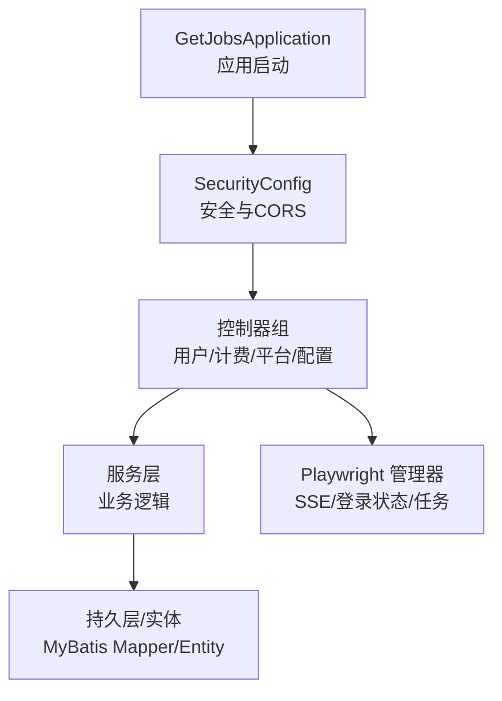
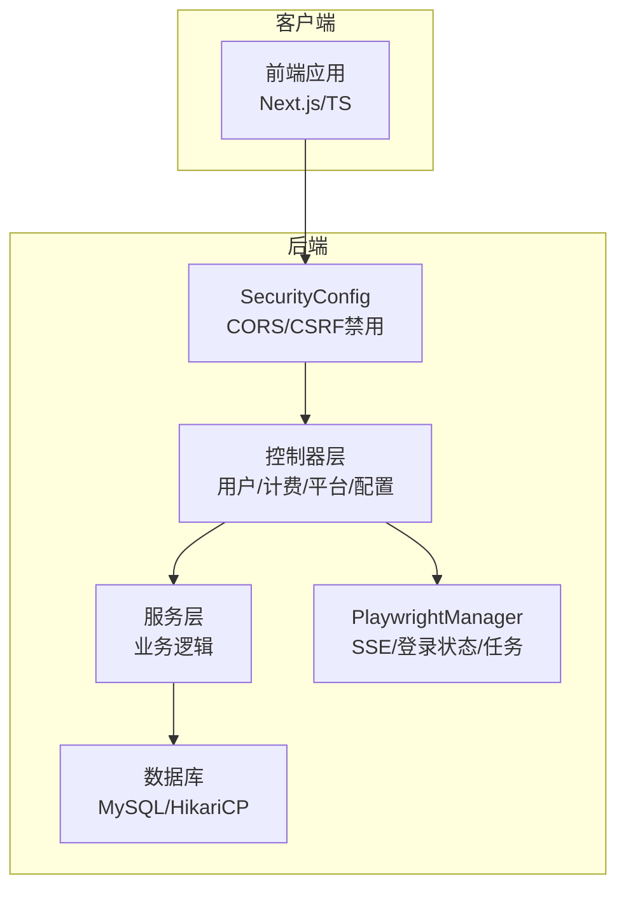
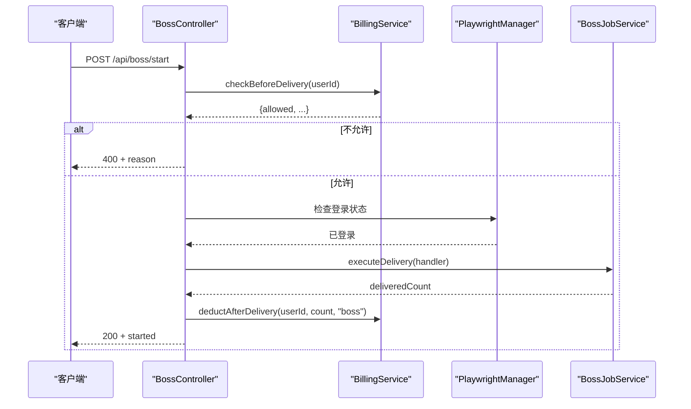
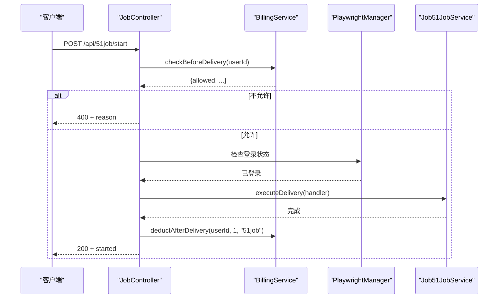
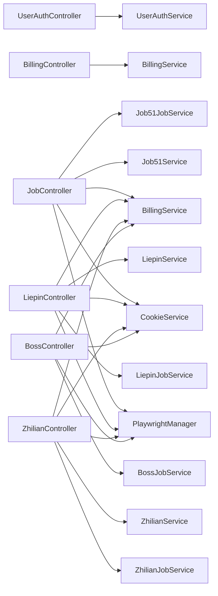

# API 接口文档

<cite>
**本文档引用的文件**
- [GetJobsApplication.java](file://backend/src/main/java/com/getjobs/GetJobsApplication.java)
- [application.yaml](file://backend/src/main/resources/application.yaml)
- [SecurityConfig.java](file://backend/src/main/java/com/getjobs/application/config/SecurityConfig.java)
- [CorsConfig.java](file://backend/src/main/java/com/getjobs/application/config/CorsConfig.java)
- [UserAuthController.java](file://backend/src/main/java/com/getjobs/application/controller/UserAuthController.java)
- [BillingController.java](file://backend/src/main/java/com/getjobs/application/controller/BillingController.java)
- [JobController.java](file://backend/src/main/java/com/getjobs/application/controller/JobController.java)
- [AdminAuthController.java](file://backend/src/main/java/com/getjobs/application/controller/AdminAuthController.java)
- [ConfigController.java](file://backend/src/main/java/com/getjobs/application/controller/ConfigController.java)
- [LiepinController.java](file://backend/src/main/java/com/getjobs/application/controller/LiepinController.java)
- [ZhilianController.java](file://backend/src/main/java/com/getjobs/application/controller/ZhilianController.java)
- [BossController.java](file://backend/src/main/java/com/getjobs/application/controller/BossController.java)
- [CommonOptionController.java](file://backend/src/main/java/com/getjobs/application/controller/CommonOptionController.java)
- [SearchPresetController.java](file://backend/src/main/java/com/getjobs/application/controller/SearchPresetController.java)
</cite>

## 目录
1. [简介](#简介)
2. [项目结构](#项目结构)
3. [核心组件](#核心组件)
4. [架构总览](#架构总览)
5. [详细组件分析](#详细组件分析)
6. [依赖分析](#依赖分析)
7. [性能考虑](#性能考虑)
8. [故障排除指南](#故障排除指南)
9. [结论](#结论)
10. [附录](#附录)

## 简介
本文件为 GetJobs 平台的完整 API 接口文档，覆盖用户认证、平台配置、求职操作、计费管理、后台管理等接口组。文档提供每个 API 的 HTTP 方法、URL 模式、请求参数、响应格式与错误码说明，并包含 JWT 认证机制使用方法、安全注意事项、版本管理、速率限制与跨域配置说明，以及客户端集成指南与最佳实践建议。

## 项目结构
后端采用 Spring Boot 架构，主要模块如下：
- 应用启动类：负责应用初始化与调度启用
- 配置文件：包含数据库、日志、服务器端口、JWT、Playwright Agent 等配置
- 安全配置：禁用默认表单/CSRF，启用 CORS
- 控制器层：按业务域划分，包含用户认证、计费、各招聘平台（Boss、51job、猎聘、智联）、通用配置与搜索预设等

**图示来源**
- [GetJobsApplication.java:15-21](file://backend/src/main/java/com/getjobs/GetJobsApplication.java#L15-L21)
- [SecurityConfig.java:24-44](file://backend/src/main/java/com/getjobs/application/config/SecurityConfig.java#L24-L44)

**章节来源**
- [GetJobsApplication.java:15-21](file://backend/src/main/java/com/getjobs/GetJobsApplication.java#L15-L21)
- [application.yaml:1-91](file://backend/src/main/resources/application.yaml#L1-L91)

## 核心组件
- 应用启动与调度：启用异步与定时任务，统一扫描包路径
- 安全与跨域：禁用 CSRF 与表单登录，允许任意来源、方法与头，支持凭据，预检缓存 3600 秒
- 配置中心：集中管理数据库连接、日志、MyBatis Plus 映射路径、JWT 密钥与过期时间、Playwright Agent 参数等

**章节来源**
- [GetJobsApplication.java:15-21](file://backend/src/main/java/com/getjobs/GetJobsApplication.java#L15-L21)
- [SecurityConfig.java:24-66](file://backend/src/main/java/com/getjobs/application/config/SecurityConfig.java#L24-L66)
- [application.yaml:13-91](file://backend/src/main/resources/application.yaml#L13-L91)

## 架构总览
系统采用前后端分离架构，后端提供 RESTful API 与 SSE 事件流，前端通过 HTTP 与 SSE 与后端交互；计费模块贯穿各平台投递流程，确保余额与订阅有效性。

**图示来源**
- [SecurityConfig.java:24-66](file://backend/src/main/java/com/getjobs/application/config/SecurityConfig.java#L24-L66)
- [JobController.java:40-43](file://backend/src/main/java/com/getjobs/application/controller/JobController.java#L40-L43)
- [application.yaml:13-22](file://backend/src/main/resources/application.yaml#L13-L22)

## 详细组件分析

### 用户认证接口组
- 基础路径：/api/user
- 功能：注册、登录、获取/更新用户资料、修改密码
- 关键点：
  - 登录成功返回 token 与用户信息
  - 获取资料时注入 userId，未登录返回 401
  - 修改密码需提供旧密码与新密码

请求示例（注册）
- 方法：POST
- URL：/api/user/register
- 请求体字段：username, email, phone, password
- 成功响应：success=true, data={token, user}

请求示例（登录）
- 方法：POST
- URL：/api/user/login
- 请求体字段：username, password
- 成功响应：success=true, data={token, user}

请求示例（获取资料）
- 方法：GET
- URL：/api/user/profile
- 头部：Authorization: Bearer <token>
- 成功响应：success=true, data={profile, billing}

请求示例（更新资料）
- 方法：PUT
- URL：/api/user/profile
- 头部：Authorization: Bearer <token>
- 请求体字段：email, phone
- 成功响应：success=true

请求示例（修改密码）
- 方法：POST
- URL：/api/user/change-password
- 头部：Authorization: Bearer <token>
- 请求体字段：oldPassword, newPassword
- 成功响应：success=true

错误码
- 400：参数缺失或校验失败
- 401：未登录或 token 无效

**章节来源**
- [UserAuthController.java:28-165](file://backend/src/main/java/com/getjobs/application/controller/UserAuthController.java#L28-L165)

### 计费管理接口组
- 基础路径：/api/billing
- 功能：投递前计费预检查，返回允许投递次数、订阅状态与计费信息
- 关键点：
  - 需要 userId（通过 JWT 注入）
  - 支持传入平台与期望投递数，默认为 1
  - 返回 allowed、remainingCount、hasSubscription、subscriptionEndDate、reason、billingInfo

请求示例（预检查）
- 方法：POST
- URL：/api/billing/pre-check
- 头部：Authorization: Bearer <token>
- 请求体字段：platform, expectedDeliveryCount
- 成功响应：success=true, allowed, remainingCount, hasSubscription, subscriptionEndDate, reason, billingInfo

错误码
- 401：未提供认证令牌
- 500：内部错误

**章节来源**
- [BillingController.java:30-75](file://backend/src/main/java/com/getjobs/application/controller/BillingController.java#L30-L75)

### 平台配置与求职操作接口组

#### Boss 平台
- 基础路径：/api/boss
- SSE：/api/boss/stream（进度事件流）
- 接口：
  - POST /api/boss/start：启动 Boss 投递任务（鉴权、登录状态、计费检查）
  - POST /api/boss/stop：停止 Boss 任务
  - POST /api/boss/logout：退出登录（清理 Cookie）
  - GET /api/boss/status：获取任务状态
  - POST /api/boss/execute：直接执行（内部使用）

请求示例（启动任务）
- 方法：POST
- URL：/api/boss/start
- 头部：Authorization: Bearer <token>
- 成功响应：success=true, status=started

错误码
- 400：未登录、任务已在运行、计费不允许
- 500：内部错误

**图示来源**
- [BossController.java:90-147](file://backend/src/main/java/com/getjobs/application/controller/BossController.java#L90-L147)

**章节来源**
- [BossController.java:44-245](file://backend/src/main/java/com/getjobs/application/controller/BossController.java#L44-L245)

#### 51job 平台
- 基础路径：/api/51job
- SSE：/api/51job/stream（进度事件流）、/api/jobs/login-status/stream（登录状态事件流）
- 接口：
  - GET /api/51job/config：获取配置与选项
  - PUT /api/51job/config：更新配置
  - GET /api/51job/config/options/jobArea | salary：获取选项
  - POST /api/51job/login：触发登录
  - GET /api/51job/login-status：检查登录状态
  - POST /api/51job/logout：退出登录
  - GET /api/51job/cookie：读取 Cookie 记录
  - POST /api/51job/save-cookie：保存 Cookie
  - POST /api/51job/start：启动投递（鉴权、登录状态、计费检查）
  - POST /api/51job/stop：停止任务
  - GET /api/51job/status：获取状态
  - GET /api/51job/stats：投递统计
  - GET /api/51job/list：岗位列表（分页+筛选）
  - GET /api/51job/reload：刷新数据

请求示例（启动任务）
- 方法：POST
- URL：/api/51job/start
- 头部：Authorization: Bearer <token>
- 成功响应：success=true, status=started

错误码
- 400：未登录、任务已在运行、计费不允许
- 500：内部错误

**图示来源**
- [JobController.java:385-442](file://backend/src/main/java/com/getjobs/application/controller/JobController.java#L385-L442)

**章节来源**
- [JobController.java:58-495](file://backend/src/main/java/com/getjobs/application/controller/JobController.java#L58-L495)

#### 猎聘平台
- 基础路径：/api/liepin
- 接口：
  - GET /api/liepin/login-status：检查登录状态
  - POST /api/liepin/start：启动投递（鉴权、登录状态、计费检查）
  - POST /api/liepin/stop：停止任务
  - GET /api/liepin/status：获取状态
  - GET /api/liepin/config：获取配置与选项
  - PUT /api/liepin/config：更新配置
  - GET /api/liepin/config/options/{type}：获取选项
  - GET /api/liepin/stats：投递统计
  - GET /api/liepin/list：岗位列表（分页+筛选）
  - GET /api/liepin/cookie：读取 Cookie 记录
  - POST /api/liepin/logout：退出登录
  - POST /api/liepin/save-cookie：保存 Cookie

请求示例（启动任务）
- 方法：POST
- URL：/api/liepin/start
- 头部：Authorization: Bearer <token>
- 成功响应：success=true, status=started

错误码
- 400：未登录、任务已在运行、计费不允许
- 500：内部错误

**章节来源**
- [LiepinController.java:74-136](file://backend/src/main/java/com/getjobs/application/controller/LiepinController.java#L74-L136)

#### 智联平台
- 基础路径：/api/zhilian
- 接口：
  - GET /api/zhilian/config：获取配置与选项
  - PUT /api/zhilian/config：更新配置
  - GET /api/zhilian/config/options/city：获取城市选项
  - GET /api/zhilian/login-status：检查登录状态
  - POST /api/zhilian/login：触发登录
  - POST /api/zhilian/logout：退出登录
  - GET /api/zhilian/cookie：读取 Cookie 记录
  - POST /api/zhilian/save-cookie：保存 Cookie
  - GET /api/zhilian/stats：投递统计
  - GET /api/zhilian/list：岗位列表（分页+筛选）
  - POST /api/zhilian/start：启动投递（鉴权、登录状态、计费检查）
  - POST /api/zhilian/stop：停止任务
  - GET /api/zhilian/status：获取状态

请求示例（启动任务）
- 方法：POST
- URL：/api/zhilian/start
- 头部：Authorization: Bearer <token>
- 成功响应：success=true, status=started

错误码
- 400：未登录、任务已在运行、计费不允许
- 500：内部错误

**章节来源**
- [ZhilianController.java:273-335](file://backend/src/main/java/com/getjobs/application/controller/ZhilianController.java#L273-L335)

### 后台管理接口组
- 基础路径：/api/admin/auth
- 接口：
  - POST /api/admin/auth/login：管理员登录，返回 token
  - GET /api/admin/auth/verify：验证 token，返回用户信息

请求示例（登录）
- 方法：POST
- URL：/api/admin/auth/login
- 请求体字段：username, password
- 成功响应：success=true, data={token, username}

请求示例（验证）
- 方法：GET
- URL：/api/admin/auth/verify
- 头部：Authorization: Bearer <token>
- 成功响应：success=true, data={userId, username}

错误码
- 400：参数缺失
- 401：token 无效或已过期

**章节来源**
- [AdminAuthController.java:24-84](file://backend/src/main/java/com/getjobs/application/controller/AdminAuthController.java#L24-L84)

### 配置与通用接口组
- 基础路径：/api/config
- 接口：
  - GET /api/config：获取所有配置
  - GET /api/config/{key}：根据键获取配置
  - POST /api/config：批量更新配置
  - PUT /api/config/{key}：更新单个配置
  - GET /api/config/health：健康检查

请求示例（批量更新）
- 方法：POST
- URL：/api/config
- 请求体字段：{key1: value1, key2: value2}
- 成功响应：success=true, updateCount

错误码
- 400：参数为空
- 500：内部错误

**章节来源**
- [ConfigController.java:86-111](file://backend/src/main/java/com/getjobs/application/controller/ConfigController.java#L86-L111)

- 基础路径：/api/common-option
- 接口：
  - GET /api/common-option：获取所有选项（可按 type 过滤）
  - POST /api/common-option：新增单个选项
  - POST /api/common-option/batch：批量新增
  - PUT /api/common-option/{id}：更新选项
  - DELETE /api/common-option/{id}：删除选项
  - PUT /api/common-option/sort：批量更新排序

- 基础路径：/api/search-preset
- 接口：
  - GET /api/search-preset：获取所有预设（按更新时间倒序）
  - POST /api/search-preset：创建新预设
  - PUT /api/search-preset/{id}：更新预设
  - DELETE /api/search-preset/{id}：删除预设

**章节来源**
- [CommonOptionController.java:31-111](file://backend/src/main/java/com/getjobs/application/controller/CommonOptionController.java#L31-L111)
- [SearchPresetController.java:31-68](file://backend/src/main/java/com/getjobs/application/controller/SearchPresetController.java#L31-L68)

## 依赖分析
- 控制器依赖服务层，服务层依赖持久层与 Playwright 管理器
- 安全配置对所有路径放行，交由控制器层通过 RequestAttribute 注入 userId 实现鉴权
- CORS 对所有路径开放，允许凭据与预检缓存

**图示来源**
- [JobController.java:46-51](file://backend/src/main/java/com/getjobs/application/controller/JobController.java#L46-L51)
- [LiepinController.java:32-45](file://backend/src/main/java/com/getjobs/application/controller/LiepinController.java#L32-L45)
- [ZhilianController.java:31-44](file://backend/src/main/java/com/getjobs/application/controller/ZhilianController.java#L31-L44)
- [BossController.java:37-40](file://backend/src/main/java/com/getjobs/application/controller/BossController.java#L37-L40)

**章节来源**
- [SecurityConfig.java:37-41](file://backend/src/main/java/com/getjobs/application/config/SecurityConfig.java#L37-L41)

## 性能考虑
- SSE 连接永不超时，心跳每 30 秒一次，客户端断开自动清理
- Playwright Agent 配置了导航超时、重试策略、页面池大小与资源拦截开关，建议结合业务场景调整
- 数据库连接池最大 10，注意高并发下的连接竞争
- 建议前端实现 SSE 重连与断线恢复，避免长时间无响应

**章节来源**
- [JobController.java:186-232](file://backend/src/main/java/com/getjobs/application/controller/JobController.java#L186-L232)
- [application.yaml:60-91](file://backend/src/main/resources/application.yaml#L60-L91)

## 故障排除指南
- 401 未登录：确认 Authorization 头以 Bearer 开头且有效
- 400 参数错误：检查必填字段与格式
- 500 内部错误：查看后端日志定位异常堆栈
- SSE 断开：检查网络与心跳，必要时重新订阅
- 登录状态异常：通过对应平台的 /login-status 与 /cookie 接口排查

**章节来源**
- [UserAuthController.java:86-107](file://backend/src/main/java/com/getjobs/application/controller/UserAuthController.java#L86-L107)
- [JobController.java:303-318](file://backend/src/main/java/com/getjobs/application/controller/JobController.java#L303-L318)

## 结论
本接口文档覆盖了 GetJobs 平台的核心 REST API 与 SSE 事件流，明确了认证方式、计费流程与各平台操作规范。建议在生产环境启用更严格的 CORS 与限流策略，并为关键接口增加幂等与重试机制。

## 附录

### JWT 认证机制与安全注意事项
- 用户与后台管理分别使用不同密钥与过期时间
- 前端应在每次请求头携带 Authorization: Bearer <token>
- 建议：
  - 仅在 HTTPS 环境传输 token
  - 定期轮换密钥
  - 后端严格校验 token 有效期与签发方

**章节来源**
- [application.yaml:53-59](file://backend/src/main/resources/application.yaml#L53-L59)
- [UserAuthController.java:86-107](file://backend/src/main/java/com/getjobs/application/controller/UserAuthController.java#L86-L107)
- [AdminAuthController.java:58-84](file://backend/src/main/java/com/getjobs/application/controller/AdminAuthController.java#L58-L84)

### API 版本管理、速率限制与跨域配置
- 版本管理：当前未显式区分版本号，建议在路由前缀添加 /v1 或通过 Accept 头协商版本
- 速率限制：当前未实现全局限流，建议引入基于 IP/用户维度的限流策略
- 跨域配置：允许任意来源、方法与头，支持凭据，预检缓存 3600 秒；生产环境建议限定来源

**章节来源**
- [SecurityConfig.java:49-66](file://backend/src/main/java/com/getjobs/application/config/SecurityConfig.java#L49-L66)
- [CorsConfig.java:15-38](file://backend/src/main/java/com/getjobs/application/config/CorsConfig.java#L15-L38)

### 客户端集成指南与最佳实践
- 集成步骤：
  - 用户注册/登录获取 token
  - 在后续请求头添加 Authorization: Bearer <token>
  - 订阅 SSE 事件流以实时获取进度
  - 发起投递前调用 /api/billing/pre-check 确认计费
- 最佳实践：
  - 实现 token 刷新与本地存储
  - SSE 断线自动重连
  - 幂等设计：投递任务支持重复提交不重复计费
  - 错误分类处理：区分业务错误与系统错误