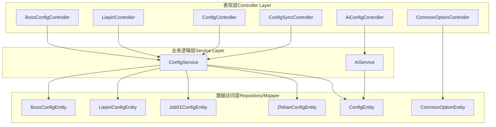
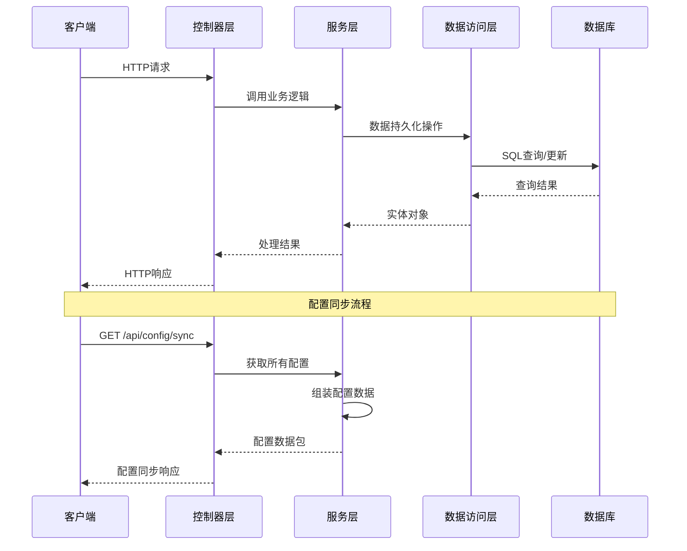
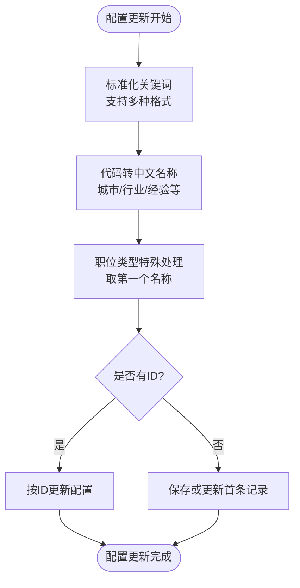
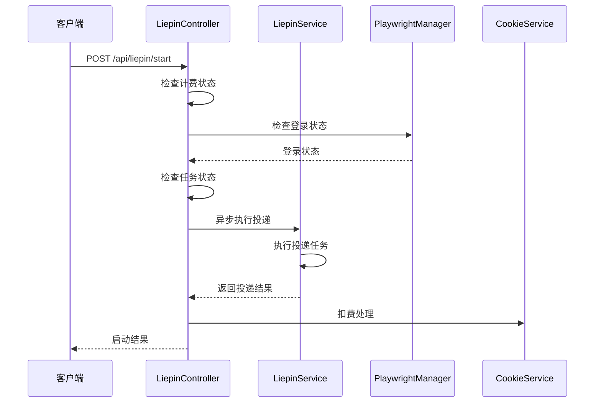
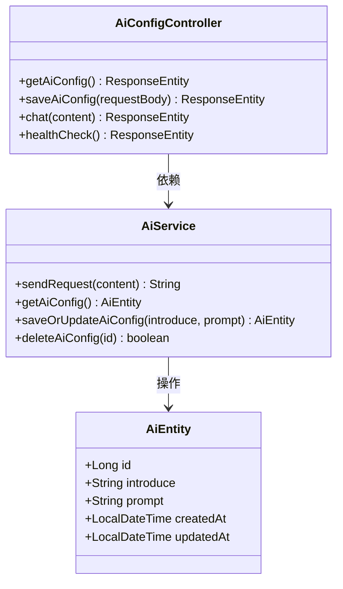
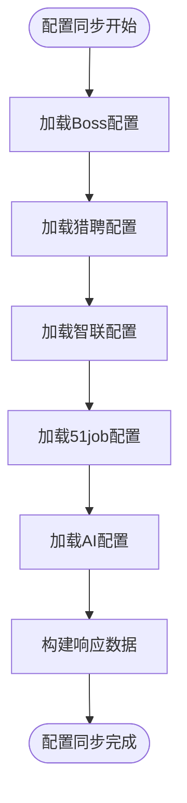
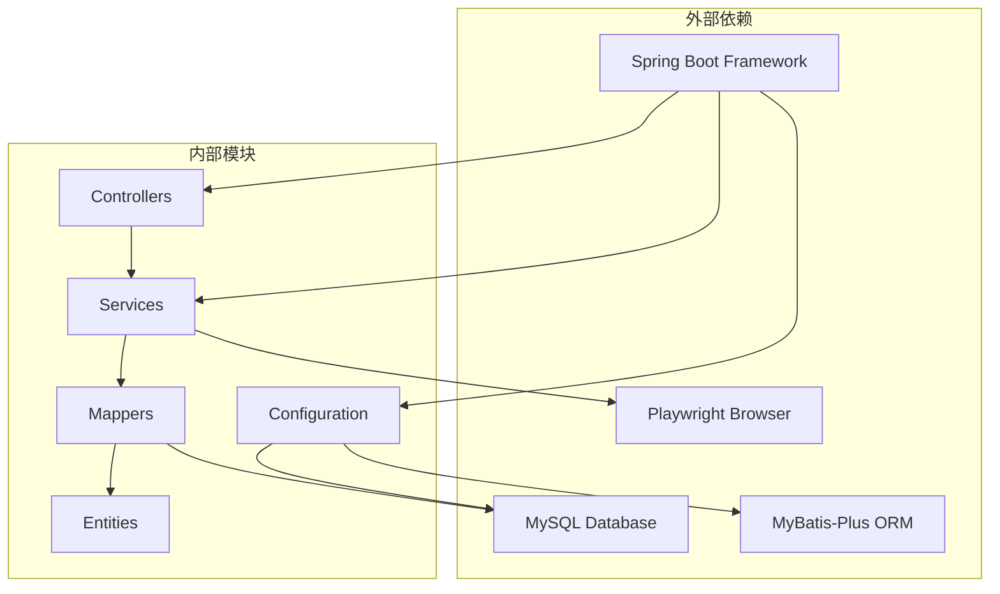

# 平台配置接口

<cite>
**本文档引用的文件**
- [BossConfigController.java](file://backend/src/main/java/com/getjobs/application/controller/BossConfigController.java)
- [LiepinController.java](file://backend/src/main/java/com/getjobs/application/controller/LiepinController.java)
- [ConfigController.java](file://backend/src/main/java/com/getjobs/application/controller/ConfigController.java)
- [AiConfigController.java](file://backend/src/main/java/com/getjobs/application/controller/AiConfigController.java)
- [CommonOptionController.java](file://backend/src/main/java/com/getjobs/application/controller/CommonOptionController.java)
- [ConfigSyncController.java](file://backend/src/main/java/com/getjobs/application/controller/ConfigSyncController.java)
- [BossConfigEntity.java](file://backend/src/main/java/com/getjobs/application/entity/BossConfigEntity.java)
- [LiepinConfigEntity.java](file://backend/src/main/java/com/getjobs/application/entity/LiepinConfigEntity.java)
- [Job51ConfigEntity.java](file://backend/src/main/java/com/getjobs/application/entity/Job51ConfigEntity.java)
- [ZhilianConfigEntity.java](file://backend/src/main/java/com/getjobs/application/entity/ZhilianConfigEntity.java)
- [CommonOptionEntity.java](file://backend/src/main/java/com/getjobs/application/entity/CommonOptionEntity.java)
- [ConfigEntity.java](file://backend/src/main/java/com/getjobs/application/entity/ConfigEntity.java)
- [ConfigService.java](file://backend/src/main/java/com/getjobs/application/service/ConfigService.java)
- [AiService.java](file://backend/src/main/java/com/getjobs/application/service/AiService.java)
- [application.yaml](file://backend/src/main/resources/application.yaml)
</cite>

## 目录
1. [简介](#简介)
2. [项目结构](#项目结构)
3. [核心组件](#核心组件)
4. [架构概览](#架构概览)
5. [详细组件分析](#详细组件分析)
6. [依赖关系分析](#依赖关系分析)
7. [性能考虑](#性能考虑)
8. [故障排除指南](#故障排除指南)
9. [结论](#结论)
10. [附录](#附录)

## 简介

本文档为招聘平台配置接口的完整API文档，涵盖Boss直聘、猎聘、51job、智联招聘四大招聘平台的配置管理接口规范。文档详细说明了配置获取、更新、删除等操作的接口定义，包括AI配置和通用选项配置的接口规范。

该系统采用Spring Boot框架构建，通过RESTful API提供配置管理功能，支持配置同步机制和实时更新。系统设计遵循分层架构原则，将控制器、服务层、数据访问层清晰分离，确保代码的可维护性和扩展性。

## 项目结构

系统采用标准的MVC架构模式，主要分为以下几个层次：

**图表来源**
- [BossConfigController.java:14-23](file://backend/src/main/java/com/getjobs/application/controller/BossConfigController.java#L14-L23)
- [ConfigController.java:16-23](file://backend/src/main/java/com/getjobs/application/controller/ConfigController.java#L16-L23)
- [AiConfigController.java:17-24](file://backend/src/main/java/com/getjobs/application/controller/AiConfigController.java#L17-L24)

**章节来源**
- [BossConfigController.java:1-214](file://backend/src/main/java/com/getjobs/application/controller/BossConfigController.java#L1-L214)
- [ConfigController.java:1-171](file://backend/src/main/java/com/getjobs/application/controller/ConfigController.java#L1-L171)
- [AiConfigController.java:1-129](file://backend/src/main/java/com/getjobs/application/controller/AiConfigController.java#L1-L129)

## 核心组件

系统的核心组件包括四个主要的配置控制器和相应的实体类，以及统一的配置服务层：

### 配置控制器组件
- **BossConfigController**: Boss直聘平台专用配置管理
- **LiepinController**: 猎聘平台配置管理（包含投递功能）
- **ConfigController**: 通用配置管理
- **AiConfigController**: AI配置管理
- **CommonOptionController**: 通用选项配置管理
- **ConfigSyncController**: 配置同步控制器

### 实体类组件
- **BossConfigEntity**: Boss直聘配置实体
- **LiepinConfigEntity**: 猎聘配置实体
- **Job51ConfigEntity**: 51job配置实体
- **ZhilianConfigEntity**: 智联招聘配置实体
- **CommonOptionEntity**: 通用选项实体
- **ConfigEntity**: 通用配置实体

**章节来源**
- [BossConfigEntity.java:10-56](file://backend/src/main/java/com/getjobs/application/entity/BossConfigEntity.java#L10-L56)
- [LiepinConfigEntity.java:10-31](file://backend/src/main/java/com/getjobs/application/entity/LiepinConfigEntity.java#L10-L31)
- [ConfigEntity.java:14-65](file://backend/src/main/java/com/getjobs/application/entity/ConfigEntity.java#L14-L65)

## 架构概览

系统采用分层架构设计，通过统一的服务层协调各个平台的配置管理：

**图表来源**
- [ConfigSyncController.java:33-86](file://backend/src/main/java/com/getjobs/application/controller/ConfigSyncController.java#L33-L86)
- [ConfigService.java:38-47](file://backend/src/main/java/com/getjobs/application/service/ConfigService.java#L38-L47)

系统架构特点：
- **统一入口**: 所有配置管理通过专门的控制器处理
- **服务层协调**: ConfigService统一协调各平台配置
- **实体映射**: 每个平台都有对应的配置实体类
- **事务管理**: 关键操作使用@Transactional注解确保数据一致性

**章节来源**
- [ConfigService.java:25-32](file://backend/src/main/java/com/getjobs/application/service/ConfigService.java#L25-L32)
- [application.yaml:27-29](file://backend/src/main/resources/application.yaml#L27-L29)

## 详细组件分析

### Boss直聘配置管理

BossConfigController提供了完整的Boss直聘平台配置管理功能：

#### 配置获取接口
- **GET /api/boss/config**: 获取所有Boss配置信息
  - 返回结构：包含config、options、blacklist三个部分
  - options按类型分组：city、industry、experience、jobType、salary、degree、scale、stage

#### 配置更新接口
- **PUT /api/boss/config**: 更新Boss配置
  - 关键词标准化处理：支持逗号分隔、中文逗号、括号列表、JSON数组
  - 代码到名称转换：城市、行业、经验、学历、规模、阶段、薪资等字段的代码转中文
  - 职位类型特殊处理：优先取第一个名称

#### 黑名单管理
- **GET /api/boss/config/blacklist**: 获取黑名单列表
- **POST /api/boss/config/blacklist**: 添加黑名单
- **DELETE /api/boss/config/blacklist/{id}**: 删除黑名单

**图表来源**
- [BossConfigController.java:62-117](file://backend/src/main/java/com/getjobs/application/controller/BossConfigController.java#L62-L117)
- [BossConfigController.java:127-159](file://backend/src/main/java/com/getjobs/application/controller/BossConfigController.java#L127-L159)

**章节来源**
- [BossConfigController.java:25-57](file://backend/src/main/java/com/getjobs/application/controller/BossConfigController.java#L25-L57)
- [BossConfigController.java:164-212](file://backend/src/main/java/com/getjobs/application/controller/BossConfigController.java#L164-L212)

### 猎聘配置管理

LiepinController提供猎聘平台的配置管理和投递功能：

#### 配置管理接口
- **GET /api/liepin/config**: 获取所有猎聘配置信息
- **PUT /api/liepin/config**: 更新猎聘配置
- **GET /api/liepin/config/options/{type}**: 获取指定类型选项

#### 投递功能接口
- **GET /api/liepin/login-status**: 检查登录状态
- **POST /api/liepin/start**: 启动投递任务
- **POST /api/liepin/stop**: 停止投递任务
- **GET /api/liepin/status**: 获取当前运行状态

#### Cookie管理接口
- **GET /api/liepin/cookie**: 读取数据库中的Cookie记录
- **POST /api/liepin/logout**: 退出登录
- **POST /api/liepin/save-cookie**: 保存当前上下文Cookie到数据库

**图表来源**
- [LiepinController.java:74-137](file://backend/src/main/java/com/getjobs/application/controller/LiepinController.java#L74-L137)

**章节来源**
- [LiepinController.java:211-241](file://backend/src/main/java/com/getjobs/application/controller/LiepinController.java#L211-L241)
- [LiepinController.java:292-367](file://backend/src/main/java/com/getjobs/application/controller/LiepinController.java#L292-L367)

### 通用配置管理

ConfigController提供系统的通用配置管理功能：

#### 接口规范
- **GET /api/config**: 获取所有配置（以Map形式）
- **GET /api/config/{key}**: 根据配置键获取单个配置
- **POST /api/config**: 批量更新配置
- **PUT /api/config/{key}**: 更新单个配置

#### 配置数据结构
配置采用键值对存储，支持以下字段：
- config_key: 配置键
- config_value: 配置值
- config_type: 配置类型
- category: 分类
- description: 描述

**章节来源**
- [ConfigController.java:25-170](file://backend/src/main/java/com/getjobs/application/controller/ConfigController.java#L25-L170)
- [ConfigEntity.java:16-65](file://backend/src/main/java/com/getjobs/application/entity/ConfigEntity.java#L16-L65)

### AI配置管理

AiConfigController提供AI配置的管理功能：

#### 接口规范
- **GET /api/ai/config**: 获取AI配置
- **POST /api/ai/config**: 保存或更新AI配置
- **GET /api/ai/chat**: AI文本生成测试接口

#### AI配置实体
AI配置包含以下字段：
- introduce: 技能介绍
- prompt: 提示词模板
- createdAt: 创建时间
- updatedAt: 更新时间

**图表来源**
- [AiConfigController.java:30-100](file://backend/src/main/java/com/getjobs/application/controller/AiConfigController.java#L30-L100)
- [AiService.java:254-306](file://backend/src/main/java/com/getjobs/application/service/AiService.java#L254-L306)

**章节来源**
- [AiConfigController.java:26-127](file://backend/src/main/java/com/getjobs/application/controller/AiConfigController.java#L26-L127)
- [AiService.java:249-334](file://backend/src/main/java/com/getjobs/application/service/AiService.java#L249-L334)

### 通用选项配置管理

CommonOptionController提供通用选项的管理功能：

#### 接口规范
- **GET /api/common-option**: 获取所有选项（支持按类型过滤）
- **POST /api/common-option**: 新增单个选项
- **POST /api/common-option/batch**: 批量新增选项
- **PUT /api/common-option/{id}**: 更新选项
- **DELETE /api/common-option/{id}**: 删除选项
- **PUT /api/common-option/sort**: 批量更新排序

#### 选项实体结构
通用选项包含以下字段：
- type: 选项类型
- label: 显示标签
- value: 选项值
- sortOrder: 排序顺序
- createdAt: 创建时间
- updatedAt: 更新时间

**章节来源**
- [CommonOptionController.java:28-112](file://backend/src/main/java/com/getjobs/application/controller/CommonOptionController.java#L28-L112)
- [CommonOptionEntity.java:10-28](file://backend/src/main/java/com/getjobs/application/entity/CommonOptionEntity.java#L10-L28)

### 配置同步机制

ConfigSyncController提供统一的配置同步功能：

#### 同步接口
- **GET /api/config/sync**: 同步配置给客户端

#### 同步数据结构
同步响应包含以下部分：
- success: 操作结果
- timestamp: 时间戳
- config: 各平台配置数据
- options: 选项配置数据
- aiConfig: AI配置数据

**图表来源**
- [ConfigSyncController.java:33-86](file://backend/src/main/java/com/getjobs/application/controller/ConfigSyncController.java#L33-L86)

**章节来源**
- [ConfigSyncController.java:28-111](file://backend/src/main/java/com/getjobs/application/controller/ConfigSyncController.java#L28-L111)

## 依赖关系分析

系统采用模块化设计，各组件之间的依赖关系如下：

**图表来源**
- [application.yaml:13-22](file://backend/src/main/resources/application.yaml#L13-L22)
- [application.yaml:44-51](file://backend/src/main/resources/application.yaml#L44-L51)

### 核心依赖特性

1. **数据库连接**: 使用HikariCP连接池，最大连接数10
2. **ORM框架**: MyBatis-Plus简化数据访问层开发
3. **浏览器自动化**: Playwright用于模拟用户操作
4. **配置管理**: YAML文件集中管理应用配置

**章节来源**
- [application.yaml:13-91](file://backend/src/main/resources/application.yaml#L13-L91)

## 性能考虑

系统在设计时充分考虑了性能优化：

### 连接池配置
- **最大连接数**: 10个连接
- **连接测试**: 使用SELECT 1进行连接有效性检查
- **空闲超时**: 600秒
- **最大生命周期**: 1800秒

### 浏览器性能调优
- **慢动作模式**: 20ms操作延迟，提高稳定性
- **导航超时**: 各平台不同超时设置
- **最大重试次数**: 3次
- **最大页面数**: 4个

### 缓存策略
- **配置缓存**: 通过服务层统一管理配置访问
- **实体缓存**: MyBatis-Plus自动缓存查询结果

## 故障排除指南

### 常见问题及解决方案

#### 配置获取失败
**问题**: GET /api/config 返回错误
**原因**: 数据库连接异常或配置表为空
**解决**: 检查数据库连接配置和config表数据

#### 配置更新失败
**问题**: PUT /api/config/{key} 返回失败
**原因**: 配置键不存在或数据库连接异常
**解决**: 确认配置键存在，检查数据库权限

#### AI配置异常
**问题**: AI接口调用失败
**原因**: BASE_URL、API_KEY、MODEL配置不完整
**解决**: 在通用配置中设置完整的AI配置

#### 浏览器操作失败
**问题**: 猎聘投递功能异常
**原因**: Playwright浏览器初始化失败或登录状态异常
**解决**: 检查浏览器配置和登录状态

**章节来源**
- [ConfigController.java:42-47](file://backend/src/main/java/com/getjobs/application/controller/ConfigController.java#L42-L47)
- [AiService.java:132-147](file://backend/src/main/java/com/getjobs/application/service/AiService.java#L132-L147)

## 结论

本文档详细介绍了招聘平台配置接口的完整API规范，涵盖了Boss直聘、猎聘、51job、智联招聘四大平台的配置管理功能。系统采用分层架构设计，通过统一的服务层协调各平台配置，提供了完整的配置获取、更新、删除等操作接口。

系统的主要优势包括：
- **统一接口**: 通过ConfigService统一管理各平台配置
- **灵活配置**: 支持多种配置格式和数据类型
- **实时同步**: 提供配置同步机制确保客户端数据一致性
- **健壮性**: 完善的错误处理和异常恢复机制

建议在使用过程中注意配置数据的标准化处理和事务管理，确保数据的一致性和完整性。

## 附录

### API接口汇总

#### Boss直聘配置
- GET /api/boss/config - 获取所有配置
- PUT /api/boss/config - 更新配置
- GET /api/boss/config/options/{type} - 获取选项
- GET /api/boss/config/blacklist - 获取黑名单
- POST /api/boss/config/blacklist - 添加黑名单
- DELETE /api/boss/config/blacklist/{id} - 删除黑名单

#### 猎聘配置
- GET /api/liepin/config - 获取配置
- PUT /api/liepin/config - 更新配置
- GET /api/liepin/config/options/{type} - 获取选项
- GET /api/liepin/login-status - 检查登录状态
- POST /api/liepin/start - 启动投递
- POST /api/liepin/stop - 停止投递
- GET /api/liepin/status - 获取状态
- GET /api/liepin/cookie - 读取Cookie
- POST /api/liepin/logout - 退出登录
- POST /api/liepin/save-cookie - 保存Cookie

#### 通用配置
- GET /api/config - 获取所有配置
- GET /api/config/{key} - 获取单个配置
- POST /api/config - 批量更新配置
- PUT /api/config/{key} - 更新单个配置

#### AI配置
- GET /api/ai/config - 获取AI配置
- POST /api/ai/config - 保存AI配置
- GET /api/ai/chat - AI测试接口

#### 通用选项
- GET /api/common-option - 获取所有选项
- POST /api/common-option - 新增选项
- POST /api/common-option/batch - 批量新增
- PUT /api/common-option/{id} - 更新选项
- DELETE /api/common-option/{id} - 删除选项
- PUT /api/common-option/sort - 批量排序

#### 配置同步
- GET /api/config/sync - 同步配置