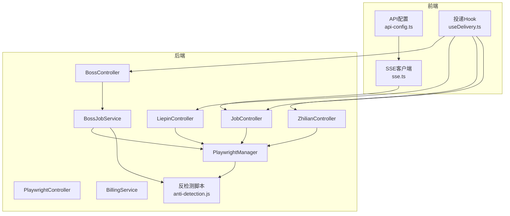
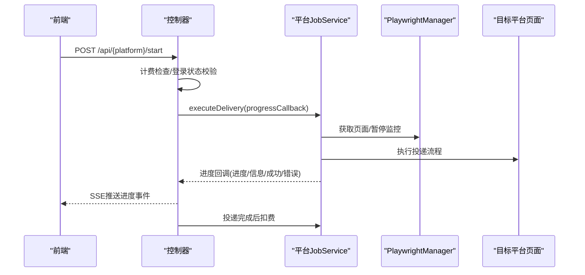
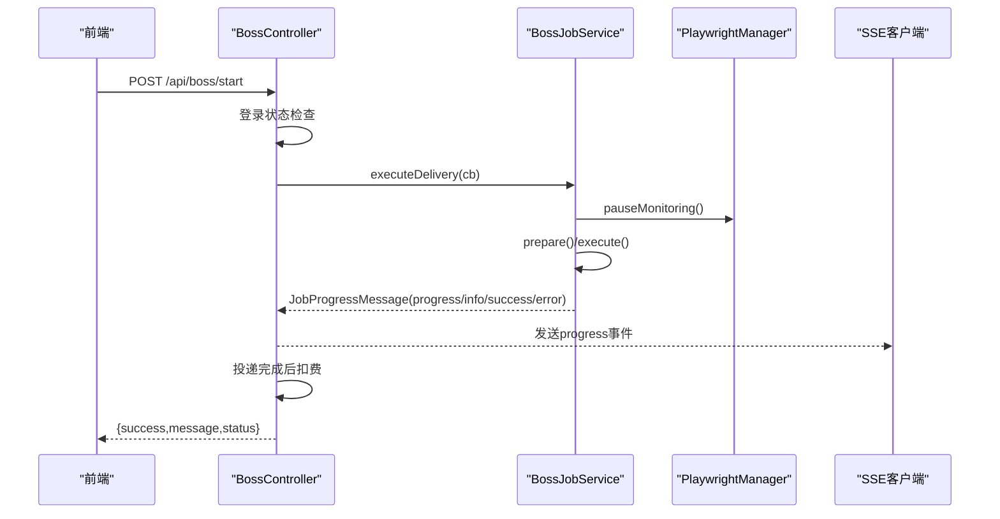
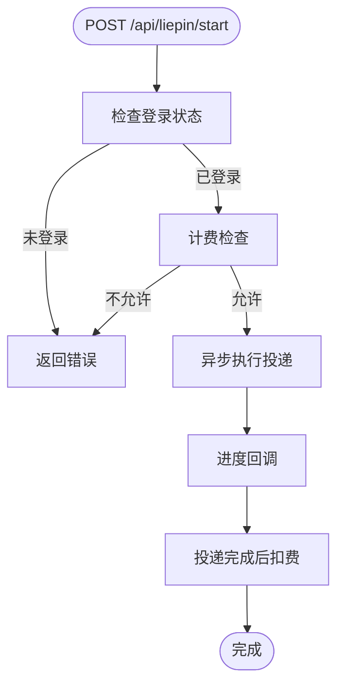
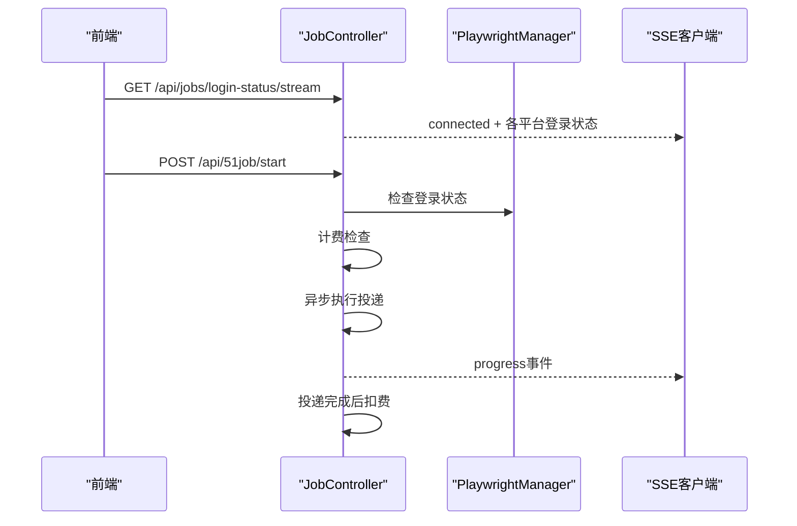
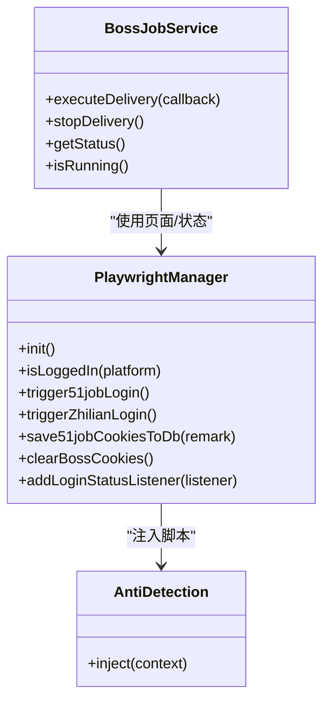
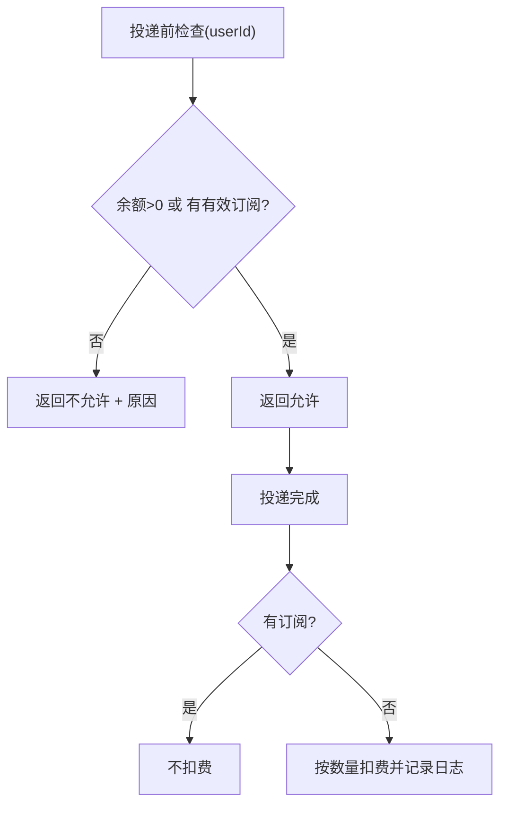
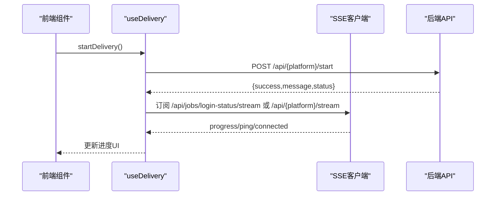
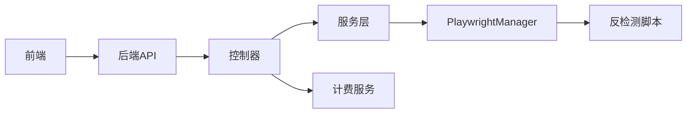

# 求职操作接口

<cite>
**本文引用的文件**
- [PlaywrightController.java](file://backend/src/main/java/com/getjobs/application/controller/PlaywrightController.java)
- [BossController.java](file://backend/src/main/java/com/getjobs/application/controller/BossController.java)
- [LiepinController.java](file://backend/src/main/java/com/getjobs/application/controller/LiepinController.java)
- [ZhilianController.java](file://backend/src/main/java/com/getjobs/application/controller/ZhilianController.java)
- [JobController.java](file://backend/src/main/java/com/getjobs/application/controller/JobController.java)
- [PlaywrightManager.java](file://backend/src/main/java/com/getjobs/worker/manager/PlaywrightManager.java)
- [BossJobService.java](file://backend/src/main/java/com/getjobs/worker/service/BossJobService.java)
- [JobProgressMessage.java](file://backend/src/main/java/com/getjobs/worker/dto/JobProgressMessage.java)
- [anti-detection.js](file://backend/src/main/resources/anti-detection.js)
- [BillingService.java](file://backend/src/main/java/com/getjobs/application/service/BillingService.java)
- [api-config.ts](file://front/lib/api-config.ts)
- [useDelivery.ts](file://front/hooks/useDelivery.ts)
- [sse.ts](file://front/lib/sse.ts)
- [application.yaml](file://backend/src/main/resources/application.yaml)
</cite>

## 目录
1. [简介](#简介)
2. [项目结构](#项目结构)
3. [核心组件](#核心组件)
4. [架构总览](#架构总览)
5. [详细组件分析](#详细组件分析)
6. [依赖关系分析](#依赖关系分析)
7. [性能考虑](#性能考虑)
8. [故障排除指南](#故障排除指南)
9. [结论](#结论)
10. [附录](#附录)

## 简介
本文件为求职操作接口的完整技术文档，覆盖多平台（Boss直聘、猎聘、51job、智联招聘）的求职自动化能力，包括职位搜索、简历投递、状态跟踪、进度推送、计费扣费、登录状态管理、反检测机制与Playwright自动化调用方式。文档同时提供异步回调与SSE状态同步机制说明、平台特定API限制与反检测策略、以及求职流程的端到端示例与错误处理策略。

## 项目结构
后端采用Spring Boot微服务架构，控制器层负责对外暴露REST API，服务层封装业务逻辑，PlaywrightManager统一管理浏览器实例与页面生命周期，各平台JobService负责具体投递流程。前端通过SSE与后端进行实时进度推送，同时提供Electron模式下的本地API桥接。

**图示来源**
- [BossController.java:31-246](file://backend/src/main/java/com/getjobs/application/controller/BossController.java#L31-L246)
- [LiepinController.java:26-369](file://backend/src/main/java/com/getjobs/application/controller/LiepinController.java#L26-L369)
- [ZhilianController.java:27-414](file://backend/src/main/java/com/getjobs/application/controller/ZhilianController.java#L27-L414)
- [JobController.java:40-589](file://backend/src/main/java/com/getjobs/application/controller/JobController.java#L40-L589)
- [PlaywrightManager.java:40-221](file://backend/src/main/java/com/getjobs/worker/manager/PlaywrightManager.java#L40-L221)
- [anti-detection.js:1-109](file://backend/src/main/resources/anti-detection.js#L1-L109)

**章节来源**
- [BossController.java:31-246](file://backend/src/main/java/com/getjobs/application/controller/BossController.java#L31-L246)
- [LiepinController.java:26-369](file://backend/src/main/java/com/getjobs/application/controller/LiepinController.java#L26-L369)
- [ZhilianController.java:27-414](file://backend/src/main/java/com/getjobs/application/controller/ZhilianController.java#L27-L414)
- [JobController.java:40-589](file://backend/src/main/java/com/getjobs/application/controller/JobController.java#L40-L589)
- [PlaywrightManager.java:40-221](file://backend/src/main/java/com/getjobs/worker/manager/PlaywrightManager.java#L40-L221)
- [anti-detection.js:1-109](file://backend/src/main/resources/anti-detection.js#L1-L109)

## 核心组件
- PlaywrightManager：统一管理浏览器、上下文、页面与登录状态监控，支持4个平台共享上下文，注入反检测脚本，提供Cookie加载/保存、页面导航与登录状态变更通知。
- 各平台JobService：封装平台特定的投递流程，支持启动/停止/状态查询，通过回调向SSE推送进度。
- 控制器层：提供各平台的REST API，包括启动/停止任务、登录状态检查、Cookie管理、配置读取、数据分析与健康检查。
- 计费服务：在投递前检查余额/订阅，在投递后按实际数量扣费并记录消费日志。
- 前端SSE客户端：自动重连、心跳保活、事件过滤，实时接收进度消息。

**章节来源**
- [PlaywrightManager.java:40-221](file://backend/src/main/java/com/getjobs/worker/manager/PlaywrightManager.java#L40-L221)
- [BossJobService.java:25-143](file://backend/src/main/java/com/getjobs/worker/service/BossJobService.java#L25-L143)
- [BillingService.java:35-130](file://backend/src/main/java/com/getjobs/application/service/BillingService.java#L35-L130)
- [JobProgressMessage.java:14-79](file://backend/src/main/java/com/getjobs/worker/dto/JobProgressMessage.java#L14-L79)

## 架构总览
系统采用“控制器-服务-Playwright管理器”的分层设计，控制器负责HTTP接口与SSE推送，服务层负责业务流程与状态管理，PlaywrightManager负责浏览器自动化与反检测。前端通过SSE订阅进度，或在Electron模式下直接调用本地API。

**图示来源**
- [BossController.java:90-148](file://backend/src/main/java/com/getjobs/application/controller/BossController.java#L90-L148)
- [LiepinController.java:74-137](file://backend/src/main/java/com/getjobs/application/controller/LiepinController.java#L74-L137)
- [ZhilianController.java:273-336](file://backend/src/main/java/com/getjobs/application/controller/ZhilianController.java#L273-L336)
- [JobController.java:386-443](file://backend/src/main/java/com/getjobs/application/controller/JobController.java#L386-L443)
- [BossJobService.java:38-104](file://backend/src/main/java/com/getjobs/worker/service/BossJobService.java#L38-L104)

## 详细组件分析

### Boss直聘平台接口
- 进度SSE：GET /api/boss/stream，永不超时，支持心跳ping。
- 启动任务：POST /api/boss/start，前置校验登录状态与计费，异步执行投递，完成后按实际数量扣费。
- 停止任务：POST /api/boss/stop，发送停止信号。
- 登出：POST /api/boss/logout，清除登录状态与Cookie。
- 状态查询：GET /api/boss/status。
- 进度回调：通过JobProgressMessage携带平台、类型、消息、进度与时间戳。

**图示来源**
- [BossController.java:44-148](file://backend/src/main/java/com/getjobs/application/controller/BossController.java#L44-L148)
- [BossJobService.java:38-104](file://backend/src/main/java/com/getjobs/worker/service/BossJobService.java#L38-L104)

**章节来源**
- [BossController.java:44-200](file://backend/src/main/java/com/getjobs/application/controller/BossController.java#L44-L200)
- [BossJobService.java:38-143](file://backend/src/main/java/com/getjobs/worker/service/BossJobService.java#L38-L143)

### 猎聘平台接口
- 登录状态：GET /api/liepin/login-status。
- 启动任务：POST /api/liepin/start，前置校验登录状态与计费。
- 停止任务：POST /api/liepin/stop。
- 状态查询：GET /api/liepin/status。
- 健康检查：GET /api/liepin/health。
- 配置管理：GET/PUT /api/liepin/config，按类型获取选项。
- 投递分析：GET /api/liepin/stats，GET /api/liepin/list。
- Cookie管理：GET /api/liepin/cookie，POST /api/liepin/save-cookie，POST /api/liepin/logout。

**图示来源**
- [LiepinController.java:74-137](file://backend/src/main/java/com/getjobs/application/controller/LiepinController.java#L74-L137)

**章节来源**
- [LiepinController.java:51-369](file://backend/src/main/java/com/getjobs/application/controller/LiepinController.java#L51-L369)

### 51job平台接口
- 登录状态：GET /api/51job/login-status。
- 触发登录：POST /api/51job/login。
- 退出登录：POST /api/51job/logout。
- Cookie管理：GET /api/51job/cookie，POST /api/51job/save-cookie。
- 启动任务：POST /api/51job/start，前置校验登录状态与计费。
- 停止任务：POST /api/51job/stop。
- 状态查询：GET /api/51job/status。
- 健康检查：GET /api/51job/health。
- 配置管理：GET/PUT /api/51job/config，按类型获取选项。
- 投递分析：GET /api/51job/stats，GET /api/51job/list。
- 数据刷新：GET /api/51job/reload。

**图示来源**
- [JobController.java:92-134](file://backend/src/main/java/com/getjobs/application/controller/JobController.java#L92-L134)
- [JobController.java:386-443](file://backend/src/main/java/com/getjobs/application/controller/JobController.java#L386-L443)

**章节来源**
- [JobController.java:92-495](file://backend/src/main/java/com/getjobs/application/controller/JobController.java#L92-L495)

### 智联招聘平台接口
- 登录状态：GET /api/zhilian/login-status。
- 触发登录：POST /api/zhilian/login（打开二维码登录入口）。
- 退出登录：POST /api/zhilian/logout。
- Cookie管理：GET /api/zhilian/cookie，POST /api/zhilian/save-cookie。
- 启动任务：POST /api/zhilian/start，前置校验登录状态与计费。
- 停止任务：POST /api/zhilian/stop。
- 状态查询：GET /api/zhilian/status。
- 健康检查：GET /api/zhilian/health。
- 配置管理：GET/PUT /api/zhilian/config，按类型获取选项。
- 投递分析：GET /api/zhilian/stats，GET /api/zhilian/list。

**章节来源**
- [ZhilianController.java:101-414](file://backend/src/main/java/com/getjobs/application/controller/ZhilianController.java#L101-L414)

### Playwright管理与反检测
- 初始化：创建浏览器、上下文与4个Page，注入反检测脚本，加载平台Cookie并导航至首页。
- 登录状态监控：监听页面导航事件，检测登录入口/用户头像等特征，变更时通过回调通知。
- 反检测脚本：劫持Function.prototype.toString，伪装console方法，降低被检测风险。
- Cookie管理：支持从数据库加载/保存Cookie，清理上下文Cookie。
- 超时与稳定性：平台差异化导航超时、重试策略、资源拦截开关。

**图示来源**
- [PlaywrightManager.java:114-221](file://backend/src/main/java/com/getjobs/worker/manager/PlaywrightManager.java#L114-L221)
- [BossJobService.java:38-104](file://backend/src/main/java/com/getjobs/worker/service/BossJobService.java#L38-L104)
- [anti-detection.js:1-109](file://backend/src/main/resources/anti-detection.js#L1-L109)

**章节来源**
- [PlaywrightManager.java:114-800](file://backend/src/main/java/com/getjobs/worker/manager/PlaywrightManager.java#L114-L800)
- [anti-detection.js:1-109](file://backend/src/main/resources/anti-detection.js#L1-L109)

### 计费与订阅
- 投递前检查：校验用户余额与订阅有效期，返回允许/拒绝与原因。
- 投递后扣费：按实际投递数量扣减余额并记录消费日志，订阅有效时不扣费。
- 用户计费信息：查询应用次数、订阅到期、累计充值与消费等。

**图示来源**
- [BillingService.java:35-130](file://backend/src/main/java/com/getjobs/application/service/BillingService.java#L35-L130)

**章节来源**
- [BillingService.java:35-170](file://backend/src/main/java/com/getjobs/application/service/BillingService.java#L35-L170)

### 前端集成与SSE
- API路径集中管理：统一在api-config.ts中定义各平台API路径。
- SSE客户端：提供指数退避重连、心跳保活、事件监听与清理。
- Hook封装：useDelivery.ts提供start/stop/getStatus与进度收集，支持Electron与Web两种模式。

**图示来源**
- [api-config.ts:7-95](file://front/lib/api-config.ts#L7-L95)
- [useDelivery.ts:39-187](file://front/hooks/useDelivery.ts#L39-L187)
- [sse.ts:24-113](file://front/lib/sse.ts#L24-L113)

**章节来源**
- [api-config.ts:7-95](file://front/lib/api-config.ts#L7-L95)
- [useDelivery.ts:39-187](file://front/hooks/useDelivery.ts#L39-L187)
- [sse.ts:24-113](file://front/lib/sse.ts#L24-L113)

## 依赖关系分析
- 控制器依赖服务与PlaywrightManager，BossController额外依赖计费服务。
- JobService依赖PlaywrightManager与配置服务，BossJobService通过Provider获取Boss实例。
- 前端通过API配置与SSE客户端与后端交互，支持自动重连与心跳。

**图示来源**
- [BossController.java:37-41](file://backend/src/main/java/com/getjobs/application/controller/BossController.java#L37-L41)
- [BossJobService.java:28-31](file://backend/src/main/java/com/getjobs/worker/service/BossJobService.java#L28-L31)
- [PlaywrightManager.java:90-110](file://backend/src/main/java/com/getjobs/worker/manager/PlaywrightManager.java#L90-L110)
- [BillingService.java:23-27](file://backend/src/main/java/com/getjobs/application/service/BillingService.java#L23-L27)

**章节来源**
- [BossController.java:37-41](file://backend/src/main/java/com/getjobs/application/controller/BossController.java#L37-L41)
- [BossJobService.java:28-31](file://backend/src/main/java/com/getjobs/worker/service/BossJobService.java#L28-L31)
- [PlaywrightManager.java:90-110](file://backend/src/main/java/com/getjobs/worker/manager/PlaywrightManager.java#L90-L110)
- [BillingService.java:23-27](file://backend/src/main/java/com/getjobs/application/service/BillingService.java#L23-L27)

## 性能考虑
- 导航超时与慢动作：不同平台设置差异化超时，避免页面未加载完成即判定失败。
- 资源拦截：可选开启请求拦截以降低内存占用，适合长时间运行任务。
- 页面池：统一管理4个页面，空闲回收与最大容量控制，避免资源泄露。
- SSE心跳：定时ping保活，客户端指数退避重连，降低网络波动影响。
- 反检测脚本：减少DevTools特征暴露，提升稳定性与通过率。

**章节来源**
- [application.yaml:70-101](file://backend/src/main/resources/application.yaml#L70-L101)
- [PlaywrightManager.java:160-166](file://backend/src/main/java/com/getjobs/worker/manager/PlaywrightManager.java#L160-L166)
- [JobController.java:187-208](file://backend/src/main/java/com/getjobs/application/controller/JobController.java#L187-L208)

## 故障排除指南
- 登录状态异常：检查Cookie是否正确加载/保存，确认平台登录页是否出现二维码/登录入口。
- 任务无法启动：确认已登录且无其他任务在运行，查看计费检查结果。
- 进度不更新：检查SSE连接是否断开，确认心跳与重连机制是否生效。
- 页面导航失败：查看平台URL与超时配置，必要时增加重试与等待NETWORKIDLE。
- 反检测失效：确认反检测脚本已注入，避免console对象被进一步检测。

**章节来源**
- [PlaywrightController.java:29-62](file://backend/src/main/java/com/getjobs/application/controller/PlaywrightController.java#L29-L62)
- [JobController.java:92-134](file://backend/src/main/java/com/getjobs/application/controller/JobController.java#L92-L134)
- [BossController.java:72-87](file://backend/src/main/java/com/getjobs/application/controller/BossController.java#L72-L87)

## 结论
本系统通过统一的Playwright管理器与多平台JobService，实现了跨平台的求职自动化能力。结合SSE实时进度推送、计费服务与反检测机制，既保证了用户体验，又提升了系统的稳定性与合规性。建议在生产环境中启用资源拦截、合理设置超时与重试策略，并持续优化反检测脚本以应对平台策略变化。

## 附录

### API一览（按平台）
- Boss直聘
  - GET /api/boss/stream：进度SSE
  - POST /api/boss/start：启动投递
  - POST /api/boss/stop：停止投递
  - POST /api/boss/logout：登出
  - GET /api/boss/status：状态查询
- 猎聘
  - GET /api/liepin/login-status：登录状态
  - POST /api/liepin/start：启动投递
  - POST /api/liepin/stop：停止投递
  - GET /api/liepin/status：状态查询
  - GET /api/liepin/health：健康检查
  - GET/PUT /api/liepin/config：配置管理
  - GET /api/liepin/stats：投递分析
  - GET /api/liepin/list：岗位列表
  - GET /api/liepin/cookie：读取Cookie
  - POST /api/liepin/save-cookie：保存Cookie
  - POST /api/liepin/logout：登出
- 51job
  - GET /api/jobs/login-status/stream：登录状态SSE
  - GET /api/51job/login-status：登录状态
  - POST /api/51job/login：触发登录
  - POST /api/51job/logout：登出
  - GET /api/51job/cookie：读取Cookie
  - POST /api/51job/save-cookie：保存Cookie
  - GET/PUT /api/51job/config：配置管理
  - GET /api/51job/stats：投递分析
  - GET /api/51job/list：岗位列表
  - GET /api/51job/reload：刷新数据
  - POST /api/51job/start：启动投递
  - POST /api/51job/stop：停止投递
  - GET /api/51job/status：状态查询
  - GET /api/51job/health：健康检查
- 智联招聘
  - GET /api/zhilian/login-status：登录状态
  - POST /api/zhilian/login：触发登录
  - POST /api/zhilian/logout：登出
  - GET /api/zhilian/cookie：读取Cookie
  - POST /api/zhilian/save-cookie：保存Cookie
  - GET/PUT /api/zhilian/config：配置管理
  - GET /api/zhilian/stats：投递分析
  - GET /api/zhilian/list：岗位列表
  - POST /api/zhilian/start：启动投递
  - POST /api/zhilian/stop：停止投递
  - GET /api/zhilian/status：状态查询
  - GET /api/zhilian/health：健康检查

**章节来源**
- [BossController.java:44-200](file://backend/src/main/java/com/getjobs/application/controller/BossController.java#L44-L200)
- [LiepinController.java:51-369](file://backend/src/main/java/com/getjobs/application/controller/LiepinController.java#L51-L369)
- [JobController.java:92-495](file://backend/src/main/java/com/getjobs/application/controller/JobController.java#L92-L495)
- [ZhilianController.java:101-414](file://backend/src/main/java/com/getjobs/application/controller/ZhilianController.java#L101-L414)