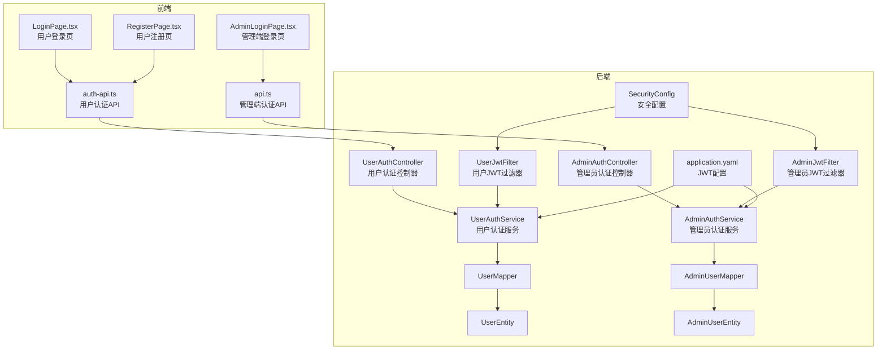
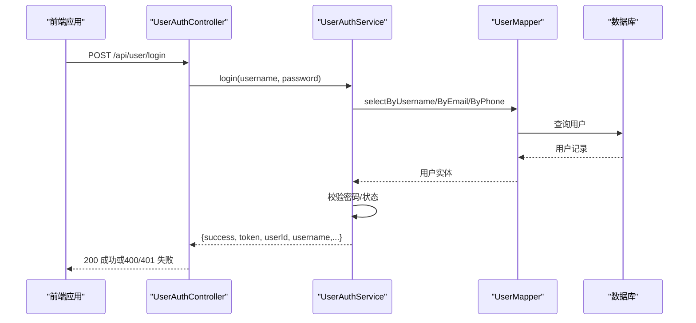
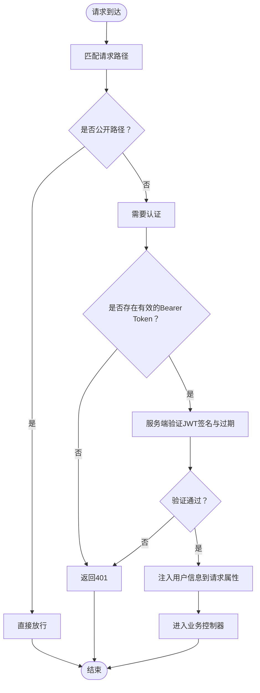
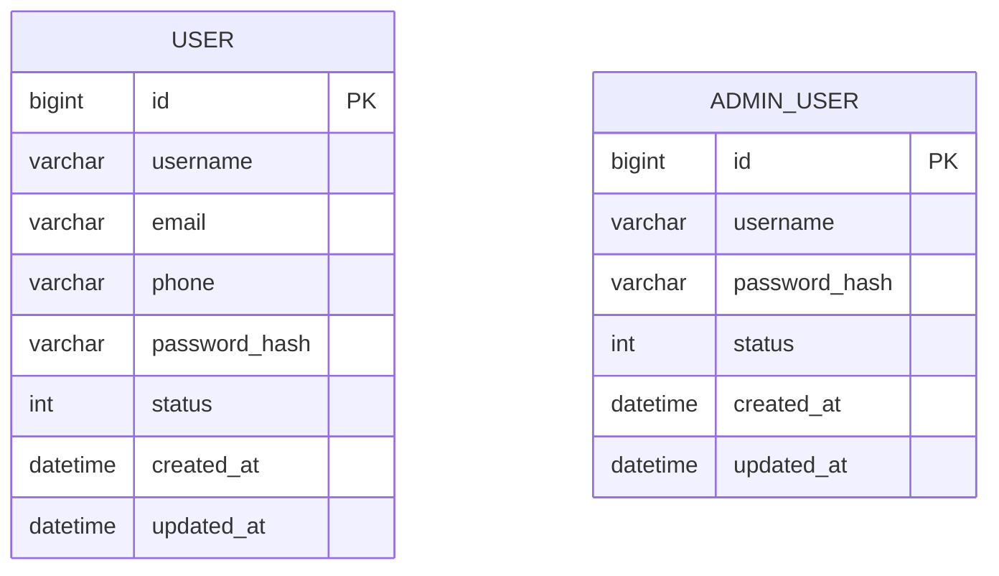
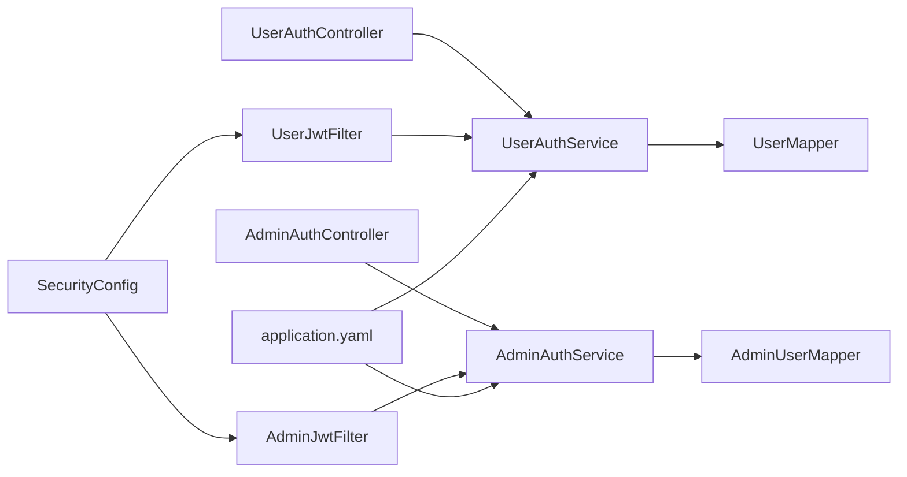

# 用户认证接口

<cite>
**本文引用的文件**
- [UserAuthController.java](file://backend/src/main/java/com/getjobs/application/controller/UserAuthController.java)
- [AdminAuthController.java](file://backend/src/main/java/com/getjobs/application/controller/AdminAuthController.java)
- [UserAuthService.java](file://backend/src/main/java/com/getjobs/application/service/UserAuthService.java)
- [AdminAuthService.java](file://backend/src/main/java/com/getjobs/application/service/AdminAuthService.java)
- [UserJwtFilter.java](file://backend/src/main/java/com/getjobs/application/filter/UserJwtFilter.java)
- [AdminJwtFilter.java](file://backend/src/main/java/com/getjobs/application/filter/AdminJwtFilter.java)
- [SecurityConfig.java](file://backend/src/main/java/com/getjobs/application/config/SecurityConfig.java)
- [application.yaml](file://backend/src/main/resources/application.yaml)
- [UserEntity.java](file://backend/src/main/java/com/getjobs/application/entity/UserEntity.java)
- [AdminUserEntity.java](file://backend/src/main/java/com/getjobs/application/entity/AdminUserEntity.java)
- [UserMapper.java](file://backend/src/main/java/com/getjobs/application/mapper/UserMapper.java)
- [AdminUserMapper.java](file://backend/src/main/java/com/getjobs/application/mapper/AdminUserMapper.java)
- [auth-api.ts](file://front/lib/auth-api.ts)
- [api.ts](file://front-admin/lib/api.ts)
- [LoginPage.tsx](file://front/app/auth/login/page.tsx)
- [RegisterPage.tsx](file://front/app/auth/register/page.tsx)
- [AdminLoginPage.tsx](file://front-admin/app/login/page.tsx)
</cite>

## 目录
1. [简介](#简介)
2. [项目结构](#项目结构)
3. [核心组件](#核心组件)
4. [架构总览](#架构总览)
5. [详细组件分析](#详细组件分析)
6. [依赖分析](#依赖分析)
7. [性能考虑](#性能考虑)
8. [故障排除指南](#故障排除指南)
9. [结论](#结论)
10. [附录](#附录)

## 简介
本文件为用户认证接口的完整 API 文档，覆盖用户注册、登录、资料查询与更新、密码修改，以及管理员登录与 Token 验证等接口规范。文档同时说明 JWT 令牌的生成、验证与过期处理机制，解释用户角色权限与访问控制策略，并提供请求与响应示例、错误码说明、安全最佳实践及常见问题解决方案。

## 项目结构
认证相关代码主要分布在后端 Spring Boot 的 controller、service、filter、mapper、entity 与配置层，前端 Next.js 应用通过独立的认证 API 模块发起请求并维护本地 Token。

图表来源
- [UserAuthController.java:15-167](file://backend/src/main/java/com/getjobs/application/controller/UserAuthController.java#L15-L167)
- [AdminAuthController.java:14-87](file://backend/src/main/java/com/getjobs/application/controller/AdminAuthController.java#L14-L87)
- [UserAuthService.java:26-311](file://backend/src/main/java/com/getjobs/application/service/UserAuthService.java#L26-L311)
- [AdminAuthService.java:23-145](file://backend/src/main/java/com/getjobs/application/service/AdminAuthService.java#L23-L145)
- [UserJwtFilter.java:19-83](file://backend/src/main/java/com/getjobs/application/filter/UserJwtFilter.java#L19-L83)
- [AdminJwtFilter.java:17-72](file://backend/src/main/java/com/getjobs/application/filter/AdminJwtFilter.java#L17-L72)
- [SecurityConfig.java:20-68](file://backend/src/main/java/com/getjobs/application/config/SecurityConfig.java#L20-L68)
- [application.yaml:53-58](file://backend/src/main/resources/application.yaml#L53-L58)
- [UserMapper.java:12-35](file://backend/src/main/java/com/getjobs/application/mapper/UserMapper.java#L12-L35)
- [AdminUserMapper.java:10-21](file://backend/src/main/java/com/getjobs/application/mapper/AdminUserMapper.java#L10-L21)
- [auth-api.ts:1-142](file://front/lib/auth-api.ts#L1-L142)
- [api.ts:1-92](file://front-admin/lib/api.ts#L1-L92)
- [LoginPage.tsx:9-118](file://front/app/auth/login/page.tsx#L9-L118)
- [RegisterPage.tsx:9-68](file://front/app/auth/register/page.tsx#L9-L68)
- [AdminLoginPage.tsx:8-150](file://front-admin/app/login/page.tsx#L8-L150)

章节来源
- [UserAuthController.java:15-167](file://backend/src/main/java/com/getjobs/application/controller/UserAuthController.java#L15-L167)
- [AdminAuthController.java:14-87](file://backend/src/main/java/com/getjobs/application/controller/AdminAuthController.java#L14-L87)
- [UserAuthService.java:26-311](file://backend/src/main/java/com/getjobs/application/service/UserAuthService.java#L26-L311)
- [AdminAuthService.java:23-145](file://backend/src/main/java/com/getjobs/application/service/AdminAuthService.java#L23-L145)
- [UserJwtFilter.java:19-83](file://backend/src/main/java/com/getjobs/application/filter/UserJwtFilter.java#L19-L83)
- [AdminJwtFilter.java:17-72](file://backend/src/main/java/com/getjobs/application/filter/AdminJwtFilter.java#L17-L72)
- [SecurityConfig.java:20-68](file://backend/src/main/java/com/getjobs/application/config/SecurityConfig.java#L20-L68)
- [application.yaml:53-58](file://backend/src/main/resources/application.yaml#L53-L58)

## 核心组件
- 用户认证控制器：提供注册、登录、个人资料查询与更新、修改密码等接口。
- 管理员认证控制器：提供管理员登录与 Token 验证接口。
- 用户认证服务：负责用户注册、登录、JWT 生成与校验、用户资料读写与密码修改。
- 管理员认证服务：负责管理员登录、JWT 生成与校验、Token 解析与过期判断。
- JWT 过滤器：在请求进入业务逻辑前进行 Token 校验并将用户信息注入请求属性。
- 安全配置：禁用默认表单/CSRF/HTTP Basic，启用自定义 JWT 过滤链。
- 配置文件：定义用户与管理员 JWT 的密钥、过期时间与签发者。

章节来源
- [UserAuthController.java:15-167](file://backend/src/main/java/com/getjobs/application/controller/UserAuthController.java#L15-L167)
- [AdminAuthController.java:14-87](file://backend/src/main/java/com/getjobs/application/controller/AdminAuthController.java#L14-L87)
- [UserAuthService.java:26-311](file://backend/src/main/java/com/getjobs/application/service/UserAuthService.java#L26-L311)
- [AdminAuthService.java:23-145](file://backend/src/main/java/com/getjobs/application/service/AdminAuthService.java#L23-L145)
- [UserJwtFilter.java:19-83](file://backend/src/main/java/com/getjobs/application/filter/UserJwtFilter.java#L19-L83)
- [AdminJwtFilter.java:17-72](file://backend/src/main/java/com/getjobs/application/filter/AdminJwtFilter.java#L17-L72)
- [SecurityConfig.java:20-68](file://backend/src/main/java/com/getjobs/application/config/SecurityConfig.java#L20-L68)
- [application.yaml:53-58](file://backend/src/main/resources/application.yaml#L53-L58)

## 架构总览
用户与管理员分别使用独立的 JWT 密钥与过期策略；用户侧通过用户过滤器拦截受保护路径，管理员侧通过管理员过滤器拦截 /api/admin 下的受保护路径。登录成功后，客户端将 Token 存储在本地，后续请求在请求头中携带 Authorization: Bearer <token>。

图表来源
- [UserAuthController.java:61-80](file://backend/src/main/java/com/getjobs/application/controller/UserAuthController.java#L61-L80)
- [UserAuthService.java:115-168](file://backend/src/main/java/com/getjobs/application/service/UserAuthService.java#L115-L168)
- [UserMapper.java:12-35](file://backend/src/main/java/com/getjobs/application/mapper/UserMapper.java#L12-L35)

章节来源
- [UserAuthController.java:61-80](file://backend/src/main/java/com/getjobs/application/controller/UserAuthController.java#L61-L80)
- [UserAuthService.java:115-168](file://backend/src/main/java/com/getjobs/application/service/UserAuthService.java#L115-L168)
- [UserMapper.java:12-35](file://backend/src/main/java/com/getjobs/application/mapper/UserMapper.java#L12-L35)

## 详细组件分析

### 用户认证接口
- 接口分组：/api/user
- 支持的 HTTP 方法与路径：
  - POST /api/user/register：用户注册
  - POST /api/user/login：用户登录
  - GET /api/user/profile：获取当前登录用户的资料（含计费信息）
  - PUT /api/user/profile：更新当前登录用户的资料
  - POST /api/user/change-password：修改当前登录用户密码

- 请求参数与响应格式（统一返回结构：{success: boolean, message: string, data?: object}）

  - POST /api/user/register
    - 请求体字段：username, password, email?, phone?
    - 成功返回：{success: true, message, userId, username}
    - 失败返回：{success: false, message}

  - POST /api/user/login
    - 请求体字段：username, password
    - 成功返回：{success: true, message, token, userId, username, email, phone}
    - 失败返回：{success: false, message}

  - GET /api/user/profile
    - 请求头：Authorization: Bearer <token>
    - 成功返回：{success: true, data: {id, username, email, phone, status, createdAt, billing: {...}}}
    - 失败返回：{success: false, message}（未登录返回401）

  - PUT /api/user/profile
    - 请求头：Authorization: Bearer <token>
    - 请求体字段：email?, phone?
    - 成功返回：{success: true, message}
    - 失败返回：{success: false, message}

  - POST /api/user/change-password
    - 请求头：Authorization: Bearer <token>
    - 请求体字段：oldPassword, newPassword
    - 成功返回：{success: true, message}
    - 失败返回：{success: false, message}

- 错误码与语义
  - 400：请求参数缺失或不合法（如用户名/密码为空、密码长度不足、旧密码错误、用户不存在等）
  - 401：未提供有效 Token 或 Token 无效/过期（用户/管理员均适用）
  - 200：成功

- 前端集成要点
  - 登录成功后，前端会将 token 写入 localStorage，并在后续请求头中自动附加 Authorization: Bearer <token>。
  - 用户资料接口会额外拼接计费信息。

章节来源
- [UserAuthController.java:25-167](file://backend/src/main/java/com/getjobs/application/controller/UserAuthController.java#L25-L167)
- [auth-api.ts:40-96](file://front/lib/auth-api.ts#L40-L96)
- [LoginPage.tsx:19-47](file://front/app/auth/login/page.tsx#L19-L47)

### 管理员认证接口
- 接口分组：/api/admin/auth
- 支持的 HTTP 方法与路径：
  - POST /api/admin/auth/login：管理员登录
  - GET /api/admin/auth/verify：验证 Token 并返回用户信息

- 请求参数与响应格式（统一返回结构：{success: boolean, message: string, data?: object}）

  - POST /api/admin/auth/login
    - 请求体字段：username, password
    - 成功返回：{success: true, message, data: {token, username}}
    - 失败返回：{success: false, message}（401）

  - GET /api/admin/auth/verify
    - 请求头：Authorization: Bearer <token>
    - 成功返回：{success: true, data: {userId, username}}
    - 失败返回：{success: false, message}（401）

- 前端集成要点
  - 登录成功后，前端会将 token 写入 localStorage，并在后续请求头中附加 Authorization: Bearer <token>。
  - 管理端页面可调用 verify 接口进行 Token 校验。

章节来源
- [AdminAuthController.java:21-87](file://backend/src/main/java/com/getjobs/application/controller/AdminAuthController.java#L21-L87)
- [api.ts:39-54](file://front-admin/lib/api.ts#L39-L54)
- [AdminLoginPage.tsx:15-30](file://front-admin/app/login/page.tsx#L15-L30)

### JWT 令牌生成、验证与过期机制
- 用户 JWT
  - 密钥与过期时间：从配置文件读取，密钥默认值与过期时间可在运行时通过环境变量覆盖。
  - 签发者：get-jobs-user
  - Claims：sub（用户ID）、username、issuer、iat、exp
  - 生成与验证：使用 HMAC SHA 对称密钥签名，服务端解析并校验签名与过期时间。

- 管理员 JWT
  - 密钥、过期时间与签发者：从配置文件读取，可通过环境变量覆盖。
  - Claims：包含 userId、username
  - 生成与验证：使用 HMAC SHA 对称密钥签名，服务端解析并校验签名与过期时间。

- 过滤器与访问控制
  - 用户过滤器：对受保护路径进行拦截，跳过注册、登录、管理员相关、健康检查、平台抓取、Cookie、AI、静态资源等路径；对 /api/config/sync 特殊放行。
  - 管理员过滤器：仅对 /api/admin/** 路径进行拦截，跳过登录接口与静态资源；将 adminUserId 与 adminUsername 注入请求属性。

- 前端 Token 管理
  - 用户端：localStorage 存储 user_token 与 user_info；每次请求自动附加 Authorization 头。
  - 管理端：localStorage 存储 admin_token 与 admin_username；每次请求自动附加 Authorization 头。

图表来源
- [UserJwtFilter.java:26-81](file://backend/src/main/java/com/getjobs/application/filter/UserJwtFilter.java#L26-L81)
- [AdminJwtFilter.java:23-70](file://backend/src/main/java/com/getjobs/application/filter/AdminJwtFilter.java#L23-L70)
- [UserAuthService.java:192-216](file://backend/src/main/java/com/getjobs/application/service/UserAuthService.java#L192-L216)
- [AdminAuthService.java:105-143](file://backend/src/main/java/com/getjobs/application/service/AdminAuthService.java#L105-L143)

章节来源
- [UserAuthService.java:170-216](file://backend/src/main/java/com/getjobs/application/service/UserAuthService.java#L170-L216)
- [AdminAuthService.java:77-143](file://backend/src/main/java/com/getjobs/application/service/AdminAuthService.java#L77-L143)
- [UserJwtFilter.java:26-81](file://backend/src/main/java/com/getjobs/application/filter/UserJwtFilter.java#L26-L81)
- [AdminJwtFilter.java:23-70](file://backend/src/main/java/com/getjobs/application/filter/AdminJwtFilter.java#L23-L70)
- [SecurityConfig.java:24-44](file://backend/src/main/java/com/getjobs/application/config/SecurityConfig.java#L24-L44)

### 数据模型与持久化
- 用户实体：包含主键、用户名、邮箱、手机号、密码哈希、状态、创建/更新时间。
- 管理员实体：包含主键、用户名、密码哈希、状态、创建/更新时间。
- Mapper：提供按用户名/邮箱/手机号查询用户的方法。

图表来源
- [UserEntity.java:14-41](file://backend/src/main/java/com/getjobs/application/entity/UserEntity.java#L14-L41)
- [AdminUserEntity.java:14-35](file://backend/src/main/java/com/getjobs/application/entity/AdminUserEntity.java#L14-L35)

章节来源
- [UserEntity.java:14-41](file://backend/src/main/java/com/getjobs/application/entity/UserEntity.java#L14-L41)
- [AdminUserEntity.java:14-35](file://backend/src/main/java/com/getjobs/application/entity/AdminUserEntity.java#L14-L35)
- [UserMapper.java:12-35](file://backend/src/main/java/com/getjobs/application/mapper/UserMapper.java#L12-L35)
- [AdminUserMapper.java:10-21](file://backend/src/main/java/com/getjobs/application/mapper/AdminUserMapper.java#L10-L21)

## 依赖分析
- 控制器依赖服务：UserAuthController 依赖 UserAuthService；AdminAuthController 依赖 AdminAuthService。
- 服务依赖 Mapper：UserAuthService 依赖 UserMapper；AdminAuthService 依赖 AdminUserMapper。
- 过滤器依赖服务：UserJwtFilter 依赖 UserAuthService；AdminJwtFilter 依赖 AdminAuthService。
- 配置依赖：SecurityConfig 禁用默认安全机制，启用自定义 JWT 过滤器链；application.yaml 提供 JWT 密钥与过期时间配置。

图表来源
- [UserAuthController.java:19-23](file://backend/src/main/java/com/getjobs/application/controller/UserAuthController.java#L19-L23)
- [AdminAuthController.java:18-19](file://backend/src/main/java/com/getjobs/application/controller/AdminAuthController.java#L18-L19)
- [UserAuthService.java:30-34](file://backend/src/main/java/com/getjobs/application/service/UserAuthService.java#L30-L34)
- [AdminAuthService.java:26-27](file://backend/src/main/java/com/getjobs/application/service/AdminAuthService.java#L26-L27)
- [UserJwtFilter.java:23-24](file://backend/src/main/java/com/getjobs/application/filter/UserJwtFilter.java#L23-L24)
- [AdminJwtFilter.java:20-21](file://backend/src/main/java/com/getjobs/application/filter/AdminJwtFilter.java#L20-L21)
- [SecurityConfig.java:24-44](file://backend/src/main/java/com/getjobs/application/config/SecurityConfig.java#L24-L44)
- [application.yaml:53-58](file://backend/src/main/resources/application.yaml#L53-L58)

章节来源
- [UserAuthController.java:19-23](file://backend/src/main/java/com/getjobs/application/controller/UserAuthController.java#L19-L23)
- [AdminAuthController.java:18-19](file://backend/src/main/java/com/getjobs/application/controller/AdminAuthController.java#L18-L19)
- [UserAuthService.java:30-34](file://backend/src/main/java/com/getjobs/application/service/UserAuthService.java#L30-L34)
- [AdminAuthService.java:26-27](file://backend/src/main/java/com/getjobs/application/service/AdminAuthService.java#L26-L27)
- [UserJwtFilter.java:23-24](file://backend/src/main/java/com/getjobs/application/filter/UserJwtFilter.java#L23-L24)
- [AdminJwtFilter.java:20-21](file://backend/src/main/java/com/getjobs/application/filter/AdminJwtFilter.java#L20-L21)
- [SecurityConfig.java:24-44](file://backend/src/main/java/com/getjobs/application/config/SecurityConfig.java#L24-L44)
- [application.yaml:53-58](file://backend/src/main/resources/application.yaml#L53-L58)

## 性能考虑
- JWT 解析成本低：基于对称密钥的 HMAC 验签，CPU 开销较小。
- 过滤器链短路：对公开路径快速放行，减少不必要的 Token 校验。
- 密钥与过期时间集中配置：便于统一优化与热更新（通过环境变量）。
- 建议
  - 合理设置过期时间：根据业务场景平衡安全性与用户体验。
  - 使用 HTTPS：避免 Token 在传输过程中被窃取。
  - 定期轮换密钥：结合配置中心进行密钥轮换与灰度发布。

## 故障排除指南
- 常见错误与排查
  - 400 参数错误：检查请求体字段是否齐全（用户名/密码非空、密码长度≥6等）。
  - 401 未提供或无效 Token：确认 Authorization 头格式为 Bearer <token>，且未过期。
  - 用户不存在/状态异常：确认用户是否存在且状态正常。
  - 管理员账号被禁用：确认管理员状态为启用。
  - 跨域问题：确认 CORS 配置允许来源、方法与头，且允许凭据。
- 前端常见问题
  - 登录成功但未跳转：检查前端是否正确写入 localStorage 并刷新用户信息。
  - 请求未附带 Token：确认 auth-api.ts 或 api.ts 的请求封装逻辑是否生效。
- 后端常见问题
  - 过滤器未生效：确认 SecurityConfig 已禁用默认安全机制并启用自定义过滤器链。
  - 密钥不一致：确保运行时环境变量与配置文件中的密钥一致。

章节来源
- [UserAuthController.java:35-47](file://backend/src/main/java/com/getjobs/application/controller/UserAuthController.java#L35-L47)
- [UserAuthService.java:134-152](file://backend/src/main/java/com/getjobs/application/service/UserAuthService.java#L134-L152)
- [AdminAuthService.java:59-71](file://backend/src/main/java/com/getjobs/application/service/AdminAuthService.java#L59-L71)
- [SecurityConfig.java:24-44](file://backend/src/main/java/com/getjobs/application/config/SecurityConfig.java#L24-L44)
- [UserJwtFilter.java:58-74](file://backend/src/main/java/com/getjobs/application/filter/UserJwtFilter.java#L58-L74)
- [AdminJwtFilter.java:45-62](file://backend/src/main/java/com/getjobs/application/filter/AdminJwtFilter.java#L45-L62)

## 结论
本认证体系采用独立的用户与管理员 JWT 策略，结合自定义过滤器实现细粒度的访问控制。通过前后端协同，实现了从登录、Token 管理到受保护资源访问的完整闭环。建议在生产环境中强化密钥管理、启用 HTTPS、合理设置过期时间，并持续监控与审计认证相关日志。

## 附录

### 请求与响应示例（路径引用）
- 用户登录
  - 请求：POST /api/user/login
  - 请求体：{username, password}
  - 成功响应：{success: true, message, token, userId, username, email, phone}
  - 失败响应：{success: false, message}
  - 参考：[UserAuthController.java:61-80](file://backend/src/main/java/com/getjobs/application/controller/UserAuthController.java#L61-L80)，[auth-api.ts:74-90](file://front/lib/auth-api.ts#L74-L90)

- 管理员登录
  - 请求：POST /api/admin/auth/login
  - 请求体：{username, password}
  - 成功响应：{success: true, message, data: {token, username}}
  - 失败响应：{success: false, message}
  - 参考：[AdminAuthController.java:24-53](file://backend/src/main/java/com/getjobs/application/controller/AdminAuthController.java#L24-L53)，[api.ts:39-45](file://front-admin/lib/api.ts#L39-L45)

- Token 验证（管理端）
  - 请求：GET /api/admin/auth/verify
  - 请求头：Authorization: Bearer <token>
  - 成功响应：{success: true, data: {userId, username}}
  - 失败响应：{success: false, message}
  - 参考：[AdminAuthController.java:58-85](file://backend/src/main/java/com/getjobs/application/controller/AdminAuthController.java#L58-L85)，[api.ts:47-54](file://front-admin/lib/api.ts#L47-L54)

- 获取用户资料（含计费信息）
  - 请求：GET /api/user/profile
  - 请求头：Authorization: Bearer <token>
  - 成功响应：{success: true, data: {id, username, email, phone, status, createdAt, billing: {...}}}
  - 失败响应：{success: false, message}
  - 参考：[UserAuthController.java:85-108](file://backend/src/main/java/com/getjobs/application/controller/UserAuthController.java#L85-L108)，[auth-api.ts:92-96](file://front/lib/auth-api.ts#L92-L96)

- 更新用户资料
  - 请求：PUT /api/user/profile
  - 请求体：{email?, phone?}
  - 请求头：Authorization: Bearer <token>
  - 成功响应：{success: true, message}
  - 失败响应：{success: false, message}
  - 参考：[UserAuthController.java:113-133](file://backend/src/main/java/com/getjobs/application/controller/UserAuthController.java#L113-L133)，[auth-api.ts:98-105](file://front/lib/auth-api.ts#L98-L105)

- 修改密码
  - 请求：POST /api/user/change-password
  - 请求体：{oldPassword, newPassword}
  - 请求头：Authorization: Bearer <token>
  - 成功响应：{success: true, message}
  - 失败响应：{success: false, message}
  - 参考：[UserAuthController.java:138-165](file://backend/src/main/java/com/getjobs/application/controller/UserAuthController.java#L138-L165)，[auth-api.ts:107-114](file://front/lib/auth-api.ts#L107-L114)

### 安全最佳实践
- 强制 HTTPS：所有认证与敏感接口必须通过 HTTPS 访问。
- 最小权限原则：仅授予必要的 API 访问权限；管理员路径严格限制。
- 密钥管理：使用强随机密钥，定期轮换；通过环境变量注入，避免硬编码。
- 过期策略：根据业务风险设定合理的过期时间；考虑短期 Token + 刷新机制（当前实现未包含刷新接口）。
- 输入校验：服务端严格校验必填字段与格式；前端做好输入提示与防抖。
- 日志与审计：记录认证事件与异常，便于追踪与分析。