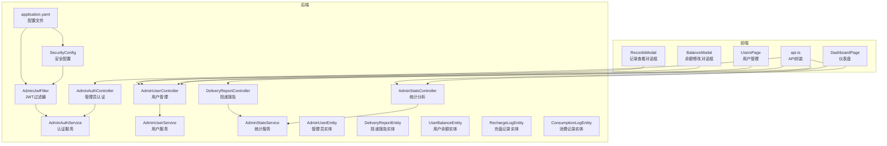
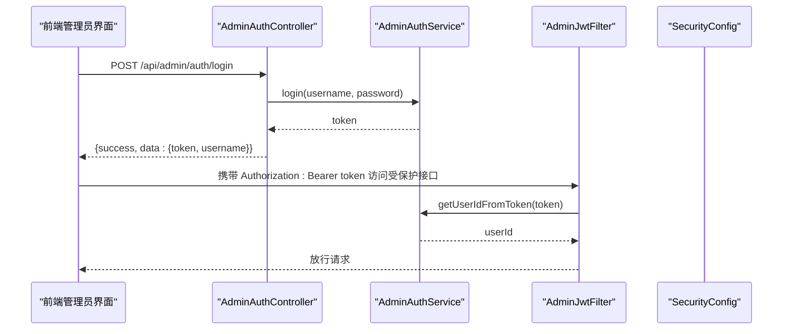
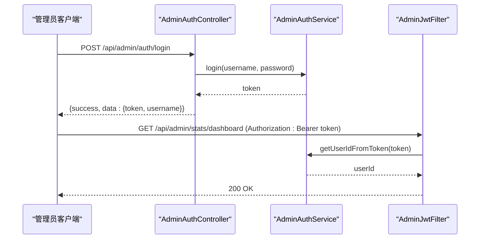
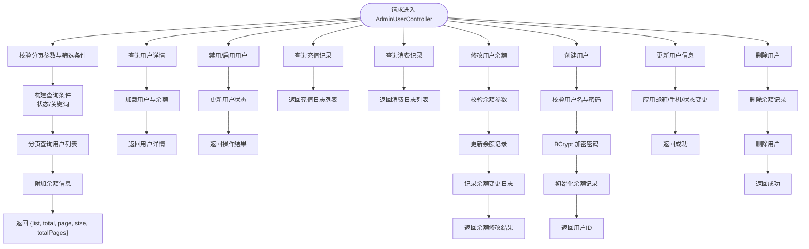
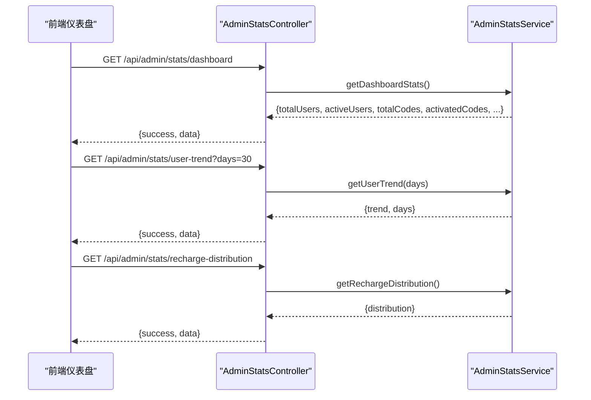
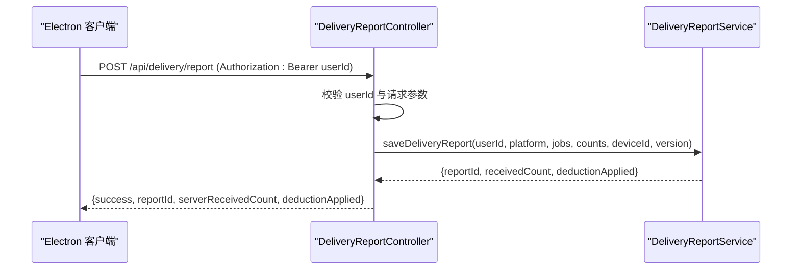
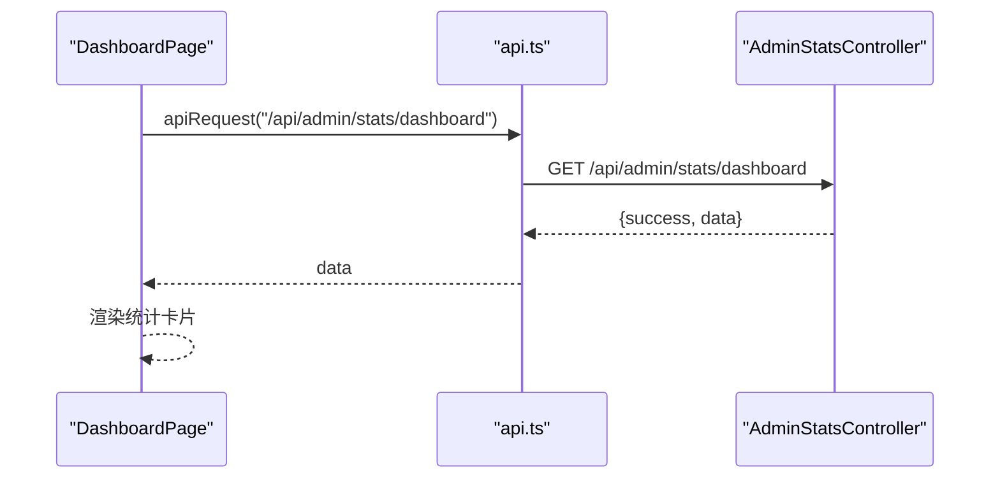
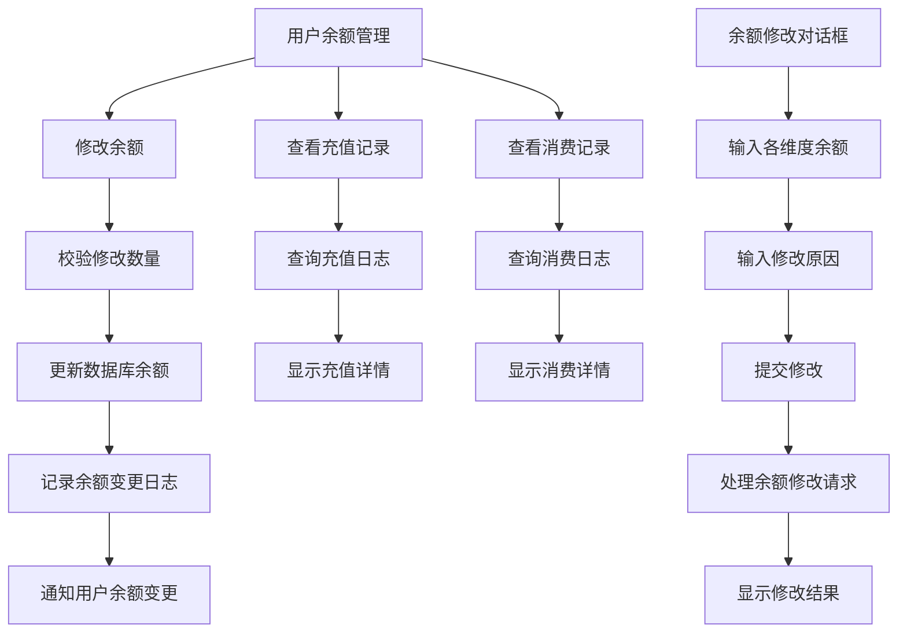
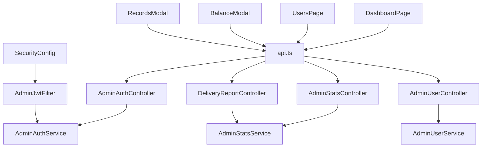

# 管理员管理接口

<cite>
**本文引用的文件**
- [AdminUserController.java](file://backend/src/main/java/com/getjobs/application/controller/AdminUserController.java)
- [AdminStatsController.java](file://backend/src/main/java/com/getjobs/application/controller/AdminStatsController.java)
- [DeliveryReportController.java](file://backend/src/main/java/com/getjobs/application/controller/DeliveryReportController.java)
- [AdminAuthController.java](file://backend/src/main/java/com/getjobs/application/controller/AdminAuthController.java)
- [AdminUserService.java](file://backend/src/main/java/com/getjobs/application/service/AdminUserService.java)
- [AdminStatsService.java](file://backend/src/main/java/com/getjobs/application/service/AdminStatsService.java)
- [AdminJwtFilter.java](file://backend/src/main/java/com/getjobs/application/filter/AdminJwtFilter.java)
- [SecurityConfig.java](file://backend/src/main/java/com/getjobs/application/config/SecurityConfig.java)
- [AdminUserEntity.java](file://backend/src/main/java/com/getjobs/application/entity/AdminUserEntity.java)
- [DeliveryReportEntity.java](file://backend/src/main/java/com/getjobs/application/entity/DeliveryReportEntity.java)
- [ConsumptionLogEntity.java](file://backend/src/main/java/com/getjobs/application/entity/ConsumptionLogEntity.java)
- [RechargeLogEntity.java](file://backend/src/main/java/com/getjobs/application/entity/RechargeLogEntity.java)
- [UserBalanceEntity.java](file://backend/src/main/java/com/getjobs/application/entity/UserBalanceEntity.java)
- [application.yaml](file://backend/src/main/resources/application.yaml)
- [page.tsx](file://front-admin/app/dashboard/page.tsx)
- [page.tsx](file://front-admin/app/users/page.tsx)
- [api.ts](file://front-admin/lib/api.ts)
- [BalanceModal.tsx](file://front-admin/components/BalanceModal.tsx)
- [RecordsModal.tsx](file://front-admin/components/RecordsModal.tsx)
- [001_create_delivery_report.sql](file://scripts/migration/001_create_delivery_report.sql)
</cite>

## 更新摘要
**变更内容**
- 新增用户余额管理功能，包括余额修改、充值记录和消费记录查询
- 完善用户管理面板，提供完整的CRUD操作界面
- 新增余额修改对话框和记录查看对话框
- 扩展统计分析功能，支持更详细的用户行为分析
- 完善管理员工作台的数据展示和交互功能

## 目录
1. [简介](#简介)
2. [项目结构](#项目结构)
3. [核心组件](#核心组件)
4. [架构概览](#架构概览)
5. [详细组件分析](#详细组件分析)
6. [依赖分析](#依赖分析)
7. [性能考虑](#性能考虑)
8. [故障排查指南](#故障排查指南)
9. [结论](#结论)
10. [附录](#附录)

## 简介
本文件为管理员管理接口的完整技术文档，覆盖用户管理、统计分析、投递报告、搜索预设等后台管理功能。文档详细说明了管理员权限验证与操作审计机制、用户信息管理、系统统计查询、数据报表导出、批量操作与数据导入导出的接口规范，并提供管理员工作台的功能接口与数据展示规范，以及后台管理的安全策略与数据隔离机制。

**更新** 新增用户余额管理功能，包括余额修改、充值记录跟踪、消费记录查询等完整的管理面板，提供直观的用户余额调整界面和详细的交易记录展示。

## 项目结构
后端采用 Spring Boot + MyBatis-Plus 架构，控制器位于 application/controller 包下，服务层位于 application/service 包下，实体类位于 application/entity 包下，过滤器与安全配置位于 application/filter 与 application/config 包下。前端管理员界面位于 front-admin 目录，使用 Next.js 开发，提供完整的用户管理和统计分析界面。

**图示来源**
- [AdminAuthController.java:14-87](file://backend/src/main/java/com/getjobs/application/controller/AdminAuthController.java#L14-L87)
- [AdminUserController.java:16-230](file://backend/src/main/java/com/getjobs/application/controller/AdminUserController.java#L16-L230)
- [AdminStatsController.java:17-57](file://backend/src/main/java/com/getjobs/application/controller/AdminStatsController.java#L17-L57)
- [DeliveryReportController.java:16-84](file://backend/src/main/java/com/getjobs/application/controller/DeliveryReportController.java#L16-L84)
- [AdminJwtFilter.java:17-72](file://backend/src/main/java/com/getjobs/application/filter/AdminJwtFilter.java#L17-L72)
- [SecurityConfig.java:20-68](file://backend/src/main/java/com/getjobs/application/config/SecurityConfig.java#L20-L68)
- [application.yaml:63-68](file://backend/src/main/resources/application.yaml#L63-L68)

**章节来源**
- [AdminAuthController.java:14-87](file://backend/src/main/java/com/getjobs/application/controller/AdminAuthController.java#L14-L87)
- [AdminUserController.java:16-230](file://backend/src/main/java/com/getjobs/application/controller/AdminUserController.java#L16-L230)
- [AdminStatsController.java:17-57](file://backend/src/main/java/com/getjobs/application/controller/AdminStatsController.java#L17-L57)
- [DeliveryReportController.java:16-84](file://backend/src/main/java/com/getjobs/application/controller/DeliveryReportController.java#L16-L84)
- [AdminJwtFilter.java:17-72](file://backend/src/main/java/com/getjobs/application/filter/AdminJwtFilter.java#L17-L72)
- [SecurityConfig.java:20-68](file://backend/src/main/java/com/getjobs/application/config/SecurityConfig.java#L20-L68)
- [application.yaml:63-68](file://backend/src/main/resources/application.yaml#L63-L68)

## 核心组件
- 管理员认证控制器：提供登录与 Token 验证接口，返回管理员身份信息。
- 用户管理控制器：提供用户列表查询、详情查询、状态变更、充值记录查询、用户创建/更新/删除、余额修改等接口。
- 统计分析控制器：提供仪表盘统计、用户增长趋势、充值分布等接口。
- 投递报告控制器：接收 Electron 客户端的投递结果上报，记录投递详情并返回报告 ID。
- 搜索预设控制器：提供搜索预设的增删改查接口。
- 安全过滤器与配置：基于 JWT 的管理员访问控制，CORS 放行与 CSRF 关闭。
- 实体模型：管理员、投递报告、用户余额、充值记录、消费记录等数据模型。

**更新** 新增用户余额管理功能，包括余额修改接口、充值记录查询接口、消费记录查询接口，以及相应的实体模型和前端对话框组件。

**章节来源**
- [AdminAuthController.java:24-85](file://backend/src/main/java/com/getjobs/application/controller/AdminAuthController.java#L24-L85)
- [AdminUserController.java:26-229](file://backend/src/main/java/com/getjobs/application/controller/AdminUserController.java#L26-L229)
- [AdminStatsController.java:27-55](file://backend/src/main/java/com/getjobs/application/controller/AdminStatsController.java#L27-L55)
- [DeliveryReportController.java:29-82](file://backend/src/main/java/com/getjobs/application/controller/DeliveryReportController.java#L29-L82)
- [AdminUserService.java:153-208](file://backend/src/main/java/com/getjobs/application/service/AdminUserService.java#L153-L208)
- [AdminUserService.java:140-151](file://backend/src/main/java/com/getjobs/application/service/AdminUserService.java#L140-L151)
- [AdminUserService.java:146-149](file://backend/src/main/java/com/getjobs/application/service/AdminUserService.java#L146-L149)

## 架构概览
管理员管理接口采用前后端分离架构，前端通过封装的 API 函数调用后端接口；后端通过 JWT 过滤器进行统一鉴权，除登录与静态资源外，所有 /api/admin/** 路径均需携带有效 Bearer Token。统计分析与用户管理分别由对应控制器与服务层协作完成，投递报告由独立控制器处理并持久化到数据库。

**图示来源**
- [AdminAuthController.java:24-53](file://backend/src/main/java/com/getjobs/application/controller/AdminAuthController.java#L24-L53)
- [AdminJwtFilter.java:45-69](file://backend/src/main/java/com/getjobs/application/filter/AdminJwtFilter.java#L45-L69)
- [SecurityConfig.java:24-44](file://backend/src/main/java/com/getjobs/application/config/SecurityConfig.java#L24-L44)

## 详细组件分析

### 管理员认证与权限验证
- 登录接口：接收用户名与密码，校验通过后签发 JWT，返回 token 与用户名。
- Token 验证接口：从 Authorization 头解析 Bearer token，校验有效性并返回管理员身份信息。
- JWT 过滤器：对 /api/admin/** 路径进行拦截，跳过登录与静态资源，校验失败返回 401。
- 安全配置：禁用 CSRF、表单登录与 HTTP Basic，启用 CORS 并允许凭据。

**图示来源**
- [AdminAuthController.java:24-85](file://backend/src/main/java/com/getjobs/application/controller/AdminAuthController.java#L24-L85)
- [AdminJwtFilter.java:23-70](file://backend/src/main/java/com/getjobs/application/filter/AdminJwtFilter.java#L23-L70)

**章节来源**
- [AdminAuthController.java:24-85](file://backend/src/main/java/com/getjobs/application/controller/AdminAuthController.java#L24-L85)
- [AdminJwtFilter.java:23-70](file://backend/src/main/java/com/getjobs/application/filter/AdminJwtFilter.java#L23-L70)
- [SecurityConfig.java:24-66](file://backend/src/main/java/com/getjobs/application/config/SecurityConfig.java#L24-L66)
- [application.yaml:63-68](file://backend/src/main/resources/application.yaml#L63-L68)

### 用户管理接口
- 列表查询：支持分页、状态筛选与关键词模糊匹配，返回用户列表及余额信息。
- 详情查询：返回用户基础信息与余额统计。
- 状态变更：支持禁用/启用用户。
- 充值记录：查询指定用户的充值日志。
- 消费记录：查询指定用户的消费日志。
- 余额修改：支持修改投递次数、AI匹配次数、AI打招呼次数、数据报告次数等多维度余额。
- 用户创建：创建 C 端用户，密码使用 BCrypt 加密，初始化余额记录。
- 用户更新：可更新邮箱、手机号与状态。
- 用户删除：删除用户及其余额记录。

**图示来源**
- [AdminUserController.java:26-229](file://backend/src/main/java/com/getjobs/application/controller/AdminUserController.java#L26-L229)
- [AdminUserService.java:42-90](file://backend/src/main/java/com/getjobs/application/service/AdminUserService.java#L42-L90)
- [AdminUserService.java:153-208](file://backend/src/main/java/com/getjobs/application/service/AdminUserService.java#L153-L208)

**章节来源**
- [AdminUserController.java:26-229](file://backend/src/main/java/com/getjobs/application/controller/AdminUserController.java#L26-L229)
- [AdminUserService.java:42-291](file://backend/src/main/java/com/getjobs/application/service/AdminUserService.java#L42-L291)

### 统计分析接口
- 仪表盘统计：返回总用户数、活跃用户数、充值码总数与已激活充值码数量等关键指标。
- 用户增长趋势：返回最近 N 天的用户注册趋势（当前为占位实现，实际应按日期分组统计）。
- 充值分布统计：返回充值分布情况（当前为占位实现，实际应按金额区间统计）。

**图示来源**
- [AdminStatsController.java:27-55](file://backend/src/main/java/com/getjobs/application/controller/AdminStatsController.java#L27-L55)
- [AdminStatsService.java:33-84](file://backend/src/main/java/com/getjobs/application/service/AdminStatsService.java#L33-L84)

**章节来源**
- [AdminStatsController.java:27-55](file://backend/src/main/java/com/getjobs/application/controller/AdminStatsController.java#L27-L55)
- [AdminStatsService.java:33-84](file://backend/src/main/java/com/getjobs/application/service/AdminStatsService.java#L33-L84)
- [page.tsx:16-29](file://front-admin/app/dashboard/page.tsx#L16-L29)

### 投递报告接口
- 上报接口：接收客户端投递结果，包括平台、成功/过滤/失败职位详情、设备 ID、客户端版本等，保存投递报告并返回报告 ID 与处理计数。
- 计费说明：计费在平台控制器完成，此处仅记录投递详情，不重复扣费。

**图示来源**
- [DeliveryReportController.java:29-82](file://backend/src/main/java/com/getjobs/application/controller/DeliveryReportController.java#L29-L82)

**章节来源**
- [DeliveryReportController.java:29-82](file://backend/src/main/java/com/getjobs/application/controller/DeliveryReportController.java#L29-L82)
- [DeliveryReportEntity.java:14-59](file://backend/src/main/java/com/getjobs/application/entity/DeliveryReportEntity.java#L14-L59)
- [001_create_delivery_report.sql](file://scripts/migration/001_create_delivery_report.sql)

### 管理员工作台接口与数据展示
- 仪表盘数据：前端通过 apiRequest 调用 /api/admin/stats/dashboard 获取统计数据，渲染总用户数、活跃用户数、充值码总数与已激活充值码数量等卡片。
- 用户管理界面：提供完整的用户列表、搜索、状态管理、余额修改、记录查看等功能。
- 工作流：登录成功后存储 token，后续请求自动携带 Authorization 头；仪表盘组件在挂载时拉取统计数据并渲染。

**图示来源**
- [page.tsx:16-29](file://front-admin/app/dashboard/page.tsx#L16-L29)
- [api.ts:5-37](file://front-admin/lib/api.ts#L5-L37)
- [AdminStatsController.java:27-33](file://backend/src/main/java/com/getjobs/application/controller/AdminStatsController.java#L27-L33)

**章节来源**
- [page.tsx:16-29](file://front-admin/app/dashboard/page.tsx#L16-L29)
- [api.ts:5-37](file://front-admin/lib/api.ts#L5-L37)
- [AdminStatsController.java:27-33](file://backend/src/main/java/com/getjobs/application/controller/AdminStatsController.java#L27-L33)

### 用户余额管理功能
- 余额修改接口：支持修改投递次数、AI匹配次数、AI打招呼次数、数据报告次数等多维度余额，提供修改原因记录。
- 充值记录查询：返回用户的充值历史，包括充值码、充值数量、赠送数量、余额变化等信息。
- 消费记录查询：返回用户的消费历史，包括消费类型、平台、岗位信息、余额变化等信息。
- 余额管理界面：提供直观的余额修改对话框，支持批量修改多个维度的余额。

**图示来源**
- [AdminUserController.java:122-149](file://backend/src/main/java/com/getjobs/application/controller/AdminUserController.java#L122-L149)
- [AdminUserService.java:153-208](file://backend/src/main/java/com/getjobs/application/service/AdminUserService.java#L153-L208)
- [BalanceModal.tsx:45-66](file://front-admin/components/BalanceModal.tsx#L45-L66)

**章节来源**
- [AdminUserController.java:122-149](file://backend/src/main/java/com/getjobs/application/controller/AdminUserController.java#L122-L149)
- [AdminUserService.java:153-208](file://backend/src/main/java/com/getjobs/application/service/AdminUserService.java#L153-L208)
- [BalanceModal.tsx:45-66](file://front-admin/components/BalanceModal.tsx#L45-L66)
- [RecordsModal.tsx:26-41](file://front-admin/components/RecordsModal.tsx#L26-L41)

## 依赖分析
- 控制器与服务层：AdminUserController、AdminStatsController 分别依赖 AdminUserService、AdminStatsService；服务层通过 MyBatis-Plus Mapper 访问数据库。
- 安全层：AdminJwtFilter 依赖 AdminAuthService 进行 Token 解析与用户校验；SecurityConfig 提供全局安全策略与 CORS 配置。
- 前端：api.ts 封装 fetch 请求，自动注入 Authorization 头；DashboardPage 和 UsersPage 调用 apiRequest 获取统计数据和用户信息。

**图示来源**
- [AdminAuthController.java:18-20](file://backend/src/main/java/com/getjobs/application/controller/AdminAuthController.java#L18-L20)
- [AdminUserController.java:20-21](file://backend/src/main/java/com/getjobs/application/controller/AdminUserController.java#L20-L21)
- [AdminStatsController.java:21-22](file://backend/src/main/java/com/getjobs/application/controller/AdminStatsController.java#L21-L22)
- [DeliveryReportController.java](file://backend/src/main/java/com/getjobs/application/controller/DeliveryReportController.java#L23)
- [AdminJwtFilter.java](file://backend/src/main/java/com/getjobs/application/filter/AdminJwtFilter.java#L21)
- [SecurityConfig.java:24-44](file://backend/src/main/java/com/getjobs/application/config/SecurityConfig.java#L24-L44)
- [page.tsx:16-29](file://front-admin/app/dashboard/page.tsx#L16-L29)
- [page.tsx:13-471](file://front-admin/app/users/page.tsx#L13-L471)
- [api.ts:5-37](file://front-admin/lib/api.ts#L5-L37)

**章节来源**
- [AdminAuthController.java:18-20](file://backend/src/main/java/com/getjobs/application/controller/AdminAuthController.java#L18-L20)
- [AdminUserController.java:20-21](file://backend/src/main/java/com/getjobs/application/controller/AdminUserController.java#L20-L21)
- [AdminStatsController.java:21-22](file://backend/src/main/java/com/getjobs/application/controller/AdminStatsController.java#L21-L22)
- [DeliveryReportController.java](file://backend/src/main/java/com/getjobs/application/controller/DeliveryReportController.java#L23)
- [AdminJwtFilter.java](file://backend/src/main/java/com/getjobs/application/filter/AdminJwtFilter.java#L21)
- [SecurityConfig.java:24-44](file://backend/src/main/java/com/getjobs/application/config/SecurityConfig.java#L24-L44)
- [page.tsx:16-29](file://front-admin/app/dashboard/page.tsx#L16-L29)
- [page.tsx:13-471](file://front-admin/app/users/page.tsx#L13-L471)
- [api.ts:5-37](file://front-admin/lib/api.ts#L5-L37)

## 性能考虑
- 分页查询：用户列表与充值记录查询使用分页，避免一次性加载大量数据。
- 缓存策略：可结合 Redis 对热点统计结果进行缓存，降低数据库压力。
- 异步处理：投递报告处理可在平台控制器完成后异步执行计费与通知，减少请求响应时间。
- 数据库索引：为常用查询字段（如用户名、邮箱、手机号、创建时间）建立索引，提升查询效率。
- CORS 与 CSRF：禁用 CSRF 以简化 JWT 场景下的认证流程，同时确保前端域名与后端 CORS 白名单一致。
- 事务管理：余额修改操作使用事务确保数据一致性，防止并发修改导致的数据不一致问题。

**更新** 新增余额修改的事务管理考虑，确保多维度余额修改的原子性和一致性。

## 故障排查指南
- 未登录或 Token 无效：检查前端是否正确存储与发送 Bearer token；确认 AdminJwtFilter 是否拦截 /api/admin/** 路径；核对 application.yaml 中的 JWT secret 与过期时间。
- 登录失败：确认 AdminAuthController 的用户名与密码非空校验；检查 AdminAuthService 的登录逻辑与数据库管理员账户是否存在。
- 用户管理异常：检查 AdminUserController 的输入参数与 AdminUserService 的业务逻辑；关注密码加密与余额初始化流程。
- 余额修改异常：检查余额参数的有效性与范围限制；确认用户余额记录的存在性；验证修改原因的必填性。
- 充值记录异常：检查充值日志查询的用户权限；确认充值记录的时间范围和状态过滤。
- 消费记录异常：检查消费日志查询的用户权限；确认消费类型的映射关系。
- 统计接口异常：确认 AdminStatsService 的查询逻辑与数据库连接；当前趋势与分布接口为占位实现，需补充 SQL 统计。
- 投递报告异常：检查 DeliveryReportController 的请求参数解析与 DeliveryReportService 的保存逻辑；确认数据库 delivery_report 表结构与迁移脚本一致。

**更新** 新增余额管理相关的故障排查指导，包括余额参数校验、事务处理、权限验证等问题的解决方案。

**章节来源**
- [AdminJwtFilter.java:45-69](file://backend/src/main/java/com/getjobs/application/filter/AdminJwtFilter.java#L45-L69)
- [AdminAuthController.java:28-52](file://backend/src/main/java/com/getjobs/application/controller/AdminAuthController.java#L28-L52)
- [AdminUserController.java:112-142](file://backend/src/main/java/com/getjobs/application/controller/AdminUserController.java#L112-L142)
- [AdminUserService.java:153-208](file://backend/src/main/java/com/getjobs/application/service/AdminUserService.java#L153-L208)
- [AdminStatsService.java:67-84](file://backend/src/main/java/com/getjobs/application/service/AdminStatsService.java#L67-L84)
- [DeliveryReportController.java:36-82](file://backend/src/main/java/com/getjobs/application/controller/DeliveryReportController.java#L36-L82)
- [001_create_delivery_report.sql](file://scripts/migration/001_create_delivery_report.sql)

## 结论
管理员管理接口围绕 JWT 认证、用户管理、统计分析、投递报告等五大模块构建，配合安全过滤器与配置实现统一鉴权与跨域放行。前端通过封装的 API 函数与后端接口交互，实现仪表盘数据展示与后台管理功能。当前部分统计接口为占位实现，建议尽快完善 SQL 统计逻辑与数据可视化组件，以满足生产环境的数据分析需求。

**更新** 新增的用户余额管理功能提供了完整的余额调整和交易记录查询能力，配合直观的前端界面组件，实现了高效的后台管理体验。建议进一步完善余额修改的审计日志和权限控制，确保操作的安全性和可追溯性。

## 附录
- 管理员实体模型：包含主键、用户名、密码哈希、状态与时间戳字段。
- 投递报告实体模型：包含报告 ID、用户 ID、平台、各类计数、职位详情 JSON、设备 ID、客户端版本与创建时间。
- 用户余额实体模型：包含用户 ID、投递次数、AI匹配次数、AI打招呼次数、数据报告次数、累计充值和消费次数等字段。
- 充值记录实体模型：包含用户 ID、充值码、充值数量、赠送数量、余额变化与创建时间。
- 消费记录实体模型：包含用户 ID、消费类型、消费数量、平台、岗位信息、余额变化与创建时间。
- JWT 配置：secret、过期时间与签发者在 application.yaml 中配置。

**更新** 新增用户余额实体模型、充值记录实体模型、消费记录实体模型的详细说明，以及相应的配置参数。

**章节来源**
- [AdminUserEntity.java:14-35](file://backend/src/main/java/com/getjobs/application/entity/AdminUserEntity.java#L14-L35)
- [DeliveryReportEntity.java:14-59](file://backend/src/main/java/com/getjobs/application/entity/DeliveryReportEntity.java#L14-L59)
- [UserBalanceEntity.java:14-53](file://backend/src/main/java/com/getjobs/application/entity/UserBalanceEntity.java#L14-L53)
- [RechargeLogEntity.java:14-41](file://backend/src/main/java/com/getjobs/application/entity/RechargeLogEntity.java#L14-L41)
- [ConsumptionLogEntity.java:14-47](file://backend/src/main/java/com/getjobs/application/entity/ConsumptionLogEntity.java#L14-L47)
- [application.yaml:63-68](file://backend/src/main/resources/application.yaml#L63-L68)