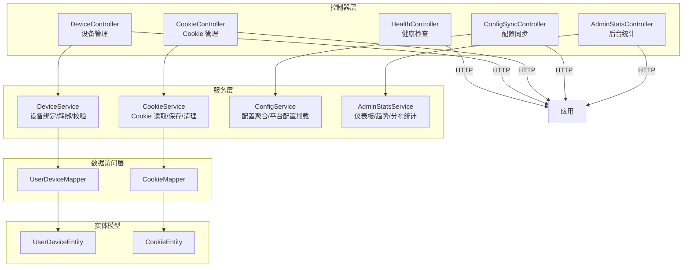
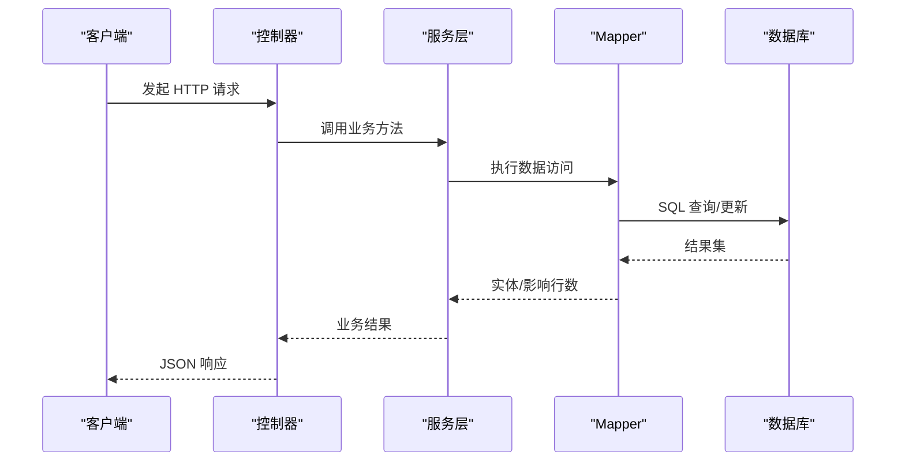
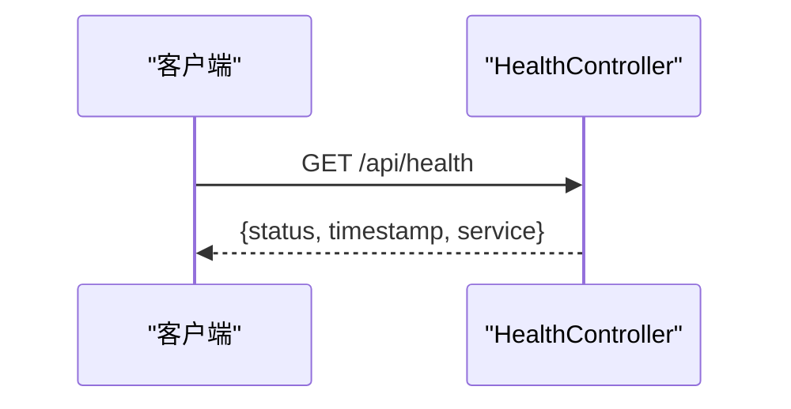
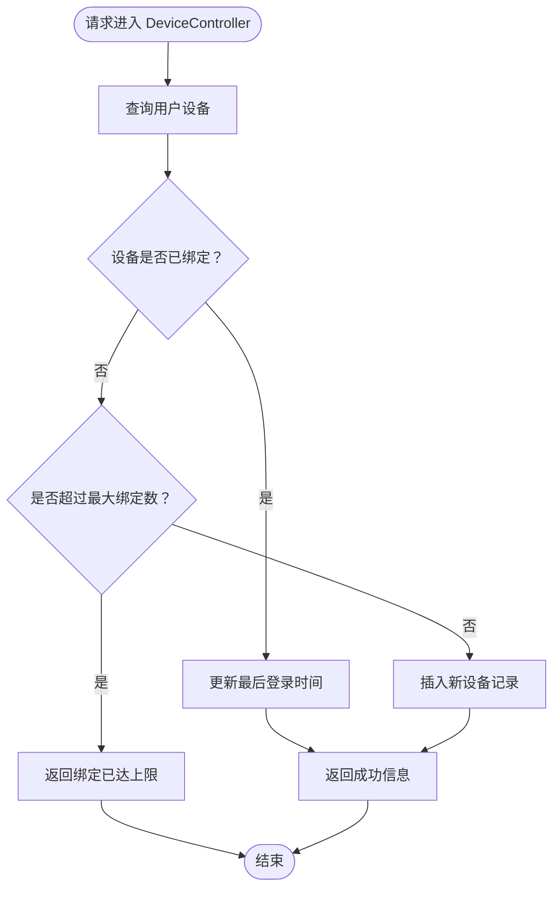
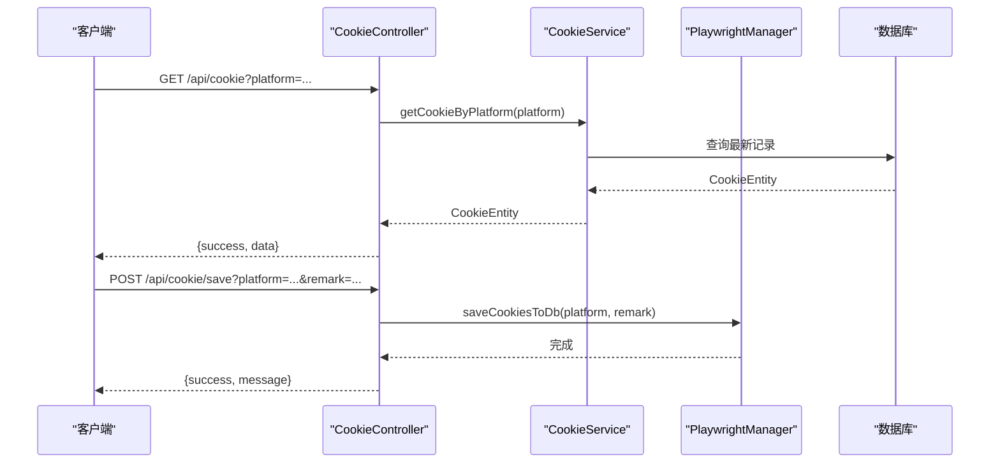
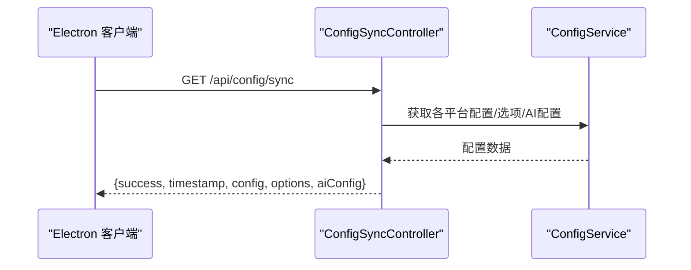
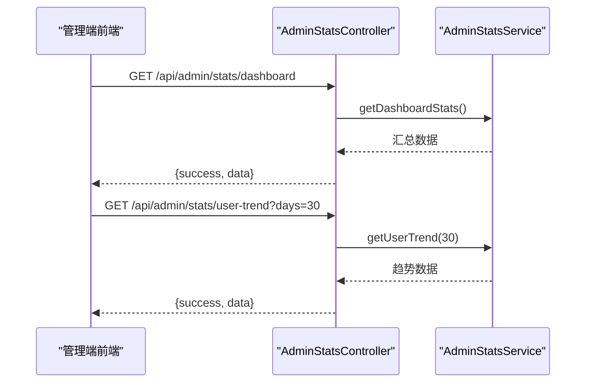
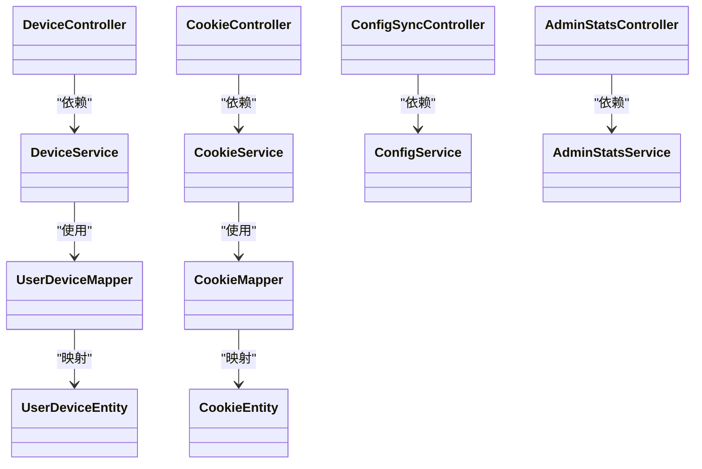

# 系统监控接口

<cite>
**本文引用的文件**
- [HealthController.java](file://backend/src/main/java/com/getjobs/application/controller/HealthController.java)
- [DeviceController.java](file://backend/src/main/java/com/getjobs/application/controller/DeviceController.java)
- [CookieController.java](file://backend/src/main/java/com/getjobs/application/controller/CookieController.java)
- [ConfigSyncController.java](file://backend/src/main/java/com/getjobs/application/controller/ConfigSyncController.java)
- [AdminStatsController.java](file://backend/src/main/java/com/getjobs/application/controller/AdminStatsController.java)
- [DeviceService.java](file://backend/src/main/java/com/getjobs/application/service/DeviceService.java)
- [CookieService.java](file://backend/src/main/java/com/getjobs/application/service/CookieService.java)
- [ConfigService.java](file://backend/src/main/java/com/getjobs/application/service/ConfigService.java)
- [AdminStatsService.java](file://backend/src/main/java/com/getjobs/application/service/AdminStatsService.java)
- [UserDeviceEntity.java](file://backend/src/main/java/com/getjobs/application/entity/UserDeviceEntity.java)
- [CookieEntity.java](file://backend/src/main/java/com/getjobs/application/entity/CookieEntity.java)
- [UserDeviceMapper.java](file://backend/src/main/java/com/getjobs/application/mapper/UserDeviceMapper.java)
- [CookieMapper.java](file://backend/src/main/java/com/getjobs/application/mapper/CookieMapper.java)
- [application.yaml](file://backend/src/main/resources/application.yaml)
</cite>

## 目录
1. [简介](#简介)
2. [项目结构](#项目结构)
3. [核心组件](#核心组件)
4. [架构总览](#架构总览)
5. [详细组件分析](#详细组件分析)
6. [依赖关系分析](#依赖关系分析)
7. [性能与稳定性](#性能与稳定性)
8. [故障排查指南](#故障排查指南)
9. [结论](#结论)
10. [附录](#附录)

## 简介
本文件为系统监控接口的完整 API 文档，覆盖健康检查、设备管理、Cookie 管理、配置同步、后台统计与仪表板等运维与监控相关能力。文档面向运维与开发人员，提供接口规范、数据流说明、错误处理策略、性能与稳定性保障机制，以及故障恢复建议。

## 项目结构
后端采用 Spring Boot 控制器-服务-持久层分层架构，监控相关接口集中在控制器层，业务逻辑封装在服务层，数据访问通过 MyBatis-Plus Mapper 接口完成。配置与运行参数集中于 application.yaml。

图表来源
- [HealthController.java:1-33](file://backend/src/main/java/com/getjobs/application/controller/HealthController.java#L1-L33)
- [DeviceController.java:1-54](file://backend/src/main/java/com/getjobs/application/controller/DeviceController.java#L1-L54)
- [CookieController.java:1-95](file://backend/src/main/java/com/getjobs/application/controller/CookieController.java#L1-L95)
- [ConfigSyncController.java:1-111](file://backend/src/main/java/com/getjobs/application/controller/ConfigSyncController.java#L1-L111)
- [AdminStatsController.java:1-57](file://backend/src/main/java/com/getjobs/application/controller/AdminStatsController.java#L1-L57)
- [DeviceService.java:1-134](file://backend/src/main/java/com/getjobs/application/service/DeviceService.java#L1-L134)
- [CookieService.java:1-97](file://backend/src/main/java/com/getjobs/application/service/CookieService.java#L1-L97)
- [ConfigService.java:1-288](file://backend/src/main/java/com/getjobs/application/service/ConfigService.java#L1-L288)
- [AdminStatsService.java:1-86](file://backend/src/main/java/com/getjobs/application/service/AdminStatsService.java#L1-L86)
- [UserDeviceMapper.java:1-49](file://backend/src/main/java/com/getjobs/application/mapper/UserDeviceMapper.java#L1-L49)
- [CookieMapper.java:1-11](file://backend/src/main/java/com/getjobs/application/mapper/CookieMapper.java#L1-L11)
- [UserDeviceEntity.java:1-35](file://backend/src/main/java/com/getjobs/application/entity/UserDeviceEntity.java#L1-L35)
- [CookieEntity.java:1-54](file://backend/src/main/java/com/getjobs/application/entity/CookieEntity.java#L1-L54)

章节来源
- [application.yaml:1-101](file://backend/src/main/resources/application.yaml#L1-L101)

## 核心组件
- 健康检查接口：提供系统可用性快速验证，返回服务状态与时间戳。
- 设备管理接口：支持查询用户绑定设备、解绑设备，含设备数量上限控制与重复绑定处理。
- Cookie 管理接口：支持按平台读取 Cookie、主动保存 Cookie 至数据库，并进行平台白名单校验。
- 配置同步接口：向 Electron 客户端推送统一配置与选项，包含多平台配置聚合与 AI 配置导出。
- 后台统计与仪表板：提供仪表板汇总、用户增长趋势、充值分布等统计接口。

章节来源
- [HealthController.java:20-31](file://backend/src/main/java/com/getjobs/application/controller/HealthController.java#L20-L31)
- [DeviceController.java:24-52](file://backend/src/main/java/com/getjobs/application/controller/DeviceController.java#L24-L52)
- [CookieController.java:32-94](file://backend/src/main/java/com/getjobs/application/controller/CookieController.java#L32-L94)
- [ConfigSyncController.java:33-86](file://backend/src/main/java/com/getjobs/application/controller/ConfigSyncController.java#L33-L86)
- [AdminStatsController.java:27-55](file://backend/src/main/java/com/getjobs/application/controller/AdminStatsController.java#L27-L55)

## 架构总览
系统监控接口遵循“控制器-服务-数据访问-实体”的分层设计，控制器负责请求路由与响应封装，服务层编排业务规则与事务，Mapper 负责数据库操作，实体承载数据模型。

图表来源
- [DeviceController.java:24-52](file://backend/src/main/java/com/getjobs/application/controller/DeviceController.java#L24-L52)
- [DeviceService.java:39-100](file://backend/src/main/java/com/getjobs/application/service/DeviceService.java#L39-L100)
- [UserDeviceMapper.java:19-47](file://backend/src/main/java/com/getjobs/application/mapper/UserDeviceMapper.java#L19-L47)

## 详细组件分析

### 健康检查接口
- 接口路径：GET /api/health
- 功能：返回系统健康状态、服务标识与时间戳，便于探活与负载均衡。
- 响应字段：
  - status：服务状态（如 UP）
  - timestamp：毫秒级时间戳
  - service：服务名称
- 异常处理：无业务异常，直接返回 200 OK。

图表来源
- [HealthController.java:24-31](file://backend/src/main/java/com/getjobs/application/controller/HealthController.java#L24-L31)

章节来源
- [HealthController.java:20-31](file://backend/src/main/java/com/getjobs/application/controller/HealthController.java#L20-L31)

### 设备管理接口
- 接口路径：
  - GET /api/admin/devices/user/{userId}：查询用户绑定设备与数量
  - DELETE /api/admin/devices/user/{userId}?deviceFingerprint=...：解绑设备
- 业务规则：
  - 设备指纹唯一：若已存在则更新最后登录时间
  - 最大绑定数：默认每用户最多绑定 2 台设备
  - 解绑：根据用户 ID 与设备指纹删除绑定记录
- 响应通用结构：success、data/count 或 success/message

图表来源
- [DeviceController.java:24-52](file://backend/src/main/java/com/getjobs/application/controller/DeviceController.java#L24-L52)
- [DeviceService.java:39-83](file://backend/src/main/java/com/getjobs/application/service/DeviceService.java#L39-L83)
- [UserDeviceMapper.java:19-47](file://backend/src/main/java/com/getjobs/application/mapper/UserDeviceMapper.java#L19-L47)

章节来源
- [DeviceController.java:24-52](file://backend/src/main/java/com/getjobs/application/controller/DeviceController.java#L24-L52)
- [DeviceService.java:39-132](file://backend/src/main/java/com/getjobs/application/service/DeviceService.java#L39-L132)
- [UserDeviceEntity.java:16-34](file://backend/src/main/java/com/getjobs/application/entity/UserDeviceEntity.java#L16-L34)
- [UserDeviceMapper.java:19-47](file://backend/src/main/java/com/getjobs/application/mapper/UserDeviceMapper.java#L19-L47)

### Cookie 管理接口
- 接口路径：
  - GET /api/cookie?platform=...：按平台读取 Cookie 记录
  - POST /api/cookie/save?platform=...&remark=...：保存当前上下文 Cookie 至数据库
- 支持平台：boss、liepin、51job、zhilian（大小写敏感）
- 行为：
  - 读取：返回最新一条 Cookie 记录（含 id、platform、cookie_value、remark、created_at、updated_at）
  - 保存：调用 Playwright 管理器将当前上下文 Cookie 写入数据库，带备注
- 错误处理：
  - 平台不支持：返回 400
  - 读取/保存异常：返回 500

图表来源
- [CookieController.java:32-94](file://backend/src/main/java/com/getjobs/application/controller/CookieController.java#L32-L94)
- [CookieService.java:27-61](file://backend/src/main/java/com/getjobs/application/service/CookieService.java#L27-L61)

章节来源
- [CookieController.java:32-94](file://backend/src/main/java/com/getjobs/application/controller/CookieController.java#L32-L94)
- [CookieService.java:27-95](file://backend/src/main/java/com/getjobs/application/service/CookieService.java#L27-L95)
- [CookieEntity.java:18-52](file://backend/src/main/java/com/getjobs/application/entity/CookieEntity.java#L18-L52)
- [CookieMapper.java:1-11](file://backend/src/main/java/com/getjobs/application/mapper/CookieMapper.java#L1-L11)

### 配置同步接口
- 接口路径：GET /api/config/sync
- 功能：向 Electron 客户端推送统一配置数据，包含各平台配置、选项配置与 AI 配置。
- 数据组织：
  - config：boss、liepin、zhilian、job51 的配置对象
  - options：各平台选项配置（当前为空占位）
  - aiConfig：AI 基础配置（BASE_URL、API_KEY、MODEL）
  - timestamp：同步时间
- 错误处理：异常时返回 500 与错误消息。

图表来源
- [ConfigSyncController.java:33-86](file://backend/src/main/java/com/getjobs/application/controller/ConfigSyncController.java#L33-L86)
- [ConfigService.java:38-124](file://backend/src/main/java/com/getjobs/application/service/ConfigService.java#L38-L124)

章节来源
- [ConfigSyncController.java:33-86](file://backend/src/main/java/com/getjobs/application/controller/ConfigSyncController.java#L33-L86)
- [ConfigService.java:213-286](file://backend/src/main/java/com/getjobs/application/service/ConfigService.java#L213-L286)

### 后台统计与仪表板接口
- 接口路径：
  - GET /api/admin/stats/dashboard：仪表板汇总数据
  - GET /api/admin/stats/user-trend?days=30：用户增长趋势
  - GET /api/admin/stats/recharge-distribution：充值分布统计
- 返回结构：success + data（具体字段由服务层实现决定）

图表来源
- [AdminStatsController.java:27-55](file://backend/src/main/java/com/getjobs/application/controller/AdminStatsController.java#L27-L55)
- [AdminStatsService.java:33-84](file://backend/src/main/java/com/getjobs/application/service/AdminStatsService.java#L33-L84)

章节来源
- [AdminStatsController.java:27-55](file://backend/src/main/java/com/getjobs/application/controller/AdminStatsController.java#L27-L55)
- [AdminStatsService.java:33-84](file://backend/src/main/java/com/getjobs/application/service/AdminStatsService.java#L33-L84)

## 依赖关系分析
- 控制器到服务：各控制器均通过 @Autowired 或 @RequiredArgsConstructor 注入对应服务。
- 服务到 Mapper：服务层调用 Mapper 完成数据持久化与查询。
- 实体到表：实体类标注 @TableName/@TableField 映射数据库表字段。
- 配置与运行：application.yaml 提供数据库连接、日志、JWT、Playwright 等运行参数。

图表来源
- [DeviceController.java:18-19](file://backend/src/main/java/com/getjobs/application/controller/DeviceController.java#L18-L19)
- [CookieController.java:29-30](file://backend/src/main/java/com/getjobs/application/controller/CookieController.java#L29-L30)
- [ConfigSyncController.java:25-26](file://backend/src/main/java/com/getjobs/application/controller/ConfigSyncController.java#L25-L26)
- [AdminStatsController.java:21-22](file://backend/src/main/java/com/getjobs/application/controller/AdminStatsController.java#L21-L22)
- [DeviceService.java:28-29](file://backend/src/main/java/com/getjobs/application/service/DeviceService.java#L28-L29)
- [CookieService.java:20](file://backend/src/main/java/com/getjobs/application/service/CookieService.java#L20)
- [UserDeviceMapper.java:16](file://backend/src/main/java/com/getjobs/application/mapper/UserDeviceMapper.java#L16)
- [CookieMapper.java:9](file://backend/src/main/java/com/getjobs/application/mapper/CookieMapper.java#L9)
- [UserDeviceEntity.java:14](file://backend/src/main/java/com/getjobs/application/entity/UserDeviceEntity.java#L14)
- [CookieEntity.java:15](file://backend/src/main/java/com/getjobs/application/entity/CookieEntity.java#L15)

章节来源
- [application.yaml:13-101](file://backend/src/main/resources/application.yaml#L13-L101)

## 性能与稳定性
- 数据库连接池与超时：最大连接数、空闲超时、最大生命周期等参数可调，确保高并发下的连接稳定性。
- 日志轮转：控制台与文件日志格式、历史保留天数与单文件大小，便于问题定位与磁盘占用控制。
- Playwright 稳定性：慢动作、导航超时、重试次数与间隔、页面最大数量、空闲回收、Cookie 刷新策略等参数，提升自动化稳定性与资源利用率。
- 接口幂等与限流：建议在网关或控制器层增加限流与去重策略，避免重复绑定/保存导致的数据异常。
- 健康检查：定期探活可结合负载均衡与容器编排实现自动重启与故障转移。

章节来源
- [application.yaml:19-24](file://backend/src/main/resources/application.yaml#L19-L24)
- [application.yaml:42-53](file://backend/src/main/resources/application.yaml#L42-L53)
- [application.yaml:70-101](file://backend/src/main/resources/application.yaml#L70-L101)

## 故障排查指南
- 健康检查失败
  - 现象：/api/health 返回异常或不可达
  - 排查：确认服务进程状态、端口占用、网络连通性
- 设备解绑失败
  - 现象：返回 success=false，message 包含错误信息
  - 排查：确认 userId 与 deviceFingerprint 是否正确，数据库是否存在该记录
- Cookie 读取/保存异常
  - 现象：返回 400（平台不支持）或 500（内部错误）
  - 排查：确认 platform 是否在允许集合内；检查 Playwright 管理器状态与数据库权限
- 配置同步失败
  - 现象：返回 500，message 包含异常信息
  - 排查：检查 ConfigService 的平台配置加载逻辑与数据库连接
- 统计接口数据为空
  - 现象：返回 success=true，但 data 为空或字段缺失
  - 排查：确认 AdminStatsService 的统计逻辑与数据库数据完整性

章节来源
- [DeviceController.java:42-51](file://backend/src/main/java/com/getjobs/application/controller/DeviceController.java#L42-L51)
- [CookieController.java:36-64](file://backend/src/main/java/com/getjobs/application/controller/CookieController.java#L36-L64)
- [ConfigSyncController.java:80-85](file://backend/src/main/java/com/getjobs/application/controller/ConfigSyncController.java#L80-L85)
- [AdminStatsService.java:33-84](file://backend/src/main/java/com/getjobs/application/service/AdminStatsService.java#L33-L84)

## 结论
本文档梳理了系统监控接口的完整实现，包括健康检查、设备管理、Cookie 管理、配置同步与后台统计等模块。通过清晰的分层设计与参数化配置，系统具备良好的可观测性与稳定性。建议在生产环境中配合限流、探活与日志轮转策略，持续优化自动化流程与资源管理。

## 附录
- 接口一览
  - GET /api/health：健康检查
  - GET /api/admin/devices/user/{userId}：查询用户设备
  - DELETE /api/admin/devices/user/{userId}：解绑设备
  - GET /api/cookie?platform=...：读取 Cookie
  - POST /api/cookie/save?platform=...&remark=...：保存 Cookie
  - GET /api/config/sync：配置同步
  - GET /api/admin/stats/dashboard：仪表板统计
  - GET /api/admin/stats/user-trend?days=...：用户增长趋势
  - GET /api/admin/stats/recharge-distribution：充值分布统计