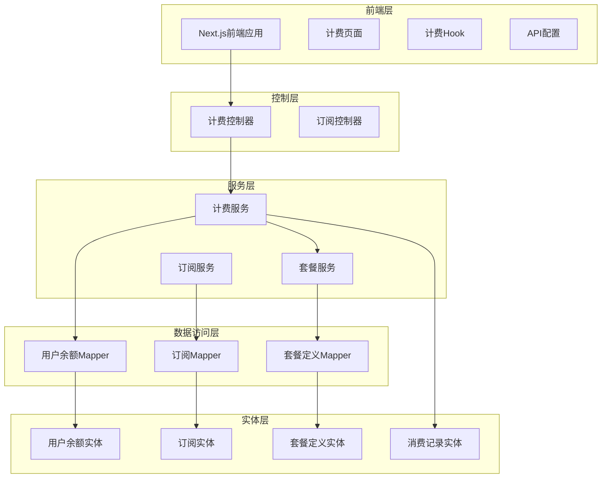
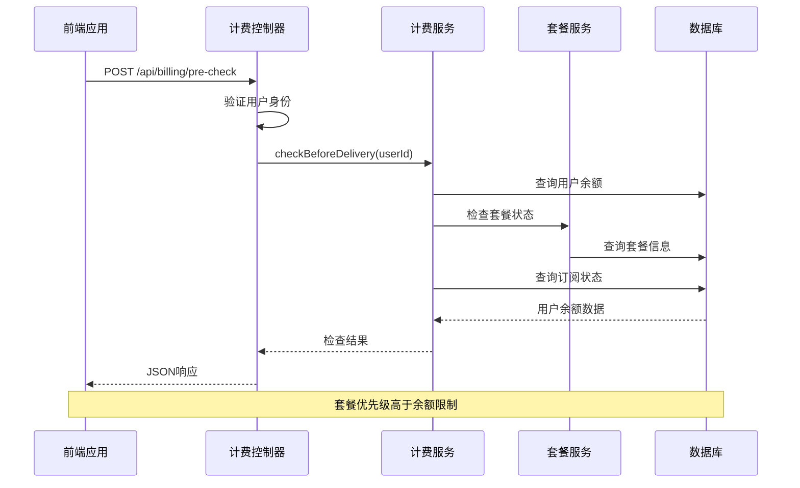
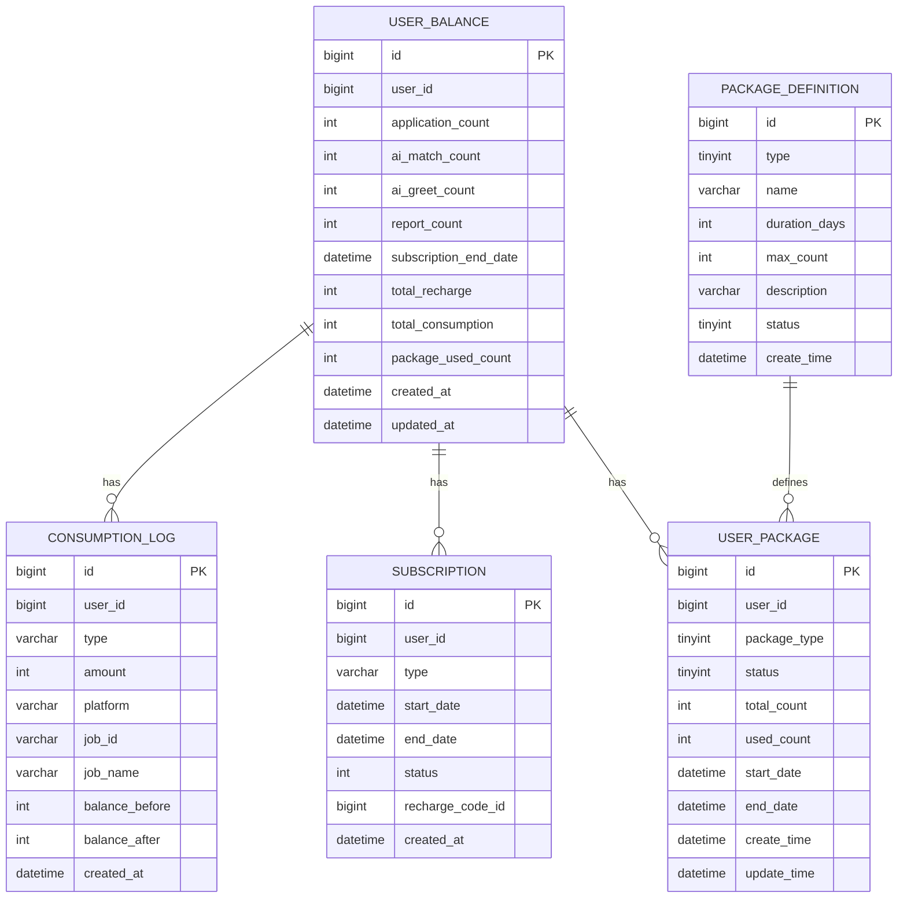
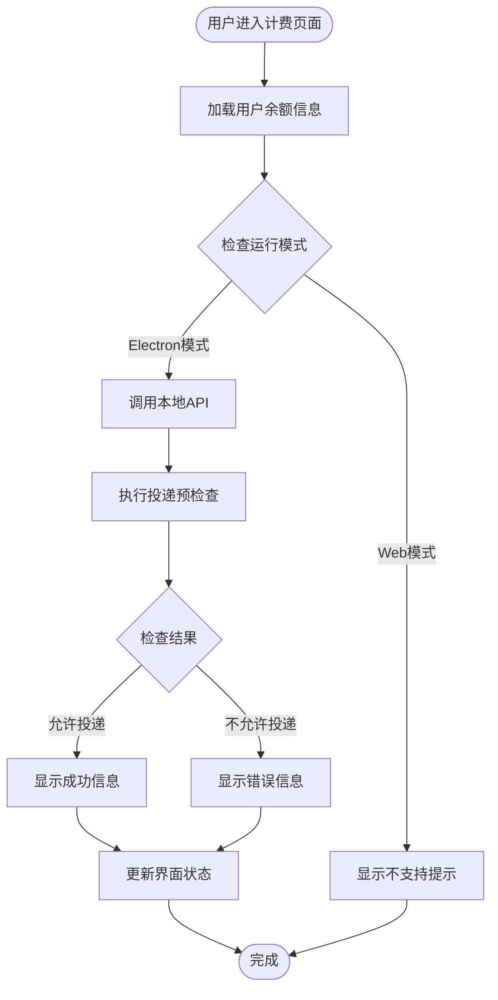
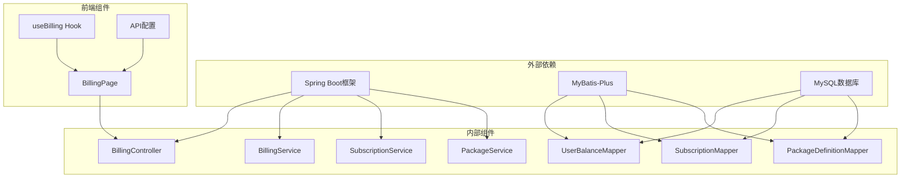

# 计费订阅接口

<cite>
**本文档引用的文件**
- [BillingController.java](file://backend/src/main/java/com/getjobs/application/controller/BillingController.java)
- [BillingService.java](file://backend/src/main/java/com/getjobs/application/service/BillingService.java)
- [SubscriptionService.java](file://backend/src/main/java/com/getjobs/application/service/SubscriptionService.java)
- [PackageService.java](file://backend/src/main/java/com/getjobs/application/service/PackageService.java)
- [UserBalanceEntity.java](file://backend/src/main/java/com/getjobs/application/entity/UserBalanceEntity.java)
- [SubscriptionEntity.java](file://backend/src/main/java/com/getjobs/application/entity/SubscriptionEntity.java)
- [PackageDefinitionEntity.java](file://backend/src/main/java/com/getjobs/application/entity/PackageDefinitionEntity.java)
- [ConsumptionLogEntity.java](file://backend/src/main/java/com/getjobs/application/entity/ConsumptionLogEntity.java)
- [UserBalanceMapper.java](file://backend/src/main/java/com/getjobs/application/mapper/UserBalanceMapper.java)
- [SubscriptionMapper.java](file://backend/src/main/java/com/getjobs/application/mapper/SubscriptionMapper.java)
- [PackageDefinitionMapper.java](file://backend/src/main/java/com/getjobs/application/mapper/PackageDefinitionMapper.java)
- [page.tsx](file://front/app/billing/page.tsx)
- [useBilling.ts](file://front/hooks/useBilling.ts)
- [api-config.ts](file://front/lib/api-config.ts)
- [package_init.sql](file://backend/src/main/resources/package_init.sql)
</cite>

## 目录
1. [简介](#简介)
2. [项目结构](#项目结构)
3. [核心组件](#核心组件)
4. [架构概览](#架构概览)
5. [详细组件分析](#详细组件分析)
6. [依赖关系分析](#依赖关系分析)
7. [性能考虑](#性能考虑)
8. [故障排除指南](#故障排除指南)
9. [结论](#结论)

## 简介

计费订阅接口是GetJobs应用中的核心功能模块，负责管理用户的投递次数、订阅状态和套餐系统。该系统采用Spring Boot后端框架和Next.js前端技术栈，提供了完整的计费管理和用户界面。

系统主要功能包括：
- 用户投递前的计费预检查
- 投递后的自动扣费机制
- 订阅状态管理
- 套餐系统的完整生命周期管理
- 用户余额和消费记录追踪

## 项目结构

计费订阅系统采用分层架构设计，主要分为以下层次：

**图表来源**
- [BillingController.java:1-76](file://backend/src/main/java/com/getjobs/application/controller/BillingController.java#L1-L76)
- [BillingService.java:1-206](file://backend/src/main/java/com/getjobs/application/service/BillingService.java#L1-L206)
- [SubscriptionService.java:1-160](file://backend/src/main/java/com/getjobs/application/service/SubscriptionService.java#L1-L160)

**章节来源**
- [BillingController.java:1-76](file://backend/src/main/java/com/getjobs/application/controller/BillingController.java#L1-L76)
- [BillingService.java:1-206](file://backend/src/main/java/com/getjobs/application/service/BillingService.java#L1-L206)
- [SubscriptionService.java:1-160](file://backend/src/main/java/com/getjobs/application/service/SubscriptionService.java#L1-L160)

## 核心组件

### 计费控制器 (BillingController)

计费控制器是前端与后端交互的入口点，提供投递预检查功能：

- **路径**: `/api/billing/pre-check`
- **功能**: 验证用户是否有足够的余额或有效订阅
- **返回**: 包含允许状态、剩余次数、订阅信息等的JSON响应

### 计费服务 (BillingService)

计费服务是核心业务逻辑实现：

- **投递前检查**: 优先检查套餐，然后检查订阅，最后检查余额
- **投递后扣费**: 支持套餐优先和余额扣费两种模式
- **用户信息查询**: 提供完整的用户计费信息

### 订阅服务 (SubscriptionService)

订阅服务管理用户的订阅状态：

- **订阅激活**: 支持不同类型的订阅（周、月、季度）
- **订阅状态查询**: 实时查询用户的订阅有效性
- **订阅历史**: 提供订阅历史记录查询

### 套餐服务 (PackageService)

套餐服务提供完整的套餐管理系统：

- **套餐激活**: 支持周套餐和月套餐
- **套餐使用**: 记录和管理套餐使用情况
- **套餐状态**: 查询和管理套餐的有效性

**章节来源**
- [BillingController.java:25-76](file://backend/src/main/java/com/getjobs/application/controller/BillingController.java#L25-L76)
- [BillingService.java:32-206](file://backend/src/main/java/com/getjobs/application/service/BillingService.java#L32-L206)
- [SubscriptionService.java:30-160](file://backend/src/main/java/com/getjobs/application/service/SubscriptionService.java#L30-L160)
- [PackageService.java:35-232](file://backend/src/main/java/com/getjobs/application/service/PackageService.java#L35-L232)

## 架构概览

计费订阅系统采用经典的三层架构模式，确保了良好的代码组织和可维护性：

**图表来源**
- [BillingController.java:30-75](file://backend/src/main/java/com/getjobs/application/controller/BillingController.java#L30-L75)
- [BillingService.java:39-91](file://backend/src/main/java/com/getjobs/application/service/BillingService.java#L39-L91)

系统的关键特性包括：

1. **优先级策略**: 套餐使用优先于余额扣费
2. **事务管理**: 关键操作使用Spring事务保证数据一致性
3. **实时监控**: 订阅状态实时检查和更新
4. **日志记录**: 完整的操作日志便于问题排查

## 详细组件分析

### 数据模型设计

系统采用MyBatis-Plus框架，实现了完整的数据持久化层：

**图表来源**
- [UserBalanceEntity.java:10-53](file://backend/src/main/java/com/getjobs/application/entity/UserBalanceEntity.java#L10-L53)
- [SubscriptionEntity.java:10-41](file://backend/src/main/java/com/getjobs/application/entity/SubscriptionEntity.java#L10-L41)
- [PackageDefinitionEntity.java:10-42](file://backend/src/main/java/com/getjobs/application/entity/PackageDefinitionEntity.java#L10-L42)
- [ConsumptionLogEntity.java:10-47](file://backend/src/main/java/com/getjobs/application/entity/ConsumptionLogEntity.java#L10-L47)

### 前端集成方案

前端采用React Hook模式，提供直观的用户界面：

**图表来源**
- [useBilling.ts:32-75](file://front/hooks/useBilling.ts#L32-L75)
- [page.tsx:15-45](file://front/app/billing/page.tsx#L15-L45)

**章节来源**
- [UserBalanceEntity.java:10-53](file://backend/src/main/java/com/getjobs/application/entity/UserBalanceEntity.java#L10-L53)
- [SubscriptionEntity.java:10-41](file://backend/src/main/java/com/getjobs/application/entity/SubscriptionEntity.java#L10-L41)
- [PackageDefinitionEntity.java:10-42](file://backend/src/main/java/com/getjobs/application/entity/PackageDefinitionEntity.java#L10-L42)
- [ConsumptionLogEntity.java:10-47](file://backend/src/main/java/com/getjobs/application/entity/ConsumptionLogEntity.java#L10-L47)
- [useBilling.ts:17-99](file://front/hooks/useBilling.ts#L17-L99)
- [page.tsx:7-183](file://front/app/billing/page.tsx#L7-L183)

## 依赖关系分析

系统采用松耦合的设计，各组件间依赖关系清晰：

**图表来源**
- [BillingController.java:1-76](file://backend/src/main/java/com/getjobs/application/controller/BillingController.java#L1-L76)
- [BillingService.java:1-206](file://backend/src/main/java/com/getjobs/application/service/BillingService.java#L1-L206)
- [SubscriptionService.java:1-160](file://backend/src/main/java/com/getjobs/application/service/SubscriptionService.java#L1-L160)
- [PackageService.java:1-232](file://backend/src/main/java/com/getjobs/application/service/PackageService.java#L1-L232)

**章节来源**
- [BillingController.java:1-76](file://backend/src/main/java/com/getjobs/application/controller/BillingController.java#L1-L76)
- [BillingService.java:1-206](file://backend/src/main/java/com/getjobs/application/service/BillingService.java#L1-L206)
- [SubscriptionService.java:1-160](file://backend/src/main/java/com/getjobs/application/service/SubscriptionService.java#L1-L160)
- [PackageService.java:1-232](file://backend/src/main/java/com/getjobs/application/service/PackageService.java#L1-L232)

## 性能考虑

系统在设计时充分考虑了性能优化：

1. **数据库索引优化**
   - 用户ID建立索引以加速查询
   - 订阅状态和到期时间建立复合索引
   - 套餐状态和到期时间建立索引

2. **缓存策略**
   - 用户余额信息可以考虑缓存
   - 套餐定义信息静态缓存
   - 订阅状态定期更新

3. **事务管理**
   - 关键操作使用事务保证数据一致性
   - 合理的事务边界避免长时间锁定

4. **异步处理**
   - 订阅过期检查可以异步执行
   - 套餐过期处理定时任务执行

## 故障排除指南

### 常见问题及解决方案

1. **用户认证失败**
   - 检查JWT令牌有效性
   - 验证用户ID是否正确传递
   - 确认用户账户状态正常

2. **计费预检查失败**
   - 检查数据库连接状态
   - 验证用户余额数据完整性
   - 确认套餐服务正常运行

3. **投递扣费异常**
   - 检查事务是否正确提交
   - 验证余额更新逻辑
   - 确认消费记录插入成功

4. **订阅状态异常**
   - 检查订阅到期时间计算
   - 验证订阅状态更新逻辑
   - 确认数据库约束条件

**章节来源**
- [BillingController.java:37-74](file://backend/src/main/java/com/getjobs/application/controller/BillingController.java#L37-L74)
- [BillingService.java:102-166](file://backend/src/main/java/com/getjobs/application/service/BillingService.java#L102-L166)
- [SubscriptionService.java:148-158](file://backend/src/main/java/com/getjobs/application/service/SubscriptionService.java#L148-L158)

## 结论

计费订阅接口系统设计合理，实现了完整的计费管理功能。系统采用分层架构，具有良好的可扩展性和可维护性。关键特性包括：

1. **灵活的计费策略**: 支持余额、订阅和套餐三种计费模式
2. **完整的生命周期管理**: 从激活到过期的完整管理流程
3. **实时状态监控**: 实时检查用户状态和权限
4. **完善的日志记录**: 详细的审计跟踪功能
5. **用户友好的界面**: 直观的前端操作体验

系统为GetJobs应用提供了可靠的计费基础设施，支持业务的持续发展和扩展。