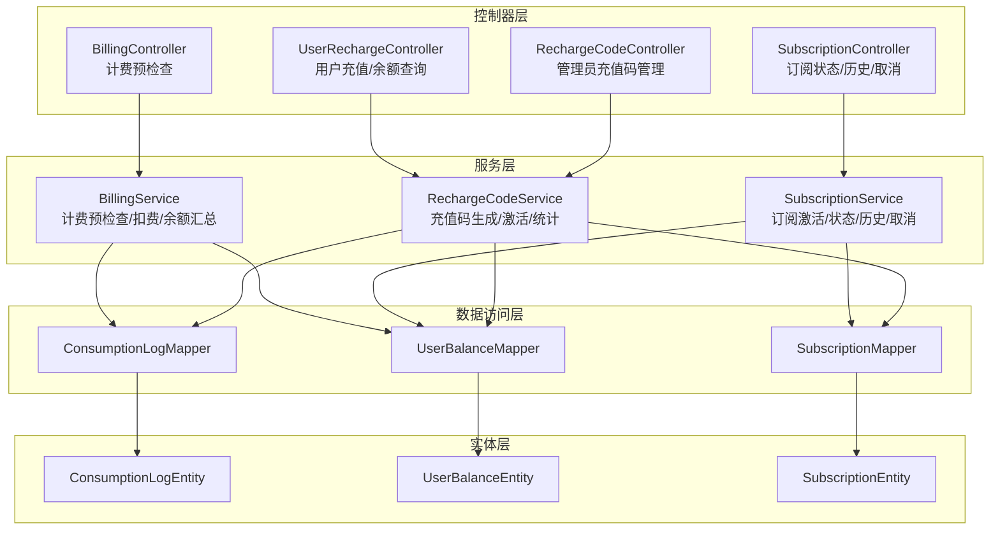
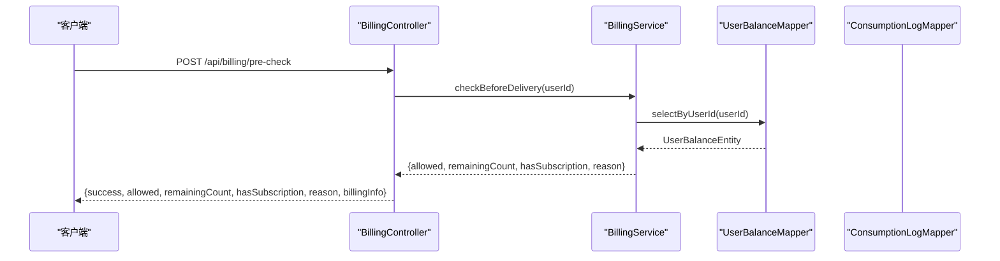
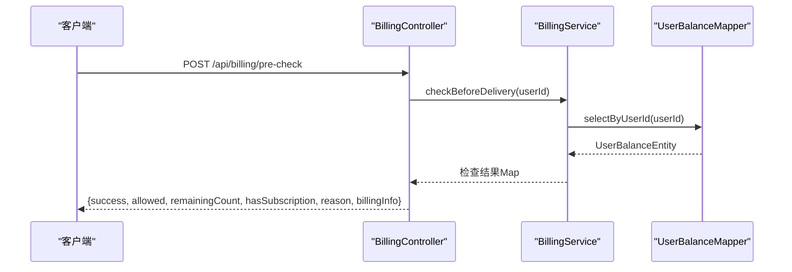
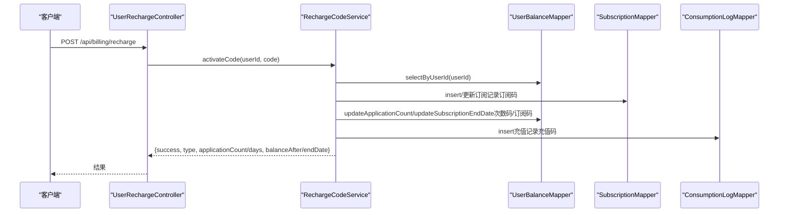
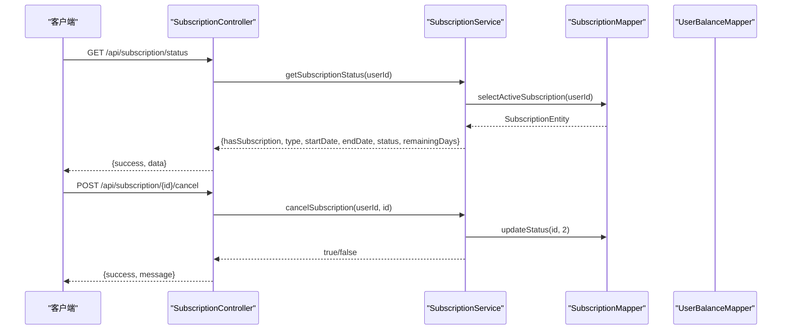
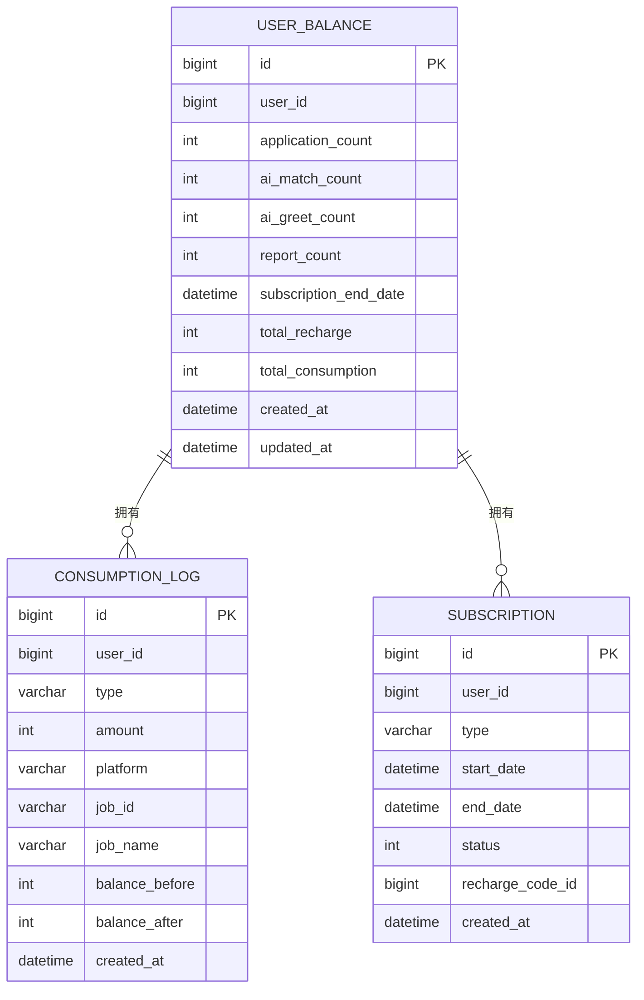
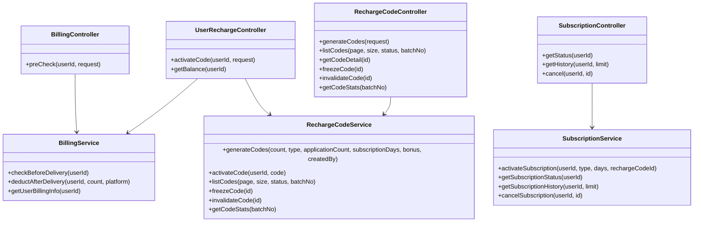
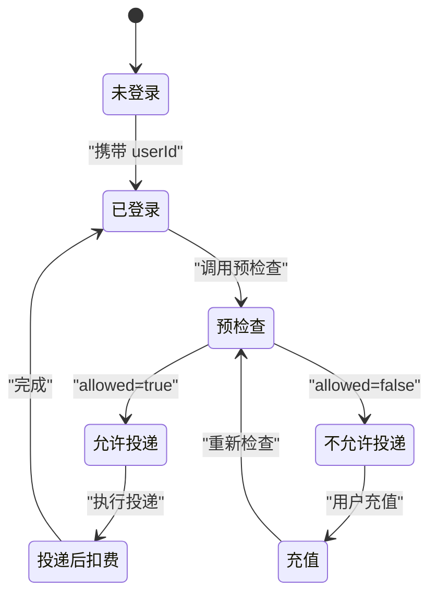

# 计费订阅接口

<cite>
**本文引用的文件**
- [BillingController.java](file://backend/src/main/java/com/getjobs/application/controller/BillingController.java)
- [UserRechargeController.java](file://backend/src/main/java/com/getjobs/application/controller/UserRechargeController.java)
- [SubscriptionController.java](file://backend/src/main/java/com/getjobs/application/controller/SubscriptionController.java)
- [RechargeCodeController.java](file://backend/src/main/java/com/getjobs/application/controller/RechargeCodeController.java)
- [BillingService.java](file://backend/src/main/java/com/getjobs/application/service/BillingService.java)
- [SubscriptionService.java](file://backend/src/main/java/com/getjobs/application/service/SubscriptionService.java)
- [RechargeCodeService.java](file://backend/src/main/java/com/getjobs/application/service/RechargeCodeService.java)
- [ConsumptionLogEntity.java](file://backend/src/main/java/com/getjobs/application/entity/ConsumptionLogEntity.java)
- [UserBalanceEntity.java](file://backend/src/main/java/com/getjobs/application/entity/UserBalanceEntity.java)
- [SubscriptionEntity.java](file://backend/src/main/java/com/getjobs/application/entity/SubscriptionEntity.java)
- [ConsumptionLogMapper.java](file://backend/src/main/java/com/getjobs/application/mapper/ConsumptionLogMapper.java)
- [UserBalanceMapper.java](file://backend/src/main/java/com/getjobs/application/mapper/UserBalanceMapper.java)
- [SubscriptionMapper.java](file://backend/src/main/java/com/getjobs/application/mapper/SubscriptionMapper.java)
- [application.yaml](file://backend/src/main/resources/application.yaml)
</cite>

## 目录
1. [简介](#简介)
2. [项目结构](#项目结构)
3. [核心组件](#核心组件)
4. [架构总览](#架构总览)
5. [详细组件分析](#详细组件分析)
6. [依赖关系分析](#依赖关系分析)
7. [性能考虑](#性能考虑)
8. [故障排除指南](#故障排除指南)
9. [结论](#结论)
10. [附录](#附录)

## 简介
本文件为计费订阅接口的完整 API 文档，覆盖用户充值、订阅管理、消费记录查询、余额与消费明细、充值记录等数据接口的规范说明。文档同时解释充值流程、订阅状态管理、许可证验证（充值码）的接口实现，并提供计费系统架构说明、扩展接口设计思路以及计费安全与数据保护相关措施。

## 项目结构
计费订阅相关模块位于后端 Java 工程中，采用 Spring Boot + MyBatis-Plus 架构，按职责划分为控制器层、服务层、数据访问层与实体层：
- 控制器层：对外暴露 REST 接口，负责参数接收、鉴权属性注入与响应封装
- 服务层：业务逻辑处理，包括计费预检查、投递扣费、订阅激活与取消、充值码激活与统计
- 数据访问层：基于 MyBatis-Plus 的 Mapper 接口，提供数据库读写能力
- 实体层：对应数据库表的数据模型

图表来源
- [BillingController.java:16-76](file://backend/src/main/java/com/getjobs/application/controller/BillingController.java#L16-L76)
- [UserRechargeController.java:15-80](file://backend/src/main/java/com/getjobs/application/controller/UserRechargeController.java#L15-L80)
- [SubscriptionController.java:14-77](file://backend/src/main/java/com/getjobs/application/controller/SubscriptionController.java#L14-L77)
- [RechargeCodeController.java:15-152](file://backend/src/main/java/com/getjobs/application/controller/RechargeCodeController.java#L15-L152)
- [BillingService.java:19-170](file://backend/src/main/java/com/getjobs/application/service/BillingService.java#L19-L170)
- [SubscriptionService.java:20-160](file://backend/src/main/java/com/getjobs/application/service/SubscriptionService.java#L20-L160)
- [RechargeCodeService.java:27-302](file://backend/src/main/java/com/getjobs/application/service/RechargeCodeService.java#L27-L302)
- [ConsumptionLogMapper.java:7-13](file://backend/src/main/java/com/getjobs/application/mapper/ConsumptionLogMapper.java#L7-L13)
- [UserBalanceMapper.java:13-46](file://backend/src/main/java/com/getjobs/application/mapper/UserBalanceMapper.java#L13-L46)
- [SubscriptionMapper.java:15-42](file://backend/src/main/java/com/getjobs/application/mapper/SubscriptionMapper.java#L15-L42)

章节来源
- [BillingController.java:16-76](file://backend/src/main/java/com/getjobs/application/controller/BillingController.java#L16-L76)
- [UserRechargeController.java:15-80](file://backend/src/main/java/com/getjobs/application/controller/UserRechargeController.java#L15-L80)
- [SubscriptionController.java:14-77](file://backend/src/main/java/com/getjobs/application/controller/SubscriptionController.java#L14-L77)
- [RechargeCodeController.java:15-152](file://backend/src/main/java/com/getjobs/application/controller/RechargeCodeController.java#L15-L152)

## 核心组件
- 计费控制器：提供投递前预检查接口，返回允许投递、剩余次数、订阅状态与原因等信息
- 用户充值控制器：提供充值码激活与余额查询接口
- 订阅控制器：提供订阅状态查询、历史查询与取消订阅接口
- 充值码控制器：提供充值码批量生成、列表查询、详情查询、冻结/作废与统计接口（管理员）
- 计费服务：实现投递前校验、投递后扣费、订阅有效性判断与用户计费信息汇总
- 订阅服务：实现订阅激活、状态查询、历史查询与取消订阅
- 充值码服务：实现充值码生成、激活（用户）、冻结/作废、统计与充值记录写入
- 数据访问层：提供用户余额、消费记录、订阅记录的增删改查能力

章节来源
- [BillingController.java:25-76](file://backend/src/main/java/com/getjobs/application/controller/BillingController.java#L25-L76)
- [UserRechargeController.java:25-80](file://backend/src/main/java/com/getjobs/application/controller/UserRechargeController.java#L25-L80)
- [SubscriptionController.java:21-77](file://backend/src/main/java/com/getjobs/application/controller/SubscriptionController.java#L21-L77)
- [RechargeCodeController.java:22-152](file://backend/src/main/java/com/getjobs/application/controller/RechargeCodeController.java#L22-L152)
- [BillingService.java:29-170](file://backend/src/main/java/com/getjobs/application/service/BillingService.java#L29-L170)
- [SubscriptionService.java:30-160](file://backend/src/main/java/com/getjobs/application/service/SubscriptionService.java#L30-L160)
- [RechargeCodeService.java:45-302](file://backend/src/main/java/com/getjobs/application/service/RechargeCodeService.java#L45-L302)

## 架构总览
计费订阅系统采用分层架构，通过控制器统一入口、服务层承载业务规则、数据访问层隔离持久化细节。系统支持两种计费模式：
- 次数型：按剩余投递次数扣减
- 订阅型：在有效期内免扣次

充值码支持两种类型：
- 次数码：激活后增加投递次数
- 订阅码：激活后延长订阅有效期

图表来源
- [BillingController.java:30-76](file://backend/src/main/java/com/getjobs/application/controller/BillingController.java#L30-L76)
- [BillingService.java:35-65](file://backend/src/main/java/com/getjobs/application/service/BillingService.java#L35-L65)
- [UserBalanceMapper.java:16-20](file://backend/src/main/java/com/getjobs/application/mapper/UserBalanceMapper.java#L16-L20)

章节来源
- [BillingController.java:25-76](file://backend/src/main/java/com/getjobs/application/controller/BillingController.java#L25-L76)
- [BillingService.java:29-170](file://backend/src/main/java/com/getjobs/application/service/BillingService.java#L29-L170)

## 详细组件分析

### 计费预检查接口
- 接口路径：POST /api/billing/pre-check
- 功能：在投递前验证用户是否具备足够余额或有效订阅，返回允许投递、剩余次数、订阅状态与原因
- 请求头：需携带用户鉴权属性（由网关/过滤器注入）
- 请求体：可包含平台标识与期望投递数量（默认为1）
- 响应字段：
  - success：布尔值，请求是否成功
  - allowed：布尔值，是否允许投递
  - remainingCount：整数，剩余投递次数
  - hasSubscription：布尔值，是否存在有效订阅
  - subscriptionEndDate：日期时间，订阅到期时间
  - reason：字符串，不允许投递的原因
  - billingInfo：对象，用户计费信息（见“余额查询”）

图表来源
- [BillingController.java:30-76](file://backend/src/main/java/com/getjobs/application/controller/BillingController.java#L30-L76)
- [BillingService.java:35-65](file://backend/src/main/java/com/getjobs/application/service/BillingService.java#L35-L65)
- [UserBalanceMapper.java:16-20](file://backend/src/main/java/com/getjobs/application/mapper/UserBalanceMapper.java#L16-L20)

章节来源
- [BillingController.java:25-76](file://backend/src/main/java/com/getjobs/application/controller/BillingController.java#L25-L76)
- [BillingService.java:29-170](file://backend/src/main/java/com/getjobs/application/service/BillingService.java#L29-L170)

### 用户充值接口
- 充值码激活：POST /api/billing/recharge
  - 请求体：{code: "充值码"}
  - 成功响应：包含充值类型（count 或 subscription）、对应数值（如 applicationCount 或 subscriptionDays）、余额/订阅到期时间、消息与成功标志
  - 失败响应：错误消息（如充值码不存在、已冻结、已作废、已使用）
- 余额查询：GET /api/billing/balance
  - 返回：success 与 data（计费信息对象）

图表来源
- [UserRechargeController.java:25-80](file://backend/src/main/java/com/getjobs/application/controller/UserRechargeController.java#L25-L80)
- [RechargeCodeService.java:178-280](file://backend/src/main/java/com/getjobs/application/service/RechargeCodeService.java#L178-L280)
- [UserBalanceMapper.java:24-44](file://backend/src/main/java/com/getjobs/application/mapper/UserBalanceMapper.java#L24-L44)
- [SubscriptionMapper.java:31-34](file://backend/src/main/java/com/getjobs/application/mapper/SubscriptionMapper.java#L31-L34)
- [ConsumptionLogMapper.java:7-13](file://backend/src/main/java/com/getjobs/application/mapper/ConsumptionLogMapper.java#L7-L13)

章节来源
- [UserRechargeController.java:25-80](file://backend/src/main/java/com/getjobs/application/controller/UserRechargeController.java#L25-L80)
- [RechargeCodeService.java:175-280](file://backend/src/main/java/com/getjobs/application/service/RechargeCodeService.java#L175-L280)

### 订阅管理接口
- 查询订阅状态：GET /api/subscription/status
  - 返回：hasSubscription、type、startDate、endDate、status、remainingDays
- 查询订阅历史：GET /api/subscription/history?limit=20
  - 返回：订阅历史列表（最多 limit 条）
- 取消订阅：POST /api/subscription/{id}/cancel
  - 返回：success 与 message

图表来源
- [SubscriptionController.java:21-77](file://backend/src/main/java/com/getjobs/application/controller/SubscriptionController.java#L21-L77)
- [SubscriptionService.java:90-160](file://backend/src/main/java/com/getjobs/application/service/SubscriptionService.java#L90-L160)
- [SubscriptionMapper.java:18-41](file://backend/src/main/java/com/getjobs/application/mapper/SubscriptionMapper.java#L18-L41)
- [UserBalanceMapper.java:40-44](file://backend/src/main/java/com/getjobs/application/mapper/UserBalanceMapper.java#L40-L44)

章节来源
- [SubscriptionController.java:21-77](file://backend/src/main/java/com/getjobs/application/controller/SubscriptionController.java#L21-L77)
- [SubscriptionService.java:90-160](file://backend/src/main/java/com/getjobs/application/service/SubscriptionService.java#L90-L160)

### 充值码管理接口（管理员）
- 批量生成充值码：POST /api/admin/recharge-codes/generate
  - 请求体：{count, type, applicationCount, subscriptionDays, bonus, createdBy}
  - 返回：batchNo、count、codes
- 查询充值码列表：GET /api/admin/recharge-codes?page=1&size=20&status=&batchNo=
- 查询单个充值码详情：GET /api/admin/recharge-codes/{id}
- 冻结充值码：POST /api/admin/recharge-codes/{id}/freeze
- 作废充值码：POST /api/admin/recharge-codes/{id}/invalidate
- 充值码统计：GET /api/admin/recharge-codes/stats?batchNo=

章节来源
- [RechargeCodeController.java:22-152](file://backend/src/main/java/com/getjobs/application/controller/RechargeCodeController.java#L22-L152)
- [RechargeCodeService.java:45-302](file://backend/src/main/java/com/getjobs/application/service/RechargeCodeService.java#L45-L302)

### 数据模型与关系

图表来源
- [UserBalanceEntity.java:13-50](file://backend/src/main/java/com/getjobs/application/entity/UserBalanceEntity.java#L13-L50)
- [SubscriptionEntity.java:13-41](file://backend/src/main/java/com/getjobs/application/entity/SubscriptionEntity.java#L13-L41)
- [ConsumptionLogEntity.java:13-47](file://backend/src/main/java/com/getjobs/application/entity/ConsumptionLogEntity.java#L13-L47)

章节来源
- [UserBalanceEntity.java:10-50](file://backend/src/main/java/com/getjobs/application/entity/UserBalanceEntity.java#L10-L50)
- [SubscriptionEntity.java:10-41](file://backend/src/main/java/com/getjobs/application/entity/SubscriptionEntity.java#L10-L41)
- [ConsumptionLogEntity.java:10-47](file://backend/src/main/java/com/getjobs/application/entity/ConsumptionLogEntity.java#L10-L47)

## 依赖关系分析
- 控制器依赖服务：各控制器通过构造器注入对应服务，解耦业务逻辑与 HTTP 层
- 服务依赖 Mapper：服务层通过注入 Mapper 访问数据库，遵循单一职责
- 实体与 Mapper：实体类标注 MyBatis-Plus 注解，Mapper 继承 BaseMapper，简化 CRUD
- 事务边界：涉及多表更新（如充值码激活、投递扣费、订阅激活）的服务方法标注事务注解，保证一致性

图表来源
- [BillingController.java:21-24](file://backend/src/main/java/com/getjobs/application/controller/BillingController.java#L21-L24)
- [UserRechargeController.java:18-24](file://backend/src/main/java/com/getjobs/application/controller/UserRechargeController.java#L18-L24)
- [SubscriptionController.java:18-20](file://backend/src/main/java/com/getjobs/application/controller/SubscriptionController.java#L18-L20)
- [RechargeCodeController.java:19-21](file://backend/src/main/java/com/getjobs/application/controller/RechargeCodeController.java#L19-L21)
- [BillingService.java:21-28](file://backend/src/main/java/com/getjobs/application/service/BillingService.java#L21-L28)
- [SubscriptionService.java:22-29](file://backend/src/main/java/com/getjobs/application/service/SubscriptionService.java#L22-L29)
- [RechargeCodeService.java:27-44](file://backend/src/main/java/com/getjobs/application/service/RechargeCodeService.java#L27-L44)

章节来源
- [BillingController.java:21-24](file://backend/src/main/java/com/getjobs/application/controller/BillingController.java#L21-L24)
- [UserRechargeController.java:18-24](file://backend/src/main/java/com/getjobs/application/controller/UserRechargeController.java#L18-L24)
- [SubscriptionController.java:18-20](file://backend/src/main/java/com/getjobs/application/controller/SubscriptionController.java#L18-L20)
- [RechargeCodeController.java:19-21](file://backend/src/main/java/com/getjobs/application/controller/RechargeCodeController.java#L19-L21)
- [BillingService.java:21-28](file://backend/src/main/java/com/getjobs/application/service/BillingService.java#L21-L28)
- [SubscriptionService.java:22-29](file://backend/src/main/java/com/getjobs/application/service/SubscriptionService.java#L22-L29)
- [RechargeCodeService.java:27-44](file://backend/src/main/java/com/getjobs/application/service/RechargeCodeService.java#L27-L44)

## 性能考虑
- 数据库连接池：HikariCP 最大连接数限制为 10，建议根据并发峰值评估扩容
- 事务范围：充值码激活、投递扣费、订阅激活均在事务内执行，避免部分更新
- 查询优化：余额与订阅查询使用精确条件与排序，建议在 user_id 上建立索引
- 日志级别：生产环境建议调整为 INFO，避免高频日志影响性能
- 超时与重试：平台导航超时与重试策略在配置文件中集中管理，减少异常抖动

章节来源
- [application.yaml:19-24](file://backend/src/main/resources/application.yaml#L19-L24)
- [application.yaml:42-53](file://backend/src/main/resources/application.yaml#L42-L53)
- [application.yaml:70-98](file://backend/src/main/resources/application.yaml#L70-L98)

## 故障排除指南
- 未提供认证令牌：计费预检查返回 401，提示未提供认证令牌
- 用户不存在：计费预检查返回不允许投递并给出原因
- 余额不足：投递后扣费返回失败，日志记录余额不足
- 充值码状态异常：激活时报错（不存在、已使用、已冻结、已作废）
- 订阅取消失败：订阅不存在或不属于当前用户时返回失败

章节来源
- [BillingController.java:37-41](file://backend/src/main/java/com/getjobs/application/controller/BillingController.java#L37-L41)
- [BillingService.java:40-46](file://backend/src/main/java/com/getjobs/application/service/BillingService.java#L40-L46)
- [BillingService.java:99-104](file://backend/src/main/java/com/getjobs/application/service/BillingService.java#L99-L104)
- [RechargeCodeService.java:183-194](file://backend/src/main/java/com/getjobs/application/service/RechargeCodeService.java#L183-L194)
- [SubscriptionService.java:148-158](file://backend/src/main/java/com/getjobs/application/service/SubscriptionService.java#L148-L158)

## 结论
本计费订阅接口通过清晰的分层架构实现了充值、订阅、消费与余额管理的完整闭环。接口设计简洁、职责明确，配合事务与实体模型保障了数据一致性。建议后续扩展方向包括：支付集成（对接第三方支付渠道）、订单管理（统一订单号与回调处理）、审计日志增强与权限细化。

## 附录

### 接口清单与规范

- 计费预检查
  - 方法：POST
  - 路径：/api/billing/pre-check
  - 请求头：需注入 userId
  - 请求体：{platform?, expectedDeliveryCount?}
  - 响应：{success, allowed, remainingCount, hasSubscription, subscriptionEndDate, reason, billingInfo}

- 充值码激活
  - 方法：POST
  - 路径：/api/billing/recharge
  - 请求头：需注入 userId
  - 请求体：{code}
  - 响应：{success, type, applicationCount/days, balanceAfter/endDate, message}

- 余额查询
  - 方法：GET
  - 路径：/api/billing/balance
  - 请求头：需注入 userId
  - 响应：{success, data: billingInfo}

- 订阅状态查询
  - 方法：GET
  - 路径：/api/subscription/status
  - 请求头：需注入 userId
  - 响应：{success, data: {hasSubscription, type, startDate, endDate, status, remainingDays}}

- 订阅历史查询
  - 方法：GET
  - 路径：/api/subscription/history?limit=20
  - 请求头：需注入 userId
  - 响应：{success, data: [SubscriptionEntity...]}

- 取消订阅
  - 方法：POST
  - 路径：/api/subscription/{id}/cancel
  - 请求头：需注入 userId
  - 响应：{success, message}

- 充值码生成（管理员）
  - 方法：POST
  - 路径：/api/admin/recharge-codes/generate
  - 请求体：{count, type, applicationCount, subscriptionDays, bonus, createdBy}
  - 响应：{success, data: {batchNo, count, codes}}

- 充值码列表（管理员）
  - 方法：GET
  - 路径：/api/admin/recharge-codes?page=&size=&status=&batchNo=
  - 响应：{success, data: 分页结果}

- 充值码详情（管理员）
  - 方法：GET
  - 路径：/api/admin/recharge-codes/{id}
  - 响应：{success, data: RechargeCodeEntity}

- 冻结充值码（管理员）
  - 方法：POST
  - 路径：/api/admin/recharge-codes/{id}/freeze
  - 响应：{success, message}

- 作废充值码（管理员）
  - 方法：POST
  - 路径：/api/admin/recharge-codes/{id}/invalidate
  - 响应：{success, message}

- 充值码统计（管理员）
  - 方法：GET
  - 路径：/api/admin/recharge-codes/stats?batchNo=
  - 响应：{success, data: 统计结果}

章节来源
- [BillingController.java:25-76](file://backend/src/main/java/com/getjobs/application/controller/BillingController.java#L25-L76)
- [UserRechargeController.java:25-80](file://backend/src/main/java/com/getjobs/application/controller/UserRechargeController.java#L25-L80)
- [SubscriptionController.java:21-77](file://backend/src/main/java/com/getjobs/application/controller/SubscriptionController.java#L21-L77)
- [RechargeCodeController.java:22-152](file://backend/src/main/java/com/getjobs/application/controller/RechargeCodeController.java#L22-L152)

### 计费流程与状态机

图表来源
- [BillingController.java:30-76](file://backend/src/main/java/com/getjobs/application/controller/BillingController.java#L30-L76)
- [BillingService.java:76-130](file://backend/src/main/java/com/getjobs/application/service/BillingService.java#L76-L130)

### 计费安全与数据保护
- 鉴权：控制器通过请求属性注入 userId，确保接口调用身份
- 事务：关键业务（充值码激活、投递扣费、订阅激活）使用事务，防止数据不一致
- 加密：数据库连接密码使用 Jasypt 加密，密钥可通过环境变量注入
- 日志：记录关键事件（扣费、激活、取消）便于审计与排障
- 超时与稳定性：平台导航超时与重试策略集中配置，提升系统稳定性

章节来源
- [application.yaml:28-35](file://backend/src/main/resources/application.yaml#L28-L35)
- [application.yaml:37-40](file://backend/src/main/resources/application.yaml#L37-L40)
- [application.yaml:70-98](file://backend/src/main/resources/application.yaml#L70-L98)