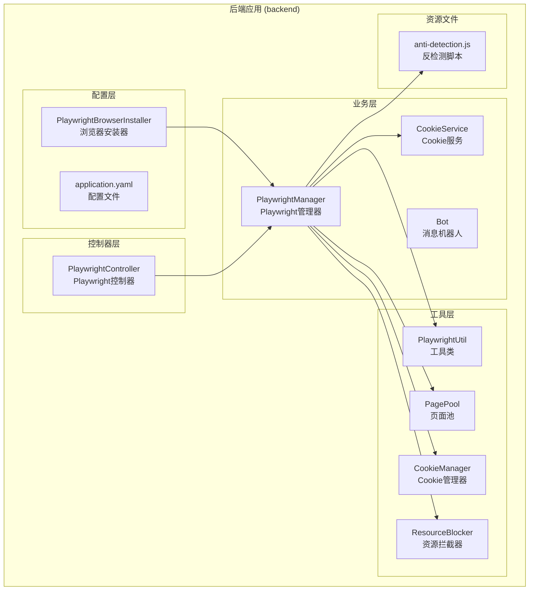
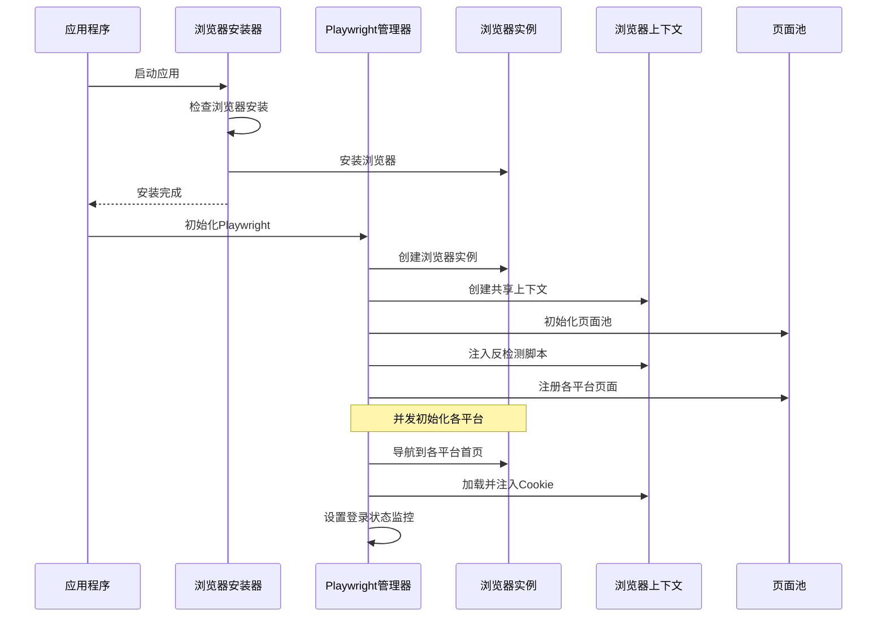
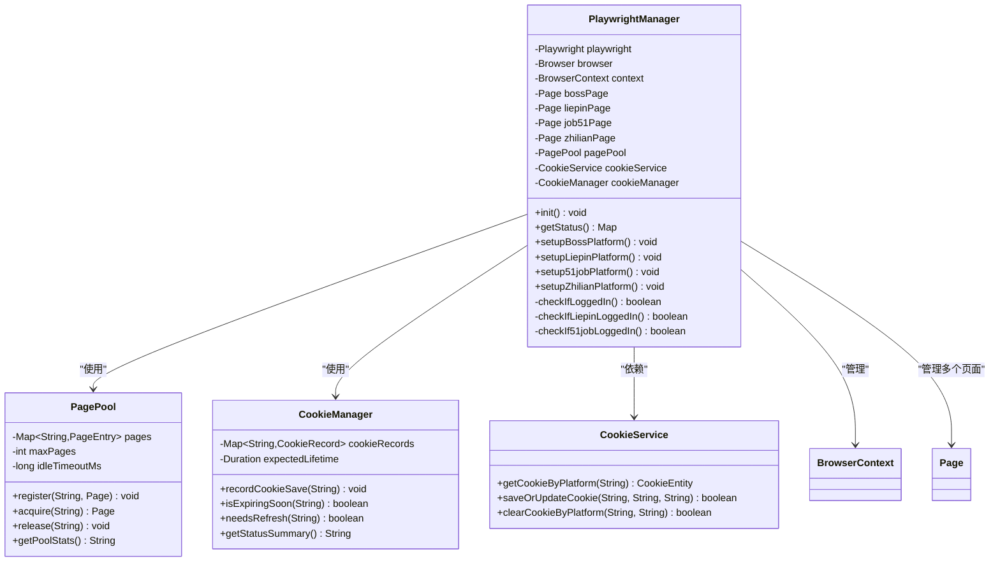
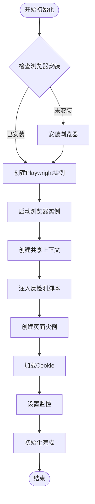
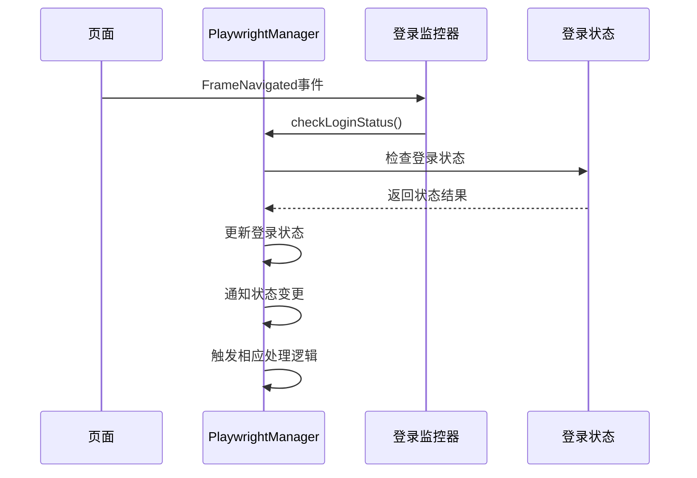
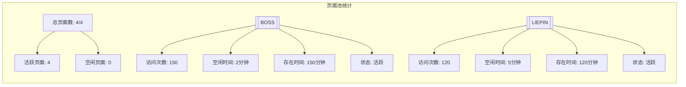
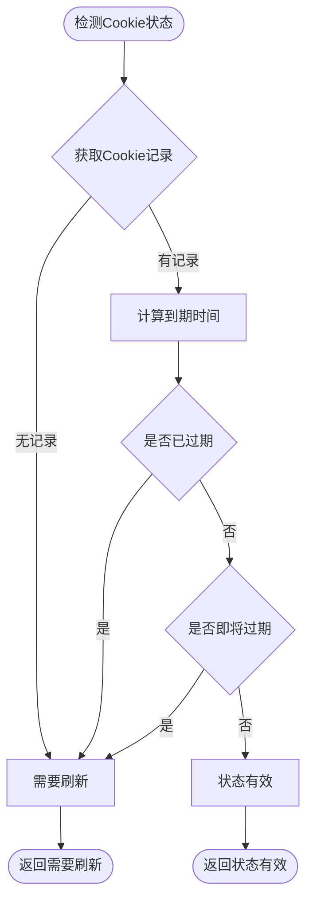
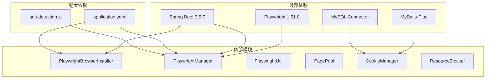

# Playwright 浏览器管理

<cite>
**本文档引用的文件**
- [PlaywrightBrowserInstaller.java](file://backend/src/main/java/com/getjobs/application/config/PlaywrightBrowserInstaller.java)
- [PlaywrightController.java](file://backend/src/main/java/com/getjobs/application/controller/PlaywrightController.java)
- [PlaywrightManager.java](file://backend/src/main/java/com/getjobs/worker/manager/PlaywrightManager.java)
- [PlaywrightUtil.java](file://backend/src/main/java/com/getjobs/worker/utils/PlaywrightUtil.java)
- [PagePool.java](file://backend/src/main/java/com/getjobs/worker/utils/PagePool.java)
- [CookieManager.java](file://backend/src/main/java/com/getjobs/worker/utils/CookieManager.java)
- [ResourceBlocker.java](file://backend/src/main/java/com/getjobs/worker/utils/ResourceBlocker.java)
- [anti-detection.js](file://backend/src/main/resources/anti-detection.js)
- [application.yaml](file://backend/src/main/resources/application.yaml)
- [CookieService.java](file://backend/src/main/java/com/getjobs/application/service/CookieService.java)
- [Bot.java](file://backend/src/main/java/com/getjobs/worker/utils/Bot.java)
- [GetJobsApplication.java](file://backend/src/main/java/com/getjobs/GetJobsApplication.java)
- [pom.xml](file://backend/pom.xml)
</cite>

## 目录
1. [简介](#简介)
2. [项目结构](#项目结构)
3. [核心组件](#核心组件)
4. [架构概览](#架构概览)
5. [详细组件分析](#详细组件分析)
6. [依赖关系分析](#依赖关系分析)
7. [性能考虑](#性能考虑)
8. [故障排除指南](#故障排除指南)
9. [结论](#结论)

## 简介

Playwright 浏览器管理系统是一个基于 Spring Boot 和 Playwright 的自动化求职平台管理系统。该系统实现了对多个求职网站（Boss 直聘、猎聘、51job、智联招聘）的自动化管理和监控，提供了完整的浏览器生命周期管理、Cookie 管理、登录状态监控和资源优化功能。

系统采用多页面共享浏览器上下文的设计，所有平台在同一个浏览器窗口的不同标签页中运行，实现了高效的资源利用和统一的状态管理。

## 项目结构

**图表来源**
- [PlaywrightBrowserInstaller.java:1-195](file://backend/src/main/java/com/getjobs/application/config/PlaywrightBrowserInstaller.java#L1-L195)
- [PlaywrightController.java:1-64](file://backend/src/main/java/com/getjobs/application/controller/PlaywrightController.java#L1-L64)
- [PlaywrightManager.java:1-800](file://backend/src/main/java/com/getjobs/worker/manager/PlaywrightManager.java#L1-L800)

**章节来源**
- [GetJobsApplication.java:1-22](file://backend/src/main/java/com/getjobs/GetJobsApplication.java#L1-L22)
- [pom.xml:1-327](file://backend/pom.xml#L1-L327)

## 核心组件

### PlaywrightBrowserInstaller - 浏览器安装器

负责在应用启动时自动检查和安装 Playwright 浏览器。支持多种操作系统和浏览器类型，具备智能路径检测和错误处理机制。

### PlaywrightManager - Playwright 管理器

系统的核心组件，实现了完整的浏览器生命周期管理。主要功能包括：

- **多平台支持**：同时管理 Boss 直聘、猎聘、51job、智联招聘四个平台
- **共享上下文**：所有平台共享同一个浏览器窗口和上下文
- **登录状态监控**：实时监控各平台的登录状态变化
- **资源优化**：支持资源拦截和页面池管理
- **反检测机制**：集成 anti-detection.js 脚本防止被检测为自动化工具

### PagePool - 页面池管理器

实现页面资源的统一管理和监控，提供以下功能：

- **资源追踪**：记录每个页面的使用情况和空闲时间
- **统计报告**：提供详细的页面使用统计信息
- **生命周期管理**：跟踪页面的创建、使用和销毁过程

### CookieManager - Cookie 管理器

负责 Cookie 的生命周期管理，包括：

- **过期检测**：根据平台特性检测 Cookie 即将过期状态
- **自动刷新**：提供 Cookie 刷新触发机制
- **状态监控**：记录和监控各平台 Cookie 的有效性

**章节来源**
- [PlaywrightBrowserInstaller.java:15-195](file://backend/src/main/java/com/getjobs/application/config/PlaywrightBrowserInstaller.java#L15-L195)
- [PlaywrightManager.java:30-221](file://backend/src/main/java/com/getjobs/worker/manager/PlaywrightManager.java#L30-L221)
- [PagePool.java:11-278](file://backend/src/main/java/com/getjobs/worker/utils/PagePool.java#L11-L278)
- [CookieManager.java:15-259](file://backend/src/main/java/com/getjobs/worker/utils/CookieManager.java#L15-L259)

## 架构概览

**图表来源**
- [PlaywrightBrowserInstaller.java:33-72](file://backend/src/main/java/com/getjobs/application/config/PlaywrightBrowserInstaller.java#L33-L72)
- [PlaywrightManager.java:114-221](file://backend/src/main/java/com/getjobs/worker/manager/PlaywrightManager.java#L114-L221)

系统采用分层架构设计，各组件职责清晰，通过依赖注入实现松耦合。核心的 PlaywrightManager 作为单例 Bean，在应用启动时自动初始化，确保整个系统的稳定运行。

## 详细组件分析

### PlaywrightManager 详细分析

PlaywrightManager 是系统的核心协调者，实现了复杂的多平台浏览器管理逻辑。

#### 类关系图

**图表来源**
- [PlaywrightManager.java:40-221](file://backend/src/main/java/com/getjobs/worker/manager/PlaywrightManager.java#L40-L221)
- [PagePool.java:25-100](file://backend/src/main/java/com/getjobs/worker/utils/PagePool.java#L25-L100)
- [CookieManager.java:31-153](file://backend/src/main/java/com/getjobs/worker/utils/CookieManager.java#L31-L153)
- [CookieService.java:18-97](file://backend/src/main/java/com/getjobs/application/service/CookieService.java#L18-L97)

#### 初始化流程

**图表来源**
- [PlaywrightManager.java:114-221](file://backend/src/main/java/com/getjobs/worker/manager/PlaywrightManager.java#L114-L221)

#### 登录状态监控机制

系统实现了多平台的登录状态监控，采用事件驱动的方式实时检测登录状态变化：

**图表来源**
- [PlaywrightManager.java:376-388](file://backend/src/main/java/com/getjobs/worker/manager/PlaywrightManager.java#L376-L388)
- [PlaywrightManager.java:568-579](file://backend/src/main/java/com/getjobs/worker/manager/PlaywrightManager.java#L568-L579)

**章节来源**
- [PlaywrightManager.java:114-800](file://backend/src/main/java/com/getjobs/worker/manager/PlaywrightManager.java#L114-L800)

### PagePool 组件分析

PagePool 实现了页面资源的统一管理，提供了完整的生命周期监控和统计功能。

#### 页面池统计功能

**图表来源**
- [PagePool.java:116-134](file://backend/src/main/java/com/getjobs/worker/utils/PagePool.java#L116-L134)

**章节来源**
- [PagePool.java:11-278](file://backend/src/main/java/com/getjobs/worker/utils/PagePool.java#L11-L278)

### CookieManager 组件分析

CookieManager 提供了智能的 Cookie 生命周期管理，支持不同平台的差异化配置。

#### Cookie 过期检测算法

**图表来源**
- [CookieManager.java:74-129](file://backend/src/main/java/com/getjobs/worker/utils/CookieManager.java#L74-L129)

**章节来源**
- [CookieManager.java:15-259](file://backend/src/main/java/com/getjobs/worker/utils/CookieManager.java#L15-L259)

## 依赖关系分析

**图表来源**
- [pom.xml:82-101](file://backend/pom.xml#L82-L101)
- [application.yaml:70-105](file://backend/src/main/resources/application.yaml#L70-L105)

系统的主要技术栈包括：

- **Playwright**: 浏览器自动化核心框架
- **Spring Boot**: 应用框架和依赖注入
- **MyBatis-Plus**: 数据持久化层
- **MySQL**: 数据库存储
- **Lombok**: 代码简化工具

**章节来源**
- [pom.xml:1-327](file://backend/pom.xml#L1-L327)
- [application.yaml:1-108](file://backend/src/main/resources/application.yaml#L1-L108)

## 性能考虑

### 资源优化策略

系统采用了多种资源优化策略来提升性能和稳定性：

1. **资源拦截**: 通过 ResourceBlocker 拦截不必要的资源请求，减少网络带宽和内存占用
2. **页面池管理**: 使用 PagePool 统一管理页面资源，避免频繁创建销毁
3. **并发初始化**: 各平台页面并发初始化，缩短启动时间
4. **反检测机制**: 集成 anti-detection.js 脚本，提高浏览器稳定性

### 性能配置参数

系统提供了丰富的性能调优参数：

- **slow-mo**: 操作延迟（默认20ms）
- **navigation-timeout**: 导航超时时间（默认30000ms）
- **max-pages**: 最大页面数量（默认4）
- **idle-page-timeout**: 空闲页面回收时间（默认300000ms）

**章节来源**
- [application.yaml:70-105](file://backend/src/main/resources/application.yaml#L70-L105)
- [ResourceBlocker.java:10-21](file://backend/src/main/java/com/getjobs/worker/utils/ResourceBlocker.java#L10-L21)

## 故障排除指南

### 常见问题及解决方案

#### 浏览器安装问题

**问题**: Playwright 浏览器未正确安装
**解决方案**: 
1. 检查 `playwright.auto-install` 配置
2. 手动执行 `npx playwright install chromium`
3. 验证浏览器安装路径

#### 登录状态监控失效

**问题**: 各平台登录状态监控不准确
**解决方案**:
1. 检查 `login-check-interval` 配置
2. 验证反检测脚本是否正确注入
3. 确认页面导航事件监听是否正常

#### 页面资源不足

**问题**: 页面池资源耗尽
**解决方案**:
1. 检查 `max-pages` 配置
2. 监控页面使用统计
3. 优化页面生命周期管理

**章节来源**
- [PlaywrightBrowserInstaller.java:66-70](file://backend/src/main/java/com/getjobs/application/config/PlaywrightBrowserInstaller.java#L66-L70)
- [PlaywrightManager.java:376-388](file://backend/src/main/java/com/getjobs/worker/manager/PlaywrightManager.java#L376-L388)

## 结论

Playwright 浏览器管理系统是一个设计精良的自动化解决方案，具有以下特点：

1. **架构清晰**: 采用分层架构，职责分离明确
2. **功能完整**: 支持多平台、多页面的复杂业务场景
3. **性能优化**: 实现了多种资源优化策略
4. **稳定性强**: 提供完善的错误处理和监控机制
5. **易于维护**: 代码结构清晰，配置灵活

系统通过合理的组件设计和配置管理，实现了高效、稳定的多平台求职网站自动化管理，为后续的功能扩展和维护奠定了良好的基础。