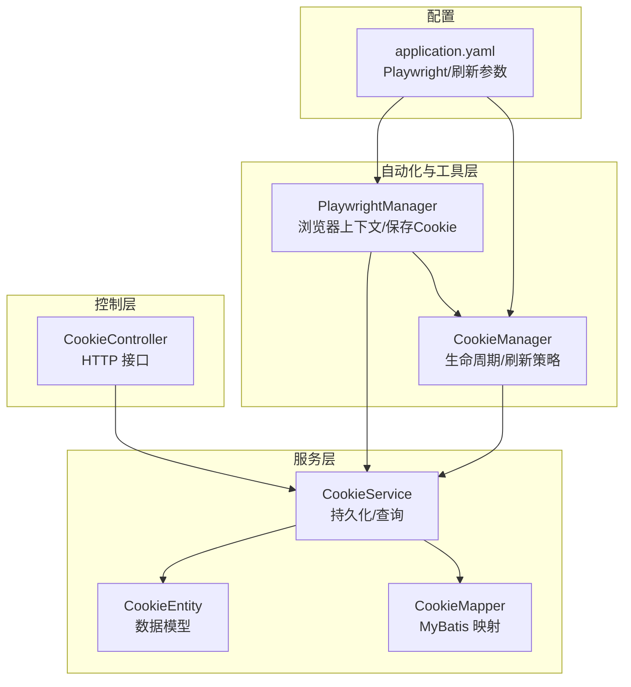
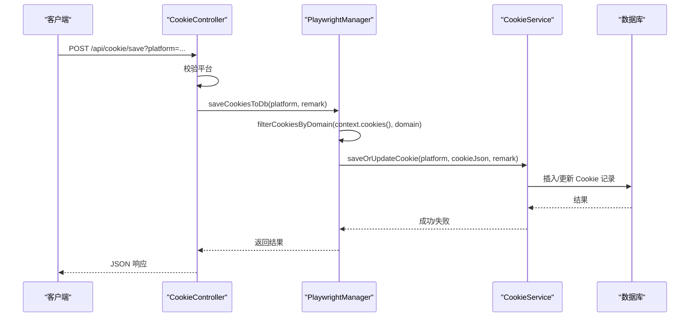
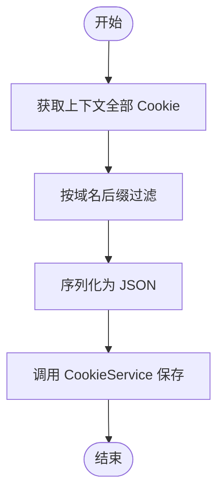
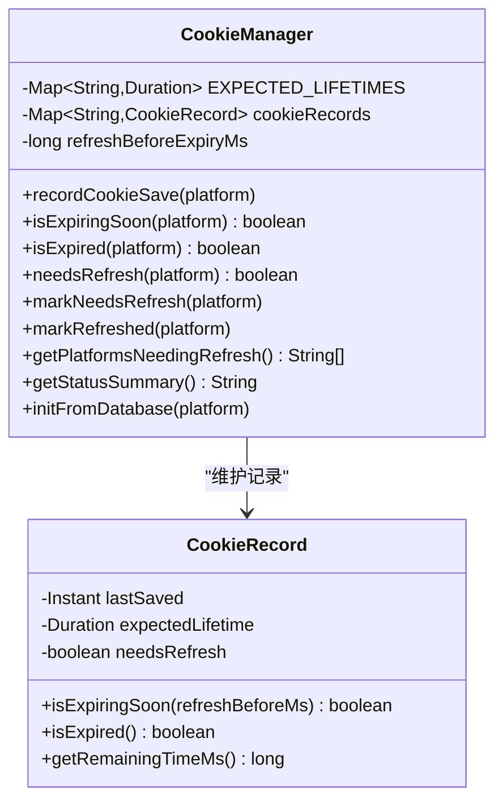
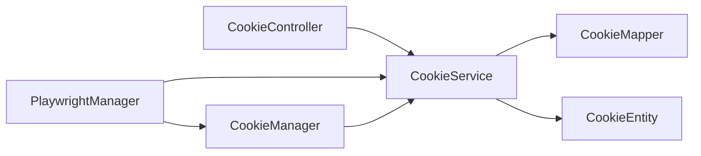

# Cookie 管理

<cite>
**本文引用的文件**
- [CookieController.java](file://backend/src/main/java/com/getjobs/application/controller/CookieController.java)
- [CookieService.java](file://backend/src/main/java/com/getjobs/application/service/CookieService.java)
- [CookieEntity.java](file://backend/src/main/java/com/getjobs/application/entity/CookieEntity.java)
- [CookieMapper.java](file://backend/src/main/java/com/getjobs/application/mapper/CookieMapper.java)
- [CookieManager.java](file://backend/src/main/java/com/getjobs/worker/utils/CookieManager.java)
- [PlaywrightManager.java](file://backend/src/main/java/com/getjobs/worker/manager/PlaywrightManager.java)
- [application.yaml](file://backend/src/main/resources/application.yaml)
</cite>

## 目录
1. [简介](#简介)
2. [项目结构](#项目结构)
3. [核心组件](#核心组件)
4. [架构总览](#架构总览)
5. [组件详解](#组件详解)
6. [依赖关系分析](#依赖关系分析)
7. [性能考量](#性能考量)
8. [故障排除指南](#故障排除指南)
9. [结论](#结论)
10. [附录](#附录)

## 简介
本技术文档围绕 Cookie 管理系统进行深入剖析，涵盖 Cookie 的解析、存储、同步与更新机制；跨平台 Cookie 管理策略（域名过滤、作用域管理、安全校验）；持久化存储方案（数据库与缓存）；自动刷新与失效检测策略；以及安全性、隐私与合规建议。目标读者为安全工程师与数据分析师。

## 项目结构
Cookie 管理涉及三层职责：
- 控制层：对外提供 Cookie 读取与保存的 HTTP 接口
- 服务层：封装 Cookie 的持久化与查询逻辑
- 工具与自动化层：负责浏览器上下文中的 Cookie 解析、过滤、持久化与生命周期管理

图表来源
- [CookieController.java:1-95](file://backend/src/main/java/com/getjobs/application/controller/CookieController.java#L1-L95)
- [CookieService.java:1-97](file://backend/src/main/java/com/getjobs/application/service/CookieService.java#L1-L97)
- [CookieEntity.java:1-54](file://backend/src/main/java/com/getjobs/application/entity/CookieEntity.java#L1-L54)
- [CookieMapper.java:1-11](file://backend/src/main/java/com/getjobs/application/mapper/CookieMapper.java#L1-L11)
- [PlaywrightManager.java:1270-1469](file://backend/src/main/java/com/getjobs/worker/manager/PlaywrightManager.java#L1270-L1469)
- [CookieManager.java:1-259](file://backend/src/main/java/com/getjobs/worker/utils/CookieManager.java#L1-L259)
- [application.yaml:70-101](file://backend/src/main/resources/application.yaml#L70-L101)

章节来源
- [CookieController.java:1-95](file://backend/src/main/java/com/getjobs/application/controller/CookieController.java#L1-L95)
- [CookieService.java:1-97](file://backend/src/main/java/com/getjobs/application/service/CookieService.java#L1-L97)
- [CookieEntity.java:1-54](file://backend/src/main/java/com/getjobs/application/entity/CookieEntity.java#L1-L54)
- [CookieMapper.java:1-11](file://backend/src/main/java/com/getjobs/application/mapper/CookieMapper.java#L1-L11)
- [PlaywrightManager.java:1270-1469](file://backend/src/main/java/com/getjobs/worker/manager/PlaywrightManager.java#L1270-L1469)
- [CookieManager.java:1-259](file://backend/src/main/java/com/getjobs/worker/utils/CookieManager.java#L1-L259)
- [application.yaml:70-101](file://backend/src/main/resources/application.yaml#L70-L101)

## 核心组件
- CookieController：提供读取与保存 Cookie 的 REST 接口，限定平台集合，调用 PlaywrightManager 执行保存动作。
- CookieService：封装按平台查询、保存/更新、清空、删除与全量查询等逻辑，基于 MyBatis Plus。
- CookieEntity/CookieMapper：定义 Cookie 数据模型与映射接口。
- PlaywrightManager：负责浏览器上下文管理、页面生命周期、登录状态检测、Cookie 解析与持久化（按域名过滤）、清理与恢复。
- CookieManager：维护 Cookie 生命周期记录，计算剩余有效期、判定是否即将过期/已过期、触发刷新、生成状态摘要、从数据库初始化记录。

章节来源
- [CookieController.java:15-95](file://backend/src/main/java/com/getjobs/application/controller/CookieController.java#L15-L95)
- [CookieService.java:13-96](file://backend/src/main/java/com/getjobs/application/service/CookieService.java#L13-L96)
- [CookieEntity.java:11-54](file://backend/src/main/java/com/getjobs/application/entity/CookieEntity.java#L11-L54)
- [CookieMapper.java:6-11](file://backend/src/main/java/com/getjobs/application/mapper/CookieMapper.java#L6-L11)
- [PlaywrightManager.java:1270-1469](file://backend/src/main/java/com/getjobs/worker/manager/PlaywrightManager.java#L1270-L1469)
- [CookieManager.java:15-259](file://backend/src/main/java/com/getjobs/worker/utils/CookieManager.java#L15-L259)

## 架构总览
Cookie 管理采用“控制层-服务层-自动化层”的分层设计，结合 Playwright 的浏览器上下文实现跨平台 Cookie 的采集与持久化，并通过 CookieManager 实现生命周期与刷新策略。

图表来源
- [CookieController.java:67-95](file://backend/src/main/java/com/getjobs/application/controller/CookieController.java#L67-L95)
- [PlaywrightManager.java:1270-1469](file://backend/src/main/java/com/getjobs/worker/manager/PlaywrightManager.java#L1270-L1469)
- [CookieService.java:35-61](file://backend/src/main/java/com/getjobs/application/service/CookieService.java#L35-L61)

## 组件详解

### 控制层：CookieController
- 能力
  - GET /api/cookie?platform：按平台读取最新 Cookie 记录
  - POST /api/cookie/save?platform&remark：主动保存当前上下文 Cookie 至数据库
- 平台白名单：boss、liepin、51job、zhilian
- 错误处理：非法平台、异常捕获、返回统一结构

章节来源
- [CookieController.java:32-95](file://backend/src/main/java/com/getjobs/application/controller/CookieController.java#L32-L95)

### 服务层：CookieService
- 查询：按平台取最近一条记录（按更新时间倒序 LIMIT 1）
- 保存/更新：存在则更新，否则新建
- 清空：将指定平台的 cookie_value 置空并更新备注与时间
- 删除：按平台删除
- 全量：查询所有 Cookie

章节来源
- [CookieService.java:22-96](file://backend/src/main/java/com/getjobs/application/service/CookieService.java#L22-L96)

### 数据模型与映射：CookieEntity/CookieMapper
- 字段：id、platform、cookie_value、remark、created_at、updated_at
- 映射：继承 MyBatis Plus BaseMapper，支持通用 CRUD

章节来源
- [CookieEntity.java:18-52](file://backend/src/main/java/com/getjobs/application/entity/CookieEntity.java#L18-L52)
- [CookieMapper.java:6-11](file://backend/src/main/java/com/getjobs/application/mapper/CookieMapper.java#L6-L11)

### 自动化与存储：PlaywrightManager
- Cookie 采集
  - 从 BrowserContext.cookies() 获取全部 Cookie
  - 按域名后缀过滤（如 zhipin.com、liepin.com 等）
  - 序列化为 JSON 字符串后保存至数据库
- Cookie 清理与恢复
  - 支持清理共享上下文中的 Cookie
  - 提供暂停/恢复各平台后台监控的开关
- 登录状态联动
  - 登录成功回调中保存对应平台 Cookie
- Cookie 解析
  - 从 JSON 字符串反序列化为 Cookie 列表（含 domain/path/expires/httpOnly/secure/sameSite）

图表来源
- [PlaywrightManager.java:1453-1465](file://backend/src/main/java/com/getjobs/worker/manager/PlaywrightManager.java#L1453-L1465)
- [PlaywrightManager.java:1353-1365](file://backend/src/main/java/com/getjobs/worker/manager/PlaywrightManager.java#L1353-L1365)
- [PlaywrightManager.java:1821-1839](file://backend/src/main/java/com/getjobs/worker/manager/PlaywrightManager.java#L1821-L1839)

章节来源
- [PlaywrightManager.java:1270-1469](file://backend/src/main/java/com/getjobs/worker/manager/PlaywrightManager.java#L1270-L1469)
- [PlaywrightManager.java:1765-1819](file://backend/src/main/java/com/getjobs/worker/manager/PlaywrightManager.java#L1765-L1819)
- [PlaywrightManager.java:1821-1839](file://backend/src/main/java/com/getjobs/worker/manager/PlaywrightManager.java#L1821-L1839)

### 生命周期与刷新：CookieManager
- 预期有效期：不同平台配置不同的期望有效期（天）
- 记录保存事件：记录保存时间与预期寿命
- 即将过期/已过期检测：基于当前时间与预测到期时间比较
- 刷新阈值：可通过配置项设置“过期前 N 毫秒”触发刷新
- 状态摘要：输出每个平台的有效性与剩余小时数
- 从数据库初始化：根据数据库中最新更新时间重建记录

图表来源
- [CookieManager.java:33-259](file://backend/src/main/java/com/getjobs/worker/utils/CookieManager.java#L33-L259)

章节来源
- [CookieManager.java:33-259](file://backend/src/main/java/com/getjobs/worker/utils/CookieManager.java#L33-L259)

### 跨平台 Cookie 策略
- 域名过滤：按平台域名后缀过滤，确保只保存与平台相关的 Cookie
- 作用域管理：通过 BrowserContext 共享上下文，避免跨站干扰
- 安全校验：序列化时保留 domain/path/secure/httpOnly/sameSite 等属性，便于后续还原与校验

章节来源
- [PlaywrightManager.java:1821-1839](file://backend/src/main/java/com/getjobs/worker/manager/PlaywrightManager.java#L1821-L1839)
- [PlaywrightManager.java:1785-1808](file://backend/src/main/java/com/getjobs/worker/manager/PlaywrightManager.java#L1785-L1808)

### 持久化存储方案
- 数据库存储：CookieService 使用 MyBatis Plus 将 Cookie 序列化为 JSON 字符串并持久化
- 缓存机制：CookieManager 在内存中维护 CookieRecord，作为短期状态缓存，避免频繁访问数据库
- 初始化：应用启动或首次使用时，可从数据库加载最新记录以恢复状态

章节来源
- [CookieService.java:42-61](file://backend/src/main/java/com/getjobs/application/service/CookieService.java#L42-L61)
- [CookieManager.java:204-214](file://backend/src/main/java/com/getjobs/worker/utils/CookieManager.java#L204-L214)

### 自动刷新与失效检测
- 刷新策略：当 Cookie 即将过期或已过期时，触发刷新流程（例如重新登录或主动保存）
- 配置项：可通过配置文件设置“过期前刷新时间”
- 监控与摘要：提供状态摘要，便于运维监控

章节来源
- [CookieManager.java:74-129](file://backend/src/main/java/com/getjobs/worker/utils/CookieManager.java#L74-L129)
- [CookieManager.java:175-197](file://backend/src/main/java/com/getjobs/worker/utils/CookieManager.java#L175-L197)
- [application.yaml:100](file://backend/src/main/resources/application.yaml#L100)

### 安全性、隐私与合规
- Cookie 属性保留：序列化时保留 domain/path/secure/httpOnly/sameSite 等关键属性，确保还原时满足安全约束
- 域名过滤：仅保存与平台域名相关的 Cookie，降低跨站风险
- 敏感数据保护：Cookie 以 JSON 字符串形式存储于数据库，建议配合数据库访问控制与传输加密
- 合规建议：遵循最小化原则，仅保存必要的 Cookie；定期清理过期或无效记录；审计保存/更新操作

章节来源
- [PlaywrightManager.java:1453-1465](file://backend/src/main/java/com/getjobs/worker/manager/PlaywrightManager.java#L1453-L1465)
- [PlaywrightManager.java:1821-1839](file://backend/src/main/java/com/getjobs/worker/manager/PlaywrightManager.java#L1821-L1839)

## 依赖关系分析
- 控制层依赖服务层；服务层依赖数据映射与实体；自动化层同时依赖服务层与工具层
- CookieManager 依赖 CookieService 以读取/写入数据库；PlaywrightManager 依赖 CookieService 与 CookieManager 的协作

图表来源
- [CookieController.java:29-30](file://backend/src/main/java/com/getjobs/application/controller/CookieController.java#L29-L30)
- [CookieService.java:20](file://backend/src/main/java/com/getjobs/application/service/CookieService.java#L20)
- [PlaywrightManager.java:91](file://backend/src/main/java/com/getjobs/worker/manager/PlaywrightManager.java#L91)
- [CookieManager.java:50](file://backend/src/main/java/com/getjobs/worker/utils/CookieManager.java#L50)

章节来源
- [CookieController.java:29-30](file://backend/src/main/java/com/getjobs/application/controller/CookieController.java#L29-L30)
- [CookieService.java:20](file://backend/src/main/java/com/getjobs/application/service/CookieService.java#L20)
- [PlaywrightManager.java:91](file://backend/src/main/java/com/getjobs/worker/manager/PlaywrightManager.java#L91)
- [CookieManager.java:50](file://backend/src/main/java/com/getjobs/worker/utils/CookieManager.java#L50)

## 性能考量
- Cookie 序列化/反序列化成本：JSON 序列化/解析为 O(n)（n 为 Cookie 数量），建议在批量操作时合并请求
- 数据库写入：MyBatis Plus 的插入/更新为幂等操作，注意索引与事务边界
- 内存缓存：CookieManager 的内存记录避免高频查询数据库，但需关注重启后初始化
- 浏览器上下文：共享 BrowserContext 减少资源占用，但需谨慎并发访问页面导致的状态冲突

## 故障排除指南
- 平台不受支持
  - 现象：返回错误消息
  - 处理：确认 platform 参数在允许集合内
  - 参考
    - [CookieController.java:36-40](file://backend/src/main/java/com/getjobs/application/controller/CookieController.java#L36-L40)
- 保存失败
  - 现象：保存 Cookie 失败
  - 处理：检查浏览器上下文是否存在、Cookie 是否为空、数据库连接与权限
  - 参考
    - [PlaywrightManager.java:1353-1365](file://backend/src/main/java/com/getjobs/worker/manager/PlaywrightManager.java#L1353-L1365)
    - [CookieService.java:42-61](file://backend/src/main/java/com/getjobs/application/service/CookieService.java#L42-L61)
- 未找到 Cookie 记录
  - 现象：读取返回空值并提示未找到
  - 处理：先执行登录并保存 Cookie，或检查数据库中是否存在记录
  - 参考
    - [CookieController.java:51-55](file://backend/src/main/java/com/getjobs/application/controller/CookieController.java#L51-L55)
- Cookie 失效或即将过期
  - 现象：状态显示“已过期/即将过期”
  - 处理：触发刷新流程（重新登录或主动保存），查看状态摘要定位平台
  - 参考
    - [CookieManager.java:175-197](file://backend/src/main/java/com/getjobs/worker/utils/CookieManager.java#L175-L197)
    - [CookieManager.java:122-129](file://backend/src/main/java/com/getjobs/worker/utils/CookieManager.java#L122-L129)

章节来源
- [CookieController.java:36-40](file://backend/src/main/java/com/getjobs/application/controller/CookieController.java#L36-L40)
- [CookieController.java:51-55](file://backend/src/main/java/com/getjobs/application/controller/CookieController.java#L51-L55)
- [PlaywrightManager.java:1353-1365](file://backend/src/main/java/com/getjobs/worker/manager/PlaywrightManager.java#L1353-L1365)
- [CookieService.java:42-61](file://backend/src/main/java/com/getjobs/application/service/CookieService.java#L42-L61)
- [CookieManager.java:122-129](file://backend/src/main/java/com/getjobs/worker/utils/CookieManager.java#L122-L129)
- [CookieManager.java:175-197](file://backend/src/main/java/com/getjobs/worker/utils/CookieManager.java#L175-L197)

## 结论
该 Cookie 管理系统通过清晰的分层设计实现了跨平台 Cookie 的采集、过滤、持久化与生命周期管理。结合 CookieManager 的刷新策略与 PlaywrightManager 的自动化能力，能够稳定支撑多平台登录状态的长期维持。建议在生产环境中强化安全与合规措施，并持续监控状态摘要以保障稳定性。

## 附录
- 关键配置项
  - playwright.cookie-refresh-before-expiry：过期前刷新时间（毫秒）
  - 参考
    - [application.yaml:100](file://backend/src/main/resources/application.yaml#L100)