# Playwright 自动化引擎

<cite>
**本文引用的文件**
- [PlaywrightManager.java](file://backend/src/main/java/com/getjobs/worker/manager/PlaywrightManager.java)
- [PagePool.java](file://backend/src/main/java/com/getjobs/worker/utils/PagePool.java)
- [CookieManager.java](file://backend/src/main/java/com/getjobs/worker/utils/CookieManager.java)
- [RetryStrategy.java](file://backend/src/main/java/com/getjobs/worker/utils/RetryStrategy.java)
- [Boss.java](file://backend/src/main/java/com/getjobs/worker/boss/Boss.java)
- [Liepin.java](file://backend/src/main/java/com/getjobs/worker/liepin/Liepin.java)
- [Job51.java](file://backend/src/main/java/com/getjobs/worker/job51/Job51.java)
- [ZhiLian.java](file://backend/src/main/java/com/getjobs/worker/zhilian/ZhiLian.java)
- [anti-detection.js](file://backend/src/main/resources/anti-detection.js)
- [ResourceBlocker.java](file://backend/src/main/java/com/getjobs/worker/utils/ResourceBlocker.java)
</cite>

## 目录
1. [简介](#简介)
2. [项目结构](#项目结构)
3. [核心组件](#核心组件)
4. [架构总览](#架构总览)
5. [详细组件分析](#详细组件分析)
6. [依赖关系分析](#依赖关系分析)
7. [性能考量](#性能考量)
8. [故障排除指南](#故障排除指南)
9. [结论](#结论)
10. [附录](#附录)

## 简介
本技术文档面向自动化工程师与系统维护人员，深入解析基于 Playwright 的招聘平台自动化引擎。内容涵盖浏览器管理机制、页面池化策略与资源优化、Cookie 生命周期与反检测、各平台适配器设计差异、定位策略与交互模式、异常处理与重试、并发控制与性能监控，以及调试与排障实践。

## 项目结构
后端采用 Java/Spring Boot，Playwright 作为底层浏览器驱动，统一在共享 BrowserContext 下管理多个平台页面，通过资源拦截、反检测脚本注入与 Cookie 生命周期管理提升稳定性与效率。

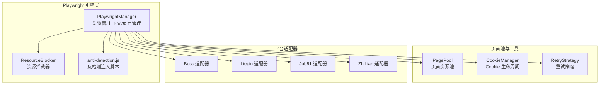

图表来源
- [PlaywrightManager.java:114-221](file://backend/src/main/java/com/getjobs/worker/manager/PlaywrightManager.java#L114-L221)
- [ResourceBlocker.java:77-102](file://backend/src/main/java/com/getjobs/worker/utils/ResourceBlocker.java#L77-L102)
- [anti-detection.js:1-109](file://backend/src/main/resources/anti-detection.js#L1-L109)
- [PagePool.java:25-100](file://backend/src/main/java/com/getjobs/worker/utils/PagePool.java#L25-L100)
- [CookieManager.java:31-100](file://backend/src/main/java/com/getjobs/worker/utils/CookieManager.java#L31-L100)
- [RetryStrategy.java:22-94](file://backend/src/main/java/com/getjobs/worker/utils/RetryStrategy.java#L22-L94)
- [Boss.java:45-125](file://backend/src/main/java/com/getjobs/worker/boss/Boss.java#L45-L125)
- [Liepin.java:38-130](file://backend/src/main/java/com/getjobs/worker/liepin/Liepin.java#L38-L130)
- [Job51.java:31-107](file://backend/src/main/java/com/getjobs/worker/job51/Job51.java#L31-L107)
- [ZhiLian.java:31-97](file://backend/src/main/java/com/getjobs/worker/zhilian/ZhiLian.java#L31-L97)

章节来源
- [PlaywrightManager.java:114-221](file://backend/src/main/java/com/getjobs/worker/manager/PlaywrightManager.java#L114-L221)
- [PagePool.java:25-100](file://backend/src/main/java/com/getjobs/worker/utils/PagePool.java#L25-L100)
- [CookieManager.java:31-100](file://backend/src/main/java/com/getjobs/worker/utils/CookieManager.java#L31-L100)
- [RetryStrategy.java:22-94](file://backend/src/main/java/com/getjobs/worker/utils/RetryStrategy.java#L22-L94)
- [Boss.java:45-125](file://backend/src/main/java/com/getjobs/worker/boss/Boss.java#L45-L125)
- [Liepin.java:38-130](file://backend/src/main/java/com/getjobs/worker/liepin/Liepin.java#L38-L130)
- [Job51.java:31-107](file://backend/src/main/java/com/getjobs/worker/job51/Job51.java#L31-L107)
- [ZhiLian.java:31-97](file://backend/src/main/java/com/getjobs/worker/zhilian/ZhiLian.java#L31-L97)

## 核心组件
- 浏览器与上下文管理：集中初始化 Playwright、启动浏览器、创建共享 BrowserContext，并在上下文层注入反检测脚本。
- 页面池化：统一注册与统计页面资源，支持获取/释放与空闲检测，为后续动态池化打基础。
- Cookie 生命周期：记录保存时间、预测过期、触发刷新，结合平台 Cookie 预期有效期策略。
- 资源拦截：按扩展名与域名拦截非关键资源，降低内存与带宽占用，同时保留登录二维码等关键资源。
- 反检测脚本：劫持 Function.prototype.toString 与 console 方法，降低被检测风险。
- 平台适配器：Boss、猎聘、51job、智联分别实现搜索、过滤、投递、状态更新与弹窗处理。

章节来源
- [PlaywrightManager.java:114-221](file://backend/src/main/java/com/getjobs/worker/manager/PlaywrightManager.java#L114-L221)
- [PagePool.java:25-100](file://backend/src/main/java/com/getjobs/worker/utils/PagePool.java#L25-L100)
- [CookieManager.java:31-100](file://backend/src/main/java/com/getjobs/worker/utils/CookieManager.java#L31-L100)
- [ResourceBlocker.java:77-102](file://backend/src/main/java/com/getjobs/worker/utils/ResourceBlocker.java#L77-L102)
- [anti-detection.js:1-109](file://backend/src/main/resources/anti-detection.js#L1-L109)

## 架构总览
引擎以 PlaywrightManager 为核心，负责全局初始化、平台页面生命周期与登录状态监控；通过 PagePool 统一管理页面资源；CookieManager 负责 Cookie 生命周期与刷新；ResourceBlocker 与 anti-detection.js 提升稳定性与反检测能力；四个平台适配器在共享上下文中并行执行。

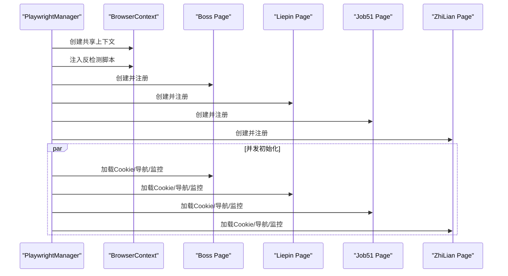

图表来源
- [PlaywrightManager.java:167-201](file://backend/src/main/java/com/getjobs/worker/manager/PlaywrightManager.java#L167-L201)
- [PlaywrightManager.java:254-331](file://backend/src/main/java/com/getjobs/worker/manager/PlaywrightManager.java#L254-L331)
- [PlaywrightManager.java:393-465](file://backend/src/main/java/com/getjobs/worker/manager/PlaywrightManager.java#L393-L465)
- [PlaywrightManager.java:584-686](file://backend/src/main/java/com/getjobs/worker/manager/PlaywrightManager.java#L584-L686)
- [PlaywrightManager.java:737-799](file://backend/src/main/java/com/getjobs/worker/manager/PlaywrightManager.java#L737-L799)

## 详细组件分析

### 浏览器与上下文管理（PlaywrightManager）
- 初始化流程：创建 Playwright 实例、启动浏览器（可视化调试）、创建共享 BrowserContext、注入反检测脚本、按平台创建页面并注册到 PagePool、并发初始化各平台。
- 登录状态监控：监听页面导航事件，按平台检查登录状态并触发回调；提供暂停标志避免并发访问同一页面。
- Cookie 加载：从数据库加载各平台 Cookie 并注入上下文，按域过滤后注入。
- 资源拦截：可选启用，按扩展名与域名拦截非关键资源，保留二维码等关键资源。
- 平台特化：
  - Boss：导航至首页，等待 NETWORKIDLE，检查用户头像/登录入口判定登录状态。
  - 猎聘：检测登录入口与二维码切换，必要时自动跳转登录页并切换二维码。
  - 51job：检测登录入口，自动点击并后台轮询登录状态，登录成功后保存 Cookie。
  - 智联：按页采集岗位并入库，处理投递弹窗与相似职位推荐。

章节来源
- [PlaywrightManager.java:114-221](file://backend/src/main/java/com/getjobs/worker/manager/PlaywrightManager.java#L114-L221)
- [PlaywrightManager.java:254-331](file://backend/src/main/java/com/getjobs/worker/manager/PlaywrightManager.java#L254-L331)
- [PlaywrightManager.java:393-465](file://backend/src/main/java/com/getjobs/worker/manager/PlaywrightManager.java#L393-L465)
- [PlaywrightManager.java:584-686](file://backend/src/main/java/com/getjobs/worker/manager/PlaywrightManager.java#L584-L686)
- [PlaywrightManager.java:737-800](file://backend/src/main/java/com/getjobs/worker/manager/PlaywrightManager.java#L737-L800)

### 页面池化策略（PagePool）
- 职责：为每个平台页面记录 lastUsedAt、访问次数与生命周期，提供统计与空闲检测。
- 能力：注册/获取/释放页面，统计活跃数与空闲平台，预留清理空闲页面的扩展点。
- 适用：在共享上下文中统一管理四平台页面，便于资源观测与未来回收策略。

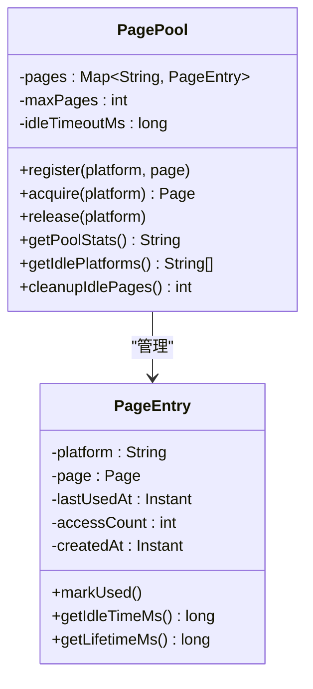

图表来源
- [PagePool.java:25-100](file://backend/src/main/java/com/getjobs/worker/utils/PagePool.java#L25-L100)
- [PagePool.java:233-277](file://backend/src/main/java/com/getjobs/worker/utils/PagePool.java#L233-L277)

章节来源
- [PagePool.java:25-100](file://backend/src/main/java/com/getjobs/worker/utils/PagePool.java#L25-L100)
- [PagePool.java:116-168](file://backend/src/main/java/com/getjobs/worker/utils/PagePool.java#L116-L168)

### Cookie 生命周期与会话维持（CookieManager）
- 预设有效期：Boss 7天、猎聘 30天、51job 15天、智联 14天。
- 核心能力：记录保存时间、计算剩余时间、判断即将过期/已过期、触发刷新、状态摘要。
- 与 PlaywrightManager 协作：初始化时从数据库加载 Cookie 记录，登录成功后保存 Cookie。

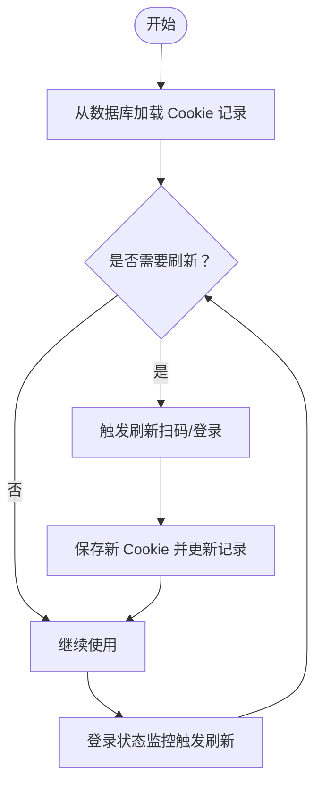

图表来源
- [CookieManager.java:204-214](file://backend/src/main/java/com/getjobs/worker/utils/CookieManager.java#L204-L214)
- [CookieManager.java:122-129](file://backend/src/main/java/com/getjobs/worker/utils/CookieManager.java#L122-L129)
- [PlaywrightManager.java:759-767](file://backend/src/main/java/com/getjobs/worker/manager/PlaywrightManager.java#L759-L767)

章节来源
- [CookieManager.java:31-100](file://backend/src/main/java/com/getjobs/worker/utils/CookieManager.java#L31-L100)
- [CookieManager.java:122-168](file://backend/src/main/java/com/getjobs/worker/utils/CookieManager.java#L122-L168)
- [CookieManager.java:175-197](file://backend/src/main/java/com/getjobs/worker/utils/CookieManager.java#L175-L197)
- [PlaywrightManager.java:759-767](file://backend/src/main/java/com/getjobs/worker/manager/PlaywrightManager.java#L759-L767)

### 反检测与资源优化（anti-detection.js 与 ResourceBlocker）
- 反检测脚本：劫持 Function.prototype.toString 与 console 方法，隐藏自动化痕迹。
- 资源拦截：按扩展名与域名拦截图片、字体、视频、音频与第三方统计/广告域名，保留二维码与关键验证码资源。

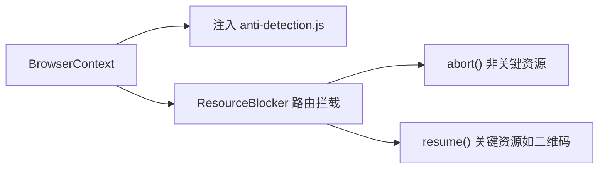

图表来源
- [PlaywrightManager.java:226-237](file://backend/src/main/java/com/getjobs/worker/manager/PlaywrightManager.java#L226-L237)
- [ResourceBlocker.java:77-102](file://backend/src/main/java/com/getjobs/worker/utils/ResourceBlocker.java#L77-L102)
- [ResourceBlocker.java:110-122](file://backend/src/main/java/com/getjobs/worker/utils/ResourceBlocker.java#L110-L122)

章节来源
- [anti-detection.js:1-109](file://backend/src/main/resources/anti-detection.js#L1-L109)
- [ResourceBlocker.java:25-71](file://backend/src/main/java/com/getjobs/worker/utils/ResourceBlocker.java#L25-L71)
- [ResourceBlocker.java:167-174](file://backend/src/main/java/com/getjobs/worker/utils/ResourceBlocker.java#L167-L174)

### 重试策略（RetryStrategy）
- 指数退避 + 随机抖动，支持默认与自定义参数，提供固定延迟重试变体。
- 应用场景：导航重试、Cookie 加载重试、元素点击重试。

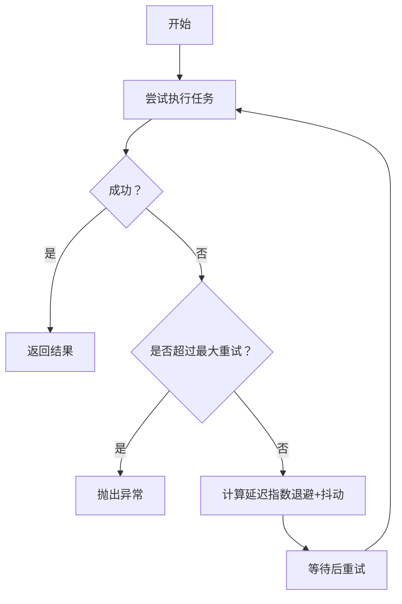

图表来源
- [RetryStrategy.java:49-94](file://backend/src/main/java/com/getjobs/worker/utils/RetryStrategy.java#L49-L94)
- [RetryStrategy.java:120-125](file://backend/src/main/java/com/getjobs/worker/utils/RetryStrategy.java#L120-L125)

章节来源
- [RetryStrategy.java:22-94](file://backend/src/main/java/com/getjobs/worker/utils/RetryStrategy.java#L22-L94)
- [RetryStrategy.java:138-167](file://backend/src/main/java/com/getjobs/worker/utils/RetryStrategy.java#L138-L167)

### 平台适配器设计与差异

#### Boss 直聘（Boss）
- 搜索构建：根据配置拼接城市、经验、学历、规模、行业、阶段等参数。
- 列表加载：滚动触底 + footer 到达，等待首屏渲染；点击卡片监听详情接口响应。
- 过滤策略：黑名单、HR 活跃状态过滤、公共黑名单。
- 投递流程：在新标签页打开详情，查找“立即沟通”，输入问候语并发送，关闭窗口，更新投递状态。

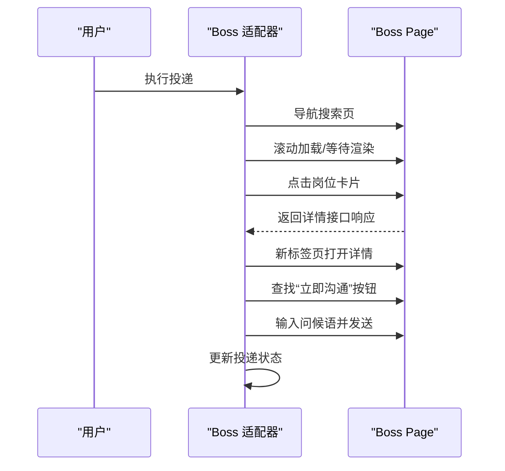

图表来源
- [Boss.java:228-434](file://backend/src/main/java/com/getjobs/worker/boss/Boss.java#L228-L434)
- [Boss.java:613-777](file://backend/src/main/java/com/getjobs/worker/boss/Boss.java#L613-L777)

章节来源
- [Boss.java:65-83](file://backend/src/main/java/com/getjobs/worker/boss/Boss.java#L65-L83)
- [Boss.java:228-434](file://backend/src/main/java/com/getjobs/worker/boss/Boss.java#L228-L434)
- [Boss.java:613-777](file://backend/src/main/java/com/getjobs/worker/boss/Boss.java#L613-L777)

#### 猎聘（Liepin）
- 接口拦截：监听 PC 搜索接口，解析 JSON 并批量入库，缓存卡片信息用于展示。
- 投递流程：滚动到卡片、悬停触发按钮显示、查找“聊一聊”按钮、点击后关闭聊天窗口，标记已投递。
- 特殊处理：多选择器适配不同版本页面，鼠标微调提升点击成功率。

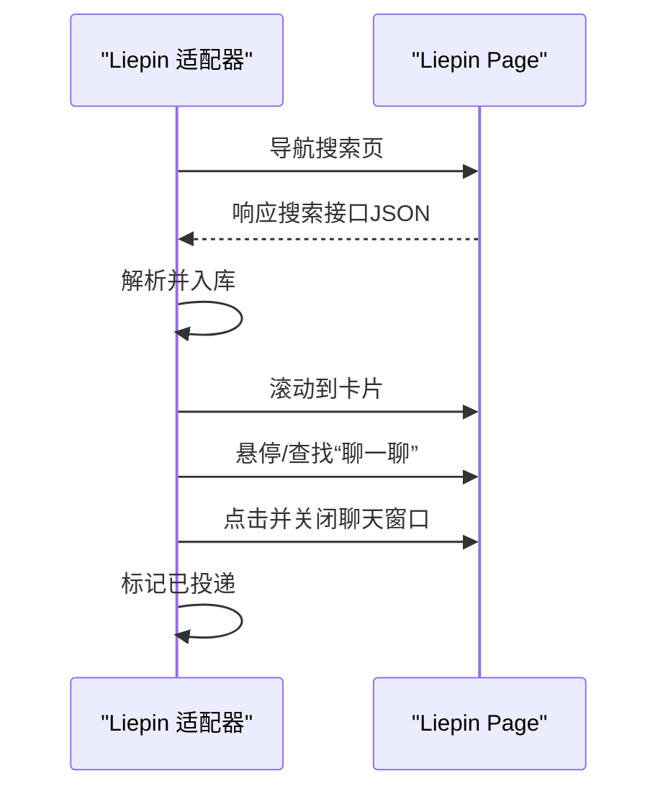

图表来源
- [Liepin.java:105-130](file://backend/src/main/java/com/getjobs/worker/liepin/Liepin.java#L105-L130)
- [Liepin.java:230-296](file://backend/src/main/java/com/getjobs/worker/liepin/Liepin.java#L230-L296)
- [Liepin.java:327-598](file://backend/src/main/java/com/getjobs/worker/liepin/Liepin.java#L327-L598)

章节来源
- [Liepin.java:64-103](file://backend/src/main/java/com/getjobs/worker/liepin/Liepin.java#L64-L103)
- [Liepin.java:133-188](file://backend/src/main/java/com/getjobs/worker/liepin/Liepin.java#L133-L188)
- [Liepin.java:327-598](file://backend/src/main/java/com/getjobs/worker/liepin/Liepin.java#L327-L598)

#### 51job（Job51）
- 网络拦截：监听搜索接口，解析 JSON 并提取 jobId，缓存当前页 jobId 列表。
- 投递流程：勾选职位、批量投递、处理成功/单独申请弹窗、关闭覆盖层、标记已投递。
- 限流与风控：检测“日投递上限”提示与访问验证，及时停止。

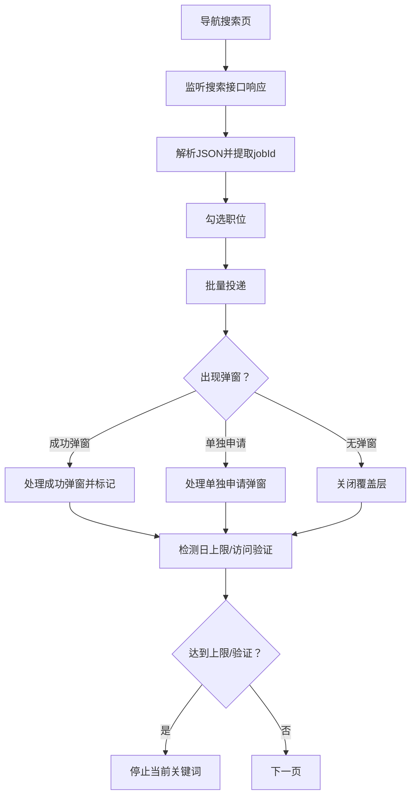

图表来源
- [Job51.java:112-248](file://backend/src/main/java/com/getjobs/worker/job51/Job51.java#L112-L248)
- [Job51.java:253-322](file://backend/src/main/java/com/getjobs/worker/job51/Job51.java#L253-L322)
- [Job51.java:367-490](file://backend/src/main/java/com/getjobs/worker/job51/Job51.java#L367-L490)
- [Job51.java:637-668](file://backend/src/main/java/com/getjobs/worker/job51/Job51.java#L637-L668)

章节来源
- [Job51.java:112-248](file://backend/src/main/java/com/getjobs/worker/job51/Job51.java#L112-L248)
- [Job51.java:253-322](file://backend/src/main/java/com/getjobs/worker/job51/Job51.java#L253-L322)
- [Job51.java:367-490](file://backend/src/main/java/com/getjobs/worker/job51/Job51.java#L367-L490)
- [Job51.java:637-668](file://backend/src/main/java/com/getjobs/worker/job51/Job51.java#L637-L668)

#### 智联招聘（ZhiLian）
- 搜索与翻页：构建基础 URL，输入关键词并 Enter 搜索，等待列表加载，判断“下一页”禁用状态翻页。
- 投递流程：采集岗位并入库，点击“立即投递”按钮，注册监听器关闭新窗口，标记投递状态。
- 限流处理：检测“达到上限”提示，停止投递。

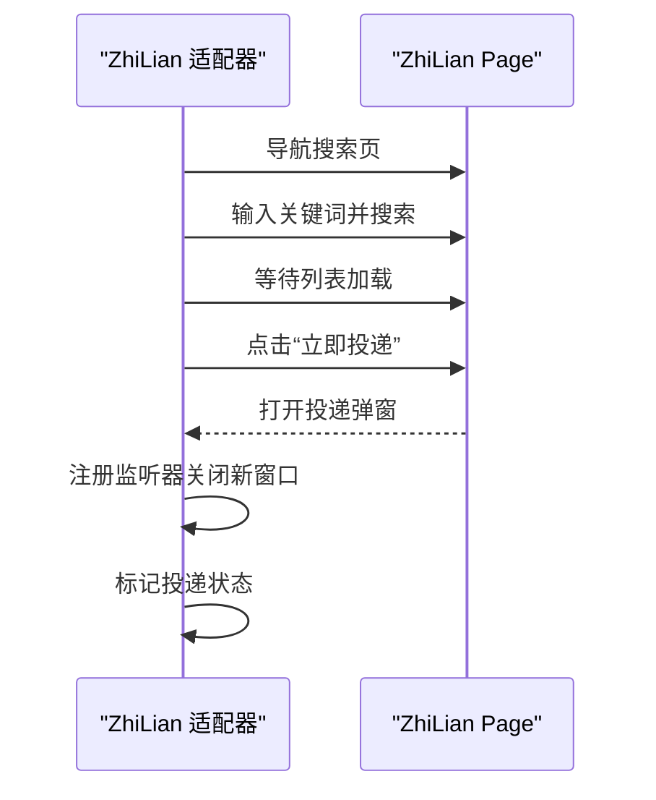

图表来源
- [ZhiLian.java:102-191](file://backend/src/main/java/com/getjobs/worker/zhilian/ZhiLian.java#L102-L191)
- [ZhiLian.java:197-351](file://backend/src/main/java/com/getjobs/worker/zhilian/ZhiLian.java#L197-L351)
- [ZhiLian.java:474-489](file://backend/src/main/java/com/getjobs/worker/zhilian/ZhiLian.java#L474-L489)

章节来源
- [ZhiLian.java:102-191](file://backend/src/main/java/com/getjobs/worker/zhilian/ZhiLian.java#L102-L191)
- [ZhiLian.java:197-351](file://backend/src/main/java/com/getjobs/worker/zhilian/ZhiLian.java#L197-L351)
- [ZhiLian.java:474-489](file://backend/src/main/java/com/getjobs/worker/zhilian/ZhiLian.java#L474-L489)

## 依赖关系分析
- PlaywrightManager 依赖 CookieService、CookieManager、PagePool、ResourceBlocker、反检测脚本资源。
- 平台适配器依赖对应 Service 与工具类，Boss/Liepin/Job51/ZhiLian 分别封装平台特有交互。
- PagePool 与 CookieManager 为通用工具，被 PlaywrightManager 与各适配器间接使用。

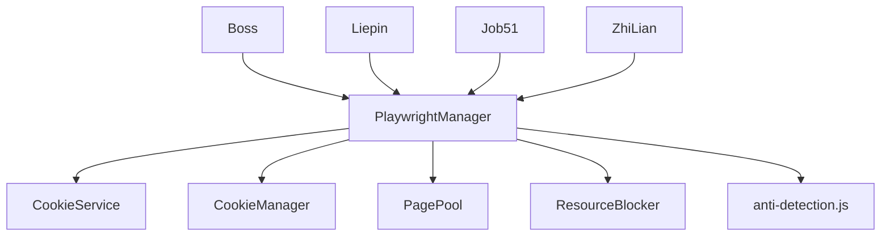

图表来源
- [PlaywrightManager.java:90-110](file://backend/src/main/java/com/getjobs/worker/manager/PlaywrightManager.java#L90-L110)
- [PagePool.java:25-50](file://backend/src/main/java/com/getjobs/worker/utils/PagePool.java#L25-L50)
- [CookieManager.java:31-50](file://backend/src/main/java/com/getjobs/worker/utils/CookieManager.java#L31-L50)
- [ResourceBlocker.java:77-102](file://backend/src/main/java/com/getjobs/worker/utils/ResourceBlocker.java#L77-L102)
- [Boss.java:47-56](file://backend/src/main/java/com/getjobs/worker/boss/Boss.java#L47-L56)
- [Liepin.java:54-62](file://backend/src/main/java/com/getjobs/worker/liepin/Liepin.java#L54-L62)
- [Job51.java:36-51](file://backend/src/main/java/com/getjobs/worker/job51/Job51.java#L36-L51)
- [ZhiLian.java:35-44](file://backend/src/main/java/com/getjobs/worker/zhilian/ZhiLian.java#L35-L44)

章节来源
- [PlaywrightManager.java:90-110](file://backend/src/main/java/com/getjobs/worker/manager/PlaywrightManager.java#L90-L110)
- [Boss.java:47-56](file://backend/src/main/java/com/getjobs/worker/boss/Boss.java#L47-L56)
- [Liepin.java:54-62](file://backend/src/main/java/com/getjobs/worker/liepin/Liepin.java#L54-L62)
- [Job51.java:36-51](file://backend/src/main/java/com/getjobs/worker/job51/Job51.java#L36-L51)
- [ZhiLian.java:35-44](file://backend/src/main/java/com/getjobs/worker/zhilian/ZhiLian.java#L35-L44)

## 性能考量
- 资源拦截：按扩展名与域名拦截非关键资源，降低内存与带宽占用，保留二维码等关键资源。
- 反检测脚本：隐藏自动化特征，减少被封禁风险，提升稳定性。
- 页面池化：统一统计与观测，为未来动态池化与回收提供基础。
- 并发初始化：平台页面并发创建与初始化，缩短整体启动时间。
- 重试策略：指数退避与抖动，避免瞬时拥塞，提升成功率。

章节来源
- [ResourceBlocker.java:77-102](file://backend/src/main/java/com/getjobs/worker/utils/ResourceBlocker.java#L77-L102)
- [anti-detection.js:1-109](file://backend/src/main/resources/anti-detection.js#L1-L109)
- [PagePool.java:116-134](file://backend/src/main/java/com/getjobs/worker/utils/PagePool.java#L116-L134)
- [PlaywrightManager.java:192-200](file://backend/src/main/java/com/getjobs/worker/manager/PlaywrightManager.java#L192-L200)
- [RetryStrategy.java:120-125](file://backend/src/main/java/com/getjobs/worker/utils/RetryStrategy.java#L120-L125)

## 故障排除指南
- 初始化失败
  - 检查 Chromium 路径与安装状态，确保 npx playwright install chromium。
  - 查看浏览器启动参数与调试端口配置。
- 页面导航异常
  - 使用 RetryStrategy 执行导航重试；检查 WaitUntilState 与超时设置。
  - 并发导航时注意“Object doesn't exist”异常，通过 URL 可达性兜底判断。
- 登录状态检测
  - Boss：检查用户头像/昵称与登录入口可见性。
  - 猎聘：检测登录入口与二维码切换；若未登录，自动跳转登录页并切换二维码。
  - 51job：检测登录入口与“日投递上限/访问验证”提示，及时停止。
  - 智联：检测“达到上限”提示，停止投递。
- 资源拦截问题
  - 确认 resource-blocking-enabled 配置；检查白名单模式是否覆盖二维码等关键资源。
- 反检测失效
  - 确认反检测脚本已注入；检查上下文初始化顺序与脚本加载。

章节来源
- [PlaywrightManager.java:128-136](file://backend/src/main/java/com/getjobs/worker/manager/PlaywrightManager.java#L128-L136)
- [PlaywrightManager.java:277-308](file://backend/src/main/java/com/getjobs/worker/manager/PlaywrightManager.java#L277-L308)
- [PlaywrightManager.java:417-448](file://backend/src/main/java/com/getjobs/worker/manager/PlaywrightManager.java#L417-L448)
- [PlaywrightManager.java:608-639](file://backend/src/main/java/com/getjobs/worker/manager/PlaywrightManager.java#L608-L639)
- [PlaywrightManager.java:737-799](file://backend/src/main/java/com/getjobs/worker/manager/PlaywrightManager.java#L737-L799)
- [ResourceBlocker.java:110-122](file://backend/src/main/java/com/getjobs/worker/utils/ResourceBlocker.java#L110-L122)
- [anti-detection.js:1-109](file://backend/src/main/resources/anti-detection.js#L1-L109)

## 结论
本引擎通过统一的浏览器与上下文管理、页面池化与资源优化、Cookie 生命周期与反检测策略，实现了对 Boss、猎聘、51job、智联招聘四大平台的稳定自动化适配。平台适配器针对各自 UI 与交互差异进行了精细化处理，配合重试与并发控制，显著提升了投递成功率与系统稳定性。建议在生产环境中启用资源拦截与反检测脚本，并结合 Cookie 生命周期策略与登录状态监控，持续优化性能与可靠性。

## 附录
- 调试建议
  - 启用慢动作模式与调试端口，观察页面行为与网络请求。
  - 使用 PagePool 统计与 ResourceBlocker 配置摘要辅助定位问题。
  - 保存页面 HTML 用于离线分析（智联适配器提供保存功能）。
- 监控指标
  - 页面活跃数、空闲时间、生命周期、Cookie 剩余时间、登录状态变化速率。
- 最佳实践
  - 合理设置导航与元素等待超时，避免硬编码固定等待。
  - 使用指数退避重试与幂等操作，降低失败重试成本。
  - 严格区分白名单与拦截规则，确保关键资源可用。