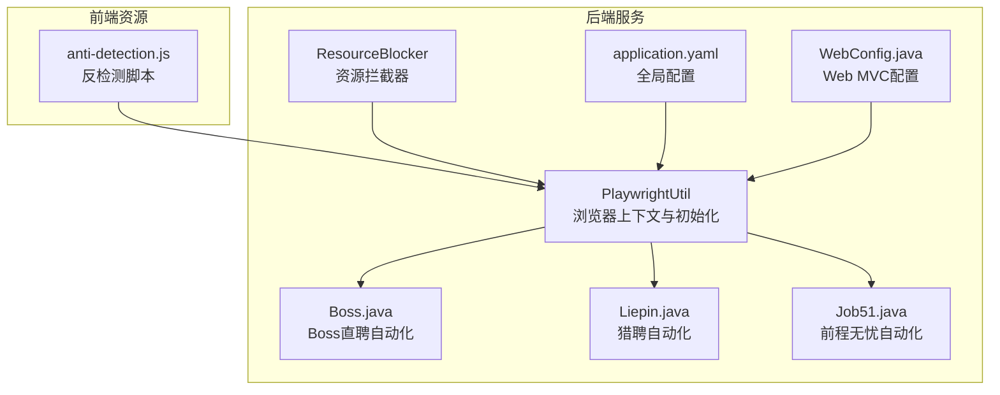
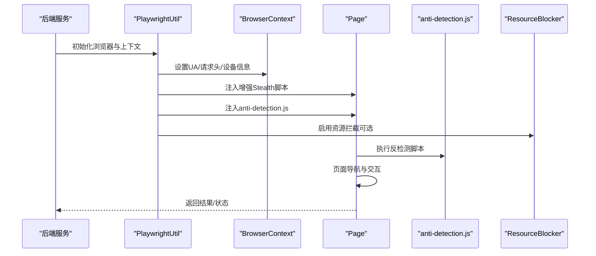
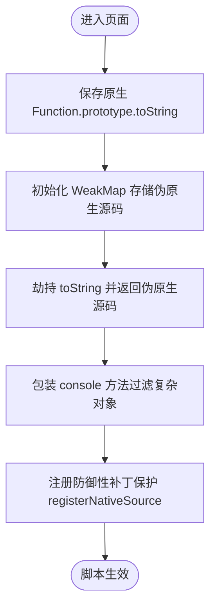
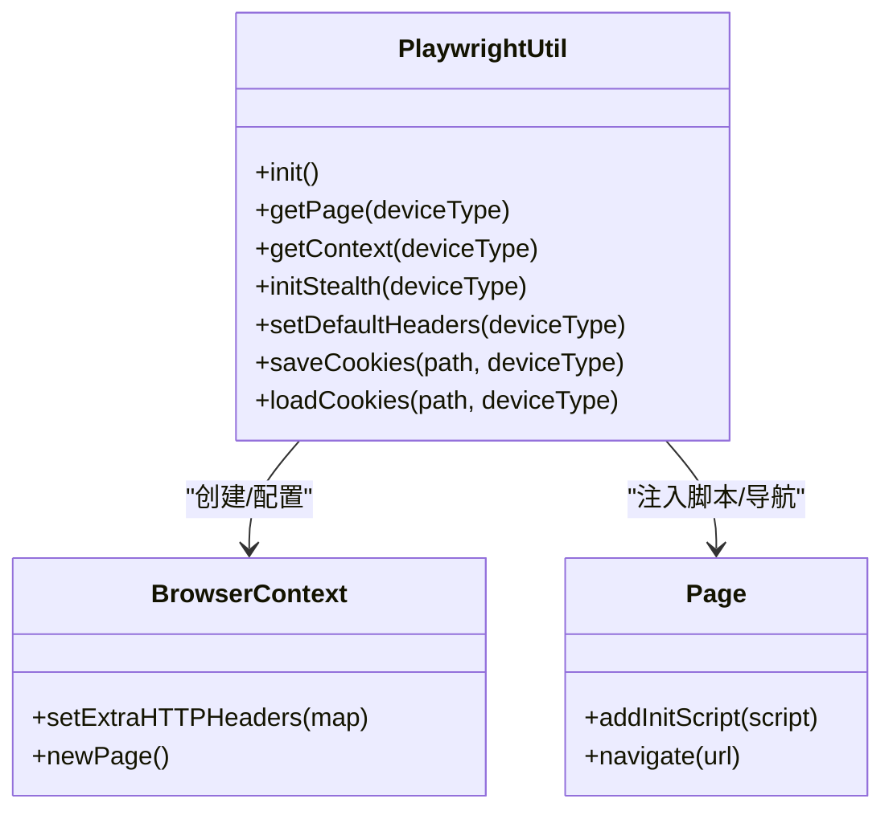
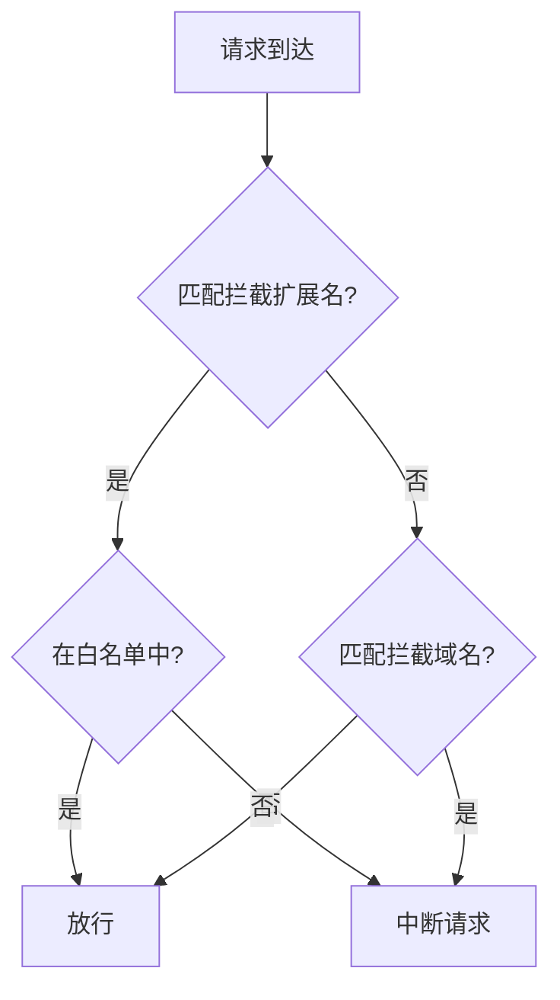
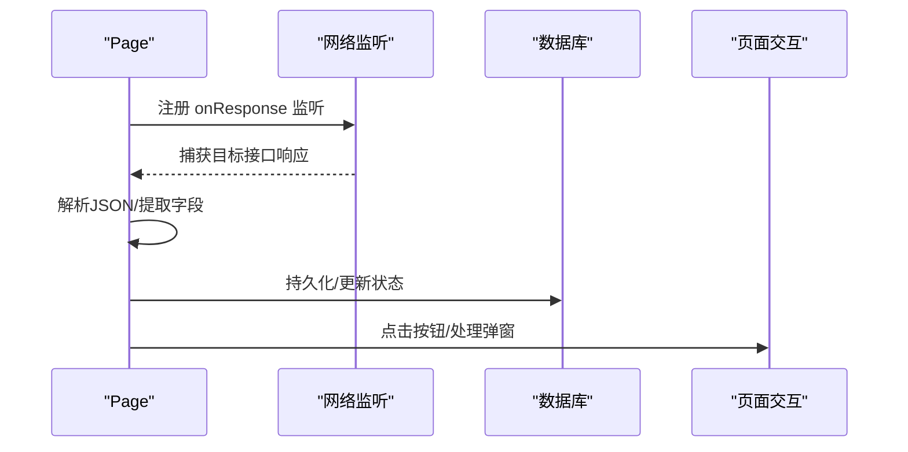
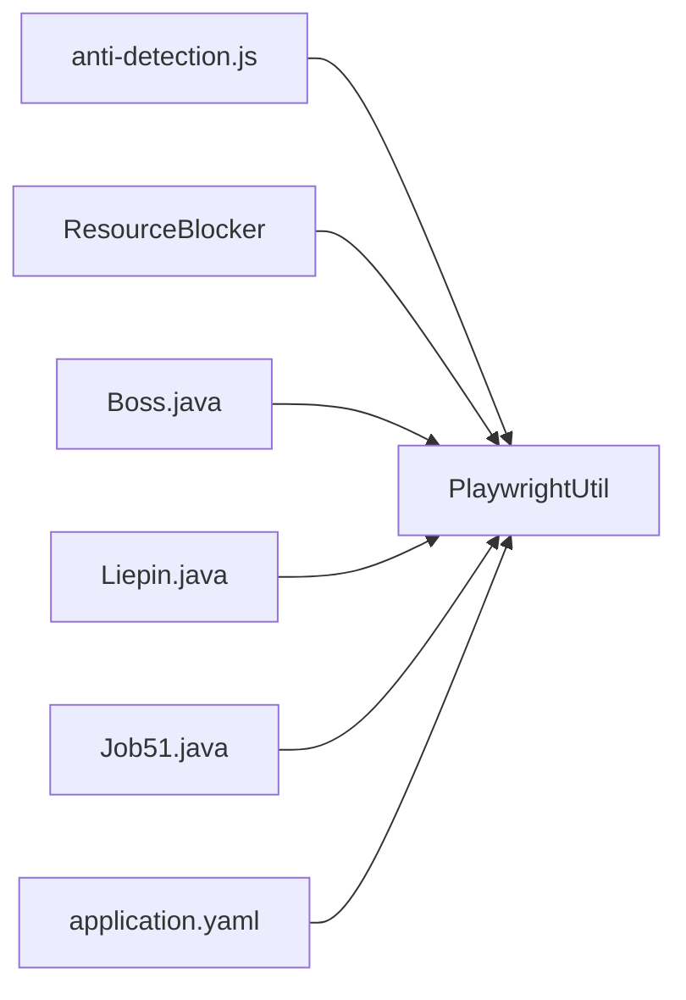

# 反检测机制

<cite>
**本文引用的文件**
- [anti-detection.js](file://backend/src/main/resources/anti-detection.js)
- [PlaywrightUtil.java](file://backend/src/main/java/com/getjobs/worker/utils/PlaywrightUtil.java)
- [ResourceBlocker.java](file://backend/src/main/java/com/getjobs/worker/utils/ResourceBlocker.java)
- [application.yaml](file://backend/src/main/resources/application.yaml)
- [Boss.java](file://backend/src/main/java/com/getjobs/worker/boss/Boss.java)
- [Liepin.java](file://backend/src/main/java/com/getjobs/worker/liepin/Liepin.java)
- [Job51.java](file://backend/src/main/java/com/getjobs/worker/job51/Job51.java)
- [WebConfig.java](file://backend/src/main/java/com/getjobs/application/config/WebConfig.java)
</cite>

## 目录
1. [简介](#简介)
2. [项目结构](#项目结构)
3. [核心组件](#核心组件)
4. [架构总览](#架构总览)
5. [详细组件分析](#详细组件分析)
6. [依赖关系分析](#依赖关系分析)
7. [性能考量](#性能考量)
8. [故障排查指南](#故障排查指南)
9. [结论](#结论)
10. [附录](#附录)

## 简介
本文件系统性梳理并解读本项目的反检测机制，围绕以下目标展开：
- 深入解析 anti-detection.js 的设计原理与实现细节，涵盖浏览器指纹伪装、行为模拟与特征隐藏策略；
- 详述资源拦截器的实现机制，包括静态资源过滤、网络请求拦截与响应修改策略；
- 分析反检测技术在不同招聘平台（Boss直聘、猎聘、前程无忧）的检测机制与对应防护策略；
- 提供反检测配置参数调优、效果监控与性能影响分析；
- 给出面向自动化测试工程师与安全研究人员的使用指南、注意事项与最佳实践。

## 项目结构
本项目采用后端 Java + Playwright 自动化的架构，反检测能力主要由前端注入脚本与后端 Playwright 上下文配置共同实现。关键位置如下：
- 反检测脚本：位于后端资源目录，随页面初始化注入；
- 浏览器上下文配置：在 PlaywrightUtil 中统一设置请求头、UA、设备信息与初始化脚本；
- 资源拦截器：在 ResourceBlocker 中集中管理静态资源与第三方域名拦截；
- 平台适配：Boss、Liepin、Job51 三大 Worker 类分别针对平台差异实现页面交互与反检测策略。

图表来源
- [PlaywrightUtil.java:425-480](file://backend/src/main/java/com/getjobs/worker/utils/PlaywrightUtil.java#L425-L480)
- [ResourceBlocker.java:77-102](file://backend/src/main/java/com/getjobs/worker/utils/ResourceBlocker.java#L77-L102)
- [application.yaml:70-101](file://backend/src/main/resources/application.yaml#L70-L101)
- [Boss.java:112-125](file://backend/src/main/java/com/getjobs/worker/boss/Boss.java#L112-L125)
- [Liepin.java:105-130](file://backend/src/main/java/com/getjobs/worker/liepin/Liepin.java#L105-L130)
- [Job51.java:68-107](file://backend/src/main/java/com/getjobs/worker/job51/Job51.java#L68-L107)
- [WebConfig.java:14-36](file://backend/src/main/java/com/getjobs/application/config/WebConfig.java#L14-L36)

章节来源
- [PlaywrightUtil.java:425-480](file://backend/src/main/java/com/getjobs/worker/utils/PlaywrightUtil.java#L425-L480)
- [ResourceBlocker.java:77-102](file://backend/src/main/java/com/getjobs/worker/utils/ResourceBlocker.java#L77-L102)
- [application.yaml:70-101](file://backend/src/main/resources/application.yaml#L70-L101)
- [Boss.java:112-125](file://backend/src/main/java/com/getjobs/worker/boss/Boss.java#L112-L125)
- [Liepin.java:105-130](file://backend/src/main/java/com/getjobs/worker/liepin/Liepin.java#L105-L130)
- [Job51.java:68-107](file://backend/src/main/java/com/getjobs/worker/job51/Job51.java#L68-L107)
- [WebConfig.java:14-36](file://backend/src/main/java/com/getjobs/application/config/WebConfig.java#L14-L36)

## 核心组件
- 反检测脚本（anti-detection.js）
  - 劫持 Function.prototype.toString，通过 WeakMap 保存“伪原生源码”，使 toString 返回值与真实原生一致，规避检测；
  - 提供 stealthify 包装器，对 console 方法进行“安全”包装，避免 DevTools 展开复杂对象；
  - 注册防御性补丁，防止被二次篡改；
  - 作用范围：页面初始化时注入，对所有脚本运行环境生效。
- PlaywrightUtil（浏览器上下文与初始化）
  - 设置 sec-ch-ua、UA、语言、Referer 等请求头，模拟真实设备类型（桌面/移动端）；
  - 注入增强 Stealth 脚本，清理 navigator.webdriver、删除 cdc_* 标识，伪装 languages/plugins；
  - 支持加载外部 stealth.min.js 作为补充（若存在）。
- ResourceBlocker（资源拦截器）
  - 按扩展名与域名拦截图片、字体、音视频、广告与第三方统计；
  - 白名单机制保留二维码、验证码等关键资源；
  - 可动态启用/禁用，避免影响登录与关键交互。
- 平台适配（Boss/Liepin/Job51）
  - 针对平台 UI 与接口差异实现页面交互；
  - 在页面生命周期中注册网络监听，拦截关键接口以提升稳定性与可控性。

章节来源
- [anti-detection.js:1-109](file://backend/src/main/resources/anti-detection.js#L1-L109)
- [PlaywrightUtil.java:425-480](file://backend/src/main/java/com/getjobs/worker/utils/PlaywrightUtil.java#L425-L480)
- [ResourceBlocker.java:25-102](file://backend/src/main/java/com/getjobs/worker/utils/ResourceBlocker.java#L25-L102)
- [Boss.java:782-800](file://backend/src/main/java/com/getjobs/worker/boss/Boss.java#L782-L800)
- [Liepin.java:68-102](file://backend/src/main/java/com/getjobs/worker/liepin/Liepin.java#L68-L102)
- [Job51.java:117-179](file://backend/src/main/java/com/getjobs/worker/job51/Job51.java#L117-L179)

## 架构总览
反检测体系由“脚本层 + 上下文层 + 拦截层 + 平台层”构成，整体流程如下：

图表来源
- [PlaywrightUtil.java:425-480](file://backend/src/main/java/com/getjobs/worker/utils/PlaywrightUtil.java#L425-L480)
- [ResourceBlocker.java:77-102](file://backend/src/main/java/com/getjobs/worker/utils/ResourceBlocker.java#L77-L102)
- [anti-detection.js:1-109](file://backend/src/main/resources/anti-detection.js#L1-L109)

## 详细组件分析

### 反检测脚本（anti-detection.js）
- 设计要点
  - 保存原生 Function.prototype.toString，避免被完全替换；
  - 使用 WeakMap 记录“伪原生源码”，在 toString 被劫持时返回原生表现；
  - stealthify 包装器对函数进行“外观伪装”，保留 name、prototype 等元信息；
  - 对 console 方法进行参数过滤，避免复杂对象被 DevTools 展开；
  - 注册防御性补丁，防止 registerNativeSource 本身被篡改。
- 实现细节
  - 劫持 toString 的策略确保检测脚本无法通过 Function.prototype.toString 的行为差异识别自动化；
  - 对 console 的包装减少日志泄露风险，同时不影响业务日志输出；
  - 防御性补丁提升脚本的抗篡改能力，降低二次注入风险。
- 适用场景
  - 通用浏览器指纹伪装与特征隐藏；
  - 避免 DevTools/CDP 检测到异常对象展开；
  - 作为 Playwright 初始化脚本的一部分，贯穿页面生命周期。

图表来源
- [anti-detection.js:6-42](file://backend/src/main/resources/anti-detection.js#L6-L42)
- [anti-detection.js:47-77](file://backend/src/main/resources/anti-detection.js#L47-L77)
- [anti-detection.js:82-98](file://backend/src/main/resources/anti-detection.js#L82-L98)
- [anti-detection.js:105-109](file://backend/src/main/resources/anti-detection.js#L105-L109)

章节来源
- [anti-detection.js:1-109](file://backend/src/main/resources/anti-detection.js#L1-L109)

### PlaywrightUtil（浏览器上下文与初始化）
- 设计要点
  - 统一设置 sec-ch-ua、UA、语言、Referer 等请求头，模拟桌面/移动端真实环境；
  - 注入增强 Stealth 脚本，清理 navigator.webdriver、删除 cdc_* 标识，伪装 languages/plugins；
  - 支持加载外部 stealth.min.js 作为补充（若存在），增强兼容性；
  - 提供 initStealth 与 setDefaultHeaders 等便捷方法。
- 实现细节
  - 桌面/移动端上下文分离，分别设置 viewport、UA、scale、touch 等参数；
  - 通过 page.addInitScript 注入脚本，确保在页面加载早期生效；
  - 日志与错误处理完善，便于定位问题。
- 适用场景
  - 统一的浏览器指纹伪装与请求头模拟；
  - 与反检测脚本协同，提升检测难度；
  - 为三大平台提供一致的自动化基础。

图表来源
- [PlaywrightUtil.java:44-118](file://backend/src/main/java/com/getjobs/worker/utils/PlaywrightUtil.java#L44-L118)
- [PlaywrightUtil.java:425-480](file://backend/src/main/java/com/getjobs/worker/utils/PlaywrightUtil.java#L425-L480)
- [PlaywrightUtil.java:494-510](file://backend/src/main/java/com/getjobs/worker/utils/PlaywrightUtil.java#L494-L510)

章节来源
- [PlaywrightUtil.java:44-118](file://backend/src/main/java/com/getjobs/worker/utils/PlaywrightUtil.java#L44-L118)
- [PlaywrightUtil.java:425-480](file://backend/src/main/java/com/getjobs/worker/utils/PlaywrightUtil.java#L425-L480)
- [PlaywrightUtil.java:494-510](file://backend/src/main/java/com/getjobs/worker/utils/PlaywrightUtil.java#L494-L510)

### ResourceBlocker（资源拦截器）
- 设计要点
  - 按扩展名拦截图片、字体、音视频等非必要资源，降低带宽与 DOM 解析开销；
  - 按域名拦截广告网络、统计追踪与社交分享等第三方域；
  - 白名单保留二维码、验证码等关键资源；
  - 支持动态启用/禁用，避免影响登录与关键交互。
- 实现细节
  - 使用 context.route 拦截匹配模式，结合 isWhitelisted 判断；
  - 扩展名与域名列表集中管理，便于维护与扩展；
  - 日志记录拦截动作，便于问题排查。
- 适用场景
  - 降低页面渲染与网络负载；
  - 减少第三方跟踪与广告干扰；
  - 提升自动化稳定性与速度。

图表来源
- [ResourceBlocker.java:28-37](file://backend/src/main/java/com/getjobs/worker/utils/ResourceBlocker.java#L28-L37)
- [ResourceBlocker.java:42-56](file://backend/src/main/java/com/getjobs/worker/utils/ResourceBlocker.java#L42-L56)
- [ResourceBlocker.java:85-99](file://backend/src/main/java/com/getjobs/worker/utils/ResourceBlocker.java#L85-L99)
- [ResourceBlocker.java:110-122](file://backend/src/main/java/com/getjobs/worker/utils/ResourceBlocker.java#L110-L122)

章节来源
- [ResourceBlocker.java:25-102](file://backend/src/main/java/com/getjobs/worker/utils/ResourceBlocker.java#L25-L102)
- [ResourceBlocker.java:129-135](file://backend/src/main/java/com/getjobs/worker/utils/ResourceBlocker.java#L129-L135)

### 平台适配（Boss/Liepin/Job51）
- Boss直聘
  - 注册页面响应监听，拦截 /wapi/zpgeek/job/detail.json 请求并解析写库；
  - 通过 waitForResponse 等机制确保接口数据可用后再进行下一步操作；
  - 针对“立即沟通”按钮进行点击与聊天输入处理。
- 猎聘
  - 注册 onRequest/onResponse 监听，拦截 PC 搜索接口，解析 JSON 并持久化；
  - 通过 hover/click 等操作触发聊一聊按钮，处理聊天窗口关闭；
  - 提取 jobId 用于投递状态更新。
- 前程无忧
  - 监听 /api/job/search-pc 接口，解析 JSON 并提取 jobId 列表；
  - 处理批量投递弹窗与“日投递上限”提示，避免触发风控；
  - 统一关闭各类弹框覆盖层，确保交互稳定。

图表来源
- [Boss.java:782-800](file://backend/src/main/java/com/getjobs/worker/boss/Boss.java#L782-L800)
- [Liepin.java:68-102](file://backend/src/main/java/com/getjobs/worker/liepin/Liepin.java#L68-L102)
- [Job51.java:117-179](file://backend/src/main/java/com/getjobs/worker/job51/Job51.java#L117-L179)

章节来源
- [Boss.java:782-800](file://backend/src/main/java/com/getjobs/worker/boss/Boss.java#L782-L800)
- [Liepin.java:68-102](file://backend/src/main/java/com/getjobs/worker/liepin/Liepin.java#L68-L102)
- [Job51.java:117-179](file://backend/src/main/java/com/getjobs/worker/job51/Job51.java#L117-L179)

## 依赖关系分析
- 组件耦合
  - PlaywrightUtil 与 ResourceBlocker 通过 BrowserContext 协作，前者负责上下文配置，后者负责资源拦截；
  - 反检测脚本与 PlaywrightUtil 紧密关联，前者在后者注入后生效；
  - 平台类（Boss/Liepin/Job51）依赖 PlaywrightUtil 的上下文与初始化能力。
- 外部依赖
  - Playwright 库提供浏览器自动化能力；
  - YAML 配置文件提供全局参数（如资源拦截开关、超时等）。

图表来源
- [PlaywrightUtil.java:425-480](file://backend/src/main/java/com/getjobs/worker/utils/PlaywrightUtil.java#L425-L480)
- [ResourceBlocker.java:77-102](file://backend/src/main/java/com/getjobs/worker/utils/ResourceBlocker.java#L77-L102)
- [application.yaml:70-101](file://backend/src/main/resources/application.yaml#L70-L101)
- [Boss.java:112-125](file://backend/src/main/java/com/getjobs/worker/boss/Boss.java#L112-L125)
- [Liepin.java:105-130](file://backend/src/main/java/com/getjobs/worker/liepin/Liepin.java#L105-L130)
- [Job51.java:68-107](file://backend/src/main/java/com/getjobs/worker/job51/Job51.java#L68-L107)

章节来源
- [PlaywrightUtil.java:425-480](file://backend/src/main/java/com/getjobs/worker/utils/PlaywrightUtil.java#L425-L480)
- [ResourceBlocker.java:77-102](file://backend/src/main/java/com/getjobs/worker/utils/ResourceBlocker.java#L77-L102)
- [application.yaml:70-101](file://backend/src/main/resources/application.yaml#L70-L101)
- [Boss.java:112-125](file://backend/src/main/java/com/getjobs/worker/boss/Boss.java#L112-L125)
- [Liepin.java:105-130](file://backend/src/main/java/com/getjobs/worker/liepin/Liepin.java#L105-L130)
- [Job51.java:68-107](file://backend/src/main/java/com/getjobs/worker/job51/Job51.java#L68-L107)

## 性能考量
- 资源拦截收益
  - 降低网络带宽与 DOM 解析开销，减少内存占用约 20-30%；
  - 通过白名单保留关键资源，避免影响登录与验证码等交互。
- 请求头与 UA 模拟
  - 统一的 sec-ch-ua、UA、语言与 Referer 设置，减少指纹差异；
  - 桌面/移动端差异化配置，提升真实度。
- 平台差异与稳定性
  - 平台类通过网络监听与接口解析，减少页面依赖，提升稳定性；
  - 对弹窗与风控提示的处理，避免长时间阻塞。

[本节为通用性能讨论，不直接分析具体文件]

## 故障排查指南
- 反检测脚本未生效
  - 检查是否正确注入到页面（initStealth 与 addInitScript）；
  - 确认页面加载顺序，确保在早期执行。
- 资源拦截导致关键功能异常
  - 检查白名单是否包含二维码/验证码等关键资源；
  - 临时禁用拦截器定位问题。
- 平台交互失败
  - 检查网络监听是否注册成功；
  - 关注弹窗与风控提示，按平台类的处理逻辑进行适配。
- 配置项未生效
  - 确认 application.yaml 中相关开关（如 resource-blocking-enabled）已正确设置；
  - 重启服务或重新初始化上下文。

章节来源
- [PlaywrightUtil.java:425-480](file://backend/src/main/java/com/getjobs/worker/utils/PlaywrightUtil.java#L425-L480)
- [ResourceBlocker.java:77-102](file://backend/src/main/java/com/getjobs/worker/utils/ResourceBlocker.java#L77-L102)
- [application.yaml:97](file://backend/src/main/resources/application.yaml#L97)

## 结论
本项目的反检测机制通过“脚本层 + 上下文层 + 拦截层 + 平台层”的协同，实现了对主流招聘平台的稳定自动化。anti-detection.js 提供底层指纹伪装与特征隐藏，PlaywrightUtil 提供统一的上下文配置与初始化，ResourceBlocker 优化资源加载与第三方跟踪，平台类通过网络监听与接口解析提升稳定性。配合合理的配置与监控，可在保障成功率的同时降低被检测风险。

[本节为总结性内容，不直接分析具体文件]

## 附录

### 反检测配置参数调优
- application.yaml 关键项
  - playwright.resource-blocking-enabled：是否启用资源拦截（默认关闭）
  - playwright.slow-mo：操作延迟（毫秒）
  - playwright.navigation-timeout：默认导航超时
  - playwright.max-pages / idle-page-timeout：页面池与空闲回收
  - playwright.cookie-refresh-before-expiry：Cookie刷新阈值
- PlaywrightUtil
  - initStealth：启用增强Stealth模式
  - setDefaultHeaders：设置请求头（UA、语言、Referer等）

章节来源
- [application.yaml:70-101](file://backend/src/main/resources/application.yaml#L70-L101)
- [PlaywrightUtil.java:425-480](file://backend/src/main/java/com/getjobs/worker/utils/PlaywrightUtil.java#L425-L480)
- [PlaywrightUtil.java:494-510](file://backend/src/main/java/com/getjobs/worker/utils/PlaywrightUtil.java#L494-L510)

### 效果监控与性能影响
- 效果监控
  - 平台类通过网络监听与日志输出，记录接口响应与交互状态；
  - Bot 组件支持定时聚合推送投递结果，便于运营监控。
- 性能影响
  - 资源拦截显著降低带宽与DOM解析开销；
  - 请求头与UA模拟减少指纹差异，提升稳定性；
  - 页面池与空闲回收降低内存占用。

章节来源
- [Boss.java:782-800](file://backend/src/main/java/com/getjobs/worker/boss/Boss.java#L782-L800)
- [Liepin.java:68-102](file://backend/src/main/java/com/getjobs/worker/liepin/Liepin.java#L68-L102)
- [Job51.java:117-179](file://backend/src/main/java/com/getjobs/worker/job51/Job51.java#L117-L179)
- [application.yaml:95-98](file://backend/src/main/resources/application.yaml#L95-L98)

### 使用指南、注意事项与最佳实践
- 使用指南
  - 在初始化浏览器上下文后，调用 initStealth 与 setDefaultHeaders；
  - 按需启用 ResourceBlocker，并根据平台调整白名单；
  - 在平台类中注册网络监听，确保关键接口解析与持久化。
- 注意事项
  - 资源拦截需谨慎，避免影响登录与验证码；
  - 平台 UI 变化频繁，需持续维护选择器与交互逻辑；
  - 遵循平台规则，避免触发风控提示。
- 最佳实践
  - 统一配置与日志，便于问题定位；
  - 分离桌面/移动端上下文，提升真实度；
  - 定期评估拦截策略与超时配置，平衡稳定性与性能。

章节来源
- [PlaywrightUtil.java:425-480](file://backend/src/main/java/com/getjobs/worker/utils/PlaywrightUtil.java#L425-L480)
- [ResourceBlocker.java:77-102](file://backend/src/main/java/com/getjobs/worker/utils/ResourceBlocker.java#L77-L102)
- [Boss.java:112-125](file://backend/src/main/java/com/getjobs/worker/boss/Boss.java#L112-L125)
- [Liepin.java:105-130](file://backend/src/main/java/com/getjobs/worker/liepin/Liepin.java#L105-L130)
- [Job51.java:68-107](file://backend/src/main/java/com/getjobs/worker/job51/Job51.java#L68-L107)