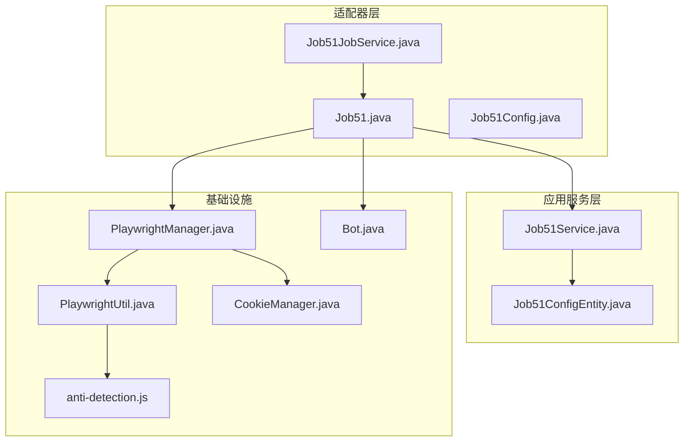
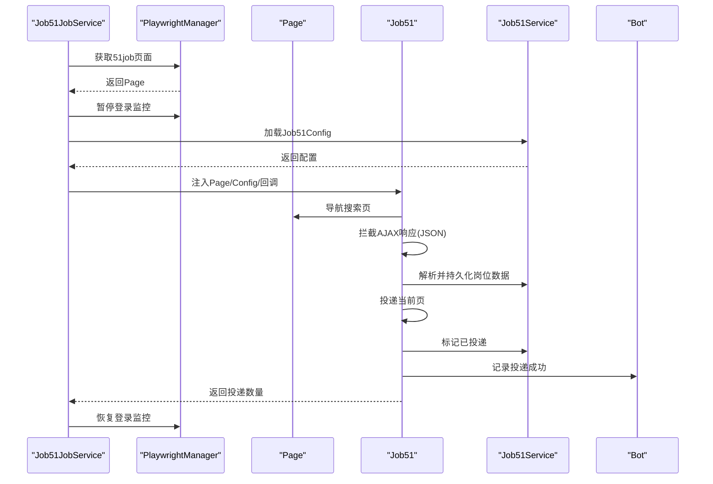
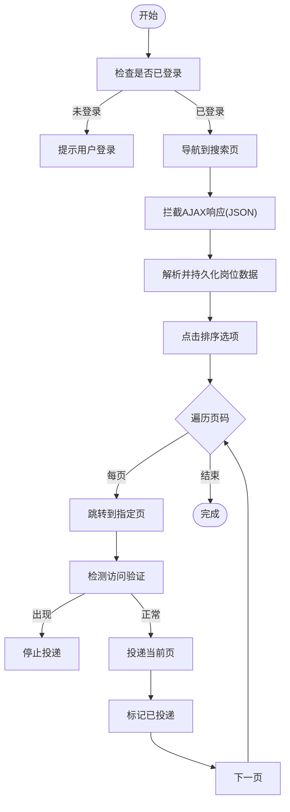
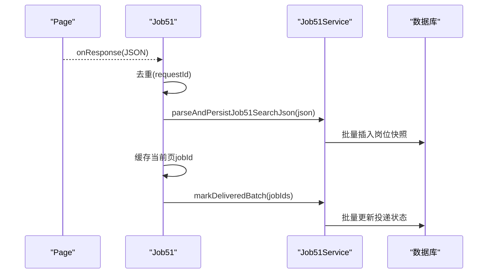
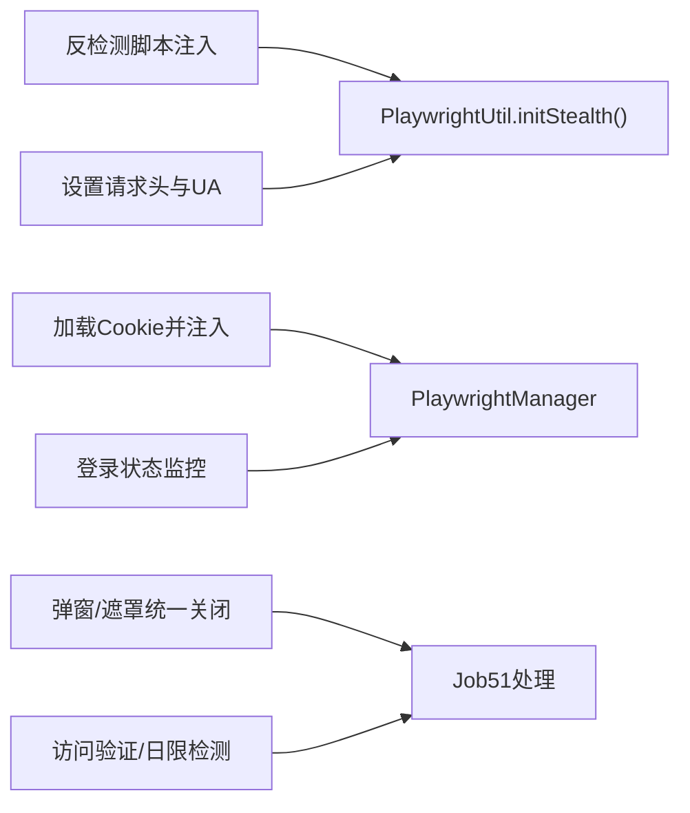
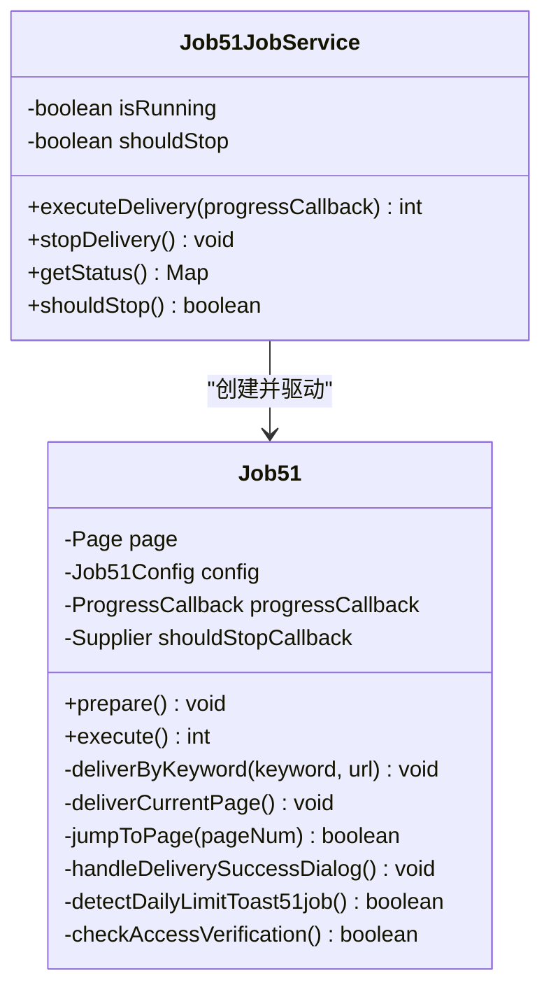
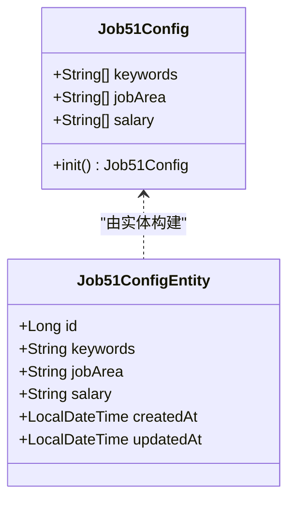
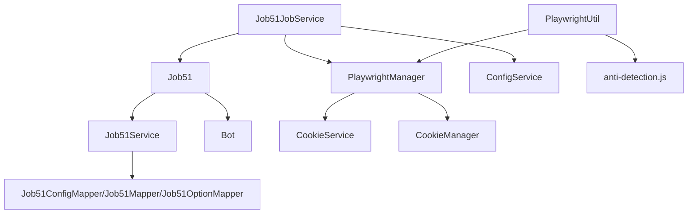

# 51job适配器

<cite>
**本文档引用的文件**
- [Job51.java](file://backend/src/main/java/com/getjobs/worker/job51/Job51.java)
- [Job51Config.java](file://backend/src/main/java/com/getjobs/worker/job51/Job51Config.java)
- [Job51JobService.java](file://backend/src/main/java/com/getjobs/worker/service/Job51JobService.java)
- [Job51Service.java](file://backend/src/main/java/com/getjobs/application/service/Job51Service.java)
- [Job51ConfigEntity.java](file://backend/src/main/java/com/getjobs/application/entity/Job51ConfigEntity.java)
- [PlaywrightManager.java](file://backend/src/main/java/com/getjobs/worker/manager/PlaywrightManager.java)
- [PlaywrightUtil.java](file://backend/src/main/java/com/getjobs/worker/utils/PlaywrightUtil.java)
- [Bot.java](file://backend/src/main/java/com/getjobs/worker/utils/Bot.java)
- [CookieManager.java](file://backend/src/main/java/com/getjobs/worker/utils/CookieManager.java)
- [RetryStrategy.java](file://backend/src/main/java/com/getjobs/worker/utils/RetryStrategy.java)
- [anti-detection.js](file://backend/src/main/resources/anti-detection.js)
</cite>

## 目录
1. [简介](#简介)
2. [项目结构](#项目结构)
3. [核心组件](#核心组件)
4. [架构总览](#架构总览)
5. [详细组件分析](#详细组件分析)
6. [依赖关系分析](#依赖关系分析)
7. [性能考量](#性能考量)
8. [故障排查指南](#故障排查指南)
9. [结论](#结论)
10. [附录](#附录)

## 简介
本文件面向招聘平台自动化开发者，系统性解读 51job 平台适配器的技术实现，重点覆盖以下方面：
- 登录认证流程与状态检测
- 页面跳转逻辑与 AJAX 请求拦截
- 数据解析策略与缓存机制
- 作业调度算法与任务执行策略
- 反爬虫应对策略与异常恢复机制
- 调试工具使用与性能监控方法

## 项目结构
51job 适配器位于 worker/job51 与 worker/service 两个包中，配合 Playwright 管理器、工具类与应用服务层共同完成自动化投递任务。

**图表来源**
- [Job51.java:1-908](file://backend/src/main/java/com/getjobs/worker/job51/Job51.java#L1-L908)
- [Job51JobService.java:1-149](file://backend/src/main/java/com/getjobs/worker/service/Job51JobService.java#L1-L149)
- [Job51Service.java:1-725](file://backend/src/main/java/com/getjobs/application/service/Job51Service.java#L1-L725)
- [PlaywrightManager.java:580-880](file://backend/src/main/java/com/getjobs/worker/manager/PlaywrightManager.java#L580-L880)
- [PlaywrightUtil.java:1-610](file://backend/src/main/java/com/getjobs/worker/utils/PlaywrightUtil.java#L1-L610)
- [CookieManager.java:1-259](file://backend/src/main/java/com/getjobs/worker/utils/CookieManager.java#L1-L259)
- [anti-detection.js:1-109](file://backend/src/main/resources/anti-detection.js#L1-L109)

**章节来源**
- [Job51.java:1-908](file://backend/src/main/java/com/getjobs/worker/job51/Job51.java#L1-L908)
- [Job51JobService.java:1-149](file://backend/src/main/java/com/getjobs/worker/service/Job51JobService.java#L1-L149)

## 核心组件
- Job51：负责 51job 页面自动化，包括登录检测、AJAX 拦截、页面跳转、投递执行、弹窗处理与状态标记。
- Job51Config：平台特定配置载体，包含关键词、城市区域、薪资范围等。
- Job51JobService：作业调度器，协调 Playwright 页面、配置加载与进度回调。
- Job51Service：应用服务，负责配置解析、JSON 数据解析入库、投递状态写回与统计分析。
- PlaywrightManager：浏览器生命周期与登录状态管理，含 Cookie 注入、登录监控与后台等待。
- PlaywrightUtil：通用 Playwright 工具集，含反检测脚本注入、Cookie 读写、设备与请求头设置。
- Bot：投递结果汇总与通知，定时推送至企业微信/钉钉。
- CookieManager：Cookie 生命周期管理，支持过期预警与刷新触发。
- RetryStrategy：指数退避重试策略，提升稳定性。

**章节来源**
- [Job51Config.java:1-41](file://backend/src/main/java/com/getjobs/worker/job51/Job51Config.java#L1-L41)
- [Job51JobService.java:1-149](file://backend/src/main/java/com/getjobs/worker/service/Job51JobService.java#L1-L149)
- [Job51Service.java:1-725](file://backend/src/main/java/com/getjobs/application/service/Job51Service.java#L1-L725)
- [PlaywrightManager.java:580-880](file://backend/src/main/java/com/getjobs/worker/manager/PlaywrightManager.java#L580-L880)
- [PlaywrightUtil.java:1-610](file://backend/src/main/java/com/getjobs/worker/utils/PlaywrightUtil.java#L1-L610)
- [Bot.java:1-229](file://backend/src/main/java/com/getjobs/worker/utils/Bot.java#L1-L229)
- [CookieManager.java:1-259](file://backend/src/main/java/com/getjobs/worker/utils/CookieManager.java#L1-L259)
- [RetryStrategy.java:1-49](file://backend/src/main/java/com/getjobs/worker/utils/RetryStrategy.java#L1-L49)

## 架构总览
51job 适配器采用“服务编排 + 页面自动化 + 应用服务”的分层架构：
- 服务编排层：Job51JobService 负责任务启动、状态管理与进度回调。
- 页面自动化层：Job51 与 PlaywrightManager 协作，完成页面导航、登录检测、AJAX 拦截与交互。
- 应用服务层：Job51Service 负责配置解析、JSON 解析入库、投递状态写回与统计分析。
- 基础设施层：PlaywrightUtil 提供反检测与 Cookie 管理，Bot 负责投递结果通知，CookieManager 管理 Cookie 生命周期。

**图表来源**
- [Job51JobService.java:37-111](file://backend/src/main/java/com/getjobs/worker/service/Job51JobService.java#L37-L111)
- [PlaywrightManager.java:584-686](file://backend/src/main/java/com/getjobs/worker/manager/PlaywrightManager.java#L584-L686)
- [Job51.java:112-248](file://backend/src/main/java/com/getjobs/worker/job51/Job51.java#L112-L248)
- [Job51Service.java:290-356](file://backend/src/main/java/com/getjobs/application/service/Job51Service.java#L290-L356)
- [Bot.java:67-75](file://backend/src/main/java/com/getjobs/worker/utils/Bot.java#L67-L75)

## 详细组件分析

### Job51 登录认证流程与页面跳转逻辑
- 登录检测：通过页面元素特征判断是否已登录，避免重复登录流程。
- 页面导航：设置请求头与导航到搜索页，支持重试与异常恢复。
- 页面跳转：提供页码跳转能力，包含弹窗关闭、滚动与重试逻辑。
- 访问验证检测：识别 WAF/验证码页面，及时中止任务。

**图表来源**
- [Job51.java:193-244](file://backend/src/main/java/com/getjobs/worker/job51/Job51.java#L193-L244)
- [Job51.java:518-564](file://backend/src/main/java/com/getjobs/worker/job51/Job51.java#L518-L564)
- [Job51.java:621-686](file://backend/src/main/java/com/getjobs/worker/job51/Job51.java#L621-L686)

**章节来源**
- [Job51.java:193-244](file://backend/src/main/java/com/getjobs/worker/job51/Job51.java#L193-L244)
- [Job51.java:518-564](file://backend/src/main/java/com/getjobs/worker/job51/Job51.java#L518-L564)
- [Job51.java:621-686](file://backend/src/main/java/com/getjobs/worker/job51/Job51.java#L621-L686)

### 数据解析策略与缓存机制
- AJAX 拦截：监听搜索接口响应，提取 requestId 去重，解析 JSON 并持久化。
- 岗位数据解析：兼容多种 JSON 结构，抽取关键字段并入库。
- 当前页缓存：缓存当前页 jobId 列表，用于投递成功后批量标记。
- 投递状态写回：根据成功数与缓存长度取最小值，确保标记准确。

**图表来源**
- [Job51.java:117-179](file://backend/src/main/java/com/getjobs/worker/job51/Job51.java#L117-L179)
- [Job51.java:158-167](file://backend/src/main/java/com/getjobs/worker/job51/Job51.java#L158-L167)
- [Job51Service.java:290-356](file://backend/src/main/java/com/getjobs/application/service/Job51Service.java#L290-L356)
- [Job51Service.java:386-413](file://backend/src/main/java/com/getjobs/application/service/Job51Service.java#L386-L413)

**章节来源**
- [Job51.java:117-179](file://backend/src/main/java/com/getjobs/worker/job51/Job51.java#L117-L179)
- [Job51Service.java:290-356](file://backend/src/main/java/com/getjobs/application/service/Job51Service.java#L290-L356)
- [Job51Service.java:386-413](file://backend/src/main/java/com/getjobs/application/service/Job51Service.java#L386-L413)

### 反爬虫应对策略与异常恢复
- 反检测脚本：注入 stealth 脚本，隐藏 webdriver 标识，伪装 navigator 属性。
- 请求头与 UA：设置符合真实用户环境的请求头与 UA。
- Cookie 管理：从数据库加载 Cookie，定期检查有效期，必要时触发刷新。
- 弹窗与遮罩处理：统一关闭各类弹窗与遮罩层，确保交互稳定。
- 访问验证与日限检测：检测 WAF/验证码与日投递上限提示，及时中止。

**图表来源**
- [PlaywrightUtil.java:425-480](file://backend/src/main/java/com/getjobs/worker/utils/PlaywrightUtil.java#L425-L480)
- [PlaywrightUtil.java:494-510](file://backend/src/main/java/com/getjobs/worker/utils/PlaywrightUtil.java#L494-L510)
- [PlaywrightManager.java:587-605](file://backend/src/main/java/com/getjobs/worker/manager/PlaywrightManager.java#L587-L605)
- [PlaywrightManager.java:724-735](file://backend/src/main/java/com/getjobs/worker/manager/PlaywrightManager.java#L724-L735)
- [Job51.java:569-616](file://backend/src/main/java/com/getjobs/worker/job51/Job51.java#L569-L616)
- [Job51.java:673-686](file://backend/src/main/java/com/getjobs/worker/job51/Job51.java#L673-L686)

**章节来源**
- [PlaywrightUtil.java:425-480](file://backend/src/main/java/com/getjobs/worker/utils/PlaywrightUtil.java#L425-L480)
- [PlaywrightUtil.java:494-510](file://backend/src/main/java/com/getjobs/worker/utils/PlaywrightUtil.java#L494-L510)
- [PlaywrightManager.java:587-605](file://backend/src/main/java/com/getjobs/worker/manager/PlaywrightManager.java#L587-L605)
- [PlaywrightManager.java:724-735](file://backend/src/main/java/com/getjobs/worker/manager/PlaywrightManager.java#L724-L735)
- [Job51.java:569-616](file://backend/src/main/java/com/getjobs/worker/job51/Job51.java#L569-L616)
- [Job51.java:673-686](file://backend/src/main/java/com/getjobs/worker/job51/Job51.java#L673-L686)

### 作业调度算法与任务执行策略
- 任务状态：isRunning/shouldStop 标志，避免并发执行。
- 进度回调：统一通过 JobProgressMessage 推送，支持警告与错误降级。
- 停止机制：支持外部停止信号，Job51 在关键点检查 shouldStop()。
- 登录状态：执行前检查登录状态，执行期间暂停后台监控，结束后恢复。

**图表来源**
- [Job51JobService.java:25-149](file://backend/src/main/java/com/getjobs/worker/service/Job51JobService.java#L25-L149)
- [Job51.java:31-107](file://backend/src/main/java/com/getjobs/worker/job51/Job51.java#L31-L107)

**章节来源**
- [Job51JobService.java:37-111](file://backend/src/main/java/com/getjobs/worker/service/Job51JobService.java#L37-L111)
- [Job51.java:68-107](file://backend/src/main/java/com/getjobs/worker/job51/Job51.java#L68-L107)

### 配置类设计思路（Job51Config）
- 字段设计：keywords、jobArea、salary 三要素，均以列表形式承载。
- 初始化策略：保留静态 init() 以兼容旧调用，但建议通过 Job51JobService 与 ConfigService 统一构建。
- 与实体映射：Job51ConfigEntity 提供数据库存储结构，Job51Service 负责解析与归一化。

**图表来源**
- [Job51Config.java:14-40](file://backend/src/main/java/com/getjobs/worker/job51/Job51Config.java#L14-L40)
- [Job51ConfigEntity.java:12-31](file://backend/src/main/java/com/getjobs/application/entity/Job51ConfigEntity.java#L12-L31)

**章节来源**
- [Job51Config.java:14-40](file://backend/src/main/java/com/getjobs/worker/job51/Job51Config.java#L14-L40)
- [Job51ConfigEntity.java:12-31](file://backend/src/main/java/com/getjobs/application/entity/Job51ConfigEntity.java#L12-L31)

## 依赖关系分析
- Job51JobService 依赖 PlaywrightManager 获取 Page，依赖 Job51 提供自动化能力，依赖 ConfigService 获取配置。
- Job51 依赖 Job51Service 进行数据解析与状态写回，依赖 Bot 记录投递结果，依赖 PlaywrightManager 进行登录状态检查。
- Job51Service 依赖 Job51ConfigMapper、Job51Mapper、Job51OptionMapper 进行数据持久化与查询。
- PlaywrightManager 依赖 CookieService 与 CookieManager 进行 Cookie 生命周期管理与注入。
- PlaywrightUtil 依赖反检测脚本与浏览器上下文，提供通用工具方法。

**图表来源**
- [Job51JobService.java:28-31](file://backend/src/main/java/com/getjobs/worker/service/Job51JobService.java#L28-L31)
- [Job51.java:36-49](file://backend/src/main/java/com/getjobs/worker/job51/Job51.java#L36-L49)
- [PlaywrightManager.java:587-605](file://backend/src/main/java/com/getjobs/worker/manager/PlaywrightManager.java#L587-L605)
- [PlaywrightUtil.java:425-480](file://backend/src/main/java/com/getjobs/worker/utils/PlaywrightUtil.java#L425-L480)
- [Job51Service.java:24-26](file://backend/src/main/java/com/getjobs/application/service/Job51Service.java#L24-L26)

**章节来源**
- [Job51JobService.java:28-31](file://backend/src/main/java/com/getjobs/worker/service/Job51JobService.java#L28-L31)
- [Job51.java:36-49](file://backend/src/main/java/com/getjobs/worker/job51/Job51.java#L36-L49)
- [PlaywrightManager.java:587-605](file://backend/src/main/java/com/getjobs/worker/manager/PlaywrightManager.java#L587-L605)
- [PlaywrightUtil.java:425-480](file://backend/src/main/java/com/getjobs/worker/utils/PlaywrightUtil.java#L425-L480)
- [Job51Service.java:24-26](file://backend/src/main/java/com/getjobs/application/service/Job51Service.java#L24-L26)

## 性能考量
- 等待与重试：使用 PlaywrightUtil 的 sleep 与 RetryStrategy 的指数退避，平衡稳定性与效率。
- 请求头与 UA：设置合理请求头与 UA，减少服务器端异常分流。
- AJAX 拦截与去重：基于 requestId 去重，避免重复解析与入库。
- 批量写入：Job51Service 使用批量插入与批量更新，降低数据库压力。
- 弹窗与遮罩处理：统一关闭弹窗，减少无效交互带来的性能损耗。

[本节为通用指导，无需具体文件分析]

## 故障排查指南
- 登录状态异常
  - 现象：任务提示未登录或频繁弹出登录。
  - 排查：检查 Cookie 是否正确注入与保存，确认登录监控是否被暂停/恢复。
  - 参考
    - [PlaywrightManager.java:587-605](file://backend/src/main/java/com/getjobs/worker/manager/PlaywrightManager.java#L587-L605)
    - [PlaywrightManager.java:724-735](file://backend/src/main/java/com/getjobs/worker/manager/PlaywrightManager.java#L724-L735)
    - [PlaywrightManager.java:867-878](file://backend/src/main/java/com/getjobs/worker/manager/PlaywrightManager.java#L867-L878)
- 页面跳转失败
  - 现象：跳转到指定页失败或页面结构变化。
  - 排查：检查页码输入框与跳转按钮选择器，确认弹窗关闭与页面滚动。
  - 参考
    - [Job51.java:518-564](file://backend/src/main/java/com/getjobs/worker/job51/Job51.java#L518-L564)
    - [Job51.java:569-616](file://backend/src/main/java/com/getjobs/worker/job51/Job51.java#L569-L616)
- 投递上限与访问验证
  - 现象：出现“日投递太多/达到上限/请按住滑块”等提示。
  - 排查：检测日限提示与 WAF 页面，及时中止任务并提示用户。
  - 参考
    - [Job51.java:637-668](file://backend/src/main/java/com/getjobs/worker/job51/Job51.java#L637-L668)
    - [Job51.java:673-686](file://backend/src/main/java/com/getjobs/worker/job51/Job51.java#L673-L686)
- 数据解析异常
  - 现象：JSON 结构变化导致解析失败。
  - 排查：检查 Job51Service 的多结构兼容逻辑，确认字段映射与空值处理。
  - 参考
    - [Job51Service.java:290-356](file://backend/src/main/java/com/getjobs/application/service/Job51Service.java#L290-L356)
- 反检测失效
  - 现象：被识别为自动化或行为异常。
  - 排查：确认反检测脚本注入与请求头设置，检查 stealth.min.js 文件是否存在。
  - 参考
    - [PlaywrightUtil.java:425-480](file://backend/src/main/java/com/getjobs/worker/utils/PlaywrightUtil.java#L425-L480)
    - [anti-detection.js:1-109](file://backend/src/main/resources/anti-detection.js#L1-L109)

**章节来源**
- [PlaywrightManager.java:587-605](file://backend/src/main/java/com/getjobs/worker/manager/PlaywrightManager.java#L587-L605)
- [PlaywrightManager.java:724-735](file://backend/src/main/java/com/getjobs/worker/manager/PlaywrightManager.java#L724-L735)
- [PlaywrightManager.java:867-878](file://backend/src/main/java/com/getjobs/worker/manager/PlaywrightManager.java#L867-L878)
- [Job51.java:518-564](file://backend/src/main/java/com/getjobs/worker/job51/Job51.java#L518-L564)
- [Job51.java:569-616](file://backend/src/main/java/com/getjobs/worker/job51/Job51.java#L569-L616)
- [Job51.java:637-668](file://backend/src/main/java/com/getjobs/worker/job51/Job51.java#L637-L668)
- [Job51.java:673-686](file://backend/src/main/java/com/getjobs/worker/job51/Job51.java#L673-L686)
- [Job51Service.java:290-356](file://backend/src/main/java/com/getjobs/application/service/Job51Service.java#L290-L356)
- [PlaywrightUtil.java:425-480](file://backend/src/main/java/com/getjobs/worker/utils/PlaywrightUtil.java#L425-L480)
- [anti-detection.js:1-109](file://backend/src/main/resources/anti-detection.js#L1-L109)

## 结论
51job 适配器通过清晰的分层设计与完善的反爬虫策略，实现了稳定的自动化投递流程。Job51JobService 负责任务编排，Job51 负责页面交互与数据处理，Job51Service 提供数据持久化与统计分析，PlaywrightManager 与 PlaywrightUtil 提供底层支撑。结合 Bot 与 CookieManager，形成从登录到投递、从数据到通知的完整闭环。

[本节为总结性内容，无需具体文件分析]

## 附录
- 调试工具使用
  - 截图与元素截图：用于定位页面结构变化与交互异常。
  - Cookie 读写：保存/加载 Cookie，便于复现登录状态。
  - 反检测脚本：注入 stealth 脚本，降低被检测概率。
  - 参考
    - [PlaywrightUtil.java:293-316](file://backend/src/main/java/com/getjobs/worker/utils/PlaywrightUtil.java#L293-L316)
    - [PlaywrightUtil.java:324-408](file://backend/src/main/java/com/getjobs/worker/utils/PlaywrightUtil.java#L324-L408)
    - [PlaywrightUtil.java:425-480](file://backend/src/main/java/com/getjobs/worker/utils/PlaywrightUtil.java#L425-L480)
- 性能监控方法
  - 进度回调：通过 JobProgressMessage 实时反馈任务进度与状态。
  - 投递汇总：Bot 定时聚合推送，便于运营监控。
  - 参考
    - [Job51JobService.java:72-85](file://backend/src/main/java/com/getjobs/worker/service/Job51JobService.java#L72-L85)
    - [Bot.java:169-186](file://backend/src/main/java/com/getjobs/worker/utils/Bot.java#L169-L186)

**章节来源**
- [PlaywrightUtil.java:293-316](file://backend/src/main/java/com/getjobs/worker/utils/PlaywrightUtil.java#L293-L316)
- [PlaywrightUtil.java:324-408](file://backend/src/main/java/com/getjobs/worker/utils/PlaywrightUtil.java#L324-L408)
- [PlaywrightUtil.java:425-480](file://backend/src/main/java/com/getjobs/worker/utils/PlaywrightUtil.java#L425-L480)
- [Job51JobService.java:72-85](file://backend/src/main/java/com/getjobs/worker/service/Job51JobService.java#L72-L85)
- [Bot.java:169-186](file://backend/src/main/java/com/getjobs/worker/utils/Bot.java#L169-L186)