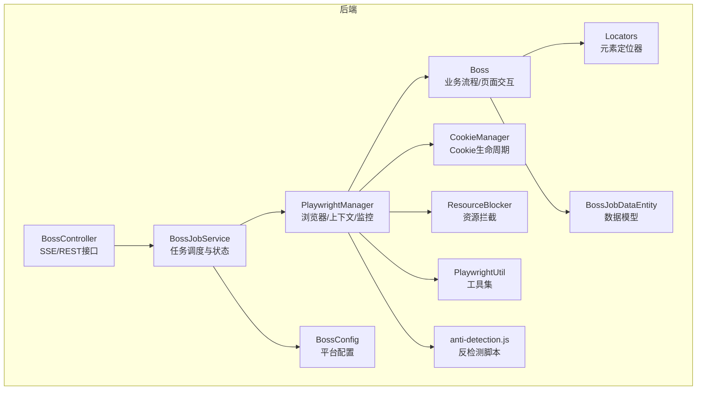
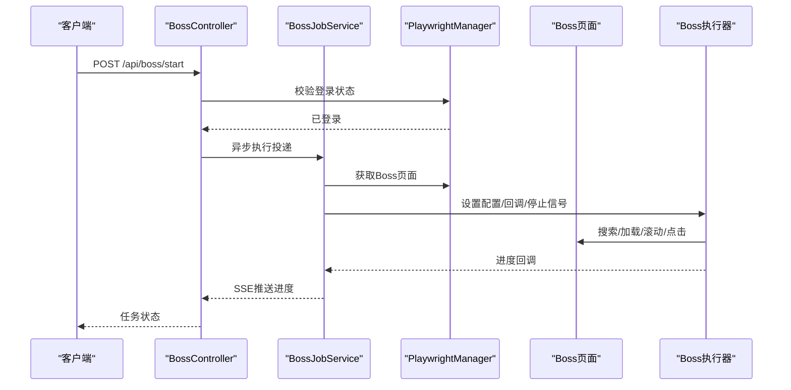
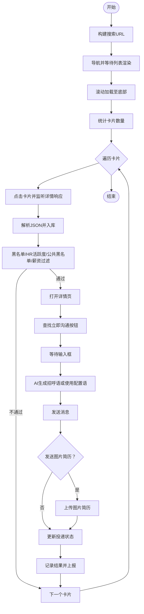
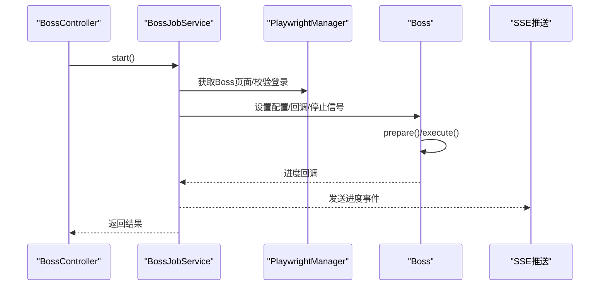
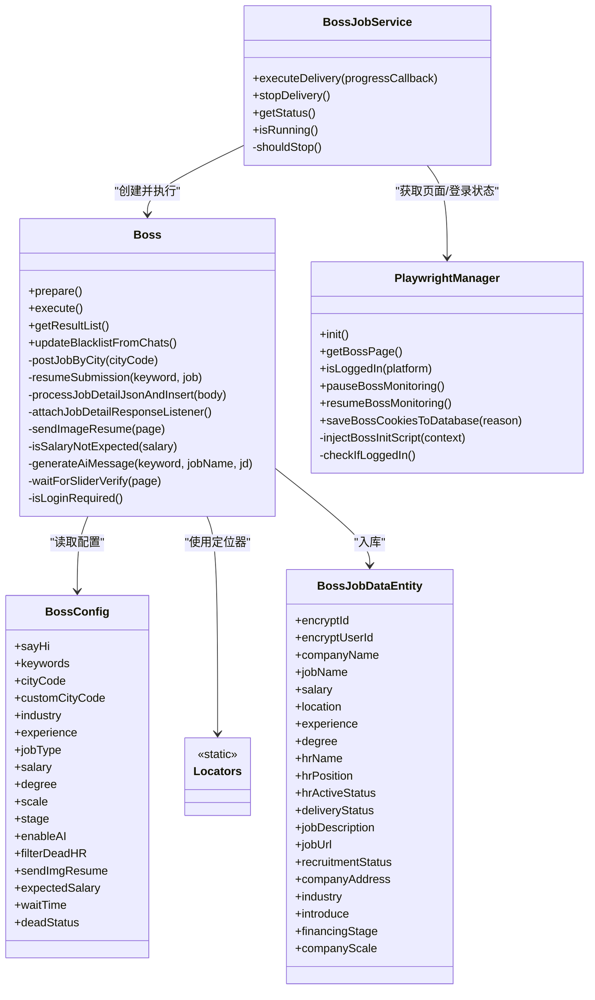
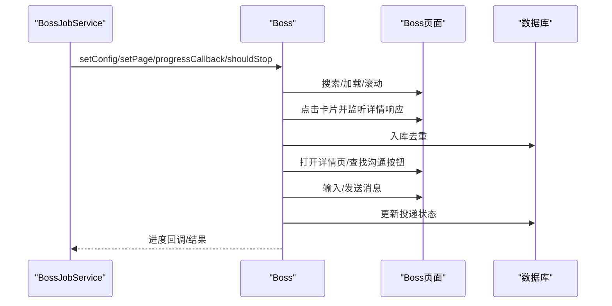

# Boss直聘适配器

<cite>
**本文引用的文件**
- [Boss.java](file://backend/src/main/java/com/getjobs/worker/boss/Boss.java)
- [BossConfig.java](file://backend/src/main/java/com/getjobs/worker/boss/BossConfig.java)
- [Locators.java](file://backend/src/main/java/com/getjobs/worker/boss/Locators.java)
- [BossJobService.java](file://backend/src/main/java/com/getjobs/worker/service/BossJobService.java)
- [PlaywrightManager.java](file://backend/src/main/java/com/getjobs/worker/manager/PlaywrightManager.java)
- [PlaywrightUtil.java](file://backend/src/main/java/com/getjobs/worker/utils/PlaywrightUtil.java)
- [BossJobDataEntity.java](file://backend/src/main/java/com/getjobs/application/entity/BossJobDataEntity.java)
- [BossController.java](file://backend/src/main/java/com/getjobs/application/controller/BossController.java)
- [CookieManager.java](file://backend/src/main/java/com/getjobs/worker/utils/CookieManager.java)
- [ResourceBlocker.java](file://backend/src/main/java/com/getjobs/worker/utils/ResourceBlocker.java)
- [anti-detection.js](file://backend/src/main/resources/anti-detection.js)
</cite>

## 目录
1. [简介](#简介)
2. [项目结构](#项目结构)
3. [核心组件](#核心组件)
4. [架构总览](#架构总览)
5. [详细组件分析](#详细组件分析)
6. [依赖关系分析](#依赖关系分析)
7. [性能考量](#性能考量)
8. [故障排查指南](#故障排查指南)
9. [结论](#结论)
10. [附录](#附录)

## 简介
本技术文档面向自动化工程师与前端开发者，系统性解析 Boss 直聘平台适配器的实现细节，重点覆盖：
- 登录流程与会话保持策略
- 页面交互逻辑与反检测措施
- 数据提取与入库策略
- 配置类设计与参数校验
- 元素定位器的稳定性与降级策略
- 作业调度机制与任务执行流程
- 调试技巧与性能优化建议

## 项目结构
Boss 适配器位于后端 worker 模块，采用 Playwright 进行浏览器自动化，结合 Spring 管理的服务层与控制器层，形成“配置-调度-执行-监控”的完整链路。

图表来源
- [BossController.java:34-246](file://backend/src/main/java/com/getjobs/application/controller/BossController.java#L34-L246)
- [BossJobService.java:25-143](file://backend/src/main/java/com/getjobs/worker/service/BossJobService.java#L25-L143)
- [PlaywrightManager.java:40-250](file://backend/src/main/java/com/getjobs/worker/manager/PlaywrightManager.java#L40-L250)
- [Boss.java:45-125](file://backend/src/main/java/com/getjobs/worker/boss/Boss.java#L45-L125)
- [BossConfig.java:16-107](file://backend/src/main/java/com/getjobs/worker/boss/BossConfig.java#L16-L107)
- [Locators.java:7-63](file://backend/src/main/java/com/getjobs/worker/boss/Locators.java#L7-L63)
- [BossJobDataEntity.java:14-108](file://backend/src/main/java/com/getjobs/application/entity/BossJobDataEntity.java#L14-L108)
- [CookieManager.java:31-197](file://backend/src/main/java/com/getjobs/worker/utils/CookieManager.java#L31-L197)
- [ResourceBlocker.java:23-102](file://backend/src/main/java/com/getjobs/worker/utils/ResourceBlocker.java#L23-L102)
- [PlaywrightUtil.java:20-118](file://backend/src/main/java/com/getjobs/worker/utils/PlaywrightUtil.java#L20-L118)
- [anti-detection.js:1-109](file://backend/src/main/resources/anti-detection.js#L1-L109)

章节来源
- [BossController.java:34-246](file://backend/src/main/java/com/getjobs/application/controller/BossController.java#L34-L246)
- [BossJobService.java:25-143](file://backend/src/main/java/com/getjobs/worker/service/BossJobService.java#L25-L143)
- [PlaywrightManager.java:40-250](file://backend/src/main/java/com/getjobs/worker/manager/PlaywrightManager.java#L40-L250)

## 核心组件
- Boss：负责搜索、加载、过滤、点击卡片、进入详情、发送消息、图片简历、状态更新与结果收集。
- BossConfig：集中管理 Boss 平台的配置项，含关键词、城市、筛选条件、AI、HR过滤、图片简历、目标薪资等。
- Locators：集中管理页面元素选择器，确保定位稳定与可维护。
- BossJobService：任务调度器，协调 PlaywrightManager、配置加载与进度推送。
- PlaywrightManager：浏览器生命周期、上下文共享、登录状态监控、反检测脚本注入、资源拦截。
- 实体与工具：BossJobDataEntity、CookieManager、ResourceBlocker、PlaywrightUtil、anti-detection.js。

章节来源
- [Boss.java:45-125](file://backend/src/main/java/com/getjobs/worker/boss/Boss.java#L45-L125)
- [BossConfig.java:16-107](file://backend/src/main/java/com/getjobs/worker/boss/BossConfig.java#L16-L107)
- [Locators.java:7-63](file://backend/src/main/java/com/getjobs/worker/boss/Locators.java#L7-L63)
- [BossJobService.java:25-143](file://backend/src/main/java/com/getjobs/worker/service/BossJobService.java#L25-L143)
- [PlaywrightManager.java:40-250](file://backend/src/main/java/com/getjobs/worker/manager/PlaywrightManager.java#L40-L250)
- [BossJobDataEntity.java:14-108](file://backend/src/main/java/com/getjobs/application/entity/BossJobDataEntity.java#L14-L108)
- [CookieManager.java:31-197](file://backend/src/main/java/com/getjobs/worker/utils/CookieManager.java#L31-L197)
- [ResourceBlocker.java:23-102](file://backend/src/main/java/com/getjobs/worker/utils/ResourceBlocker.java#L23-L102)
- [PlaywrightUtil.java:20-118](file://backend/src/main/java/com/getjobs/worker/utils/PlaywrightUtil.java#L20-L118)
- [anti-detection.js:1-109](file://backend/src/main/resources/anti-detection.js#L1-L109)

## 架构总览
Boss 适配器采用“控制器-服务-执行器-浏览器管理”的分层架构，通过 SSE 推送进度，通过 PlaywrightManager 统一管理浏览器上下文与登录状态，Boss 执行器专注页面交互与数据提取。

图表来源
- [BossController.java:71-148](file://backend/src/main/java/com/getjobs/application/controller/BossController.java#L71-L148)
- [BossJobService.java:37-104](file://backend/src/main/java/com/getjobs/worker/service/BossJobService.java#L37-L104)
- [PlaywrightManager.java:114-221](file://backend/src/main/java/com/getjobs/worker/manager/PlaywrightManager.java#L114-L221)
- [Boss.java:112-125](file://backend/src/main/java/com/getjobs/worker/boss/Boss.java#L112-L125)

## 详细组件分析

### BossConfig 配置类设计
- 职责：集中管理 Boss 平台的可配置项，包括打招呼语、关键词、城市编码、行业/经验/学历/规模/阶段筛选、AI开关、HR活跃度过滤、图片简历开关、目标薪资范围、等待时间、HR离线状态等。
- 参数设计：字段粒度细、覆盖全面，便于前端配置与后端读取。
- 参数校验：未见显式校验逻辑，建议在配置加载处增加校验与默认值处理，避免空指针与非法值。

章节来源
- [BossConfig.java:16-107](file://backend/src/main/java/com/getjobs/worker/boss/BossConfig.java#L16-L107)

### Locators 元素定位器设计
- 设计原则：集中管理、命名清晰、层级分明，便于维护与扩展。
- 稳定性保障：优先使用类名与结构化选择器，减少对动态文本的依赖；对关键元素提供备用选择器。
- 动态内容处理：通过等待与重试策略（如滚动加载、footer 到达检测）提升稳定性。
- 异常降级：定位失败时返回空集合或默认值，避免中断流程；在关键步骤中进行异常捕获与日志记录。

章节来源
- [Locators.java:7-63](file://backend/src/main/java/com/getjobs/worker/boss/Locators.java#L7-L63)
- [Boss.java:246-278](file://backend/src/main/java/com/getjobs/worker/boss/Boss.java#L246-L278)

### Boss 登录流程与会话保持
- 登录状态检测：通过用户头像/昵称容器与“登录/注册”入口文本判断登录状态，避免误判。
- 登录监控：监听页面导航事件，实时检测登录状态变化，必要时引导至登录页并切换二维码。
- 会话保持：注入反检测脚本，设置请求头与UA，启用资源拦截降低内存占用；Cookie 生命周期管理器定期检测即将过期的 Cookie 并触发刷新。
- 反检测措施：注入 anti-detection.js，屏蔽 webdriver 标识，伪装 navigator 属性，减少被识别为自动化工具的概率。

章节来源
- [PlaywrightManager.java:333-369](file://backend/src/main/java/com/getjobs/worker/manager/PlaywrightManager.java#L333-L369)
- [PlaywrightManager.java:376-388](file://backend/src/main/java/com/getjobs/worker/manager/PlaywrightManager.java#L376-L388)
- [PlaywrightManager.java:226-237](file://backend/src/main/java/com/getjobs/worker/manager/PlaywrightManager.java#L226-L237)
- [CookieManager.java:31-197](file://backend/src/main/java/com/getjobs/worker/utils/CookieManager.java#L31-L197)
- [anti-detection.js:1-109](file://backend/src/main/resources/anti-detection.js#L1-L109)

### 页面交互逻辑与数据提取
- 搜索与加载：构建搜索 URL，编码关键词，等待列表容器渲染，滚动加载至底部，统计卡片数量。
- 点击卡片：监听岗位详情接口响应，解析 JSON，入库并构建 Job 对象；同时提取 encrypt_id/encrypt_user_id 用于后续状态更新。
- 过滤策略：黑名单（公司/HR/职位）、HR活跃度过滤、公共黑名单、薪资范围过滤（支持日薪/月薪转换与年终奖剔除）。
- 投递流程：打开详情页，查找“立即沟通”按钮，等待输入框出现，AI 生成招呼语或使用配置语，发送消息；可选发送图片简历；更新投递状态并记录结果。

图表来源
- [Boss.java:228-434](file://backend/src/main/java/com/getjobs/worker/boss/Boss.java#L228-L434)
- [Boss.java:612-777](file://backend/src/main/java/com/getjobs/worker/boss/Boss.java#L612-L777)
- [Boss.java:439-532](file://backend/src/main/java/com/getjobs/worker/boss/Boss.java#L439-L532)

章节来源
- [Boss.java:228-434](file://backend/src/main/java/com/getjobs/worker/boss/Boss.java#L228-L434)
- [Boss.java:612-777](file://backend/src/main/java/com/getjobs/worker/boss/Boss.java#L612-L777)
- [Boss.java:439-532](file://backend/src/main/java/com/getjobs/worker/boss/Boss.java#L439-L532)

### BossJobService 作业调度机制
- 任务状态：isRunning/shouldStop 标志位，避免并发执行。
- 运行前检查：页面初始化、登录状态、配置加载。
- 进度回调：封装为 JobProgressMessage，通过 SSE 推送给前端。
- 停止机制：stopDelivery 设置 shouldStop，Boss 执行器在关键节点检查并优雅退出。
- 结果计费：投递完成后根据实际投递数量扣费。

图表来源
- [BossJobService.java:37-104](file://backend/src/main/java/com/getjobs/worker/service/BossJobService.java#L37-L104)
- [BossController.java:71-148](file://backend/src/main/java/com/getjobs/application/controller/BossController.java#L71-L148)

章节来源
- [BossJobService.java:25-143](file://backend/src/main/java/com/getjobs/worker/service/BossJobService.java#L25-L143)
- [BossController.java:34-246](file://backend/src/main/java/com/getjobs/application/controller/BossController.java#L34-L246)

### 数据模型与入库策略
- 实体字段：包含 encrypt_id/encrypt_user_id、公司/岗位/HR/薪资/地区/学历/经验/描述/链接/状态/行业/规模/融资阶段等。
- 去重策略：优先以 encrypt_id + encrypt_user_id 去重，若缺少 encrypt_user_id 则以 encrypt_id 去重。
- 过滤状态：根据黑名单与HR活跃度设置 delivery_status，入库时区分“已过滤/未投递”。

章节来源
- [BossJobDataEntity.java:14-108](file://backend/src/main/java/com/getjobs/application/entity/BossJobDataEntity.java#L14-L108)
- [Boss.java:512-528](file://backend/src/main/java/com/getjobs/worker/boss/Boss.java#L512-L528)

### 反检测与会话保持策略
- 反检测脚本：注入 anti-detection.js，屏蔽 webdriver 标识，伪装 navigator 属性。
- 请求头与UA：设置 sec-ch-ua、accept-language、referer 等，模拟真实用户环境。
- 资源拦截：按扩展名与域名拦截非关键资源，降低内存占用与网络开销。
- Cookie 生命周期：记录保存时间、预测过期、提前刷新，避免因 Cookie 失效导致登录中断。

章节来源
- [PlaywrightManager.java:226-237](file://backend/src/main/java/com/getjobs/worker/manager/PlaywrightManager.java#L226-L237)
- [PlaywrightUtil.java:425-487](file://backend/src/main/java/com/getjobs/worker/utils/PlaywrightUtil.java#L425-L487)
- [ResourceBlocker.java:77-102](file://backend/src/main/java/com/getjobs/worker/utils/ResourceBlocker.java#L77-L102)
- [CookieManager.java:62-153](file://backend/src/main/java/com/getjobs/worker/utils/CookieManager.java#L62-L153)

## 依赖关系分析

图表来源
- [Boss.java:45-125](file://backend/src/main/java/com/getjobs/worker/boss/Boss.java#L45-L125)
- [BossJobService.java:25-143](file://backend/src/main/java/com/getjobs/worker/service/BossJobService.java#L25-L143)
- [PlaywrightManager.java:40-250](file://backend/src/main/java/com/getjobs/worker/manager/PlaywrightManager.java#L40-L250)
- [BossConfig.java:16-107](file://backend/src/main/java/com/getjobs/worker/boss/BossConfig.java#L16-L107)
- [Locators.java:7-63](file://backend/src/main/java/com/getjobs/worker/boss/Locators.java#L7-L63)
- [BossJobDataEntity.java:14-108](file://backend/src/main/java/com/getjobs/application/entity/BossJobDataEntity.java#L14-L108)

章节来源
- [Boss.java:45-125](file://backend/src/main/java/com/getjobs/worker/boss/Boss.java#L45-L125)
- [BossJobService.java:25-143](file://backend/src/main/java/com/getjobs/worker/service/BossJobService.java#L25-L143)
- [PlaywrightManager.java:40-250](file://backend/src/main/java/com/getjobs/worker/manager/PlaywrightManager.java#L40-L250)

## 性能考量
- 资源拦截：启用 playwright.resource-blocking-enabled 可显著降低内存占用与网络开销，但需确保关键资源（如二维码）在白名单中。
- 慢动作与超时：通过 PlaywrightManager 的 slow-mo 与平台导航超时参数平衡稳定性与性能。
- 滚动加载策略：渐进滚动与 footer 到达检测相结合，避免死循环与过度请求。
- 图片简历：通过 FileChooser 直接提交文件，避免系统文件选择器阻塞。
- 日志与调试：target/job.txt 记录原始 JSON，便于问题定位与调试。

章节来源
- [ResourceBlocker.java:77-102](file://backend/src/main/java/com/getjobs/worker/utils/ResourceBlocker.java#L77-L102)
- [PlaywrightManager.java:93-106](file://backend/src/main/java/com/getjobs/worker/manager/PlaywrightManager.java#L93-L106)
- [Boss.java:246-278](file://backend/src/main/java/com/getjobs/worker/boss/Boss.java#L246-L278)
- [Boss.java:860-916](file://backend/src/main/java/com/getjobs/worker/boss/Boss.java#L860-L916)
- [Boss.java:823-836](file://backend/src/main/java/com/getjobs/worker/boss/Boss.java#L823-L836)

## 故障排查指南
- 登录状态异常
  - 现象：页面显示“登录/注册”入口或 URL 变化频繁。
  - 排查：确认 Cookie 是否正确注入与保存；检查 PlaywrightManager 的登录监控是否被暂停；查看反检测脚本是否注入成功。
  - 处理：恢复监控、重新注入脚本、刷新 Cookie。
- 页面元素定位失败
  - 现象：找不到“立即沟通”、“查看更多信息”等关键按钮。
  - 排查：确认页面是否完全加载；检查 Locators 选择器是否过时；观察网络请求是否被拦截。
  - 处理：增加等待与重试；更新选择器；调整资源拦截白名单。
- 投递状态未更新
  - 现象：发送成功但数据库未更新投递状态。
  - 排查：确认 encrypt_id/encrypt_user_id 是否正确提取与映射；检查数据库去重逻辑。
  - 处理：打印 detailUrl 与映射表；核对去重字段。
- 滑块验证阻塞
  - 现象：页面跳转至滑块验证，需人工干预。
  - 处理：等待用户完成验证后回车继续；或优化验证码处理策略。
- SSE 连接断开
  - 现象：前端无法接收进度事件。
  - 排查：检查 BossController 的心跳与异常处理；确认客户端连接状态。
  - 处理：重连机制与心跳保活。

章节来源
- [PlaywrightManager.java:376-388](file://backend/src/main/java/com/getjobs/worker/manager/PlaywrightManager.java#L376-L388)
- [PlaywrightManager.java:226-237](file://backend/src/main/java/com/getjobs/worker/manager/PlaywrightManager.java#L226-L237)
- [Boss.java:1115-1138](file://backend/src/main/java/com/getjobs/worker/boss/Boss.java#L1115-L1138)
- [BossController.java:202-245](file://backend/src/main/java/com/getjobs/application/controller/BossController.java#L202-L245)

## 结论
Boss 直聘适配器通过模块化的配置、稳定的元素定位、完善的登录监控与反检测策略，实现了高可用的自动化投递流程。建议在生产环境中启用资源拦截、完善参数校验与异常处理，并持续优化验证码与风控应对策略，以提升稳定性与成功率。

## 附录

### 关键流程时序图：投递执行

图表来源
- [BossJobService.java:71-91](file://backend/src/main/java/com/getjobs/worker/service/BossJobService.java#L71-L91)
- [Boss.java:228-434](file://backend/src/main/java/com/getjobs/worker/boss/Boss.java#L228-L434)
- [Boss.java:612-777](file://backend/src/main/java/com/getjobs/worker/boss/Boss.java#L612-L777)
- [Boss.java:439-532](file://backend/src/main/java/com/getjobs/worker/boss/Boss.java#L439-L532)