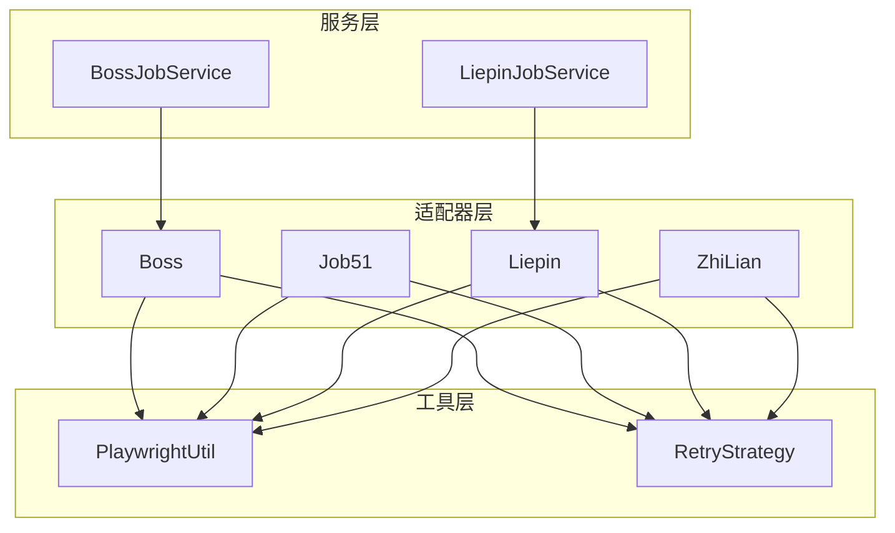
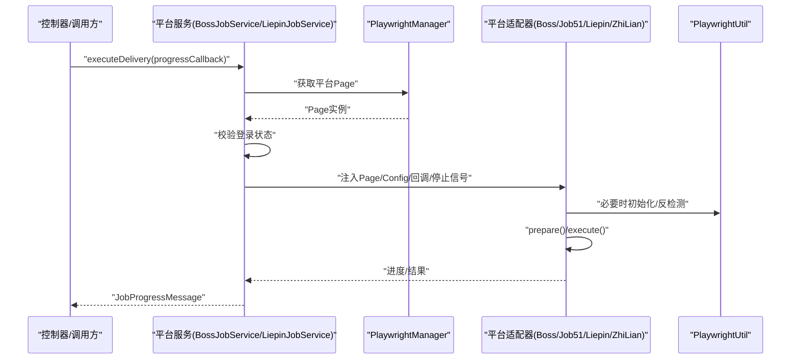
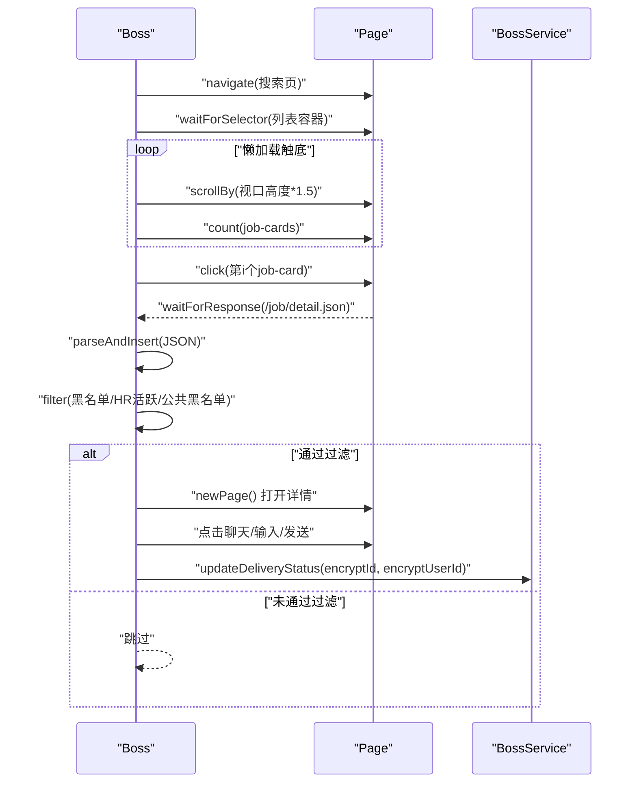
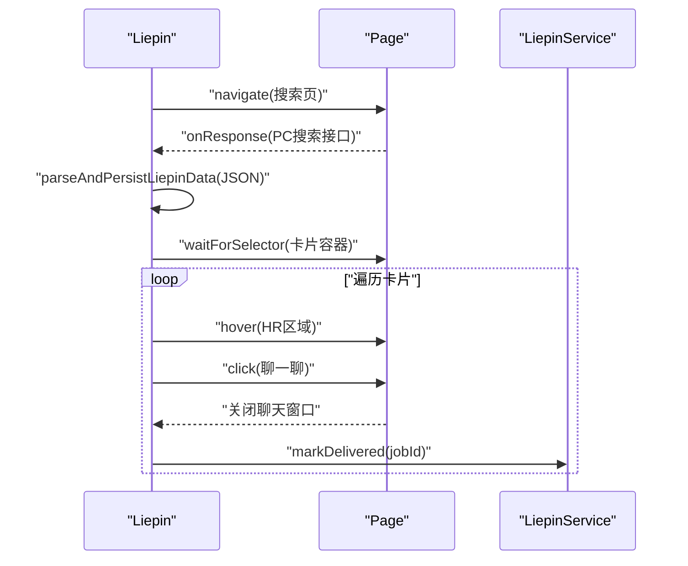
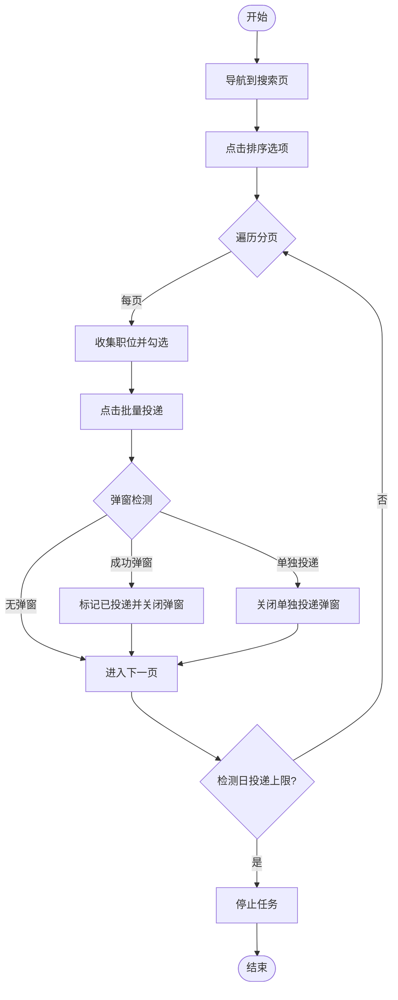
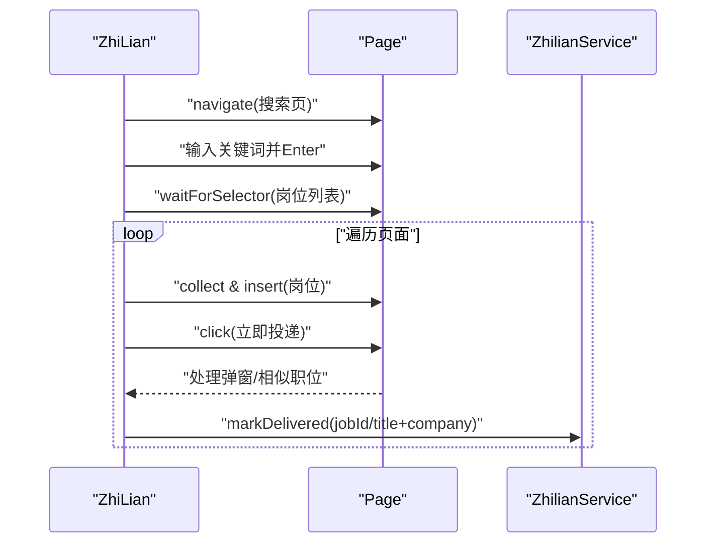
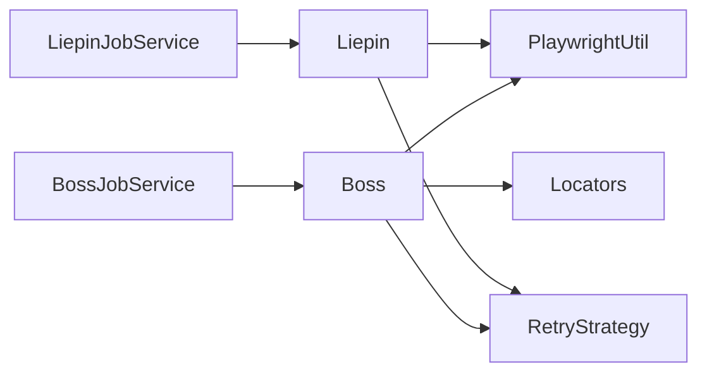

# 平台适配器

<cite>
**本文引用的文件**
- [Boss.java](file://backend/src/main/java/com/getjobs/worker/boss/Boss.java)
- [Locators.java](file://backend/src/main/java/com/getjobs/worker/boss/Locators.java)
- [BossConfig.java](file://backend/src/main/java/com/getjobs/worker/boss/BossConfig.java)
- [Job51.java](file://backend/src/main/java/com/getjobs/worker/job51/Job51.java)
- [Job51Config.java](file://backend/src/main/java/com/getjobs/worker/job51/Job51Config.java)
- [Liepin.java](file://backend/src/main/java/com/getjobs/worker/liepin/Liepin.java)
- [LiepinConfig.java](file://backend/src/main/java/com/getjobs/worker/liepin/LiepinConfig.java)
- [ZhiLian.java](file://backend/src/main/java/com/getjobs/worker/zhilian/ZhiLian.java)
- [ZhilianConfig.java](file://backend/src/main/java/com/getjobs/worker/zhilian/ZhilianConfig.java)
- [PlaywrightUtil.java](file://backend/src/main/java/com/getjobs/worker/utils/PlaywrightUtil.java)
- [RetryStrategy.java](file://backend/src/main/java/com/getjobs/worker/utils/RetryStrategy.java)
- [BossJobService.java](file://backend/src/main/java/com/getjobs/worker/service/BossJobService.java)
- [LiepinJobService.java](file://backend/src/main/java/com/getjobs/worker/service/LiepinJobService.java)
- [JobPlatformService.java](file://backend/src/main/java/com/getjobs/worker/service/JobPlatformService.java)
</cite>

## 目录
1. [简介](#简介)
2. [项目结构](#项目结构)
3. [核心组件](#核心组件)
4. [架构总览](#架构总览)
5. [详细组件分析](#详细组件分析)
6. [依赖分析](#依赖分析)
7. [性能考量](#性能考量)
8. [故障排查指南](#故障排查指南)
9. [结论](#结论)
10. [附录](#附录)

## 简介
本文件系统性梳理平台适配器模块，聚焦 Boss 直聘、猎聘、51job、智联招聘四家招聘平台的适配器设计与实现。文档涵盖：
- 适配器模式与控制流
- locators 定位策略与稳定性保障
- 登录流程、页面交互与数据提取策略
- 平台特定异常处理与重试策略
- 扩展开发指南、调试技巧与性能优化建议
- 使用示例、常见问题与维护注意事项

## 项目结构
平台适配器位于后端 worker 层，采用“平台适配器 + 服务编排 + Playwright 管理”的分层架构：
- 适配器层：各平台独立的适配器类负责页面自动化与业务流程
- 服务层：JobPlatformService 接口与具体实现（如 BossJobService、LiepinJobService）负责任务编排、状态管理与进度回调
- 工具层：PlaywrightUtil 提供浏览器生命周期与反检测能力；RetryStrategy 提供指数退避重试

图表来源
- [BossJobService.java:25-143](file://backend/src/main/java/com/getjobs/worker/service/BossJobService.java#L25-L143)
- [LiepinJobService.java:25-141](file://backend/src/main/java/com/getjobs/worker/service/LiepinJobService.java#L25-L141)
- [Boss.java:45-125](file://backend/src/main/java/com/getjobs/worker/boss/Boss.java#L45-L125)
- [Job51.java:31-107](file://backend/src/main/java/com/getjobs/worker/job51/Job51.java#L31-L107)
- [Liepin.java:38-130](file://backend/src/main/java/com/getjobs/worker/liepin/Liepin.java#L38-L130)
- [ZhiLian.java:31-97](file://backend/src/main/java/com/getjobs/worker/zhilian/ZhiLian.java#L31-L97)
- [PlaywrightUtil.java:44-78](file://backend/src/main/java/com/getjobs/worker/utils/PlaywrightUtil.java#L44-L78)
- [RetryStrategy.java:22-94](file://backend/src/main/java/com/getjobs/worker/utils/RetryStrategy.java#L22-L94)

章节来源
- [BossJobService.java:25-143](file://backend/src/main/java/com/getjobs/worker/service/BossJobService.java#L25-L143)
- [LiepinJobService.java:25-141](file://backend/src/main/java/com/getjobs/worker/service/LiepinJobService.java#L25-L141)
- [PlaywrightUtil.java:44-78](file://backend/src/main/java/com/getjobs/worker/utils/PlaywrightUtil.java#L44-L78)

## 核心组件
- 平台适配器
  - Boss：基于 Playwright 的页面自动化，拦截岗位详情接口解析入库，支持 AI 打招呼与图片简历发送
  - Job51：监听搜索接口解析 JSON，批量勾选并投递，处理弹窗与日投递上限
  - Liepin：拦截 PC 搜索接口，解析卡片数据并入库，自动点击“聊一聊”
  - ZhiLian：采集岗位并入库，统一标记投递状态，处理相似职位推荐
- 服务编排
  - JobPlatformService 接口定义统一执行、停止、状态查询与运行状态检查
  - BossJobService、LiepinJobService 负责获取页面、校验登录、暂停/恢复后台监控、组装回调
- 工具与支撑
  - PlaywrightUtil：浏览器初始化、上下文与页面管理、反检测脚本注入、Cookie 管理、sleep 等
  - RetryStrategy：指数退避重试策略，降低网络抖动与页面不稳定带来的失败率

章节来源
- [Boss.java:45-125](file://backend/src/main/java/com/getjobs/worker/boss/Boss.java#L45-L125)
- [Job51.java:31-107](file://backend/src/main/java/com/getjobs/worker/job51/Job51.java#L31-L107)
- [Liepin.java:38-130](file://backend/src/main/java/com/getjobs/worker/liepin/Liepin.java#L38-L130)
- [ZhiLian.java:31-97](file://backend/src/main/java/com/getjobs/worker/zhilian/ZhiLian.java#L31-L97)
- [JobPlatformService.java:12-47](file://backend/src/main/java/com/getjobs/worker/service/JobPlatformService.java#L12-L47)
- [PlaywrightUtil.java:44-78](file://backend/src/main/java/com/getjobs/worker/utils/PlaywrightUtil.java#L44-L78)
- [RetryStrategy.java:22-94](file://backend/src/main/java/com/getjobs/worker/utils/RetryStrategy.java#L22-L94)

## 架构总览
平台适配器遵循“服务编排 + 适配器 + 工具”的分层设计。服务层负责任务生命周期与状态，适配器负责具体平台交互，工具层提供浏览器与重试能力。

图表来源
- [BossJobService.java:38-104](file://backend/src/main/java/com/getjobs/worker/service/BossJobService.java#L38-L104)
- [LiepinJobService.java:40-101](file://backend/src/main/java/com/getjobs/worker/service/LiepinJobService.java#L40-L101)
- [PlaywrightUtil.java:44-78](file://backend/src/main/java/com/getjobs/worker/utils/PlaywrightUtil.java#L44-L78)
- [Boss.java:94-125](file://backend/src/main/java/com/getjobs/worker/boss/Boss.java#L94-L125)
- [Job51.java:68-107](file://backend/src/main/java/com/getjobs/worker/job51/Job51.java#L68-L107)
- [Liepin.java:105-130](file://backend/src/main/java/com/getjobs/worker/liepin/Liepin.java#L105-L130)
- [ZhiLian.java:62-97](file://backend/src/main/java/com/getjobs/worker/zhilian/ZhiLian.java#L62-L97)

## 详细组件分析

### Boss 直聘适配器
- 设计要点
  - 通过拦截岗位详情接口解析并入库，同时构建投递所需的字段（公司、职位、薪资、标签等）
  - 支持 AI 智能生成打招呼语、图片简历发送、HR 不活跃过滤、黑名单过滤
  - 采用“点击卡片 → 监听详情接口 → 解析入库 → 过滤 → 投递”的流水线
- 关键流程
  - 搜索页加载与懒加载触底
  - 详情页“立即沟通”按钮识别与聊天输入
  - 投递状态更新与结果记录
- locators 设计
  - 将页面元素选择器集中管理，便于统一维护与替换
  - 通过常量抽象页面关键节点，降低选择器散落带来的维护成本
- 异常与重试
  - 页面滚动与懒加载采用稳定计数与强制触底策略
  - 详情接口监听与 JSON 解析失败时记录原始 JSON 便于调试
- 性能与稳定性
  - 首屏等待与 DOMContentLoaded 控制
  - 针对字体加密薪资的解码处理
  - 安全文本获取与多次重试策略

图表来源
- [Boss.java:228-434](file://backend/src/main/java/com/getjobs/worker/boss/Boss.java#L228-L434)
- [Boss.java:439-532](file://backend/src/main/java/com/getjobs/worker/boss/Boss.java#L439-L532)
- [Boss.java:613-777](file://backend/src/main/java/com/getjobs/worker/boss/Boss.java#L613-L777)
- [Locators.java:7-63](file://backend/src/main/java/com/getjobs/worker/boss/Locators.java#L7-L63)

章节来源
- [Boss.java:94-125](file://backend/src/main/java/com/getjobs/worker/boss/Boss.java#L94-L125)
- [Boss.java:228-434](file://backend/src/main/java/com/getjobs/worker/boss/Boss.java#L228-L434)
- [Boss.java:439-532](file://backend/src/main/java/com/getjobs/worker/boss/Boss.java#L439-L532)
- [Boss.java:613-777](file://backend/src/main/java/com/getjobs/worker/boss/Boss.java#L613-L777)
- [Locators.java:7-63](file://backend/src/main/java/com/getjobs/worker/boss/Locators.java#L7-L63)
- [BossConfig.java:16-106](file://backend/src/main/java/com/getjobs/worker/boss/BossConfig.java#L16-L106)

### 猎聘适配器
- 设计要点
  - 通过拦截 PC 搜索接口解析卡片数据，批量入库并缓存，避免二次页面读取
  - “聊一聊”按钮识别与点击，自动关闭聊天窗口
  - 多种 HR 区域与按钮选择器组合，提升稳定性
- 关键流程
  - 搜索页导航与分页
  - 接口响应监听与 JSON 解析
  - 卡片 hover 与按钮点击
  - 投递状态标记
- locators 设计
  - 将卡片、HR 区域、按钮、聊天窗口等关键节点集中管理
- 异常与重试
  - 悬停失败时的降级处理与备用滚动策略
  - 按钮文本匹配失败时的降级与日志记录

图表来源
- [Liepin.java:105-130](file://backend/src/main/java/com/getjobs/worker/liepin/Liepin.java#L105-L130)
- [Liepin.java:230-296](file://backend/src/main/java/com/getjobs/worker/liepin/Liepin.java#L230-L296)
- [Liepin.java:327-598](file://backend/src/main/java/com/getjobs/worker/liepin/Liepin.java#L327-L598)

章节来源
- [Liepin.java:64-130](file://backend/src/main/java/com/getjobs/worker/liepin/Liepin.java#L64-L130)
- [Liepin.java:230-296](file://backend/src/main/java/com/getjobs/worker/liepin/Liepin.java#L230-L296)
- [Liepin.java:327-598](file://backend/src/main/java/com/getjobs/worker/liepin/Liepin.java#L327-L598)
- [LiepinConfig.java:12-28](file://backend/src/main/java/com/getjobs/worker/liepin/LiepinConfig.java#L12-L28)

### 51job 适配器
- 设计要点
  - 监听搜索接口，解析 JSON 并入库，同时抽取 jobId 列表
  - 批量勾选职位并点击“批量投递”，处理成功弹窗与单独投递弹窗
  - 日投递上限检测与页面跳转失败重试
- 关键流程
  - 搜索页导航与排序
  - 分页跳转与“无职位”检测
  - 批量投递与弹窗处理
- locators 设计
  - 以“复选框、标题、公司、按钮、弹窗”等关键节点为中心的选择器集合
- 异常与重试
  - 跳转失败时刷新页面并重试
  - 日投递上限提示的快速检测与任务终止

图表来源
- [Job51.java:112-248](file://backend/src/main/java/com/getjobs/worker/job51/Job51.java#L112-L248)
- [Job51.java:253-322](file://backend/src/main/java/com/getjobs/worker/job51/Job51.java#L253-L322)
- [Job51.java:327-365](file://backend/src/main/java/com/getjobs/worker/job51/Job51.java#L327-L365)
- [Job51.java:370-490](file://backend/src/main/java/com/getjobs/worker/job51/Job51.java#L370-L490)
- [Job51.java:518-564](file://backend/src/main/java/com/getjobs/worker/job51/Job51.java#L518-L564)
- [Job51.java:637-668](file://backend/src/main/java/com/getjobs/worker/job51/Job51.java#L637-L668)
- [Job51.java:689-719](file://backend/src/main/java/com/getjobs/worker/job51/Job51.java#L689-L719)

章节来源
- [Job51.java:68-107](file://backend/src/main/java/com/getjobs/worker/job51/Job51.java#L68-L107)
- [Job51.java:112-248](file://backend/src/main/java/com/getjobs/worker/job51/Job51.java#L112-L248)
- [Job51.java:253-322](file://backend/src/main/java/com/getjobs/worker/job51/Job51.java#L253-L322)
- [Job51.java:327-365](file://backend/src/main/java/com/getjobs/worker/job51/Job51.java#L327-L365)
- [Job51.java:370-490](file://backend/src/main/java/com/getjobs/worker/job51/Job51.java#L370-L490)
- [Job51.java:518-564](file://backend/src/main/java/com/getjobs/worker/job51/Job51.java#L518-L564)
- [Job51.java:637-668](file://backend/src/main/java/com/getjobs/worker/job51/Job51.java#L637-L668)
- [Job51.java:689-719](file://backend/src/main/java/com/getjobs/worker/job51/Job51.java#L689-L719)
- [Job51Config.java:14-40](file://backend/src/main/java/com/getjobs/worker/job51/Job51Config.java#L14-L40)

### 智联招聘适配器
- 设计要点
  - 采集岗位并入库，统一标记投递状态
  - 处理相似职位推荐并批量投递
  - 达到上限检测与页面保存用于排查
- 关键流程
  - 搜索关键词与分页
  - 采集岗位并入库
  - 点击“立即投递”并处理弹窗
  - 相似职位投递
- locators 设计
  - 以“卡片、按钮、弹窗、下一页”等节点为中心的选择器集合
- 异常与重试
  - 下一页不可点击时终止翻页
  - 投递失败时继续下一个岗位

图表来源
- [ZhiLian.java:102-191](file://backend/src/main/java/com/getjobs/worker/zhilian/ZhiLian.java#L102-L191)
- [ZhiLian.java:197-351](file://backend/src/main/java/com/getjobs/worker/zhilian/ZhiLian.java#L197-L351)
- [ZhiLian.java:356-408](file://backend/src/main/java/com/getjobs/worker/zhilian/ZhiLian.java#L356-L408)
- [ZhiLian.java:413-469](file://backend/src/main/java/com/getjobs/worker/zhilian/ZhiLian.java#L413-L469)

章节来源
- [ZhiLian.java:62-97](file://backend/src/main/java/com/getjobs/worker/zhilian/ZhiLian.java#L62-L97)
- [ZhiLian.java:102-191](file://backend/src/main/java/com/getjobs/worker/zhilian/ZhiLian.java#L102-L191)
- [ZhiLian.java:197-351](file://backend/src/main/java/com/getjobs/worker/zhilian/ZhiLian.java#L197-L351)
- [ZhiLian.java:356-408](file://backend/src/main/java/com/getjobs/worker/zhilian/ZhiLian.java#L356-L408)
- [ZhiLian.java:413-469](file://backend/src/main/java/com/getjobs/worker/zhilian/ZhiLian.java#L413-L469)
- [ZhilianConfig.java:13-37](file://backend/src/main/java/com/getjobs/worker/zhilian/ZhilianConfig.java#L13-L37)

### 通用工具与重试策略
- PlaywrightUtil
  - 初始化桌面/移动上下文与页面，设置默认请求头与反检测脚本
  - 提供 Cookie 读写、截图、sleep、元素查找与等待等通用能力
- RetryStrategy
  - 指数退避 + 随机抖动，降低并发与网络波动影响
  - 支持固定延迟重试与可配置参数

章节来源
- [PlaywrightUtil.java:44-78](file://backend/src/main/java/com/getjobs/worker/utils/PlaywrightUtil.java#L44-L78)
- [PlaywrightUtil.java:425-487](file://backend/src/main/java/com/getjobs/worker/utils/PlaywrightUtil.java#L425-L487)
- [PlaywrightUtil.java:574-600](file://backend/src/main/java/com/getjobs/worker/utils/PlaywrightUtil.java#L574-L600)
- [RetryStrategy.java:22-94](file://backend/src/main/java/com/getjobs/worker/utils/RetryStrategy.java#L22-L94)
- [RetryStrategy.java:120-125](file://backend/src/main/java/com/getjobs/worker/utils/RetryStrategy.java#L120-L125)
- [RetryStrategy.java:138-167](file://backend/src/main/java/com/getjobs/worker/utils/RetryStrategy.java#L138-L167)

## 依赖分析
- 适配器与服务层
  - BossJobService、LiepinJobService 通过 ObjectProvider 获取对应适配器实例，注入 Page、Config、回调与停止信号
  - 适配器内部通过 PlaywrightUtil 管理页面与反检测
- 适配器与工具层
  - 适配器普遍依赖 RetryStrategy 进行关键步骤重试
  - 适配器通过 Locators 集中式管理页面元素选择器
- 适配器与业务层
  - 适配器通过各自 Service（如 BossService、LiepinService、Job51Service、ZhilianService）进行数据持久化与状态更新

图表来源
- [BossJobService.java:80-85](file://backend/src/main/java/com/getjobs/worker/service/BossJobService.java#L80-L85)
- [LiepinJobService.java:79-84](file://backend/src/main/java/com/getjobs/worker/service/LiepinJobService.java#L79-L84)
- [Boss.java:45-64](file://backend/src/main/java/com/getjobs/worker/boss/Boss.java#L45-L64)
- [Liepin.java:54-62](file://backend/src/main/java/com/getjobs/worker/liepin/Liepin.java#L54-L62)
- [PlaywrightUtil.java:44-78](file://backend/src/main/java/com/getjobs/worker/utils/PlaywrightUtil.java#L44-L78)
- [RetryStrategy.java:22-94](file://backend/src/main/java/com/getjobs/worker/utils/RetryStrategy.java#L22-L94)
- [Locators.java:7-63](file://backend/src/main/java/com/getjobs/worker/boss/Locators.java#L7-L63)

章节来源
- [BossJobService.java:80-85](file://backend/src/main/java/com/getjobs/worker/service/BossJobService.java#L80-L85)
- [LiepinJobService.java:79-84](file://backend/src/main/java/com/getjobs/worker/service/LiepinJobService.java#L79-L84)
- [Boss.java:45-64](file://backend/src/main/java/com/getjobs/worker/boss/Boss.java#L45-L64)
- [Liepin.java:54-62](file://backend/src/main/java/com/getjobs/worker/liepin/Liepin.java#L54-L62)

## 性能考量
- 页面加载与等待
  - 使用 DOMContentLoaded/ATTACHED 等 WaitUntilState 控制等待时机，减少不必要的超时
  - 通过稳定计数与强制触底策略避免无限滚动
- 重试与抖动
  - 指数退避 + 随机抖动降低重试风暴
  - 固定延迟重试适用于简单场景
- 反检测与稳定性
  - 注入反检测脚本与设置合理请求头，降低被识别为自动化概率
  - 通过 sleep 与 waitForSelector 降低竞态条件
- 数据持久化
  - 批量入库与去重策略减少数据库压力
  - 仅在点击卡片触发详情接口时解析入库，避免重复解析

[本节为通用指导，无需列出具体文件来源]

## 故障排查指南
- 登录状态与页面初始化
  - 服务层在执行前校验登录状态，若未登录则返回错误消息
- 页面元素定位失败
  - 使用 PlaywrightUtil 的带错误消息元素查找方法，结合 locators 常量核对选择器
  - 对动态内容采用 waitForSelector 与 ATTACHED 状态
- 弹窗与遮挡
  - 统一关闭 ElementUI/VanPopup 等弹窗，必要时通过 JS 一键关闭
  - 对 51job 的“日投递上限”提示进行快速检测与任务终止
- 网络与接口
  - 监听搜索/详情接口，记录原始 JSON 便于定位结构变化
  - 对接口响应进行 Content-Type 判定，避免非 JSON 文本干扰
- 重试策略
  - 对导航、点击、跳转等关键步骤应用指数退避重试
  - 对 Cookie 加载与元素可见性等待分别采用不同策略

章节来源
- [BossJobService.java:53-56](file://backend/src/main/java/com/getjobs/worker/service/BossJobService.java#L53-L56)
- [LiepinJobService.java:53-56](file://backend/src/main/java/com/getjobs/worker/service/LiepinJobService.java#L53-L56)
- [PlaywrightUtil.java:586-600](file://backend/src/main/java/com/getjobs/worker/utils/PlaywrightUtil.java#L586-L600)
- [Job51.java:327-365](file://backend/src/main/java/com/getjobs/worker/job51/Job51.java#L327-L365)
- [Job51.java:495-513](file://backend/src/main/java/com/getjobs/worker/job51/Job51.java#L495-L513)
- [Job51.java:637-668](file://backend/src/main/java/com/getjobs/worker/job51/Job51.java#L637-L668)
- [RetryStrategy.java:49-94](file://backend/src/main/java/com/getjobs/worker/utils/RetryStrategy.java#L49-L94)

## 结论
平台适配器模块通过清晰的分层与统一的服务接口，实现了对多家招聘平台的稳定自动化投递。Boss、猎聘、51job、智联招聘在页面交互、数据提取与异常处理方面各有侧重，但均遵循“拦截接口/解析入库/过滤/投递/状态更新”的通用流程。配合 PlaywrightUtil 的反检测与 RetryStrategy 的指数退避重试，整体具备良好的鲁棒性与可维护性。

[本节为总结性内容，无需列出具体文件来源]

## 附录

### 扩展开发指南
- 新增平台适配器步骤
  - 定义平台配置类（参考 BossConfig、LiepinConfig、Job51Config、ZhilianConfig）
  - 实现适配器类（参考 Boss、Liepin、Job51、ZhiLian），实现 prepare/execute/进度回调
  - 在服务层实现 JobPlatformService 接口的具体服务类（参考 BossJobService、LiepinJobService）
  - 在工具层根据需要引入 RetryStrategy 与 PlaywrightUtil
- locators 设计最佳实践
  - 将页面关键节点集中管理，避免散落选择器
  - 对动态内容采用 ATTACHED/DETACHED 等状态等待
  - 为每个页面模块划分选择器命名空间，降低冲突
- 异常与重试
  - 对关键步骤（导航、点击、跳转、弹窗）应用指数退避重试
  - 对 Cookie 加载与元素可见性等待采用固定延迟重试
- 调试与排障
  - 记录原始接口 JSON 与页面截图
  - 使用带错误消息的元素查找方法定位问题
  - 对页面结构变化快速替换 locators 常量

章节来源
- [BossConfig.java:16-106](file://backend/src/main/java/com/getjobs/worker/boss/BossConfig.java#L16-L106)
- [LiepinConfig.java:12-28](file://backend/src/main/java/com/getjobs/worker/liepin/LiepinConfig.java#L12-L28)
- [Job51Config.java:14-40](file://backend/src/main/java/com/getjobs/worker/job51/Job51Config.java#L14-L40)
- [ZhilianConfig.java:13-37](file://backend/src/main/java/com/getjobs/worker/zhilian/ZhilianConfig.java#L13-L37)
- [Boss.java:94-125](file://backend/src/main/java/com/getjobs/worker/boss/Boss.java#L94-L125)
- [Liepin.java:105-130](file://backend/src/main/java/com/getjobs/worker/liepin/Liepin.java#L105-L130)
- [Job51.java:68-107](file://backend/src/main/java/com/getjobs/worker/job51/Job51.java#L68-L107)
- [ZhiLian.java:62-97](file://backend/src/main/java/com/getjobs/worker/zhilian/ZhiLian.java#L62-L97)
- [BossJobService.java:38-104](file://backend/src/main/java/com/getjobs/worker/service/BossJobService.java#L38-L104)
- [LiepinJobService.java:40-101](file://backend/src/main/java/com/getjobs/worker/service/LiepinJobService.java#L40-L101)
- [PlaywrightUtil.java:425-487](file://backend/src/main/java/com/getjobs/worker/utils/PlaywrightUtil.java#L425-L487)
- [RetryStrategy.java:49-94](file://backend/src/main/java/com/getjobs/worker/utils/RetryStrategy.java#L49-L94)

### 使用示例与常见问题
- 使用示例
  - 通过服务层的 executeDelivery(progressCallback) 启动投递任务
  - 通过 stopDelivery() 请求停止当前任务
  - 通过 getStatus() 查询运行状态与登录状态
- 常见问题
  - 登录失效：服务层会在执行前校验登录状态，需重新登录
  - 页面结构变化：替换 locators 常量或调整选择器
  - 投递上限：51job 与智联招聘检测到上限后会停止任务
  - 动态内容未加载：增加 waitForSelector 或调整等待策略

章节来源
- [BossJobService.java:38-104](file://backend/src/main/java/com/getjobs/worker/service/BossJobService.java#L38-L104)
- [LiepinJobService.java:40-101](file://backend/src/main/java/com/getjobs/worker/service/LiepinJobService.java#L40-L101)
- [Job51.java:637-668](file://backend/src/main/java/com/getjobs/worker/job51/Job51.java#L637-L668)
- [ZhiLian.java:474-490](file://backend/src/main/java/com/getjobs/worker/zhilian/ZhiLian.java#L474-L490)