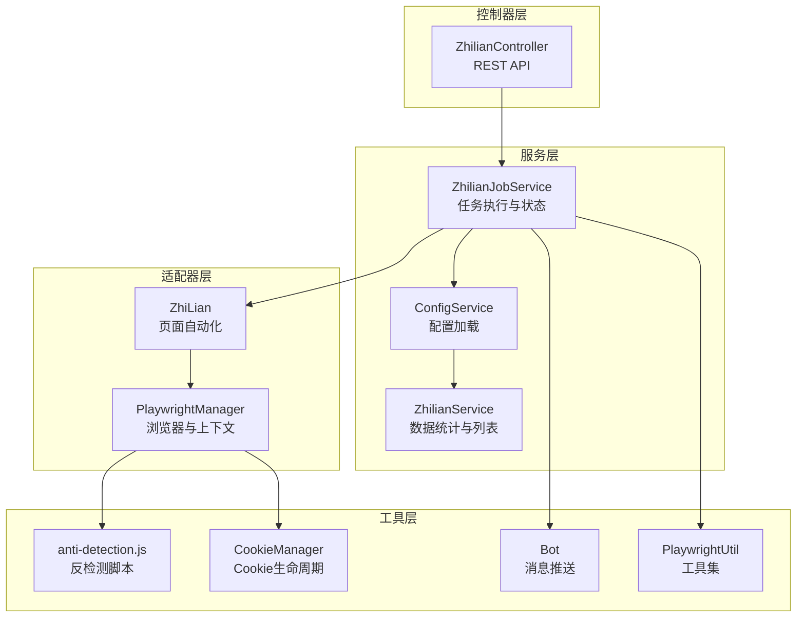
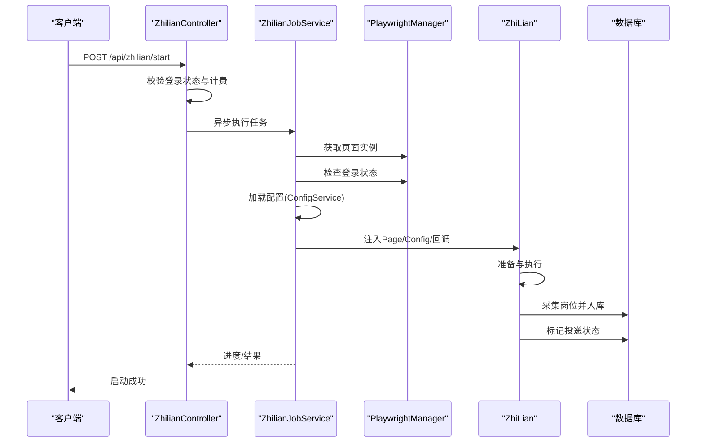
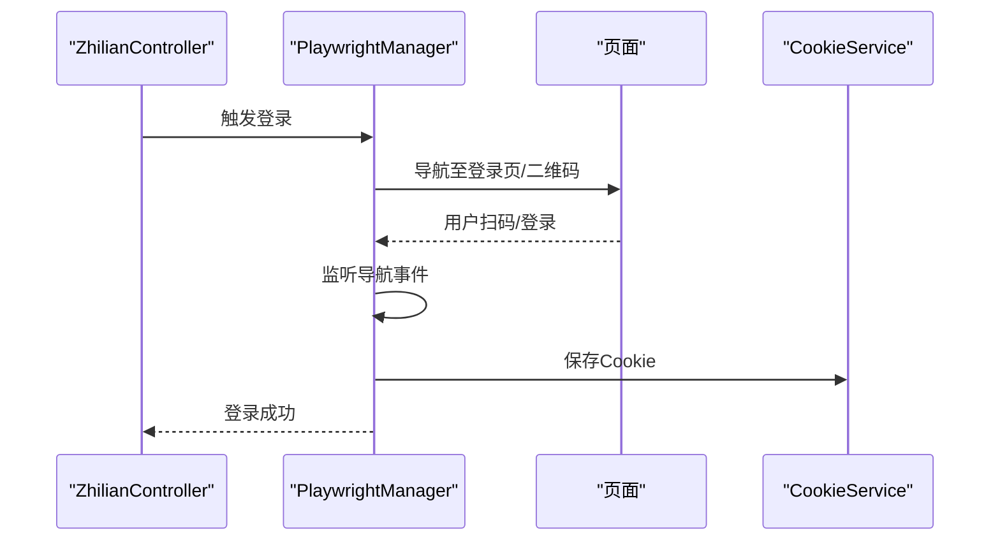
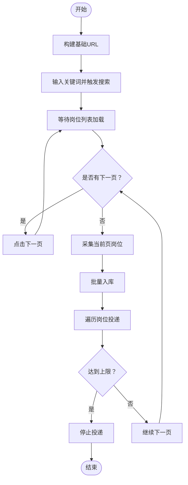
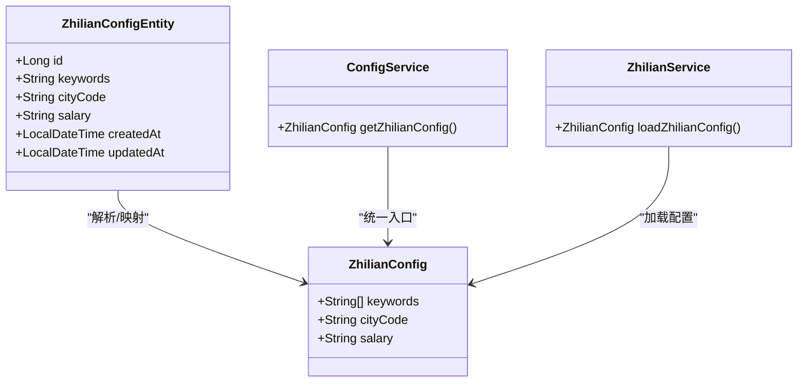
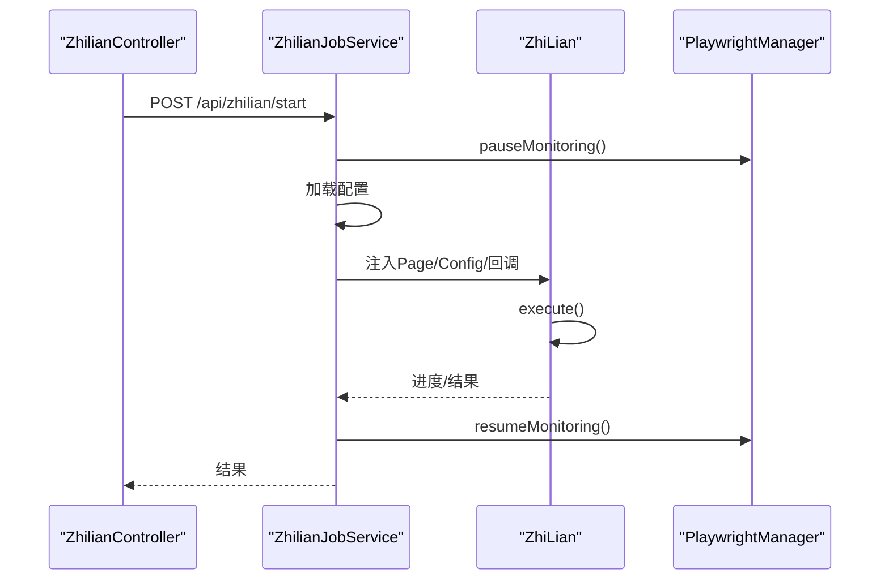
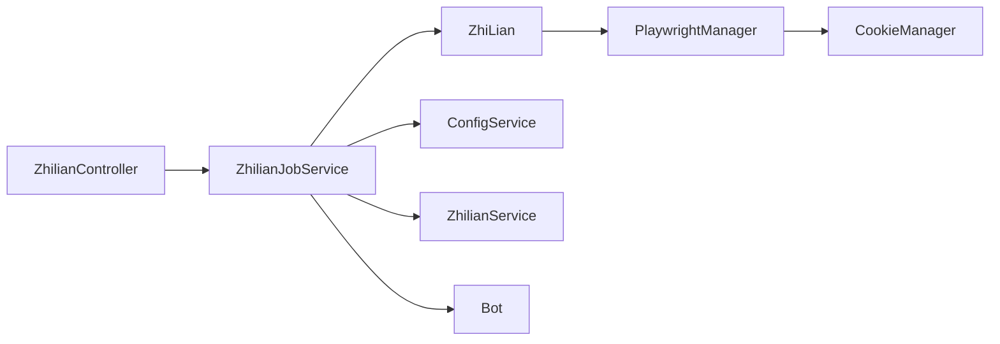

# 智联招聘适配器

<cite>
**本文引用的文件**
- [ZhiLian.java](file://backend/src/main/java/com/getjobs/worker/zhilian/ZhiLian.java)
- [ZhilianConfig.java](file://backend/src/main/java/com/getjobs/worker/zhilian/ZhilianConfig.java)
- [ZhilianJobService.java](file://backend/src/main/java/com/getjobs/worker/service/ZhilianJobService.java)
- [ZhilianController.java](file://backend/src/main/java/com/getjobs/application/controller/ZhilianController.java)
- [ZhilianConfigEntity.java](file://backend/src/main/java/com/getjobs/application/entity/ZhilianConfigEntity.java)
- [ConfigService.java](file://backend/src/main/java/com/getjobs/application/service/ConfigService.java)
- [PlaywrightManager.java](file://backend/src/main/java/com/getjobs/worker/manager/PlaywrightManager.java)
- [ZhilianService.java](file://backend/src/main/java/com/getjobs/application/service/ZhilianService.java)
- [application.yaml](file://backend/src/main/resources/application.yaml)
- [anti-detection.js](file://backend/src/main/resources/anti-detection.js)
- [PlaywrightUtil.java](file://backend/src/main/java/com/getjobs/worker/utils/PlaywrightUtil.java)
- [Bot.java](file://backend/src/main/java/com/getjobs/worker/utils/Bot.java)
- [CookieManager.java](file://backend/src/main/java/com/getjobs/worker/utils/CookieManager.java)
</cite>

## 目录
1. [简介](#简介)
2. [项目结构](#项目结构)
3. [核心组件](#核心组件)
4. [架构总览](#架构总览)
5. [详细组件分析](#详细组件分析)
6. [依赖关系分析](#依赖关系分析)
7. [性能考量](#性能考量)
8. [故障排查指南](#故障排查指南)
9. [结论](#结论)
10. [附录](#附录)

## 简介
本技术文档面向招聘平台自动化工程师与系统集成开发者，围绕智联招聘适配器展开，重点解析以下方面：
- 登录验证流程与会话持久化策略
- 页面交互处理与数据提取算法
- 配置类设计与参数校验机制
- 作业执行策略与任务管理机制
- 平台特有页面结构、JavaScript 渲染与接口调用方式
- 反检测技术、登录安全机制与会话持久化
- 实现示例、错误处理与调试技巧

## 项目结构
智联招聘适配器位于后端模块的 worker 子包中，采用“控制器-服务-适配器-工具”的分层架构：
- 控制器层：提供 REST API，负责任务启动、停止、状态查询与登录控制
- 服务层：封装任务执行、配置加载、数据统计与列表查询
- 适配器层：Playwright 驱动的页面自动化，负责登录、搜索、翻页、采集与投递
- 工具层：反检测脚本、Cookie 管理、定时推送、Playwright 工具集

图表来源
- [ZhilianController.java:1-414](file://backend/src/main/java/com/getjobs/application/controller/ZhilianController.java#L1-L414)
- [ZhilianJobService.java:1-142](file://backend/src/main/java/com/getjobs/worker/service/ZhilianJobService.java#L1-L142)
- [ConfigService.java:1-288](file://backend/src/main/java/com/getjobs/application/service/ConfigService.java#L1-L288)
- [ZhilianService.java:1-504](file://backend/src/main/java/com/getjobs/application/service/ZhilianService.java#L1-L504)
- [ZhiLian.java:1-647](file://backend/src/main/java/com/getjobs/worker/zhilian/ZhiLian.java#L1-L647)
- [PlaywrightManager.java:1-800](file://backend/src/main/java/com/getjobs/worker/manager/PlaywrightManager.java#L1-L800)
- [anti-detection.js:1-109](file://backend/src/main/resources/anti-detection.js#L1-L109)
- [CookieManager.java:1-259](file://backend/src/main/java/com/getjobs/worker/utils/CookieManager.java#L1-L259)
- [Bot.java:1-229](file://backend/src/main/java/com/getjobs/worker/utils/Bot.java#L1-L229)
- [PlaywrightUtil.java:1-610](file://backend/src/main/java/com/getjobs/worker/utils/PlaywrightUtil.java#L1-L610)

章节来源
- [ZhilianController.java:1-414](file://backend/src/main/java/com/getjobs/application/controller/ZhilianController.java#L1-L414)
- [ZhilianJobService.java:1-142](file://backend/src/main/java/com/getjobs/worker/service/ZhilianJobService.java#L1-L142)
- [ConfigService.java:1-288](file://backend/src/main/java/com/getjobs/application/service/ConfigService.java#L1-L288)
- [ZhilianService.java:1-504](file://backend/src/main/java/com/getjobs/application/service/ZhilianService.java#L1-L504)
- [ZhiLian.java:1-647](file://backend/src/main/java/com/getjobs/worker/zhilian/ZhiLian.java#L1-L647)
- [PlaywrightManager.java:1-800](file://backend/src/main/java/com/getjobs/worker/manager/PlaywrightManager.java#L1-L800)
- [anti-detection.js:1-109](file://backend/src/main/resources/anti-detection.js#L1-L109)
- [CookieManager.java:1-259](file://backend/src/main/java/com/getjobs/worker/utils/CookieManager.java#L1-L259)
- [Bot.java:1-229](file://backend/src/main/java/com/getjobs/worker/utils/Bot.java#L1-L229)
- [PlaywrightUtil.java:1-610](file://backend/src/main/java/com/getjobs/worker/utils/PlaywrightUtil.java#L1-L610)

## 核心组件
- ZhiLian：智联招聘页面自动化适配器，负责登录验证、搜索、翻页、采集与投递
- ZhilianConfig：平台配置载体，承载关键词、城市编码、薪资范围等参数
- ZhilianJobService：任务执行与状态管理，协调 PlaywrightManager、ConfigService 与 ZhiLian
- ZhilianController：对外暴露 REST API，提供配置、登录、任务启停、状态查询与数据分析
- PlaywrightManager：浏览器与上下文管理，统一注入反检测脚本，维护登录状态与 Cookie
- ZhilianService：数据层服务，负责配置解析、数据统计与列表查询
- CookieManager：Cookie 生命周期管理，提供过期预警与刷新策略
- Bot：定时聚合投递记录并通过企业微信/钉钉推送
- PlaywrightUtil：通用 Playwright 工具集（历史实现，适配器层主要使用 PlaywrightManager）

章节来源
- [ZhiLian.java:1-647](file://backend/src/main/java/com/getjobs/worker/zhilian/ZhiLian.java#L1-L647)
- [ZhilianConfig.java:1-38](file://backend/src/main/java/com/getjobs/worker/zhilian/ZhilianConfig.java#L1-L38)
- [ZhilianJobService.java:1-142](file://backend/src/main/java/com/getjobs/worker/service/ZhilianJobService.java#L1-L142)
- [ZhilianController.java:1-414](file://backend/src/main/java/com/getjobs/application/controller/ZhilianController.java#L1-L414)
- [PlaywrightManager.java:1-800](file://backend/src/main/java/com/getjobs/worker/manager/PlaywrightManager.java#L1-L800)
- [ZhilianService.java:1-504](file://backend/src/main/java/com/getjobs/application/service/ZhilianService.java#L1-L504)
- [CookieManager.java:1-259](file://backend/src/main/java/com/getjobs/worker/utils/CookieManager.java#L1-L259)
- [Bot.java:1-229](file://backend/src/main/java/com/getjobs/worker/utils/Bot.java#L1-L229)
- [PlaywrightUtil.java:1-610](file://backend/src/main/java/com/getjobs/worker/utils/PlaywrightUtil.java#L1-L610)

## 架构总览
智联招聘适配器遵循“控制器-服务-适配器-工具”的分层设计，通过 PlaywrightManager 统一管理浏览器与上下文，ZhiLian 作为适配器层执行页面自动化，ZhilianJobService 协调任务执行与状态，ZhilianController 对外提供 API。

图表来源
- [ZhilianController.java:273-336](file://backend/src/main/java/com/getjobs/application/controller/ZhilianController.java#L273-L336)
- [ZhilianJobService.java:38-104](file://backend/src/main/java/com/getjobs/worker/service/ZhilianJobService.java#L38-L104)
- [PlaywrightManager.java:1-800](file://backend/src/main/java/com/getjobs/worker/manager/PlaywrightManager.java#L1-L800)
- [ZhiLian.java:51-97](file://backend/src/main/java/com/getjobs/worker/zhilian/ZhiLian.java#L51-L97)
- [ConfigService.java:277-279](file://backend/src/main/java/com/getjobs/application/service/ConfigService.java#L277-L279)

## 详细组件分析

### 登录验证流程与会话持久化
- 登录入口：通过 PlaywrightManager 触发登录流程，并在页面中等待扫码或手动登录
- 登录状态检测：通过监听页面导航事件与特征元素判断登录状态
- 会话持久化：登录成功后保存 Cookie 至数据库，后续启动时自动注入上下文
- 反检测：在上下文层注入 anti-detection.js，降低被识别为自动化工具的概率

图表来源
- [ZhilianController.java:123-137](file://backend/src/main/java/com/getjobs/application/controller/ZhilianController.java#L123-L137)
- [PlaywrightManager.java:1-800](file://backend/src/main/java/com/getjobs/worker/manager/PlaywrightManager.java#L1-L800)
- [anti-detection.js:1-109](file://backend/src/main/resources/anti-detection.js#L1-L109)

章节来源
- [ZhilianController.java:97-168](file://backend/src/main/java/com/getjobs/application/controller/ZhilianController.java#L97-L168)
- [PlaywrightManager.java:1-800](file://backend/src/main/java/com/getjobs/worker/manager/PlaywrightManager.java#L1-L800)
- [anti-detection.js:1-109](file://backend/src/main/resources/anti-detection.js#L1-L109)

### 页面交互处理与数据提取算法
- 搜索与翻页：构建基础 URL，输入关键词并触发 Enter，等待岗位列表加载，通过“下一页”按钮状态判断是否继续
- 数据采集：定位岗位卡片，提取标题、链接、薪资、地点、经验、学历、公司名等字段，统一入库
- 投递流程：监听新窗口打开，统一关闭弹窗，处理相似职位推荐，标记投递状态
- 反馈与限流：检测“达到上限”提示，及时终止后续投递

图表来源
- [ZhiLian.java:102-191](file://backend/src/main/java/com/getjobs/worker/zhilian/ZhiLian.java#L102-L191)
- [ZhiLian.java:197-351](file://backend/src/main/java/com/getjobs/worker/zhilian/ZhiLian.java#L197-L351)
- [ZhiLian.java:474-490](file://backend/src/main/java/com/getjobs/worker/zhilian/ZhiLian.java#L474-L490)

章节来源
- [ZhiLian.java:102-191](file://backend/src/main/java/com/getjobs/worker/zhilian/ZhiLian.java#L102-L191)
- [ZhiLian.java:197-351](file://backend/src/main/java/com/getjobs/worker/zhilian/ZhiLian.java#L197-L351)
- [ZhiLian.java:474-490](file://backend/src/main/java/com/getjobs/worker/zhilian/ZhiLian.java#L474-L490)

### 配置类设计与参数校验机制
- ZhilianConfig：承载关键词、城市编码、薪资范围
- ConfigService：从 zhilian_config 专表读取并解析，支持关键词列表、城市编码映射、薪资代码转换
- ZhilianService：提供解析与映射能力，缺失或非法值回退为默认值

图表来源
- [ZhilianConfig.java:1-38](file://backend/src/main/java/com/getjobs/worker/zhilian/ZhilianConfig.java#L1-L38)
- [ZhilianConfigEntity.java:1-31](file://backend/src/main/java/com/getjobs/application/entity/ZhilianConfigEntity.java#L1-L31)
- [ConfigService.java:277-279](file://backend/src/main/java/com/getjobs/application/service/ConfigService.java#L277-L279)
- [ZhilianService.java:86-124](file://backend/src/main/java/com/getjobs/application/service/ZhilianService.java#L86-L124)

章节来源
- [ZhilianConfig.java:1-38](file://backend/src/main/java/com/getjobs/worker/zhilian/ZhilianConfig.java#L1-L38)
- [ZhilianConfigEntity.java:1-31](file://backend/src/main/java/com/getjobs/application/entity/ZhilianConfigEntity.java#L1-L31)
- [ConfigService.java:277-279](file://backend/src/main/java/com/getjobs/application/service/ConfigService.java#L277-L279)
- [ZhilianService.java:86-124](file://backend/src/main/java/com/getjobs/application/service/ZhilianService.java#L86-L124)

### 作业执行策略与任务管理机制
- 任务状态：isRunning、shouldStop 标志位控制并发与停止
- 并发保护：暂停对应平台的后台登录监控，避免与任务执行并发访问同一 Page
- 进度回调：将任务进度通过回调传递给控制器，支持分页进度与总体信息
- 停止机制：外部调用 stopDelivery 触发 shouldStop 标志，适配器在关键节点检查并优雅退出

图表来源
- [ZhilianController.java:273-336](file://backend/src/main/java/com/getjobs/application/controller/ZhilianController.java#L273-L336)
- [ZhilianJobService.java:38-104](file://backend/src/main/java/com/getjobs/worker/service/ZhilianJobService.java#L38-L104)
- [PlaywrightManager.java:1-800](file://backend/src/main/java/com/getjobs/worker/manager/PlaywrightManager.java#L1-L800)

章节来源
- [ZhilianJobService.java:38-104](file://backend/src/main/java/com/getjobs/worker/service/ZhilianJobService.java#L38-L104)
- [ZhilianController.java:273-336](file://backend/src/main/java/com/getjobs/application/controller/ZhilianController.java#L273-L336)
- [PlaywrightManager.java:1-800](file://backend/src/main/java/com/getjobs/worker/manager/PlaywrightManager.java#L1-L800)

### 平台特有页面结构、JavaScript 渲染与接口调用
- 页面结构：智联招聘采用 React/Vue 类前端框架，岗位列表通过动态渲染，需等待 DOM 与网络空闲
- 选择器策略：采用多候选选择器提升鲁棒性，如搜索框、下一页按钮、岗位卡片等
- 翻页策略：以“下一页”按钮禁用状态为主，最多翻 50 页，避免死循环
- 弹窗处理：监听新窗口打开，统一关闭投递弹窗，避免影响后续流程

章节来源
- [ZhiLian.java:132-185](file://backend/src/main/java/com/getjobs/worker/zhilian/ZhiLian.java#L132-L185)
- [ZhiLian.java:298-332](file://backend/src/main/java/com/getjobs/worker/zhilian/ZhiLian.java#L298-L332)
- [ZhiLian.java:514-531](file://backend/src/main/java/com/getjobs/worker/zhilian/ZhiLian.java#L514-L531)

### 反检测技术、登录安全机制与会话持久化
- 反检测脚本：在上下文层注入 anti-detection.js，劫持 Function.prototype.toString，伪装函数源码，降低检测概率
- 登录安全：通过 PlaywrightManager 的登录监控与 Cookie 管理，确保登录状态稳定与会话持久化
- Cookie 生命周期：CookieManager 记录保存时间，提供“即将过期/已过期”检测与刷新策略

章节来源
- [anti-detection.js:1-109](file://backend/src/main/resources/anti-detection.js#L1-L109)
- [PlaywrightManager.java:1-800](file://backend/src/main/java/com/getjobs/worker/manager/PlaywrightManager.java#L1-L800)
- [CookieManager.java:1-259](file://backend/src/main/java/com/getjobs/worker/utils/CookieManager.java#L1-L259)

## 依赖关系分析
- 控制器依赖服务层，服务层依赖适配器与工具层
- 适配器依赖 PlaywrightManager 与配置服务
- Cookie 管理贯穿登录与会话持久化
- 数据统计与列表查询依赖数据库实体与 Mapper

图表来源
- [ZhilianController.java:1-414](file://backend/src/main/java/com/getjobs/application/controller/ZhilianController.java#L1-L414)
- [ZhilianJobService.java:1-142](file://backend/src/main/java/com/getjobs/worker/service/ZhilianJobService.java#L1-L142)
- [ZhiLian.java:1-647](file://backend/src/main/java/com/getjobs/worker/zhilian/ZhiLian.java#L1-L647)
- [PlaywrightManager.java:1-800](file://backend/src/main/java/com/getjobs/worker/manager/PlaywrightManager.java#L1-L800)
- [CookieManager.java:1-259](file://backend/src/main/java/com/getjobs/worker/utils/CookieManager.java#L1-L259)
- [ZhilianService.java:1-504](file://backend/src/main/java/com/getjobs/application/service/ZhilianService.java#L1-L504)
- [Bot.java:1-229](file://backend/src/main/java/com/getjobs/worker/utils/Bot.java#L1-L229)

章节来源
- [ZhilianController.java:1-414](file://backend/src/main/java/com/getjobs/application/controller/ZhilianController.java#L1-L414)
- [ZhilianJobService.java:1-142](file://backend/src/main/java/com/getjobs/worker/service/ZhilianJobService.java#L1-L142)
- [ZhiLian.java:1-647](file://backend/src/main/java/com/getjobs/worker/zhilian/ZhiLian.java#L1-L647)
- [PlaywrightManager.java:1-800](file://backend/src/main/java/com/getjobs/worker/manager/PlaywrightManager.java#L1-L800)
- [CookieManager.java:1-259](file://backend/src/main/java/com/getjobs/worker/utils/CookieManager.java#L1-L259)
- [ZhilianService.java:1-504](file://backend/src/main/java/com/getjobs/application/service/ZhilianService.java#L1-L504)
- [Bot.java:1-229](file://backend/src/main/java/com/getjobs/worker/utils/Bot.java#L1-L229)

## 性能考量
- 导航超时与慢动作：application.yaml 中配置了平台差异化导航超时与慢动作参数，平衡稳定性与性能
- 资源拦截：可选开启资源拦截以降低内存占用
- 翻页上限：限制最大翻页数，避免无效请求
- 批量入库：统一采集后再批量入库，减少数据库压力

章节来源
- [application.yaml:70-101](file://backend/src/main/resources/application.yaml#L70-L101)
- [ZhiLian.java:266-276](file://backend/src/main/java/com/getjobs/worker/zhilian/ZhiLian.java#L266-L276)

## 故障排查指南
- 页面元素找不到：检查选择器候选与等待策略，确认页面已渲染
- 投递弹窗未关闭：确保监听器正确注册与注销，避免竞态
- 登录状态异常：检查 PlaywrightManager 的登录监控与 Cookie 注入
- 采集数据为空：确认关键词、城市编码与薪资范围解析是否正确
- 限流与上限：关注“达到上限”提示，及时终止投递

章节来源
- [ZhiLian.java:116-129](file://backend/src/main/java/com/getjobs/worker/zhilian/ZhiLian.java#L116-L129)
- [ZhiLian.java:298-332](file://backend/src/main/java/com/getjobs/worker/zhilian/ZhiLian.java#L298-L332)
- [PlaywrightManager.java:1-800](file://backend/src/main/java/com/getjobs/worker/manager/PlaywrightManager.java#L1-L800)
- [ZhilianService.java:86-124](file://backend/src/main/java/com/getjobs/application/service/ZhilianService.java#L86-L124)

## 结论
智联招聘适配器通过清晰的分层设计与完善的工具链，实现了稳定的登录验证、页面交互与数据采集。结合反检测脚本、Cookie 生命周期管理与任务状态控制，能够在复杂页面结构与 JavaScript 渲染环境下高效、安全地完成投递任务。建议在生产环境中配合严格的配置校验、日志监控与异常处理，持续优化性能与稳定性。

## 附录
- 实现示例路径：见各组件方法与回调调用位置
- 错误处理：适配器层广泛使用 try-catch 与 warn/error 日志，保存页面 HTML 以便排查
- 调试技巧：利用 PlaywrightManager 的调试端口与截图功能，结合 anti-detection.js 降低检测风险

章节来源
- [ZhiLian.java:343-349](file://backend/src/main/java/com/getjobs/worker/zhilian/ZhiLian.java#L343-L349)
- [application.yaml:70-101](file://backend/src/main/resources/application.yaml#L70-L101)
- [anti-detection.js:1-109](file://backend/src/main/resources/anti-detection.js#L1-L109)