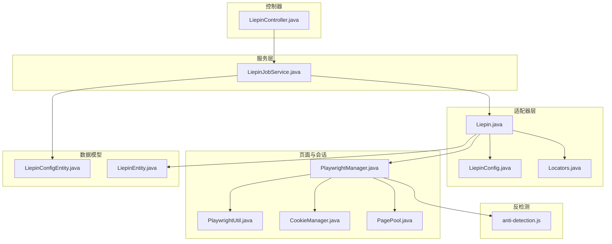
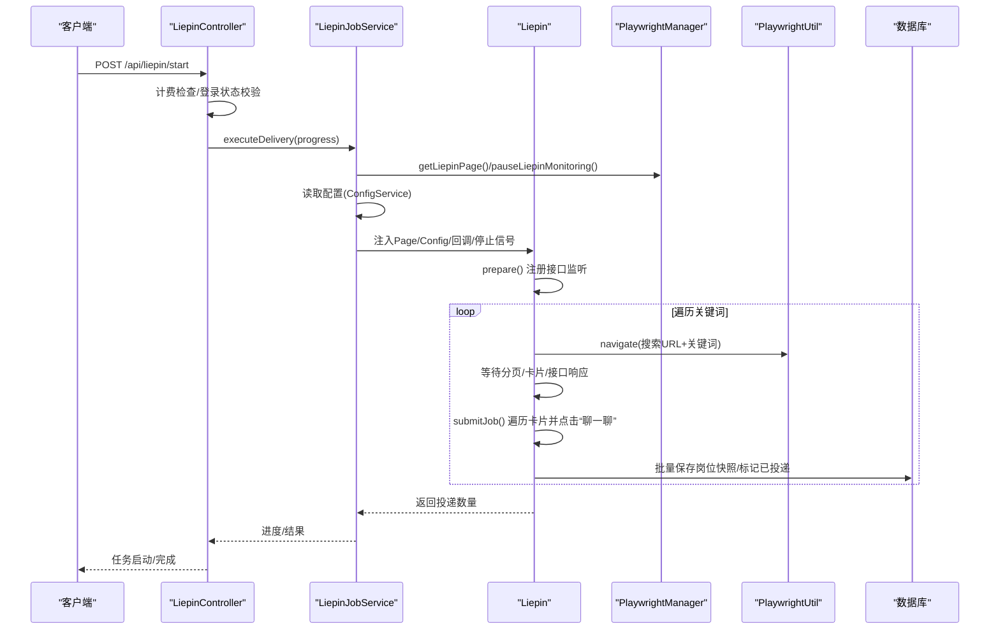
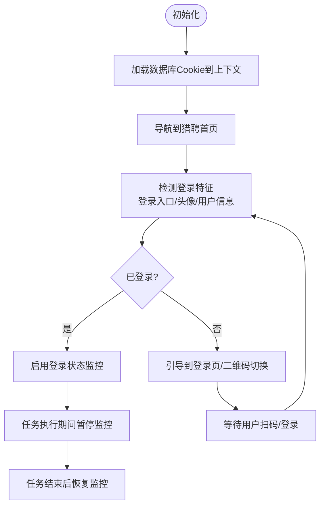
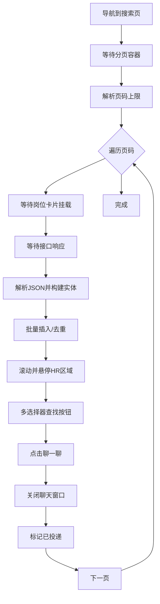
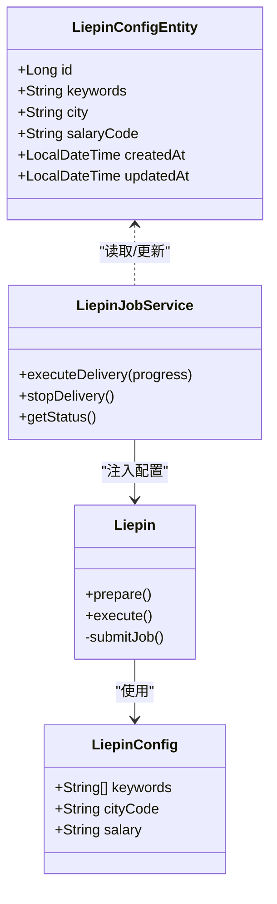
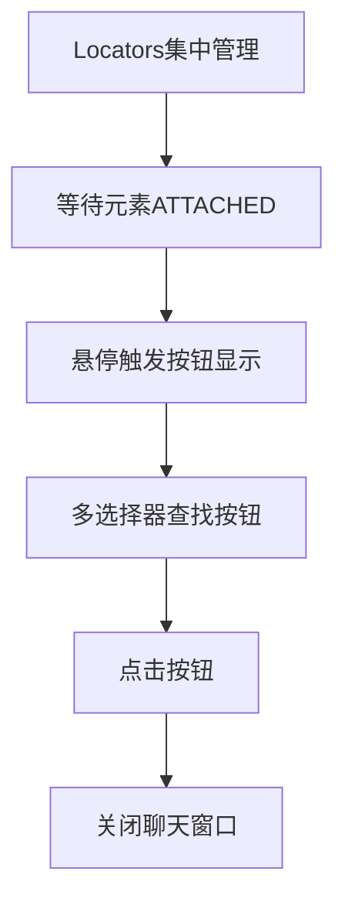
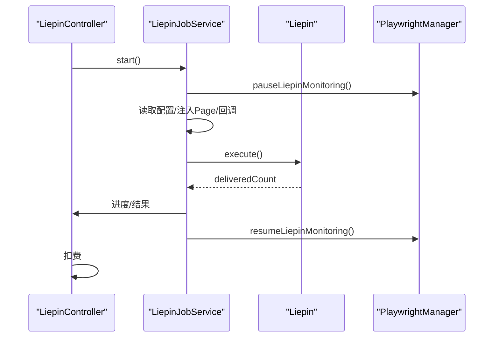
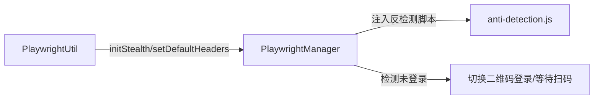
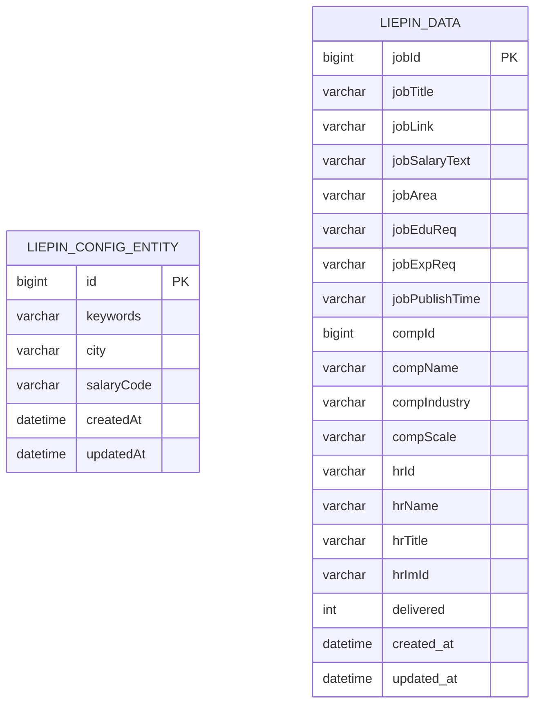
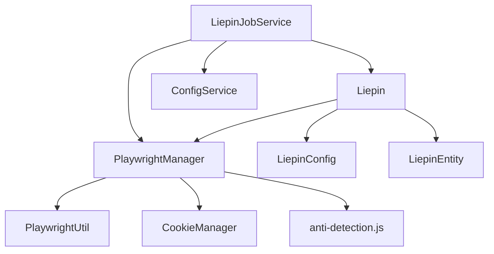

# 猎聘适配器

<cite>
**本文引用的文件**
- [Liepin.java](file://backend/src/main/java/com/getjobs/worker/liepin/Liepin.java)
- [LiepinConfig.java](file://backend/src/main/java/com/getjobs/worker/liepin/LiepinConfig.java)
- [Locators.java](file://backend/src/main/java/com/getjobs/worker/liepin/Locators.java)
- [LiepinJobService.java](file://backend/src/main/java/com/getjobs/worker/service/LiepinJobService.java)
- [PlaywrightManager.java](file://backend/src/main/java/com/getjobs/worker/manager/PlaywrightManager.java)
- [PlaywrightUtil.java](file://backend/src/main/java/com/getjobs/worker/utils/PlaywrightUtil.java)
- [LiepinController.java](file://backend/src/main/java/com/getjobs/application/controller/LiepinController.java)
- [LiepinConfigEntity.java](file://backend/src/main/java/com/getjobs/application/entity/LiepinConfigEntity.java)
- [LiepinEntity.java](file://backend/src/main/java/com/getjobs/application/entity/LiepinEntity.java)
- [CookieManager.java](file://backend/src/main/java/com/getjobs/worker/utils/CookieManager.java)
- [PagePool.java](file://backend/src/main/java/com/getjobs/worker/utils/PagePool.java)
- [anti-detection.js](file://backend/src/main/resources/anti-detection.js)
</cite>

## 目录
1. [简介](#简介)
2. [项目结构](#项目结构)
3. [核心组件](#核心组件)
4. [架构总览](#架构总览)
5. [详细组件分析](#详细组件分析)
6. [依赖关系分析](#依赖关系分析)
7. [性能考量](#性能考量)
8. [故障排查指南](#故障排查指南)
9. [结论](#结论)
10. [附录](#附录)

## 简介
本文件面向平台自动化开发人员，系统性梳理猎聘平台适配器的实现，覆盖企业版登录流程、页面导航逻辑、数据抓取策略、配置类设计、元素定位策略、作业执行与队列管理、安全防护绕过、验证码处理与会话管理等关键主题。文档以代码级分析为基础，辅以图示帮助理解整体流程与关键路径。

## 项目结构
猎聘适配器位于 worker/liepin 包中，配合通用的 Playwright 管理器、工具类与服务层共同工作：
- 适配器核心：Liepin、LiepinConfig、Locators
- 作业调度：LiepinJobService
- 页面与会话：PlaywrightManager、PlaywrightUtil
- 控制器：LiepinController（对外提供登录状态、启动/停止任务、配置与统计查询等）
- 数据模型：LiepinConfigEntity、LiepinEntity
- 会话与反检测：CookieManager、anti-detection.js、PagePool

**图表来源**
- [Liepin.java:1-634](file://backend/src/main/java/com/getjobs/worker/liepin/Liepin.java#L1-L634)
- [LiepinJobService.java:1-141](file://backend/src/main/java/com/getjobs/worker/service/LiepinJobService.java#L1-L141)
- [PlaywrightManager.java:1-800](file://backend/src/main/java/com/getjobs/worker/manager/PlaywrightManager.java#L1-L800)
- [PlaywrightUtil.java:1-610](file://backend/src/main/java/com/getjobs/worker/utils/PlaywrightUtil.java#L1-L610)
- [CookieManager.java:1-259](file://backend/src/main/java/com/getjobs/worker/utils/CookieManager.java#L1-L259)
- [PagePool.java:1-278](file://backend/src/main/java/com/getjobs/worker/utils/PagePool.java#L1-L278)
- [LiepinController.java:1-369](file://backend/src/main/java/com/getjobs/application/controller/LiepinController.java#L1-L369)
- [LiepinConfigEntity.java:1-32](file://backend/src/main/java/com/getjobs/application/entity/LiepinConfigEntity.java#L1-L32)
- [LiepinEntity.java:1-81](file://backend/src/main/java/com/getjobs/application/entity/LiepinEntity.java#L1-L81)
- [anti-detection.js:1-109](file://backend/src/main/resources/anti-detection.js#L1-L109)

**章节来源**
- [Liepin.java:1-634](file://backend/src/main/java/com/getjobs/worker/liepin/Liepin.java#L1-L634)
- [LiepinJobService.java:1-141](file://backend/src/main/java/com/getjobs/worker/service/LiepinJobService.java#L1-L141)
- [PlaywrightManager.java:1-800](file://backend/src/main/java/com/getjobs/worker/manager/PlaywrightManager.java#L1-L800)

## 核心组件
- Liepin：负责企业版登录后的搜索、翻页、岗位卡片解析、按钮识别与点击、聊天窗口关闭、数据落库与投递状态标记。
- LiepinConfig：平台特定配置载体，包含关键词、城市编码、薪资范围等。
- Locators：集中管理页面元素定位表达式，保证定位策略的一致性与可维护性。
- LiepinJobService：作业执行入口，负责任务生命周期管理、进度回调、并发控制与状态查询。
- PlaywrightManager：多平台共享上下文与页面管理，负责登录状态监控、Cookie注入与反检测脚本注入。
- PlaywrightUtil：通用浏览器自动化工具集，含反检测增强、Cookie读写、页面截图、元素操作等。
- CookieManager：Cookie 生命周期管理，支持过期检测与刷新提示。
- PagePool：Page 资源池观测与统计，便于资源使用情况监控。
- LiepinController：对外提供 REST API，包括登录状态检查、启动/停止任务、配置读写、统计查询与 Cookie 调试接口。
- 数据模型：LiepinConfigEntity、LiepinEntity，支撑配置持久化与岗位数据快照。

**章节来源**
- [Liepin.java:1-634](file://backend/src/main/java/com/getjobs/worker/liepin/Liepin.java#L1-L634)
- [LiepinConfig.java:1-29](file://backend/src/main/java/com/getjobs/worker/liepin/LiepinConfig.java#L1-L29)
- [Locators.java:1-20](file://backend/src/main/java/com/getjobs/worker/liepin/Locators.java#L1-L20)
- [LiepinJobService.java:1-141](file://backend/src/main/java/com/getjobs/worker/service/LiepinJobService.java#L1-L141)
- [PlaywrightManager.java:1-800](file://backend/src/main/java/com/getjobs/worker/manager/PlaywrightManager.java#L1-L800)
- [PlaywrightUtil.java:1-610](file://backend/src/main/java/com/getjobs/worker/utils/PlaywrightUtil.java#L1-L610)
- [CookieManager.java:1-259](file://backend/src/main/java/com/getjobs/worker/utils/CookieManager.java#L1-L259)
- [PagePool.java:1-278](file://backend/src/main/java/com/getjobs/worker/utils/PagePool.java#L1-L278)
- [LiepinController.java:1-369](file://backend/src/main/java/com/getjobs/application/controller/LiepinController.java#L1-L369)
- [LiepinConfigEntity.java:1-32](file://backend/src/main/java/com/getjobs/application/entity/LiepinConfigEntity.java#L1-L32)
- [LiepinEntity.java:1-81](file://backend/src/main/java/com/getjobs/application/entity/LiepinEntity.java#L1-L81)

## 架构总览
猎聘适配器采用“控制器-服务-适配器-页面管理”的分层架构。控制器接收外部请求，服务层协调适配器与页面管理器，适配器通过 Playwright 完成页面交互与数据抓取，并将结果持久化。

**图表来源**
- [LiepinController.java:74-137](file://backend/src/main/java/com/getjobs/application/controller/LiepinController.java#L74-L137)
- [LiepinJobService.java:40-101](file://backend/src/main/java/com/getjobs/worker/service/LiepinJobService.java#L40-L101)
- [Liepin.java:105-130](file://backend/src/main/java/com/getjobs/worker/liepin/Liepin.java#L105-L130)
- [PlaywrightManager.java:392-465](file://backend/src/main/java/com/getjobs/worker/manager/PlaywrightManager.java#L392-L465)
- [PlaywrightUtil.java:126-129](file://backend/src/main/java/com/getjobs/worker/utils/PlaywrightUtil.java#L126-L129)

## 详细组件分析

### 企业版登录流程与会话管理
- 登录状态检测：PlaywrightManager 在初始化时加载数据库中的 Cookie 并导航至猎聘首页，随后通过特征元素检测登录状态（如“登录/注册”入口、用户头像等），并在 URL 变化时持续监控。
- 登录状态监控：启用 onFrameNavigated 监听，避免并发访问同一页面导致的竞态；在任务执行期间暂停后台监控，执行完毕恢复。
- 会话管理：支持手动退出登录（清空数据库 Cookie 与上下文 Cookie）、主动保存 Cookie 到数据库、Cookie 生命周期管理与即将过期提醒。

**图表来源**
- [PlaywrightManager.java:392-465](file://backend/src/main/java/com/getjobs/worker/manager/PlaywrightManager.java#L392-L465)
- [PlaywrightManager.java:568-579](file://backend/src/main/java/com/getjobs/worker/manager/PlaywrightManager.java#L568-L579)
- [PlaywrightManager.java:78-83](file://backend/src/main/java/com/getjobs/worker/manager/PlaywrightManager.java#L78-L83)
- [LiepinController.java:323-349](file://backend/src/main/java/com/getjobs/application/controller/LiepinController.java#L323-L349)

**章节来源**
- [PlaywrightManager.java:392-465](file://backend/src/main/java/com/getjobs/worker/manager/PlaywrightManager.java#L392-L465)
- [PlaywrightManager.java:568-579](file://backend/src/main/java/com/getjobs/worker/manager/PlaywrightManager.java#L568-L579)
- [PlaywrightManager.java:78-83](file://backend/src/main/java/com/getjobs/worker/manager/PlaywrightManager.java#L78-L83)
- [LiepinController.java:323-349](file://backend/src/main/java/com/getjobs/application/controller/LiepinController.java#L323-L349)

### 页面导航逻辑与数据抓取策略
- 搜索页导航：根据配置拼接搜索 URL（城市编码、薪资、currentPage），支持清洗关键词并导航。
- 翻页与分页：等待分页容器加载，解析页码上限；点击下一页按钮，兼容 Ant Design v5 结构。
- 岗位卡片解析：等待卡片挂载（ATTACHED 状态），额外等待接口响应，解析 JSON 数据，构建实体并批量落库。
- 投递流程：滚动到卡片位置，悬停触发按钮显示，多选择器尝试定位“聊一聊”按钮，点击后关闭聊天窗口，记录投递并标记 delivered。

**图表来源**
- [Liepin.java:230-296](file://backend/src/main/java/com/getjobs/worker/liepin/Liepin.java#L230-L296)
- [Liepin.java:255-271](file://backend/src/main/java/com/getjobs/worker/liepin/Liepin.java#L255-L271)
- [Liepin.java:133-188](file://backend/src/main/java/com/getjobs/worker/liepin/Liepin.java#L133-L188)
- [Liepin.java:327-598](file://backend/src/main/java/com/getjobs/worker/liepin/Liepin.java#L327-L598)

**章节来源**
- [Liepin.java:230-296](file://backend/src/main/java/com/getjobs/worker/liepin/Liepin.java#L230-L296)
- [Liepin.java:255-271](file://backend/src/main/java/com/getjobs/worker/liepin/Liepin.java#L255-L271)
- [Liepin.java:133-188](file://backend/src/main/java/com/getjobs/worker/liepin/Liepin.java#L133-L188)
- [Liepin.java:327-598](file://backend/src/main/java/com/getjobs/worker/liepin/Liepin.java#L327-L598)

### 配置类设计与验证机制
- LiepinConfig：包含关键词列表、城市编码、薪资范围，作为适配器执行的输入参数。
- 配置持久化：LiepinConfigEntity 提供数据库映射，支持城市名称标准化、保存/更新首条记录等。
- 配置加载：LiepinJobService 通过 ConfigService 读取配置，统一注入到适配器。

**图表来源**
- [LiepinConfig.java:11-28](file://backend/src/main/java/com/getjobs/worker/liepin/LiepinConfig.java#L11-L28)
- [LiepinConfigEntity.java:10-31](file://backend/src/main/java/com/getjobs/application/entity/LiepinConfigEntity.java#L10-L31)
- [LiepinJobService.java:64-85](file://backend/src/main/java/com/getjobs/worker/service/LiepinJobService.java#L64-L85)
- [Liepin.java:64-103](file://backend/src/main/java/com/getjobs/worker/liepin/Liepin.java#L64-L103)

**章节来源**
- [LiepinConfig.java:11-28](file://backend/src/main/java/com/getjobs/worker/liepin/LiepinConfig.java#L11-L28)
- [LiepinConfigEntity.java:10-31](file://backend/src/main/java/com/getjobs/application/entity/LiepinConfigEntity.java#L10-L31)
- [LiepinJobService.java:64-85](file://backend/src/main/java/com/getjobs/worker/service/LiepinJobService.java#L64-L85)
- [Liepin.java:64-103](file://backend/src/main/java/com/getjobs/worker/liepin/Liepin.java#L64-L103)

### 元素定位策略与动态内容处理
- 定位集中化：Locators 统一维护分页、卡片、聊天窗口等关键选择器，便于维护与扩展。
- 动态内容处理：等待 ATTACHED 状态确保卡片挂载；通过接口响应驱动数据刷新；多选择器策略提升按钮识别成功率。
- 悬停与滚动：优先使用 JavaScript 滚动到可视区域，必要时回退到页面滚动；悬停失败时重试并继续查找按钮。

**图表来源**
- [Locators.java:7-20](file://backend/src/main/java/com/getjobs/worker/liepin/Locators.java#L7-L20)
- [Liepin.java:255-261](file://backend/src/main/java/com/getjobs/worker/liepin/Liepin.java#L255-L261)
- [Liepin.java:405-438](file://backend/src/main/java/com/getjobs/worker/liepin/Liepin.java#L405-L438)
- [Liepin.java:450-506](file://backend/src/main/java/com/getjobs/worker/liepin/Liepin.java#L450-L506)

**章节来源**
- [Locators.java:7-20](file://backend/src/main/java/com/getjobs/worker/liepin/Locators.java#L7-L20)
- [Liepin.java:255-261](file://backend/src/main/java/com/getjobs/worker/liepin/Liepin.java#L255-L261)
- [Liepin.java:405-438](file://backend/src/main/java/com/getjobs/worker/liepin/Liepin.java#L405-L438)
- [Liepin.java:450-506](file://backend/src/main/java/com/getjobs/worker/liepin/Liepin.java#L450-L506)

### 作业执行机制与任务队列管理
- 任务生命周期：LiepinJobService 负责任务启动、停止、状态查询；通过 volatile 标志控制运行状态与停止信号。
- 并发控制：任务运行中暂停后台监控，避免并发访问冲突；任务结束后恢复监控。
- 进度回调：通过 ProgressCallback 将进度信息上报给控制器，支持分页进度与总体信息。
- 计费与扣费：控制器在任务完成后按实际投递数量进行扣费。

**图表来源**
- [LiepinJobService.java:40-101](file://backend/src/main/java/com/getjobs/worker/service/LiepinJobService.java#L40-L101)
- [LiepinController.java:108-121](file://backend/src/main/java/com/getjobs/application/controller/LiepinController.java#L108-L121)

**章节来源**
- [LiepinJobService.java:40-101](file://backend/src/main/java/com/getjobs/worker/service/LiepinJobService.java#L40-L101)
- [LiepinController.java:108-121](file://backend/src/main/java/com/getjobs/application/controller/LiepinController.java#L108-L121)

### 安全防护绕过与验证码处理
- 反检测脚本：PlaywrightManager 在上下文层注入 anti-detection.js，Boss 平台亦注入对应脚本，降低被检测为自动化工具的概率。
- Stealth 模式：PlaywrightUtil 提供 initStealth 与 setDefaultHeaders，设置合理的请求头与 HTTP 头，隐藏自动化痕迹。
- 登录引导：当检测到未登录时，自动导航到登录页并尝试切换二维码登录，等待用户扫码。

**图表来源**
- [PlaywrightManager.java:226-237](file://backend/src/main/java/com/getjobs/worker/manager/PlaywrightManager.java#L226-L237)
- [PlaywrightManager.java:392-465](file://backend/src/main/java/com/getjobs/worker/manager/PlaywrightManager.java#L392-L465)
- [PlaywrightUtil.java:425-487](file://backend/src/main/java/com/getjobs/worker/utils/PlaywrightUtil.java#L425-L487)
- [anti-detection.js:1-109](file://backend/src/main/resources/anti-detection.js#L1-L109)

**章节来源**
- [PlaywrightManager.java:226-237](file://backend/src/main/java/com/getjobs/worker/manager/PlaywrightManager.java#L226-L237)
- [PlaywrightManager.java:392-465](file://backend/src/main/java/com/getjobs/worker/manager/PlaywrightManager.java#L392-L465)
- [PlaywrightUtil.java:425-487](file://backend/src/main/java/com/getjobs/worker/utils/PlaywrightUtil.java#L425-L487)
- [anti-detection.js:1-109](file://backend/src/main/resources/anti-detection.js#L1-L109)

### 数据模型与持久化
- 岗位快照：LiepinEntity 记录岗位、公司、HR 关键字段与投递状态，支持按 jobId 去重插入。
- 配置实体：LiepinConfigEntity 支持关键词、城市、薪资代码等配置持久化。
- 批量落库：适配器解析接口 JSON 后，批量插入快照并标记 delivered。

**图表来源**
- [LiepinConfigEntity.java:10-31](file://backend/src/main/java/com/getjobs/application/entity/LiepinConfigEntity.java#L10-L31)
- [LiepinEntity.java:14-81](file://backend/src/main/java/com/getjobs/application/entity/LiepinEntity.java#L14-L81)

**章节来源**
- [LiepinEntity.java:14-81](file://backend/src/main/java/com/getjobs/application/entity/LiepinEntity.java#L14-L81)
- [LiepinConfigEntity.java:10-31](file://backend/src/main/java/com/getjobs/application/entity/LiepinConfigEntity.java#L10-L31)

## 依赖关系分析
- 组件耦合：Liepin 依赖 PlaywrightManager 获取 Page，依赖 Config 与回调；LiepinJobService 依赖 PlaywrightManager 与 ConfigService。
- 外部依赖：Playwright、浏览器上下文、数据库（Cookie 与岗位数据）。
- 反检测：通过注入脚本与设置请求头降低被检测概率。

**图表来源**
- [Liepin.java:54-59](file://backend/src/main/java/com/getjobs/worker/liepin/Liepin.java#L54-L59)
- [LiepinJobService.java:29-31](file://backend/src/main/java/com/getjobs/worker/service/LiepinJobService.java#L29-L31)
- [PlaywrightManager.java:108-109](file://backend/src/main/java/com/getjobs/worker/manager/PlaywrightManager.java#L108-L109)

**章节来源**
- [Liepin.java:54-59](file://backend/src/main/java/com/getjobs/worker/liepin/Liepin.java#L54-L59)
- [LiepinJobService.java:29-31](file://backend/src/main/java/com/getjobs/worker/service/LiepinJobService.java#L29-L31)
- [PlaywrightManager.java:108-109](file://backend/src/main/java/com/getjobs/worker/manager/PlaywrightManager.java#L108-L109)

## 性能考量
- 超时与等待：合理设置导航与元素等待超时，避免长时间阻塞；使用 ATTACHED 状态减少遮挡导致的超时。
- 滚动与悬停：优先使用 JavaScript 滚动到可视区域，必要时重试；悬停失败时继续查找按钮，减少不必要的等待。
- 批量落库：解析接口 JSON 后批量插入，降低数据库压力。
- 资源管理：PagePool 观测 Page 使用情况，便于监控资源占用；CookieManager 提供生命周期管理，避免频繁登录。
- 反检测：启用 Stealth 模式与反检测脚本，减少被拦截概率，提高稳定性。

[本节为通用指导，不直接分析具体文件]

## 故障排查指南
- 登录状态异常
  - 确认数据库 Cookie 是否正确注入；检查登录状态监控是否被暂停；尝试手动保存 Cookie。
  - 参考：[PlaywrightManager.java:392-465](file://backend/src/main/java/com/getjobs/worker/manager/PlaywrightManager.java#L392-L465)、[LiepinController.java:292-318](file://backend/src/main/java/com/getjobs/application/controller/LiepinController.java#L292-L318)
- 页面元素定位失败
  - 检查 Locators 中的选择器是否与页面结构一致；确认等待策略（ATTACHED/可见）是否合适。
  - 参考：[Locators.java:7-20](file://backend/src/main/java/com/getjobs/worker/liepin/Locators.java#L7-L20)、[Liepin.java:255-261](file://backend/src/main/java/com/getjobs/worker/liepin/Liepin.java#L255-L261)
- 投递按钮识别困难
  - 多选择器策略与按钮文本匹配；必要时回退到整个卡片区域；检查悬停与滚动策略。
  - 参考：[Liepin.java:450-506](file://backend/src/main/java/com/getjobs/worker/liepin/Liepin.java#L450-L506)、[Liepin.java:405-438](file://backend/src/main/java/com/getjobs/worker/liepin/Liepin.java#L405-L438)
- 任务卡死或超时
  - 检查任务是否被暂停监控；确认停止信号是否正确传递；查看 PagePool 统计。
  - 参考：[LiepinJobService.java:104-111](file://backend/src/main/java/com/getjobs/worker/service/LiepinJobService.java#L104-L111)、[PagePool.java:116-134](file://backend/src/main/java/com/getjobs/worker/utils/PagePool.java#L116-L134)
- 反检测失效
  - 确认 anti-detection.js 已注入；检查 Stealth 模式初始化；核对请求头设置。
  - 参考：[PlaywrightManager.java:226-237](file://backend/src/main/java/com/getjobs/worker/manager/PlaywrightManager.java#L226-L237)、[PlaywrightUtil.java:425-487](file://backend/src/main/java/com/getjobs/worker/utils/PlaywrightUtil.java#L425-L487)

**章节来源**
- [PlaywrightManager.java:392-465](file://backend/src/main/java/com/getjobs/worker/manager/PlaywrightManager.java#L392-L465)
- [LiepinController.java:292-318](file://backend/src/main/java/com/getjobs/application/controller/LiepinController.java#L292-L318)
- [Locators.java:7-20](file://backend/src/main/java/com/getjobs/worker/liepin/Locators.java#L7-L20)
- [Liepin.java:255-261](file://backend/src/main/java/com/getjobs/worker/liepin/Liepin.java#L255-L261)
- [Liepin.java:450-506](file://backend/src/main/java/com/getjobs/worker/liepin/Liepin.java#L450-L506)
- [Liepin.java:405-438](file://backend/src/main/java/com/getjobs/worker/liepin/Liepin.java#L405-L438)
- [LiepinJobService.java:104-111](file://backend/src/main/java/com/getjobs/worker/service/LiepinJobService.java#L104-L111)
- [PagePool.java:116-134](file://backend/src/main/java/com/getjobs/worker/utils/PagePool.java#L116-L134)
- [PlaywrightManager.java:226-237](file://backend/src/main/java/com/getjobs/worker/manager/PlaywrightManager.java#L226-L237)
- [PlaywrightUtil.java:425-487](file://backend/src/main/java/com/getjobs/worker/utils/PlaywrightUtil.java#L425-L487)

## 结论
猎聘适配器通过清晰的分层设计与完善的页面交互策略，实现了企业版登录后的自动化投递流程。结合 PlaywrightManager 的会话管理、Cookie 生命周期控制与反检测脚本，能够在复杂的安全环境下稳定运行。建议在生产环境中进一步优化等待策略、引入更细粒度的错误处理与重试机制，并持续监控 PagePool 与 Cookie 状态，以提升整体稳定性与性能。

[本节为总结性内容，不直接分析具体文件]

## 附录
- 常用接口
  - GET /api/liepin/login-status：检查登录状态
  - POST /api/liepin/start：启动投递任务
  - POST /api/liepin/stop：停止投递任务
  - GET /api/liepin/status：获取当前运行状态
  - GET /api/liepin/config：获取配置与选项
  - PUT /api/liepin/config：更新配置
  - GET /api/liepin/stats：投递统计
  - GET /api/liepin/list：岗位列表（分页+筛选）
  - GET /api/liepin/cookie：读取数据库 Cookie 记录
  - POST /api/liepin/logout：退出登录并清理 Cookie
  - POST /api/liepin/save-cookie：主动保存 Cookie 到数据库

**章节来源**
- [LiepinController.java:51-192](file://backend/src/main/java/com/getjobs/application/controller/LiepinController.java#L51-L192)
- [LiepinController.java:211-367](file://backend/src/main/java/com/getjobs/application/controller/LiepinController.java#L211-L367)