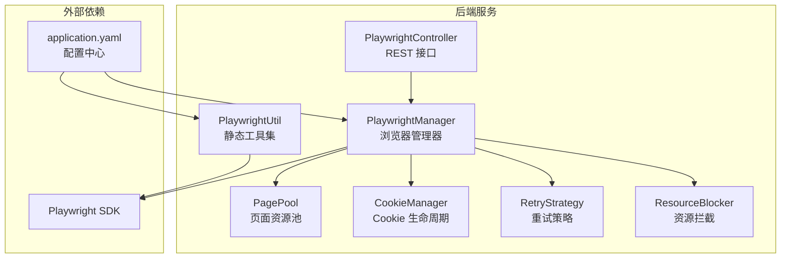
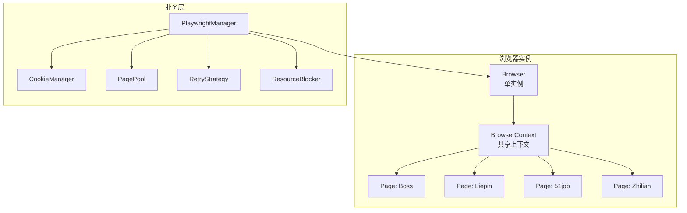
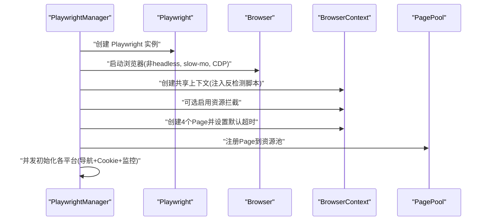
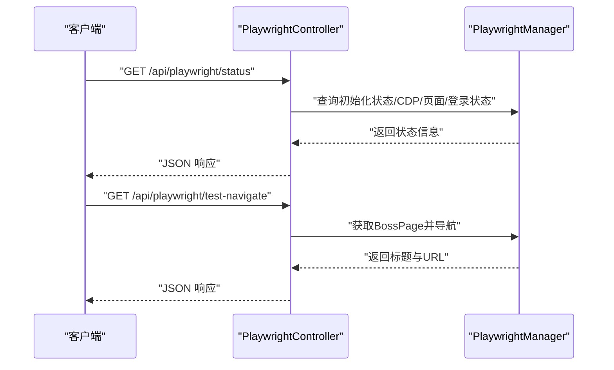
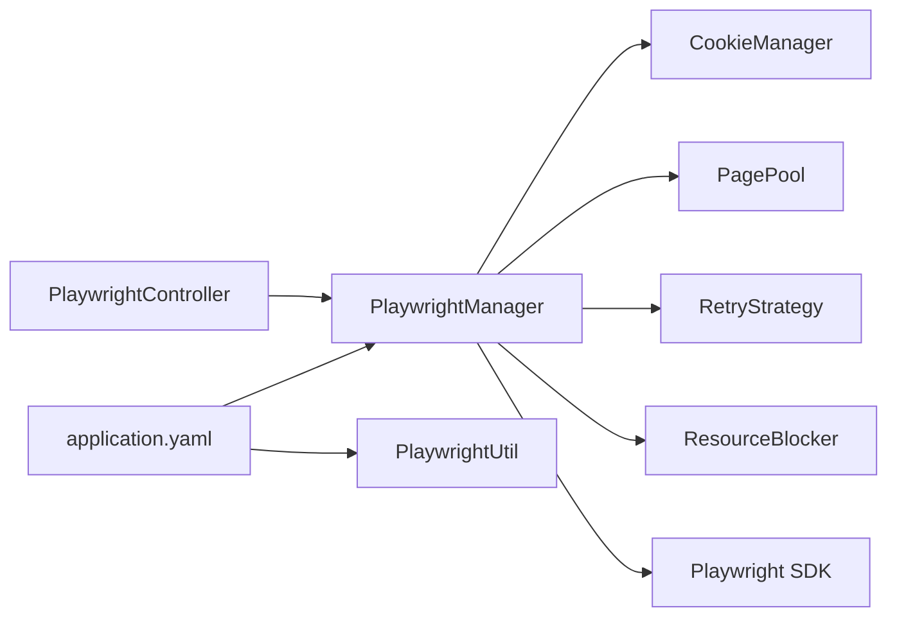

# 浏览器管理机制

<cite>
**本文引用的文件**
- [PlaywrightController.java](file://backend/src/main/java/com/getjobs/application/controller/PlaywrightController.java)
- [PlaywrightManager.java](file://backend/src/main/java/com/getjobs/worker/manager/PlaywrightManager.java)
- [application.yaml](file://backend/src/main/resources/application.yaml)
- [PlaywrightUtil.java](file://backend/src/main/java/com/getjobs/worker/utils/PlaywrightUtil.java)
- [PagePool.java](file://backend/src/main/java/com/getjobs/worker/utils/PagePool.java)
- [CookieManager.java](file://backend/src/main/java/com/getjobs/worker/utils/CookieManager.java)
- [RetryStrategy.java](file://backend/src/main/java/com/getjobs/worker/utils/RetryStrategy.java)
- [ResourceBlocker.java](file://backend/src/main/java/com/getjobs/worker/utils/ResourceBlocker.java)
</cite>

## 目录
1. [简介](#简介)
2. [项目结构](#项目结构)
3. [核心组件](#核心组件)
4. [架构总览](#架构总览)
5. [详细组件分析](#详细组件分析)
6. [依赖分析](#依赖分析)
7. [性能考量](#性能考量)
8. [故障排查指南](#故障排查指南)
9. [结论](#结论)
10. [附录](#附录)

## 简介
本文件面向系统架构师与运维工程师，系统化阐述该仓库中的浏览器管理机制，重点覆盖以下方面：
- Playwright 实例初始化流程与启动参数调优
- 共享 BrowserContext 的设计理念与实现细节（多标签页管理策略）
- 浏览器启动参数（headless 模式、slow-mo 调试、CDP 端口等）
- 浏览器生命周期管理与资源清理
- Chromium 路径检测、版本兼容性与启动失败的故障恢复
- 性能优化建议与调试技巧

## 项目结构
围绕浏览器自动化的核心模块主要位于后端 Java 工程的 worker 子包中，并通过 Spring MVC 暴露简单的健康检查接口。

图表来源
- [PlaywrightController.java:16-63](file://backend/src/main/java/com/getjobs/application/controller/PlaywrightController.java#L16-L63)
- [PlaywrightManager.java:40-221](file://backend/src/main/java/com/getjobs/worker/manager/PlaywrightManager.java#L40-L221)
- [application.yaml:60-91](file://backend/src/main/resources/application.yaml#L60-L91)

章节来源
- [PlaywrightController.java:16-63](file://backend/src/main/java/com/getjobs/application/controller/PlaywrightController.java#L16-L63)
- [application.yaml:60-91](file://backend/src/main/resources/application.yaml#L60-L91)

## 核心组件
- PlaywrightManager：Spring 单例 Bean，负责 Playwright 实例、Browser、BrowserContext、Page 的创建与初始化，以及登录状态监控与 Cookie 管理。
- PlaywrightUtil：静态工具集，提供通用的浏览器自动化能力（导航、元素操作、截图、Cookie 读写、Stealth 模式等）。
- PagePool：页面资源池，记录页面使用统计与空闲状态，支持未来扩展回收策略。
- CookieManager：Cookie 生命周期管理，记录保存时间、预测过期、触发刷新。
- RetryStrategy：指数退避重试策略，用于导航、点击等不稳定操作。
- ResourceBlocker：资源拦截器，按扩展名与域名拦截非关键资源，降低内存与带宽占用。
- PlaywrightController：对外暴露状态查询与简单导航测试接口，便于运维观察。

章节来源
- [PlaywrightManager.java:40-221](file://backend/src/main/java/com/getjobs/worker/manager/PlaywrightManager.java#L40-L221)
- [PlaywrightUtil.java:19-118](file://backend/src/main/java/com/getjobs/worker/utils/PlaywrightUtil.java#L19-L118)
- [PagePool.java:24-134](file://backend/src/main/java/com/getjobs/worker/utils/PagePool.java#L24-L134)
- [CookieManager.java:29-98](file://backend/src/main/java/com/getjobs/worker/utils/CookieManager.java#L29-L98)
- [RetryStrategy.java:21-94](file://backend/src/main/java/com/getjobs/worker/utils/RetryStrategy.java#L21-L94)
- [ResourceBlocker.java:22-102](file://backend/src/main/java/com/getjobs/worker/utils/ResourceBlocker.java#L22-L102)
- [PlaywrightController.java:16-63](file://backend/src/main/java/com/getjobs/application/controller/PlaywrightController.java#L16-L63)

## 架构总览
整体架构采用“共享上下文 + 多标签页”的设计，所有求职平台在同一个浏览器窗口的不同标签页中运行，以复用登录态与上下文环境，降低资源消耗并提升稳定性。

图表来源
- [PlaywrightManager.java:114-221](file://backend/src/main/java/com/getjobs/worker/manager/PlaywrightManager.java#L114-L221)
- [PagePool.java:58-85](file://backend/src/main/java/com/getjobs/worker/utils/PagePool.java#L58-L85)

## 详细组件分析

### PlaywrightManager：浏览器与上下文管理
- 初始化流程
  - 延迟初始化：首次使用时启动 Playwright，创建 Firefox 浏览器实例（非 headless，便于调试），设置固定 CDP 端口与 slow-mo。
  - 创建共享 BrowserContext，注入反检测脚本，按需启用资源拦截。
  - 顺序创建四个平台 Page，分别设置默认导航超时；注册到 PagePool。
  - 并发初始化各平台（导航、Cookie 加载、登录状态监控）。
  - 从数据库加载 Cookie 并注入上下文，初始化 CookieManager。
- 登录状态监控
  - 为每个平台 Page 注册 Frame 导航事件监听，检测 URL 变化并触发登录状态检查。
  - 提供暂停/恢复标志，避免任务执行与后台监控并发访问同一页面。
- Cookie 管理
  - 从数据库加载 Cookie 并按域过滤注入上下文；支持按平台差异化超时与导航策略。
- 资源拦截
  - 可选启用，按扩展名与域名拦截非关键资源，降低内存与带宽占用。
- 页面池
  - 记录 lastUsedAt、访问次数、存在时间等统计，支持空闲回收扩展。

图表来源
- [PlaywrightManager.java:114-221](file://backend/src/main/java/com/getjobs/worker/manager/PlaywrightManager.java#L114-L221)

章节来源
- [PlaywrightManager.java:114-221](file://backend/src/main/java/com/getjobs/worker/manager/PlaywrightManager.java#L114-L221)
- [PlaywrightManager.java:254-331](file://backend/src/main/java/com/getjobs/worker/manager/PlaywrightManager.java#L254-L331)
- [PlaywrightManager.java:393-465](file://backend/src/main/java/com/getjobs/worker/manager/PlaywrightManager.java#L393-L465)
- [PlaywrightManager.java:584-686](file://backend/src/main/java/com/getjobs/worker/manager/PlaywrightManager.java#L584-L686)

### PlaywrightController：状态与测试接口
- /api/playwright/status：返回初始化状态、CDP 端口、各平台 Page 与登录状态。
- /api/playwright/test-navigate：对 Boss 页面进行导航与标题获取，便于快速验证浏览器可用性。

图表来源
- [PlaywrightController.java:29-62](file://backend/src/main/java/com/getjobs/application/controller/PlaywrightController.java#L29-L62)
- [PlaywrightManager.java:68-75](file://backend/src/main/java/com/getjobs/worker/manager/PlaywrightManager.java#L68-L75)

章节来源
- [PlaywrightController.java:29-62](file://backend/src/main/java/com/getjobs/application/controller/PlaywrightController.java#L29-L62)

### PlaywrightUtil：静态工具集
- 提供桌面/移动双上下文、页面对象、导航、等待、点击、输入、截图、Cookie 读写、Stealth 模式等能力。
- 适用于独立的自动化脚本或临时调试场景。

章节来源
- [PlaywrightUtil.java:44-118](file://backend/src/main/java/com/getjobs/worker/utils/PlaywrightUtil.java#L44-L118)
- [PlaywrightUtil.java:425-487](file://backend/src/main/java/com/getjobs/worker/utils/PlaywrightUtil.java#L425-L487)

### PagePool：页面资源池
- 记录每个 Page 的 lastUsedAt、访问次数、存在时间，输出资源池统计。
- 支持空闲 Page 列表查询，为后续回收策略提供数据基础。

章节来源
- [PagePool.java:58-134](file://backend/src/main/java/com/getjobs/worker/utils/PagePool.java#L58-L134)
- [PagePool.java:141-168](file://backend/src/main/java/com/getjobs/worker/utils/PagePool.java#L141-L168)

### CookieManager：Cookie 生命周期管理
- 记录 Cookie 保存时间与预期有效期，计算剩余时间，判断是否即将过期或已过期。
- 提供刷新标记与摘要输出，便于运维监控。

章节来源
- [CookieManager.java:62-98](file://backend/src/main/java/com/getjobs/worker/utils/CookieManager.java#L62-L98)
- [CookieManager.java:160-197](file://backend/src/main/java/com/getjobs/worker/utils/CookieManager.java#L160-L197)

### RetryStrategy：指数退避重试
- 提供可配置的最大重试次数、基础延迟与最大延迟，结合随机抖动，提升稳定性。
- 支持固定延迟重试变体。

章节来源
- [RetryStrategy.java:49-94](file://backend/src/main/java/com/getjobs/worker/utils/RetryStrategy.java#L49-L94)
- [RetryStrategy.java:138-167](file://backend/src/main/java/com/getjobs/worker/utils/RetryStrategy.java#L138-L167)

### ResourceBlocker：资源拦截
- 按扩展名与域名拦截非关键资源，白名单保留二维码与关键图片。
- 支持动态添加白名单与拦截项，输出配置摘要。

章节来源
- [ResourceBlocker.java:77-102](file://backend/src/main/java/com/getjobs/worker/utils/ResourceBlocker.java#L77-L102)
- [ResourceBlocker.java:167-174](file://backend/src/main/java/com/getjobs/worker/utils/ResourceBlocker.java#L167-L174)

## 依赖分析
- 组件内聚与耦合
  - PlaywrightManager 是核心协调者，依赖 CookieManager、PagePool、RetryStrategy、ResourceBlocker。
  - PlaywrightController 仅依赖 PlaywrightManager，职责清晰。
  - PlaywrightUtil 为静态工具集，不参与 Spring 生命周期，避免与业务耦合。
- 外部依赖
  - Playwright SDK：浏览器自动化核心。
  - application.yaml：集中配置浏览器行为（slow-mo、超时、重试、资源拦截、Cookie 刷新等）。

图表来源
- [PlaywrightController.java:20-24](file://backend/src/main/java/com/getjobs/application/controller/PlaywrightController.java#L20-L24)
- [PlaywrightManager.java:90-110](file://backend/src/main/java/com/getjobs/worker/manager/PlaywrightManager.java#L90-L110)
- [application.yaml:60-91](file://backend/src/main/resources/application.yaml#L60-L91)

章节来源
- [PlaywrightController.java:20-24](file://backend/src/main/java/com/getjobs/application/controller/PlaywrightController.java#L20-L24)
- [PlaywrightManager.java:90-110](file://backend/src/main/java/com/getjobs/worker/manager/PlaywrightManager.java#L90-L110)
- [application.yaml:60-91](file://backend/src/main/resources/application.yaml#L60-L91)

## 性能考量
- slow-mo 调试与生产平衡
  - 配置项 slow-mo 用于调试，生产环境建议适当降低以提升吞吐。
- 资源拦截
  - 启用资源拦截可显著降低内存与带宽占用，建议在稳定后开启。
- 页面池与空闲回收
  - PagePool 已记录空闲时间，可在未来版本实现空闲回收，进一步降低资源占用。
- 导航超时与重试
  - 各平台差异化超时配置与指数退避重试策略，有助于在不稳定网络下提升成功率。
- 视口与 UA
  - 共享上下文使用默认 UA，必要时可在上下文层统一设置，避免频繁切换。

[本节为通用指导，无需具体文件引用]

## 故障排查指南
- 启动失败（Chromium 路径）
  - 现象：启动时报错提示 Chromium 可执行文件不存在。
  - 处理：执行 Playwright 安装命令以准备 Chromium；确认路径与权限。
- 并发导航异常
  - 现象：并发导航时出现“对象不存在”异常，但页面已可达。
  - 处理：采用重试策略与 URL 可达性探测，避免误判。
- 登录状态误判
  - 现象：登录检测逻辑在不同页面版本下失效。
  - 处理：增加多特征检测与兜底策略，必要时调整选择器。
- 资源拦截导致二维码不可见
  - 现象：启用拦截后二维码无法加载。
  - 处理：检查白名单配置，确保二维码相关资源放行。
- Cookie 过期或即将过期
  - 现象：登录态失效导致后续操作失败。
  - 处理：利用 CookieManager 的过期检测与刷新标记，提前触发登录流程。

章节来源
- [PlaywrightManager.java:127-136](file://backend/src/main/java/com/getjobs/worker/manager/PlaywrightManager.java#L127-L136)
- [PlaywrightManager.java:277-308](file://backend/src/main/java/com/getjobs/worker/manager/PlaywrightManager.java#L277-L308)
- [ResourceBlocker.java:110-122](file://backend/src/main/java/com/getjobs/worker/utils/ResourceBlocker.java#L110-L122)
- [CookieManager.java:74-98](file://backend/src/main/java/com/getjobs/worker/utils/CookieManager.java#L74-L98)

## 结论
该浏览器管理机制通过“共享上下文 + 多标签页”的架构，实现了跨平台登录态复用与资源高效利用。配合 Cookie 生命周期管理、资源拦截、指数退避重试与页面池统计，系统在稳定性与可维护性上具备良好基础。建议在生产环境中逐步启用资源拦截、合理设置超时与重试参数，并结合 PagePool 的空闲回收策略进一步优化资源占用。

[本节为总结性内容，无需具体文件引用]

## 附录

### 启动参数与配置要点
- headless 模式
  - 当前为非 headless，便于可视化调试；生产可根据需求切换。
- slow-mo
  - 通过配置项控制操作延时，默认值较低以便调试。
- CDP 端口
  - 使用固定端口便于远程调试与连接。
- 资源拦截
  - 通过配置开关启用，按扩展名与域名拦截非关键资源。
- 导航超时
  - 提供全局与平台差异化超时配置，兼顾稳定性与效率。

章节来源
- [PlaywrightManager.java:138-149](file://backend/src/main/java/com/getjobs/worker/manager/PlaywrightManager.java#L138-L149)
- [application.yaml:60-91](file://backend/src/main/resources/application.yaml#L60-L91)