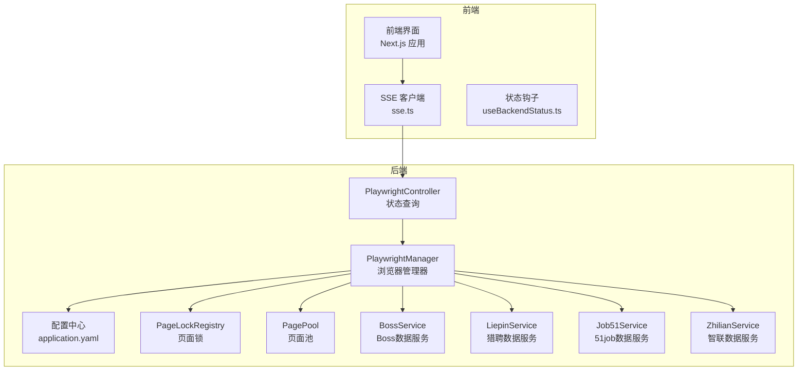
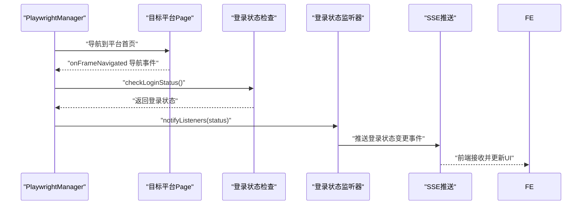
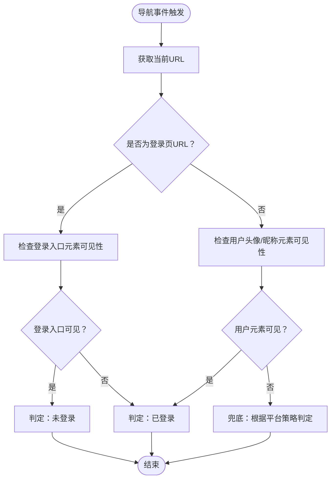
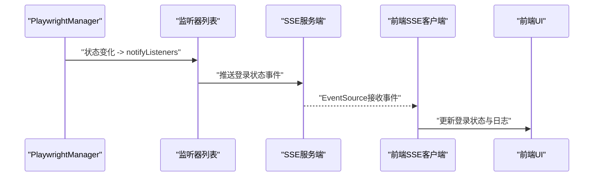
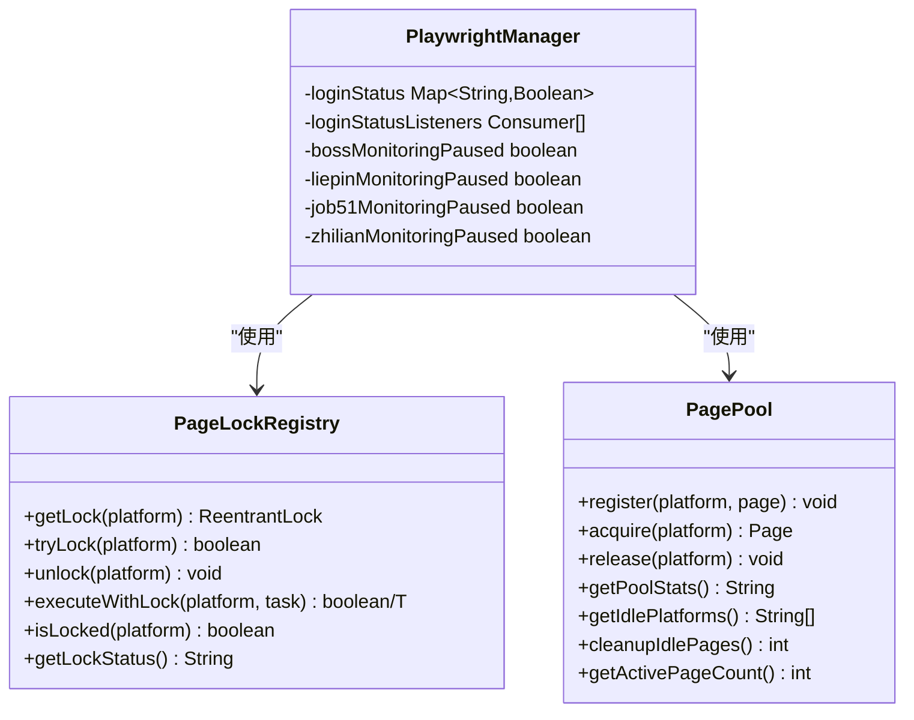
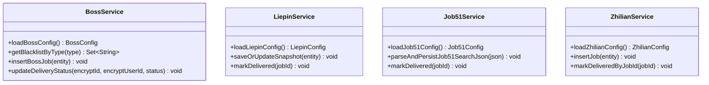
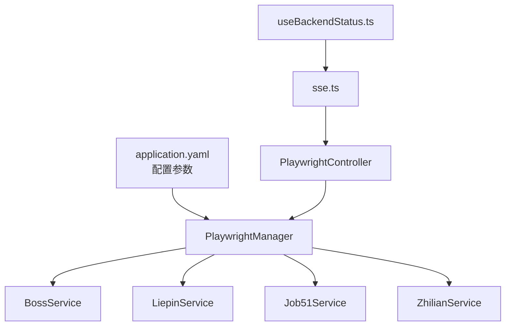

# 登录状态监控

<cite>
**本文档引用的文件**
- [application.yaml](file://backend/src/main/resources/application.yaml)
- [PlaywrightManager.java](file://backend/src/main/java/com/getjobs/worker/manager/PlaywrightManager.java)
- [PageLockRegistry.java](file://backend/src/main/java/com/getjobs/worker/utils/PageLockRegistry.java)
- [PagePool.java](file://backend/src/main/java/com/getjobs/worker/utils/PagePool.java)
- [Boss.java](file://backend/src/main/java/com/getjobs/worker/boss/Boss.java)
- [BossService.java](file://backend/src/main/java/com/getjobs/application/service/BossService.java)
- [LiepinService.java](file://backend/src/main/java/com/getjobs/application/service/LiepinService.java)
- [Job51Service.java](file://backend/src/main/java/com/getjobs/application/service/Job51Service.java)
- [ZhilianService.java](file://backend/src/main/java/com/getjobs/application/service/ZhilianService.java)
- [PlaywrightController.java](file://backend/src/main/java/com/getjobs/application/controller/PlaywrightController.java)
- [sse.ts](file://front/lib/sse.ts)
- [useBackendStatus.ts](file://front/hooks/useBackendStatus.ts)
</cite>

## 目录
1. [简介](#简介)
2. [项目结构](#项目结构)
3. [核心组件](#核心组件)
4. [架构概览](#架构概览)
5. [详细组件分析](#详细组件分析)
6. [依赖关系分析](#依赖关系分析)
7. [性能考虑](#性能考虑)
8. [故障排查指南](#故障排查指南)
9. [结论](#结论)
10. [附录](#附录)

## 简介
本技术文档面向系统监控工程师与运维人员，全面阐述登录状态监控系统的设计原理与实现策略。系统基于 Playwright 管理多平台浏览器页面，通过页面导航事件监听、URL 变化检测与元素可见性判断，实现对 Boss 直聘、猎聘、51job、智联招聘四类平台的登录状态实时监控。文档涵盖各平台差异化检测逻辑、登录状态变更的通知机制与事件传播流程、并发控制策略（页面锁定与状态同步）、配置参数、性能优化与故障处理方法，并提供调试方法、监控指标与维护指南。

## 项目结构
系统采用前后端分离架构：
- 后端（Spring Boot）负责浏览器自动化、页面状态监控、并发控制与配置管理；
- 前端（Next.js）通过 SSE 与后端建立事件通道，接收登录状态变更通知并提供可视化界面。

**图示来源**
- [PlaywrightManager.java:36-83](file://backend/src/main/java/com/getjobs/worker/manager/PlaywrightManager.java#L36-L83)
- [application.yaml:70-101](file://backend/src/main/resources/application.yaml#L70-L101)
- [PlaywrightController.java:16-39](file://backend/src/main/java/com/getjobs/application/controller/PlaywrightController.java#L16-L39)

**章节来源**
- [PlaywrightManager.java:36-83](file://backend/src/main/java/com/getjobs/worker/manager/PlaywrightManager.java#L36-L83)
- [application.yaml:70-101](file://backend/src/main/resources/application.yaml#L70-L101)

## 核心组件
- PlaywrightManager：浏览器自动化引擎的统一管理器，负责初始化浏览器、创建共享 BrowserContext 与多平台 Page，加载 Cookie、导航至各平台首页，并设置登录状态监控。
- PageLockRegistry：平台级并发锁管理器，解决导航并发冲突与同一 Page 的并发操作冲突。
- PagePool：页面资源池，记录 Page 使用时间戳与访问次数，提供资源统计与空闲回收能力。
- 各平台服务（BossService、LiepinService、Job51Service、ZhilianService）：封装平台数据访问与配置加载，支撑登录状态检测与投递流程。
- SSE 客户端与状态钩子：前端通过 SSE 接收后端推送的登录状态变更事件，实现前端实时可视化。

**章节来源**
- [PlaywrightManager.java:40-83](file://backend/src/main/java/com/getjobs/worker/manager/PlaywrightManager.java#L40-L83)
- [PageLockRegistry.java:22-91](file://backend/src/main/java/com/getjobs/worker/utils/PageLockRegistry.java#L22-L91)
- [PagePool.java:25-100](file://backend/src/main/java/com/getjobs/worker/utils/PagePool.java#L25-L100)
- [BossService.java:26-36](file://backend/src/main/java/com/getjobs/application/service/BossService.java#L26-L36)
- [LiepinService.java:22-31](file://backend/src/main/java/com/getjobs/application/service/LiepinService.java#L22-L31)
- [Job51Service.java:20-27](file://backend/src/main/java/com/getjobs/application/service/Job51Service.java#L20-L27)
- [ZhilianService.java:23-31](file://backend/src/main/java/com/getjobs/application/service/ZhilianService.java#L23-L31)
- [sse.ts:24-113](file://front/lib/sse.ts#L24-L113)
- [useBackendStatus.ts:11-61](file://front/hooks/useBackendStatus.ts#L11-L61)

## 架构概览
系统通过 PlaywrightManager 统一管理四个求职平台的浏览器页面，每个平台拥有独立的 Page 与登录状态监控。系统在页面导航事件（onFrameNavigated）中触发登录状态检查，结合元素可见性判断与 URL 变化检测，实现稳定可靠的登录状态识别。登录状态变更通过 SSE 推送到前端，前端通过状态钩子订阅并更新 UI。

**图示来源**
- [PlaywrightManager.java:376-388](file://backend/src/main/java/com/getjobs/worker/manager/PlaywrightManager.java#L376-L388)
- [PlaywrightManager.java:568-579](file://backend/src/main/java/com/getjobs/worker/manager/PlaywrightManager.java#L568-L579)
- [PlaywrightManager.java:724-735](file://backend/src/main/java/com/getjobs/worker/manager/PlaywrightManager.java#L724-L735)
- [sse.ts:24-88](file://front/lib/sse.ts#L24-L88)

## 详细组件分析

### 登录状态检测机制设计
- 页面导航事件监听：各平台 Page 注册 onFrameNavigated 监听器，当主框架导航完成时触发登录状态检查。
- URL 变化检测：通过页面 URL 的变化判断是否进入登录页或主页，结合元素可见性判断提升准确性。
- 元素可见性判断：针对不同平台，采用不同的特征元素选择器与可见性判断策略，避免误判。

**图示来源**
- [PlaywrightManager.java:376-388](file://backend/src/main/java/com/getjobs/worker/manager/PlaywrightManager.java#L376-L388)
- [PlaywrightManager.java:472-561](file://backend/src/main/java/com/getjobs/worker/manager/PlaywrightManager.java#L472-L561)
- [PlaywrightManager.java:691-717](file://backend/src/main/java/com/getjobs/worker/manager/PlaywrightManager.java#L691-L717)

**章节来源**
- [PlaywrightManager.java:336-369](file://backend/src/main/java/com/getjobs/worker/manager/PlaywrightManager.java#L336-L369)
- [PlaywrightManager.java:472-561](file://backend/src/main/java/com/getjobs/worker/manager/PlaywrightManager.java#L472-L561)
- [PlaywrightManager.java:691-717](file://backend/src/main/java/com/getjobs/worker/manager/PlaywrightManager.java#L691-L717)

### 各平台登录状态差异化检测逻辑
- Boss 直聘
  - 特征元素：用户头像/昵称容器、登录/注册入口。
  - 判定策略：优先检测用户头像/昵称是否可见；若不可见，检查登录入口是否可见且包含“登录”文本。
- 猎聘
  - 特征元素：登录/注册入口、用户头像、用户信息容器。
  - 判定策略：若检测到登录入口可见，判定为未登录；若存在用户头像或用户信息容器，判定为已登录；兜底策略：若不存在登录入口，按已登录处理。
- 51job
  - 特征元素：登录/注册按钮、用户名锚点、个人中心链接。
  - 判定策略：若存在“登录/注册”按钮且可见，判定为未登录；若存在用户名锚点或个人中心链接且可见，判定为已登录。
- 智联招聘
  - 特征元素：用户信息容器、个人中心链接。
  - 判定策略：通过用户信息容器与个人中心链接的存在性判断登录状态。

**章节来源**
- [PlaywrightManager.java:336-369](file://backend/src/main/java/com/getjobs/worker/manager/PlaywrightManager.java#L336-L369)
- [PlaywrightManager.java:472-561](file://backend/src/main/java/com/getjobs/worker/manager/PlaywrightManager.java#L472-L561)
- [PlaywrightManager.java:691-717](file://backend/src/main/java/com/getjobs/worker/manager/PlaywrightManager.java#L691-L717)

### 登录状态变更通知机制与事件传播
- 后端监听器：PlaywrightManager 维护登录状态监听器列表，状态变化时调用 notifyListeners。
- SSE 推送：前端通过 SSE 客户端订阅后端推送的登录状态事件，实现前端实时更新。
- 前端订阅：useBackendStatus 钩子订阅后端状态与日志事件，提供状态刷新与重启后端的能力。

**图示来源**
- [PlaywrightManager.java:58-59](file://backend/src/main/java/com/getjobs/worker/manager/PlaywrightManager.java#L58-L59)
- [PlaywrightManager.java:376-388](file://backend/src/main/java/com/getjobs/worker/manager/PlaywrightManager.java#L376-L388)
- [sse.ts:24-88](file://front/lib/sse.ts#L24-L88)
- [useBackendStatus.ts:40-61](file://front/hooks/useBackendStatus.ts#L40-L61)

**章节来源**
- [PlaywrightManager.java:58-59](file://backend/src/main/java/com/getjobs/worker/manager/PlaywrightManager.java#L58-L59)
- [PlaywrightController.java:29-39](file://backend/src/main/java/com/getjobs/application/controller/PlaywrightController.java#L29-L39)
- [sse.ts:24-113](file://front/lib/sse.ts#L24-L113)
- [useBackendStatus.ts:11-61](file://front/hooks/useBackendStatus.ts#L11-L61)

### 并发控制策略：页面锁定与状态同步
- 页面锁定机制：PageLockRegistry 为每个平台提供 ReentrantLock，支持默认与自定义超时的 tryLock 与 executeWithLock，避免导航并发冲突与同一 Page 的并发操作冲突。
- 页面池管理：PagePool 记录每个 Page 的最后使用时间、访问次数与存在时间，提供资源统计与空闲回收能力，支持获取空闲 Page 列表与活跃 Page 数统计。
- 状态同步：登录状态通过并发安全的 Map 与监听器机制进行同步，避免竞态条件。

**图示来源**
- [PageLockRegistry.java:22-122](file://backend/src/main/java/com/getjobs/worker/utils/PageLockRegistry.java#L22-L122)
- [PagePool.java:25-134](file://backend/src/main/java/com/getjobs/worker/utils/PagePool.java#L25-L134)
- [PlaywrightManager.java:57-83](file://backend/src/main/java/com/getjobs/worker/manager/PlaywrightManager.java#L57-L83)

**章节来源**
- [PageLockRegistry.java:22-122](file://backend/src/main/java/com/getjobs/worker/utils/PageLockRegistry.java#L22-L122)
- [PagePool.java:25-134](file://backend/src/main/java/com/getjobs/worker/utils/PagePool.java#L25-L134)
- [PlaywrightManager.java:57-83](file://backend/src/main/java/com/getjobs/worker/manager/PlaywrightManager.java#L57-L83)

### 平台数据服务与投递流程集成
- BossService：提供 Boss 平台的配置加载、黑名单管理、岗位数据入库与投递状态更新等功能，支撑 Boss 投递流程与登录状态检测。
- LiepinService：提供猎聘平台的配置加载、岗位快照管理与投递状态更新等功能。
- Job51Service：提供 51job 平台的配置加载、岗位解析与投递状态更新等功能。
- ZhilianService：提供智联招聘平台的配置加载、岗位数据管理与投递状态更新等功能。

**图示来源**
- [BossService.java:26-36](file://backend/src/main/java/com/getjobs/application/service/BossService.java#L26-L36)
- [LiepinService.java:22-31](file://backend/src/main/java/com/getjobs/application/service/LiepinService.java#L22-L31)
- [Job51Service.java:20-27](file://backend/src/main/java/com/getjobs/application/service/Job51Service.java#L20-L27)
- [ZhilianService.java:23-31](file://backend/src/main/java/com/getjobs/application/service/ZhilianService.java#L23-L31)

**章节来源**
- [BossService.java:26-36](file://backend/src/main/java/com/getjobs/application/service/BossService.java#L26-L36)
- [LiepinService.java:22-31](file://backend/src/main/java/com/getjobs/application/service/LiepinService.java#L22-L31)
- [Job51Service.java:20-27](file://backend/src/main/java/com/getjobs/application/service/Job51Service.java#L20-L27)
- [ZhilianService.java:23-31](file://backend/src/main/java/com/getjobs/application/service/ZhilianService.java#L23-L31)

## 依赖关系分析
- 配置依赖：application.yaml 提供 Playwright 性能调优、平台差异化超时、稳定性与资源管理等配置参数。
- 组件耦合：PlaywrightManager 与各平台服务解耦，通过 CookieService 与 CookieManager 进行 Cookie 管理，避免直接耦合。
- 前后端通信：PlaywrightController 提供状态查询接口，前端通过 SSE 客户端订阅事件，形成松耦合的事件驱动架构。

**图示来源**
- [application.yaml:70-101](file://backend/src/main/resources/application.yaml#L70-L101)
- [PlaywrightManager.java:92-110](file://backend/src/main/java/com/getjobs/worker/manager/PlaywrightManager.java#L92-L110)
- [PlaywrightController.java:16-39](file://backend/src/main/java/com/getjobs/application/controller/PlaywrightController.java#L16-L39)
- [sse.ts:24-113](file://front/lib/sse.ts#L24-L113)
- [useBackendStatus.ts:11-61](file://front/hooks/useBackendStatus.ts#L11-L61)

**章节来源**
- [application.yaml:70-101](file://backend/src/main/resources/application.yaml#L70-L101)
- [PlaywrightManager.java:92-110](file://backend/src/main/java/com/getjobs/worker/manager/PlaywrightManager.java#L92-L110)
- [PlaywrightController.java:16-39](file://backend/src/main/java/com/getjobs/application/controller/PlaywrightController.java#L16-L39)

## 性能考虑
- 导航超时与平台差异化：通过 application.yaml 配置不同平台的导航超时，平衡稳定性与性能。
- 慢动作与重试：slow-mo 与重试策略降低误操作风险，提高稳定性。
- 资源拦截：可选的资源拦截降低内存占用，提升页面加载性能。
- 页面池与空闲回收：PagePool 提供资源统计与空闲回收能力，避免资源泄漏。

**章节来源**
- [application.yaml:70-101](file://backend/src/main/resources/application.yaml#L70-L101)
- [PagePool.java:116-168](file://backend/src/main/java/com/getjobs/worker/utils/PagePool.java#L116-L168)

## 故障排查指南
- 登录状态检测异常
  - 检查页面导航事件监听是否生效，确认 onFrameNavigated 是否正确触发。
  - 核对元素选择器是否与平台页面结构一致，必要时更新特征元素。
- 并发冲突
  - 使用 PageLockRegistry 的 tryLock 与 executeWithLock，避免导航并发冲突。
  - 检查锁状态与队列长度，定位长时间占用锁的线程。
- 页面资源问题
  - 通过 PagePool 的 getPoolStats 与 getIdlePlatforms 检查页面使用情况与空闲状态。
  - 如需回收空闲页面，可在阶段 2 实现 cleanupIdlePages。
- 前端事件接收
  - 使用 createSSEWithBackoff 的 onError 回调与指数退避策略，确保断线重连。
  - 通过 useBackendStatus 钩子观察后端状态与日志，定位问题根因。

**章节来源**
- [PageLockRegistry.java:176-187](file://backend/src/main/java/com/getjobs/worker/utils/PageLockRegistry.java#L176-L187)
- [PagePool.java:116-151](file://backend/src/main/java/com/getjobs/worker/utils/PagePool.java#L116-L151)
- [sse.ts:37-88](file://front/lib/sse.ts#L37-L88)
- [useBackendStatus.ts:40-61](file://front/hooks/useBackendStatus.ts#L40-L61)

## 结论
登录状态监控系统通过 PlaywrightManager 统一管理多平台浏览器页面，结合页面导航事件监听、URL 变化检测与元素可见性判断，实现了对 Boss 直聘、猎聘、51job、智联招聘的稳定登录状态检测。系统采用页面锁定与页面池管理实现并发控制与资源优化，通过 SSE 事件驱动实现前后端解耦与实时状态更新。配置参数与性能优化策略确保系统在高并发场景下的稳定性与可靠性。

## 附录

### 配置参数清单
- Playwright 性能调优
  - slow-mo：操作延迟（毫秒）
  - navigation-timeout：默认导航超时
  - login-check-interval：登录检测间隔（毫秒）
- 平台差异化超时
  - boss.navigation-timeout：Boss 导航超时
  - liepin.navigation-timeout：猎聘导航超时
  - job51.navigation-timeout：51job 导航超时
  - zhilian.navigation-timeout：智联导航超时
- 稳定性
  - max-retries：最大重试次数
  - retry-base-delay：基础重试延迟
  - retry-max-delay：最大重试延迟
  - health-check-interval：浏览器健康检查间隔
- 资源管理
  - max-pages：最大页面数
  - idle-page-timeout：空闲页面回收时间
  - resource-blocking-enabled：请求拦截开关
- Cookie 管理
  - cookie-refresh-before-expiry：过期前刷新时间

**章节来源**
- [application.yaml:70-101](file://backend/src/main/resources/application.yaml#L70-L101)

### 调试方法
- 后端状态查询：通过 PlaywrightController 的 /api/playwright/status 接口获取初始化状态、CDP 端口、页面状态与登录状态。
- 前端事件订阅：使用 createSSEWithBackoff 订阅后端推送事件，观察登录状态变化。
- 日志与状态钩子：通过 useBackendStatus 钩子获取后端状态与日志，辅助定位问题。

**章节来源**
- [PlaywrightController.java:29-39](file://backend/src/main/java/com/getjobs/application/controller/PlaywrightController.java#L29-L39)
- [sse.ts:24-113](file://front/lib/sse.ts#L24-L113)
- [useBackendStatus.ts:11-61](file://front/hooks/useBackendStatus.ts#L11-L61)