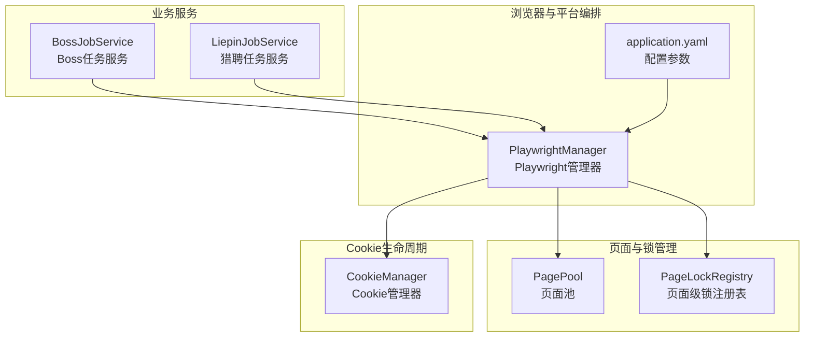
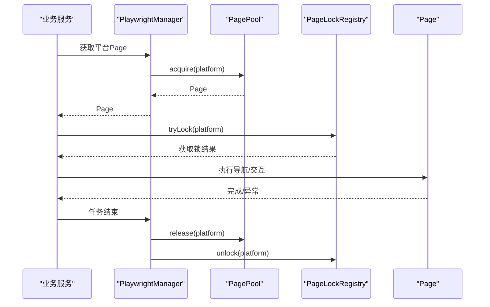
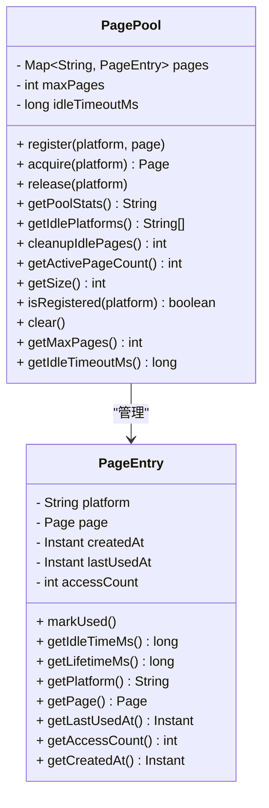
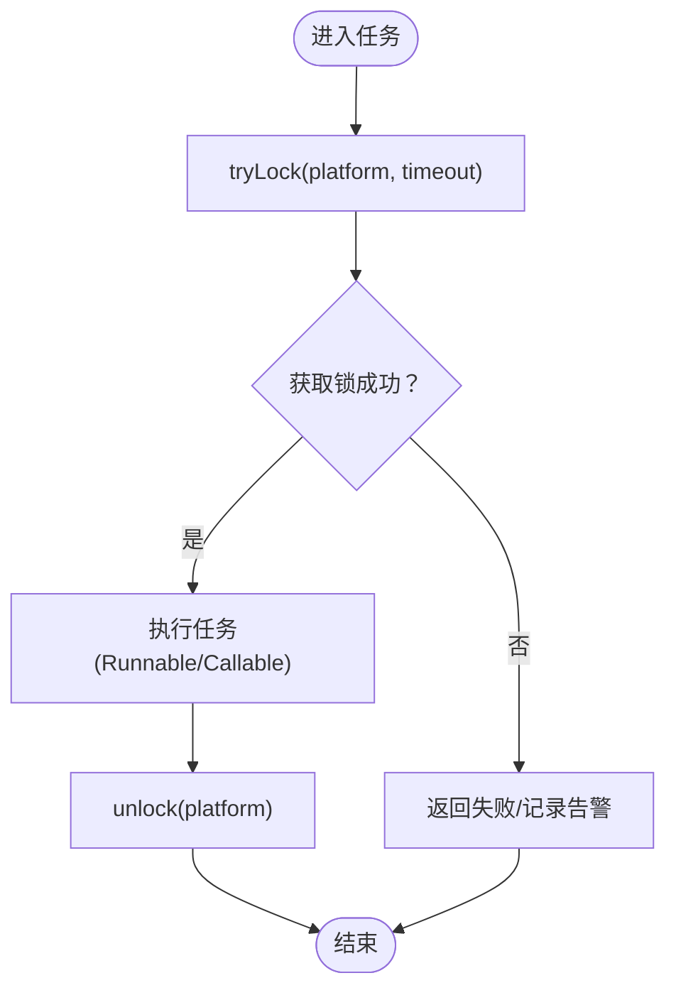
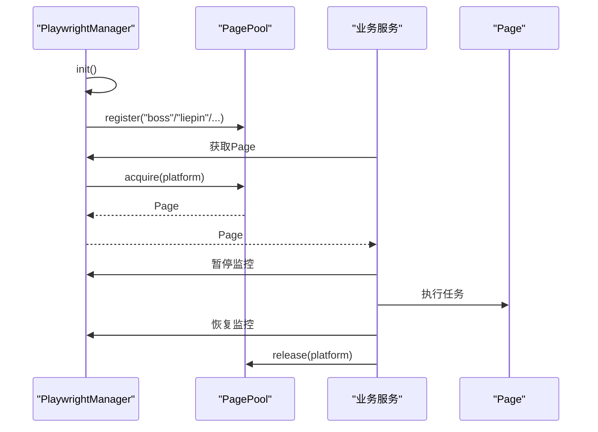
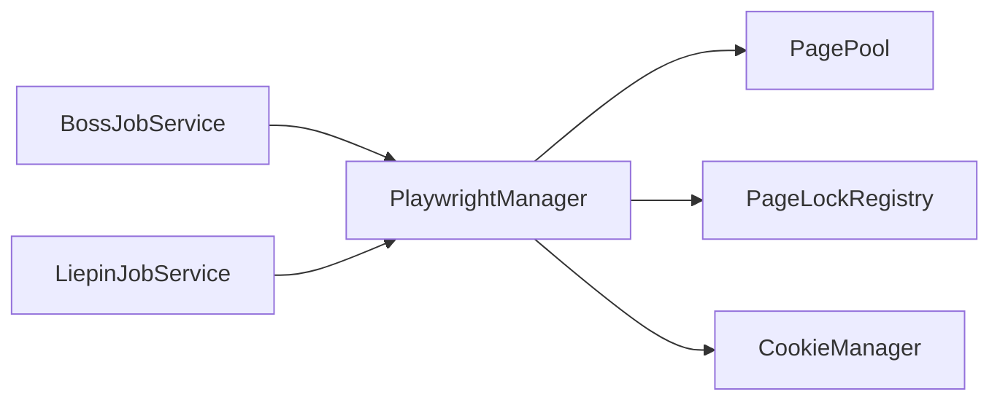

# 页面池化策略

<cite>
**本文引用的文件**
- [PagePool.java](file://backend/src/main/java/com/getjobs/worker/utils/PagePool.java)
- [PageLockRegistry.java](file://backend/src/main/java/com/getjobs/worker/utils/PageLockRegistry.java)
- [PlaywrightManager.java](file://backend/src/main/java/com/getjobs/worker/manager/PlaywrightManager.java)
- [application.yaml](file://backend/src/main/resources/application.yaml)
- [BossJobService.java](file://backend/src/main/java/com/getjobs/worker/service/BossJobService.java)
- [LiepinJobService.java](file://backend/src/main/java/com/getjobs/worker/service/LiepinJobService.java)
- [CookieManager.java](file://backend/src/main/java/com/getjobs/worker/utils/CookieManager.java)
</cite>

## 目录
1. [引言](#引言)
2. [项目结构](#项目结构)
3. [核心组件](#核心组件)
4. [架构总览](#架构总览)
5. [详细组件分析](#详细组件分析)
6. [依赖分析](#依赖分析)
7. [性能考量](#性能考量)
8. [故障排查指南](#故障排查指南)
9. [结论](#结论)
10. [附录](#附录)

## 引言
本文件围绕页面池化策略进行深入技术文档编制，重点覆盖以下方面：
- PagePool 的设计原理与实现机制：页面对象的创建、分配、回收与复用策略
- 并发访问控制机制：PageLockRegistry 的锁管理策略
- 页面池容量管理、超时处理与资源清理机制
- 页面状态监控与健康检查机制
- 配置参数调优、性能监控指标与故障处理策略
- 使用最佳实践与常见问题解决方案

目标读者为性能优化工程师与系统维护人员。

## 项目结构
页面池化策略涉及的核心模块位于后端 Java 工程的 worker/utils 与 worker/manager 包中，并通过 PlaywrightManager 进行统一编排。配置参数主要来源于 application.yaml。

图表来源
- [PlaywrightManager.java:60-61](file://backend/src/main/java/com/getjobs/worker/manager/PlaywrightManager.java#L60-L61)
- [application.yaml:84-87](file://backend/src/main/resources/application.yaml#L84-L87)

章节来源
- [PlaywrightManager.java:60-61](file://backend/src/main/java/com/getjobs/worker/manager/PlaywrightManager.java#L60-L61)
- [application.yaml:84-87](file://backend/src/main/resources/application.yaml#L84-L87)

## 核心组件
- PagePool：页面池管理器，负责页面注册、获取、释放、统计与空闲检测（当前阶段 1 仅统计，不执行清理）
- PageLockRegistry：页面级并发锁管理器，解决导航并发冲突与同一页面并发操作冲突
- PlaywrightManager：浏览器与页面生命周期管理，负责初始化、注册页面到池、并发初始化各平台、健康检查与监控暂停/恢复
- CookieManager：Cookie 生命周期管理，提供即将过期检测与刷新触发机制
- 业务服务（BossJobService、LiepinJobService）：在执行任务前获取页面、暂停后台监控以避免并发冲突、完成后恢复监控

章节来源
- [PagePool.java:25-278](file://backend/src/main/java/com/getjobs/worker/utils/PagePool.java#L25-L278)
- [PageLockRegistry.java:22-203](file://backend/src/main/java/com/getjobs/worker/utils/PageLockRegistry.java#L22-L203)
- [PlaywrightManager.java:60-61](file://backend/src/main/java/com/getjobs/worker/manager/PlaywrightManager.java#L60-L61)
- [CookieManager.java:31-200](file://backend/src/main/java/com/getjobs/worker/utils/CookieManager.java#L31-L200)
- [BossJobService.java:25-104](file://backend/src/main/java/com/getjobs/worker/service/BossJobService.java#L25-L104)
- [LiepinJobService.java:25-101](file://backend/src/main/java/com/getjobs/worker/service/LiepinJobService.java#L25-L101)

## 架构总览
页面池化策略在系统中的位置与交互如下：

图表来源
- [PlaywrightManager.java:185-190](file://backend/src/main/java/com/getjobs/worker/manager/PlaywrightManager.java#L185-L190)
- [PagePool.java:74-99](file://backend/src/main/java/com/getjobs/worker/utils/PagePool.java#L74-L99)
- [PageLockRegistry.java:61-91](file://backend/src/main/java/com/getjobs/worker/utils/PageLockRegistry.java#L61-L91)

## 详细组件分析

### PagePool 组件分析
- 设计目标
  - 为每个 Page 维护 lastUsedAt 时间戳，用于空闲检测与统计
  - 提供 getPoolStats() 输出资源使用统计
  - 当前阶段 1：仅观测，不销毁 Page，保留扩展空间（阶段 2 计划支持动态创建、空闲回收与动态池大小）

- 关键数据结构与算法
  - 存储结构：ConcurrentHashMap<String, PageEntry>，键为平台名（小写），值为 PageEntry
  - PageEntry：封装平台名、Page 实例、创建时间、最后使用时间、访问计数
  - 空闲检测：基于 lastUsedAt 与当前时间差计算空闲时长，与 idleTimeoutMs 对比
  - 统计输出：遍历所有条目，计算访问次数、空闲/存活时间、状态（活跃/已关闭）

- 并发与一致性
  - 读多写少场景，使用 ConcurrentHashMap 保证并发安全
  - acquire/release 仅做标记，不改变 Page 生命周期，避免与外部管理器耦合

- 阶段 2 扩展方向
  - 按需创建 Page（启动时不预创建）
  - 空闲 Page 超过阈值后自动回收
  - 动态 Page 池大小调整

图表来源
- [PagePool.java:25-278](file://backend/src/main/java/com/getjobs/worker/utils/PagePool.java#L25-L278)

章节来源
- [PagePool.java:25-278](file://backend/src/main/java/com/getjobs/worker/utils/PagePool.java#L25-L278)

### PageLockRegistry 组件分析
- 设计目标
  - 解决导航并发冲突（如 "Object doesn't exist" 错误）
  - 防止同一 Page 的并发操作冲突
  - 提供默认与自定义超时的锁获取、释放与带锁执行能力

- 关键机制
  - 平台级锁映射：ConcurrentHashMap<String, ReentrantLock>
  - 默认锁超时：10 秒
  - 提供 tryLock、unlock、executeWithLock（Runnable/Callable）等接口
  - 提供 isLocked 与 getLockStatus 便于监控

- 使用建议
  - 在执行可能引发导航/并发冲突的操作前后，使用 tryLock/platform 或 executeWithLock 包裹
  - 对于长时间任务，合理设置超时时间，避免死锁

图表来源
- [PageLockRegistry.java:61-158](file://backend/src/main/java/com/getjobs/worker/utils/PageLockRegistry.java#L61-L158)

章节来源
- [PageLockRegistry.java:22-203](file://backend/src/main/java/com/getjobs/worker/utils/PageLockRegistry.java#L22-L203)

### PlaywrightManager 与页面池集成
- 初始化流程
  - 创建 Playwright、Browser、BrowserContext
  - 顺序创建各平台 Page，设置默认超时
  - 注册到 PagePool（register）
  - 并发初始化各平台（导航、Cookie 加载、登录状态监控）

- 任务执行中的页面使用
  - 业务服务在执行前获取 Page，暂停对应平台的后台监控，避免并发冲突
  - 任务结束后恢复监控并释放 Page（release）

- 健康检查与监控
  - 通过 pause/resume 监控方法协调后台监控与任务执行
  - PagePool 提供统计信息输出，辅助健康检查

图表来源
- [PlaywrightManager.java:185-190](file://backend/src/main/java/com/getjobs/worker/manager/PlaywrightManager.java#L185-L190)
- [BossJobService.java:62-102](file://backend/src/main/java/com/getjobs/worker/service/BossJobService.java#L62-L102)
- [LiepinJobService.java:61-100](file://backend/src/main/java/com/getjobs/worker/service/LiepinJobService.java#L61-L100)

章节来源
- [PlaywrightManager.java:114-221](file://backend/src/main/java/com/getjobs/worker/manager/PlaywrightManager.java#L114-L221)
- [PlaywrightManager.java:185-190](file://backend/src/main/java/com/getjobs/worker/manager/PlaywrightManager.java#L185-L190)
- [BossJobService.java:62-102](file://backend/src/main/java/com/getjobs/worker/service/BossJobService.java#L62-L102)
- [LiepinJobService.java:61-100](file://backend/src/main/java/com/getjobs/worker/service/LiepinJobService.java#L61-L100)

### Cookie 生命周期与页面池协同
- CookieManager 记录各平台 Cookie 的保存时间与预期有效期，提供即将过期检测与刷新触发
- 与页面池的关系：当 Cookie 即将过期或已过期时，触发登录状态检测与刷新流程，间接影响页面的可用性与稳定性
- 通过配置项控制刷新提前时间与健康检查间隔

章节来源
- [CookieManager.java:31-200](file://backend/src/main/java/com/getjobs/worker/utils/CookieManager.java#L31-L200)
- [application.yaml:82-87](file://backend/src/main/resources/application.yaml#L82-L87)

## 依赖分析
- PagePool 依赖
  - 仅依赖 Playwright Page 接口与时间工具类，低耦合
  - 通过 PlaywrightManager 注册页面，形成松散耦合

- PageLockRegistry 依赖
  - 依赖 ReentrantLock 与并发映射，提供平台级锁隔离

- PlaywrightManager 依赖
  - 依赖 Playwright、BrowserContext、Page
  - 依赖 CookieService、CookieManager、PagePool、PageLockRegistry

图表来源
- [PlaywrightManager.java:60-61](file://backend/src/main/java/com/getjobs/worker/manager/PlaywrightManager.java#L60-L61)
- [BossJobService.java:28-30](file://backend/src/main/java/com/getjobs/worker/service/BossJobService.java#L28-L30)
- [LiepinJobService.java:29-31](file://backend/src/main/java/com/getjobs/worker/service/LiepinJobService.java#L29-L31)

章节来源
- [PlaywrightManager.java:60-61](file://backend/src/main/java/com/getjobs/worker/manager/PlaywrightManager.java#L60-L61)
- [BossJobService.java:28-30](file://backend/src/main/java/com/getjobs/worker/service/BossJobService.java#L28-L30)
- [LiepinJobService.java:29-31](file://backend/src/main/java/com/getjobs/worker/service/LiepinJobService.java#L29-L31)

## 性能考量
- 页面池容量与超时
  - max-pages：限制同时活跃页面数量，避免资源耗尽
  - idle-page-timeout：空闲页面回收阈值，结合 getPoolStats 与 getIdlePlatforms 进行观察
  - 建议：根据并发任务量与平台差异设置，逐步调优

- 并发控制
  - 使用 PageLockRegistry 的 tryLock 与 executeWithLock，避免导航冲突
  - 合理设置超时时间，防止长时间阻塞

- 资源拦截与性能
  - 可开启资源拦截以降低内存占用，但需权衡网络请求完整性

- 监控与健康检查
  - 定期输出 PagePool 统计信息
  - 结合 CookieManager 的剩余有效期与刷新策略，保障页面稳定性

章节来源
- [application.yaml:84-87](file://backend/src/main/resources/application.yaml#L84-L87)
- [PagePool.java:116-134](file://backend/src/main/java/com/getjobs/worker/utils/PagePool.java#L116-L134)
- [PageLockRegistry.java:61-158](file://backend/src/main/java/com/getjobs/worker/utils/PageLockRegistry.java#L61-L158)
- [CookieManager.java:175-197](file://backend/src/main/java/com/getjobs/worker/utils/CookieManager.java#L175-L197)

## 故障排查指南
- 导航并发冲突
  - 现象："Object doesn't exist" 错误
  - 处理：在关键导航前后使用 PageLockRegistry 的 tryLock 或 executeWithLock 包裹
  - 参考：[PageLockRegistry.java:61-158](file://backend/src/main/java/com/getjobs/worker/utils/PageLockRegistry.java#L61-L158)

- 页面未注册/获取失败
  - 现象：acquire 返回 null
  - 处理：确认页面是否已通过 PlaywrightManager 注册到 PagePool；检查平台名大小写
  - 参考：[PagePool.java:74-85](file://backend/src/main/java/com/getjobs/worker/utils/PagePool.java#L74-L85)

- 页面池已满
  - 现象：register 时警告池已满
  - 处理：增大 max-pages 或释放闲置页面；结合 getPoolStats 观察使用情况
  - 参考：[PagePool.java:58-66](file://backend/src/main/java/com/getjobs/worker/utils/PagePool.java#L58-L66)

- 页面长时间空闲
  - 现象：空闲页面过多
  - 处理：当前阶段 1 不清理，建议升级至阶段 2 实现空闲回收
  - 参考：[PagePool.java:158-168](file://backend/src/main/java/com/getjobs/worker/utils/PagePool.java#L158-L168)

- Cookie 即将过期/已过期
  - 现象：登录状态不稳定
  - 处理：使用 CookieManager 的 isExpiringSoon/isExpired 与 needsRefresh 判定，触发刷新
  - 参考：[CookieManager.java:74-129](file://backend/src/main/java/com/getjobs/worker/utils/CookieManager.java#L74-L129)

- 任务执行卡住
  - 现象：任务长时间未完成
  - 处理：检查锁是否被正确释放；确认监控暂停/恢复逻辑是否匹配
  - 参考：[BossJobService.java:62-102](file://backend/src/main/java/com/getjobs/worker/service/BossJobService.java#L62-L102)，[LiepinJobService.java:61-100](file://backend/src/main/java/com/getjobs/worker/service/LiepinJobService.java#L61-L100)

章节来源
- [PagePool.java:58-66](file://backend/src/main/java/com/getjobs/worker/utils/PagePool.java#L58-L66)
- [PagePool.java:74-85](file://backend/src/main/java/com/getjobs/worker/utils/PagePool.java#L74-L85)
- [PagePool.java:158-168](file://backend/src/main/java/com/getjobs/worker/utils/PagePool.java#L158-L168)
- [PageLockRegistry.java:61-158](file://backend/src/main/java/com/getjobs/worker/utils/PageLockRegistry.java#L61-L158)
- [CookieManager.java:74-129](file://backend/src/main/java/com/getjobs/worker/utils/CookieManager.java#L74-L129)
- [BossJobService.java:62-102](file://backend/src/main/java/com/getjobs/worker/service/BossJobService.java#L62-L102)
- [LiepinJobService.java:61-100](file://backend/src/main/java/com/getjobs/worker/service/LiepinJobService.java#L61-L100)

## 结论
页面池化策略通过 PagePool 与 PageLockRegistry 的协作，实现了页面的可观测、可控与可扩展。当前阶段 1 提供了稳定的统计与空闲检测能力，为后续阶段 2 的动态创建、回收与自适应调整奠定了基础。结合 PlaywrightManager 的统一编排与 CookieManager 的生命周期管理，系统在高并发场景下具备良好的稳定性与可维护性。

## 附录
- 配置参数参考
  - playwright.max-pages：页面池最大容量
  - playwright.idle-page-timeout：空闲页面回收阈值（毫秒）
  - playwright.health-check-interval：健康检查间隔（毫秒）
  - playwright.login-check-interval：登录检测间隔（毫秒）
  - playwright.cookie-refresh-before-expiry：Cookie 刷新提前时间（毫秒）

章节来源
- [application.yaml:84-91](file://backend/src/main/resources/application.yaml#L84-L91)