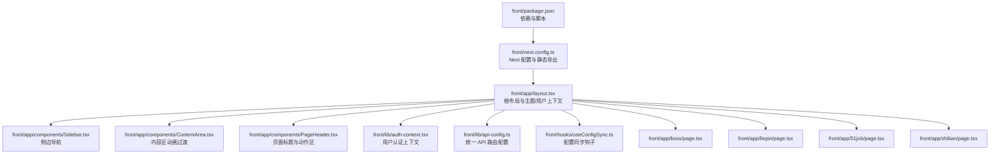
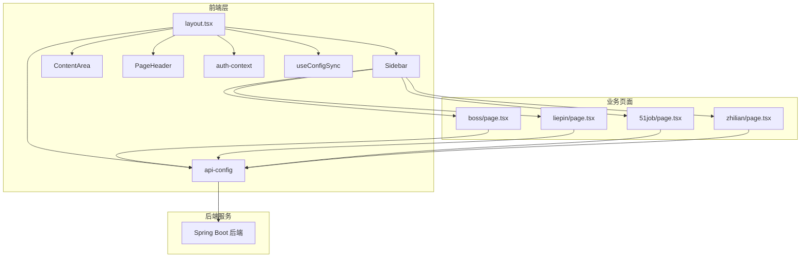
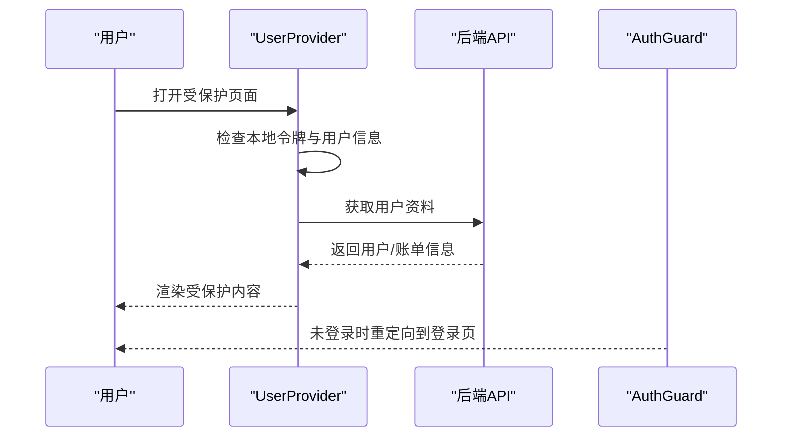
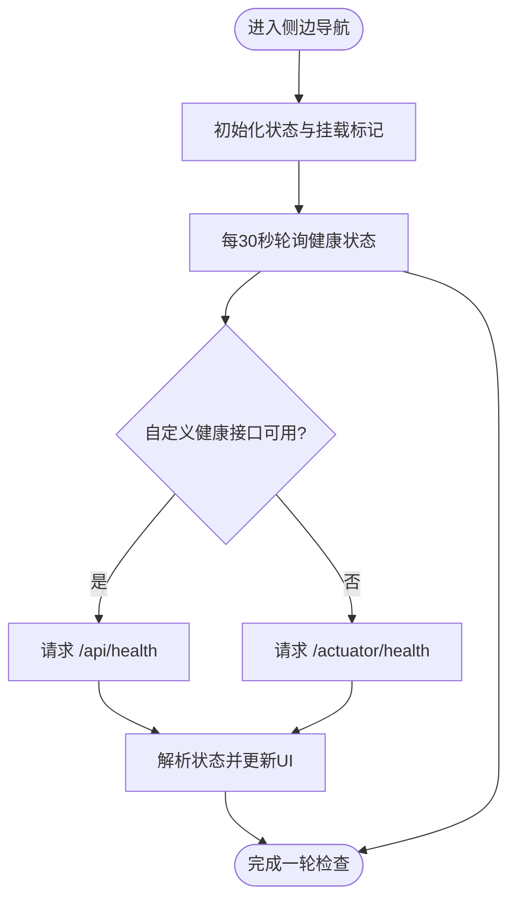
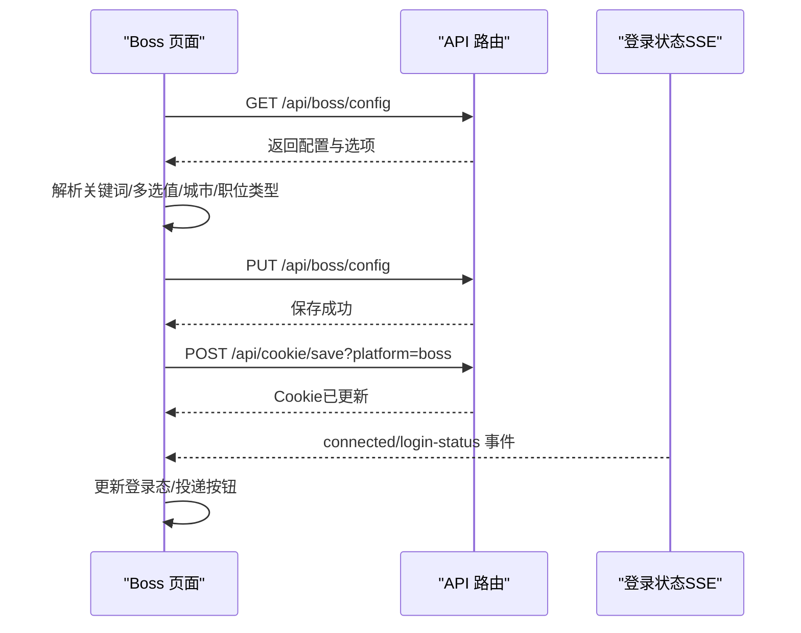
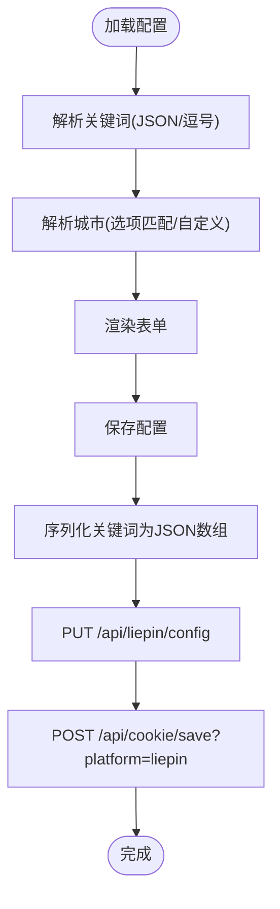
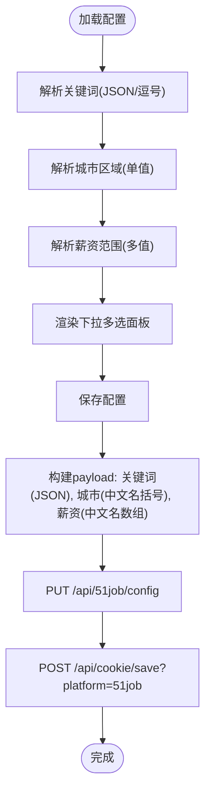
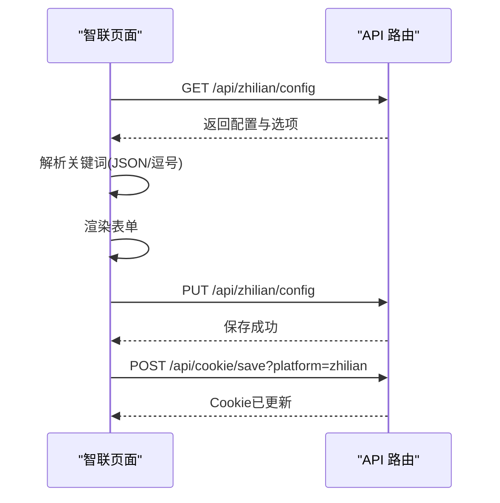
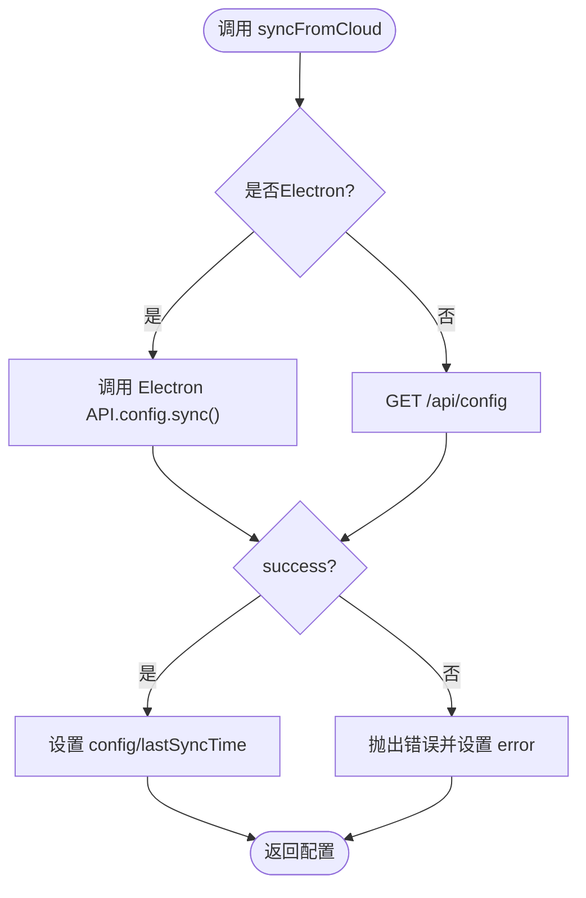
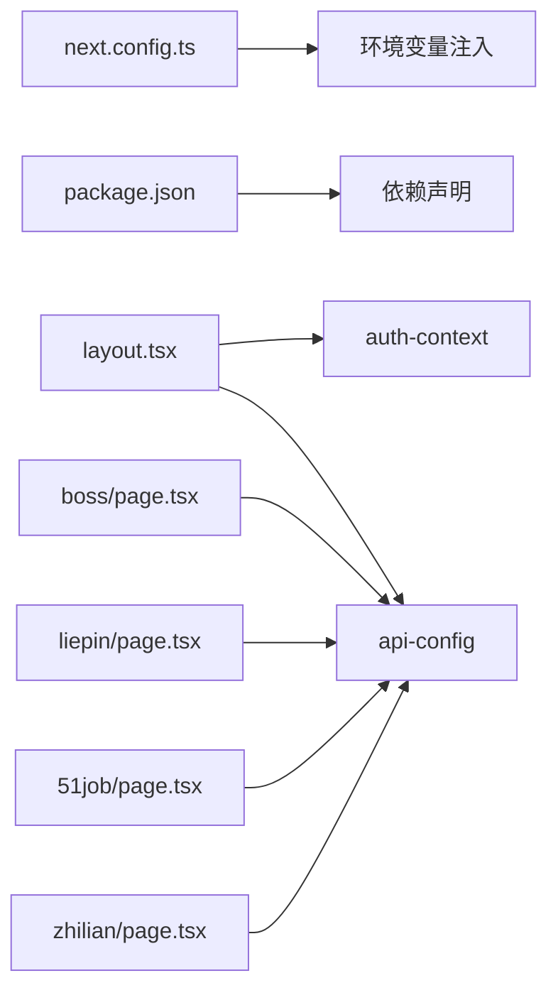

# 前端应用

<cite>
**本文引用的文件**
- [front/package.json](file://front/package.json)
- [front/next.config.ts](file://front/next.config.ts)
- [front/app/layout.tsx](file://front/app/layout.tsx)
- [front/lib/api-config.ts](file://front/lib/api-config.ts)
- [front/lib/auth-context.tsx](file://front/lib/auth-context.tsx)
- [front/app/components/Sidebar.tsx](file://front/app/components/Sidebar.tsx)
- [front/app/components/ContentArea.tsx](file://front/app/components/ContentArea.tsx)
- [front/app/components/PageHeader.tsx](file://front/app/components/PageHeader.tsx)
- [front/app/components/AuthGuard.tsx](file://front/app/components/AuthGuard.tsx)
- [front/app/boss/page.tsx](file://front/app/boss/page.tsx)
- [front/app/zhilian/page.tsx](file://front/app/zhilian/page.tsx)
- [front/app/51job/page.tsx](file://front/app/51job/page.tsx)
- [front/app/liepin/page.tsx](file://front/app/liepin/page.tsx)
- [front/hooks/useConfigSync.ts](file://front/hooks/useConfigSync.ts)
</cite>

## 目录
1. [简介](#简介)
2. [项目结构](#项目结构)
3. [核心组件](#核心组件)
4. [架构总览](#架构总览)
5. [详细组件分析](#详细组件分析)
6. [依赖关系分析](#依赖关系分析)
7. [性能考量](#性能考量)
8. [故障排查指南](#故障排查指南)
9. [结论](#结论)
10. [附录](#附录)

## 简介
本文件面向 GetJobs 前端应用，基于 Next.js 14 App Router 构建，采用现代化前端架构，提供用户界面与管理员界面的双端设计。系统围绕“招聘平台配置中心”展开，覆盖 Boss 直聘、猎聘、51job、智联招聘等平台的配置页面，统一通过 API 配置模块对接后端服务，并结合认证上下文、主题切换、Electron 状态栏等能力，形成完整的配置与投递控制体验。

## 项目结构
前端工程位于 front 目录，采用 Next.js 14 App Router 的 App 目录结构，页面按功能域划分（boss、liepin、51job、zhilian 等），并通过共享组件与工具模块实现复用。整体结构如下：

图示来源
- [front/app/layout.tsx:16-52](file://front/app/layout.tsx#L16-L52)
- [front/app/components/Sidebar.tsx:13-307](file://front/app/components/Sidebar.tsx#L13-L307)
- [front/app/components/ContentArea.tsx:6-23](file://front/app/components/ContentArea.tsx#L6-L23)
- [front/app/components/PageHeader.tsx:5-63](file://front/app/components/PageHeader.tsx#L5-L63)
- [front/lib/auth-context.tsx:35-109](file://front/lib/auth-context.tsx#L35-L109)
- [front/lib/api-config.ts:1-99](file://front/lib/api-config.ts#L1-L99)
- [front/hooks/useConfigSync.ts:16-96](file://front/hooks/useConfigSync.ts#L16-L96)
- [front/app/boss/page.tsx:76-554](file://front/app/boss/page.tsx#L76-L554)
- [front/app/liepin/page.tsx:35-266](file://front/app/liepin/page.tsx#L35-L266)
- [front/app/51job/page.tsx:30-400](file://front/app/51job/page.tsx#L30-L400)
- [front/app/zhilian/page.tsx:27-224](file://front/app/zhilian/page.tsx#L27-L224)
- [front/next.config.ts:6-20](file://front/next.config.ts#L6-L20)
- [front/package.json:1-43](file://front/package.json#L1-L43)

章节来源
- [front/next.config.ts:1-23](file://front/next.config.ts#L1-L23)
- [front/package.json:1-43](file://front/package.json#L1-L43)

## 核心组件
- 根布局与主题：根布局负责注入全局样式、主题切换、用户上下文、侧边栏与内容区容器，并按需动态加载 Electron 状态栏组件。
- 认证上下文：提供用户信息、账单信息、登录状态检查与登出流程，保证受保护页面的安全访问。
- 侧边导航：聚合环境配置、平台配置、用户与计费入口，内置健康检查状态指示器与主题切换。
- 内容区：基于路由变化的页面切换动画，提升交互流畅度。
- 页面标题：统一的页面头部组件，支持图标、副标题与操作区。
- 配置同步钩子：在 Electron 与后端 API 两种模式下提供云端配置同步与本地缓存读取能力。

章节来源
- [front/app/layout.tsx:16-52](file://front/app/layout.tsx#L16-L52)
- [front/lib/auth-context.tsx:35-109](file://front/lib/auth-context.tsx#L35-L109)
- [front/app/components/Sidebar.tsx:13-307](file://front/app/components/Sidebar.tsx#L13-L307)
- [front/app/components/ContentArea.tsx:6-23](file://front/app/components/ContentArea.tsx#L6-L23)
- [front/app/components/PageHeader.tsx:5-63](file://front/app/components/PageHeader.tsx#L5-L63)
- [front/hooks/useConfigSync.ts:16-96](file://front/hooks/useConfigSync.ts#L16-L96)

## 架构总览
系统采用“App Router + 客户端组件 + 自定义 Hook + 统一 API 配置”的架构，页面通过 API 配置模块调用后端接口，认证上下文保障安全访问，Electron 模式下通过本地 API 提供配置同步能力。

图示来源
- [front/app/layout.tsx:16-52](file://front/app/layout.tsx#L16-L52)
- [front/app/components/Sidebar.tsx:13-307](file://front/app/components/Sidebar.tsx#L13-L307)
- [front/app/components/ContentArea.tsx:6-23](file://front/app/components/ContentArea.tsx#L6-L23)
- [front/app/components/PageHeader.tsx:5-63](file://front/app/components/PageHeader.tsx#L5-L63)
- [front/lib/auth-context.tsx:35-109](file://front/lib/auth-context.tsx#L35-L109)
- [front/lib/api-config.ts:1-99](file://front/lib/api-config.ts#L1-L99)
- [front/hooks/useConfigSync.ts:16-96](file://front/hooks/useConfigSync.ts#L16-L96)
- [front/app/boss/page.tsx:76-554](file://front/app/boss/page.tsx#L76-L554)
- [front/app/liepin/page.tsx:35-266](file://front/app/liepin/page.tsx#L35-L266)
- [front/app/51job/page.tsx:30-400](file://front/app/51job/page.tsx#L30-L400)
- [front/app/zhilian/page.tsx:27-224](file://front/app/zhilian/page.tsx#L27-L224)

## 详细组件分析

### 认证与授权
- 认证上下文提供用户信息、账单信息、登录状态检查与登出流程；在初始化时尝试刷新用户资料，失败时从本地恢复，保证健壮性。
- AuthGuard 在受保护页面中拦截未登录用户，引导至登录页并携带重定向参数。

图示来源
- [front/lib/auth-context.tsx:47-94](file://front/lib/auth-context.tsx#L47-L94)
- [front/app/components/AuthGuard.tsx:18-31](file://front/app/components/AuthGuard.tsx#L18-L31)

章节来源
- [front/lib/auth-context.tsx:35-109](file://front/lib/auth-context.tsx#L35-L109)
- [front/app/components/AuthGuard.tsx:13-60](file://front/app/components/AuthGuard.tsx#L13-L60)

### 侧边导航与健康检查
- 侧边导航聚合环境配置与平台配置入口，内置健康检查轮询，支持主题切换与用户信息展示。
- 健康检查优先尝试自定义健康接口，失败时回退到 Spring Boot Actuator，避免单点依赖。

图示来源
- [front/app/components/Sidebar.tsx:27-66](file://front/app/components/Sidebar.tsx#L27-L66)

章节来源
- [front/app/components/Sidebar.tsx:13-307](file://front/app/components/Sidebar.tsx#L13-L307)

### Boss 直聘配置页面
- 页面职责：配置搜索关键词、城市、职位类型、行业、经验、学历、薪资、公司规模、融资阶段、HR活跃过滤等；支持保存配置、启动/停止投递、退出登录、查看分析。
- 数据流：首次加载获取配置与选项，解析括号列表与多选值，保存时将多选转为括号列表字符串，统一保存 Cookie。
- SSE：监听登录状态，实时更新登录态与投递按钮状态。

图示来源
- [front/app/boss/page.tsx:175-435](file://front/app/boss/page.tsx#L175-L435)
- [front/lib/api-config.ts:32-43](file://front/lib/api-config.ts#L32-L43)

章节来源
- [front/app/boss/page.tsx:76-554](file://front/app/boss/page.tsx#L76-L554)
- [front/lib/api-config.ts:32-43](file://front/lib/api-config.ts#L32-L43)

### 猎聘配置页面
- 页面职责：关键词、城市（支持手动输入城市码）、薪资范围（薪资码）配置；保存时将关键词序列化为 JSON 数组字符串，支持 Cookie 同步。
- 数据流：解析/序列化关键词，根据城市是否存在选项决定是否启用自定义输入模式。

图示来源
- [front/app/liepin/page.tsx:137-198](file://front/app/liepin/page.tsx#L137-L198)

章节来源
- [front/app/liepin/page.tsx:35-266](file://front/app/liepin/page.tsx#L35-L266)

### 51job 配置页面
- 页面职责：关键词、城市区域（支持手动输入城市码）、薪资范围（最多5个，多选）；保存时将城市区域与薪资范围转为中文名括号列表字符串，统一保存 Cookie。
- 数据流：解析/序列化关键词，解析单值/多值，渲染下拉多选面板，点击外部关闭面板。

图示来源
- [front/app/51job/page.tsx:137-255](file://front/app/51job/page.tsx#L137-L255)

章节来源
- [front/app/51job/page.tsx:30-400](file://front/app/51job/page.tsx#L30-L400)

### 智联招聘配置页面
- 页面职责：关键词、城市、薪资范围（最低与最高工资，逗号分隔）；保存时将关键词序列化为 JSON 数组字符串，统一保存 Cookie。
- 数据流：解析/序列化关键词，兼容中文逗号，支持后端可用性探测。

图示来源
- [front/app/zhilian/page.tsx:119-223](file://front/app/zhilian/page.tsx#L119-L223)
- [front/lib/api-config.ts:45-53](file://front/lib/api-config.ts#L45-L53)

章节来源
- [front/app/zhilian/page.tsx:27-224](file://front/app/zhilian/page.tsx#L27-L224)

### 配置同步钩子
- 在 Electron 模式下通过本地 API 同步云端配置；在浏览器模式下通过后端 API 获取配置，统一返回结构并记录最后同步时间。

图示来源
- [front/hooks/useConfigSync.ts:22-70](file://front/hooks/useConfigSync.ts#L22-L70)

章节来源
- [front/hooks/useConfigSync.ts:16-96](file://front/hooks/useConfigSync.ts#L16-L96)

## 依赖关系分析
- Next 配置：暴露 API 基础地址与应用信息到客户端，启用静态导出并禁用图片优化以适配静态部署。
- 依赖管理：使用 Next、React、Radix UI、Chart.js、TailwindCSS 等生态库，提供 UI 组件、图表与样式能力。
- 组件耦合：页面组件通过 API 配置模块解耦后端接口，认证上下文与布局组件解耦页面逻辑，提高内聚性与可维护性。

图示来源
- [front/next.config.ts:6-20](file://front/next.config.ts#L6-L20)
- [front/package.json:12-28](file://front/package.json#L12-L28)
- [front/app/layout.tsx:16-52](file://front/app/layout.tsx#L16-L52)
- [front/lib/api-config.ts:1-99](file://front/lib/api-config.ts#L1-L99)
- [front/app/boss/page.tsx:76-554](file://front/app/boss/page.tsx#L76-L554)
- [front/app/liepin/page.tsx:35-266](file://front/app/liepin/page.tsx#L35-L266)
- [front/app/51job/page.tsx:30-400](file://front/app/51job/page.tsx#L30-L400)
- [front/app/zhilian/page.tsx:27-224](file://front/app/zhilian/page.tsx#L27-L224)

章节来源
- [front/next.config.ts:1-23](file://front/next.config.ts#L1-L23)
- [front/package.json:1-43](file://front/package.json#L1-L43)

## 性能考量
- 静态导出与图片优化：Next 配置启用静态导出并禁用图片优化，减少运行时开销，适合独立部署场景。
- 路由切换动画：内容区基于路由键值进行页面切换动画，提升视觉连续性与交互感知。
- SSE 重连策略：登录状态监听采用带退避的 SSE 连接，降低频繁重连对资源的占用。
- 本地恢复机制：认证上下文在用户资料刷新失败时从本地恢复，避免阻断用户操作。

## 故障排查指南
- 登录状态异常：检查自定义健康接口与 Actuator 健康接口可用性，确认 SSE 连接是否建立。
- 配置保存失败：核对后端返回状态码与消息，确认 Cookie 同步是否成功。
- 页面加载缓慢：确认后端可用性探测与配置加载流程，避免不必要的重复请求。
- Electron 模式配置不同步：检查 Electron API.config.sync() 是否可用，确认返回结构与 lastSyncTime 字段。

章节来源
- [front/app/components/Sidebar.tsx:27-66](file://front/app/components/Sidebar.tsx#L27-L66)
- [front/lib/auth-context.tsx:47-94](file://front/lib/auth-context.tsx#L47-L94)
- [front/hooks/useConfigSync.ts:22-70](file://front/hooks/useConfigSync.ts#L22-L70)

## 结论
该前端应用以 Next.js 14 App Router 为基础，结合统一 API 配置、认证上下文与 Electron 模式支持，实现了跨平台的招聘平台配置中心。页面围绕 Boss、猎聘、51job、智联招聘四大平台展开，通过一致的数据解析与保存策略、SSE 实时状态监听与弹窗反馈机制，提供了稳定、直观且可扩展的配置体验。建议后续持续优化错误边界与加载状态提示，进一步增强用户体验与可维护性。

## 附录
- API 路由一览：详见 API 配置模块，涵盖健康检查、Cookie 管理、环境配置、公共选项、搜索预设、各平台配置与投递控制、用户认证与计费订阅等。
- 配置同步：支持 Electron 与后端 API 两种模式，统一返回结构并记录最后同步时间，便于前端缓存与展示。

章节来源
- [front/lib/api-config.ts:1-99](file://front/lib/api-config.ts#L1-L99)
- [front/hooks/useConfigSync.ts:16-96](file://front/hooks/useConfigSync.ts#L16-L96)