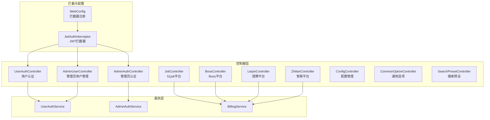
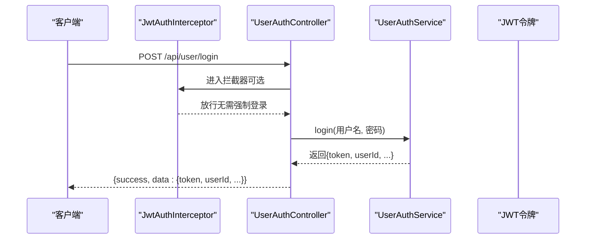
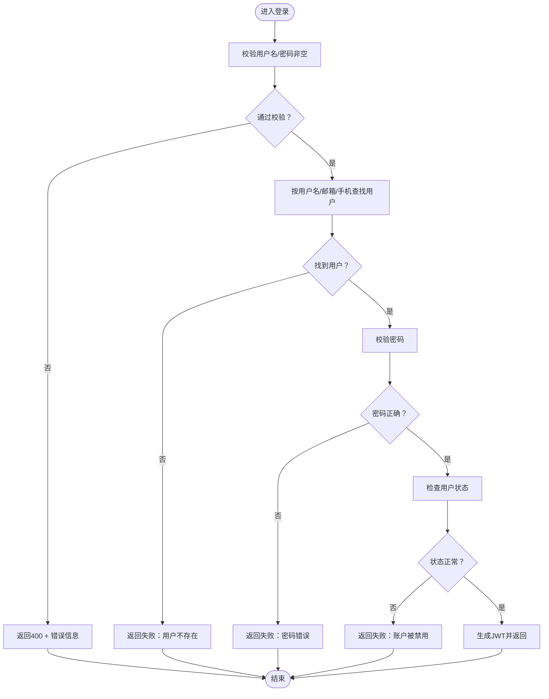
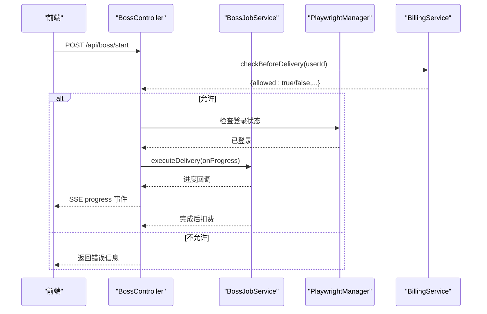
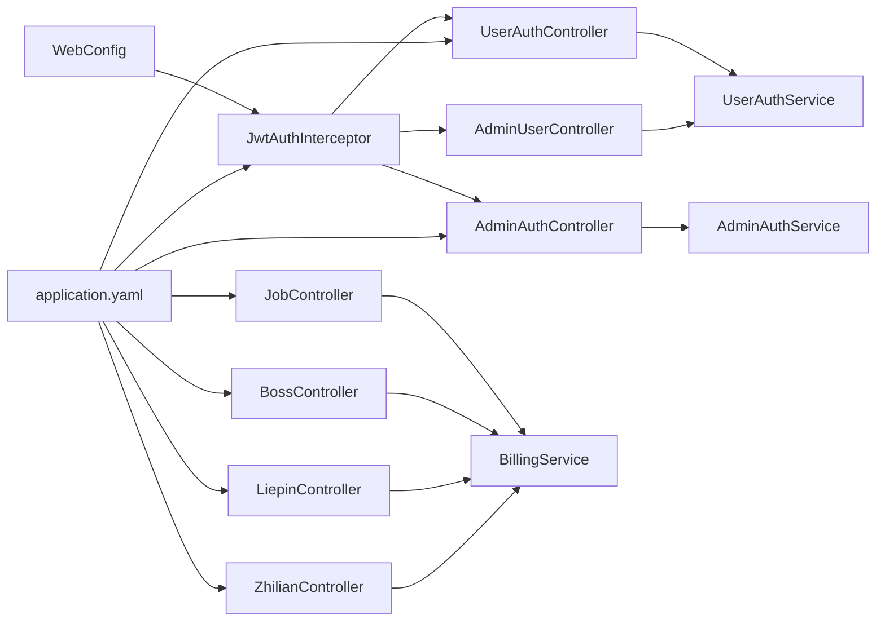

# Controller 层设计

<cite>
**本文引用的文件**
- [AdminAuthController.java](file://backend/src/main/java/com/getjobs/application/controller/AdminAuthController.java)
- [UserAuthController.java](file://backend/src/main/java/com/getjobs/application/controller/UserAuthController.java)
- [JobController.java](file://backend/src/main/java/com/getjobs/application/controller/JobController.java)
- [ConfigController.java](file://backend/src/main/java/com/getjobs/application/controller/ConfigController.java)
- [AdminUserController.java](file://backend/src/main/java/com/getjobs/application/controller/AdminUserController.java)
- [BossController.java](file://backend/src/main/java/com/getjobs/application/controller/BossController.java)
- [LiepinController.java](file://backend/src/main/java/com/getjobs/application/controller/LiepinController.java)
- [ZhilianController.java](file://backend/src/main/java/com/getjobs/application/controller/ZhilianController.java)
- [CommonOptionController.java](file://backend/src/main/java/com/getjobs/application/controller/CommonOptionController.java)
- [SearchPresetController.java](file://backend/src/main/java/com/getjobs/application/controller/SearchPresetController.java)
- [WebConfig.java](file://backend/src/main/java/com/getjobs/application/config/WebConfig.java)
- [JwtAuthInterceptor.java](file://backend/src/main/java/com/getjobs/application/interceptor/JwtAuthInterceptor.java)
- [UserAuthService.java](file://backend/src/main/java/com/getjobs/application/service/UserAuthService.java)
- [AdminAuthService.java](file://backend/src/main/java/com/getjobs/application/service/AdminAuthService.java)
- [BillingService.java](file://backend/src/main/java/com/getjobs/application/service/BillingService.java)
- [application.yaml](file://backend/src/main/resources/application.yaml)
</cite>

## 目录
1. [简介](#简介)
2. [项目结构](#项目结构)
3. [核心组件](#核心组件)
4. [架构总览](#架构总览)
5. [详细组件分析](#详细组件分析)
6. [依赖分析](#依赖分析)
7. [性能考虑](#性能考虑)
8. [故障排查指南](#故障排查指南)
9. [结论](#结论)
10. [附录](#附录)

## 简介
本文件面向 Controller 层设计，系统化梳理基于 Spring MVC 的控制器架构与 RESTful API 设计原则，覆盖用户认证、管理员管理、求职平台对接（Boss、51job、猎聘、智联）、配置管理、通用选项与搜索预设等模块。文档重点阐述：
- HTTP 请求处理流程与路由组织
- 参数校验、响应格式化与异常处理策略
- JWT 认证拦截与权限控制
- SSE 实时事件推送与异步任务编排
- 计费与配额控制在 API 中的体现
- Swagger 文档生成、API 版本管理与接口测试方法

## 项目结构
后端采用标准 Spring Boot 结构，Controller 层位于 application.controller 包下，围绕业务域划分控制器，统一通过 @RestController 提供 REST API，并通过 @RequestMapping 组织路由前缀。

图示来源
- [UserAuthController.java:15-167](file://backend/src/main/java/com/getjobs/application/controller/UserAuthController.java#L15-L167)
- [AdminAuthController.java:14-87](file://backend/src/main/java/com/getjobs/application/controller/AdminAuthController.java#L14-L87)
- [AdminUserController.java:16-187](file://backend/src/main/java/com/getjobs/application/controller/AdminUserController.java#L16-L187)
- [JobController.java:38-589](file://backend/src/main/java/com/getjobs/application/controller/JobController.java#L38-L589)
- [BossController.java:29-246](file://backend/src/main/java/com/getjobs/application/controller/BossController.java#L29-L246)
- [LiepinController.java:25-369](file://backend/src/main/java/com/getjobs/application/controller/LiepinController.java#L25-L369)
- [ZhilianController.java:25-414](file://backend/src/main/java/com/getjobs/application/controller/ZhilianController.java#L25-L414)
- [ConfigController.java:16-171](file://backend/src/main/java/com/getjobs/application/controller/ConfigController.java#L16-L171)
- [CommonOptionController.java:14-113](file://backend/src/main/java/com/getjobs/application/controller/CommonOptionController.java#L14-L113)
- [SearchPresetController.java:13-70](file://backend/src/main/java/com/getjobs/application/controller/SearchPresetController.java#L13-L70)
- [JwtAuthInterceptor.java:20-75](file://backend/src/main/java/com/getjobs/application/interceptor/JwtAuthInterceptor.java#L20-L75)
- [WebConfig.java:13-37](file://backend/src/main/java/com/getjobs/application/config/WebConfig.java#L13-L37)

章节来源
- [UserAuthController.java:15-167](file://backend/src/main/java/com/getjobs/application/controller/UserAuthController.java#L15-L167)
- [AdminAuthController.java:14-87](file://backend/src/main/java/com/getjobs/application/controller/AdminAuthController.java#L14-L87)
- [AdminUserController.java:16-187](file://backend/src/main/java/com/getjobs/application/controller/AdminUserController.java#L16-L187)
- [JobController.java:38-589](file://backend/src/main/java/com/getjobs/application/controller/JobController.java#L38-L589)
- [BossController.java:29-246](file://backend/src/main/java/com/getjobs/application/controller/BossController.java#L29-L246)
- [LiepinController.java:25-369](file://backend/src/main/java/com/getjobs/application/controller/LiepinController.java#L25-L369)
- [ZhilianController.java:25-414](file://backend/src/main/java/com/getjobs/application/controller/ZhilianController.java#L25-L414)
- [ConfigController.java:16-171](file://backend/src/main/java/com/getjobs/application/controller/ConfigController.java#L16-L171)
- [CommonOptionController.java:14-113](file://backend/src/main/java/com/getjobs/application/controller/CommonOptionController.java#L14-L113)
- [SearchPresetController.java:13-70](file://backend/src/main/java/com/getjobs/application/controller/SearchPresetController.java#L13-L70)
- [WebConfig.java:13-37](file://backend/src/main/java/com/getjobs/application/config/WebConfig.java#L13-L37)
- [JwtAuthInterceptor.java:20-75](file://backend/src/main/java/com/getjobs/application/interceptor/JwtAuthInterceptor.java#L20-L75)

## 核心组件
- 用户认证控制器：负责用户注册、登录、资料查询与修改、密码变更；通过拦截器注入用户标识，结合服务层生成 JWT。
- 管理员认证控制器：提供管理员登录与 Token 校验，用于后台管理系统的鉴权。
- 管理员用户控制器：提供用户列表、详情、启停、充值记录、创建/更新/删除等管理操作。
- 平台控制器（Boss/51job/猎聘/智联）：统一提供登录状态检查、登录/退出、Cookie 管理、任务启动/停止/状态查询、SSE 实时进度推送、统计数据与岗位列表等。
- 配置控制器：提供配置的批量读取、单键读取、批量更新与单键更新。
- 通用选项与搜索预设控制器：提供通用选项的增删改与排序调整，以及搜索预设的 CRUD。
- 拦截器与配置：统一注册 JWT 拦截器，排除无需鉴权的端点，实现跨域与路径匹配。

章节来源
- [UserAuthController.java:15-167](file://backend/src/main/java/com/getjobs/application/controller/UserAuthController.java#L15-L167)
- [AdminAuthController.java:14-87](file://backend/src/main/java/com/getjobs/application/controller/AdminAuthController.java#L14-L87)
- [AdminUserController.java:16-187](file://backend/src/main/java/com/getjobs/application/controller/AdminUserController.java#L16-L187)
- [JobController.java:38-589](file://backend/src/main/java/com/getjobs/application/controller/JobController.java#L38-L589)
- [BossController.java:29-246](file://backend/src/main/java/com/getjobs/application/controller/BossController.java#L29-L246)
- [LiepinController.java:25-369](file://backend/src/main/java/com/getjobs/application/controller/LiepinController.java#L25-L369)
- [ZhilianController.java:25-414](file://backend/src/main/java/com/getjobs/application/controller/ZhilianController.java#L25-L414)
- [ConfigController.java:16-171](file://backend/src/main/java/com/getjobs/application/controller/ConfigController.java#L16-L171)
- [CommonOptionController.java:14-113](file://backend/src/main/java/com/getjobs/application/controller/CommonOptionController.java#L14-L113)
- [SearchPresetController.java:13-70](file://backend/src/main/java/com/getjobs/application/controller/SearchPresetController.java#L13-L70)
- [WebConfig.java:13-37](file://backend/src/main/java/com/getjobs/application/config/WebConfig.java#L13-L37)
- [JwtAuthInterceptor.java:20-75](file://backend/src/main/java/com/getjobs/application/interceptor/JwtAuthInterceptor.java#L20-L75)

## 架构总览
Spring MVC 控制器通过注解驱动的路由映射，结合拦截器进行统一鉴权，服务层封装业务逻辑与数据访问，控制器以统一的响应结构返回结果。平台控制器引入 SSE 与异步任务，实现进度推送与非阻塞执行。

图示来源
- [UserAuthController.java:61-80](file://backend/src/main/java/com/getjobs/application/controller/UserAuthController.java#L61-L80)
- [JwtAuthInterceptor.java:32-73](file://backend/src/main/java/com/getjobs/application/interceptor/JwtAuthInterceptor.java#L32-L73)
- [UserAuthService.java:122-168](file://backend/src/main/java/com/getjobs/application/service/UserAuthService.java#L122-L168)

章节来源
- [UserAuthController.java:15-167](file://backend/src/main/java/com/getjobs/application/controller/UserAuthController.java#L15-L167)
- [JwtAuthInterceptor.java:20-75](file://backend/src/main/java/com/getjobs/application/interceptor/JwtAuthInterceptor.java#L20-L75)
- [UserAuthService.java:122-168](file://backend/src/main/java/com/getjobs/application/service/UserAuthService.java#L122-L168)

## 详细组件分析

### 用户认证控制器（UserAuthController）
- 功能职责
  - 用户注册：校验必填字段与密码长度，调用服务层创建用户并初始化余额。
  - 用户登录：支持用户名/邮箱/手机登录，校验状态与密码，签发 JWT。
  - 获取/更新用户资料：通过拦截器注入的 userId 获取与更新用户信息。
  - 修改密码：校验旧密码正确性后更新。
- 参数校验与响应
  - 对必填字段进行判空校验，短路返回错误响应。
  - 统一响应结构：{success, message, data 或错误信息}。
- 异常处理
  - 服务层抛出的业务异常在控制器内捕获并转换为标准响应。
- 最佳实践
  - 在需要登录保护的接口上，通过拦截器注入 userId，控制器仅做业务判断。
  - 密码使用 BCrypt 存储，避免明文存储。

图示来源
- [UserAuthController.java:61-80](file://backend/src/main/java/com/getjobs/application/controller/UserAuthController.java#L61-L80)
- [UserAuthService.java:122-168](file://backend/src/main/java/com/getjobs/application/service/UserAuthService.java#L122-L168)

章节来源
- [UserAuthController.java:15-167](file://backend/src/main/java/com/getjobs/application/controller/UserAuthController.java#L15-L167)
- [UserAuthService.java:49-113](file://backend/src/main/java/com/getjobs/application/service/UserAuthService.java#L49-L113)

### 管理员认证控制器（AdminAuthController）
- 功能职责
  - 管理员登录：校验用户名与密码，签发管理员 JWT。
  - Token 校验：从 Authorization 头解析 Bearer Token，验证并返回用户信息。
- 参数校验与响应
  - 对 Authorization 头进行格式校验，非法格式返回 401。
  - Token 解析失败或过期返回相应错误信息。
- 最佳实践
  - 管理员与用户使用不同密钥与过期策略，避免混淆。

章节来源
- [AdminAuthController.java:14-87](file://backend/src/main/java/com/getjobs/application/controller/AdminAuthController.java#L14-L87)
- [AdminAuthService.java:56-75](file://backend/src/main/java/com/getjobs/application/service/AdminAuthService.java#L56-L75)

### 管理员用户控制器（AdminUserController）
- 功能职责
  - 用户列表与详情查询、启停用户、查看充值记录、创建/更新/删除用户。
- 参数校验与响应
  - 分页参数默认值与可选过滤参数，统一返回 {success, data}。
  - 创建用户时对用户名与密码进行非空校验。
- 最佳实践
  - 使用事务保证创建用户与初始化余额的一致性。

章节来源
- [AdminUserController.java:16-187](file://backend/src/main/java/com/getjobs/application/controller/AdminUserController.java#L16-L187)

### 平台控制器（Boss/51job/猎聘/智联）
- 功能职责
  - 登录状态检查、触发登录、退出登录、Cookie 读取与保存。
  - 任务启动/停止/状态查询，SSE 实时进度推送，心跳保活。
  - 配置读取与更新（平台特定），统计数据与岗位列表（分页+筛选）。
- 参数校验与响应
  - 登录状态检查与任务控制均返回统一结构，包含 success/message/status。
  - SSE 连接建立后发送 connected 事件，心跳发送 ping 事件。
- 异常处理
  - SSE 发送异常区分客户端断开与服务端错误，及时清理失效连接。
  - 任务执行异常记录日志，不影响其他连接。
- 最佳实践
  - 任务启动前进行计费检查，避免无权限操作。
  - 登录状态变更通过 SSE 广播，前端即时感知。

图示来源
- [BossController.java:90-148](file://backend/src/main/java/com/getjobs/application/controller/BossController.java#L90-L148)
- [BillingService.java:35-65](file://backend/src/main/java/com/getjobs/application/service/BillingService.java#L35-L65)

章节来源
- [BossController.java:29-246](file://backend/src/main/java/com/getjobs/application/controller/BossController.java#L29-L246)
- [LiepinController.java:25-369](file://backend/src/main/java/com/getjobs/application/controller/LiepinController.java#L25-L369)
- [ZhilianController.java:25-414](file://backend/src/main/java/com/getjobs/application/controller/ZhilianController.java#L25-L414)
- [JobController.java:38-589](file://backend/src/main/java/com/getjobs/application/controller/JobController.java#L38-L589)
- [BillingService.java:35-130](file://backend/src/main/java/com/getjobs/application/service/BillingService.java#L35-L130)

### 配置控制器（ConfigController）
- 功能职责
  - 获取全部配置、按键获取配置、批量更新配置、单键更新配置、健康检查。
- 参数校验与响应
  - 批量更新时对请求体进行非空校验，返回更新条数。
  - 单键更新时对 value 进行非空校验。
- 最佳实践
  - 健康检查接口便于外部监控与探活。

章节来源
- [ConfigController.java:16-171](file://backend/src/main/java/com/getjobs/application/controller/ConfigController.java#L16-L171)

### 通用选项与搜索预设控制器
- 功能职责
  - 通用选项：按类型过滤、创建/批量创建、更新、删除、批量排序更新。
  - 搜索预设：列表、创建、更新、删除。
- 参数校验与响应
  - 创建/更新时统一设置时间戳，批量排序更新接收数组格式。
- 最佳实践
  - 通用选项支持排序字段，便于前端展示顺序控制。

章节来源
- [CommonOptionController.java:14-113](file://backend/src/main/java/com/getjobs/application/controller/CommonOptionController.java#L14-L113)
- [SearchPresetController.java:13-70](file://backend/src/main/java/com/getjobs/application/controller/SearchPresetController.java#L13-L70)

## 依赖分析
- 控制器与服务层
  - 用户/管理员认证控制器依赖对应服务层进行业务处理与数据访问。
  - 平台控制器依赖计费服务进行投递前检查与投递后扣费。
- 拦截器与控制器
  - JwtAuthInterceptor 在 preHandle 中解析 Authorization 头，将 userId 注入请求属性，供控制器使用。
  - WebConfig 注册拦截器并对路径进行匹配，排除无需鉴权的端点。
- 配置
  - application.yaml 提供 JWT 密钥、过期时间、Playwright Agent 超时与资源限制等全局配置。

图示来源
- [UserAuthController.java:15-167](file://backend/src/main/java/com/getjobs/application/controller/UserAuthController.java#L15-L167)
- [AdminAuthController.java:14-87](file://backend/src/main/java/com/getjobs/application/controller/AdminAuthController.java#L14-L87)
- [AdminUserController.java:16-187](file://backend/src/main/java/com/getjobs/application/controller/AdminUserController.java#L16-L187)
- [JobController.java:38-589](file://backend/src/main/java/com/getjobs/application/controller/JobController.java#L38-L589)
- [BossController.java:29-246](file://backend/src/main/java/com/getjobs/application/controller/BossController.java#L29-L246)
- [LiepinController.java:25-369](file://backend/src/main/java/com/getjobs/application/controller/LiepinController.java#L25-L369)
- [ZhilianController.java:25-414](file://backend/src/main/java/com/getjobs/application/controller/ZhilianController.java#L25-L414)
- [JwtAuthInterceptor.java:20-75](file://backend/src/main/java/com/getjobs/application/interceptor/JwtAuthInterceptor.java#L20-L75)
- [WebConfig.java:13-37](file://backend/src/main/java/com/getjobs/application/config/WebConfig.java#L13-L37)
- [application.yaml:53-91](file://backend/src/main/resources/application.yaml#L53-L91)

章节来源
- [JwtAuthInterceptor.java:20-75](file://backend/src/main/java/com/getjobs/application/interceptor/JwtAuthInterceptor.java#L20-L75)
- [WebConfig.java:13-37](file://backend/src/main/java/com/getjobs/application/config/WebConfig.java#L13-L37)
- [application.yaml:53-91](file://backend/src/main/resources/application.yaml#L53-L91)

## 性能考虑
- SSE 连接管理
  - 使用 CopyOnWriteArrayList 管理 SSE 连接，避免并发写入问题。
  - 心跳机制定期发送 ping 事件，维持长连接活跃，异常断开时清理失效连接。
- 异步任务
  - 平台任务通过 CompletableFuture 异步执行，避免阻塞请求线程。
- 计费检查
  - 投递前快速检查余额与订阅状态，减少无效执行。
- 配置优化
  - Playwright Agent 的超时与重试策略在 application.yaml 中集中配置，便于调优。

## 故障排查指南
- 认证失败
  - 检查 Authorization 头格式是否为 Bearer Token，密钥是否正确。
  - 查看拦截器日志，确认 token 解析与 userId 注入是否成功。
- SSE 连接异常
  - 关注客户端断开与服务端异常的区别处理，确保连接移除与资源释放。
- 任务执行失败
  - 查看服务层日志，定位具体平台的异常原因（如登录状态、网络超时）。
- 计费相关
  - 检查用户余额与订阅状态，确认投递数量与平台是否正确记录。

章节来源
- [JwtAuthInterceptor.java:32-73](file://backend/src/main/java/com/getjobs/application/interceptor/JwtAuthInterceptor.java#L32-L73)
- [JobController.java:136-184](file://backend/src/main/java/com/getjobs/application/controller/JobController.java#L136-L184)
- [BossController.java:202-221](file://backend/src/main/java/com/getjobs/application/controller/BossController.java#L202-L221)
- [BillingService.java:76-130](file://backend/src/main/java/com/getjobs/application/service/BillingService.java#L76-L130)

## 结论
本 Controller 层设计遵循 Spring MVC 的约定优于配置原则，通过清晰的路由组织、统一的响应结构与拦截器鉴权，实现了用户认证、管理员管理、多平台求职自动化与配置管理的完整闭环。配合 SSE 与异步任务，满足实时反馈与高并发场景需求。建议在后续迭代中完善参数校验与响应模型的契约化（如 DTO），并引入 Swagger/OpenAPI 自动生成与版本化管理，提升接口文档质量与测试效率。

## 附录

### Swagger 文档生成与 API 版本管理
- 建议引入 SpringDoc OpenAPI 依赖，在控制器类与方法上添加注解，自动生成接口文档。
- API 版本可通过路径前缀（如 /api/v1）或媒体类型协商实现，结合网关或反向代理进行路由转发。

[本节为概念性指导，不直接分析具体文件]

### 接口测试方法
- 单元测试：针对控制器的请求参数与响应结构进行断言，模拟拦截器注入的 userId。
- 集成测试：使用 Testcontainers 启动 MySQL 与 Redis，模拟真实环境下的认证与业务流程。
- 压力测试：对 SSE 与异步任务接口进行并发压测，评估连接池与资源限制配置。

[本节为概念性指导，不直接分析具体文件]