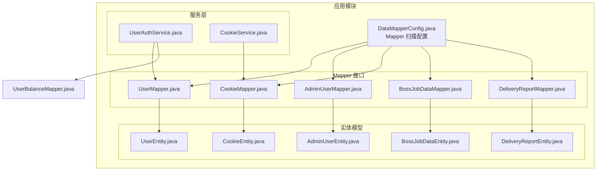
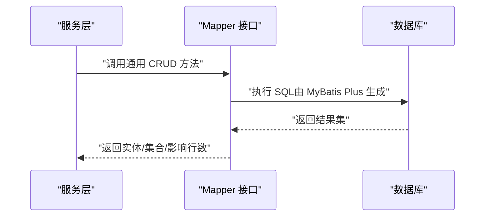
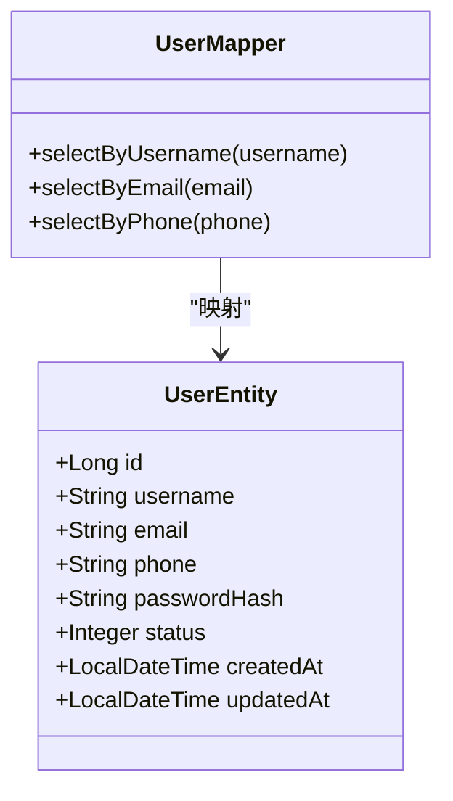
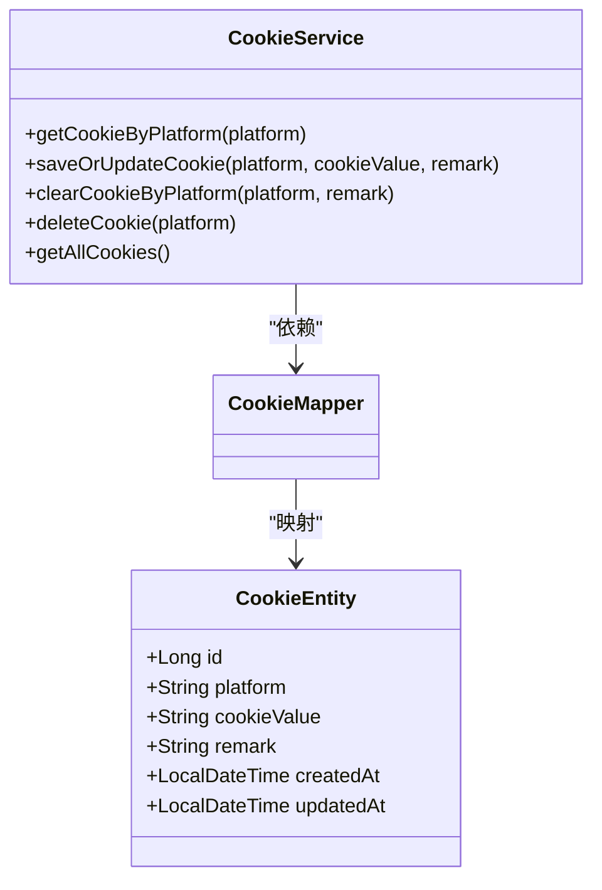
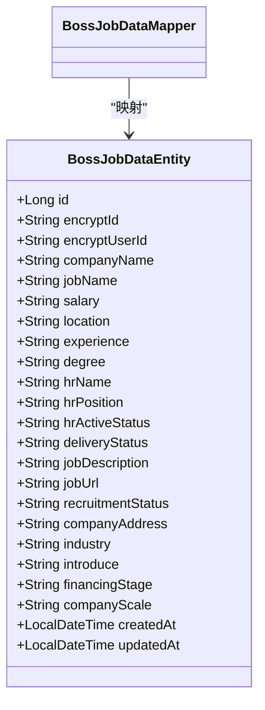
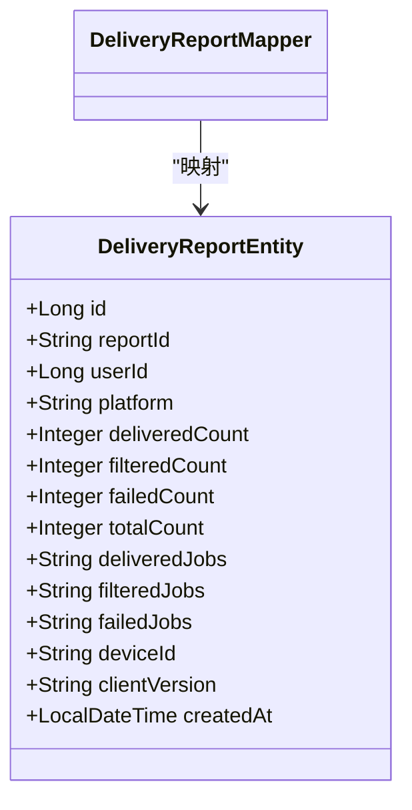
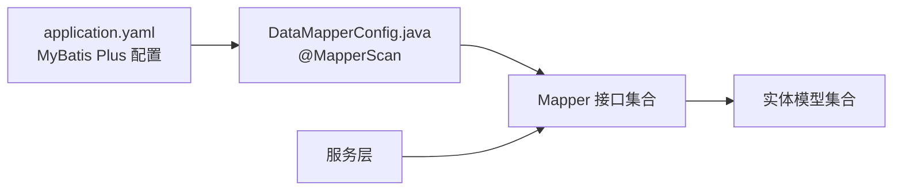

# Mapper 层设计

<cite>
**本文引用的文件**
- [application.yaml](file://backend/src/main/resources/application.yaml)
- [DataMapperConfig.java](file://backend/src/main/java/com/getjobs/application/config/DataMapperConfig.java)
- [UserMapper.java](file://backend/src/main/java/com/getjobs/application/mapper/UserMapper.java)
- [UserEntity.java](file://backend/src/main/java/com/getjobs/application/entity/UserEntity.java)
- [AdminUserMapper.java](file://backend/src/main/java/com/getjobs/application/mapper/AdminUserMapper.java)
- [CookieMapper.java](file://backend/src/main/java/com/getjobs/application/mapper/CookieMapper.java)
- [CookieEntity.java](file://backend/src/main/java/com/getjobs/application/entity/CookieEntity.java)
- [BossJobDataMapper.java](file://backend/src/main/java/com/getjobs/application/mapper/BossJobDataMapper.java)
- [BossJobDataEntity.java](file://backend/src/main/java/com/getjobs/application/entity/BossJobDataEntity.java)
- [DeliveryReportMapper.java](file://backend/src/main/java/com/getjobs/application/mapper/DeliveryReportMapper.java)
- [DeliveryReportEntity.java](file://backend/src/main/java/com/getjobs/application/entity/DeliveryReportEntity.java)
- [UserAuthService.java](file://backend/src/main/java/com/getjobs/application/service/UserAuthService.java)
- [CookieService.java](file://backend/src/main/java/com/getjobs/application/service/CookieService.java)
</cite>

## 目录
1. [简介](#简介)
2. [项目结构](#项目结构)
3. [核心组件](#核心组件)
4. [架构总览](#架构总览)
5. [详细组件分析](#详细组件分析)
6. [依赖分析](#依赖分析)
7. [性能考虑](#性能考虑)
8. [故障排查指南](#故障排查指南)
9. [结论](#结论)
10. [附录](#附录)

## 简介
本文件面向数据访问层（Mapper）的设计与实现，围绕 MyBatis Plus 在本项目中的使用方式进行系统化梳理，重点覆盖以下方面：
- 实体映射与表结构约定
- SQL 生成与查询优化策略
- 通用 CRUD 与复杂查询最佳实践
- 条件构造器与动态 SQL 使用
- 分页查询与批量操作建议
- 典型 Mapper 接口与其实现要点（用户、Cookie、Boss 招聘数据、投递报告等）

目标是帮助开发者在不直接阅读代码的情况下，也能高效理解并正确使用 Mapper 层完成数据持久化任务。

## 项目结构
后端采用标准的分层架构，Mapper 层位于 application 模块下，遵循“按功能域划分”的包组织方式：
- entity：领域实体，通过注解映射数据库表
- mapper：MyBatis Plus Mapper 接口，继承 BaseMapper 即可获得通用 CRUD
- service：业务服务，组合 Mapper 完成复杂流程
- config：MyBatis Plus 扫描与全局配置

图表来源
- [DataMapperConfig.java:1-14](file://backend/src/main/java/com/getjobs/application/config/DataMapperConfig.java#L1-L14)
- [UserMapper.java:1-35](file://backend/src/main/java/com/getjobs/application/mapper/UserMapper.java#L1-L35)
- [AdminUserMapper.java:1-21](file://backend/src/main/java/com/getjobs/application/mapper/AdminUserMapper.java#L1-L21)
- [CookieMapper.java:1-11](file://backend/src/main/java/com/getjobs/application/mapper/CookieMapper.java#L1-L11)
- [BossJobDataMapper.java:1-9](file://backend/src/main/java/com/getjobs/application/mapper/BossJobDataMapper.java#L1-L9)
- [DeliveryReportMapper.java:1-12](file://backend/src/main/java/com/getjobs/application/mapper/DeliveryReportMapper.java#L1-L12)
- [UserEntity.java:1-41](file://backend/src/main/java/com/getjobs/application/entity/UserEntity.java#L1-L41)
- [CookieEntity.java:1-54](file://backend/src/main/java/com/getjobs/application/entity/CookieEntity.java#L1-L54)
- [BossJobDataEntity.java:1-108](file://backend/src/main/java/com/getjobs/application/entity/BossJobDataEntity.java#L1-L108)
- [DeliveryReportEntity.java:1-59](file://backend/src/main/java/com/getjobs/application/entity/DeliveryReportEntity.java#L1-L59)
- [UserAuthService.java:1-311](file://backend/src/main/java/com/getjobs/application/service/UserAuthService.java#L1-L311)
- [CookieService.java:1-97](file://backend/src/main/java/com/getjobs/application/service/CookieService.java#L1-L97)

章节来源
- [DataMapperConfig.java:1-14](file://backend/src/main/java/com/getjobs/application/config/DataMapperConfig.java#L1-L14)
- [application.yaml:54-62](file://backend/src/main/resources/application.yaml#L54-L62)

## 核心组件
- Mapper 接口统一继承 BaseMapper，即可获得完整的通用 CRUD 能力，无需编写 XML。
- 通过注解与命名规范实现实体到表的映射，如 @TableName、@TableId、@TableField。
- 针对高频查询，提供默认方法或自定义注解查询，减少样板代码。
- 服务层通过注入 Mapper 完成事务控制与复杂业务编排。

章节来源
- [UserMapper.java:12-35](file://backend/src/main/java/com/getjobs/application/mapper/UserMapper.java#L12-L35)
- [AdminUserMapper.java:10-21](file://backend/src/main/java/com/getjobs/application/mapper/AdminUserMapper.java#L10-L21)
- [CookieMapper.java:9-11](file://backend/src/main/java/com/getjobs/application/mapper/CookieMapper.java#L9-L11)
- [BossJobDataMapper.java:7-9](file://backend/src/main/java/com/getjobs/application/mapper/BossJobDataMapper.java#L7-L9)
- [DeliveryReportMapper.java:10-12](file://backend/src/main/java/com/getjobs/application/mapper/DeliveryReportMapper.java#L10-L12)

## 架构总览
Mapper 层与服务层的交互遵循“接口隔离 + 依赖注入”原则，服务层通过构造器注入 Mapper，避免循环依赖；配置层负责扫描与全局设置。

图表来源
- [UserAuthService.java:32-34](file://backend/src/main/java/com/getjobs/application/service/UserAuthService.java#L32-L34)
- [CookieService.java:20](file://backend/src/main/java/com/getjobs/application/service/CookieService.java#L20)
- [DataMapperConfig.java:11](file://backend/src/main/java/com/getjobs/application/config/DataMapperConfig.java#L11)

## 详细组件分析

### 用户数据访问（UserMapper 与 UserEntity）
- 实体映射
  - 表名为 user，主键使用自增 ID 类型。
  - 字段包含用户名、邮箱、手机、密码哈希、状态、创建/更新时间等。
- 查询能力
  - 提供按用户名、邮箱、手机号的查询方法；用户名查询以默认方法封装 QueryWrapper。
  - 邮箱与手机号查询通过 @Select 注解直接声明 SQL。
- 服务层使用
  - UserAuthService 在注册、登录、更新资料、改密等流程中频繁调用 UserMapper。

图表来源
- [UserEntity.java:14-41](file://backend/src/main/java/com/getjobs/application/entity/UserEntity.java#L14-L41)
- [UserMapper.java:13-35](file://backend/src/main/java/com/getjobs/application/mapper/UserMapper.java#L13-L35)

章节来源
- [UserEntity.java:14-41](file://backend/src/main/java/com/getjobs/application/entity/UserEntity.java#L14-L41)
- [UserMapper.java:18-33](file://backend/src/main/java/com/getjobs/application/mapper/UserMapper.java#L18-L33)
- [UserAuthService.java:50-113](file://backend/src/main/java/com/getjobs/application/service/UserAuthService.java#L50-L113)

### Cookie 管理（CookieMapper 与 CookieEntity）
- 实体映射
  - 表名为 cookie，字段包含平台、Cookie 值、备注、创建/更新时间。
- 查询与维护
  - 通过 LambdaQueryWrapper 按平台查询最新一条记录，并支持保存/更新、清空、删除等操作。
- 服务层使用
  - CookieService 封装了按平台获取、保存或更新、清理以及删除 Cookie 的逻辑。

图表来源
- [CookieEntity.java:15-54](file://backend/src/main/java/com/getjobs/application/entity/CookieEntity.java#L15-L54)
- [CookieMapper.java:9-11](file://backend/src/main/java/com/getjobs/application/mapper/CookieMapper.java#L9-L11)
- [CookieService.java:27-95](file://backend/src/main/java/com/getjobs/application/service/CookieService.java#L27-L95)

章节来源
- [CookieEntity.java:15-54](file://backend/src/main/java/com/getjobs/application/entity/CookieEntity.java#L15-L54)
- [CookieMapper.java:9-11](file://backend/src/main/java/com/getjobs/application/mapper/CookieMapper.java#L9-L11)
- [CookieService.java:27-95](file://backend/src/main/java/com/getjobs/application/service/CookieService.java#L27-L95)

### Boss 招聘数据访问（BossJobDataMapper 与 BossJobDataEntity）
- 实体映射
  - 表名为 boss_data，包含岗位加密 ID、公司名称、岗位名称、薪资、地点、经验、学历、HR 信息、投递状态、岗位描述、链接、招聘状态、公司地址、行业、介绍、融资阶段、公司规模等字段。
- 查询与维护
  - Mapper 接口继承 BaseMapper，提供通用 CRUD；业务上通常结合条件构造器进行筛选与排序。

图表来源
- [BossJobDataEntity.java:15-108](file://backend/src/main/java/com/getjobs/application/entity/BossJobDataEntity.java#L15-L108)
- [BossJobDataMapper.java:8](file://backend/src/main/java/com/getjobs/application/mapper/BossJobDataMapper.java#L8)

章节来源
- [BossJobDataEntity.java:15-108](file://backend/src/main/java/com/getjobs/application/entity/BossJobDataEntity.java#L15-L108)
- [BossJobDataMapper.java:8](file://backend/src/main/java/com/getjobs/application/mapper/BossJobDataMapper.java#L8)

### 投递报告数据访问（DeliveryReportMapper 与 DeliveryReportEntity）
- 实体映射
  - 表名为 delivery_report，包含报告 ID、用户 ID、平台、成功/被过滤/失败数量、总计处理数、设备 ID、客户端版本、创建时间等字段。
- 查询与维护
  - Mapper 接口继承 BaseMapper，提供通用 CRUD；服务侧可基于平台、用户、时间范围等条件进行统计与导出。

图表来源
- [DeliveryReportEntity.java:15-59](file://backend/src/main/java/com/getjobs/application/entity/DeliveryReportEntity.java#L15-L59)
- [DeliveryReportMapper.java:11](file://backend/src/main/java/com/getjobs/application/mapper/DeliveryReportMapper.java#L11)

章节来源
- [DeliveryReportEntity.java:15-59](file://backend/src/main/java/com/getjobs/application/entity/DeliveryReportEntity.java#L15-L59)
- [DeliveryReportMapper.java:11](file://backend/src/main/java/com/getjobs/application/mapper/DeliveryReportMapper.java#L11)

### 管理员用户数据访问（AdminUserMapper）
- 功能点
  - 提供按用户名查询管理员的默认方法，内部使用 QueryWrapper 构造条件。
- 适用场景
  - 管理后台登录校验、权限判断等。

章节来源
- [AdminUserMapper.java:16-19](file://backend/src/main/java/com/getjobs/application/mapper/AdminUserMapper.java#L16-L19)

## 依赖分析
- Mapper 扫描
  - 通过 @MapperScan("com.getjobs.application.mapper") 自动扫描包内所有 Mapper 接口。
- MyBatis Plus 全局配置
  - 开启下划线转驼峰映射，设置 ID 类型策略，指定 XML 映射文件位置。
- 服务层依赖
  - 服务类通过构造器注入 Mapper，保证线程安全与可测试性。

图表来源
- [application.yaml:54-62](file://backend/src/main/resources/application.yaml#L54-L62)
- [DataMapperConfig.java:11](file://backend/src/main/java/com/getjobs/application/config/DataMapperConfig.java#L11)

章节来源
- [application.yaml:54-62](file://backend/src/main/resources/application.yaml#L54-L62)
- [DataMapperConfig.java:11](file://backend/src/main/java/com/getjobs/application/config/DataMapperConfig.java#L11)

## 性能考虑
- 通用 CRUD 与 SQL 生成
  - 使用 BaseMapper 可获得高效的通用 CRUD；对于复杂查询，推荐使用条件构造器（LambdaQueryWrapper/QueryWrapper）替代手写 SQL，提升可读性与可维护性。
- 分页查询
  - MyBatis Plus 提供分页插件与 Page 对象，建议在服务层统一处理分页参数，避免在 Mapper 中重复实现。
- 动态 SQL 与批量操作
  - 对于批量插入/更新，优先使用批量工具或批处理语句；避免在循环中逐条执行。
- 索引与查询优化
  - 针对高频查询字段（如用户名、邮箱、手机号、平台、报告 ID 等）建立合适索引；避免 SELECT *，仅选择必要字段。
- 连接池与超时
  - application.yaml 中配置了连接池大小与生命周期参数，建议根据并发量与数据库性能调优。

章节来源
- [application.yaml:19-24](file://backend/src/main/resources/application.yaml#L19-L24)
- [UserMapper.java:18-33](file://backend/src/main/java/com/getjobs/application/mapper/UserMapper.java#L18-L33)
- [CookieService.java:28-33](file://backend/src/main/java/com/getjobs/application/service/CookieService.java#L28-L33)

## 故障排查指南
- Mapper 未被扫描
  - 确认 @MapperScan 路径正确且与 Mapper 接口包一致。
- 实体字段与表结构不匹配
  - 检查 @TableName、@TableId、@TableField 是否与实际表字段一致；关注下划线与驼峰映射配置。
- 查询结果为空
  - 对比条件构造器的字段名与实体属性名；确认大小写与空值处理。
- 批量操作异常
  - 核对批量参数与数据库驱动版本；确保事务边界合理。
- 性能问题
  - 使用慢查询日志定位热点 SQL；为高频查询字段添加索引；避免 N+1 查询。

章节来源
- [DataMapperConfig.java:11](file://backend/src/main/java/com/getjobs/application/config/DataMapperConfig.java#L11)
- [application.yaml:56](file://backend/src/main/resources/application.yaml#L56)

## 结论
本项目的 Mapper 层以 MyBatis Plus 为基础，通过统一的实体映射与条件构造器，实现了简洁而强大的数据访问能力。结合服务层的事务与业务编排，能够高效支撑用户、Cookie、Boss 招聘数据与投递报告等核心业务场景。建议在后续迭代中持续完善索引策略、分页与批量处理机制，并保持实体与表结构的一致性，以进一步提升系统稳定性与性能。

## 附录
- Mapper 接口清单与职责概览
  - UserMapper：用户基础信息查询与唯一性校验
  - AdminUserMapper：管理员用户查询
  - CookieMapper：Cookie 的增删改查与清理
  - BossJobDataMapper：Boss 招聘数据的通用 CRUD
  - DeliveryReportMapper：投递报告的通用 CRUD
- 关键流程参考路径
  - 用户注册/登录：[UserAuthService.java:50-168](file://backend/src/main/java/com/getjobs/application/service/UserAuthService.java#L50-L168)
  - Cookie 保存/更新/清理：[CookieService.java:42-76](file://backend/src/main/java/com/getjobs/application/service/CookieService.java#L42-L76)