# Service 层设计

<cite>
**本文引用的文件**
- [AdminAuthService.java](file://backend/src/main/java/com/getjobs/application/service/AdminAuthService.java)
- [UserAuthService.java](file://backend/src/main/java/com/getjobs/application/service/UserAuthService.java)
- [BillingService.java](file://backend/src/main/java/com/getjobs/application/service/BillingService.java)
- [SubscriptionService.java](file://backend/src/main/java/com/getjobs/application/service/SubscriptionService.java)
- [ConfigService.java](file://backend/src/main/java/com/getjobs/application/service/ConfigService.java)
- [AdminUserService.java](file://backend/src/main/java/com/getjobs/application/service/AdminUserService.java)
- [AiService.java](file://backend/src/main/java/com/getjobs/application/service/AiService.java)
- [BlacklistService.java](file://backend/src/main/java/com/getjobs/application/service/BlacklistService.java)
- [CookieService.java](file://backend/src/main/java/com/getjobs/application/service/CookieService.java)
- [DeviceService.java](file://backend/src/main/java/com/getjobs/application/service/DeviceService.java)
- [BossService.java](file://backend/src/main/java/com/getjobs/application/service/BossService.java)
- [LiepinService.java](file://backend/src/main/java/com/getjobs/application/service/LiepinService.java)
- [Job51Service.java](file://backend/src/main/java/com/getjobs/application/service/Job51Service.java)
- [ZhilianService.java](file://backend/src/main/java/com/getjobs/application/service/ZhilianService.java)
- [DeliveryReportService.java](file://backend/src/main/java/com/getjobs/application/service/DeliveryReportService.java)
</cite>

## 目录
1. [简介](#简介)
2. [项目结构](#项目结构)
3. [核心组件](#核心组件)
4. [架构总览](#架构总览)
5. [详细组件分析](#详细组件分析)
6. [依赖分析](#依赖分析)
7. [性能考虑](#性能考虑)
8. [故障排查指南](#故障排查指南)
9. [结论](#结论)
10. [附录](#附录)

## 简介
本文件系统性梳理后端 Service 层的设计与实现，覆盖认证授权、计费与订阅、配置中心、平台数据服务、设备与Cookie管理、黑名单过滤、投递报告等模块。重点阐述以下方面：
- 业务规则与数据转换逻辑
- 事务管理与异常处理策略
- 服务间依赖关系与接口设计
- 异步任务与定时任务的集成建议
- 并发控制与性能优化技巧

## 项目结构
Service 层位于 application.service 包下，按领域划分模块，职责清晰、边界明确：
- 认证授权：AdminAuthService、UserAuthService、AdminUserService
- 计费与订阅：BillingService、SubscriptionService
- 配置与公共能力：ConfigService、AiService、BlacklistService、CookieService、DeviceService
- 平台服务：BossService、LiepinService、Job51Service、ZhilianService
- 报告与统计：DeliveryReportService

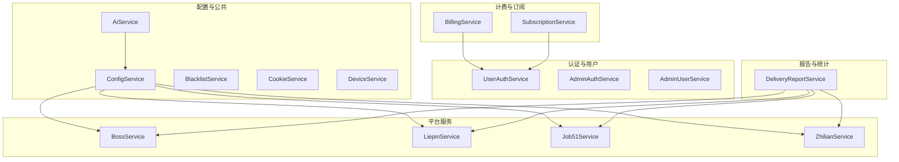

图示来源
- [ConfigService.java:28-32](file://backend/src/main/java/com/getjobs/application/service/ConfigService.java#L28-L32)
- [AiService.java:29-31](file://backend/src/main/java/com/getjobs/application/service/AiService.java#L29-L31)
- [BillingService.java:23-27](file://backend/src/main/java/com/getjobs/application/service/BillingService.java#L23-L27)
- [SubscriptionService.java:24-28](file://backend/src/main/java/com/getjobs/application/service/SubscriptionService.java#L24-L28)
- [DeliveryReportService.java:23-23](file://backend/src/main/java/com/getjobs/application/service/DeliveryReportService.java#L23-L23)

章节来源
- [AdminAuthService.java:23-23](file://backend/src/main/java/com/getjobs/application/service/AdminAuthService.java#L23-L23)
- [UserAuthService.java:27-27](file://backend/src/main/java/com/getjobs/application/service/UserAuthService.java#L27-L27)
- [BillingService.java:21-21](file://backend/src/main/java/com/getjobs/application/service/BillingService.java#L21-L21)
- [SubscriptionService.java:22-22](file://backend/src/main/java/com/getjobs/application/service/SubscriptionService.java#L22-L22)
- [ConfigService.java:25-27](file://backend/src/main/java/com/getjobs/application/service/ConfigService.java#L25-L27)
- [AiService.java:26-28](file://backend/src/main/java/com/getjobs/application/service/AiService.java#L26-L28)
- [BlacklistService.java:17-19](file://backend/src/main/java/com/getjobs/application/service/BlacklistService.java#L17-L19)
- [CookieService.java:16-18](file://backend/src/main/java/com/getjobs/application/service/CookieService.java#L16-L18)
- [DeviceService.java:19-21](file://backend/src/main/java/com/getjobs/application/service/DeviceService.java#L19-L21)
- [BossService.java:26-28](file://backend/src/main/java/com/getjobs/application/service/BossService.java#L26-L28)
- [LiepinService.java:22-24](file://backend/src/main/java/com/getjobs/application/service/LiepinService.java#L22-L24)
- [Job51Service.java:20-22](file://backend/src/main/java/com/getjobs/application/service/Job51Service.java#L20-L22)
- [ZhilianService.java:23-25](file://backend/src/main/java/com/getjobs/application/service/ZhilianService.java#L23-L25)
- [DeliveryReportService.java:18-20](file://backend/src/main/java/com/getjobs/application/service/DeliveryReportService.java#L18-L20)

## 核心组件
本节概述关键服务的职责与典型流程。

- 认证与授权
  - UserAuthService：用户注册、登录、Token 验证、资料更新、密码修改
  - AdminAuthService：后台管理员登录、Token 生成与校验
  - AdminUserService：后台用户管理（列表、详情、启/禁、充值记录、创建/更新/删除）

- 计费与订阅
  - BillingService：投递前检查、投递后扣费、订阅有效性判断、计费信息查询
  - SubscriptionService：激活订阅、查询订阅状态与历史、取消订阅

- 配置与公共能力
  - ConfigService：统一读取/批量更新配置、平台配置构建（Boss/Liepin/51Job/智联）
  - AiService：从配置中心读取AI配置并发起请求，支持 Responses/Chat Completions 自动降级
  - BlacklistService：黑名单关键词读取与命中检测
  - CookieService：按平台读取/保存/清理/删除 Cookie
  - DeviceService：设备绑定（最多2台）、解绑、查询、设备数统计

- 平台服务
  - BossService：选项与行业映射、配置加载、黑名单管理、岗位数据去重与插入、投递统计
  - LiepinService：岗位快照保存/去重、投递标记、统计与分页查询、薪资解析
  - Job51Service：配置加载、岗位快照批量插入、投递标记、统计与分页查询、薪资解析
  - ZhilianService：配置加载、岗位插入、投递标记、统计与分页查询、薪资解析

- 报告与统计
  - DeliveryReportService：接收客户端投递结果上报并落库

章节来源
- [UserAuthService.java:28-311](file://backend/src/main/java/com/getjobs/application/service/UserAuthService.java#L28-L311)
- [AdminAuthService.java:24-145](file://backend/src/main/java/com/getjobs/application/service/AdminAuthService.java#L24-L145)
- [AdminUserService.java:24-221](file://backend/src/main/java/com/getjobs/application/service/AdminUserService.java#L24-L221)
- [BillingService.java:21-170](file://backend/src/main/java/com/getjobs/application/service/BillingService.java#L21-L170)
- [SubscriptionService.java:22-160](file://backend/src/main/java/com/getjobs/application/service/SubscriptionService.java#L22-L160)
- [ConfigService.java:27-288](file://backend/src/main/java/com/getjobs/application/service/ConfigService.java#L27-L288)
- [AiService.java:29-334](file://backend/src/main/java/com/getjobs/application/service/AiService.java#L29-L334)
- [BlacklistService.java:20-100](file://backend/src/main/java/com/getjobs/application/service/BlacklistService.java#L20-L100)
- [CookieService.java:18-97](file://backend/src/main/java/com/getjobs/application/service/CookieService.java#L18-L97)
- [DeviceService.java:21-134](file://backend/src/main/java/com/getjobs/application/service/DeviceService.java#L21-L134)
- [BossService.java:29-800](file://backend/src/main/java/com/getjobs/application/service/BossService.java#L29-L800)
- [LiepinService.java:25-602](file://backend/src/main/java/com/getjobs/application/service/LiepinService.java#L25-L602)
- [Job51Service.java:23-725](file://backend/src/main/java/com/getjobs/application/service/Job51Service.java#L23-L725)
- [ZhilianService.java:26-504](file://backend/src/main/java/com/getjobs/application/service/ZhilianService.java#L26-L504)
- [DeliveryReportService.java:21-101](file://backend/src/main/java/com/getjobs/application/service/DeliveryReportService.java#L21-L101)

## 架构总览
Service 层通过 Spring 管理，围绕“领域服务 + Mapper/实体”的分层组织，配合事务注解与异常处理保障一致性与可靠性。配置中心统一对外部服务（AI、平台配置）进行抽象，平台服务负责各自的数据规范化与统计分析。

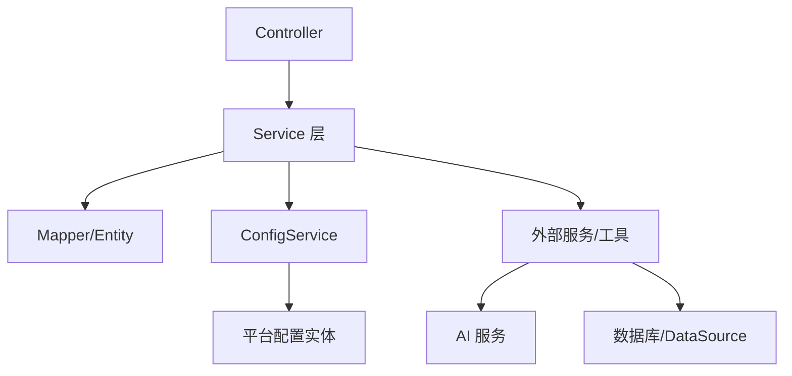

图示来源
- [ConfigService.java:28-32](file://backend/src/main/java/com/getjobs/application/service/ConfigService.java#L28-L32)
- [AiService.java:29-31](file://backend/src/main/java/com/getjobs/application/service/AiService.java#L29-L31)
- [BossService.java:36-36](file://backend/src/main/java/com/getjobs/application/service/BossService.java#L36-L36)

## 详细组件分析

### 认证与授权服务

#### 用户认证服务（UserAuthService）
- 注册：用户名/邮箱/手机唯一性校验，密码加密，初始化余额记录
- 登录：支持用户名/邮箱/手机登录，状态校验，签发JWT
- Token 校验：解析并验证JWT，返回用户信息
- 资料与密码管理：更新资料、修改密码（BCrypt校验）

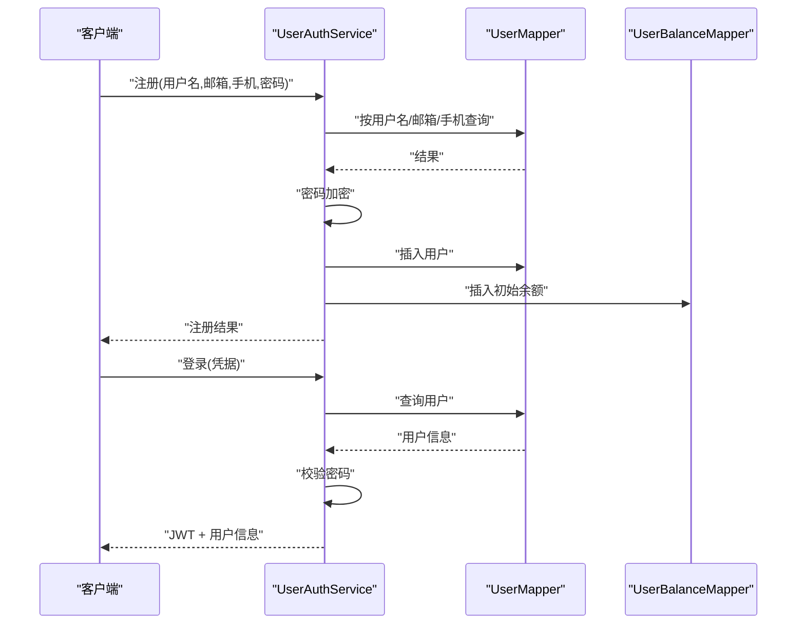

图示来源
- [UserAuthService.java:49-113](file://backend/src/main/java/com/getjobs/application/service/UserAuthService.java#L49-L113)
- [UserAuthService.java:122-168](file://backend/src/main/java/com/getjobs/application/service/UserAuthService.java#L122-L168)

章节来源
- [UserAuthService.java:28-311](file://backend/src/main/java/com/getjobs/application/service/UserAuthService.java#L28-L311)

#### 后台管理员认证服务（AdminAuthService）
- 管理员登录：状态校验、密码校验（BCrypt），签发JWT
- Token 校验与解析：校验签名、过期判断，提取用户信息

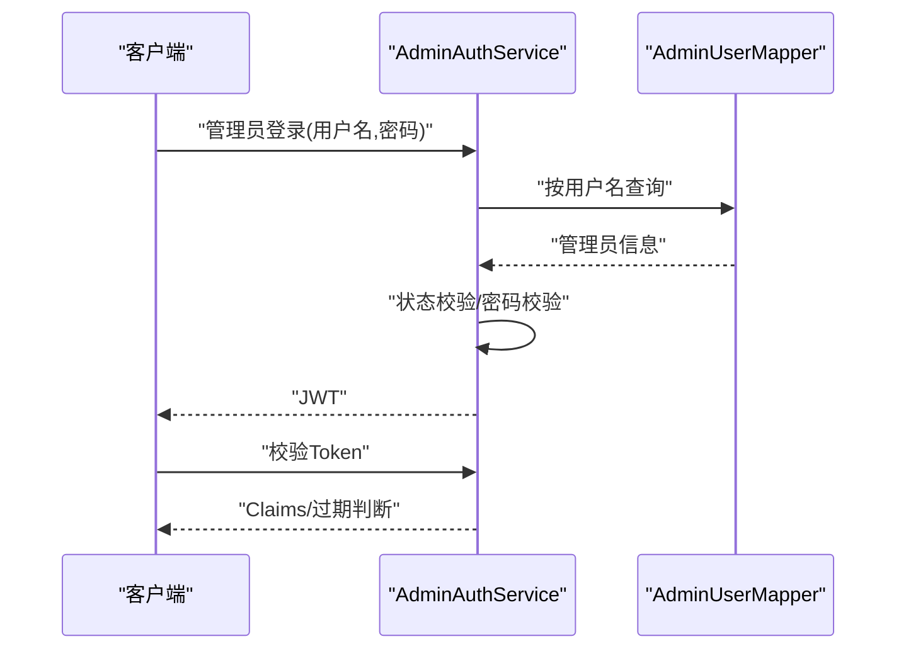

图示来源
- [AdminAuthService.java:56-75](file://backend/src/main/java/com/getjobs/application/service/AdminAuthService.java#L56-L75)
- [AdminAuthService.java:105-143](file://backend/src/main/java/com/getjobs/application/service/AdminAuthService.java#L105-L143)

章节来源
- [AdminAuthService.java:24-145](file://backend/src/main/java/com/getjobs/application/service/AdminAuthService.java#L24-L145)

#### 后台用户管理服务（AdminUserService）
- 用户列表与详情：支持状态与关键词筛选、余额信息拼装
- 用户启/禁、充值记录查询、创建/更新/删除用户

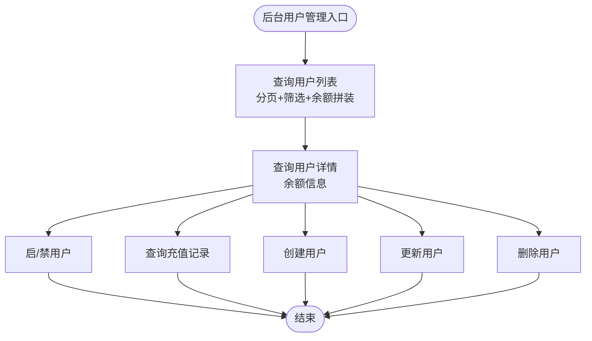

图示来源
- [AdminUserService.java:38-84](file://backend/src/main/java/com/getjobs/application/service/AdminUserService.java#L38-L84)
- [AdminUserService.java:89-138](file://backend/src/main/java/com/getjobs/application/service/AdminUserService.java#L89-L138)
- [AdminUserService.java:143-221](file://backend/src/main/java/com/getjobs/application/service/AdminUserService.java#L143-L221)

章节来源
- [AdminUserService.java:24-221](file://backend/src/main/java/com/getjobs/application/service/AdminUserService.java#L24-L221)

### 计费与订阅服务

#### 计费服务（BillingService）
- 投递前检查：余额计数、订阅有效性判断
- 投递后扣费：订阅优先、余额不足则拒绝、记录消费日志与累计消费
- 计费信息查询：余额、订阅到期、各类计数与累计消费

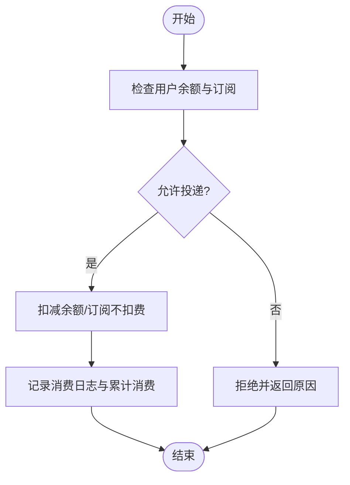

图示来源
- [BillingService.java:35-65](file://backend/src/main/java/com/getjobs/application/service/BillingService.java#L35-L65)
- [BillingService.java:76-130](file://backend/src/main/java/com/getjobs/application/service/BillingService.java#L76-L130)
- [BillingService.java:151-168](file://backend/src/main/java/com/getjobs/application/service/BillingService.java#L151-L168)

章节来源
- [BillingService.java:21-170](file://backend/src/main/java/com/getjobs/application/service/BillingService.java#L21-L170)

#### 订阅服务（SubscriptionService）
- 激活订阅：创建订阅记录，更新用户余额中的订阅到期时间（取更长的有效期）
- 查询状态与历史：当前有效订阅、剩余天数、历史记录
- 取消订阅：更新状态

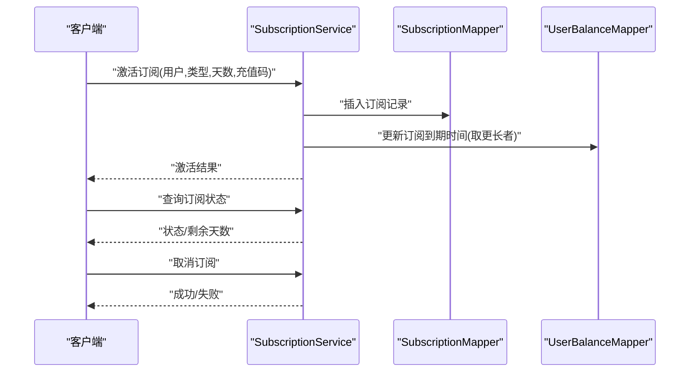

图示来源
- [SubscriptionService.java:40-88](file://backend/src/main/java/com/getjobs/application/service/SubscriptionService.java#L40-L88)
- [SubscriptionService.java:96-117](file://backend/src/main/java/com/getjobs/application/service/SubscriptionService.java#L96-L117)
- [SubscriptionService.java:148-159](file://backend/src/main/java/com/getjobs/application/service/SubscriptionService.java#L148-L159)

章节来源
- [SubscriptionService.java:22-160](file://backend/src/main/java/com/getjobs/application/service/SubscriptionService.java#L22-L160)

### 配置与公共能力服务

#### 配置服务（ConfigService）
- 统一读取/批量更新配置，必要配置校验
- 平台配置构建：从各平台专表读取并转换为 Worker 可用的配置对象（Boss/Liepin/51Job/智联）
- AI 配置读取：BASE_URL/API_KEY/MODEL，缺失时返回空值并记录警告

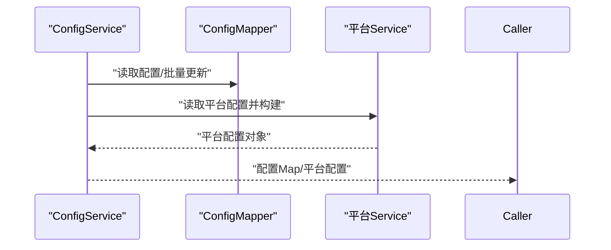

图示来源
- [ConfigService.java:38-55](file://backend/src/main/java/com/getjobs/application/service/ConfigService.java#L38-L55)
- [ConfigService.java:131-165](file://backend/src/main/java/com/getjobs/application/service/ConfigService.java#L131-L165)
- [ConfigService.java:217-286](file://backend/src/main/java/com/getjobs/application/service/ConfigService.java#L217-L286)

章节来源
- [ConfigService.java:27-288](file://backend/src/main/java/com/getjobs/application/service/ConfigService.java#L27-L288)

#### AI 服务（AiService）
- 从配置中心读取 AI 基础配置，自动识别 Responses/Chat Completions 端点
- 发起请求并解析响应，记录用量与请求ID，异常时记录详细错误
- 支持推理模型参数错误的自动降级重试

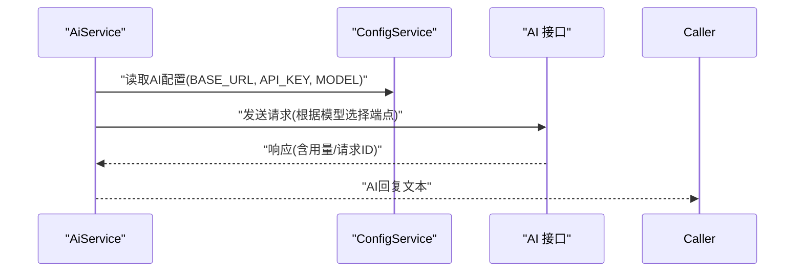

图示来源
- [AiService.java:38-147](file://backend/src/main/java/com/getjobs/application/service/AiService.java#L38-L147)
- [AiService.java:158-176](file://backend/src/main/java/com/getjobs/application/service/AiService.java#L158-L176)
- [AiService.java:202-247](file://backend/src/main/java/com/getjobs/application/service/AiService.java#L202-L247)

章节来源
- [AiService.java:29-334](file://backend/src/main/java/com/getjobs/application/service/AiService.java#L29-L334)

#### 黑名单服务（BlacklistService）
- 从 common_option 表读取 type='blacklist' 的关键词
- 对职位名称与公司名称进行模糊匹配，命中则过滤

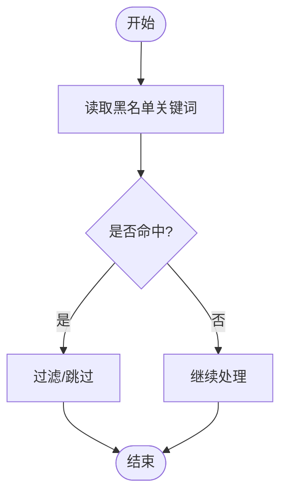

图示来源
- [BlacklistService.java:30-37](file://backend/src/main/java/com/getjobs/application/service/BlacklistService.java#L30-L37)
- [BlacklistService.java:46-69](file://backend/src/main/java/com/getjobs/application/service/BlacklistService.java#L46-L69)

章节来源
- [BlacklistService.java:20-100](file://backend/src/main/java/com/getjobs/application/service/BlacklistService.java#L20-L100)

#### Cookie 服务（CookieService）
- 按平台读取/保存/清理/删除 Cookie，支持备注与时间戳

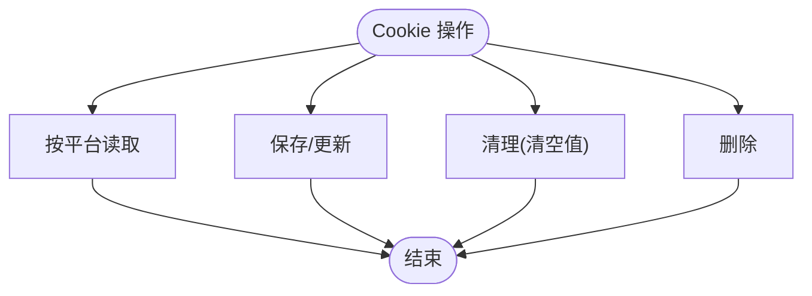

图示来源
- [CookieService.java:27-33](file://backend/src/main/java/com/getjobs/application/service/CookieService.java#L27-L33)
- [CookieService.java:42-61](file://backend/src/main/java/com/getjobs/application/service/CookieService.java#L42-L61)
- [CookieService.java:69-87](file://backend/src/main/java/com/getjobs/application/service/CookieService.java#L69-L87)

章节来源
- [CookieService.java:18-97](file://backend/src/main/java/com/getjobs/application/service/CookieService.java#L18-L97)

#### 设备服务（DeviceService）
- 设备绑定：限制最多2台，重复绑定仅更新登录时间
- 设备解绑、查询、绑定数统计、绑定校验

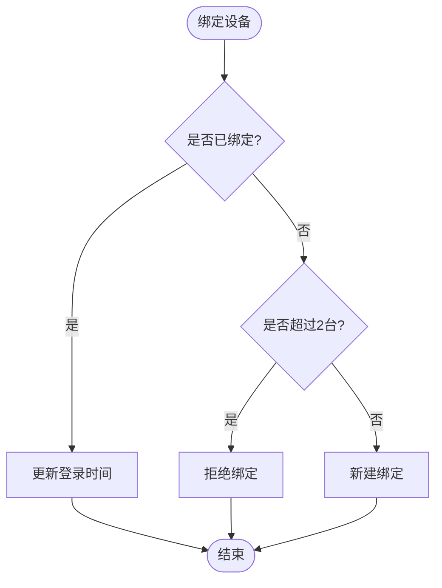

图示来源
- [DeviceService.java:40-83](file://backend/src/main/java/com/getjobs/application/service/DeviceService.java#L40-L83)
- [DeviceService.java:92-100](file://backend/src/main/java/com/getjobs/application/service/DeviceService.java#L92-L100)
- [DeviceService.java:108-132](file://backend/src/main/java/com/getjobs/application/service/DeviceService.java#L108-L132)

章节来源
- [DeviceService.java:21-134](file://backend/src/main/java/com/getjobs/application/service/DeviceService.java#L21-L134)

### 平台服务

#### Boss 服务（BossService）
- 选项与行业映射：city/industry 等选项的默认项保证与排序
- 配置加载：从 boss_config 读取并转换为 BossConfig，支持括号/逗号列表解析
- 黑名单：按类型获取黑名单集合
- 岗位数据：去重判断、插入、投递状态更新、统计分析

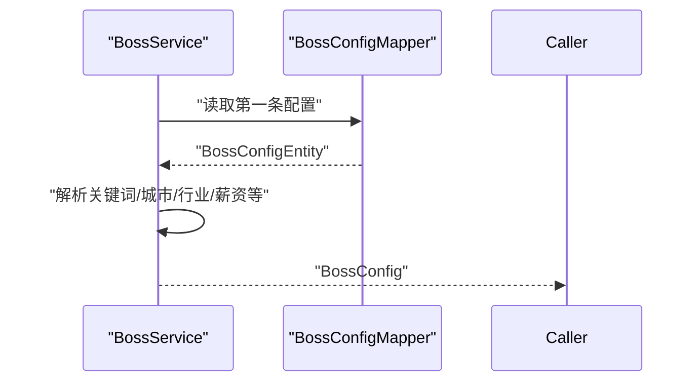

图示来源
- [BossService.java:304-366](file://backend/src/main/java/com/getjobs/application/service/BossService.java#L304-L366)

章节来源
- [BossService.java:29-800](file://backend/src/main/java/com/getjobs/application/service/BossService.java#L29-L800)

#### 猎聘服务（LiepinService）
- 岗位快照：保存/去重、批量插入、投递标记
- 配置：选择性更新、选项映射
- 统计与分页：按状态/地点/经验/学历/关键词/薪资区间过滤

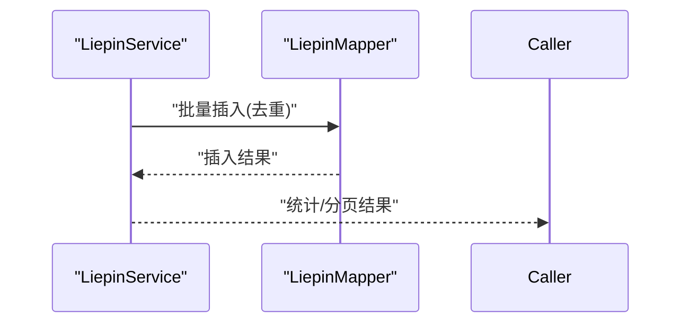

图示来源
- [LiepinService.java:141-206](file://backend/src/main/java/com/getjobs/application/service/LiepinService.java#L141-L206)
- [LiepinService.java:321-485](file://backend/src/main/java/com/getjobs/application/service/LiepinService.java#L321-L485)

章节来源
- [LiepinService.java:25-602](file://backend/src/main/java/com/getjobs/application/service/LiepinService.java#L25-L602)

#### 51job 服务（Job51Service）
- 配置：关键词/区域/薪资解析与归一化
- 岗位快照：批量插入、投递标记（单条/批量）
- 统计与分页：薪资区间基于中位数K

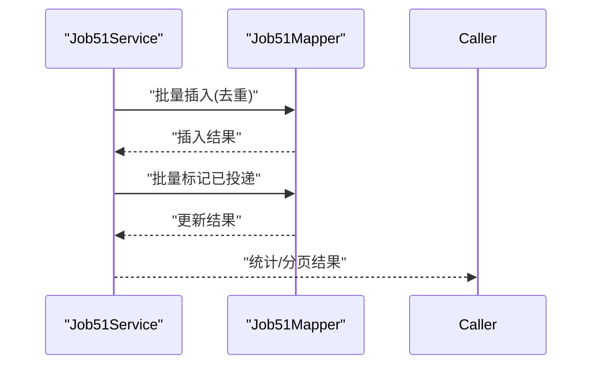

图示来源
- [Job51Service.java:245-288](file://backend/src/main/java/com/getjobs/application/service/Job51Service.java#L245-L288)
- [Job51Service.java:364-413](file://backend/src/main/java/com/getjobs/application/service/Job51Service.java#L364-L413)
- [Job51Service.java:418-546](file://backend/src/main/java/com/getjobs/application/service/Job51Service.java#L418-L546)

章节来源
- [Job51Service.java:23-725](file://backend/src/main/java/com/getjobs/application/service/Job51Service.java#L23-L725)

#### 智联服务（ZhilianService）
- 配置：关键词/城市/薪资归一化
- 岗位：插入、投递标记（按jobId或标题+公司名）
- 统计与分页：薪资区间基于中位数K

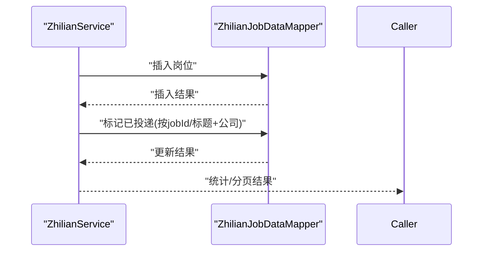

图示来源
- [ZhilianService.java:240-271](file://backend/src/main/java/com/getjobs/application/service/ZhilianService.java#L240-L271)
- [ZhilianService.java:274-399](file://backend/src/main/java/com/getjobs/application/service/ZhilianService.java#L274-L399)

章节来源
- [ZhilianService.java:26-504](file://backend/src/main/java/com/getjobs/application/service/ZhilianService.java#L26-L504)

### 报告与统计服务

#### 投递报告服务（DeliveryReportService）
- 接收客户端投递结果上报，保存为报告实体，返回报告ID与接收计数

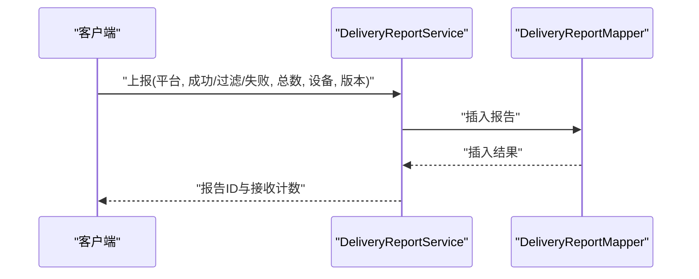

图示来源
- [DeliveryReportService.java:38-78](file://backend/src/main/java/com/getjobs/application/service/DeliveryReportService.java#L38-L78)

章节来源
- [DeliveryReportService.java:21-101](file://backend/src/main/java/com/getjobs/application/service/DeliveryReportService.java#L21-L101)

## 依赖分析
- 低耦合高内聚：各服务围绕单一职责，Mapper/实体与 Service 解耦
- 配置中心集中化：ConfigService 作为统一入口，平台服务通过其获取配置
- 事务边界清晰：注册、登录、扣费、订阅、报告等关键路径使用 @Transactional
- 外部依赖隔离：AiService 与平台服务通过 ConfigService 解耦

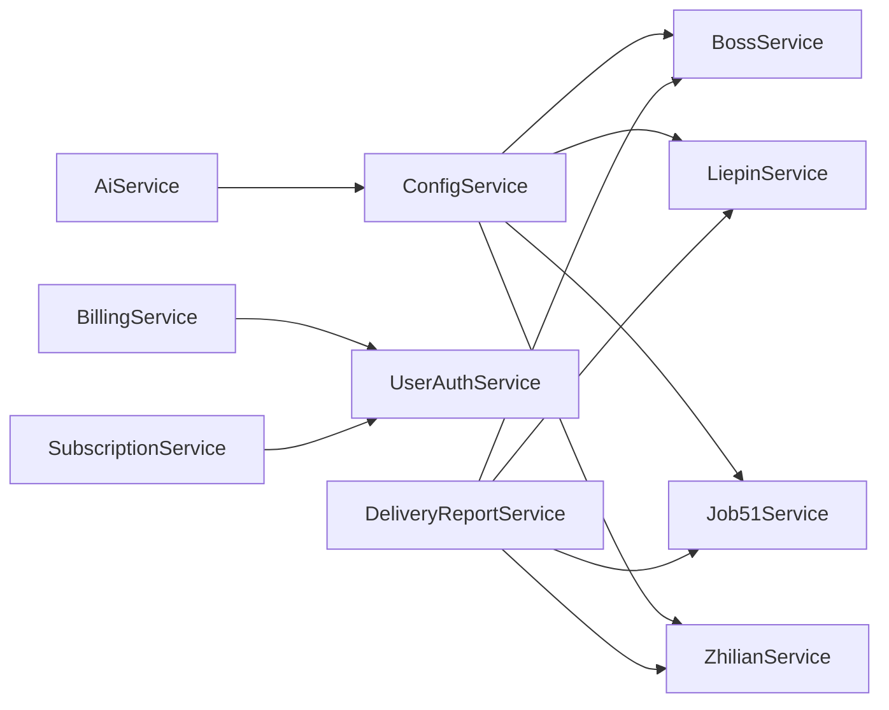

图示来源
- [ConfigService.java:28-32](file://backend/src/main/java/com/getjobs/application/service/ConfigService.java#L28-L32)
- [AiService.java:30-31](file://backend/src/main/java/com/getjobs/application/service/AiService.java#L30-L31)
- [BillingService.java:24-27](file://backend/src/main/java/com/getjobs/application/service/BillingService.java#L24-L27)
- [SubscriptionService.java:25-28](file://backend/src/main/java/com/getjobs/application/service/SubscriptionService.java#L25-L28)
- [DeliveryReportService.java:23-23](file://backend/src/main/java/com/getjobs/application/service/DeliveryReportService.java#L23-L23)

章节来源
- [ConfigService.java:27-288](file://backend/src/main/java/com/getjobs/application/service/ConfigService.java#L27-L288)
- [AiService.java:29-334](file://backend/src/main/java/com/getjobs/application/service/AiService.java#L29-L334)
- [BillingService.java:21-170](file://backend/src/main/java/com/getjobs/application/service/BillingService.java#L21-L170)
- [SubscriptionService.java:22-160](file://backend/src/main/java/com/getjobs/application/service/SubscriptionService.java#L22-L160)
- [DeliveryReportService.java:21-101](file://backend/src/main/java/com/getjobs/application/service/DeliveryReportService.java#L21-L101)

## 性能考虑
- 批量操作：平台服务普遍提供批量插入/更新能力，减少多次往返
- 去重与幂等：Boss/Liepin/Job51/智联均提供去重插入，避免重复数据
- 薪资解析：统一解析逻辑，避免重复计算，统计时按中位数K分桶
- 事务粒度：关键路径使用 @Transactional，避免跨服务长事务
- 日志与监控：关键节点记录日志，便于定位性能瓶颈

## 故障排查指南
- 认证失败
  - 用户名/密码错误、账户被禁用、Token 过期
  - 排查点：UserAuthService/AdminAuthService 的校验逻辑与日志
- 计费异常
  - 余额不足、订阅过期、投递数量为0
  - 排查点：BillingService 的检查与扣费逻辑
- 平台数据异常
  - 岗位重复、投递状态未更新、统计不一致
  - 排查点：平台服务的去重与更新逻辑
- 配置缺失
  - AI 配置不完整导致请求失败
  - 排查点：ConfigService 的配置读取与 AiService 的降级逻辑

章节来源
- [UserAuthService.java:122-168](file://backend/src/main/java/com/getjobs/application/service/UserAuthService.java#L122-L168)
- [AdminAuthService.java:56-75](file://backend/src/main/java/com/getjobs/application/service/AdminAuthService.java#L56-L75)
- [BillingService.java:76-130](file://backend/src/main/java/com/getjobs/application/service/BillingService.java#L76-L130)
- [BossService.java:627-647](file://backend/src/main/java/com/getjobs/application/service/BossService.java#L627-L647)
- [LiepinService.java:118-133](file://backend/src/main/java/com/getjobs/application/service/LiepinService.java#L118-L133)
- [Job51Service.java:364-413](file://backend/src/main/java/com/getjobs/application/service/Job51Service.java#L364-L413)
- [ZhilianService.java:251-271](file://backend/src/main/java/com/getjobs/application/service/ZhilianService.java#L251-L271)
- [ConfigService.java:107-124](file://backend/src/main/java/com/getjobs/application/service/ConfigService.java#L107-L124)
- [AiService.java:132-147](file://backend/src/main/java/com/getjobs/application/service/AiService.java#L132-L147)

## 结论
Service 层通过清晰的领域划分、严格的事务边界与统一的配置中心，实现了认证授权、计费订阅、平台数据与公共能力的可靠支撑。建议在后续扩展中：
- 引入异步任务与定时任务（如投递统计定时汇总、配置热更新）
- 强化并发控制（分布式锁、乐观锁、限流）
- 增强可观测性（埋点、指标、链路追踪）
- 优化热点路径（缓存、批量、预计算）

## 附录
- 事务注解使用：注册、登录、扣费、订阅、报告等关键路径使用 @Transactional
- 异常处理策略：统一捕获并记录日志，返回明确的错误信息
- 并发控制建议：设备绑定上限、黑名单命中检测、平台数据去重