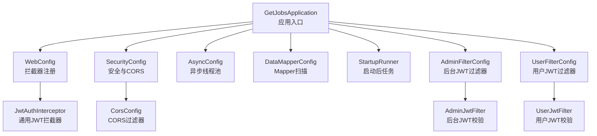
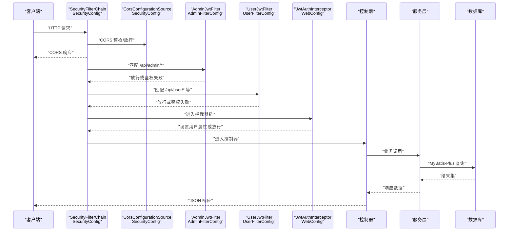
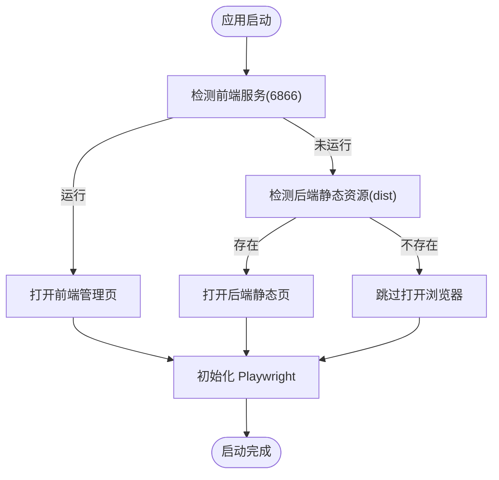
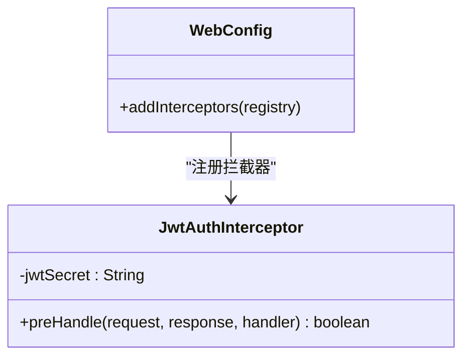
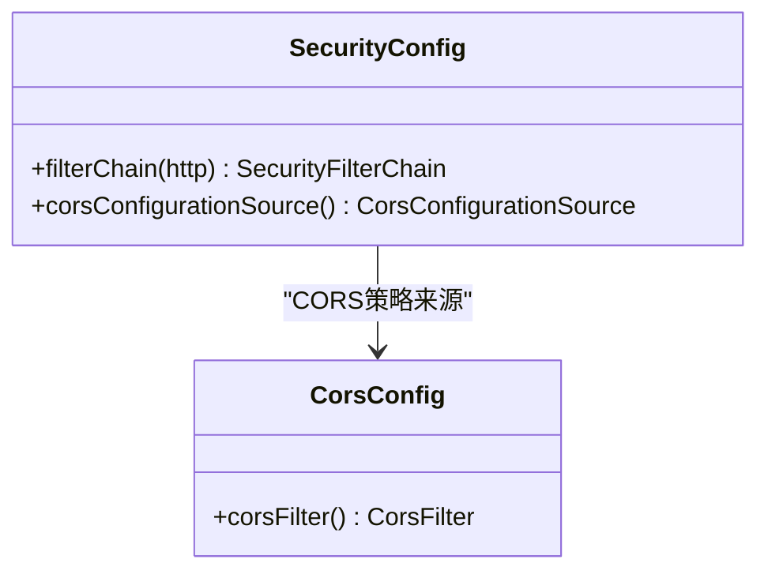
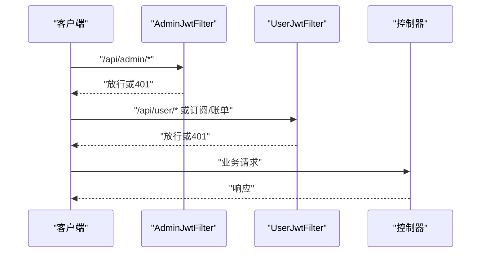
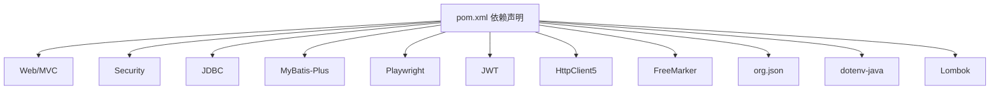

# Spring Boot 架构设计

<cite>
**本文引用的文件**
- [GetJobsApplication.java](file://backend/src/main/java/com/getjobs/GetJobsApplication.java)
- [application.yaml](file://backend/src/main/resources/application.yaml)
- [pom.xml](file://backend/pom.xml)
- [WebConfig.java](file://backend/src/main/java/com/getjobs/application/config/WebConfig.java)
- [SecurityConfig.java](file://backend/src/main/java/com/getjobs/application/config/SecurityConfig.java)
- [CorsConfig.java](file://backend/src/main/java/com/getjobs/application/config/CorsConfig.java)
- [AsyncConfig.java](file://backend/src/main/java/com/getjobs/application/config/AsyncConfig.java)
- [DataMapperConfig.java](file://backend/src/main/java/com/getjobs/application/config/DataMapperConfig.java)
- [StartupRunner.java](file://backend/src/main/java/com/getjobs/application/config/StartupRunner.java)
- [AdminFilterConfig.java](file://backend/src/main/java/com/getjobs/application/config/AdminFilterConfig.java)
- [UserFilterConfig.java](file://backend/src/main/java/com/getjobs/application/config/UserFilterConfig.java)
- [AdminJwtFilter.java](file://backend/src/main/java/com/getjobs/application/filter/AdminJwtFilter.java)
- [UserJwtFilter.java](file://backend/src/main/java/com/getjobs/application/filter/UserJwtFilter.java)
- [JwtAuthInterceptor.java](file://backend/src/main/java/com/getjobs/application/interceptor/JwtAuthInterceptor.java)
- [banner.txt](file://backend/src/main/resources/banner.txt)
</cite>

## 目录
1. [引言](#引言)
2. [项目结构](#项目结构)
3. [核心组件](#核心组件)
4. [架构总览](#架构总览)
5. [详细组件分析](#详细组件分析)
6. [依赖分析](#依赖分析)
7. [性能考虑](#性能考虑)
8. [故障排查指南](#故障排查指南)
9. [结论](#结论)
10. [附录](#附录)

## 引言
本文件面向希望深入理解 GetJobs 项目的 Spring Boot 架构设计与实现细节的开发者。内容覆盖应用启动流程、配置类作用与相互关系、WebMvc 配置、安全与 CORS 跨域配置、拦截器与过滤器链路、异步任务与线程池、MyBatis-Plus 数据层扫描、应用初始化与 Bean 注入机制、配置文件组织与环境变量处理、以及配置优先级规则与调试技巧。目标是帮助读者快速掌握如何扩展与维护该架构。

## 项目结构
后端采用标准的 Spring Boot 结构，核心入口位于 com.getjobs 包下，配置集中在 application/config 子包，控制器、实体、映射器、服务、工具与工作线程模块按功能分层组织。资源配置集中于 resources/application.yaml，并通过 banner.txt 定制启动横幅。

图表来源
- [GetJobsApplication.java:15-17](file://backend/src/main/java/com/getjobs/GetJobsApplication.java#L15-L17)
- [WebConfig.java:14-36](file://backend/src/main/java/com/getjobs/application/config/WebConfig.java#L14-L36)
- [SecurityConfig.java:22-44](file://backend/src/main/java/com/getjobs/application/config/SecurityConfig.java#L22-L44)
- [CorsConfig.java:12-39](file://backend/src/main/java/com/getjobs/application/config/CorsConfig.java#L12-L39)
- [AsyncConfig.java:17-54](file://backend/src/main/java/com/getjobs/application/config/AsyncConfig.java#L17-L54)
- [DataMapperConfig.java:10-13](file://backend/src/main/java/com/getjobs/application/config/DataMapperConfig.java#L10-L13)
- [StartupRunner.java:21-47](file://backend/src/main/java/com/getjobs/application/config/StartupRunner.java#L21-L47)
- [AdminFilterConfig.java:12-27](file://backend/src/main/java/com/getjobs/application/config/AdminFilterConfig.java#L12-L27)
- [UserFilterConfig.java:12-27](file://backend/src/main/java/com/getjobs/application/config/UserFilterConfig.java#L12-L27)
- [AdminJwtFilter.java:17-72](file://backend/src/main/java/com/getjobs/application/filter/AdminJwtFilter.java#L17-L72)
- [UserJwtFilter.java:19-83](file://backend/src/main/java/com/getjobs/application/filter/UserJwtFilter.java#L19-L83)
- [JwtAuthInterceptor.java:20-75](file://backend/src/main/java/com/getjobs/application/interceptor/JwtAuthInterceptor.java#L20-75)

章节来源
- [GetJobsApplication.java:15-22](file://backend/src/main/java/com/getjobs/GetJobsApplication.java#L15-L22)
- [application.yaml:1-91](file://backend/src/main/resources/application.yaml#L1-L91)
- [pom.xml:1-263](file://backend/pom.xml#L1-L263)

## 核心组件
- 应用入口与启动
  - @SpringBootApplication 开启组件扫描与自动配置，默认扫描 com.getjobs 包。
  - @EnableScheduling 与 @EnableAsync 启用定时任务与异步执行能力。
- 配置类职责
  - WebConfig：注册 JWT 认证拦截器，限定拦截路径与放行路径。
  - SecurityConfig：禁用表单/CSRF/HTTP Basic，统一开启 CORS，交由 CorsConfigurationSource 提供跨域策略。
  - CorsConfig：提供基于 CorsFilter 的全局跨域支持（与 SecurityConfig 中 CORS 配置共同存在，建议统一收敛至一处以避免重复）。
  - AsyncConfig：定制异步线程池，命名、队列、拒绝策略与优雅停机。
  - DataMapperConfig：启用 MyBatis-Plus Mapper 扫描，定位到 application/mapper 包。
  - StartupRunner：应用启动后自动打开管理页面（优先前端服务，其次后端静态资源），随后初始化 Playwright。
  - AdminFilterConfig/UserFilterConfig：分别注册后台与用户侧 JWT 过滤器，限定 URL 模式与顺序。
- 过滤器与拦截器
  - AdminJwtFilter：针对 /api/admin/* 的 Bearer Token 校验，放行登录与静态资源。
  - UserJwtFilter：针对 /api/user/*、订阅与账单等路径的 Token 校验，部分配置同步接口例外。
  - JwtAuthInterceptor：通用拦截器，解析 Authorization 头，将用户信息放入请求属性，便于 Controller 使用。

章节来源
- [GetJobsApplication.java:15-22](file://backend/src/main/java/com/getjobs/GetJobsApplication.java#L15-L22)
- [WebConfig.java:14-36](file://backend/src/main/java/com/getjobs/application/config/WebConfig.java#L14-L36)
- [SecurityConfig.java:22-66](file://backend/src/main/java/com/getjobs/application/config/SecurityConfig.java#L22-L66)
- [CorsConfig.java:12-39](file://backend/src/main/java/com/getjobs/application/config/CorsConfig.java#L12-L39)
- [AsyncConfig.java:17-54](file://backend/src/main/java/com/getjobs/application/config/AsyncConfig.java#L17-L54)
- [DataMapperConfig.java:10-13](file://backend/src/main/java/com/getjobs/application/config/DataMapperConfig.java#L10-L13)
- [StartupRunner.java:21-155](file://backend/src/main/java/com/getjobs/application/config/StartupRunner.java#L21-L155)
- [AdminFilterConfig.java:12-27](file://backend/src/main/java/com/getjobs/application/config/AdminFilterConfig.java#L12-L27)
- [UserFilterConfig.java:12-27](file://backend/src/main/java/com/getjobs/application/config/UserFilterConfig.java#L12-L27)
- [AdminJwtFilter.java:17-72](file://backend/src/main/java/com/getjobs/application/filter/AdminJwtFilter.java#L17-L72)
- [UserJwtFilter.java:19-83](file://backend/src/main/java/com/getjobs/application/filter/UserJwtFilter.java#L19-L83)
- [JwtAuthInterceptor.java:20-75](file://backend/src/main/java/com/getjobs/application/interceptor/JwtAuthInterceptor.java#L20-L75)

## 架构总览
下图展示从客户端请求进入，经由过滤器链与拦截器链，再到控制器与数据层的整体流程。SecurityConfig 与 CorsConfig 提供统一的跨域与安全基座；WebConfig 注册拦截器；AdminFilterConfig/UserFilterConfig 注册过滤器；JwtAuthInterceptor/AdminJwtFilter/UserJwtFilter 分别在不同层级进行认证；StartupRunner 在启动阶段完成浏览器打开与 Playwright 初始化。

图表来源
- [SecurityConfig.java:25-44](file://backend/src/main/java/com/getjobs/application/config/SecurityConfig.java#L25-L44)
- [CorsConfig.java:15-38](file://backend/src/main/java/com/getjobs/application/config/CorsConfig.java#L15-L38)
- [AdminFilterConfig.java:18-26](file://backend/src/main/java/com/getjobs/application/config/AdminFilterConfig.java#L18-L26)
- [UserFilterConfig.java:18-26](file://backend/src/main/java/com/getjobs/application/config/UserFilterConfig.java#L18-L26)
- [WebConfig.java:26-35](file://backend/src/main/java/com/getjobs/application/config/WebConfig.java#L26-L35)
- [AdminJwtFilter.java:24-70](file://backend/src/main/java/com/getjobs/application/filter/AdminJwtFilter.java#L24-L70)
- [UserJwtFilter.java:27-81](file://backend/src/main/java/com/getjobs/application/filter/UserJwtFilter.java#L27-L81)
- [JwtAuthInterceptor.java:32-73](file://backend/src/main/java/com/getjobs/application/interceptor/JwtAuthInterceptor.java#L32-L73)

## 详细组件分析

### 应用启动与初始化流程
- 启动入口
  - GetJobsApplication 作为 @SpringBootApplication，启用组件扫描与自动配置，扫描 com.getjobs 包。
  - 启用 @EnableScheduling 与 @EnableAsync，为定时任务与异步执行提供基础。
- 启动后任务
  - StartupRunner 实现 ApplicationRunner，在应用启动完成后执行：
    - 优先检测前端服务（本地 6866 端口），若运行则打开前端管理页；
    - 否则检测后端静态资源目录（src/main/resources/dist），若存在则打开后端静态页；
    - 若均不可用则跳过打开；
    - 最后初始化 Playwright 管理器，确保“先打开管理页，再实例化”。

图表来源
- [StartupRunner.java:31-47](file://backend/src/main/java/com/getjobs/application/config/StartupRunner.java#L31-L47)
- [StartupRunner.java:53-68](file://backend/src/main/java/com/getjobs/application/config/StartupRunner.java#L53-L68)
- [StartupRunner.java:74-104](file://backend/src/main/java/com/getjobs/application/config/StartupRunner.java#L74-L104)
- [StartupRunner.java:110-126](file://backend/src/main/java/com/getjobs/application/config/StartupRunner.java#L110-L126)
- [StartupRunner.java:131-153](file://backend/src/main/java/com/getjobs/application/config/StartupRunner.java#L131-L153)

章节来源
- [GetJobsApplication.java:15-22](file://backend/src/main/java/com/getjobs/GetJobsApplication.java#L15-L22)
- [StartupRunner.java:21-155](file://backend/src/main/java/com/getjobs/application/config/StartupRunner.java#L21-L155)

### WebMvc 配置与拦截器链
- WebConfig 注册 JwtAuthInterceptor，拦截 /api/**，放行健康检查、用户登录/注册与 /actuator/**。
- JwtAuthInterceptor 在 preHandle 中解析 Authorization 头，使用 HMAC-SHA 对称密钥验证 JWT，成功后将用户信息写入请求属性，便于后续控制器读取。

图表来源
- [WebConfig.java:14-36](file://backend/src/main/java/com/getjobs/application/config/WebConfig.java#L14-L36)
- [JwtAuthInterceptor.java:20-75](file://backend/src/main/java/com/getjobs/application/interceptor/JwtAuthInterceptor.java#L20-L75)

章节来源
- [WebConfig.java:14-36](file://backend/src/main/java/com/getjobs/application/config/WebConfig.java#L14-L36)
- [JwtAuthInterceptor.java:20-75](file://backend/src/main/java/com/getjobs/application/interceptor/JwtAuthInterceptor.java#L20-L75)

### 安全配置与 CORS 跨域
- SecurityConfig
  - 禁用 CSRF、表单登录与 HTTP Basic；
  - 统一开启 CORS，使用 CorsConfigurationSource 提供跨域策略；
  - anyRequest().permitAll() 交由自定义过滤器与拦截器控制权限。
- CorsConfig
  - 提供基于 CorsFilter 的全局跨域配置，允许任意来源、方法与头，支持凭证与预检缓存。

图表来源
- [SecurityConfig.java:22-66](file://backend/src/main/java/com/getjobs/application/config/SecurityConfig.java#L22-L66)
- [CorsConfig.java:12-39](file://backend/src/main/java/com/getjobs/application/config/CorsConfig.java#L12-L39)

章节来源
- [SecurityConfig.java:22-66](file://backend/src/main/java/com/getjobs/application/config/SecurityConfig.java#L22-L66)
- [CorsConfig.java:12-39](file://backend/src/main/java/com/getjobs/application/config/CorsConfig.java#L12-L39)

### 过滤器链与认证策略
- AdminFilterConfig/UserFilterConfig
  - 分别注册 AdminJwtFilter 与 UserJwtFilter，限定 URL 模式与执行顺序；
  - AdminJwtFilter：放行后台登录与静态资源，对 /api/admin/* 进行 Bearer Token 校验；
  - UserJwtFilter：放行注册、登录、健康检查与平台抓取相关接口，对用户相关接口进行 Token 校验，部分配置同步接口例外。

图表来源
- [AdminFilterConfig.java:18-26](file://backend/src/main/java/com/getjobs/application/config/AdminFilterConfig.java#L18-L26)
- [UserFilterConfig.java:18-26](file://backend/src/main/java/com/getjobs/application/config/UserFilterConfig.java#L18-L26)
- [AdminJwtFilter.java:24-70](file://backend/src/main/java/com/getjobs/application/filter/AdminJwtFilter.java#L24-L70)
- [UserJwtFilter.java:27-81](file://backend/src/main/java/com/getjobs/application/filter/UserJwtFilter.java#L27-L81)

章节来源
- [AdminFilterConfig.java:12-27](file://backend/src/main/java/com/getjobs/application/config/AdminFilterConfig.java#L12-L27)
- [UserFilterConfig.java:12-27](file://backend/src/main/java/com/getjobs/application/config/UserFilterConfig.java#L12-L27)
- [AdminJwtFilter.java:17-72](file://backend/src/main/java/com/getjobs/application/filter/AdminJwtFilter.java#L17-L72)
- [UserJwtFilter.java:19-83](file://backend/src/main/java/com/getjobs/application/filter/UserJwtFilter.java#L19-L83)

### 异步任务与线程池
- AsyncConfig 提供自定义线程池：
  - 核心/最大线程数、队列容量、线程名前缀、空闲存活时间；
  - 拒绝策略采用调用线程执行；
  - 关闭时等待任务完成并设置超时时间；
  - 通过 @Async 可直接使用名为 taskExecutor 的执行器。

章节来源
- [AsyncConfig.java:17-54](file://backend/src/main/java/com/getjobs/application/config/AsyncConfig.java#L17-L54)

### MyBatis-Plus 数据层扫描
- DataMapperConfig 使用 @MapperScan 扫描 application/mapper 包，结合 application.yaml 中的 mapper-locations 与全局配置，实现 XML 映射与驼峰命名自动转换。

章节来源
- [DataMapperConfig.java:10-13](file://backend/src/main/java/com/getjobs/application/config/DataMapperConfig.java#L10-L13)
- [application.yaml:44-52](file://backend/src/main/resources/application.yaml#L44-L52)

### 配置文件组织、环境变量与优先级
- application.yaml
  - spring.application、profiles、info、banner、datasource、server、logging、mybatis-plus 等核心配置；
  - admin.jwt.* 与 playwright.* 专项配置；
  - 使用占位符 ${...} 引入环境变量（如 ADMIN_JWT_SECRET）。
- 环境变量处理
  - 通过 dotenv-java（依赖声明）可在开发环境中加载 .env 文件，从而为 ${ADMIN_JWT_SECRET} 等占位符提供值；
  - pom.xml 中声明了该依赖，需确保运行时正确引入。
- 配置优先级（Spring Boot 常见规则）
  - 命令行参数 > 系统环境变量 > application.yaml > 默认值；
  - 开发环境可通过 spring.profiles.active: dev 控制激活 profile；
  - banner 位置与样式由 banner.txt 控制。

章节来源
- [application.yaml:1-91](file://backend/src/main/resources/application.yaml#L1-L91)
- [pom.xml:124-129](file://backend/pom.xml#L124-L129)
- [banner.txt:1-8](file://backend/src/main/resources/banner.txt#L1-L8)

## 依赖分析
- 启动与 Web
  - spring-boot-starter-web、spring-boot-starter-security、spring-boot-starter-jdbc；
- 数据访问
  - mybatis-plus-spring-boot3-starter、mysql-connector-java、sqlite-jdbc；
- 工具与集成
  - io.jsonwebtoken（JWT）、Apache HttpClient5、FreeMarker、org.json、dotenv-java；
- 构建与测试
  - spring-boot-maven-plugin、JUnit Platform、Lombok（编译期注解）。

图表来源
- [pom.xml:47-170](file://backend/pom.xml#L47-L170)

章节来源
- [pom.xml:1-263](file://backend/pom.xml#L1-L263)

## 性能考虑
- 线程池调优
  - AsyncConfig 的核心/最大线程数与队列容量需根据实际并发与 CPU 核心数调整；
  - 拒绝策略选择 CallerRunsPolicy 可避免丢任务，但会增加主线程压力，需结合业务特性评估。
- 数据库连接池
  - HikariCP 的 maximum-pool-size、idle-timeout、max-lifetime 需与数据库承载能力匹配，避免连接泄漏与抖动。
- 日志与监控
  - 控制台与文件日志级别、滚动策略合理配置，避免 IO 抖动；
  - Actuator 暴露健康与指标，结合外部监控系统进行容量规划。
- 跨域与过滤器链
  - CORS 配置建议统一收敛，减少重复处理与链路长度；
  - 过滤器与拦截器的 URL 模式尽量精确，避免不必要的解析与分支判断。

## 故障排查指南
- 启动阶段
  - 若未自动打开浏览器，检查前端服务端口与静态资源目录是否存在；
  - Playwright 初始化失败时查看错误日志并确认驱动与浏览器安装状态。
- 认证问题
  - 用户拦截器：确认 Authorization 头格式为 Bearer Token，密钥与签名一致；
  - 后台过滤器：确认 /api/admin/* 路径是否命中过滤器，Token 是否过期或无效；
  - 拦截器链：若 OPTIONS 预检被拦截，检查 JwtAuthInterceptor 是否正确放行 OPTIONS。
- 跨域问题
  - 确认 SecurityConfig 与 CorsConfig 的 CORS 配置是否生效；
  - 检查 Allow-Credentials 与 Allowed-Origin 是否匹配前端域名。
- 数据访问
  - MyBatis-Plus 映射路径与驼峰命名配置是否正确；
  - 数据源连接参数与网络连通性是否正常。

章节来源
- [StartupRunner.java:31-47](file://backend/src/main/java/com/getjobs/application/config/StartupRunner.java#L31-L47)
- [JwtAuthInterceptor.java:32-73](file://backend/src/main/java/com/getjobs/application/interceptor/JwtAuthInterceptor.java#L32-L73)
- [AdminJwtFilter.java:45-63](file://backend/src/main/java/com/getjobs/application/filter/AdminJwtFilter.java#L45-L63)
- [UserJwtFilter.java:57-74](file://backend/src/main/java/com/getjobs/application/filter/UserJwtFilter.java#L57-L74)
- [SecurityConfig.java:49-66](file://backend/src/main/java/com/getjobs/application/config/SecurityConfig.java#L49-L66)
- [CorsConfig.java:15-38](file://backend/src/main/java/com/getjobs/application/config/CorsConfig.java#L15-L38)
- [application.yaml:13-22](file://backend/src/main/resources/application.yaml#L13-L22)
- [application.yaml:44-52](file://backend/src/main/resources/application.yaml#L44-L52)

## 结论
GetJobs 的 Spring Boot 架构以清晰的分层与配置分离为核心：入口类负责启动与能力开关，配置类统一治理 WebMvc、安全与跨域、异步与数据层，启动器负责应用生命周期的关键动作。通过过滤器与拦截器形成多层认证链路，配合线程池与数据访问层，构建了可扩展、可维护的后端服务骨架。建议在后续演进中进一步统一 CORS 配置、完善 Actuator 与监控、细化线程池与连接池参数，并持续优化认证与授权策略。

## 附录
- 配置示例与调试要点
  - 启用开发模式：设置 spring.profiles.active: dev；
  - 调整日志级别：logging.level.root 与控制台/文件输出；
  - 调整数据库连接池：maximum-pool-size、idle-timeout、max-lifetime；
  - 调整 Playwright 参数：slow-mo、navigation-timeout、max-retries 等；
  - 调整异步线程池：core/max pool size、queue capacity、拒绝策略；
  - 环境变量：通过 dotenv-java 加载 .env，设置 ADMIN_JWT_SECRET 等敏感配置。

章节来源
- [application.yaml:4-59](file://backend/src/main/resources/application.yaml#L4-L59)
- [application.yaml:60-91](file://backend/src/main/resources/application.yaml#L60-L91)
- [AsyncConfig.java:24-54](file://backend/src/main/java/com/getjobs/application/config/AsyncConfig.java#L24-L54)
- [pom.xml:124-129](file://backend/pom.xml#L124-L129)