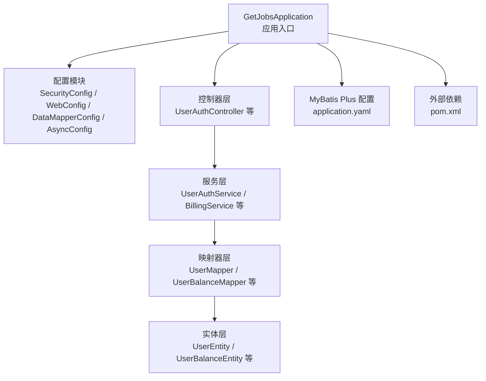
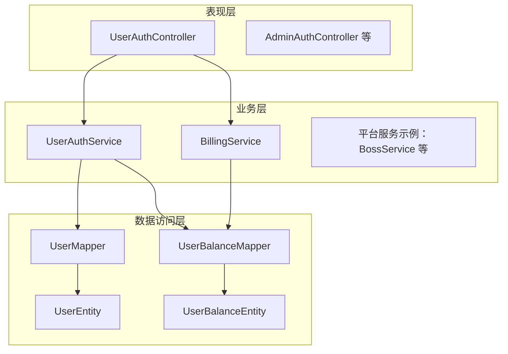
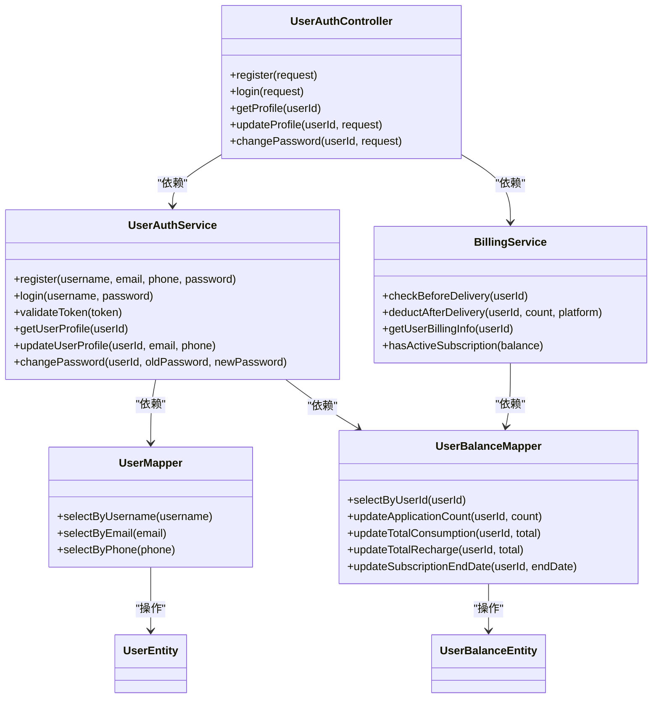
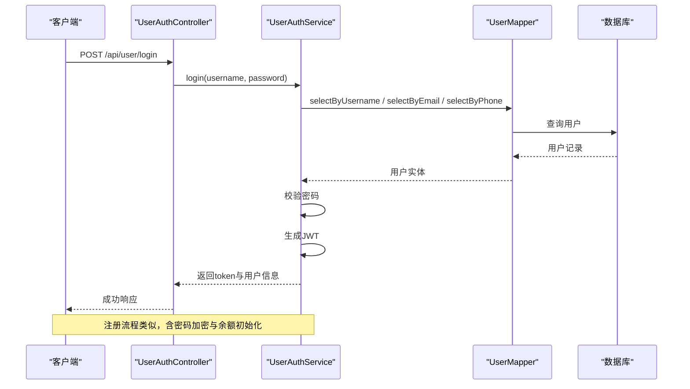
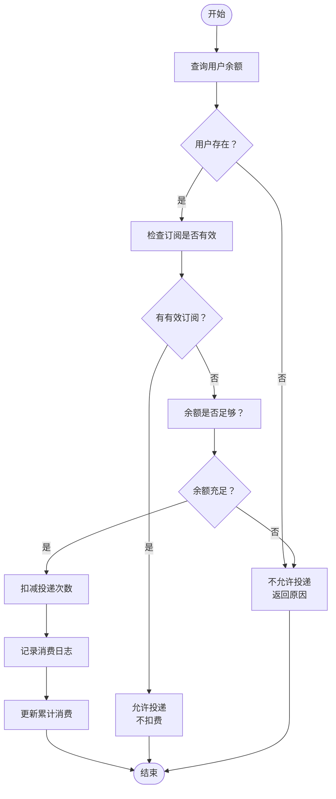
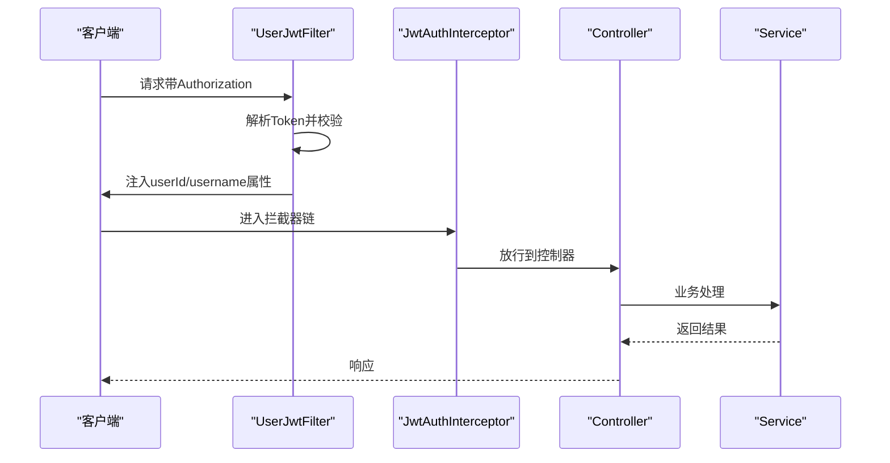
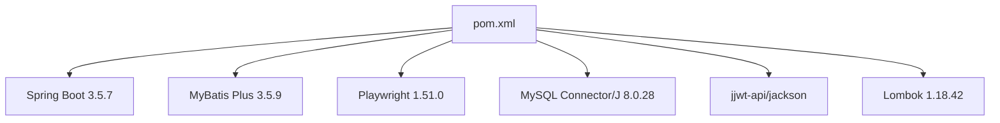

# 后端服务

<cite>
**本文引用的文件**
- [GetJobsApplication.java](file://backend/src/main/java/com/getjobs/GetJobsApplication.java)
- [application.yaml](file://backend/src/main/resources/application.yaml)
- [pom.xml](file://backend/pom.xml)
- [README.md](file://backend/README.md)
- [SecurityConfig.java](file://backend/src/main/java/com/getjobs/application/config/SecurityConfig.java)
- [WebConfig.java](file://backend/src/main/java/com/getjobs/application/config/WebConfig.java)
- [DataMapperConfig.java](file://backend/src/main/java/com/getjobs/application/config/DataMapperConfig.java)
- [AsyncConfig.java](file://backend/src/main/java/com/getjobs/application/config/AsyncConfig.java)
- [UserAuthController.java](file://backend/src/main/java/com/getjobs/application/controller/UserAuthController.java)
- [UserAuthService.java](file://backend/src/main/java/com/getjobs/application/service/UserAuthService.java)
- [UserMapper.java](file://backend/src/main/java/com/getjobs/application/mapper/UserMapper.java)
- [UserEntity.java](file://backend/src/main/java/com/getjobs/application/entity/UserEntity.java)
- [BillingService.java](file://backend/src/main/java/com/getjobs/application/service/BillingService.java)
- [UserBalanceMapper.java](file://backend/src/main/java/com/getjobs/application/mapper/UserBalanceMapper.java)
- [UserBalanceEntity.java](file://backend/src/main/java/com/getjobs/application/entity/UserBalanceEntity.java)
- [UserJwtFilter.java](file://backend/src/main/java/com/getjobs/application/filter/UserJwtFilter.java)
</cite>

## 目录
1. [简介](#简介)
2. [项目结构](#项目结构)
3. [核心组件](#核心组件)
4. [架构总览](#架构总览)
5. [详细组件分析](#详细组件分析)
6. [依赖分析](#依赖分析)
7. [性能考量](#性能考量)
8. [故障排查指南](#故障排查指南)
9. [结论](#结论)
10. [附录](#附录)

## 简介
本项目是一个基于 Spring Boot 的求职自动化平台后端服务，采用分层架构设计（Controller-Service-Mapper），结合 MyBatis Plus 实现数据库访问，使用 JWT 完成用户认证与权限控制，并通过异步线程池提升并发处理能力。系统围绕用户认证、平台配置、求职自动化、计费管理等核心功能展开，提供可扩展的模块化结构，便于后续维护与二次开发。

## 项目结构
后端工程位于 backend 目录，采用标准 Spring Boot 结构：
- application：应用配置、控制器、服务、映射器、实体、过滤器、拦截器、初始化器等
- resources：配置文件、静态资源、模板等
- worker：浏览器自动化与平台适配层（Playwright）
- pom.xml：Maven 依赖与构建配置

图表来源
- [GetJobsApplication.java:15-21](file://backend/src/main/java/com/getjobs/GetJobsApplication.java#L15-L21)
- [application.yaml:44-51](file://backend/src/main/resources/application.yaml#L44-L51)
- [pom.xml:43-188](file://backend/pom.xml#L43-L188)

章节来源
- [GetJobsApplication.java:15-21](file://backend/src/main/java/com/getjobs/GetJobsApplication.java#L15-L21)
- [application.yaml:1-91](file://backend/src/main/resources/application.yaml#L1-L91)
- [pom.xml:1-263](file://backend/pom.xml#L1-L263)

## 核心组件
- 应用入口与扫描：启动类启用调度与异步，扫描 com.getjobs 包
- 配置模块：安全、CORS、MyBatis Mapper 扫描、异步线程池
- 控制器层：用户认证、计费、平台配置等 API
- 服务层：用户认证与资料管理、计费与消费记录
- 映射器层：基于 MyBatis Plus 的通用 Mapper 接口
- 实体层：数据库表对应的实体类
- 过滤器与拦截器：JWT 认证过滤、请求拦截

章节来源
- [GetJobsApplication.java:15-21](file://backend/src/main/java/com/getjobs/GetJobsApplication.java#L15-L21)
- [SecurityConfig.java:24-44](file://backend/src/main/java/com/getjobs/application/config/SecurityConfig.java#L24-L44)
- [WebConfig.java:14-36](file://backend/src/main/java/com/getjobs/application/config/WebConfig.java#L14-L36)
- [DataMapperConfig.java:10-13](file://backend/src/main/java/com/getjobs/application/config/DataMapperConfig.java#L10-L13)
- [AsyncConfig.java:18-54](file://backend/src/main/java/com/getjobs/application/config/AsyncConfig.java#L18-L54)

## 架构总览
系统采用经典的三层架构：
- 表现层（Controller）：接收 HTTP 请求，调用服务层处理业务
- 业务层（Service）：封装业务规则，协调数据访问与外部依赖
- 数据访问层（Mapper + Entity）：通过 MyBatis Plus 操作数据库

图表来源
- [UserAuthController.java:15-167](file://backend/src/main/java/com/getjobs/application/controller/UserAuthController.java#L15-L167)
- [UserAuthService.java:26-311](file://backend/src/main/java/com/getjobs/application/service/UserAuthService.java#L26-L311)
- [BillingService.java:19-153](file://backend/src/main/java/com/getjobs/application/service/BillingService.java#L19-L153)
- [UserMapper.java:12-35](file://backend/src/main/java/com/getjobs/application/mapper/UserMapper.java#L12-L35)
- [UserBalanceMapper.java:13-46](file://backend/src/main/java/com/getjobs/application/mapper/UserBalanceMapper.java#L13-L46)
- [UserEntity.java:13-41](file://backend/src/main/java/com/getjobs/application/entity/UserEntity.java#L13-L41)
- [UserBalanceEntity.java:13-50](file://backend/src/main/java/com/getjobs/application/entity/UserBalanceEntity.java#L13-L50)

## 详细组件分析

### 分层架构与职责划分
- Controller 层：负责请求参数解析、鉴权上下文注入、响应封装；典型如用户认证控制器
- Service 层：实现业务逻辑，包含事务边界、校验与调用 Mapper；典型如用户认证与计费服务
- Mapper 层：基于 MyBatis Plus 的通用接口，提供 CRUD 与自定义 SQL；典型如用户与余额映射器
- Entity 层：与数据库表一一对应，标注主键与驼峰映射

图表来源
- [UserAuthController.java:15-167](file://backend/src/main/java/com/getjobs/application/controller/UserAuthController.java#L15-L167)
- [UserAuthService.java:26-311](file://backend/src/main/java/com/getjobs/application/service/UserAuthService.java#L26-L311)
- [BillingService.java:19-153](file://backend/src/main/java/com/getjobs/application/service/BillingService.java#L19-L153)
- [UserMapper.java:12-35](file://backend/src/main/java/com/getjobs/application/mapper/UserMapper.java#L12-L35)
- [UserBalanceMapper.java:13-46](file://backend/src/main/java/com/getjobs/application/mapper/UserBalanceMapper.java#L13-L46)
- [UserEntity.java:13-41](file://backend/src/main/java/com/getjobs/application/entity/UserEntity.java#L13-L41)
- [UserBalanceEntity.java:13-50](file://backend/src/main/java/com/getjobs/application/entity/UserBalanceEntity.java#L13-L50)

章节来源
- [UserAuthController.java:15-167](file://backend/src/main/java/com/getjobs/application/controller/UserAuthController.java#L15-L167)
- [UserAuthService.java:26-311](file://backend/src/main/java/com/getjobs/application/service/UserAuthService.java#L26-L311)
- [BillingService.java:19-153](file://backend/src/main/java/com/getjobs/application/service/BillingService.java#L19-L153)
- [UserMapper.java:12-35](file://backend/src/main/java/com/getjobs/application/mapper/UserMapper.java#L12-L35)
- [UserBalanceMapper.java:13-46](file://backend/src/main/java/com/getjobs/application/mapper/UserBalanceMapper.java#L13-L46)
- [UserEntity.java:13-41](file://backend/src/main/java/com/getjobs/application/entity/UserEntity.java#L13-L41)
- [UserBalanceEntity.java:13-50](file://backend/src/main/java/com/getjobs/application/entity/UserBalanceEntity.java#L13-L50)

### 用户认证流程（登录/注册）

图表来源
- [UserAuthController.java:61-80](file://backend/src/main/java/com/getjobs/application/controller/UserAuthController.java#L61-L80)
- [UserAuthService.java:122-168](file://backend/src/main/java/com/getjobs/application/service/UserAuthService.java#L122-L168)
- [UserMapper.java:18-33](file://backend/src/main/java/com/getjobs/application/mapper/UserMapper.java#L18-L33)

章节来源
- [UserAuthController.java:61-80](file://backend/src/main/java/com/getjobs/application/controller/UserAuthController.java#L61-L80)
- [UserAuthService.java:122-168](file://backend/src/main/java/com/getjobs/application/service/UserAuthService.java#L122-L168)
- [UserMapper.java:18-33](file://backend/src/main/java/com/getjobs/application/mapper/UserMapper.java#L18-L33)

### 计费与消费扣费流程

图表来源
- [BillingService.java:35-113](file://backend/src/main/java/com/getjobs/application/service/BillingService.java#L35-L113)
- [UserBalanceMapper.java:19-44](file://backend/src/main/java/com/getjobs/application/mapper/UserBalanceMapper.java#L19-L44)

章节来源
- [BillingService.java:35-113](file://backend/src/main/java/com/getjobs/application/service/BillingService.java#L35-L113)
- [UserBalanceMapper.java:19-44](file://backend/src/main/java/com/getjobs/application/mapper/UserBalanceMapper.java#L19-L44)

### 安全与认证机制
- Spring Security：禁用默认表单登录与 CSRF，统一通过 JWT 过滤器与拦截器处理
- CORS：全局跨域配置，允许凭据与预检缓存
- JWT 过滤器：从 Authorization 头提取 Bearer Token，校验后将用户信息注入请求属性
- 拦截器：对 /api/** 路径进行统一鉴权，排除登录、注册、健康检查等

图表来源
- [UserJwtFilter.java:26-81](file://backend/src/main/java/com/getjobs/application/filter/UserJwtFilter.java#L26-L81)
- [WebConfig.java:25-35](file://backend/src/main/java/com/getjobs/application/config/WebConfig.java#L25-L35)
- [SecurityConfig.java:24-44](file://backend/src/main/java/com/getjobs/application/config/SecurityConfig.java#L24-L44)

章节来源
- [UserJwtFilter.java:26-81](file://backend/src/main/java/com/getjobs/application/filter/UserJwtFilter.java#L26-L81)
- [WebConfig.java:25-35](file://backend/src/main/java/com/getjobs/application/config/WebConfig.java#L25-L35)
- [SecurityConfig.java:24-44](file://backend/src/main/java/com/getjobs/application/config/SecurityConfig.java#L24-L44)

### MyBatis Plus 使用与最佳实践
- Mapper 扫描：通过 @MapperScan 指定扫描包，简化接口实现
- 通用 Mapper：继承 BaseMapper，获得常用 CRUD 方法
- 自定义 SQL：使用 @Select/@Update 等注解编写精确查询与更新
- 驼峰映射：开启下划线到驼峰映射，避免命名不一致
- XML 映射：通过 mapper-locations 加载 XML 文件，便于复杂 SQL 管理

章节来源
- [DataMapperConfig.java:10-13](file://backend/src/main/java/com/getjobs/application/config/DataMapperConfig.java#L10-L13)
- [UserMapper.java:12-35](file://backend/src/main/java/com/getjobs/application/mapper/UserMapper.java#L12-L35)
- [UserBalanceMapper.java:13-46](file://backend/src/main/java/com/getjobs/application/mapper/UserBalanceMapper.java#L13-L46)
- [application.yaml:44-51](file://backend/src/main/resources/application.yaml#L44-L51)

### 异步与并发
- 线程池：核心线程 2，最大 5，队列 100，拒绝策略 CallerRunsPolicy
- 名称前缀：Boss-Task-，便于日志定位
- 关闭策略：等待任务完成后再关闭，保证数据一致性

章节来源
- [AsyncConfig.java:18-54](file://backend/src/main/java/com/getjobs/application/config/AsyncConfig.java#L18-L54)

## 依赖分析
- Spring Boot 3.5.7：提供 Web、Security、JDBC、Test 等 Starter
- MyBatis Plus 3.5.9：简化 ORM 操作，提供代码生成器与模板引擎
- Playwright 1.51.0：浏览器自动化，支持多平台求职站点
- MySQL Connector/J 8.0.28：数据库驱动
- Lombok 1.18.42：减少样板代码
- jjwt-api/jackson：JWT 生成与解析

图表来源
- [pom.xml:43-188](file://backend/pom.xml#L43-L188)

章节来源
- [pom.xml:43-188](file://backend/pom.xml#L43-L188)

## 性能考量
- 数据库连接池：HikariCP，最大池大小 10，空闲与生命周期合理配置
- MyBatis Plus：开启驼峰映射，减少字段映射开销
- 异步线程池：适度的核心与最大线程数，避免过度竞争
- 日志滚动：按天滚动与文件大小限制，避免磁盘压力
- Playwright 参数：慢动作、超时、重试与页面池管理，平衡稳定性与性能

章节来源
- [application.yaml:13-22](file://backend/src/main/resources/application.yaml#L13-L22)
- [application.yaml:44-51](file://backend/src/main/resources/application.yaml#L44-L51)
- [application.yaml:60-91](file://backend/src/main/resources/application.yaml#L60-L91)

## 故障排查指南
- 认证失败
  - 检查 Authorization 头格式是否为 Bearer Token
  - 校验 JWT 秘钥与过期时间配置
  - 查看过滤器是否正确注入 userId/username
- 数据库连接异常
  - 检查 datasource.url、username、password
  - 确认 Hikari 配置与防火墙放行
- 计费判定异常
  - 核对用户余额与订阅到期时间
  - 检查消费日志是否正确插入
- 线程池饱和
  - 观察线程池指标与拒绝策略触发情况
  - 调整核心/最大线程数与队列容量

章节来源
- [UserJwtFilter.java:57-81](file://backend/src/main/java/com/getjobs/application/filter/UserJwtFilter.java#L57-L81)
- [application.yaml:13-22](file://backend/src/main/resources/application.yaml#L13-L22)
- [BillingService.java:74-113](file://backend/src/main/java/com/getjobs/application/service/BillingService.java#L74-L113)
- [AsyncConfig.java:24-54](file://backend/src/main/java/com/getjobs/application/config/AsyncConfig.java#L24-L54)

## 结论
本项目以清晰的分层架构为基础，结合 Spring Security、JWT、MyBatis Plus 与异步线程池，构建了稳定可靠的求职自动化后端服务。通过模块化设计与完善的配置体系，既满足当前业务需求，也为未来扩展提供了良好基础。建议在生产环境中进一步完善监控与告警、数据库索引优化与缓存策略，持续提升系统稳定性与性能。

## 附录
- 快速启动：运行应用入口类，监听端口由 server.port 配置
- 配置文件：application.yaml 中包含数据库、MyBatis Plus、JWT、Playwright 等关键配置
- 项目说明：README.md 提供功能特性、注意事项与使用指南

章节来源
- [GetJobsApplication.java:19-21](file://backend/src/main/java/com/getjobs/GetJobsApplication.java#L19-L21)
- [application.yaml:28-91](file://backend/src/main/resources/application.yaml#L28-L91)
- [README.md:41-174](file://backend/README.md#L41-L174)