# 实体模型设计

<cite>
**本文引用的文件**
- [UserEntity.java](file://backend/src/main/java/com/getjobs/application/entity/UserEntity.java)
- [AdminUserEntity.java](file://backend/src/main/java/com/getjobs/application/entity/AdminUserEntity.java)
- [CookieEntity.java](file://backend/src/main/java/com/getjobs/application/entity/CookieEntity.java)
- [SubscriptionEntity.java](file://backend/src/main/java/com/getjobs/application/entity/SubscriptionEntity.java)
- [BossJobDataEntity.java](file://backend/src/main/java/com/getjobs/application/entity/BossJobDataEntity.java)
- [Job51Entity.java](file://backend/src/main/java/com/getjobs/application/entity/Job51Entity.java)
- [LiepinEntity.java](file://backend/src/main/java/com/getjobs/application/entity/LiepinEntity.java)
- [ZhilianJobDataEntity.java](file://backend/src/main/java/com/getjobs/application/entity/ZhilianJobDataEntity.java)
- [DeliveryReportEntity.java](file://backend/src/main/java/com/getjobs/application/entity/DeliveryReportEntity.java)
- [ConsumptionLogEntity.java](file://backend/src/main/java/com/getjobs/application/entity/ConsumptionLogEntity.java)
- [UserDeviceEntity.java](file://backend/src/main/java/com/getjobs/application/entity/UserDeviceEntity.java)
- [AiEntity.java](file://backend/src/main/java/com/getjobs/application/entity/AiEntity.java)
- [BlacklistEntity.java](file://backend/src/main/java/com/getjobs/application/entity/BlacklistEntity.java)
- [BossConfigEntity.java](file://backend/src/main/java/com/getjobs/application/entity/BossConfigEntity.java)
- [CommonOptionEntity.java](file://backend/src/main/java/com/getjobs/application/entity/CommonOptionEntity.java)
- [SearchPresetEntity.java](file://backend/src/main/java/com/getjobs/application/entity/SearchPresetEntity.java)
- [UserBalanceEntity.java](file://backend/src/main/java/com/getjobs/application/entity/UserBalanceEntity.java)
</cite>

## 目录
1. [简介](#简介)
2. [项目结构](#项目结构)
3. [核心组件](#核心组件)
4. [架构总览](#架构总览)
5. [详细组件分析](#详细组件分析)
6. [依赖分析](#依赖分析)
7. [性能考虑](#性能考虑)
8. [故障排查指南](#故障排查指南)
9. [结论](#结论)
10. [附录](#附录)

## 简介
本文件面向实体模型设计，系统性梳理后端数据库实体类的设计原则与字段定义，覆盖以下方面：
- 实体关系映射与表结构设计
- 字段约束与索引设计建议
- 数据结构与字段类型选择
- Lombok 注解与 MyBatis-Plus 注解的协同使用
- 时间戳字段处理策略
- 复合主键与继承关系的替代方案
- 具体实体类实现路径与数据库设计最佳实践

## 项目结构
实体类集中位于后端模块的 entity 包中，采用按功能域划分的组织方式，便于维护与扩展。整体遵循“一个领域一张表”的建模思路，结合平台差异（Boss、智联、51job、猎聘）进行拆分。

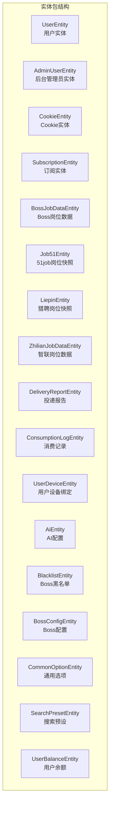

**图表来源**
- [UserEntity.java:1-41](file://backend/src/main/java/com/getjobs/application/entity/UserEntity.java#L1-L41)
- [AdminUserEntity.java:1-35](file://backend/src/main/java/com/getjobs/application/entity/AdminUserEntity.java#L1-L35)
- [CookieEntity.java:1-54](file://backend/src/main/java/com/getjobs/application/entity/CookieEntity.java#L1-L54)
- [SubscriptionEntity.java:1-41](file://backend/src/main/java/com/getjobs/application/entity/SubscriptionEntity.java#L1-L41)
- [BossJobDataEntity.java:1-108](file://backend/src/main/java/com/getjobs/application/entity/BossJobDataEntity.java#L1-L108)
- [Job51Entity.java:1-76](file://backend/src/main/java/com/getjobs/application/entity/Job51Entity.java#L1-L76)
- [LiepinEntity.java:1-81](file://backend/src/main/java/com/getjobs/application/entity/LiepinEntity.java#L1-L81)
- [ZhilianJobDataEntity.java:1-64](file://backend/src/main/java/com/getjobs/application/entity/ZhilianJobDataEntity.java#L1-L64)
- [DeliveryReportEntity.java:1-59](file://backend/src/main/java/com/getjobs/application/entity/DeliveryReportEntity.java#L1-L59)
- [ConsumptionLogEntity.java:1-47](file://backend/src/main/java/com/getjobs/application/entity/ConsumptionLogEntity.java#L1-L47)
- [UserDeviceEntity.java:1-35](file://backend/src/main/java/com/getjobs/application/entity/UserDeviceEntity.java#L1-L35)
- [AiEntity.java:1-48](file://backend/src/main/java/com/getjobs/application/entity/AiEntity.java#L1-L48)
- [BlacklistEntity.java:1-43](file://backend/src/main/java/com/getjobs/application/entity/BlacklistEntity.java#L1-L43)
- [BossConfigEntity.java:1-57](file://backend/src/main/java/com/getjobs/application/entity/BossConfigEntity.java#L1-L57)
- [CommonOptionEntity.java:1-29](file://backend/src/main/java/com/getjobs/application/entity/CommonOptionEntity.java#L1-L29)
- [SearchPresetEntity.java:1-35](file://backend/src/main/java/com/getjobs/application/entity/SearchPresetEntity.java#L1-L35)
- [UserBalanceEntity.java:1-50](file://backend/src/main/java/com/getjobs/application/entity/UserBalanceEntity.java#L1-L50)

**章节来源**
- [UserEntity.java:1-41](file://backend/src/main/java/com/getjobs/application/entity/UserEntity.java#L1-L41)
- [AdminUserEntity.java:1-35](file://backend/src/main/java/com/getjobs/application/entity/AdminUserEntity.java#L1-L35)
- [CookieEntity.java:1-54](file://backend/src/main/java/com/getjobs/application/entity/CookieEntity.java#L1-L54)
- [SubscriptionEntity.java:1-41](file://backend/src/main/java/com/getjobs/application/entity/SubscriptionEntity.java#L1-L41)
- [BossJobDataEntity.java:1-108](file://backend/src/main/java/com/getjobs/application/entity/BossJobDataEntity.java#L1-L108)
- [Job51Entity.java:1-76](file://backend/src/main/java/com/getjobs/application/entity/Job51Entity.java#L1-L76)
- [LiepinEntity.java:1-81](file://backend/src/main/java/com/getjobs/application/entity/LiepinEntity.java#L1-L81)
- [ZhilianJobDataEntity.java:1-64](file://backend/src/main/java/com/getjobs/application/entity/ZhilianJobDataEntity.java#L1-L64)
- [DeliveryReportEntity.java:1-59](file://backend/src/main/java/com/getjobs/application/entity/DeliveryReportEntity.java#L1-L59)
- [ConsumptionLogEntity.java:1-47](file://backend/src/main/java/com/getjobs/application/entity/ConsumptionLogEntity.java#L1-L47)
- [UserDeviceEntity.java:1-35](file://backend/src/main/java/com/getjobs/application/entity/UserDeviceEntity.java#L1-L35)
- [AiEntity.java:1-48](file://backend/src/main/java/com/getjobs/application/entity/AiEntity.java#L1-L48)
- [BlacklistEntity.java:1-43](file://backend/src/main/java/com/getjobs/application/entity/BlacklistEntity.java#L1-L43)
- [BossConfigEntity.java:1-57](file://backend/src/main/java/com/getjobs/application/entity/BossConfigEntity.java#L1-L57)
- [CommonOptionEntity.java:1-29](file://backend/src/main/java/com/getjobs/application/entity/CommonOptionEntity.java#L1-L29)
- [SearchPresetEntity.java:1-35](file://backend/src/main/java/com/getjobs/application/entity/SearchPresetEntity.java#L1-L35)
- [UserBalanceEntity.java:1-50](file://backend/src/main/java/com/getjobs/application/entity/UserBalanceEntity.java#L1-L50)

## 核心组件
本节对关键实体进行要点提炼，涵盖主键策略、字段命名规范、时间戳字段、以及与业务含义的对应关系。

- 用户相关
  - 用户实体：包含用户名、邮箱、手机号、密码哈希、状态、时间戳等基础字段，主键自增。
  - 后台管理员实体：与用户实体类似，但仅用于管理端鉴权。
  - 用户设备绑定：记录设备指纹、设备名称、最后登录时间等。
  - 用户余额：聚合各类额度与累计充值/消费次数，支撑订阅与消费控制。
- 平台数据
  - Boss 岗位数据：包含加密岗位/用户ID、公司信息、岗位描述、投递状态、行业/融资/规模等丰富字段。
  - 51job 岗位快照：以岗位ID为主键，记录岗位标题、链接、薪资文本、地区、学历/经验要求、HR/公司信息及投递状态。
  - 猎聘岗位快照：字段与 51job 类似，补充 HR 即时通讯ID。
  - 智联岗位数据：以自增主键为主键，字段覆盖岗位ID/名称/链接、薪资、地点、经验/学历、公司名称、投递状态等。
- 运营与配置
  - Cookie 实体：存储平台 Cookie 值、备注与时间戳。
  - 订阅实体：记录用户订阅类型、起止时间、状态与关联充值码。
  - Boss 配置：集中管理搜索关键词、城市、行业、经验/学历/薪资/规模/融资阶段、AI 与图片简历开关、HR 在线过滤等。
  - 通用选项：统一的选项字典，支持排序与标签。
  - 搜索预设：保存常用搜索组合（关键词、城市）。
  - AI 配置：技能介绍与提示词，带时间戳。
  - 黑名单：按公司/招聘者/职位维度的过滤项。
- 日志与报告
  - 投递报告：汇总投递成功/被过滤/失败数量与详情（JSON），并记录设备与客户端版本。
  - 消费记录：记录用户在不同平台与类型的消费明细与余额变化。

**章节来源**
- [UserEntity.java:10-40](file://backend/src/main/java/com/getjobs/application/entity/UserEntity.java#L10-L40)
- [AdminUserEntity.java:10-34](file://backend/src/main/java/com/getjobs/application/entity/AdminUserEntity.java#L10-L34)
- [UserDeviceEntity.java:10-34](file://backend/src/main/java/com/getjobs/application/entity/UserDeviceEntity.java#L10-L34)
- [UserBalanceEntity.java:10-49](file://backend/src/main/java/com/getjobs/application/entity/UserBalanceEntity.java#L10-L49)
- [BossJobDataEntity.java:11-107](file://backend/src/main/java/com/getjobs/application/entity/BossJobDataEntity.java#L11-L107)
- [Job51Entity.java:10-75](file://backend/src/main/java/com/getjobs/application/entity/Job51Entity.java#L10-L75)
- [LiepinEntity.java:10-80](file://backend/src/main/java/com/getjobs/application/entity/LiepinEntity.java#L10-L80)
- [ZhilianJobDataEntity.java:11-63](file://backend/src/main/java/com/getjobs/application/entity/ZhilianJobDataEntity.java#L11-L63)
- [CookieEntity.java:11-52](file://backend/src/main/java/com/getjobs/application/entity/CookieEntity.java#L11-L52)
- [SubscriptionEntity.java:10-39](file://backend/src/main/java/com/getjobs/application/entity/SubscriptionEntity.java#L10-L39)
- [BossConfigEntity.java:10-55](file://backend/src/main/java/com/getjobs/application/entity/BossConfigEntity.java#L10-L55)
- [CommonOptionEntity.java:10-27](file://backend/src/main/java/com/getjobs/application/entity/CommonOptionEntity.java#L10-L27)
- [SearchPresetEntity.java:10-33](file://backend/src/main/java/com/getjobs/application/entity/SearchPresetEntity.java#L10-L33)
- [AiEntity.java:11-46](file://backend/src/main/java/com/getjobs/application/entity/AiEntity.java#L11-L46)
- [BlacklistEntity.java:10-41](file://backend/src/main/java/com/getjobs/application/entity/BlacklistEntity.java#L10-L41)
- [DeliveryReportEntity.java:10-58](file://backend/src/main/java/com/getjobs/application/entity/DeliveryReportEntity.java#L10-L58)
- [ConsumptionLogEntity.java:10-45](file://backend/src/main/java/com/getjobs/application/entity/ConsumptionLogEntity.java#L10-L45)

## 架构总览
实体层围绕“用户—平台—岗位—日志/报告—配置”主线展开，形成如下关系图：

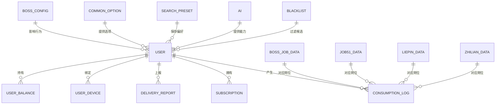

**图表来源**
- [UserEntity.java:16-39](file://backend/src/main/java/com/getjobs/application/entity/UserEntity.java#L16-L39)
- [SubscriptionEntity.java:20-36](file://backend/src/main/java/com/getjobs/application/entity/SubscriptionEntity.java#L20-L36)
- [ConsumptionLogEntity.java:20-33](file://backend/src/main/java/com/getjobs/application/entity/ConsumptionLogEntity.java#L20-L33)
- [DeliveryReportEntity.java:24-28](file://backend/src/main/java/com/getjobs/application/entity/DeliveryReportEntity.java#L24-L28)
- [UserDeviceEntity.java:20-27](file://backend/src/main/java/com/getjobs/application/entity/UserDeviceEntity.java#L20-L27)
- [UserBalanceEntity.java:20-42](file://backend/src/main/java/com/getjobs/application/entity/UserBalanceEntity.java#L20-L42)
- [BossJobDataEntity.java:21-75](file://backend/src/main/java/com/getjobs/application/entity/BossJobDataEntity.java#L21-L75)
- [Job51Entity.java:18-26](file://backend/src/main/java/com/getjobs/application/entity/Job51Entity.java#L18-L26)
- [LiepinEntity.java:18-26](file://backend/src/main/java/com/getjobs/application/entity/LiepinEntity.java#L18-L26)
- [ZhilianJobDataEntity.java:21-31](file://backend/src/main/java/com/getjobs/application/entity/ZhilianJobDataEntity.java#L21-L31)
- [BossConfigEntity.java:16-50](file://backend/src/main/java/com/getjobs/application/entity/BossConfigEntity.java#L16-L50)
- [CommonOptionEntity.java:16-21](file://backend/src/main/java/com/getjobs/application/entity/CommonOptionEntity.java#L16-L21)
- [SearchPresetEntity.java:20-27](file://backend/src/main/java/com/getjobs/application/entity/SearchPresetEntity.java#L20-L27)
- [AiEntity.java:27-34](file://backend/src/main/java/com/getjobs/application/entity/AiEntity.java#L27-L34)
- [BlacklistEntity.java:24-31](file://backend/src/main/java/com/getjobs/application/entity/BlacklistEntity.java#L24-L31)

## 详细组件分析

### 用户实体（UserEntity）
- 设计要点
  - 主键自增，适合高并发下的写入场景。
  - 字段覆盖身份标识（用户名/邮箱/手机）、凭证（密码哈希）、状态与时间戳。
- 字段验证与约束建议
  - 唯一性：用户名、邮箱、手机号建议建立唯一索引；密码哈希长度固定。
  - 状态枚举：0-禁用、1-启用，建议在服务层进行校验。
- 时间戳处理
  - 使用 Java 时间对象，配合框架自动填充更新时间。

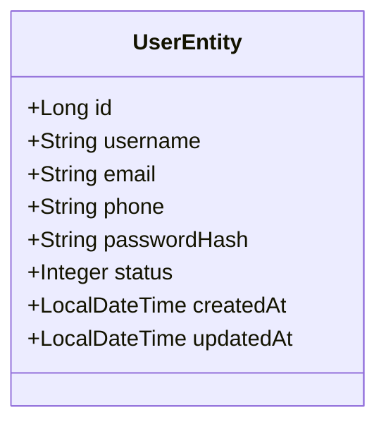

**图表来源**
- [UserEntity.java:16-39](file://backend/src/main/java/com/getjobs/application/entity/UserEntity.java#L16-L39)

**章节来源**
- [UserEntity.java:10-40](file://backend/src/main/java/com/getjobs/application/entity/UserEntity.java#L10-L40)

### Cookie 实体（CookieEntity）
- 设计要点
  - 主键自增，平台字段用于区分来源平台。
  - Cookie 值与备注字段用于存储与审计。
- 索引建议
  - platform 字段可建立索引，便于按平台查询。
- 时间戳处理
  - created_at/updated_at 保持一致的时间同步策略。

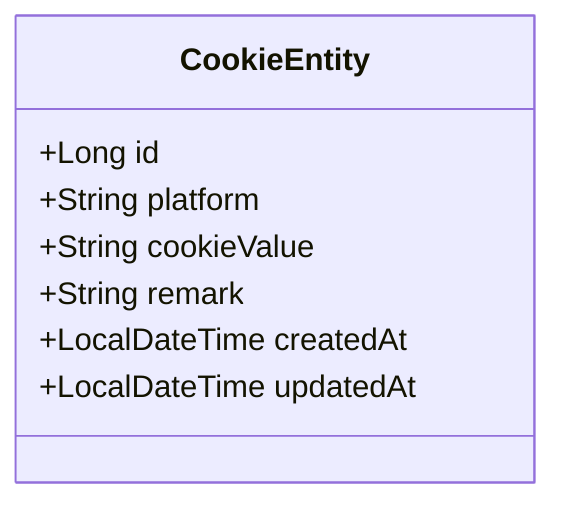

**图表来源**
- [CookieEntity.java:17-52](file://backend/src/main/java/com/getjobs/application/entity/CookieEntity.java#L17-L52)

**章节来源**
- [CookieEntity.java:11-53](file://backend/src/main/java/com/getjobs/application/entity/CookieEntity.java#L11-L53)

### 订阅实体（SubscriptionEntity）
- 设计要点
  - 用户维度的订阅记录，包含起止时间、状态与关联充值码。
  - 状态枚举覆盖未激活、有效、已过期、已取消。
- 索引建议
  - userId、status、endDate 常用于查询与到期检查，建议建立复合索引。
- 时间戳处理
  - createdAt 作为创建时间，配合业务逻辑更新更新时间。

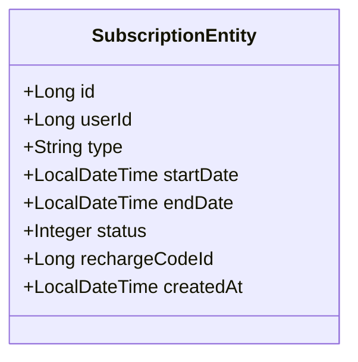

**图表来源**
- [SubscriptionEntity.java:15-39](file://backend/src/main/java/com/getjobs/application/entity/SubscriptionEntity.java#L15-L39)

**章节来源**
- [SubscriptionEntity.java:10-40](file://backend/src/main/java/com/getjobs/application/entity/SubscriptionEntity.java#L10-L40)

### Boss 岗位数据实体（BossJobDataEntity）
- 设计要点
  - 主键自增，字段覆盖岗位、公司、HR、行业/融资/规模等全量信息。
  - 投递状态字段用于业务流转控制。
- 索引建议
  - encryptId、deliveryStatus、createdAt/updatedAt 常用于检索与统计。
- 时间戳处理
  - created_at/updated_at 保持一致的更新策略。

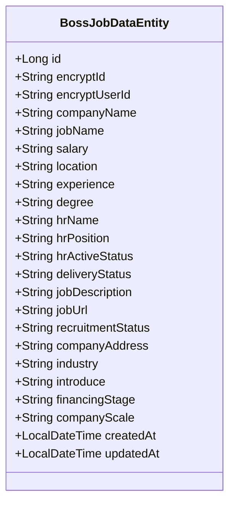

**图表来源**
- [BossJobDataEntity.java:17-107](file://backend/src/main/java/com/getjobs/application/entity/BossJobDataEntity.java#L17-L107)

**章节来源**
- [BossJobDataEntity.java:11-107](file://backend/src/main/java/com/getjobs/application/entity/BossJobDataEntity.java#L11-L107)

### 51job 岗位实体（Job51Entity）
- 设计要点
  - jobId 作为主键，字段覆盖岗位、公司、HR 与投递状态。
- 索引建议
  - jobId 为主键，其他如 jobTitle、jobArea、compId、hrId 可根据查询需求建立索引。
- 时间戳处理
  - created_at/updated_at 保持一致策略。

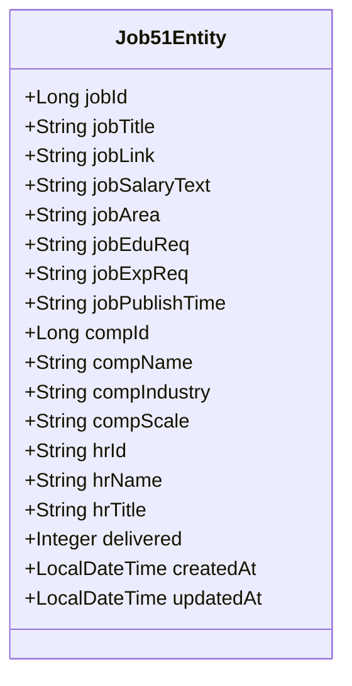

**图表来源**
- [Job51Entity.java:16-75](file://backend/src/main/java/com/getjobs/application/entity/Job51Entity.java#L16-L75)

**章节来源**
- [Job51Entity.java:10-75](file://backend/src/main/java/com/getjobs/application/entity/Job51Entity.java#L10-L75)

### 猎聘实体（LiepinEntity）
- 设计要点
  - 结构与 51job 类似，补充 HR 即时通讯 ID。
- 索引建议
  - 与 51job 类似，按查询热点建立索引。
- 时间戳处理
  - created_at/updated_at 保持一致策略。

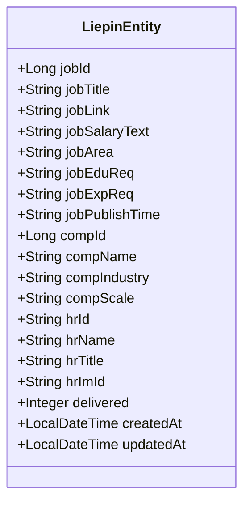

**图表来源**
- [LiepinEntity.java:16-80](file://backend/src/main/java/com/getjobs/application/entity/LiepinEntity.java#L16-L80)

**章节来源**
- [LiepinEntity.java:10-80](file://backend/src/main/java/com/getjobs/application/entity/LiepinEntity.java#L10-L80)

### 智联岗位数据实体（ZhilianJobDataEntity）
- 设计要点
  - 主键自增，字段覆盖岗位ID/名称/链接、薪资、地点、经验/学历、公司名称、投递状态等。
- 索引建议
  - jobId、deliveryStatus、createdAt/updatedAt 常用于检索与统计。
- 时间戳处理
  - created_at/updated_at 保持一致策略。

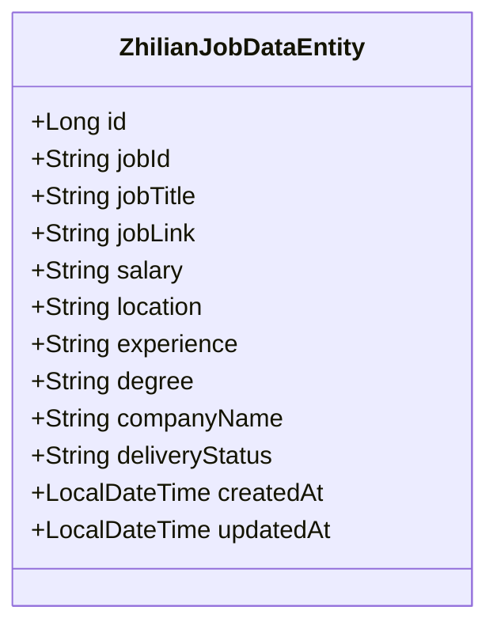

**图表来源**
- [ZhilianJobDataEntity.java:17-63](file://backend/src/main/java/com/getjobs/application/entity/ZhilianJobDataEntity.java#L17-L63)

**章节来源**
- [ZhilianJobDataEntity.java:11-63](file://backend/src/main/java/com/getjobs/application/entity/ZhilianJobDataEntity.java#L11-L63)

### 投递报告实体（DeliveryReportEntity）
- 设计要点
  - 记录客户端上报的投递结果汇总，包含 JSON 结构的明细字段。
  - 设备 ID 与客户端版本用于定位问题。
- 索引建议
  - reportId、userId、platform、deviceId、createdAt 常用于查询与聚合。
- 时间戳处理
  - createdAt 作为创建时间，配合业务逻辑更新更新时间。

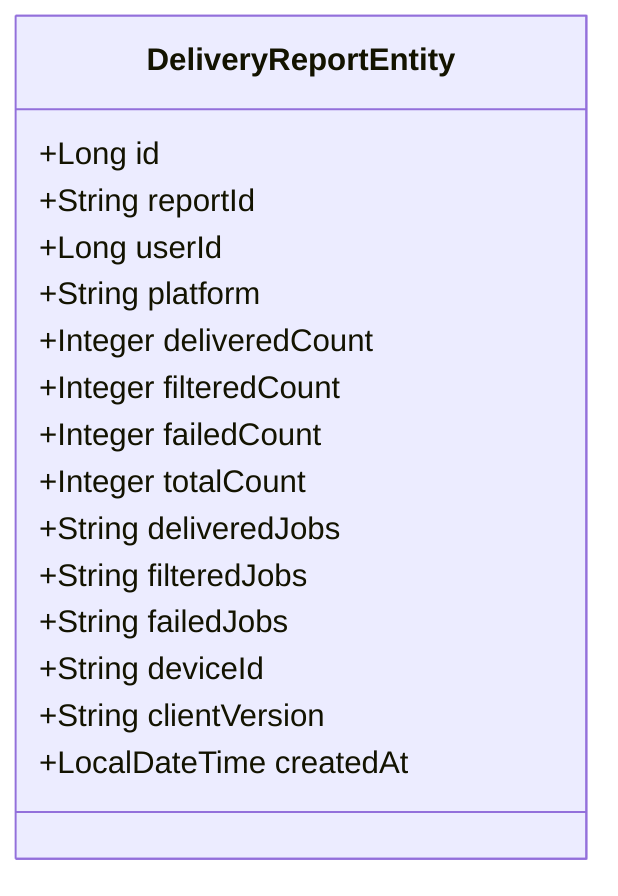

**图表来源**
- [DeliveryReportEntity.java:16-58](file://backend/src/main/java/com/getjobs/application/entity/DeliveryReportEntity.java#L16-L58)

**章节来源**
- [DeliveryReportEntity.java:10-58](file://backend/src/main/java/com/getjobs/application/entity/DeliveryReportEntity.java#L10-L58)

### 消费记录实体（ConsumptionLogEntity）
- 设计要点
  - 记录用户在不同平台与类型的消费明细与余额变化。
  - jobId/jobName 支持溯源与报表。
- 索引建议
  - userId、type、platform、jobId、createdAt 常用于查询与统计。
- 时间戳处理
  - createdAt 作为创建时间，配合业务逻辑更新更新时间。

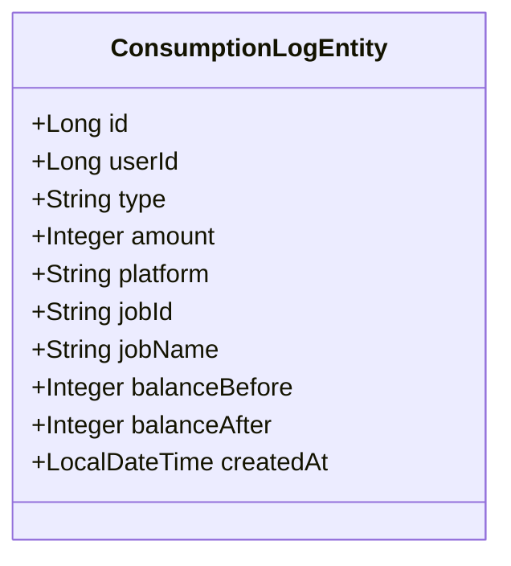

**图表来源**
- [ConsumptionLogEntity.java:15-45](file://backend/src/main/java/com/getjobs/application/entity/ConsumptionLogEntity.java#L15-L45)

**章节来源**
- [ConsumptionLogEntity.java:10-45](file://backend/src/main/java/com/getjobs/application/entity/ConsumptionLogEntity.java#L10-L45)

### 用户设备绑定实体（UserDeviceEntity）
- 设计要点
  - 记录设备指纹、设备名称与最后登录时间。
- 索引建议
  - deviceFingerprint、userId 常用于去重与登录校验。
- 时间戳处理
  - createdAt 作为创建时间，lastLoginAt 用于登录追踪。

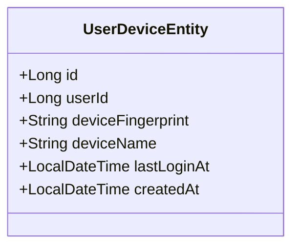

**图表来源**
- [UserDeviceEntity.java:15-34](file://backend/src/main/java/com/getjobs/application/entity/UserDeviceEntity.java#L15-L34)

**章节来源**
- [UserDeviceEntity.java:10-34](file://backend/src/main/java/com/getjobs/application/entity/UserDeviceEntity.java#L10-L34)

### AI 配置实体（AiEntity）
- 设计要点
  - 技能介绍与提示词，带时间戳。
- 索引建议
  - 通常单条配置，无需额外索引。
- 时间戳处理
  - created_at/updated_at 保持一致策略。

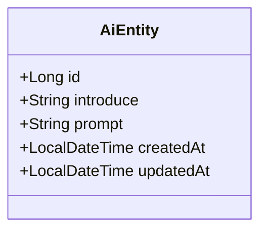

**图表来源**
- [AiEntity.java:16-46](file://backend/src/main/java/com/getjobs/application/entity/AiEntity.java#L16-L46)

**章节来源**
- [AiEntity.java:11-46](file://backend/src/main/java/com/getjobs/application/entity/AiEntity.java#L11-L46)

### Boss 黑名单实体（BlacklistEntity）
- 设计要点
  - 按类型（公司/招聘者/职位）过滤。
- 索引建议
  - type、value 常用于快速匹配。
- 时间戳处理
  - createdAt/updatedAt 保持一致策略。

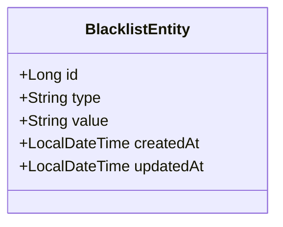

**图表来源**
- [BlacklistEntity.java:15-41](file://backend/src/main/java/com/getjobs/application/entity/BlacklistEntity.java#L15-L41)

**章节来源**
- [BlacklistEntity.java:10-41](file://backend/src/main/java/com/getjobs/application/entity/BlacklistEntity.java#L10-L41)

### Boss 配置实体（BossConfigEntity）
- 设计要点
  - 集中管理搜索关键词、城市、行业、经验/学历/薪资/规模/融资阶段、AI 与图片简历开关、HR 在线过滤等。
- 索引建议
  - 该表主要用于读取配置，无需额外索引。
- 时间戳处理
  - createdAt/updatedAt 保持一致策略。

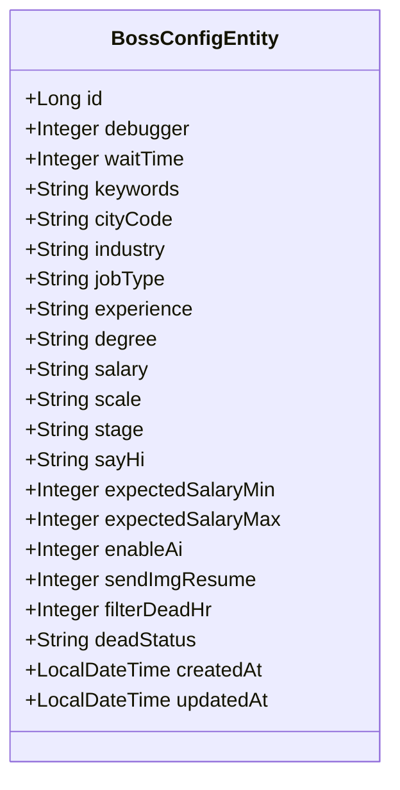

**图表来源**
- [BossConfigEntity.java:12-55](file://backend/src/main/java/com/getjobs/application/entity/BossConfigEntity.java#L12-L55)

**章节来源**
- [BossConfigEntity.java:10-55](file://backend/src/main/java/com/getjobs/application/entity/BossConfigEntity.java#L10-L55)

### 通用选项实体（CommonOptionEntity）
- 设计要点
  - 统一的选项字典，支持排序与标签。
- 索引建议
  - type、sortOrder 常用于排序与筛选。
- 时间戳处理
  - createdAt/updatedAt 保持一致策略。

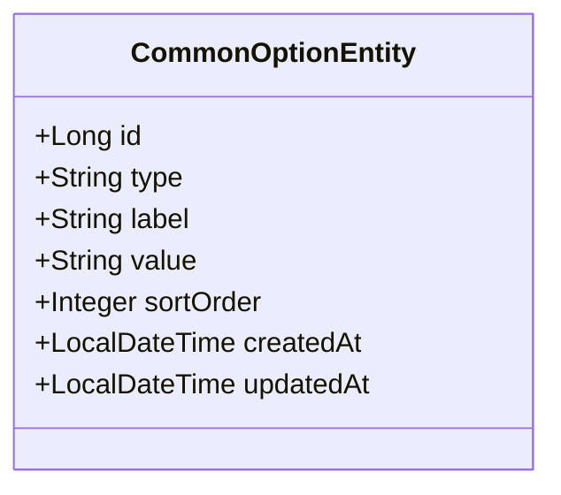

**图表来源**
- [CommonOptionEntity.java:12-27](file://backend/src/main/java/com/getjobs/application/entity/CommonOptionEntity.java#L12-L27)

**章节来源**
- [CommonOptionEntity.java:10-27](file://backend/src/main/java/com/getjobs/application/entity/CommonOptionEntity.java#L10-L27)

### 搜索预设实体（SearchPresetEntity）
- 设计要点
  - 保存常用搜索组合（关键词、城市）。
- 索引建议
  - name、city 常用于检索与展示。
- 时间戳处理
  - createdAt/updatedAt 保持一致策略。

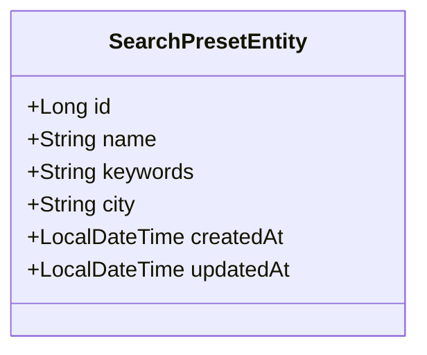

**图表来源**
- [SearchPresetEntity.java:14-33](file://backend/src/main/java/com/getjobs/application/entity/SearchPresetEntity.java#L14-L33)

**章节来源**
- [SearchPresetEntity.java:10-33](file://backend/src/main/java/com/getjobs/application/entity/SearchPresetEntity.java#L10-L33)

### 用户余额实体（UserBalanceEntity）
- 设计要点
  - 聚合各类额度与累计充值/消费次数，支撑订阅与消费控制。
- 索引建议
  - userId 常用于查询与更新。
- 时间戳处理
  - createdAt/updatedAt 保持一致策略。

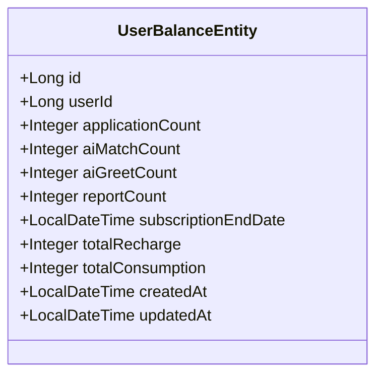

**图表来源**
- [UserBalanceEntity.java:14-48](file://backend/src/main/java/com/getjobs/application/entity/UserBalanceEntity.java#L14-L48)

**章节来源**
- [UserBalanceEntity.java:10-48](file://backend/src/main/java/com/getjobs/application/entity/UserBalanceEntity.java#L10-L48)

## 依赖分析
- 注解依赖
  - Lombok：通过注解自动生成 getter/setter/toString/equals/hashCode，减少样板代码。
  - MyBatis-Plus：通过 @TableName/@TableId/@TableField 等注解完成表与字段映射。
- 耦合与内聚
  - 实体之间通过外键或业务字段关联，避免直接耦合。
  - 平台数据实体（Boss/51job/猎聘/智联）相对独立，便于扩展与替换。
- 循环依赖
  - 当前实体间无循环依赖，符合单向依赖原则。

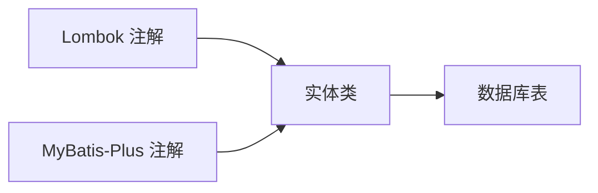

**图表来源**
- [UserEntity.java:3-6](file://backend/src/main/java/com/getjobs/application/entity/UserEntity.java#L3-L6)
- [CookieEntity.java:3-6](file://backend/src/main/java/com/getjobs/application/entity/CookieEntity.java#L3-L6)
- [BossJobDataEntity.java:3-6](file://backend/src/main/java/com/getjobs/application/entity/BossJobDataEntity.java#L3-L6)

**章节来源**
- [UserEntity.java:3-6](file://backend/src/main/java/com/getjobs/application/entity/UserEntity.java#L3-L6)
- [CookieEntity.java:3-6](file://backend/src/main/java/com/getjobs/application/entity/CookieEntity.java#L3-L6)
- [BossJobDataEntity.java:3-6](file://backend/src/main/java/com/getjobs/application/entity/BossJobDataEntity.java#L3-L6)

## 性能考虑
- 主键策略
  - 自增主键适用于高写入场景；对于分布式或多源合并场景，可考虑 UUID 或雪花 ID。
- 索引设计
  - 对高频查询字段建立合适索引，避免全表扫描；注意索引维护成本与写入开销的平衡。
- 时间戳一致性
  - 统一使用数据库默认值或框架自动填充，避免应用层重复赋值导致的不一致。
- JSON 字段
  - 投递报告中的 JSON 明细字段便于扩展，但不利于索引与复杂查询，建议仅在必要时使用。

## 故障排查指南
- 常见问题
  - 字段缺失或类型不匹配：核对实体注解与数据库 DDL 是否一致。
  - 时间戳异常：确认 created_at/updated_at 的默认值与更新策略。
  - 查询性能差：检查是否缺少必要的索引，或是否存在不必要的 JOIN。
- 排查步骤
  - 对照实体注解与数据库表结构，确认字段映射正确。
  - 使用慢查询日志定位热点 SQL，针对性优化索引。
  - 校验枚举字段（如状态、类型）的取值范围与业务规则。

## 结论
本实体模型设计遵循“清晰、可扩展、易维护”的原则，通过合理的字段命名、注解使用与时间戳策略，支撑多平台岗位数据采集与用户运营。建议在后续迭代中持续完善索引与查询优化，并保持注解与数据库结构的一致性。

## 附录
- 最佳实践清单
  - 使用 Lombok 减少样板代码，但需确保 IDE 插件与编译器配置正确。
  - MyBatis-Plus 注解与数据库 DDL 保持严格一致，避免运行时异常。
  - 对高频字段建立索引，定期评估索引使用情况。
  - 时间戳字段统一策略，避免业务层重复赋值。
  - JSON 字段仅用于灵活扩展，复杂查询尽量避免。