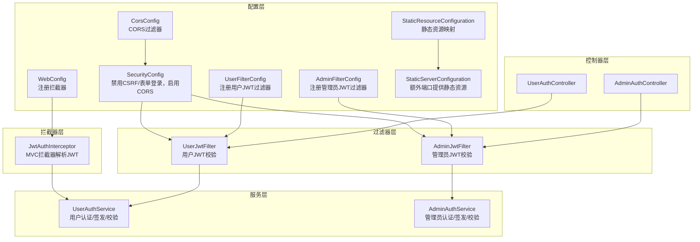
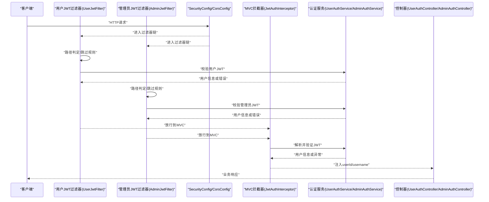
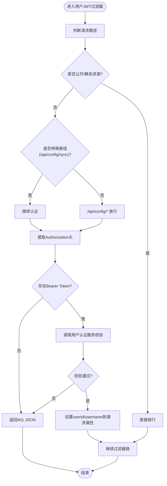
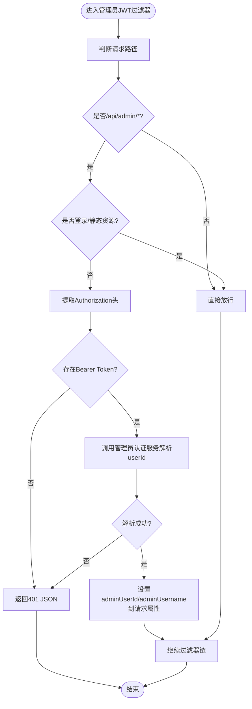
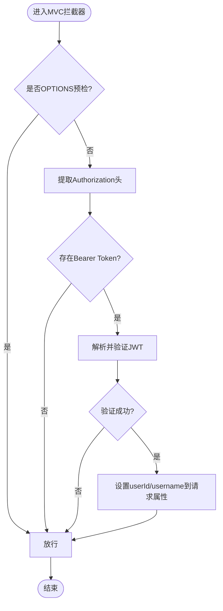
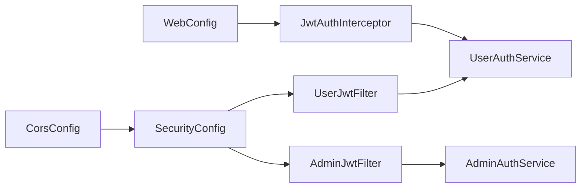

# 过滤器与拦截器

<cite>
**本文引用的文件**
- [SecurityConfig.java](file://backend/src/main/java/com/getjobs/application/config/SecurityConfig.java)
- [CorsConfig.java](file://backend/src/main/java/com/getjobs/application/config/CorsConfig.java)
- [UserFilterConfig.java](file://backend/src/main/java/com/getjobs/application/config/UserFilterConfig.java)
- [AdminFilterConfig.java](file://backend/src/main/java/com/getjobs/application/config/AdminFilterConfig.java)
- [WebConfig.java](file://backend/src/main/java/com/getjobs/application/config/WebConfig.java)
- [StaticResourceConfiguration.java](file://backend/src/main/java/com/getjobs/application/config/StaticResourceConfiguration.java)
- [StaticServerConfiguration.java](file://backend/src/main/java/com/getjobs/application/config/StaticServerConfiguration.java)
- [UserJwtFilter.java](file://backend/src/main/java/com/getjobs/application/filter/UserJwtFilter.java)
- [AdminJwtFilter.java](file://backend/src/main/java/com/getjobs/application/filter/AdminJwtFilter.java)
- [JwtAuthInterceptor.java](file://backend/src/main/java/com/getjobs/application/interceptor/JwtAuthInterceptor.java)
- [UserAuthService.java](file://backend/src/main/java/com/getjobs/application/service/UserAuthService.java)
- [AdminAuthService.java](file://backend/src/main/java/com/getjobs/application/service/AdminAuthService.java)
- [UserAuthController.java](file://backend/src/main/java/com/getjobs/application/controller/UserAuthController.java)
- [AdminAuthController.java](file://backend/src/main/java/com/getjobs/application/controller/AdminAuthController.java)
- [application.yaml](file://backend/src/main/resources/application.yaml)
</cite>

## 目录
1. [简介](#简介)
2. [项目结构](#项目结构)
3. [核心组件](#核心组件)
4. [架构总览](#架构总览)
5. [详细组件分析](#详细组件分析)
6. [依赖分析](#依赖分析)
7. [性能考虑](#性能考虑)
8. [故障排查指南](#故障排查指南)
9. [结论](#结论)
10. [附录](#附录)

## 简介
本文件面向基于 Spring Security 的 Web 应用，系统化梳理“过滤器与拦截器”的认证授权机制，重点覆盖：
- 基于 JWT 的用户与管理员认证流程
- 过滤器链与拦截器链的执行顺序与职责边界
- 跨域（CORS）与静态资源访问控制
- 异常处理与响应头设置策略
- 安全最佳实践与实现要点

目标是帮助开发者快速理解并正确扩展该体系，构建安全可靠的 Web 应用。

## 项目结构
围绕“过滤器与拦截器”主题，后端关键代码分布如下：
- 配置层：SecurityConfig、CorsConfig、UserFilterConfig、AdminFilterConfig、WebConfig、StaticResourceConfiguration、StaticServerConfiguration
- 过滤器层：UserJwtFilter、AdminJwtFilter
- 拦截器层：JwtAuthInterceptor
- 服务层：UserAuthService、AdminAuthService
- 控制器层：UserAuthController、AdminAuthController
- 配置文件：application.yaml

图表来源
- [SecurityConfig.java:24-44](file://backend/src/main/java/com/getjobs/application/config/SecurityConfig.java#L24-L44)
- [CorsConfig.java:15-38](file://backend/src/main/java/com/getjobs/application/config/CorsConfig.java#L15-L38)
- [UserFilterConfig.java:18-26](file://backend/src/main/java/com/getjobs/application/config/UserFilterConfig.java#L18-L26)
- [AdminFilterConfig.java:18-26](file://backend/src/main/java/com/getjobs/application/config/AdminFilterConfig.java#L18-L26)
- [WebConfig.java:25-35](file://backend/src/main/java/com/getjobs/application/config/WebConfig.java#L25-L35)
- [StaticResourceConfiguration.java:28-104](file://backend/src/main/java/com/getjobs/application/config/StaticResourceConfiguration.java#L28-L104)
- [StaticServerConfiguration.java:29-54](file://backend/src/main/java/com/getjobs/application/config/StaticServerConfiguration.java#L29-L54)
- [UserJwtFilter.java:26-81](file://backend/src/main/java/com/getjobs/application/filter/UserJwtFilter.java#L26-L81)
- [AdminJwtFilter.java:23-70](file://backend/src/main/java/com/getjobs/application/filter/AdminJwtFilter.java#L23-L70)
- [JwtAuthInterceptor.java:32-73](file://backend/src/main/java/com/getjobs/application/interceptor/JwtAuthInterceptor.java#L32-L73)
- [UserAuthService.java:192-216](file://backend/src/main/java/com/getjobs/application/service/UserAuthService.java#L192-L216)
- [AdminAuthService.java:105-125](file://backend/src/main/java/com/getjobs/application/service/AdminAuthService.java#L105-L125)
- [UserAuthController.java:85-108](file://backend/src/main/java/com/getjobs/application/controller/UserAuthController.java#L85-L108)
- [AdminAuthController.java:58-85](file://backend/src/main/java/com/getjobs/application/controller/AdminAuthController.java#L58-L85)

章节来源
- [SecurityConfig.java:24-44](file://backend/src/main/java/com/getjobs/application/config/SecurityConfig.java#L24-L44)
- [CorsConfig.java:15-38](file://backend/src/main/java/com/getjobs/application/config/CorsConfig.java#L15-L38)
- [UserFilterConfig.java:18-26](file://backend/src/main/java/com/getjobs/application/config/UserFilterConfig.java#L18-L26)
- [AdminFilterConfig.java:18-26](file://backend/src/main/java/com/getjobs/application/config/AdminFilterConfig.java#L18-L26)
- [WebConfig.java:25-35](file://backend/src/main/java/com/getjobs/application/config/WebConfig.java#L25-L35)
- [StaticResourceConfiguration.java:28-104](file://backend/src/main/java/com/getjobs/application/config/StaticResourceConfiguration.java#L28-L104)
- [StaticServerConfiguration.java:29-54](file://backend/src/main/java/com/getjobs/application/config/StaticServerConfiguration.java#L29-L54)

## 核心组件
- 安全过滤链与 CORS
  - SecurityConfig 禁用 CSRF、表单登录、HTTP Basic、登出；统一放行所有请求，交由自定义过滤器与拦截器完成细粒度鉴权。
  - CorsConfig 提供全局 CORS 过滤器，允许凭据、预检缓存等策略。
- 用户过滤器与管理员过滤器
  - UserJwtFilter：对特定用户业务路径进行 JWT 校验，跳过注册、登录、部分平台接口、静态资源等。
  - AdminJwtFilter：对 /api/admin/* 路径进行 JWT 校验，跳过登录与静态资源。
- MVC 拦截器
  - JwtAuthInterceptor：解析 Authorization 头中的 Bearer Token，将用户信息注入 RequestAttribute，供控制器使用。
- 认证服务
  - UserAuthService：用户注册、登录、签发/校验 JWT、查询/更新用户资料。
  - AdminAuthService：管理员登录、签发/校验 JWT、解析用户信息。
- 静态资源与跨端口服务
  - StaticResourceConfiguration：映射 dist/static 类路径与文件系统资源，支持 SPA 回退与 Next.js 静态导出。
  - StaticServerConfiguration：当未检测到前端开发服务时，额外开启 6866 端口提供静态资源。

章节来源
- [SecurityConfig.java:24-44](file://backend/src/main/java/com/getjobs/application/config/SecurityConfig.java#L24-L44)
- [CorsConfig.java:15-38](file://backend/src/main/java/com/getjobs/application/config/CorsConfig.java#L15-L38)
- [UserJwtFilter.java:26-81](file://backend/src/main/java/com/getjobs/application/filter/UserJwtFilter.java#L26-L81)
- [AdminJwtFilter.java:23-70](file://backend/src/main/java/com/getjobs/application/filter/AdminJwtFilter.java#L23-L70)
- [JwtAuthInterceptor.java:32-73](file://backend/src/main/java/com/getjobs/application/interceptor/JwtAuthInterceptor.java#L32-L73)
- [UserAuthService.java:192-216](file://backend/src/main/java/com/getjobs/application/service/UserAuthService.java#L192-L216)
- [AdminAuthService.java:105-125](file://backend/src/main/java/com/getjobs/application/service/AdminAuthService.java#L105-L125)
- [StaticResourceConfiguration.java:28-104](file://backend/src/main/java/com/getjobs/application/config/StaticResourceConfiguration.java#L28-L104)
- [StaticServerConfiguration.java:29-54](file://backend/src/main/java/com/getjobs/application/config/StaticServerConfiguration.java#L29-L54)

## 架构总览
下图展示请求在过滤器链与拦截器链中的流转，以及与认证服务的交互。

图表来源
- [SecurityConfig.java:24-44](file://backend/src/main/java/com/getjobs/application/config/SecurityConfig.java#L24-L44)
- [CorsConfig.java:15-38](file://backend/src/main/java/com/getjobs/application/config/CorsConfig.java#L15-L38)
- [UserJwtFilter.java:26-81](file://backend/src/main/java/com/getjobs/application/filter/UserJwtFilter.java#L26-L81)
- [AdminJwtFilter.java:23-70](file://backend/src/main/java/com/getjobs/application/filter/AdminJwtFilter.java#L23-L70)
- [JwtAuthInterceptor.java:32-73](file://backend/src/main/java/com/getjobs/application/interceptor/JwtAuthInterceptor.java#L32-L73)
- [UserAuthService.java:192-216](file://backend/src/main/java/com/getjobs/application/service/UserAuthService.java#L192-L216)
- [AdminAuthService.java:105-125](file://backend/src/main/java/com/getjobs/application/service/AdminAuthService.java#L105-L125)
- [UserAuthController.java:85-108](file://backend/src/main/java/com/getjobs/application/controller/UserAuthController.java#L85-L108)
- [AdminAuthController.java:58-85](file://backend/src/main/java/com/getjobs/application/controller/AdminAuthController.java#L58-L85)

## 详细组件分析

### 用户过滤器（UserJwtFilter）
- 职责
  - 对用户相关业务路径进行 JWT 校验；对公开接口与静态资源执行“跳过”策略。
  - 将用户标识与用户名写入请求属性，供后续过滤器/拦截器/控制器使用。
- 关键逻辑
  - 路径白名单与例外：注册、登录、平台采集、健康检查、Cookie、AI、部分配置接口等。
  - 特殊路径：/api/config/sync 需要认证；其他 /api/config/* 放行。
  - 令牌提取与校验：从 Authorization 头提取 Bearer Token，调用用户认证服务验证。
  - 错误处理：未提供令牌或校验失败时，返回 401 JSON 响应。
- 与拦截器的关系
  - 过滤器阶段完成“强制认证”，拦截器阶段可作为“辅助解析”，两者互不冲突。

图表来源
- [UserJwtFilter.java:26-81](file://backend/src/main/java/com/getjobs/application/filter/UserJwtFilter.java#L26-L81)
- [UserAuthService.java:192-216](file://backend/src/main/java/com/getjobs/application/service/UserAuthService.java#L192-L216)

章节来源
- [UserJwtFilter.java:26-81](file://backend/src/main/java/com/getjobs/application/filter/UserJwtFilter.java#L26-L81)
- [UserAuthService.java:192-216](file://backend/src/main/java/com/getjobs/application/service/UserAuthService.java#L192-L216)

### 管理员过滤器（AdminJwtFilter）
- 职责
  - 对 /api/admin/* 路径进行 JWT 校验；对登录与静态资源执行“跳过”策略。
  - 将管理员标识与用户名写入请求属性。
- 关键逻辑
  - 路径判定：非 /api/admin/* 直接放行；登录接口与静态资源跳过。
  - 令牌提取与校验：从 Authorization 头提取 Bearer Token，调用管理员认证服务解析用户ID。
  - 错误处理：未提供或无效令牌时，返回 401 JSON 响应。

图表来源
- [AdminJwtFilter.java:23-70](file://backend/src/main/java/com/getjobs/application/filter/AdminJwtFilter.java#L23-L70)
- [AdminAuthService.java:105-125](file://backend/src/main/java/com/getjobs/application/service/AdminAuthService.java#L105-L125)

章节来源
- [AdminJwtFilter.java:23-70](file://backend/src/main/java/com/getjobs/application/filter/AdminJwtFilter.java#L23-L70)
- [AdminAuthService.java:105-125](file://backend/src/main/java/com/getjobs/application/service/AdminAuthService.java#L105-L125)

### MVC 拦截器（JwtAuthInterceptor）
- 职责
  - 在 MVC 层解析 Authorization 头中的 Bearer Token，验证后将用户信息注入 RequestAttribute。
  - 对 OPTIONS 预检请求放行，避免影响 CORS。
- 行为特征
  - 令牌缺失时放行，由控制器自行判断是否必须登录。
  - 令牌无效时同样放行，由控制器处理未认证场景。
  - 令牌有效时，将 userId 与 username 写入请求属性，便于控制器读取。

图表来源
- [JwtAuthInterceptor.java:32-73](file://backend/src/main/java/com/getjobs/application/interceptor/JwtAuthInterceptor.java#L32-L73)
- [UserAuthService.java:192-216](file://backend/src/main/java/com/getjobs/application/service/UserAuthService.java#L192-L216)

章节来源
- [JwtAuthInterceptor.java:32-73](file://backend/src/main/java/com/getjobs/application/interceptor/JwtAuthInterceptor.java#L32-L73)
- [UserAuthService.java:192-216](file://backend/src/main/java/com/getjobs/application/service/UserAuthService.java#L192-L216)

### 安全配置与 CORS
- SecurityConfig
  - 禁用 CSRF、表单登录、HTTP Basic、登出，统一放行所有请求，交由自定义过滤器与拦截器完成鉴权。
  - 配置 CORS，允许所有来源、方法、头，允许凭据，预检缓存 3600 秒。
- CorsConfig
  - 提供独立的 CorsFilter Bean，与 SecurityConfig 的 CORS 配置互补或替代，按需启用。

章节来源
- [SecurityConfig.java:24-44](file://backend/src/main/java/com/getjobs/application/config/SecurityConfig.java#L24-L44)
- [SecurityConfig.java:49-66](file://backend/src/main/java/com/getjobs/application/config/SecurityConfig.java#L49-L66)
- [CorsConfig.java:15-38](file://backend/src/main/java/com/getjobs/application/config/CorsConfig.java#L15-L38)

### 静态资源访问控制
- StaticResourceConfiguration
  - 将 /** 映射到 dist/static 文件系统与类路径资源，禁用缓存，支持 SPA 回退与 Next.js 静态导出回退。
  - 自动探测前端开发服务，若存在则优先代理到前端端口。
- StaticServerConfiguration
  - 若未检测到前端开发服务且存在静态资源，则额外开启 6866 端口提供静态资源，便于本地调试。

章节来源
- [StaticResourceConfiguration.java:28-104](file://backend/src/main/java/com/getjobs/application/config/StaticResourceConfiguration.java#L28-L104)
- [StaticServerConfiguration.java:29-54](file://backend/src/main/java/com/getjobs/application/config/StaticServerConfiguration.java#L29-L54)

### 认证服务与控制器联动
- UserAuthService
  - 提供用户注册、登录、签发/校验 JWT、查询/更新用户资料等能力。
- AdminAuthService
  - 提供管理员登录、签发/校验 JWT、解析用户信息等能力。
- 控制器
  - UserAuthController：读取 RequestAttribute 中的 userId，进行受保护操作。
  - AdminAuthController：提供管理员登录与 Token 校验接口。

章节来源
- [UserAuthService.java:192-216](file://backend/src/main/java/com/getjobs/application/service/UserAuthService.java#L192-L216)
- [AdminAuthService.java:105-125](file://backend/src/main/java/com/getjobs/application/service/AdminAuthService.java#L105-L125)
- [UserAuthController.java:85-108](file://backend/src/main/java/com/getjobs/application/controller/UserAuthController.java#L85-L108)
- [AdminAuthController.java:58-85](file://backend/src/main/java/com/getjobs/application/controller/AdminAuthController.java#L58-L85)

## 依赖分析
- 组件耦合
  - 过滤器依赖认证服务（UserAuthService/AdminAuthService）进行 JWT 校验。
  - 拦截器依赖认证服务解析 JWT，并将用户信息注入请求。
  - WebConfig 将拦截器绑定到 /api/**，并排除无需认证的路径。
  - SecurityConfig/CorsConfig 与过滤器共同构成 CORS 与安全过滤链。
- 执行顺序
  - 过滤器链（用户过滤器优先于管理员过滤器）先于 MVC 拦截器执行。
  - 过滤器负责“强制认证”，拦截器负责“辅助解析”。

图表来源
- [UserFilterConfig.java:18-26](file://backend/src/main/java/com/getjobs/application/config/UserFilterConfig.java#L18-L26)
- [AdminFilterConfig.java:18-26](file://backend/src/main/java/com/getjobs/application/config/AdminFilterConfig.java#L18-L26)
- [WebConfig.java:25-35](file://backend/src/main/java/com/getjobs/application/config/WebConfig.java#L25-L35)
- [SecurityConfig.java:24-44](file://backend/src/main/java/com/getjobs/application/config/SecurityConfig.java#L24-L44)
- [CorsConfig.java:15-38](file://backend/src/main/java/com/getjobs/application/config/CorsConfig.java#L15-L38)

章节来源
- [UserFilterConfig.java:18-26](file://backend/src/main/java/com/getjobs/application/config/UserFilterConfig.java#L18-L26)
- [AdminFilterConfig.java:18-26](file://backend/src/main/java/com/getjobs/application/config/AdminFilterConfig.java#L18-L26)
- [WebConfig.java:25-35](file://backend/src/main/java/com/getjobs/application/config/WebConfig.java#L25-L35)
- [SecurityConfig.java:24-44](file://backend/src/main/java/com/getjobs/application/config/SecurityConfig.java#L24-L44)
- [CorsConfig.java:15-38](file://backend/src/main/java/com/getjobs/application/config/CorsConfig.java#L15-L38)

## 性能考虑
- 过滤器与拦截器的路径匹配应尽量精确，减少不必要的解析与数据库查询。
- JWT 解析采用内存密钥与一次性解析，建议：
  - 使用强随机密钥并妥善保管，避免硬编码。
  - 对频繁访问的接口，可在拦截器层做轻量级校验，必要时在过滤器层做严格校验。
- CORS 预检缓存时间合理设置，避免频繁 OPTIONS 请求。
- 静态资源禁用缓存仅在开发阶段使用，生产环境建议启用缓存与版本化资源。

## 故障排查指南
- 401 未认证
  - 检查 Authorization 头格式是否为 Bearer Token。
  - 核对过滤器/拦截器的路径排除配置，确认请求是否被错误放行或拦截。
  - 确认认证服务的密钥与过期时间配置一致。
- CORS 问题
  - 确认 SecurityConfig/CorsConfig 的允许来源、方法、头与凭据设置。
  - 检查浏览器是否发送了带凭据的请求。
- 静态资源无法访问
  - 确认 StaticResourceConfiguration 的资源路径与文件系统存在性。
  - 若未检测到前端开发服务，确认 StaticServerConfiguration 已启用额外端口。

章节来源
- [UserJwtFilter.java:58-74](file://backend/src/main/java/com/getjobs/application/filter/UserJwtFilter.java#L58-L74)
- [AdminJwtFilter.java:45-63](file://backend/src/main/java/com/getjobs/application/filter/AdminJwtFilter.java#L45-L63)
- [JwtAuthInterceptor.java:42-72](file://backend/src/main/java/com/getjobs/application/interceptor/JwtAuthInterceptor.java#L42-L72)
- [SecurityConfig.java:49-66](file://backend/src/main/java/com/getjobs/application/config/SecurityConfig.java#L49-L66)
- [CorsConfig.java:15-38](file://backend/src/main/java/com/getjobs/application/config/CorsConfig.java#L15-L38)
- [StaticResourceConfiguration.java:28-104](file://backend/src/main/java/com/getjobs/application/config/StaticResourceConfiguration.java#L28-L104)
- [StaticServerConfiguration.java:29-54](file://backend/src/main/java/com/getjobs/application/config/StaticServerConfiguration.java#L29-L54)

## 结论
本项目通过“过滤器 + 拦截器 + 认证服务”的分层设计，实现了灵活而可控的认证授权体系：
- 过滤器负责“强制认证”，拦截器负责“辅助解析”，二者配合覆盖大多数业务场景。
- CORS 与静态资源配置清晰，便于前后端联调与部署。
- 建议在生产环境中强化密钥管理、细化路径匹配、优化缓存策略，并持续监控与审计认证行为。

## 附录
- 配置要点
  - 用户 JWT 密钥与过期时间：参考 application.yaml 中 user.jwt.* 配置。
  - 管理员 JWT 密钥、过期时间与签发者：参考 application.yaml 中 admin.jwt.* 配置。
- 最佳实践
  - 令牌存储：客户端仅保存在安全上下文（如 HttpOnly Cookie 或内存），避免持久化明文。
  - 路径排除：仅对明确无需认证的接口放行，其余接口统一由过滤器/拦截器处理。
  - 错误响应：保持统一的 JSON 结构，便于前端统一处理。
  - 审计日志：对登录、认证失败、敏感操作增加日志记录。

章节来源
- [application.yaml:63-68](file://backend/src/main/resources/application.yaml#L63-L68)
- [application.yaml:35-36](file://backend/src/main/resources/application.yaml#L35-L36)
- [UserJwtFilter.java:26-81](file://backend/src/main/java/com/getjobs/application/filter/UserJwtFilter.java#L26-L81)
- [AdminJwtFilter.java:23-70](file://backend/src/main/java/com/getjobs/application/filter/AdminJwtFilter.java#L23-L70)
- [JwtAuthInterceptor.java:32-73](file://backend/src/main/java/com/getjobs/application/interceptor/JwtAuthInterceptor.java#L32-L73)