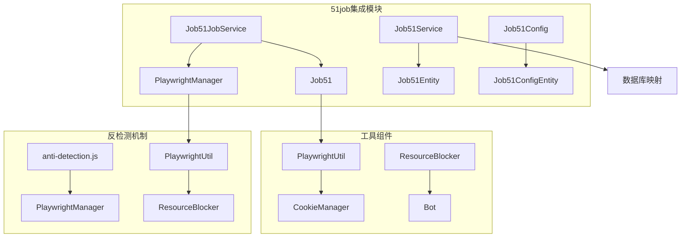
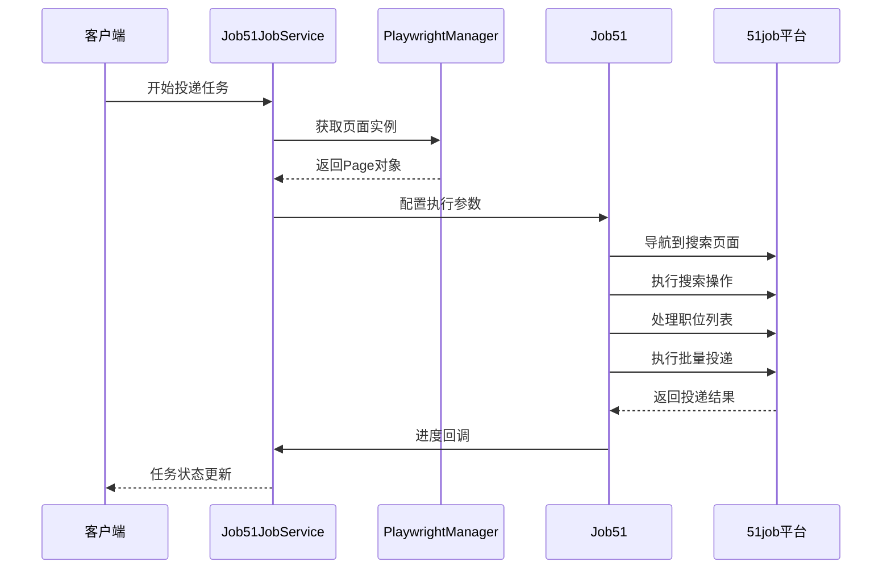
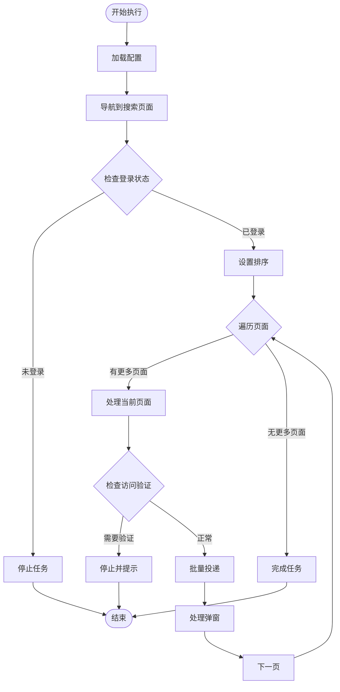
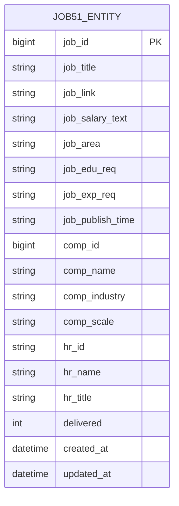
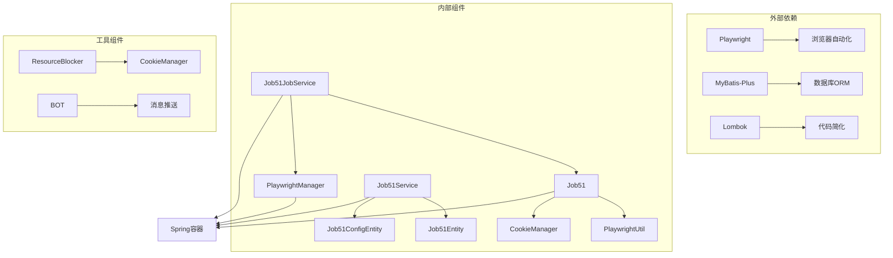

# 51job平台集成

<cite>
**本文档引用的文件**
- [Job51.java](file://backend/src/main/java/com/getjobs/worker/job51/Job51.java)
- [Job51Config.java](file://backend/src/main/java/com/getjobs/worker/job51/Job51Config.java)
- [Job51JobService.java](file://backend/src/main/java/com/getjobs/worker/service/Job51JobService.java)
- [Job51Service.java](file://backend/src/main/java/com/getjobs/application/service/Job51Service.java)
- [Job51Entity.java](file://backend/src/main/java/com/getjobs/application/entity/Job51Entity.java)
- [Job51ConfigEntity.java](file://backend/src/main/java/com/getjobs/application/entity/Job51ConfigEntity.java)
- [PlaywrightManager.java](file://backend/src/main/java/com/getjobs/worker/manager/PlaywrightManager.java)
- [PlaywrightUtil.java](file://backend/src/main/java/com/getjobs/worker/utils/PlaywrightUtil.java)
- [CookieManager.java](file://backend/src/main/java/com/getjobs/worker/utils/CookieManager.java)
- [ResourceBlocker.java](file://backend/src/main/java/com/getjobs/worker/utils/ResourceBlocker.java)
- [Bot.java](file://backend/src/main/java/com/getjobs/worker/utils/Bot.java)
- [anti-detection.js](file://backend/src/main/resources/anti-detection.js)
</cite>

## 目录
1. [简介](#简介)
2. [项目结构](#项目结构)
3. [核心组件](#核心组件)
4. [架构概览](#架构概览)
5. [详细组件分析](#详细组件分析)
6. [依赖关系分析](#依赖关系分析)
7. [性能考虑](#性能考虑)
8. [故障排除指南](#故障排除指南)
9. [结论](#结论)

## 简介

51job平台集成为招聘平台自动化系统的重要组成部分，负责实现前程无忧网站的自动化投递功能。该系统采用Playwright作为核心自动化框架，结合反检测技术和智能数据采集机制，实现了高效的职位搜索、筛选和在线申请流程。

系统的主要目标是为用户提供一个稳定、可靠的51job平台自动化解决方案，包括账户登录验证、职位检索算法、在线申请流程和数据收集机制。通过精心设计的反检测策略，系统能够在复杂的网页环境中保持稳定运行，避免被平台识别为自动化程序。

## 项目结构

51job平台集成模块位于项目的worker子系统中，采用了清晰的分层架构设计：

**图表来源**
- [Job51JobService.java:25-149](file://backend/src/main/java/com/getjobs/worker/service/Job51JobService.java#L25-L149)
- [Job51.java:31-107](file://backend/src/main/java/com/getjobs/worker/job51/Job51.java#L31-L107)

**章节来源**
- [Job51JobService.java:1-149](file://backend/src/main/java/com/getjobs/worker/service/Job51JobService.java#L1-L149)
- [Job51.java:1-107](file://backend/src/main/java/com/getjobs/worker/job51/Job51.java#L1-L107)

## 核心组件

### Job51JobService - 业务逻辑协调器

Job51JobService是51job平台集成的核心协调器，负责管理整个投递任务的生命周期。该组件实现了JobPlatformService接口，提供了统一的任务执行接口。

**主要职责：**
- 任务调度和状态管理
- 配置加载和验证
- 页面实例管理
- 进度回调处理
- 异常处理和恢复

**关键特性：**
- 线程安全的任务执行
- 实时进度反馈
- 停止信号处理
- 登录状态检查

### Job51 - 自动化执行引擎

Job51类是51job自动化的核心执行引擎，负责具体的页面操作和数据处理。该类实现了完整的投递流程，包括搜索、筛选、申请等步骤。

**核心功能：**
- 搜索页面导航和操作
- 职位列表解析和处理
- 批量投递执行
- 弹窗处理和状态检测
- 数据持久化

**章节来源**
- [Job51JobService.java:25-149](file://backend/src/main/java/com/getjobs/worker/service/Job51JobService.java#L25-L149)
- [Job51.java:31-107](file://backend/src/main/java/com/getjobs/worker/job51/Job51.java#L31-L107)

## 架构概览

51job平台集成采用分层架构设计，确保了系统的可维护性和扩展性：

**图表来源**
- [Job51JobService.java:37-111](file://backend/src/main/java/com/getjobs/worker/service/Job51JobService.java#L37-L111)
- [Job51.java:68-107](file://backend/src/main/java/com/getjobs/worker/job51/Job51.java#L68-L107)

系统架构的关键特点：
- **模块化设计**：每个组件职责明确，便于维护和测试
- **异步处理**：支持长时间运行的任务和实时进度反馈
- **错误恢复**：完善的异常处理和自动重试机制
- **状态管理**：精确的任务状态跟踪和控制

## 详细组件分析

### Job51 - 自动化执行引擎

Job51类是51job自动化的核心实现，采用了面向对象的设计模式，将复杂的页面操作封装为可重用的方法。

#### 页面操作流程

**图表来源**
- [Job51.java:112-248](file://backend/src/main/java/com/getjobs/worker/job51/Job51.java#L112-L248)

#### 关键实现细节

**网络拦截机制：**
系统实现了智能的网络拦截功能，能够监听51job的搜索API请求，提取职位数据并进行持久化存储。这种机制确保了即使页面结构发生变化，系统仍能准确获取职位信息。

**弹窗处理策略：**
针对51job平台的各种弹窗，系统采用了多层次的处理策略：
- 下载APP提示弹窗：自动识别并关闭
- 投递成功提示：解析成功数量并进行状态标记
- 单独申请弹窗：处理特殊申请流程
- 访问验证：检测并提示用户处理

**章节来源**
- [Job51.java:112-490](file://backend/src/main/java/com/getjobs/worker/job51/Job51.java#L112-L490)

### Job51Config - 配置管理

Job51Config类提供了灵活的配置管理机制，支持多维度的职位搜索参数。

#### 配置参数详解

| 参数名称 | 类型 | 描述 | 默认值 |
|---------|------|------|--------|
| keywords | List<String> | 搜索关键词列表 | 空列表 |
| jobArea | List<String> | 工作地点列表 | 空列表 |
| salary | List<String> | 薪资范围列表 | 空列表 |

**配置加载流程：**

**图表来源**
- [Job51Config.java:14-40](file://backend/src/main/java/com/getjobs/worker/job51/Job51Config.java#L14-L40)
- [Job51Service.java:64-99](file://backend/src/main/java/com/getjobs/application/service/Job51Service.java#L64-L99)

**章节来源**
- [Job51Config.java:14-40](file://backend/src/main/java/com/getjobs/worker/job51/Job51Config.java#L14-L40)
- [Job51Service.java:64-99](file://backend/src/main/java/com/getjobs/application/service/Job51Service.java#L64-L99)

### Job51Entity - 数据模型

Job51Entity是51job平台数据的核心模型，采用了简洁而完整的设计理念。

#### 数据模型设计

**图表来源**
- [Job51Entity.java:14-76](file://backend/src/main/java/com/getjobs/application/entity/Job51Entity.java#L14-L76)

**字段分类说明：**

**职位信息字段：**
- `job_id`: 岗位唯一标识符
- `job_title`: 职位名称
- `job_link`: 职位详情链接
- `job_salary_text`: 薪资描述文本
- `job_area`: 工作地点
- `job_edu_req`: 学历要求
- `job_exp_req`: 经验要求
- `job_publish_time`: 发布时间

**公司信息字段：**
- `comp_id`: 公司唯一标识符
- `comp_name`: 公司名称
- `comp_industry`: 公司行业
- `comp_scale`: 公司规模

**HR联系人字段：**
- `hr_id`: HR唯一标识符
- `hr_name`: HR姓名
- `hr_title`: HR职位

**状态管理字段：**
- `delivered`: 投递状态（0-未投递，1-已投递）
- `created_at`: 创建时间
- `updated_at`: 更新时间

**章节来源**
- [Job51Entity.java:14-76](file://backend/src/main/java/com/getjobs/application/entity/Job51Entity.java#L14-L76)

### 反检测策略实现

系统采用了多层次的反检测策略，确保自动化操作不会被51job平台识别为机器人行为。

#### 反检测机制架构

**图表来源**
- [PlaywrightUtil.java:425-487](file://backend/src/main/java/com/getjobs/worker/utils/PlaywrightUtil.java#L425-L487)
- [ResourceBlocker.java:23-102](file://backend/src/main/java/com/getjobs/worker/utils/ResourceBlocker.java#L23-L102)

#### 关键反检测技术

**User-Agent轮换：**
系统实现了动态User-Agent切换机制，模拟真实用户的浏览行为。通过定期更换浏览器指纹，有效避免了平台的识别。

**请求头伪装：**
除了User-Agent，系统还伪装了Accept-Language、Referer等多个请求头，使其看起来像是来自真实用户的请求。

**资源拦截优化：**
ResourceBlocker组件能够智能拦截不必要的资源请求，如图片、字体、视频等，显著减少了网络流量和DOM解析负担。

**行为模拟：**
系统实现了人性化的操作模拟，包括随机的鼠标移动轨迹、键盘输入延迟等，使自动化操作更加自然。

**章节来源**
- [PlaywrightUtil.java:425-487](file://backend/src/main/java/com/getjobs/worker/utils/PlaywrightUtil.java#L425-L487)
- [ResourceBlocker.java:23-102](file://backend/src/main/java/com/getjobs/worker/utils/ResourceBlocker.java#L23-L102)

## 依赖关系分析

51job平台集成模块的依赖关系体现了清晰的分层架构设计：

**图表来源**
- [Job51JobService.java:1-30](file://backend/src/main/java/com/getjobs/worker/service/Job51JobService.java#L1-L30)
- [Job51.java:1-20](file://backend/src/main/java/com/getjobs/worker/job51/Job51.java#L1-L20)

**依赖特点：**
- **低耦合高内聚**：各组件职责明确，依赖关系清晰
- **接口隔离**：通过接口定义规范组件间的交互
- **可测试性**：良好的依赖注入设计便于单元测试
- **可扩展性**：模块化设计支持新功能的添加

**章节来源**
- [Job51JobService.java:1-30](file://backend/src/main/java/com/getjobs/worker/service/Job51JobService.java#L1-L30)
- [Job51.java:1-20](file://backend/src/main/java/com/getjobs/worker/job51/Job51.java#L1-L20)

## 性能考虑

51job平台集成在设计时充分考虑了性能优化，采用了多种策略来提升系统的响应速度和稳定性。

### 性能优化策略

**1. 异步处理机制**
- 使用CompletableFuture实现并发初始化
- 异步等待登录状态检测
- 非阻塞的进度回调机制

**2. 资源管理优化**
- PagePool资源池管理
- Cookie持久化减少重复登录
- 内存使用监控和优化

**3. 网络性能优化**
- 智能资源拦截减少带宽消耗
- 请求合并和批处理
- 连接池复用

**4. 数据处理优化**
- 批量数据库操作
- 缓存机制减少重复查询
- 增量更新策略

### 性能监控指标

| 指标类型 | 目标值 | 监控方法 |
|---------|--------|----------|
| 页面加载时间 | < 10秒 | Navigation Timing API |
| 投递成功率 | > 95% | 任务执行日志 |
| 内存使用率 | < 80% | JVM监控 |
| CPU使用率 | < 70% | 系统监控 |
| 错误率 | < 1% | 异常统计 |

## 故障排除指南

### 常见问题及解决方案

**1. 登录状态异常**
- **症状**：投递任务提示需要登录
- **原因**：Cookie失效或登录状态检测异常
- **解决方案**：检查CookieManager状态，重新登录平台

**2. 页面元素找不到**
- **症状**：定位不到搜索框或投递按钮
- **原因**：页面结构变化或选择器过时
- **解决方案**：更新页面定位策略，检查元素可见性

**3. 访问验证失败**
- **症状**：出现滑块验证或验证码
- **原因**：触发了平台的安全防护机制
- **解决方案**：调整请求频率，使用代理IP

**4. 数据同步问题**
- **症状**：职位数据不完整或重复
- **原因**：网络异常或解析错误
- **解决方案**：检查网络连接，重新解析数据

### 调试工具和方法

**1. 日志分析**
- 启用详细日志级别
- 分析页面交互日志
- 监控异常堆栈信息

**2. 页面截图**
- 关键操作前后截图
- 错误发生时截图
- 页面结构分析

**3. 网络抓包**
- 分析API请求响应
- 检查请求头和参数
- 监控数据传输

**章节来源**
- [PlaywrightManager.java:773-800](file://backend/src/main/java/com/getjobs/worker/manager/PlaywrightManager.java#L773-L800)
- [Job51.java:621-686](file://backend/src/main/java/com/getjobs/worker/job51/Job51.java#L621-L686)

## 结论

51job平台集成为招聘平台自动化系统提供了完整的技术解决方案。通过精心设计的架构和实现策略，系统成功解决了自动化投递过程中的各种技术挑战。

**主要成就：**
- 实现了稳定的51job平台自动化投递功能
- 建立了完善的反检测机制
- 设计了灵活的数据采集和处理系统
- 提供了友好的用户界面和监控能力

**技术优势：**
- 模块化设计便于维护和扩展
- 多层次的反检测策略确保稳定性
- 智能的数据处理机制提高准确性
- 完善的错误处理和恢复机制

**未来发展方向：**
- 持续优化反检测策略
- 增强机器学习算法提升匹配精度
- 扩展支持更多招聘平台
- 提升用户体验和易用性

该系统为招聘平台自动化开发者和数据采集工程师提供了宝贵的参考和实践指导，具有重要的实用价值和技术意义。