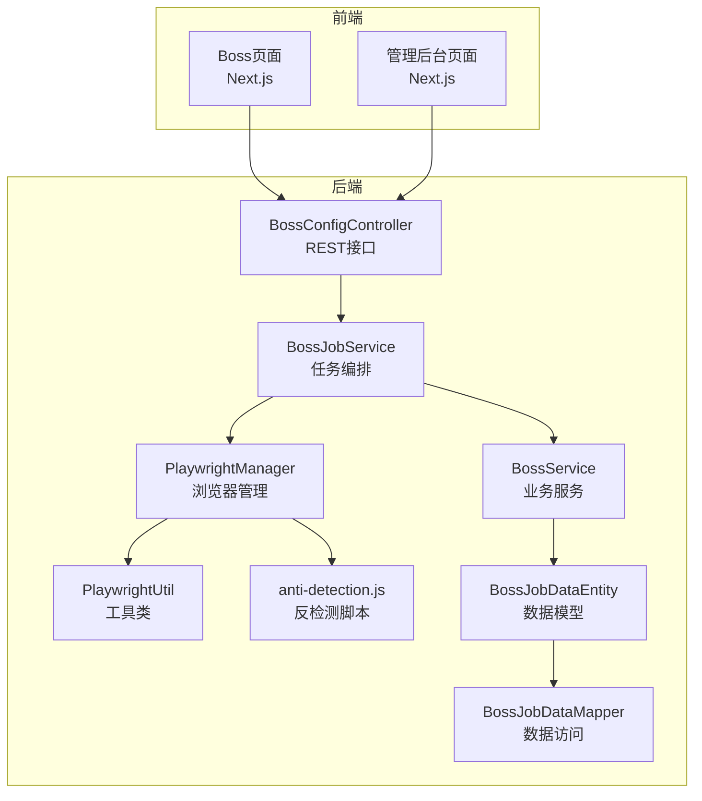
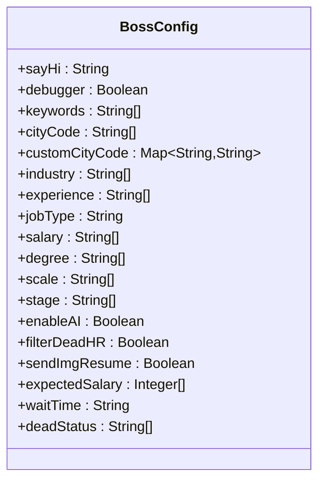
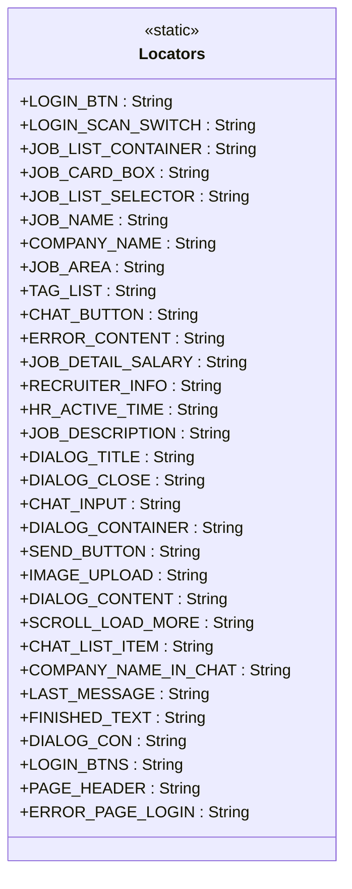
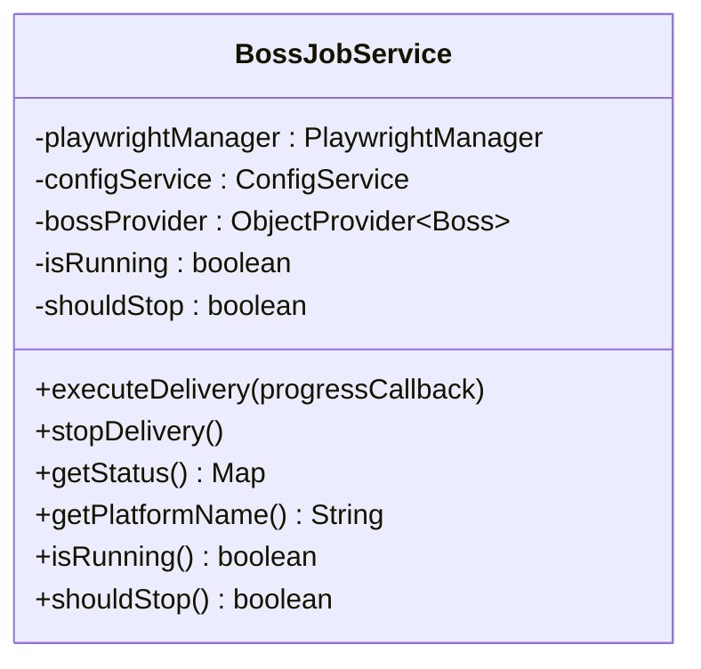
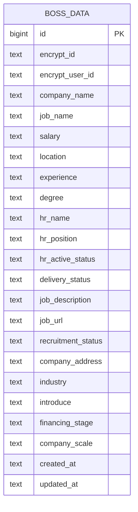
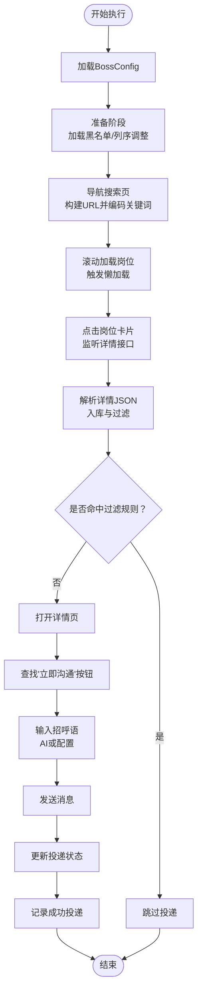
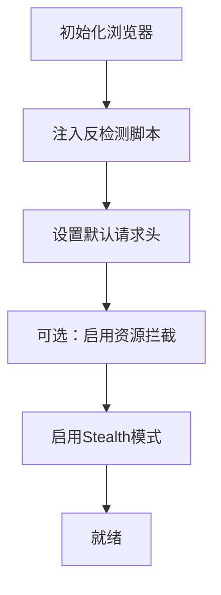
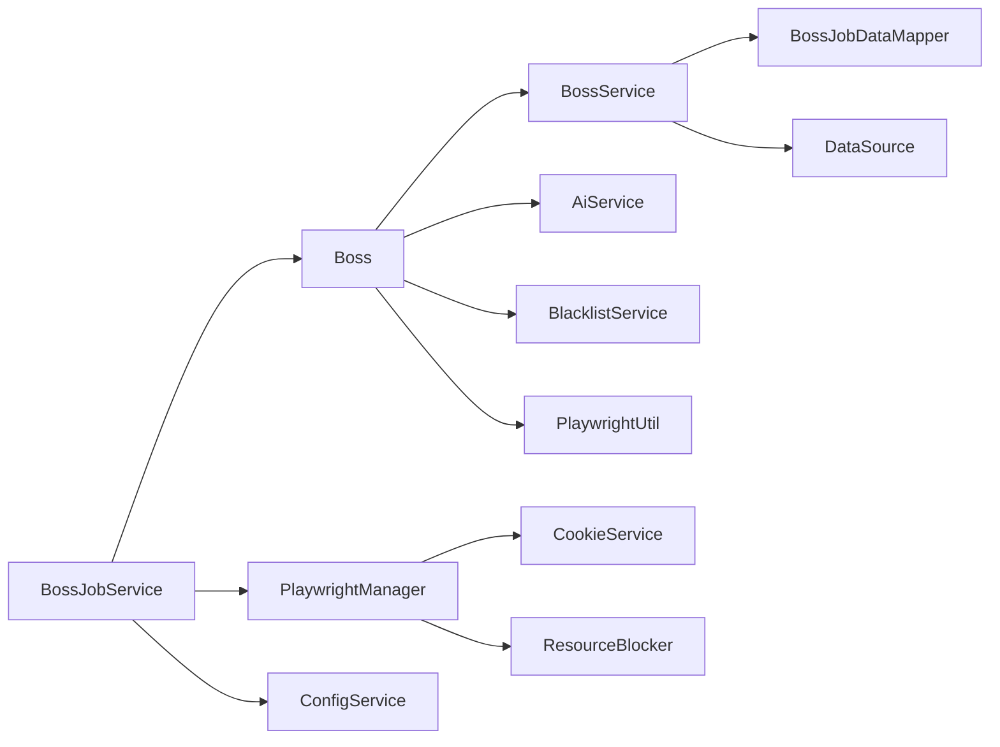

# Boss直聘平台集成

<cite>
**本文档引用的文件**
- [Boss.java](file://backend/src/main/java/com/getjobs/worker/boss/Boss.java)
- [BossConfig.java](file://backend/src/main/java/com/getjobs/worker/boss/BossConfig.java)
- [Locators.java](file://backend/src/main/java/com/getjobs/worker/boss/Locators.java)
- [BossJobService.java](file://backend/src/main/java/com/getjobs/worker/service/BossJobService.java)
- [BossJobDataEntity.java](file://backend/src/main/java/com/getjobs/application/entity/BossJobDataEntity.java)
- [PlaywrightUtil.java](file://backend/src/main/java/com/getjobs/worker/utils/PlaywrightUtil.java)
- [BossService.java](file://backend/src/main/java/com/getjobs/application/service/BossService.java)
- [PlaywrightManager.java](file://backend/src/main/java/com/getjobs/worker/manager/PlaywrightManager.java)
- [ConfigService.java](file://backend/src/main/java/com/getjobs/application/service/ConfigService.java)
- [BossConfigController.java](file://backend/src/main/java/com/getjobs/application/controller/BossConfigController.java)
- [BossJobDataMapper.java](file://backend/src/main/java/com/getjobs/application/mapper/BossJobDataMapper.java)
- [anti-detection.js](file://backend/src/main/resources/anti-detection.js)
</cite>

## 目录
1. [简介](#简介)
2. [项目结构](#项目结构)
3. [核心组件](#核心组件)
4. [架构总览](#架构总览)
5. [详细组件分析](#详细组件分析)
6. [依赖关系分析](#依赖关系分析)
7. [性能考虑](#性能考虑)
8. [故障排除指南](#故障排除指南)
9. [结论](#结论)
10. [附录](#附录)

## 简介
本文件面向自动化测试工程师与平台集成开发者，系统化阐述 Boss 直聘平台集成模块的完整实现方案。内容涵盖登录认证流程、岗位搜索算法、简历投递机制、数据采集策略、页面元素定位策略与交互模式、反检测机制（验证码处理、行为模拟、请求伪装）、配置管理（BossConfig）、元素定位器（Locators）、业务逻辑（BossJobService）、数据模型（BossJobDataEntity）以及常见问题的解决方案（登录失败、验证码识别、IP 封禁等）。文档同时提供代码级架构图与流程图，帮助读者快速理解与落地。

## 项目结构
Boss 直聘集成模块位于后端工程的 worker 与 application 两个包下，采用“工具层 + 业务层 + 应用层”的分层设计：
- worker 层：负责浏览器自动化、页面交互、反检测、任务调度与业务流程编排
- application 层：负责数据模型、持久化、配置加载与业务服务
- controller 层：对外暴露配置与任务控制接口

**图表来源**
- [BossConfigController.java:1-214](file://backend/src/main/java/com/getjobs/application/controller/BossConfigController.java#L1-L214)
- [BossJobService.java:1-141](file://backend/src/main/java/com/getjobs/worker/service/BossJobService.java#L1-L141)
- [PlaywrightManager.java:1-200](file://backend/src/main/java/com/getjobs/worker/manager/PlaywrightManager.java#L1-L200)
- [PlaywrightUtil.java:1-610](file://backend/src/main/java/com/getjobs/worker/utils/PlaywrightUtil.java#L1-L610)
- [BossService.java:1-800](file://backend/src/main/java/com/getjobs/application/service/BossService.java#L1-L800)
- [BossJobDataEntity.java:1-108](file://backend/src/main/java/com/getjobs/application/entity/BossJobDataEntity.java#L1-L108)
- [BossJobDataMapper.java:1-9](file://backend/src/main/java/com/getjobs/application/mapper/BossJobDataMapper.java#L1-L9)
- [anti-detection.js:1-109](file://backend/src/main/resources/anti-detection.js#L1-L109)

**章节来源**
- [BossConfigController.java:1-214](file://backend/src/main/java/com/getjobs/application/controller/BossConfigController.java#L1-L214)
- [BossJobService.java:1-141](file://backend/src/main/java/com/getjobs/worker/service/BossJobService.java#L1-L141)
- [PlaywrightManager.java:1-200](file://backend/src/main/java/com/getjobs/worker/manager/PlaywrightManager.java#L1-L200)

## 核心组件
- Boss：负责登录后的岗位搜索、列表加载、详情解析、过滤与投递全流程
- BossConfig：Boss 平台的配置数据类，承载关键词、城市、行业、经验、学历、薪资、是否启用 AI、是否过滤不活跃 HR、是否发送图片简历等
- Locators：集中管理 Boss 页面元素定位表达式，保证定位稳定与可维护
- BossJobService：任务编排服务，负责获取页面、校验登录状态、加载配置、执行投递并上报进度
- BossJobDataEntity：Boss 岗位数据实体，包含加密 ID、公司、岗位、薪资、HR 信息、投递状态、岗位链接等字段
- PlaywrightUtil：Playwright 工具类，提供浏览器初始化、Stealth 反检测、Cookie 管理、元素操作等能力
- BossService：业务服务，负责配置加载、选项转换、黑名单管理、数据去重与入库、投递状态更新、统计分析
- PlaywrightManager：浏览器管理器，统一管理 BrowserContext、页面生命周期、登录状态监控、反检测脚本注入
- ConfigService：统一配置入口，从各平台专用配置表加载 BossConfig
- anti-detection.js：反检测脚本，用于隐藏自动化特征

**章节来源**
- [Boss.java:1-800](file://backend/src/main/java/com/getjobs/worker/boss/Boss.java#L1-L800)
- [BossConfig.java:1-107](file://backend/src/main/java/com/getjobs/worker/boss/BossConfig.java#L1-L107)
- [Locators.java:1-63](file://backend/src/main/java/com/getjobs/worker/boss/Locators.java#L1-L63)
- [BossJobService.java:1-141](file://backend/src/main/java/com/getjobs/worker/service/BossJobService.java#L1-L141)
- [BossJobDataEntity.java:1-108](file://backend/src/main/java/com/getjobs/application/entity/BossJobDataEntity.java#L1-L108)
- [PlaywrightUtil.java:1-610](file://backend/src/main/java/com/getjobs/worker/utils/PlaywrightUtil.java#L1-L610)
- [BossService.java:1-800](file://backend/src/main/java/com/getjobs/application/service/BossService.java#L1-L800)
- [PlaywrightManager.java:1-200](file://backend/src/main/java/com/getjobs/worker/manager/PlaywrightManager.java#L1-L200)
- [ConfigService.java:1-288](file://backend/src/main/java/com/getjobs/application/service/ConfigService.java#L1-L288)
- [anti-detection.js:1-109](file://backend/src/main/resources/anti-detection.js#L1-L109)

## 架构总览
Boss 集成采用“浏览器自动化 + 配置驱动 + 数据持久化”的架构。前端通过 REST 接口下发配置与启动命令，后端通过 PlaywrightManager 获取页面，BossJobService 调度 Boss 执行投递，BossService 负责数据去重与入库，PlaywrightUtil/PlaywrightManager 提供反检测与浏览器能力。

```mermaid
sequenceDiagram
participant FE as "前端"
participant CTRL as "BossConfigController"
participant SVC as "BossJobService"
participant PM as "PlaywrightManager"
participant PGL as "Boss 页面"
participant BIZ as "BossService"
FE->>CTRL : GET /api/boss/config
CTRL-->>FE : 返回配置与选项
FE->>CTRL : POST /api/boss/config/start
CTRL-->>FE : 启动响应
CTRL->>SVC : executeDelivery(progress)
SVC->>PM : 获取Boss页面
SVC->>PM : 校验登录状态
SVC->>SVC : 加载BossConfig
SVC->>PGL : 打开搜索页
SVC->>PGL : 滚动加载岗位
SVC->>PGL : 点击岗位卡片
PGL-->>SVC : 返回岗位详情JSON
SVC->>BIZ : 解析并入库
SVC->>PGL : 打开详情页并发送消息
SVC->>BIZ : 更新投递状态
SVC-->>FE : 进度回调
```

**图表来源**
- [BossConfigController.java:1-214](file://backend/src/main/java/com/getjobs/application/controller/BossConfigController.java#L1-L214)
- [BossJobService.java:1-141](file://backend/src/main/java/com/getjobs/worker/service/BossJobService.java#L1-L141)
- [PlaywrightManager.java:1-200](file://backend/src/main/java/com/getjobs/worker/manager/PlaywrightManager.java#L1-L200)
- [BossService.java:1-800](file://backend/src/main/java/com/getjobs/application/service/BossService.java#L1-L800)

## 详细组件分析

### BossConfig 配置管理
- 字段覆盖：关键词、城市编码、行业、经验、学历、工作类型、薪资、期望薪资、是否启用 AI、是否过滤不活跃 HR、是否发送图片简历、等待时间、HR 不在线状态等
- 加载策略：ConfigService 从 boss_config 专用表加载，BossService 进行名称/代码转换与列表解析，最终构建 BossConfig 供 Boss 执行

**图表来源**
- [BossConfig.java:1-107](file://backend/src/main/java/com/getjobs/worker/boss/BossConfig.java#L1-L107)

**章节来源**
- [ConfigService.java:267-272](file://backend/src/main/java/com/getjobs/application/service/ConfigService.java#L267-L272)
- [BossService.java:304-366](file://backend/src/main/java/com/getjobs/application/service/BossService.java#L304-L366)

### Locators 元素定位器
- 集中式管理所有页面元素定位表达式，包括登录入口、搜索结果页、岗位卡片、详情页、聊天输入、黑名单列表等
- 通过常量统一维护，降低页面结构调整带来的维护成本

**图表来源**
- [Locators.java:1-63](file://backend/src/main/java/com/getjobs/worker/boss/Locators.java#L1-L63)

**章节来源**
- [Locators.java:1-63](file://backend/src/main/java/com/getjobs/worker/boss/Locators.java#L1-L63)

### BossJobService 业务逻辑
- 任务编排：获取页面、校验登录状态、暂停后台监控避免并发冲突、加载配置、回调进度、执行投递、恢复监控
- 状态管理：运行中标识、停止信号、平台状态查询
- 与 Boss 的协作：注入页面、配置、进度回调、停止回调

**图表来源**
- [BossJobService.java:1-141](file://backend/src/main/java/com/getjobs/worker/service/BossJobService.java#L1-L141)

**章节来源**
- [BossJobService.java:1-141](file://backend/src/main/java/com/getjobs/worker/service/BossJobService.java#L1-L141)

### BossJobDataEntity 数据模型
- 字段覆盖：加密 ID、加密用户 ID、公司、岗位、薪资、地点、经验、学历、HR 姓名、HR 职位、HR 活跃状态、投递状态、岗位描述、岗位链接、招聘状态、公司地址、行业、公司介绍、融资阶段、公司规模、创建/更新时间
- 去重策略：优先以 encrypt_id + encrypt_user_id 去重；若缺少 encrypt_user_id，则以 encrypt_id 去重
- 入库与状态更新：插入时填充时间戳；投递后按 encrypt_id/encrypt_user_id 更新状态

**图表来源**
- [BossJobDataEntity.java:1-108](file://backend/src/main/java/com/getjobs/application/entity/BossJobDataEntity.java#L1-L108)

**章节来源**
- [BossJobDataEntity.java:1-108](file://backend/src/main/java/com/getjobs/application/entity/BossJobDataEntity.java#L1-L108)
- [BossService.java:624-677](file://backend/src/main/java/com/getjobs/application/service/BossService.java#L624-L677)

### Boss 登录认证与投递流程
- 登录状态检测：通过页面特征（头像、登录按钮）判断是否已登录，未登录时引导至登录页并切换二维码扫码
- 页面初始化：注入反检测脚本，设置默认请求头与 UA，启用资源拦截（可选）
- 岗位搜索：构建搜索 URL（城市、jobType、salary、experience、degree、scale、industry、stage），编码关键词
- 列表加载：滚动到底部，触发懒加载；连续多次无新增时强制触底
- 详情解析：监听 /wapi/zpgeek/job/detail.json 接口，解析并入库，同时构建 Job 对象用于投递
- 过滤策略：黑名单（公司/招聘者/职位）、HR 不活跃（包含“年”）、公共黑名单、HR 活跃状态过滤
- 投递流程：打开详情页，查找“立即沟通”按钮，输入招呼语（AI 生成或配置），发送消息；可选发送图片简历；更新投递状态并记录结果

**图表来源**
- [Boss.java:112-434](file://backend/src/main/java/com/getjobs/worker/boss/Boss.java#L112-L434)
- [Boss.java:613-777](file://backend/src/main/java/com/getjobs/worker/boss/Boss.java#L613-L777)

**章节来源**
- [Boss.java:94-125](file://backend/src/main/java/com/getjobs/worker/boss/Boss.java#L94-L125)
- [Boss.java:228-434](file://backend/src/main/java/com/getjobs/worker/boss/Boss.java#L228-L434)
- [Boss.java:613-777](file://backend/src/main/java/com/getjobs/worker/boss/Boss.java#L613-L777)

### 反检测机制
- 浏览器初始化：设置 UA、视口、慢动作、调试端口、禁用扩展与软件光栅化
- 反检测脚本：注入 anti-detection.js，隐藏 webdriver、删除自动化变量、伪装 navigator 属性
- 请求伪装：设置默认请求头（UA、语言、来源），增强与真实用户一致
- 资源拦截：可选启用资源拦截器，降低内存占用与检测风险
- Stealth 模式：增强版 Stealth，集成多种反检测手段

**图表来源**
- [PlaywrightManager.java:114-200](file://backend/src/main/java/com/getjobs/worker/manager/PlaywrightManager.java#L114-L200)
- [PlaywrightManager.java:223-237](file://backend/src/main/java/com/getjobs/worker/manager/PlaywrightManager.java#L223-L237)
- [PlaywrightUtil.java:425-487](file://backend/src/main/java/com/getjobs/worker/utils/PlaywrightUtil.java#L425-L487)
- [anti-detection.js:1-109](file://backend/src/main/resources/anti-detection.js#L1-L109)

**章节来源**
- [PlaywrightManager.java:114-200](file://backend/src/main/java/com/getjobs/worker/manager/PlaywrightManager.java#L114-L200)
- [PlaywrightUtil.java:425-487](file://backend/src/main/java/com/getjobs/worker/utils/PlaywrightUtil.java#L425-L487)
- [anti-detection.js:1-109](file://backend/src/main/resources/anti-detection.js#L1-L109)

## 依赖关系分析
- Boss 依赖 BossService（数据去重、入库、状态更新）、AiService（AI 生成消息）、BlacklistService（公共黑名单）、PlaywrightUtil（工具能力）
- BossJobService 依赖 PlaywrightManager（页面与监控）、ConfigService（配置加载）、ObjectProvider<Boss>（Boss 实例）
- BossService 依赖各 Mapper（数据访问）、DataSource（统计分析）
- PlaywrightManager 依赖 CookieService（Cookie 管理）、ResourceBlocker（资源拦截）

**图表来源**
- [Boss.java:47-49](file://backend/src/main/java/com/getjobs/worker/boss/Boss.java#L47-L49)
- [BossJobService.java:28-30](file://backend/src/main/java/com/getjobs/worker/service/BossJobService.java#L28-L30)
- [BossService.java:31-36](file://backend/src/main/java/com/getjobs/application/service/BossService.java#L31-L36)
- [PlaywrightManager.java:90-110](file://backend/src/main/java/com/getjobs/worker/manager/PlaywrightManager.java#L90-L110)

**章节来源**
- [Boss.java:47-49](file://backend/src/main/java/com/getjobs/worker/boss/Boss.java#L47-L49)
- [BossJobService.java:28-30](file://backend/src/main/java/com/getjobs/worker/service/BossJobService.java#L28-L30)
- [BossService.java:31-36](file://backend/src/main/java/com/getjobs/application/service/BossService.java#L31-L36)
- [PlaywrightManager.java:90-110](file://backend/src/main/java/com/getjobs/worker/manager/PlaywrightManager.java#L90-L110)

## 性能考虑
- 懒加载与滚动策略：按视口高度渐进滚动，避免频繁触发网络请求；连续多次无新增时强制触底，提升稳定性
- 列表加载优化：等待列表容器出现，确保首屏渲染完成；监听详情接口响应，减少无效等待
- 反检测与资源拦截：启用资源拦截降低内存占用；Stealth 模式减少被检测概率，提高稳定性
- 并发与监控：Boss 投递期间暂停后台登录监控，避免并发访问同一页面导致的状态竞争
- 数据去重与入库：优先以 encrypt_id + encrypt_user_id 去重，减少重复入库与网络请求

[本节为通用性能指导，无需具体文件引用]

## 故障排除指南
- 登录失败
  - 现象：任务提示“请先登录 Boss 直聘”
  - 处理：确认浏览器已正确注入反检测脚本并处于登录状态；检查 PlaywrightManager 的登录状态监控是否正常
  - 参考
    - [BossJobService.java:52-56](file://backend/src/main/java/com/getjobs/worker/service/BossJobService.java#L52-L56)
    - [PlaywrightManager.java:346-388](file://backend/src/main/java/com/getjobs/worker/manager/PlaywrightManager.java#L346-L388)
- 验证码识别
  - 现象：页面出现验证码或滑块验证
  - 处理：当前实现未集成验证码识别；建议人工完成验证或使用第三方 OCR/打码平台；在 PlaywrightUtil 中可扩展验证码处理流程
  - 参考
    - [PlaywrightUtil.java:1-610](file://backend/src/main/java/com/getjobs/worker/utils/PlaywrightUtil.java#L1-L610)
- IP 封禁
  - 现象：页面提示 403 或无法访问
  - 处理：启用资源拦截与 Stealth 模式；合理设置慢动作与等待时间；必要时更换代理或使用分布式部署
  - 参考
    - [PlaywrightManager.java:152-166](file://backend/src/main/java/com/getjobs/worker/manager/PlaywrightManager.java#L152-L166)
    - [PlaywrightUtil.java:425-487](file://backend/src/main/java/com/getjobs/worker/utils/PlaywrightUtil.java#L425-L487)
- 岗位未投递
  - 现象：投递成功数为 0
  - 处理：检查过滤规则（黑名单、HR 不活跃、公共黑名单）；确认“立即沟通”按钮是否可点击；查看日志中的投递状态更新
  - 参考
    - [Boss.java:380-408](file://backend/src/main/java/com/getjobs/worker/boss/Boss.java#L380-L408)
    - [Boss.java:747-777](file://backend/src/main/java/com/getjobs/worker/boss/Boss.java#L747-L777)
- 数据库列顺序问题
  - 现象：首次运行可能出现列顺序不一致
  - 处理：BossService 会自动在线迁移，确保 encrypt_id、encrypt_user_id 前置
  - 参考
    - [BossService.java:542-622](file://backend/src/main/java/com/getjobs/application/service/BossService.java#L542-L622)

**章节来源**
- [BossJobService.java:52-56](file://backend/src/main/java/com/getjobs/worker/service/BossJobService.java#L52-L56)
- [PlaywrightManager.java:346-388](file://backend/src/main/java/com/getjobs/worker/manager/PlaywrightManager.java#L346-L388)
- [PlaywrightUtil.java:425-487](file://backend/src/main/java/com/getjobs/worker/utils/PlaywrightUtil.java#L425-L487)
- [Boss.java:380-408](file://backend/src/main/java/com/getjobs/worker/boss/Boss.java#L380-L408)
- [Boss.java:747-777](file://backend/src/main/java/com/getjobs/worker/boss/Boss.java#L747-L777)
- [BossService.java:542-622](file://backend/src/main/java/com/getjobs/application/service/BossService.java#L542-L622)

## 结论
本集成方案通过“配置驱动 + 浏览器自动化 + 反检测 + 数据持久化”的组合，实现了 Boss 直聘平台的自动化岗位搜索、过滤与投递。BossConfig 提供灵活的配置能力，Locators 统一元素定位，BossJobService 负责任务编排，BossService 负责数据治理，PlaywrightManager/PlaywrightUtil 提供稳定的浏览器环境与反检测能力。针对常见问题提供了清晰的排查路径与处理建议，适合自动化测试工程师与平台集成开发者参考与落地。

[本节为总结性内容，无需具体文件引用]

## 附录
- 配置接口
  - 获取配置：GET /api/boss/config
  - 更新配置：PUT /api/boss/config
  - 获取选项：GET /api/boss/config/options/{type}
  - 获取黑名单：GET /api/boss/config/blacklist
  - 添加黑名单：POST /api/boss/config/blacklist
  - 删除黑名单：DELETE /api/boss/config/blacklist/{id}
- 任务接口
  - 启动投递：POST /api/boss/config/start
  - 停止投递：POST /api/boss/config/stop
  - 查询状态：GET /api/boss/config/status

**章节来源**
- [BossConfigController.java:28-213](file://backend/src/main/java/com/getjobs/application/controller/BossConfigController.java#L28-L213)
- [BossJobService.java:104-139](file://backend/src/main/java/com/getjobs/worker/service/BossJobService.java#L104-L139)