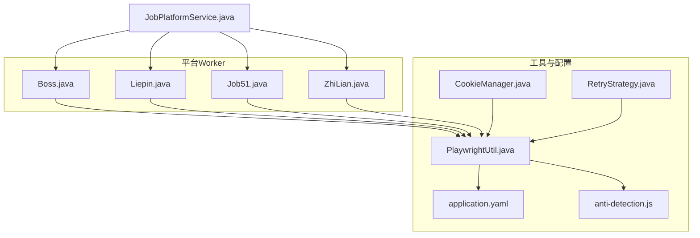
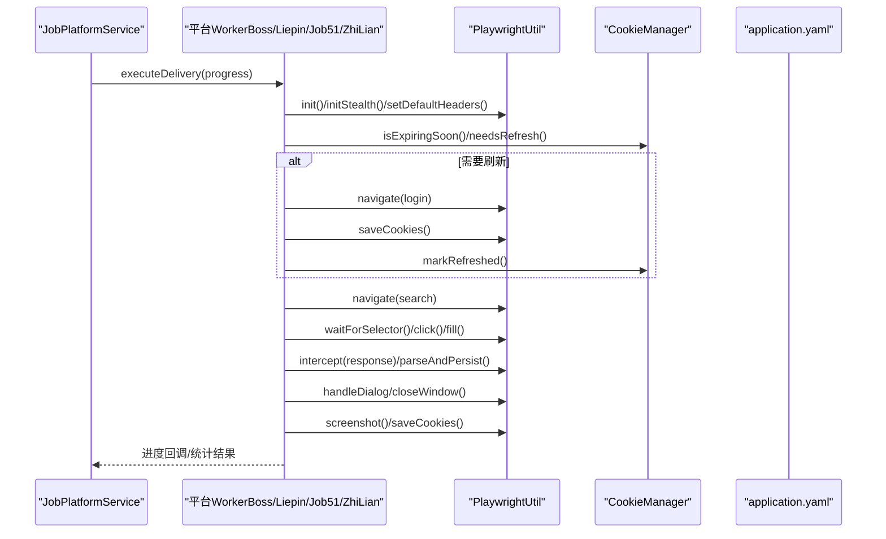
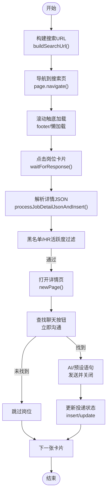
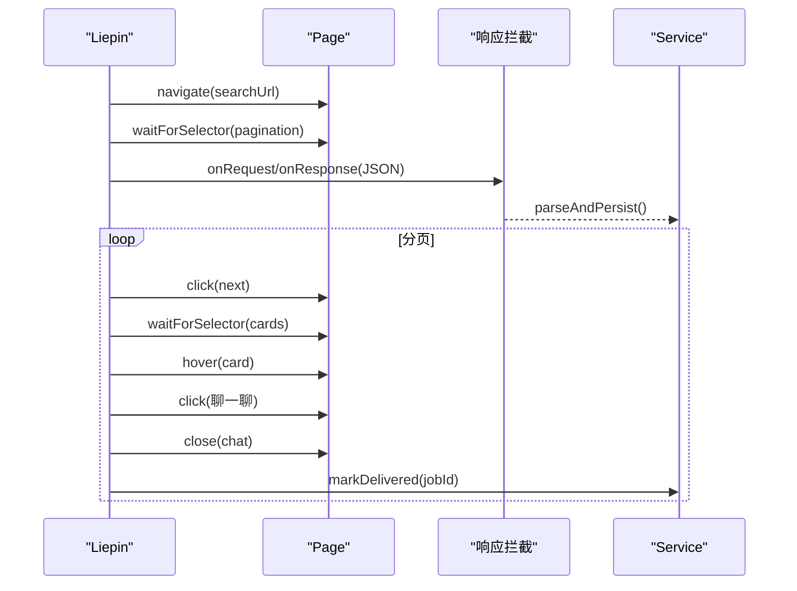
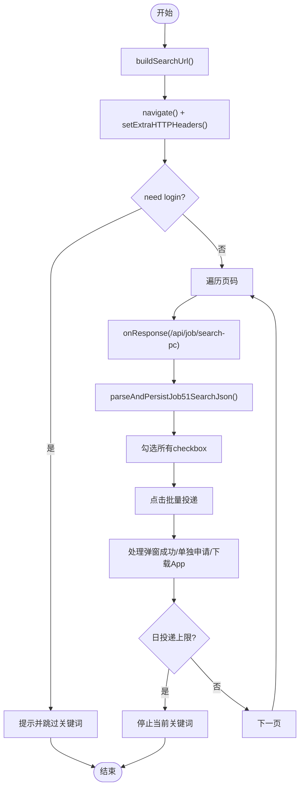
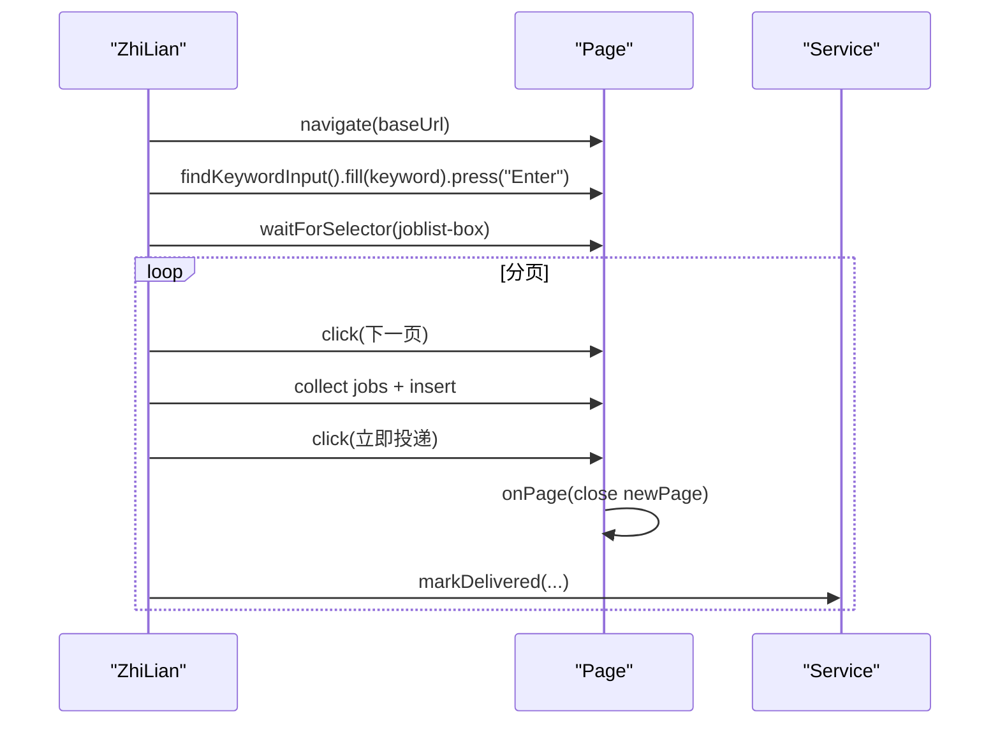
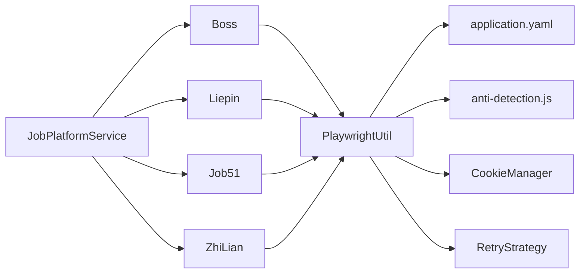

# 平台集成

<cite>
**本文引用的文件**
- [Boss.java](file://backend/src/main/java/com/getjobs/worker/boss/Boss.java)
- [Locators.java（Boss）](file://backend/src/main/java/com/getjobs/worker/boss/Locators.java)
- [Job51.java](file://backend/src/main/java/com/getjobs/worker/job51/Job51.java)
- [Liepin.java](file://backend/src/main/java/com/getjobs/worker/liepin/Liepin.java)
- [Locators.java（猎聘）](file://backend/src/main/java/com/getjobs/worker/liepin/Locators.java)
- [ZhiLian.java](file://backend/src/main/java/com/getjobs/worker/zhilian/ZhiLian.java)
- [PlaywrightUtil.java](file://backend/src/main/java/com/getjobs/worker/utils/PlaywrightUtil.java)
- [CookieManager.java](file://backend/src/main/java/com/getjobs/worker/utils/CookieManager.java)
- [RetryStrategy.java](file://backend/src/main/java/com/getjobs/worker/utils/RetryStrategy.java)
- [application.yaml](file://backend/src/main/resources/application.yaml)
- [anti-detection.js](file://backend/src/main/resources/anti-detection.js)
- [JobPlatformService.java](file://backend/src/main/java/com/getjobs/worker/service/JobPlatformService.java)
- [Platform.java](file://backend/src/main/java/com/getjobs/worker/utils/Platform.java)
</cite>

## 目录
1. [简介](#简介)
2. [项目结构](#项目结构)
3. [核心组件](#核心组件)
4. [架构总览](#架构总览)
5. [详细组件分析](#详细组件分析)
6. [依赖分析](#依赖分析)
7. [性能考虑](#性能考虑)
8. [故障排查指南](#故障排查指南)
9. [结论](#结论)
10. [附录](#附录)

## 简介
本技术文档面向平台集成开发者与自动化测试工程师，系统梳理并深入解析 Boss 直聘、猎聘、51job、智联招聘四家招聘平台的自动化集成方案。文档涵盖登录流程、岗位搜索、简历投递的完整实现步骤，对比各平台页面结构差异与元素定位策略，总结反检测机制（验证码处理、行为模拟、请求伪装）的落地实践，并提供平台适配器扩展指南与常见问题解决方案。

## 项目结构
后端采用 Playwright 进行浏览器自动化，结合统一的服务接口 JobPlatformService，分别针对不同平台实现独立的 Worker 类（Boss、Liepin、Job51、ZhiLian）。工具层提供 Cookie 管理、重试策略、反检测脚本与通用 Playwright 封装，配置层通过 application.yaml 提供跨平台超时、稳定性与资源管理参数。

图表来源
- [Boss.java:1-1173](file://backend/src/main/java/com/getjobs/worker/boss/Boss.java#L1-L1173)
- [Liepin.java:1-634](file://backend/src/main/java/com/getjobs/worker/liepin/Liepin.java#L1-L634)
- [Job51.java:1-908](file://backend/src/main/java/com/getjobs/worker/job51/Job51.java#L1-L908)
- [ZhiLian.java:1-647](file://backend/src/main/java/com/getjobs/worker/zhilian/ZhiLian.java#L1-L647)
- [PlaywrightUtil.java:1-610](file://backend/src/main/java/com/getjobs/worker/utils/PlaywrightUtil.java#L1-L610)
- [CookieManager.java:1-259](file://backend/src/main/java/com/getjobs/worker/utils/CookieManager.java#L1-L259)
- [RetryStrategy.java:1-169](file://backend/src/main/java/com/getjobs/worker/utils/RetryStrategy.java#L1-L169)
- [application.yaml:1-91](file://backend/src/main/resources/application.yaml#L1-L91)
- [anti-detection.js:1-109](file://backend/src/main/resources/anti-detection.js#L1-L109)
- [JobPlatformService.java:1-47](file://backend/src/main/java/com/getjobs/worker/service/JobPlatformService.java#L1-L47)

章节来源
- [Boss.java:1-1173](file://backend/src/main/java/com/getjobs/worker/boss/Boss.java#L1-L1173)
- [Liepin.java:1-634](file://backend/src/main/java/com/getjobs/worker/liepin/Liepin.java#L1-L634)
- [Job51.java:1-908](file://backend/src/main/java/com/getjobs/worker/job51/Job51.java#L1-L908)
- [ZhiLian.java:1-647](file://backend/src/main/java/com/getjobs/worker/zhilian/ZhiLian.java#L1-L647)
- [PlaywrightUtil.java:1-610](file://backend/src/main/java/com/getjobs/worker/utils/PlaywrightUtil.java#L1-L610)
- [CookieManager.java:1-259](file://backend/src/main/java/com/getjobs/worker/utils/CookieManager.java#L1-L259)
- [RetryStrategy.java:1-169](file://backend/src/main/java/com/getjobs/worker/utils/RetryStrategy.java#L1-L169)
- [application.yaml:1-91](file://backend/src/main/resources/application.yaml#L1-L91)
- [anti-detection.js:1-109](file://backend/src/main/resources/anti-detection.js#L1-L109)
- [JobPlatformService.java:1-47](file://backend/src/main/java/com/getjobs/worker/service/JobPlatformService.java#L1-L47)

## 核心组件
- 平台适配器（Worker）
  - Boss：基于 Playwright 的卡片点击与详情接口解析，支持 AI 打招呼、图片简历、黑名单过滤与投递状态回写。
  - 猎聘：接口监听解析 PC 搜索结果，卡片 hover/点击聊一聊，自动关闭聊天窗口并标记投递。
  - 51job：网络拦截搜索接口，解析 JSON 并入库，批量勾选投递，处理弹窗与日投递上限提示。
  - 智联：关键词搜索 + 分页翻页，采集岗位并入库，点击“立即投递”按钮，处理相似职位弹窗。
- 工具层
  - PlaywrightUtil：浏览器初始化、Stealth 反检测、Cookie 读写、截图、元素操作封装。
  - CookieManager：按平台记录 Cookie 生命周期，提供即将过期/已过期检测与刷新触发。
  - RetryStrategy：指数退避+抖动重试，提升网络不稳定场景下的成功率。
- 配置层
  - application.yaml：统一超时、重试、资源池与 Cookie 刷新策略配置。
  - anti-detection.js：函数 toString 劫持与控制台伪装，降低被检测风险。

章节来源
- [Boss.java:1-1173](file://backend/src/main/java/com/getjobs/worker/boss/Boss.java#L1-L1173)
- [Liepin.java:1-634](file://backend/src/main/java/com/getjobs/worker/liepin/Liepin.java#L1-L634)
- [Job51.java:1-908](file://backend/src/main/java/com/getjobs/worker/job51/Job51.java#L1-L908)
- [ZhiLian.java:1-647](file://backend/src/main/java/com/getjobs/worker/zhilian/ZhiLian.java#L1-L647)
- [PlaywrightUtil.java:1-610](file://backend/src/main/java/com/getjobs/worker/utils/PlaywrightUtil.java#L1-L610)
- [CookieManager.java:1-259](file://backend/src/main/java/com/getjobs/worker/utils/CookieManager.java#L1-L259)
- [RetryStrategy.java:1-169](file://backend/src/main/java/com/getjobs/worker/utils/RetryStrategy.java#L1-L169)
- [application.yaml:1-91](file://backend/src/main/resources/application.yaml#L1-L91)
- [anti-detection.js:1-109](file://backend/src/main/resources/anti-detection.js#L1-L109)

## 架构总览
统一通过 JobPlatformService 接口调度各平台 Worker，Worker 内部使用 PlaywrightUtil 进行页面自动化，借助 CookieManager 管理登录态，RetryStrategy 提升稳定性，application.yaml 提供全局配置与差异化参数。

图表来源
- [JobPlatformService.java:1-47](file://backend/src/main/java/com/getjobs/worker/service/JobPlatformService.java#L1-L47)
- [Boss.java:1-1173](file://backend/src/main/java/com/getjobs/worker/boss/Boss.java#L1-L1173)
- [Liepin.java:1-634](file://backend/src/main/java/com/getjobs/worker/liepin/Liepin.java#L1-L634)
- [Job51.java:1-908](file://backend/src/main/java/com/getjobs/worker/job51/Job51.java#L1-L908)
- [ZhiLian.java:1-647](file://backend/src/main/java/com/getjobs/worker/zhilian/ZhiLian.java#L1-L647)
- [PlaywrightUtil.java:1-610](file://backend/src/main/java/com/getjobs/worker/utils/PlaywrightUtil.java#L1-L610)
- [CookieManager.java:1-259](file://backend/src/main/java/com/getjobs/worker/utils/CookieManager.java#L1-L259)
- [application.yaml:1-91](file://backend/src/main/resources/application.yaml#L1-L91)

## 详细组件分析

### Boss 直聘集成
- 登录流程
  - 通过页面元素定位与点击完成扫码/账号登录入口识别，必要时切换登录方式。
  - 登录后通过 Cookie 管理器记录保存时间，结合配置项在过期前自动刷新。
- 岗位搜索
  - 构建搜索 URL，支持城市、职位类型、薪资、经验、学历、公司规模、行业、融资阶段等筛选条件。
  - 使用滚动触底策略加载全部岗位卡片，同时监听详情接口响应，解析并入库。
- 简历投递
  - 逐个点击卡片，等待详情接口返回后解析字段，进行黑名单与 HR 活跃度过滤。
  - 打开详情页，查找“立即沟通”按钮，AI 生成打招呼语或使用预设语句，发送后关闭窗口并回写投递状态。
- 反检测与稳定性
  - 启用 Stealth 模式，注入反检测脚本，设置 UA、语言、Referer 等请求头。
  - 使用指数退避重试与固定延迟策略，提升网络波动下的成功率。
- 元素定位与交互
  - 统一维护 Locators，集中管理选择器，减少页面结构调整带来的维护成本。

图表来源
- [Boss.java:605-777](file://backend/src/main/java/com/getjobs/worker/boss/Boss.java#L605-L777)
- [Locators.java（Boss）:1-63](file://backend/src/main/java/com/getjobs/worker/boss/Locators.java#L1-L63)
- [PlaywrightUtil.java:425-487](file://backend/src/main/java/com/getjobs/worker/utils/PlaywrightUtil.java#L425-L487)
- [RetryStrategy.java:1-169](file://backend/src/main/java/com/getjobs/worker/utils/RetryStrategy.java#L1-L169)

章节来源
- [Boss.java:605-777](file://backend/src/main/java/com/getjobs/worker/boss/Boss.java#L605-L777)
- [Locators.java（Boss）:1-63](file://backend/src/main/java/com/getjobs/worker/boss/Locators.java#L1-L63)
- [PlaywrightUtil.java:425-487](file://backend/src/main/java/com/getjobs/worker/utils/PlaywrightUtil.java#L425-L487)
- [RetryStrategy.java:1-169](file://backend/src/main/java/com/getjobs/worker/utils/RetryStrategy.java#L1-L169)

### 猎聘集成
- 登录流程
  - 通过页面元素判断是否需要登录，必要时触发登录流程并保存 Cookie。
- 岗位搜索
  - 构建搜索 URL，进入搜索页后等待分页容器与卡片挂载，监听 PC 搜索接口响应，解析并批量入库。
- 简历投递
  - 遍历卡片，尝试 hover 显示按钮，定位“聊一聊”按钮并点击；自动关闭聊天窗口，标记投递状态。
- 反检测与稳定性
  - 启用 Stealth 模式与请求头伪装，统一处理弹窗覆盖层，避免误关非目标弹窗。
- 元素定位与交互
  - 使用 Locators 集中管理分页、卡片与聊天窗口选择器，增强健壮性。

图表来源
- [Liepin.java:105-296](file://backend/src/main/java/com/getjobs/worker/liepin/Liepin.java#L105-L296)
- [Locators.java（猎聘）:1-20](file://backend/src/main/java/com/getjobs/worker/liepin/Locators.java#L1-L20)
- [PlaywrightUtil.java:425-487](file://backend/src/main/java/com/getjobs/worker/utils/PlaywrightUtil.java#L425-L487)

章节来源
- [Liepin.java:105-296](file://backend/src/main/java/com/getjobs/worker/liepin/Liepin.java#L105-L296)
- [Locators.java（猎聘）:1-20](file://backend/src/main/java/com/getjobs/worker/liepin/Locators.java#L1-L20)
- [PlaywrightUtil.java:425-487](file://backend/src/main/java/com/getjobs/worker/utils/PlaywrightUtil.java#L425-L487)

### 51job 集成
- 登录流程
  - 检测页面是否显示“登录”字样，若需要则中止当前关键词投递并提示。
- 岗位搜索
  - 构建搜索 URL，设置 Accept、语言等请求头，导航到搜索页。
  - 监听搜索接口响应，解析 JSON 并入库，同时提取当前页 jobId 列表用于后续标记。
- 简历投递
  - 勾选所有岗位，点击批量投递按钮；处理“下载App”、“投递成功/未投递”等弹窗；检测日投递上限提示并停止。
- 反检测与稳定性
  - 统一关闭各类弹窗覆盖层，包括 ElementUI 与 VanPopup；检测访问验证（WAF）并及时停止。
- 元素定位与交互
  - 使用多套选择器组合定位 checkbox、按钮与弹窗，增强对页面结构变化的适应能力。

图表来源
- [Job51.java:68-248](file://backend/src/main/java/com/getjobs/worker/job51/Job51.java#L68-L248)
- [PlaywrightUtil.java:489-510](file://backend/src/main/java/com/getjobs/worker/utils/PlaywrightUtil.java#L489-L510)

章节来源
- [Job51.java:68-248](file://backend/src/main/java/com/getjobs/worker/job51/Job51.java#L68-L248)
- [PlaywrightUtil.java:489-510](file://backend/src/main/java/com/getjobs/worker/utils/PlaywrightUtil.java#L489-L510)

### 智联招聘集成
- 登录流程
  - 通过页面元素判断登录状态，必要时中止当前关键词投递。
- 岗位搜索
  - 构建基础 URL（城市码、薪资等），进入首页后在搜索框输入关键词并按 Enter 触发搜索。
  - 等待岗位列表加载，遍历分页，点击“下一页”按钮。
- 简历投递
  - 采集当前页岗位并入库，遍历卡片点击“立即投递”按钮；注册页面打开监听器统一关闭新窗口；处理相似职位弹窗并记录结果。
- 反检测与稳定性
  - 统一关闭新窗口，避免干扰主流程；检测“达到上限”提示并停止。
- 元素定位与交互
  - 使用多候选选择器定位搜索框，增强健壮性；通过 jobId 或标题+公司名回写投递状态。

图表来源
- [ZhiLian.java:102-191](file://backend/src/main/java/com/getjobs/worker/zhilian/ZhiLian.java#L102-L191)
- [ZhiLian.java:197-351](file://backend/src/main/java/com/getjobs/worker/zhilian/ZhiLian.java#L197-L351)

章节来源
- [ZhiLian.java:102-191](file://backend/src/main/java/com/getjobs/worker/zhilian/ZhiLian.java#L102-L191)
- [ZhiLian.java:197-351](file://backend/src/main/java/com/getjobs/worker/zhilian/ZhiLian.java#L197-L351)

### 反检测机制与行为模拟
- 请求伪装
  - 设置 sec-ch-ua、accept-language、Referer 等头部，模拟真实用户环境。
- 函数伪装与控制台隐身
  - 通过 anti-detection.js 劫持 Function.prototype.toString，伪装函数源码；控制台输出参数清洗，避免被检测。
- 浏览器初始化与 Stealth
  - initStealth 与 setDefaultHeaders 组合，注入反检测脚本，隐藏 webdriver 标识，降低被识别概率。
- 行为模拟
  - PlaywrightUtil 提供 typeHumanLike 等方法，模拟人类输入节奏；页面滚动与 hover 策略增强自然度。

章节来源
- [PlaywrightUtil.java:425-487](file://backend/src/main/java/com/getjobs/worker/utils/PlaywrightUtil.java#L425-L487)
- [anti-detection.js:1-109](file://backend/src/main/resources/anti-detection.js#L1-L109)
- [application.yaml:60-91](file://backend/src/main/resources/application.yaml#L60-L91)

### 平台适配器扩展指南
- 新增平台步骤
  - 实现 JobPlatformService 接口，定义 executeDelivery/stopDelivery/getStatus/getPlatformName/isRunning。
  - 编写 Worker 类（如 NewPlatform.java），实现 prepare/execute/进度回调/停止信号处理。
  - 定义 Locators（如 Locators.java），集中管理页面元素选择器。
  - 在 PlaywrightUtil 中补充必要的初始化与反检测配置。
  - 在 CookieManager 中为新平台配置预期生命周期。
  - 在 application.yaml 中增加平台差异化超时与稳定性参数。
- 关键注意点
  - 元素定位策略：优先使用稳定的选择器，配合多候选与降级策略。
  - 弹窗与覆盖层：统一处理 ElementUI/VanPopup 等弹窗，避免误关非目标弹窗。
  - 日限与风控：对“日投递上限”“访问验证”等提示进行检测与优雅降级。
  - 日志与可观测性：在关键节点输出进度与诊断信息，便于问题定位。

章节来源
- [JobPlatformService.java:1-47](file://backend/src/main/java/com/getjobs/worker/service/JobPlatformService.java#L1-L47)
- [Platform.java:1-28](file://backend/src/main/java/com/getjobs/worker/utils/Platform.java#L1-L28)
- [PlaywrightUtil.java:425-487](file://backend/src/main/java/com/getjobs/worker/utils/PlaywrightUtil.java#L425-L487)
- [CookieManager.java:36-43](file://backend/src/main/java/com/getjobs/worker/utils/CookieManager.java#L36-L43)
- [application.yaml:60-91](file://backend/src/main/resources/application.yaml#L60-L91)

## 依赖分析
- 组件耦合
  - JobPlatformService 作为统一入口，解耦各平台 Worker。
  - Worker 依赖 PlaywrightUtil（浏览器自动化）、CookieManager（登录态管理）、RetryStrategy（稳定性保障）。
- 外部依赖
  - Playwright 浏览器引擎、MySQL 数据库存储、MyBatis-Plus ORM。
- 配置依赖
  - application.yaml 提供全局与平台差异化参数，影响超时、重试、资源池与 Cookie 刷新策略。

图表来源
- [JobPlatformService.java:1-47](file://backend/src/main/java/com/getjobs/worker/service/JobPlatformService.java#L1-L47)
- [Boss.java:1-1173](file://backend/src/main/java/com/getjobs/worker/boss/Boss.java#L1-L1173)
- [Liepin.java:1-634](file://backend/src/main/java/com/getjobs/worker/liepin/Liepin.java#L1-L634)
- [Job51.java:1-908](file://backend/src/main/java/com/getjobs/worker/job51/Job51.java#L1-L908)
- [ZhiLian.java:1-647](file://backend/src/main/java/com/getjobs/worker/zhilian/ZhiLian.java#L1-L647)
- [PlaywrightUtil.java:1-610](file://backend/src/main/java/com/getjobs/worker/utils/PlaywrightUtil.java#L1-L610)
- [CookieManager.java:1-259](file://backend/src/main/java/com/getjobs/worker/utils/CookieManager.java#L1-L259)
- [RetryStrategy.java:1-169](file://backend/src/main/java/com/getjobs/worker/utils/RetryStrategy.java#L1-L169)
- [application.yaml:1-91](file://backend/src/main/resources/application.yaml#L1-L91)
- [anti-detection.js:1-109](file://backend/src/main/resources/anti-detection.js#L1-L109)

章节来源
- [JobPlatformService.java:1-47](file://backend/src/main/java/com/getjobs/worker/service/JobPlatformService.java#L1-L47)
- [PlaywrightUtil.java:1-610](file://backend/src/main/java/com/getjobs/worker/utils/PlaywrightUtil.java#L1-L610)
- [CookieManager.java:1-259](file://backend/src/main/java/com/getjobs/worker/utils/CookieManager.java#L1-L259)
- [RetryStrategy.java:1-169](file://backend/src/main/java/com/getjobs/worker/utils/RetryStrategy.java#L1-L169)
- [application.yaml:1-91](file://backend/src/main/resources/application.yaml#L1-L91)
- [anti-detection.js:1-109](file://backend/src/main/resources/anti-detection.js#L1-L109)

## 性能考虑
- 超时与重试
  - application.yaml 提供平台差异化超时与统一重试策略，Boss/Liepin/Job51/ZhiLian 各自配置不同导航超时。
- 资源管理
  - 控制最大页面数与空闲回收时间，避免资源泄露；合理设置慢动作（slow-mo）便于调试。
- 网络拦截与解析
  - 51job 与 Boss 通过拦截搜索/详情接口解析 JSON，减少 DOM 解析成本，提升入库效率。
- 行为模拟
  - 适当的人类输入节奏与滚动策略，降低被风控概率，间接提升整体吞吐。

章节来源
- [application.yaml:60-91](file://backend/src/main/resources/application.yaml#L60-L91)
- [Job51.java:117-179](file://backend/src/main/java/com/getjobs/worker/job51/Job51.java#L117-L179)
- [Boss.java:782-800](file://backend/src/main/java/com/getjobs/worker/boss/Boss.java#L782-L800)

## 故障排查指南
- 登录失效
  - 检查 CookieManager 的到期阈值与刷新策略，必要时手动刷新或延长刷新提前时间。
- 页面元素定位失败
  - 使用 Locators 集中管理选择器，结合多候选策略与降级方案；必要时启用截图与日志辅助定位。
- 弹窗覆盖
  - 统一关闭 ElementUI/VanPopup 等弹窗，避免误关非目标弹窗；对“下载App”“单独申请”等弹窗进行专项处理。
- 访问验证（WAF）
  - 检测“访问验证/请按住滑块”等提示，及时停止并提示人工干预。
- 日投递上限
  - 51job 与智联均存在“日投递上限”提示，检测到后应停止当前关键词或页面，避免进一步触发风控。
- 网络不稳定
  - 使用 RetryStrategy 的指数退避+抖动策略，提升成功率；必要时调整超时与重试参数。

章节来源
- [CookieManager.java:74-129](file://backend/src/main/java/com/getjobs/worker/utils/CookieManager.java#L74-L129)
- [Job51.java:637-668](file://backend/src/main/java/com/getjobs/worker/job51/Job51.java#L637-L668)
- [ZhiLian.java:474-490](file://backend/src/main/java/com/getjobs/worker/zhilian/ZhiLian.java#L474-L490)
- [RetryStrategy.java:1-169](file://backend/src/main/java/com/getjobs/worker/utils/RetryStrategy.java#L1-L169)

## 结论
本方案通过统一的服务接口与工具层，实现了对 Boss 直聘、猎聘、51job、智联招聘四家平台的稳定自动化集成。通过请求伪装、反检测脚本、Cookie 生命周期管理与指数退避重试等手段，有效降低了被风控概率并提升了成功率。扩展新平台时，遵循统一的适配器模式与配置规范，可快速落地并保证一致性与可维护性。

## 附录
- 关键配置项
  - playwright.slow-mo、navigation-timeout、max-retries、health-check-interval、max-pages、idle-page-timeout、resource-blocking-enabled、cookie-refresh-before-expiry。
- 平台差异化超时
  - boss、liepin、job51、zhilian 各自配置不同导航超时，以适配页面复杂度差异。
- 平台枚举
  - Platform 提供平台名称映射，便于日志与监控展示。

章节来源
- [application.yaml:60-91](file://backend/src/main/resources/application.yaml#L60-L91)
- [Platform.java:1-28](file://backend/src/main/java/com/getjobs/worker/utils/Platform.java#L1-L28)