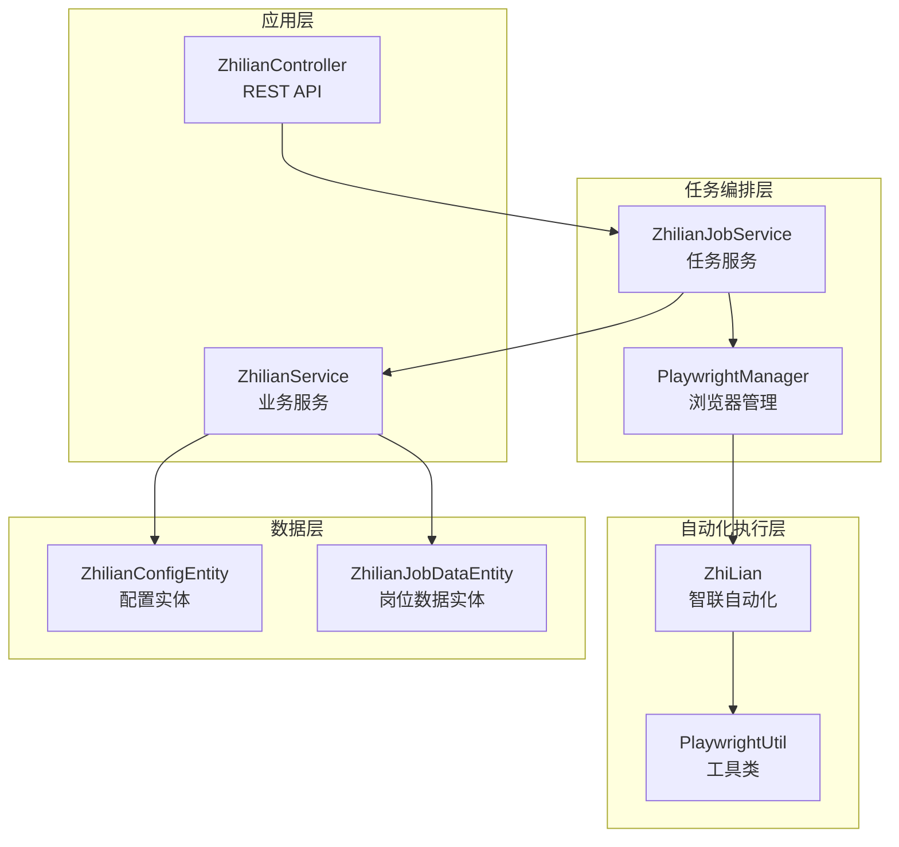
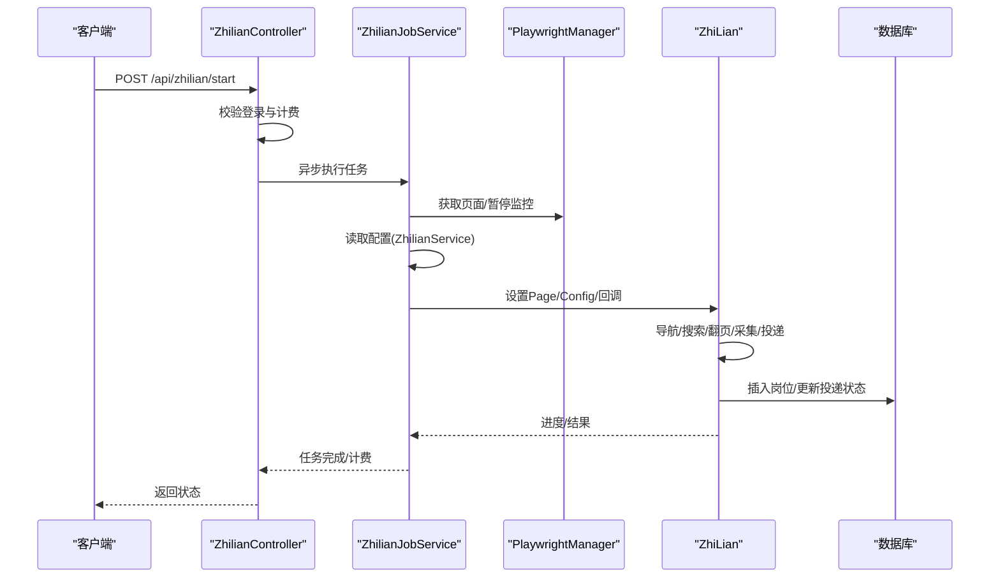
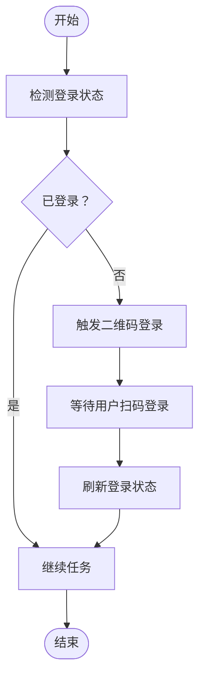
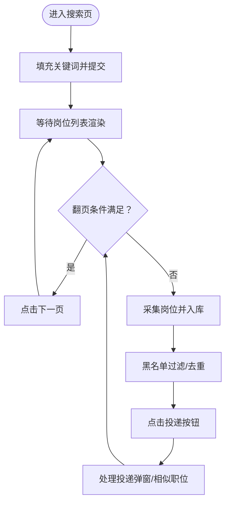
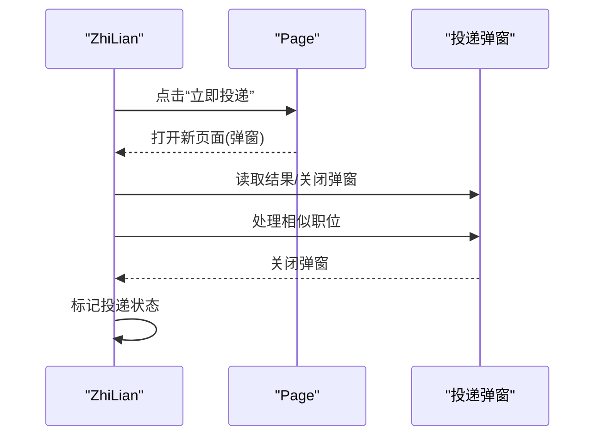
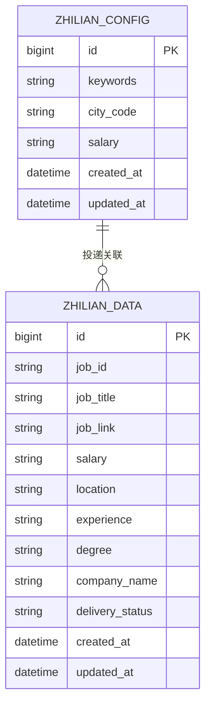
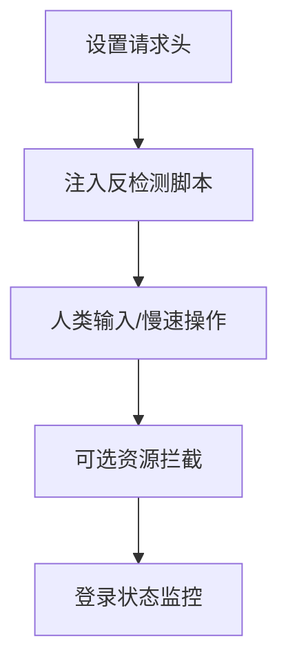
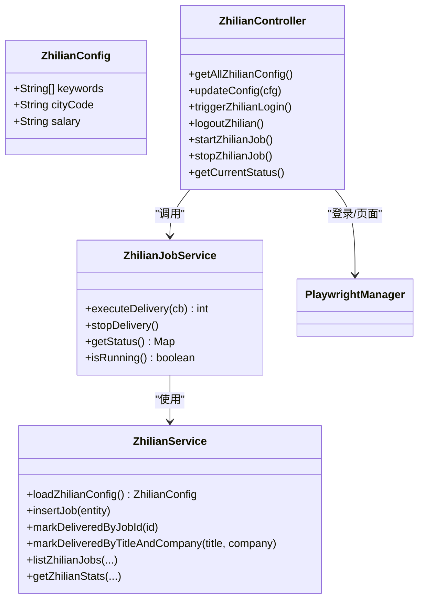
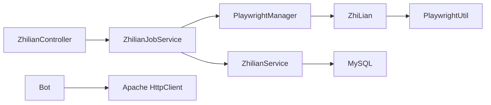
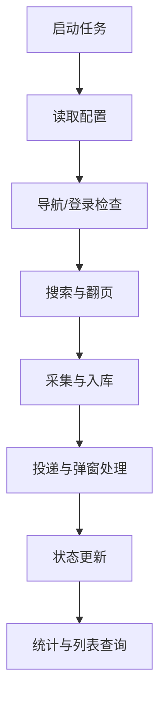

# 智联招聘平台集成

<cite>
**本文引用的文件**
- [ZhiLian.java](file://backend/src/main/java/com/getjobs/worker/zhilian/ZhiLian.java)
- [ZhilianConfig.java](file://backend/src/main/java/com/getjobs/worker/zhilian/ZhilianConfig.java)
- [ZhilianJobService.java](file://backend/src/main/java/com/getjobs/worker/service/ZhilianJobService.java)
- [ZhilianController.java](file://backend/src/main/java/com/getjobs/application/controller/ZhilianController.java)
- [ZhilianService.java](file://backend/src/main/java/com/getjobs/application/service/ZhilianService.java)
- [ZhilianConfigEntity.java](file://backend/src/main/java/com/getjobs/application/entity/ZhilianConfigEntity.java)
- [ZhilianJobDataEntity.java](file://backend/src/main/java/com/getjobs/application/entity/ZhilianJobDataEntity.java)
- [PlaywrightManager.java](file://backend/src/main/java/com/getjobs/worker/manager/PlaywrightManager.java)
- [PlaywrightUtil.java](file://backend/src/main/java/com/getjobs/worker/utils/PlaywrightUtil.java)
- [application.yaml](file://backend/src/main/resources/application.yaml)
- [anti-detection.js](file://backend/src/main/resources/anti-detection.js)
- [Bot.java](file://backend/src/main/java/com/getjobs/worker/utils/Bot.java)
- [Job.java](file://backend/src/main/java/com/getjobs/worker/utils/Job.java)
- [JobUtils.java](file://backend/src/main/java/com/getjobs/worker/utils/JobUtils.java)
</cite>

## 目录
1. [简介](#简介)
2. [项目结构](#项目结构)
3. [核心组件](#核心组件)
4. [架构总览](#架构总览)
5. [详细组件分析](#详细组件分析)
6. [依赖关系分析](#依赖关系分析)
7. [性能考量](#性能考量)
8. [故障排除指南](#故障排除指南)
9. [结论](#结论)
10. [附录](#附录)

## 简介
本技术文档面向招聘网站自动化集成工程师与数据采集专家，系统性阐述智联招聘平台的自动化集成方案。内容涵盖用户身份验证、职位搜索优化、在线投递流程、数据提取策略、页面架构与动态渲染机制、反检测技术（请求头伪装、行为模拟、访问频率调节）、配置参数与业务处理逻辑、平台特有问题与解决方案、性能优化建议以及故障排除指南。

## 项目结构
后端采用Spring Boot工程，按领域与职责划分模块：
- worker：浏览器自动化与平台适配层（Playwright）
- application：业务服务与数据持久化层（MyBatis-Plus）
- front/front-admin：前端管理界面（Next.js）

与智联招聘集成相关的关键目录与文件：
- worker/zhilian：智联招聘专用自动化实现
- worker/service：平台任务服务（JobPlatformService实现）
- worker/manager：Playwright统一管理与登录状态监控
- worker/utils：工具类（PlaywrightUtil、Bot、Job等）
- application/controller：对外REST API（配置、登录、任务控制）
- application/service：业务服务（配置、数据、统计）
- application/entity：数据模型（配置、岗位数据）
- resources：全局配置与反检测脚本

**图表来源**
- [ZhilianController.java:1-414](file://backend/src/main/java/com/getjobs/application/controller/ZhilianController.java#L1-414)
- [ZhilianJobService.java:1-142](file://backend/src/main/java/com/getjobs/worker/service/ZhilianJobService.java#L1-142)
- [PlaywrightManager.java:1-800](file://backend/src/main/java/com/getjobs/worker/manager/PlaywrightManager.java#L1-800)
- [ZhiLian.java:1-647](file://backend/src/main/java/com/getjobs/worker/zhilian/ZhiLian.java#L1-647)
- [PlaywrightUtil.java:1-610](file://backend/src/main/java/com/getjobs/worker/utils/PlaywrightUtil.java#L1-610)
- [ZhilianService.java:1-504](file://backend/src/main/java/com/getjobs/application/service/ZhilianService.java#L1-504)
- [ZhilianConfigEntity.java:1-31](file://backend/src/main/java/com/getjobs/application/entity/ZhilianConfigEntity.java#L1-31)
- [ZhilianJobDataEntity.java:1-64](file://backend/src/main/java/com/getjobs/application/entity/ZhilianJobDataEntity.java#L1-64)

**章节来源**
- [ZhilianController.java:1-414](file://backend/src/main/java/com/getjobs/application/controller/ZhilianController.java#L1-414)
- [application.yaml:1-101](file://backend/src/main/resources/application.yaml#L1-101)

## 核心组件
- ZhilianConfig：智联招聘配置载体（关键词、城市编码、薪资范围），由业务服务从数据库表读取并构建。
- ZhiLian：智联自动化执行器，负责导航、搜索、翻页、采集、投递、弹窗处理、上限检测与错误恢复。
- ZhilianJobService：任务服务，协调Playwright页面、读取配置、进度回调、任务启停与状态查询。
- PlaywrightManager：浏览器生命周期管理、登录状态监控、Cookie注入与刷新、跨平台共享上下文。
- ZhilianService：配置解析与构建、岗位数据存取、投递状态更新、统计分析与分页查询。
- 实体模型：ZhilianConfigEntity、ZhilianJobDataEntity。
- 反检测与工具：PlaywrightUtil（Stealth模式、请求头、Cookie管理）、anti-detection.js、Bot（消息推送）。

**章节来源**
- [ZhilianConfig.java:1-38](file://backend/src/main/java/com/getjobs/worker/zhilian/ZhilianConfig.java#L1-38)
- [ZhiLian.java:1-647](file://backend/src/main/java/com/getjobs/worker/zhilian/ZhiLian.java#L1-647)
- [ZhilianJobService.java:1-142](file://backend/src/main/java/com/getjobs/worker/service/ZhilianJobService.java#L1-142)
- [PlaywrightManager.java:1-800](file://backend/src/main/java/com/getjobs/worker/manager/PlaywrightManager.java#L1-800)
- [ZhilianService.java:1-504](file://backend/src/main/java/com/getjobs/application/service/ZhilianService.java#L1-504)
- [ZhilianConfigEntity.java:1-31](file://backend/src/main/java/com/getjobs/application/entity/ZhilianConfigEntity.java#L1-31)
- [ZhilianJobDataEntity.java:1-64](file://backend/src/main/java/com/getjobs/application/entity/ZhilianJobDataEntity.java#L1-64)
- [PlaywrightUtil.java:1-610](file://backend/src/main/java/com/getjobs/worker/utils/PlaywrightUtil.java#L1-610)
- [anti-detection.js:1-109](file://backend/src/main/resources/anti-detection.js#L1-109)
- [Bot.java:1-229](file://backend/src/main/java/com/getjobs/worker/utils/Bot.java#L1-229)

## 架构总览
整体架构围绕“控制器—任务服务—浏览器管理—自动化执行—数据服务”的链路展开，通过统一的Playwright上下文在多平台共享，实现登录状态监控与跨平台协同。

**图表来源**
- [ZhilianController.java:273-336](file://backend/src/main/java/com/getjobs/application/controller/ZhilianController.java#L273-336)
- [ZhilianJobService.java:37-104](file://backend/src/main/java/com/getjobs/worker/service/ZhilianJobService.java#L37-104)
- [PlaywrightManager.java:114-221](file://backend/src/main/java/com/getjobs/worker/manager/PlaywrightManager.java#L114-221)
- [ZhiLian.java:62-97](file://backend/src/main/java/com/getjobs/worker/zhilian/ZhiLian.java#L62-97)
- [ZhilianService.java:85-124](file://backend/src/main/java/com/getjobs/application/service/ZhilianService.java#L85-124)

## 详细组件分析

### 用户身份验证与会话管理
- 登录状态检测：PlaywrightManager在各平台页面导航后，通过特征元素判断登录状态，并持续监控URL变化以更新状态。
- 登录触发与二维码：控制器提供触发登录接口，Manager在未登录时引导至二维码登录页。
- Cookie管理：支持从数据库加载/保存Cookie，按平台维度管理；可设置默认请求头与Stealth模式降低检测概率。
- 会话稳定性：共享BrowserContext与页面池，避免重复登录成本；暂停监控避免任务执行与后台监控并发竞争。

**图表来源**
- [PlaywrightManager.java:336-369](file://backend/src/main/java/com/getjobs/worker/manager/PlaywrightManager.java#L336-369)
- [ZhilianController.java:120-137](file://backend/src/main/java/com/getjobs/application/controller/ZhilianController.java#L120-137)

**章节来源**
- [PlaywrightManager.java:254-331](file://backend/src/main/java/com/getjobs/worker/manager/PlaywrightManager.java#L254-331)
- [PlaywrightManager.java:376-388](file://backend/src/main/java/com/getjobs/worker/manager/PlaywrightManager.java#L376-388)
- [PlaywrightManager.java:472-561](file://backend/src/main/java/com/getjobs/worker/manager/PlaywrightManager.java#L472-561)
- [PlaywrightManager.java:568-579](file://backend/src/main/java/com/getjobs/worker/manager/PlaywrightManager.java#L568-579)
- [PlaywrightManager.java:689-717](file://backend/src/main/java/com/getjobs/worker/manager/PlaywrightManager.java#L689-717)
- [PlaywrightManager.java:724-734](file://backend/src/main/java/com/getjobs/worker/manager/PlaywrightManager.java#L724-734)
- [PlaywrightManager.java:114-221](file://backend/src/main/java/com/getjobs/worker/manager/PlaywrightManager.java#L114-221)
- [ZhilianController.java:101-168](file://backend/src/main/java/com/getjobs/application/controller/ZhilianController.java#L101-168)

### 职位搜索优化与动态内容渲染
- 搜索入口与参数：通过构建基础URL（城市编码、薪资参数），在搜索框输入关键词并触发搜索；等待岗位列表渲染。
- 翻页策略：依据“下一页”按钮的禁用状态与存在性判断终止翻页，最多遍历50页，避免死循环。
- 动态渲染与等待：对关键选择器设置超时等待，失败时刷新页面重试，提升鲁棒性。
- 采集策略：批量采集当前页岗位，统一入库，减少数据库交互次数；黑名单过滤与去重（job_id/title+company）。

**图表来源**
- [ZhiLian.java:102-191](file://backend/src/main/java/com/getjobs/worker/zhilian/ZhiLian.java#L102-191)
- [ZhiLian.java:197-351](file://backend/src/main/java/com/getjobs/worker/zhilian/ZhiLian.java#L197-351)
- [ZhiLian.java:356-408](file://backend/src/main/java/com/getjobs/worker/zhilian/ZhiLian.java#L356-408)

**章节来源**
- [ZhiLian.java:102-191](file://backend/src/main/java/com/getjobs/worker/zhilian/ZhiLian.java#L102-191)
- [ZhiLian.java:197-351](file://backend/src/main/java/com/getjobs/worker/zhilian/ZhiLian.java#L197-351)
- [ZhiLian.java:356-408](file://backend/src/main/java/com/getjobs/worker/zhilian/ZhiLian.java#L356-408)

### 在线投递流程与弹窗处理
- 投递按钮识别：通过唯一选择器定位“立即投递”按钮，点击前注册页面监听器统一关闭新窗口，避免竞态。
- 弹窗处理：检测投递结果文本，关闭弹窗并处理“相似职位”，批量记录投递结果。
- 上限检测：检测页面中“达到上限”提示，及时终止投递流程。
- 状态更新：根据job_id或title+company更新投递状态，保障幂等性。

**图表来源**
- [ZhiLian.java:292-332](file://backend/src/main/java/com/getjobs/worker/zhilian/ZhiLian.java#L292-332)
- [ZhiLian.java:356-408](file://backend/src/main/java/com/getjobs/worker/zhilian/ZhiLian.java#L356-408)
- [ZhiLian.java:474-490](file://backend/src/main/java/com/getjobs/worker/zhilian/ZhiLian.java#L474-490)

**章节来源**
- [ZhiLian.java:292-332](file://backend/src/main/java/com/getjobs/worker/zhilian/ZhiLian.java#L292-332)
- [ZhiLian.java:356-408](file://backend/src/main/java/com/getjobs/worker/zhilian/ZhiLian.java#L356-408)
- [ZhiLian.java:474-490](file://backend/src/main/java/com/getjobs/worker/zhilian/ZhiLian.java#L474-490)

### 数据提取策略与实体模型
- 采集字段：job_id、job_title、job_link、salary、location、experience、degree、company_name、delivery_status。
- 去重与过滤：优先按job_id查询，其次按title+company组合；黑名单过滤。
- 统一入库：批量插入当前页岗位，减少事务开销。
- 统计分析：支持按状态、城市、经验、学历、关键词与薪资区间筛选，生成KPI与图表数据。

**图表来源**
- [ZhilianConfigEntity.java:1-31](file://backend/src/main/java/com/getjobs/application/entity/ZhilianConfigEntity.java#L1-31)
- [ZhilianJobDataEntity.java:1-64](file://backend/src/main/java/com/getjobs/application/entity/ZhilianJobDataEntity.java#L1-64)

**章节来源**
- [ZhilianJobDataEntity.java:14-64](file://backend/src/main/java/com/getjobs/application/entity/ZhilianJobDataEntity.java#L14-64)
- [ZhilianService.java:240-271](file://backend/src/main/java/com/getjobs/application/service/ZhilianService.java#L240-271)
- [ZhilianService.java:274-399](file://backend/src/main/java/com/getjobs/application/service/ZhilianService.java#L274-399)
- [ZhilianService.java:402-457](file://backend/src/main/java/com/getjobs/application/service/ZhilianService.java#L402-457)

### 反检测技术与行为模拟
- 请求头伪装：设置UA、语言、平台、Referer等请求头，增强与真实用户一致的特征。
- Stealth模式：注入反检测脚本，隐藏webdriver标志、修改navigator属性、屏蔽检测特征。
- 行为模拟：人类输入（逐字延迟）、慢速操作（slow-mo）、随机等待与翻页节奏。
- 资源拦截：可选的资源拦截降低内存占用与网络压力。
- 登录监控：后台轮询登录状态，避免与任务执行并发访问同一页面。

**图表来源**
- [PlaywrightUtil.java:425-487](file://backend/src/main/java/com/getjobs/worker/utils/PlaywrightUtil.java#L425-487)
- [PlaywrightUtil.java:494-510](file://backend/src/main/java/com/getjobs/worker/utils/PlaywrightUtil.java#L494-510)
- [PlaywrightUtil.java:234-252](file://backend/src/main/java/com/getjobs/worker/utils/PlaywrightUtil.java#L234-252)
- [PlaywrightManager.java:160-165](file://backend/src/main/java/com/getjobs/worker/manager/PlaywrightManager.java#L160-165)
- [PlaywrightManager.java:376-388](file://backend/src/main/java/com/getjobs/worker/manager/PlaywrightManager.java#L376-388)

**章节来源**
- [PlaywrightUtil.java:425-487](file://backend/src/main/java/com/getjobs/worker/utils/PlaywrightUtil.java#L425-487)
- [PlaywrightUtil.java:494-510](file://backend/src/main/java/com/getjobs/worker/utils/PlaywrightUtil.java#L494-510)
- [PlaywrightUtil.java:234-252](file://backend/src/main/java/com/getjobs/worker/utils/PlaywrightUtil.java#L234-252)
- [PlaywrightManager.java:160-165](file://backend/src/main/java/com/getjobs/worker/manager/PlaywrightManager.java#L160-165)
- [anti-detection.js:1-109](file://backend/src/main/resources/anti-detection.js#L1-109)

### 配置参数与业务处理逻辑
- 配置来源：ZhilianService从zhilian_config表读取并解析关键词、城市编码、薪资范围，构建ZhilianConfig。
- 任务编排：ZhilianJobService获取Playwright页面、检查登录、暂停监控、读取配置、回调进度、执行投递、恢复监控。
- 控制器接口：提供登录状态查询、触发登录、退出登录、保存Cookie、启动/停止任务、状态查询、统计数据与列表查询。

**图表来源**
- [ZhilianConfig.java:13-37](file://backend/src/main/java/com/getjobs/worker/zhilian/ZhilianConfig.java#L13-37)
- [ZhilianService.java:85-124](file://backend/src/main/java/com/getjobs/application/service/ZhilianService.java#L85-124)
- [ZhilianJobService.java:25-104](file://backend/src/main/java/com/getjobs/worker/service/ZhilianJobService.java#L25-104)
- [ZhilianController.java:48-168](file://backend/src/main/java/com/getjobs/application/controller/ZhilianController.java#L48-168)

**章节来源**
- [ZhilianService.java:85-124](file://backend/src/main/java/com/getjobs/application/service/ZhilianService.java#L85-124)
- [ZhilianJobService.java:37-104](file://backend/src/main/java/com/getjobs/worker/service/ZhilianJobService.java#L37-104)
- [ZhilianController.java:48-168](file://backend/src/main/java/com/getjobs/application/controller/ZhilianController.java#L48-168)

## 依赖关系分析
- 组件耦合：控制器依赖任务服务；任务服务依赖浏览器管理器与业务服务；自动化执行器依赖工具类与业务服务。
- 外部依赖：Playwright浏览器、MySQL数据库、Jasypt加密、Apache HttpClient（Bot消息推送）。
- 平台一致性：通过统一的Playwright上下文与配置中心，实现多平台协同与登录状态共享。

**图表来源**
- [ZhilianController.java:1-414](file://backend/src/main/java/com/getjobs/application/controller/ZhilianController.java#L1-414)
- [ZhilianJobService.java:1-142](file://backend/src/main/java/com/getjobs/worker/service/ZhilianJobService.java#L1-142)
- [PlaywrightManager.java:1-800](file://backend/src/main/java/com/getjobs/worker/manager/PlaywrightManager.java#L1-800)
- [ZhiLian.java:1-647](file://backend/src/main/java/com/getjobs/worker/zhilian/ZhiLian.java#L1-647)
- [PlaywrightUtil.java:1-610](file://backend/src/main/java/com/getjobs/worker/utils/PlaywrightUtil.java#L1-610)
- [Bot.java:1-229](file://backend/src/main/java/com/getjobs/worker/utils/Bot.java#L1-229)

**章节来源**
- [application.yaml:13-24](file://backend/src/main/resources/application.yaml#L13-24)
- [application.yaml:70-101](file://backend/src/main/resources/application.yaml#L70-101)

## 性能考量
- 浏览器与页面管理：共享上下文与页面池，减少启动成本；空闲回收与超时配置降低资源占用。
- 操作节奏：合理设置slow-mo与等待时间，平衡稳定性与效率。
- 数据库交互：批量插入与条件更新，减少事务开销；索引与查询条件优化。
- 反检测与资源拦截：在稳定性与性能之间权衡，按需开启资源拦截。
- 登录监控与任务并发：暂停监控避免竞态，确保任务执行期间页面稳定。

[本节为通用指导，无需具体文件引用]

## 故障排除指南
- 登录失败/状态异常
  - 检查浏览器是否正确注入Cookie与请求头；确认二维码登录流程是否完成。
  - 查看PlaywrightManager的日志与登录监控状态。
- 页面元素找不到
  - 使用等待策略与重试机制；检查选择器是否随平台更新而变化。
  - 通过保存当前页面HTML辅助定位问题。
- 投递上限
  - 检测“达到上限”提示并及时终止；调整任务频率与配额。
- 数据不一致
  - 校验job_id与title+company的去重逻辑；检查状态更新语句。
- 反检测失效
  - 更新反检测脚本与请求头；启用Stealth模式；降低自动化痕迹。

**章节来源**
- [PlaywrightManager.java:336-369](file://backend/src/main/java/com/getjobs/worker/manager/PlaywrightManager.java#L336-369)
- [PlaywrightUtil.java:598-607](file://backend/src/main/java/com/getjobs/worker/utils/PlaywrightUtil.java#L598-607)
- [ZhiLian.java:474-490](file://backend/src/main/java/com/getjobs/worker/zhilian/ZhiLian.java#L474-490)
- [ZhiLian.java:240-276](file://backend/src/main/java/com/getjobs/worker/zhilian/ZhiLian.java#L240-276)
- [anti-detection.js:1-109](file://backend/src/main/resources/anti-detection.js#L1-109)

## 结论
本方案通过统一的Playwright管理、健壮的自动化执行器、完善的配置与数据服务，实现了智联招聘平台的自动化投递与数据采集。结合反检测技术与行为模拟，显著降低了被识别风险；通过任务编排与状态监控，保障了任务的稳定性与可观测性。建议在生产环境中结合业务需求进一步优化超时与重试策略、资源拦截与日志级别，以获得更佳的性能与可靠性。

[本节为总结性内容，无需具体文件引用]

## 附录

### 配置参数清单（application.yaml）
- playwright.slow-mo：操作延迟（毫秒）
- playwright.navigation-timeout：默认导航超时
- playwright.platforms.zhilian.navigation-timeout：平台差异化超时
- playwright.max-retries / retry-base-delay / retry-max-delay：重试策略
- playwright.health-check-interval：健康检查间隔
- playwright.max-pages / idle-page-timeout：页面池配置
- playwright.resource-blocking-enabled：资源拦截开关
- playwright.cookie-refresh-before-expiry：Cookie刷新阈值

**章节来源**
- [application.yaml:70-101](file://backend/src/main/resources/application.yaml#L70-101)

### 关键流程图：投递与统计

**图表来源**
- [ZhilianJobService.java:37-104](file://backend/src/main/java/com/getjobs/worker/service/ZhilianJobService.java#L37-104)
- [ZhiLian.java:62-97](file://backend/src/main/java/com/getjobs/worker/zhilian/ZhiLian.java#L62-97)
- [ZhilianService.java:274-399](file://backend/src/main/java/com/getjobs/application/service/ZhilianService.java#L274-399)