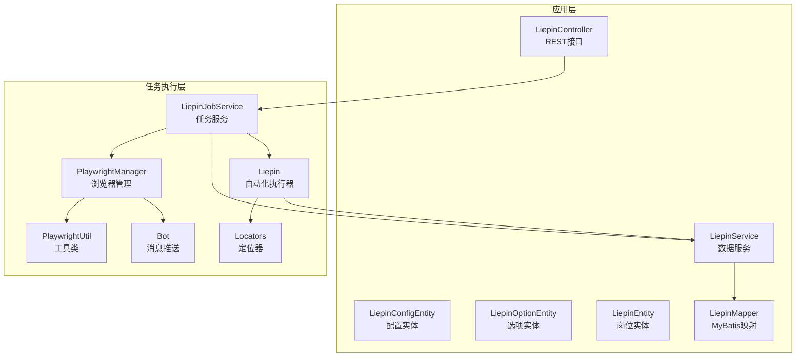
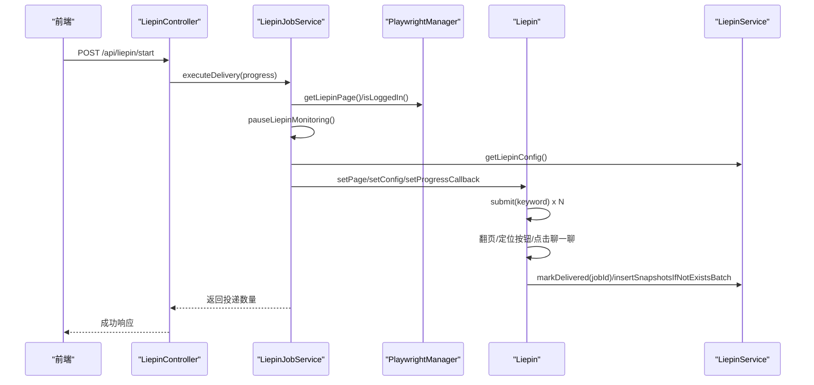
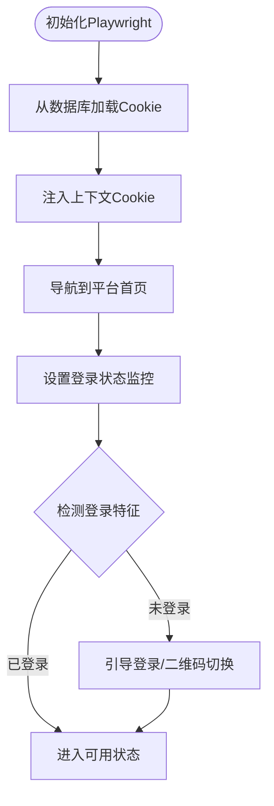
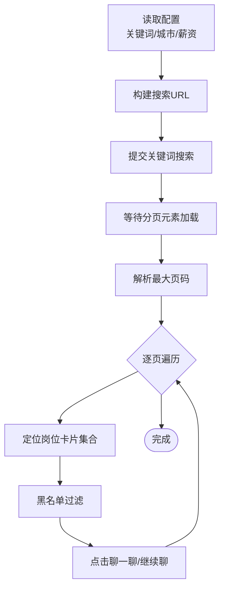
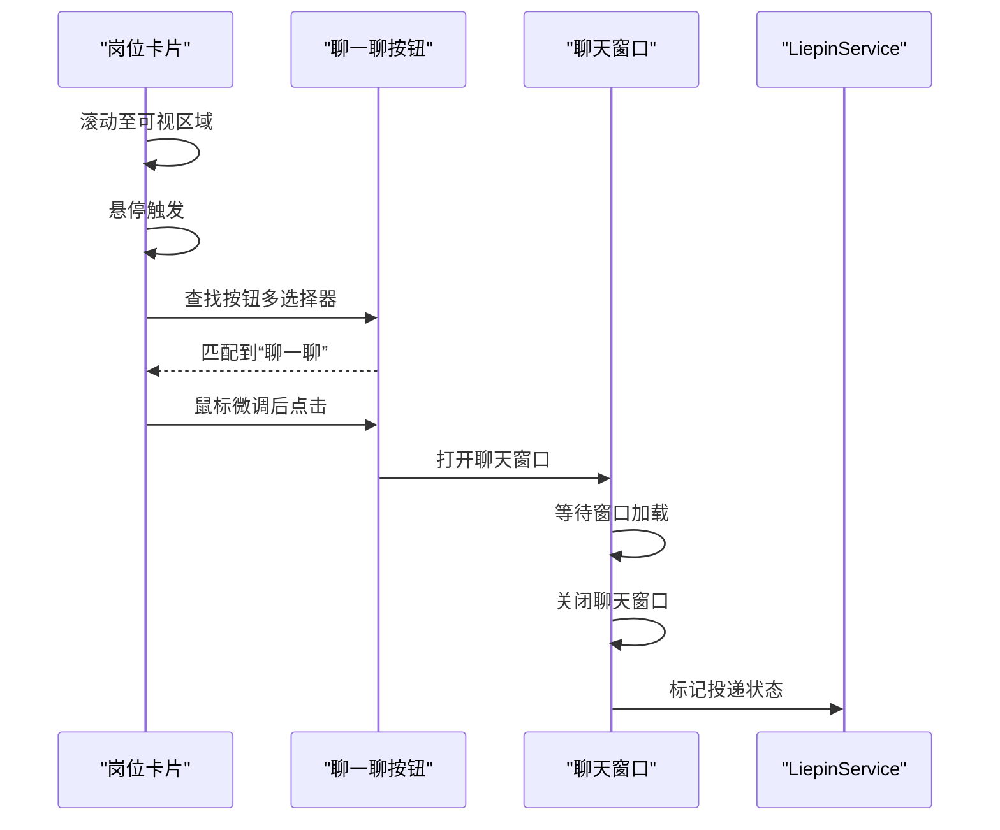
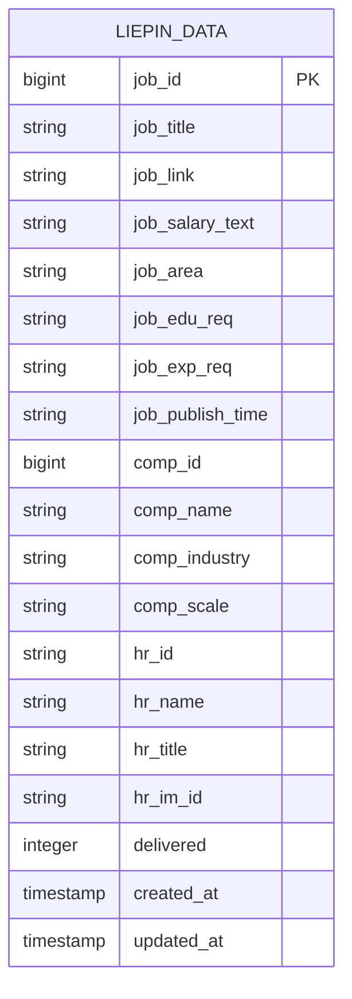
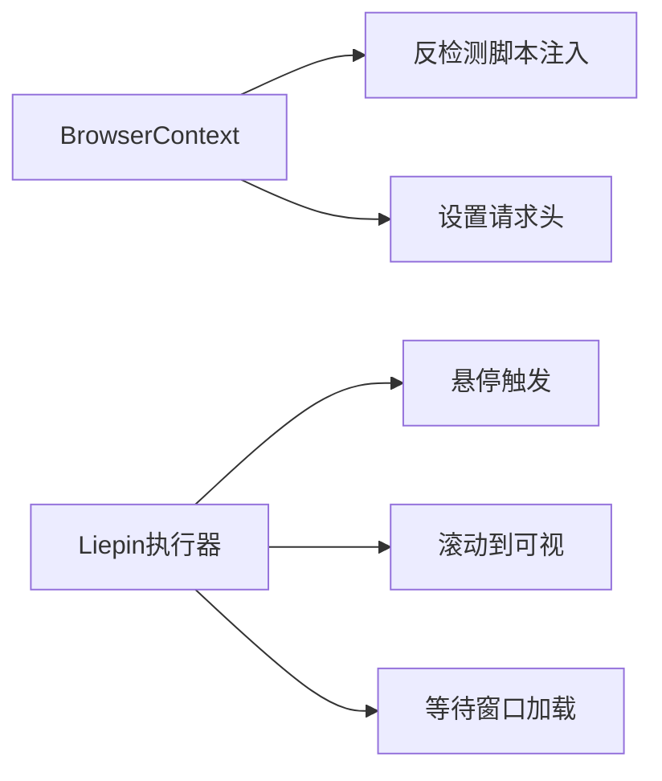
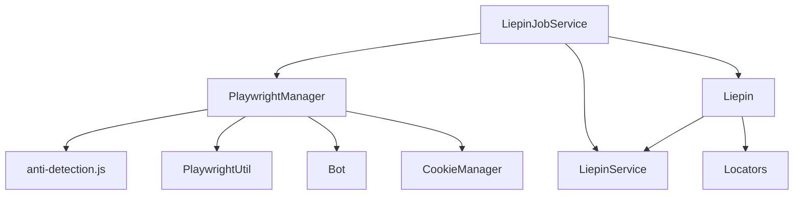

# 猎聘平台集成

<cite>
**本文引用的文件**
- [Liepin.java](file://backend/src/main/java/com/getjobs/worker/liepin/Liepin.java)
- [LiepinConfig.java](file://backend/src/main/java/com/getjobs/worker/liepin/LiepinConfig.java)
- [Locators.java](file://backend/src/main/java/com/getjobs/worker/liepin/Locators.java)
- [LiepinJobService.java](file://backend/src/main/java/com/getjobs/worker/service/LiepinJobService.java)
- [LiepinEntity.java](file://backend/src/main/java/com/getjobs/application/entity/LiepinEntity.java)
- [LiepinService.java](file://backend/src/main/java/com/getjobs/application/service/LiepinService.java)
- [PlaywrightManager.java](file://backend/src/main/java/com/getjobs/worker/manager/PlaywrightManager.java)
- [Bot.java](file://backend/src/main/java/com/getjobs/worker/utils/Bot.java)
- [PlaywrightUtil.java](file://backend/src/main/java/com/getjobs/worker/utils/PlaywrightUtil.java)
- [anti-detection.js](file://backend/src/main/resources/anti-detection.js)
- [LiepinController.java](file://backend/src/main/java/com/getjobs/application/controller/LiepinController.java)
- [CookieManager.java](file://backend/src/main/java/com/getjobs/worker/utils/CookieManager.java)
</cite>

## 目录
1. [简介](#简介)
2. [项目结构](#项目结构)
3. [核心组件](#核心组件)
4. [架构总览](#架构总览)
5. [详细组件分析](#详细组件分析)
6. [依赖关系分析](#依赖关系分析)
7. [性能考量](#性能考量)
8. [故障排查指南](#故障排查指南)
9. [结论](#结论)
10. [附录](#附录)

## 简介
本文件面向平台适配工程师与爬虫开发人员，系统化阐述猎聘平台集成模块的完整实现方案。内容涵盖用户认证流程、职位筛选算法、简历投递机制、数据提取策略、页面布局与元素定位、反检测技术（滑块验证处理、行为特征模拟、请求频率控制）、配置参数与数据模型设计、以及平台特有的技术挑战与解决方案（反爬虫机制应对、会话保持、数据格式转换）。文档以代码级分析为基础，辅以图示帮助理解。

## 项目结构
猎聘集成模块位于后端工程的 worker 与 application 层，采用“任务执行层 + 业务服务层 + 应用实体与映射”的分层设计：
- 任务执行层：负责浏览器自动化、页面交互、元素定位与投递动作
- 业务服务层：封装配置加载、数据持久化、统计分析与任务调度
- 应用层：实体模型、Mapper、Controller 与前端对接

**图示来源**
- [LiepinController.java](file://backend/src/main/java/com/getjobs/application/controller/LiepinController.java)
- [LiepinJobService.java](file://backend/src/main/java/com/getjobs/worker/service/LiepinJobService.java)
- [PlaywrightManager.java](file://backend/src/main/java/com/getjobs/worker/manager/PlaywrightManager.java)
- [Liepin.java](file://backend/src/main/java/com/getjobs/worker/liepin/Liepin.java)
- [Locators.java](file://backend/src/main/java/com/getjobs/worker/liepin/Locators.java)
- [PlaywrightUtil.java](file://backend/src/main/java/com/getjobs/worker/utils/PlaywrightUtil.java)
- [Bot.java](file://backend/src/main/java/com/getjobs/worker/utils/Bot.java)
- [LiepinEntity.java](file://backend/src/main/java/com/getjobs/application/entity/LiepinEntity.java)
- [LiepinService.java](file://backend/src/main/java/com/getjobs/application/service/LiepinService.java)

**章节来源**
- [LiepinController.java](file://backend/src/main/java/com/getjobs/application/controller/LiepinController.java)
- [LiepinJobService.java](file://backend/src/main/java/com/getjobs/worker/service/LiepinJobService.java)
- [PlaywrightManager.java](file://backend/src/main/java/com/getjobs/worker/manager/PlaywrightManager.java)
- [Liepin.java](file://backend/src/main/java/com/getjobs/worker/liepin/Liepin.java)
- [Locators.java](file://backend/src/main/java/com/getjobs/worker/liepin/Locators.java)
- [PlaywrightUtil.java](file://backend/src/main/java/com/getjobs/worker/utils/PlaywrightUtil.java)
- [Bot.java](file://backend/src/main/java/com/getjobs/worker/utils/Bot.java)
- [LiepinEntity.java](file://backend/src/main/java/com/getjobs/application/entity/LiepinEntity.java)
- [LiepinService.java](file://backend/src/main/java/com/getjobs/application/service/LiepinService.java)

## 核心组件
- LiepinConfig：任务配置载体，包含关键词列表、城市编码、薪资范围
- Locators：集中管理页面元素定位表达式（分页、按钮、聊天窗口等）
- Liepin：自动化执行器，负责搜索、翻页、定位按钮、点击“聊一聊”、关闭聊天窗口、持久化数据
- LiepinJobService：任务服务，协调 PlaywrightManager、配置加载与进度回调
- LiepinService：数据服务，封装数据库访问、批量插入、投递状态更新、统计分析
- PlaywrightManager：浏览器管理器，统一上下文、Cookie注入、登录状态监控与反检测脚本注入
- PlaywrightUtil：浏览器工具类，提供元素操作、Stealth模式、Cookie读写、截图等
- Bot：消息推送，定时聚合投递记录并通过企业微信/钉钉发送
- CookieManager：Cookie生命周期管理，提供过期检测与刷新提醒

**章节来源**
- [LiepinConfig.java](file://backend/src/main/java/com/getjobs/worker/liepin/LiepinConfig.java)
- [Locators.java](file://backend/src/main/java/com/getjobs/worker/liepin/Locators.java)
- [Liepin.java](file://backend/src/main/java/com/getjobs/worker/liepin/Liepin.java)
- [LiepinJobService.java](file://backend/src/main/java/com/getjobs/worker/service/LiepinJobService.java)
- [LiepinService.java](file://backend/src/main/java/com/getjobs/application/service/LiepinService.java)
- [PlaywrightManager.java](file://backend/src/main/java/com/getjobs/worker/manager/PlaywrightManager.java)
- [PlaywrightUtil.java](file://backend/src/main/java/com/getjobs/worker/utils/PlaywrightUtil.java)
- [Bot.java](file://backend/src/main/java/com/getjobs/worker/utils/Bot.java)
- [CookieManager.java](file://backend/src/main/java/com/getjobs/worker/utils/CookieManager.java)

## 架构总览
猎聘集成采用“控制器-任务服务-浏览器管理-自动化执行-数据服务”的链路，结合反检测脚本与行为模拟，实现稳定的自动化投递。

**图示来源**
- [LiepinController.java](file://backend/src/main/java/com/getjobs/application/controller/LiepinController.java)
- [LiepinJobService.java](file://backend/src/main/java/com/getjobs/worker/service/LiepinJobService.java)
- [PlaywrightManager.java](file://backend/src/main/java/com/getjobs/worker/manager/PlaywrightManager.java)
- [Liepin.java](file://backend/src/main/java/com/getjobs/worker/liepin/Liepin.java)
- [LiepinService.java](file://backend/src/main/java/com/getjobs/application/service/LiepinService.java)

## 详细组件分析

### 用户认证流程与会话保持
- 登录状态检测：通过 PlaywrightManager 的登录监控与特征识别，区分“登录/注册”入口与用户头像容器
- Cookie注入：启动时从数据库加载对应平台 Cookie 并注入上下文，避免重复登录
- 登录状态变更通知：登录状态变化时通过 SSE 通知前端
- 会话保持：统一 BrowserContext 下多标签页共享会话，减少登录成本

**图示来源**
- [PlaywrightManager.java](file://backend/src/main/java/com/getjobs/worker/manager/PlaywrightManager.java)

**章节来源**
- [PlaywrightManager.java](file://backend/src/main/java/com/getjobs/worker/manager/PlaywrightManager.java)

### 职位筛选算法
- 关键词与筛选条件：从配置实体读取关键词、城市、薪资范围，拼接到搜索URL
- 分页策略：解析分页容器，动态计算最大页码，逐页抓取
- 黑名单过滤：在投递前对职位/公司名称进行黑名单匹配，跳过命中项

**图示来源**
- [Liepin.java](file://backend/src/main/java/com/getjobs/worker/liepin/Liepin.java)
- [LiepinConfig.java](file://backend/src/main/java/com/getjobs/worker/liepin/LiepinConfig.java)

**章节来源**
- [Liepin.java](file://backend/src/main/java/com/getjobs/worker/liepin/Liepin.java)
- [LiepinConfig.java](file://backend/src/main/java/com/getjobs/worker/liepin/LiepinConfig.java)

### 简历投递机制
- 按钮定位：在卡片范围内尝试多种选择器，优先可见且文本包含“聊一聊”的按钮
- 行为模拟：悬停触发、鼠标微调（轻微偏移）提升成功率
- 聊天窗口处理：等待聊天窗口出现后直接关闭，避免二次确认
- 状态更新：根据按钮文本与 jobId 标记投递状态，支持回退到 data 属性提取 jobId

**图示来源**
- [Liepin.java](file://backend/src/main/java/com/getjobs/worker/liepin/Liepin.java)
- [LiepinService.java](file://backend/src/main/java/com/getjobs/application/service/LiepinService.java)

**章节来源**
- [Liepin.java](file://backend/src/main/java/com/getjobs/worker/liepin/Liepin.java)
- [LiepinService.java](file://backend/src/main/java/com/getjobs/application/service/LiepinService.java)

### 数据提取策略与存储结构
- 接口解析：拦截 PC 搜索接口响应，兼容两种 JSON 结构，抽取岗位、公司、HR 字段
- 批量去重插入：按 job_id 去重，不存在时插入，存在则跳过
- 字段清洗：统一文本格式，去除冗余换行与特殊符号
- 投递状态：新增 delivered 字段，0 未投递，1 已投递

**图示来源**
- [LiepinEntity.java](file://backend/src/main/java/com/getjobs/application/entity/LiepinEntity.java)

**章节来源**
- [Liepin.java](file://backend/src/main/java/com/getjobs/worker/liepin/Liepin.java)
- [LiepinEntity.java](file://backend/src/main/java/com/getjobs/application/entity/LiepinEntity.java)
- [LiepinService.java](file://backend/src/main/java/com/getjobs/application/service/LiepinService.java)

### 反检测技术与行为特征模拟
- 反检测脚本注入：在上下文层注入 anti-detection.js，伪装 Function.toString 等特征
- Stealth 模式：设置 UA、语言、Referer 等请求头，注入 navigator 代理屏蔽
- 行为模拟：悬停、微调、滚动到可视区域、等待窗口加载，降低被识别为机器人概率
- 请求频率控制：通过慢动作、等待与资源拦截降低网络压力

**图示来源**
- [PlaywrightManager.java](file://backend/src/main/java/com/getjobs/worker/manager/PlaywrightManager.java)
- [anti-detection.js](file://backend/src/main/resources/anti-detection.js)
- [PlaywrightUtil.java](file://backend/src/main/java/com/getjobs/worker/utils/PlaywrightUtil.java)
- [Liepin.java](file://backend/src/main/java/com/getjobs/worker/liepin/Liepin.java)

**章节来源**
- [PlaywrightManager.java](file://backend/src/main/java/com/getjobs/worker/manager/PlaywrightManager.java)
- [anti-detection.js](file://backend/src/main/resources/anti-detection.js)
- [PlaywrightUtil.java](file://backend/src/main/java/com/getjobs/worker/utils/PlaywrightUtil.java)
- [Liepin.java](file://backend/src/main/java/com/getjobs/worker/liepin/Liepin.java)

### 配置参数与定位器
- LiepinConfig：keywords、cityCode、salary
- Locators：分页容器、下一页按钮、订阅关闭、岗位卡片、聊天窗口相关元素

**章节来源**
- [LiepinConfig.java](file://backend/src/main/java/com/getjobs/worker/liepin/LiepinConfig.java)
- [Locators.java](file://backend/src/main/java/com/getjobs/worker/liepin/Locators.java)

### 数据模型设计与存储
- 实体字段覆盖岗位、公司、HR 三类信息，并包含投递状态与时间戳
- Mapper 基于 MyBatis-Plus，支持批量插入与条件查询
- 服务层提供薪资解析、批量插入、状态更新与统计分析

**章节来源**
- [LiepinEntity.java](file://backend/src/main/java/com/getjobs/application/entity/LiepinEntity.java)
- [LiepinService.java](file://backend/src/main/java/com/getjobs/application/service/LiepinService.java)

## 依赖关系分析
- LiepinJobService 依赖 PlaywrightManager 获取页面与登录状态，依赖 ConfigService 读取配置，依赖 LiepinService 进行数据持久化
- Liepin 依赖 Locators、LiepinService、BlacklistService、PlaywrightUtil
- PlaywrightManager 统一管理浏览器、Cookie、登录监控与反检测脚本
- Bot 与 CookieManager 作为辅助能力，分别负责消息推送与 Cookie 生命周期管理

**图示来源**
- [LiepinJobService.java](file://backend/src/main/java/com/getjobs/worker/service/LiepinJobService.java)
- [PlaywrightManager.java](file://backend/src/main/java/com/getjobs/worker/manager/PlaywrightManager.java)
- [Liepin.java](file://backend/src/main/java/com/getjobs/worker/liepin/Liepin.java)
- [Locators.java](file://backend/src/main/java/com/getjobs/worker/liepin/Locators.java)
- [PlaywrightUtil.java](file://backend/src/main/java/com/getjobs/worker/utils/PlaywrightUtil.java)
- [Bot.java](file://backend/src/main/java/com/getjobs/worker/utils/Bot.java)
- [CookieManager.java](file://backend/src/main/java/com/getjobs/worker/utils/CookieManager.java)

**章节来源**
- [LiepinJobService.java](file://backend/src/main/java/com/getjobs/worker/service/LiepinJobService.java)
- [PlaywrightManager.java](file://backend/src/main/java/com/getjobs/worker/manager/PlaywrightManager.java)
- [Liepin.java](file://backend/src/main/java/com/getjobs/worker/liepin/Liepin.java)
- [Locators.java](file://backend/src/main/java/com/getjobs/worker/liepin/Locators.java)
- [PlaywrightUtil.java](file://backend/src/main/java/com/getjobs/worker/utils/PlaywrightUtil.java)
- [Bot.java](file://backend/src/main/java/com/getjobs/worker/utils/Bot.java)
- [CookieManager.java](file://backend/src/main/java/com/getjobs/worker/utils/CookieManager.java)

## 性能考量
- 批量插入：接口响应后一次性批量去重插入，减少数据库往返
- 资源拦截：可选启用资源拦截降低内存占用与网络压力
- 慢动作与等待：通过 slowMo 与合理等待时间平衡稳定性与效率
- 并发与池化：PagePool 管理页面资源，避免频繁创建销毁

[本节为通用指导，无需列出具体文件来源]

## 故障排查指南
- 登录失败：检查 Cookie 是否正确注入与有效期；确认登录监控未被暂停
- 页面元素找不到：核对 Locators 与页面结构差异；增加等待与重试
- 投递未生效：确认按钮文本匹配与 jobId 提取；查看状态更新逻辑
- 反检测失效：确认 anti-detection.js 注入与 Stealth 模式启用
- 频繁被拦截：降低请求频率、优化行为模拟、启用资源拦截

**章节来源**
- [PlaywrightManager.java](file://backend/src/main/java/com/getjobs/worker/manager/PlaywrightManager.java)
- [PlaywrightUtil.java](file://backend/src/main/java/com/getjobs/worker/utils/PlaywrightUtil.java)
- [Liepin.java](file://backend/src/main/java/com/getjobs/worker/liepin/Liepin.java)
- [Bot.java](file://backend/src/main/java/com/getjobs/worker/utils/Bot.java)

## 结论
猎聘平台集成模块通过统一的浏览器管理、完善的反检测策略、稳健的数据提取与存储机制，实现了高可靠性的自动化投递。配置化与可扩展的设计使其易于适配不同城市、薪资与关键词组合，同时具备良好的可观测性与可维护性。

[本节为总结性内容，无需列出具体文件来源]

## 附录

### API 定义（节选）
- GET /api/liepin/login-status：检查登录状态
- POST /api/liepin/start：启动投递任务（计费检查、异步执行、完成后扣费）
- POST /api/liepin/stop：停止任务
- GET /api/liepin/status：获取当前运行状态
- GET /api/liepin/config：获取配置与选项
- PUT /api/liepin/config：更新配置
- GET /api/liepin/stats：投递统计与图表
- GET /api/liepin/list：岗位列表（分页+筛选）

**章节来源**
- [LiepinController.java](file://backend/src/main/java/com/getjobs/application/controller/LiepinController.java)