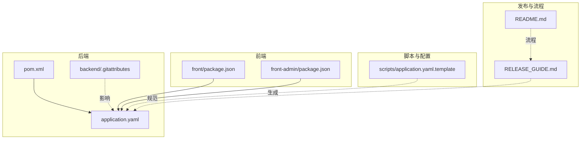
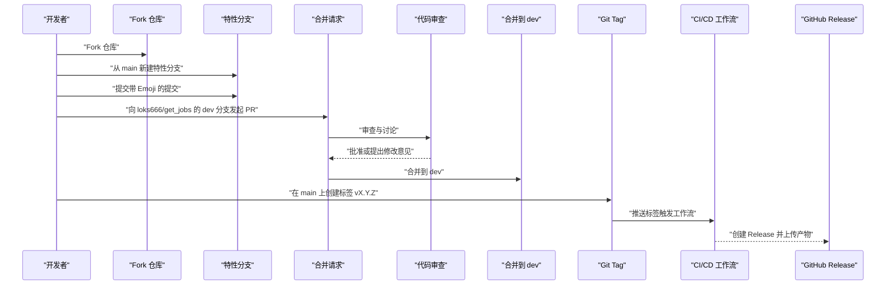
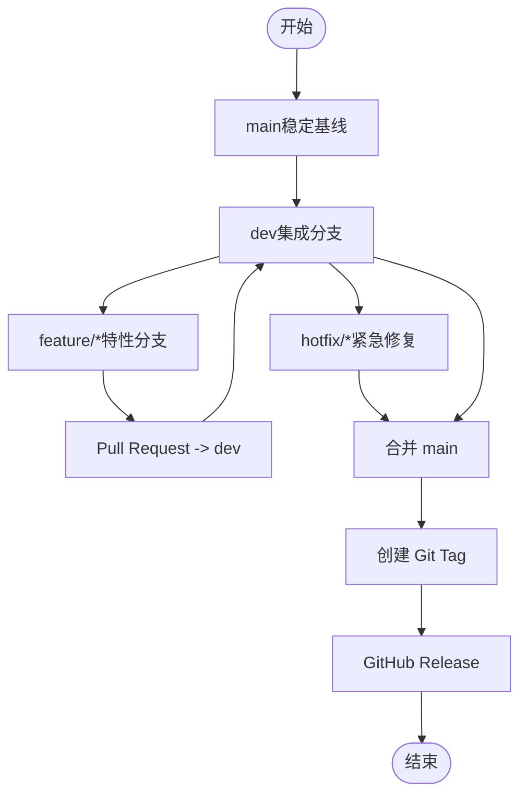
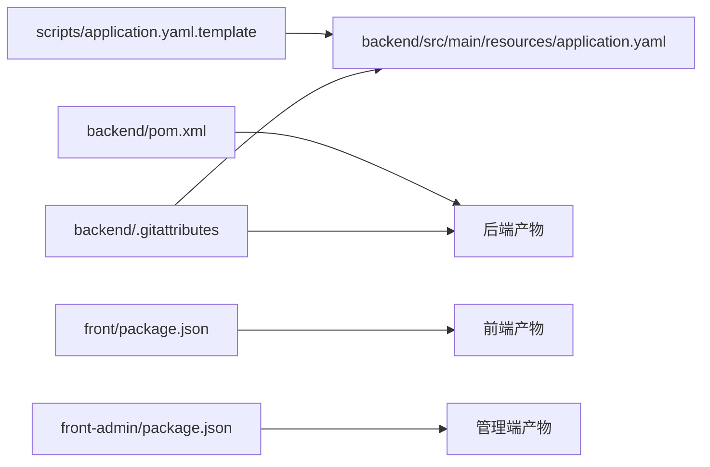

# Git 工作流

<cite>
**本文引用的文件**
- [README.md](file://README.md)
- [RELEASE_GUIDE.md](file://RELEASE_GUIDE.md)
- [backend/.gitattributes](file://backend/.gitattributes)
- [backend/pom.xml](file://backend/pom.xml)
- [backend/src/main/resources/application.yaml](file://backend/src/main/resources/application.yaml)
- [scripts/application.yaml.template](file://scripts/application.yaml.template)
- [front/package.json](file://front/package.json)
- [front-admin/package.json](file://front-admin/package.json)
</cite>

## 目录
1. [简介](#简介)
2. [项目结构](#项目结构)
3. [核心组件](#核心组件)
4. [架构总览](#架构总览)
5. [详细组件分析](#详细组件分析)
6. [依赖分析](#依赖分析)
7. [性能考量](#性能考量)
8. [故障排查指南](#故障排查指南)
9. [结论](#结论)
10. [附录](#附录)

## 简介
本文件面向 GetJobs 项目团队，提供一套完整的 Git 工作流规范，覆盖分支管理策略、提交消息规范、代码审查流程、冲突解决策略、合并请求模板与检查清单、Git 钩子配置建议、自动化测试触发与发布流程管理、版本标签规范、变更日志维护与发布说明生成、团队协作最佳实践、紧急修复流程与回滚策略，以及常用命令速查与常见问题解决方案。文档以仓库现有规范为基础，结合实际工程实践，确保团队协作高效、可追溯、可复现。

## 项目结构
GetJobs 采用多模块/多仓库协同的组织方式：
- 后端（Spring Boot + Maven）：负责业务逻辑、数据持久化、定时任务与接口服务。
- 前端（Next.js）：用户交互界面，包含用户端与管理端两个独立应用。
- 脚本与配置：包含数据库迁移脚本、环境配置模板与启动脚本。
- 发布与自动化：通过发布指南与模板化流程实现版本化交付。

图表来源
- [backend/pom.xml:1-309](file://backend/pom.xml#L1-L309)
- [backend/src/main/resources/application.yaml](file://backend/src/main/resources/application.yaml)
- [backend/.gitattributes:1-52](file://backend/.gitattributes#L1-L52)
- [front/package.json:1-48](file://front/package.json#L1-L48)
- [front-admin/package.json:1-41](file://front-admin/package.json#L1-L41)
- [scripts/application.yaml.template:1-102](file://scripts/application.yaml.template#L1-L102)
- [RELEASE_GUIDE.md:1-211](file://RELEASE_GUIDE.md#L1-L211)
- [README.md:187-196](file://README.md#L187-L196)

章节来源
- [README.md:187-196](file://README.md#L187-L196)
- [RELEASE_GUIDE.md:1-211](file://RELEASE_GUIDE.md#L1-L211)
- [backend/.gitattributes:1-52](file://backend/.gitattributes#L1-L52)
- [backend/pom.xml:1-309](file://backend/pom.xml#L1-L309)
- [scripts/application.yaml.template:1-102](file://scripts/application.yaml.template#L1-L102)
- [front/package.json:1-48](file://front/package.json#L1-L48)
- [front-admin/package.json:1-41](file://front-admin/package.json#L1-L41)

## 核心组件
- 分支与发布策略：基于 README 的 PR 流程与 RELEASE_GUIDE 的标签发布流程，明确 dev 与 main 的职责边界。
- 提交消息规范：鼓励使用带 Emoji 的描述，提升可读性与可追踪性。
- 配置与模板：通过 application.yaml 与 template 模板统一配置管理，减少环境差异。
- 版本与发布：遵循语义化版本，使用 Git Tag 触发自动化发布。

章节来源
- [README.md:187-196](file://README.md#L187-L196)
- [RELEASE_GUIDE.md:48-61](file://RELEASE_GUIDE.md#L48-L61)
- [scripts/application.yaml.template:1-102](file://scripts/application.yaml.template#L1-L102)
- [backend/src/main/resources/application.yaml](file://backend/src/main/resources/application.yaml)

## 架构总览
本节从 Git 工作流视角展示从特性开发到发布的整体流程，包括分支策略、PR 审查、CI/CD 触发与发布说明生成。

图表来源
- [README.md:187-196](file://README.md#L187-L196)
- [RELEASE_GUIDE.md:48-61](file://RELEASE_GUIDE.md#L48-L61)

## 详细组件分析

### 分支管理策略
- 主分支（main）：稳定基线，用于发布与回滚；仅允许通过合并请求合并至 dev，再由维护者合并至 main。
- 开发分支（dev）：集成特性分支，作为 PR 的目标分支；发布前在此分支进行最终验证。
- 特性分支（feature/*）：每个功能或修复以独立分支开发，命名清晰，避免跨主题耦合。
- 热修复分支（hotfix/*）：紧急修复线上问题，从 main 切出，修复后同时合并回 main 与 dev。

图表来源
- [README.md:187-196](file://README.md#L187-L196)
- [RELEASE_GUIDE.md:48-61](file://RELEASE_GUIDE.md#L48-L61)

章节来源
- [README.md:187-196](file://README.md#L187-L196)
- [RELEASE_GUIDE.md:48-61](file://RELEASE_GUIDE.md#L48-L61)

### 提交消息规范
- 鼓励在提交信息前添加 Emoji，增强可读性与情感表达，便于快速识别提交意图。
- 建议遵循“类型: 内容”的结构，配合 Emoji，例如 “✨ feat: 添加新功能”、“🐛 fix: 修复 bug”。

章节来源
- [README.md:193-194](file://README.md#L193-L194)

### 代码审查流程
- PR 目标：dev 分支（非 main）。
- 审查要点：功能正确性、代码风格、安全性、性能影响、测试覆盖、配置一致性。
- 审查工具：利用 GitHub 的评论与线程讨论，必要时要求修改后再审。
- 合并策略：审查通过后由维护者合并；避免直接推送 main。

章节来源
- [README.md:191-195](file://README.md#L191-L195)

### 冲突解决策略
- 频繁同步：定期从 dev 拉取最新变更，减少冲突范围。
- 小步提交：将大改动拆分为多个小提交，降低合并复杂度。
- 冲突定位：使用 diff 工具定位冲突区域，逐段核对逻辑与数据流。
- 回归测试：冲突解决后执行最小化回归测试，确保功能不变。

章节来源
- [README.md:187-196](file://README.md#L187-L196)

### 合并请求模板与检查清单
建议在仓库中增加 .github/PULL_REQUEST_TEMPLATE.md，包含以下字段：
- 摘要：简述变更内容与动机
- 类型：feat/fix/docs/style/refactor/test/build/chore
- 相关 Issue：关联问题编号
- 变更影响：对后端、前端、配置的影响评估
- 测试方案：本地测试步骤与结果
- 风险与回滚：潜在风险与回滚策略

章节来源
- [README.md:187-196](file://README.md#L187-L196)

### Git 钩子配置（建议）
- 预提交钩子（pre-commit）：格式化校验、静态检查、单元测试触发
- 提交信息钩子（commit-msg）：强制检查提交信息格式（Emoji + 类型 + 内容）
- 推送钩子（pre-push）：远程一致性检查，避免错误推送

章节来源
- [backend/.gitattributes:1-52](file://backend/.gitattributes#L1-L52)

### 自动化测试触发与发布流程
- 触发方式：推送标签（vX.Y.Z）触发 CI/CD 工作流，自动构建多平台安装包并创建 Release。
- 构建命令：参考发布指南中的构建脚本与平台命令。
- 验证清单：安装包可运行、后端可启动、基本功能正常、自动更新配置正确。

章节来源
- [RELEASE_GUIDE.md:26-36](file://RELEASE_GUIDE.md#L26-L36)
- [RELEASE_GUIDE.md:48-61](file://RELEASE_GUIDE.md#L48-L61)
- [RELEASE_GUIDE.md:128-151](file://RELEASE_GUIDE.md#L128-L151)

### 版本标签规范与语义化版本
- 版本号：遵循语义化版本（主/次/修订），主版本用于不兼容变更，次版本用于新增功能，修订用于问题修正。
- 标签命名：使用 v1.2.3 格式，与发布说明一致。
- 发布说明：使用模板化 Markdown，包含新功能、修复、安装包与系统要求。

章节来源
- [RELEASE_GUIDE.md:17-21](file://RELEASE_GUIDE.md#L17-L21)
- [RELEASE_GUIDE.md:48-61](file://RELEASE_GUIDE.md#L48-L61)
- [RELEASE_GUIDE.md:91-126](file://RELEASE_GUIDE.md#L91-L126)

### 变更日志维护与发布说明生成
- 变更日志：在 ELECTRON_README.md 或新增 CHANGELOG.md 中记录每次版本变更。
- 发布说明：使用模板，自动填充版本号、平台安装包与链接。

章节来源
- [RELEASE_GUIDE.md:22-24](file://RELEASE_GUIDE.md#L22-L24)
- [RELEASE_GUIDE.md:91-126](file://RELEASE_GUIDE.md#L91-L126)

### 团队协作最佳实践
- 透明沟通：在 Issue 与 Discussions 中明确需求与分工。
- 代码质量：统一编码风格、静态检查与单元测试。
- 配置治理：通过模板与环境变量集中管理敏感配置。
- 文档同步：变更与流程更新同步至 README 与发布指南。

章节来源
- [README.md:181-184](file://README.md#L181-L184)
- [scripts/application.yaml.template:1-102](file://scripts/application.yaml.template#L1-L102)

### 紧急修复流程与回滚策略
- 紧急修复：从 main 切出 hotfix/*，修复后同时合并回 main 与 dev。
- 回滚策略：若发布后出现严重问题，使用最近稳定标签回滚并重新发布修复版本。
- 验证：回滚前后均需进行安装包与功能验证。

章节来源
- [RELEASE_GUIDE.md:178-191](file://RELEASE_GUIDE.md#L178-L191)
- [RELEASE_GUIDE.md:128-151](file://RELEASE_GUIDE.md#L128-L151)

## 依赖分析
- 配置依赖：后端 application.yaml 与 scripts/application.yaml.template 存在强耦合关系，template 用于生成运行时配置，需保持版本一致。
- 构建依赖：前端 package.json 定义了构建脚本与依赖，后端 pom.xml 定义了 Java 生态构建与测试插件，二者共同决定最终产物。
- 环境差异：.gitattributes 统一换行符与二进制文件处理，减少跨平台差异带来的问题。

图表来源
- [scripts/application.yaml.template:1-102](file://scripts/application.yaml.template#L1-L102)
- [backend/src/main/resources/application.yaml](file://backend/src/main/resources/application.yaml)
- [backend/pom.xml:1-309](file://backend/pom.xml#L1-L309)
- [front/package.json:1-48](file://front/package.json#L1-L48)
- [front-admin/package.json:1-41](file://front-admin/package.json#L1-L41)
- [backend/.gitattributes:1-52](file://backend/.gitattributes#L1-L52)

章节来源
- [scripts/application.yaml.template:1-102](file://scripts/application.yaml.template#L1-L102)
- [backend/src/main/resources/application.yaml](file://backend/src/main/resources/application.yaml)
- [backend/pom.xml:1-309](file://backend/pom.xml#L1-L309)
- [front/package.json:1-48](file://front/package.json#L1-L48)
- [front-admin/package.json:1-41](file://front-admin/package.json#L1-L41)
- [backend/.gitattributes:1-52](file://backend/.gitattributes#L1-L52)

## 性能考量
- 提交粒度：小而清晰的提交更利于审查与回溯，减少合并冲突。
- 构建缓存：合理利用 CI 缓存与依赖缓存，缩短构建时间。
- 配置加载：通过模板与环境变量集中管理，避免重复配置与运行时切换。

## 故障排查指南
- CI 构建失败：检查 Actions 日志、依赖配置、图标文件与 package.json 格式。
- 自动更新不工作：检查 publish 配置、GitHub Token 权限、Release 状态与应用日志。
- 平台构建失败：分别检查 Windows 的 NSIS 配置与图标、macOS 的代码签名、Linux 的依赖与权限。
- 配置不生效：核对 application.yaml 与 template 是否一致，确认环境变量与 Jasypt 加密配置。

章节来源
- [RELEASE_GUIDE.md:153-177](file://RELEASE_GUIDE.md#L153-L177)
- [scripts/application.yaml.template:51-58](file://scripts/application.yaml.template#L51-L58)

## 结论
通过明确的分支策略、规范的提交消息、严格的代码审查与完善的发布流程，GetJobs 项目能够在多模块环境下保持高质量交付。建议团队持续优化自动化与文档，确保流程可复制、可审计、可回溯。

## 附录

### 常用命令速查
- 创建特性分支并推送
  - git checkout -b feature/xxx main
  - git push origin feature/xxx
- 同步上游变更
  - git fetch upstream
  - git checkout dev && git merge upstream/dev
- 提交与推送
  - git add . && git commit -m "✨ feat: xxx"
  - git push origin feature/xxx
- 发起 PR
  - 在 GitHub 界面选择 base: dev，compare: feature/xxx
- 创建标签并推送
  - git tag -a vX.Y.Z -m "发布版本 X.Y.Z"
  - git push origin vX.Y.Z
- 触发发布
  - 参考发布指南中的构建与上传步骤

章节来源
- [README.md:187-196](file://README.md#L187-L196)
- [RELEASE_GUIDE.md:26-36](file://RELEASE_GUIDE.md#L26-L36)
- [RELEASE_GUIDE.md:48-61](file://RELEASE_GUIDE.md#L48-L61)