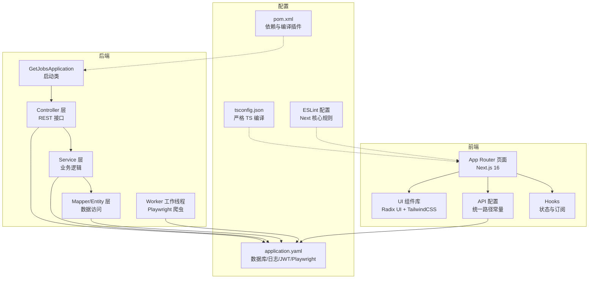
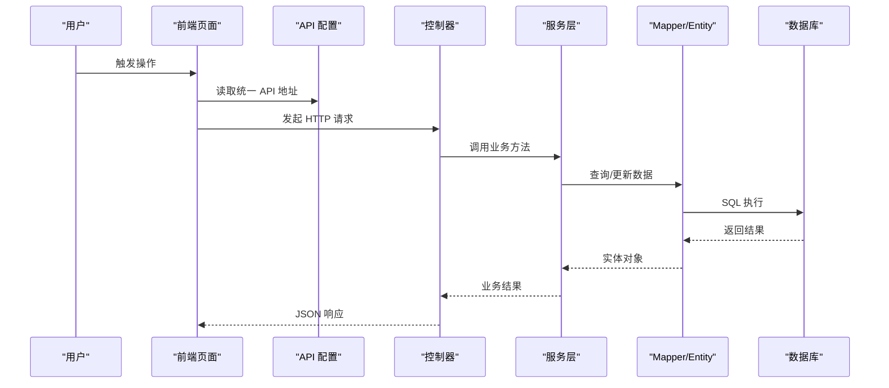
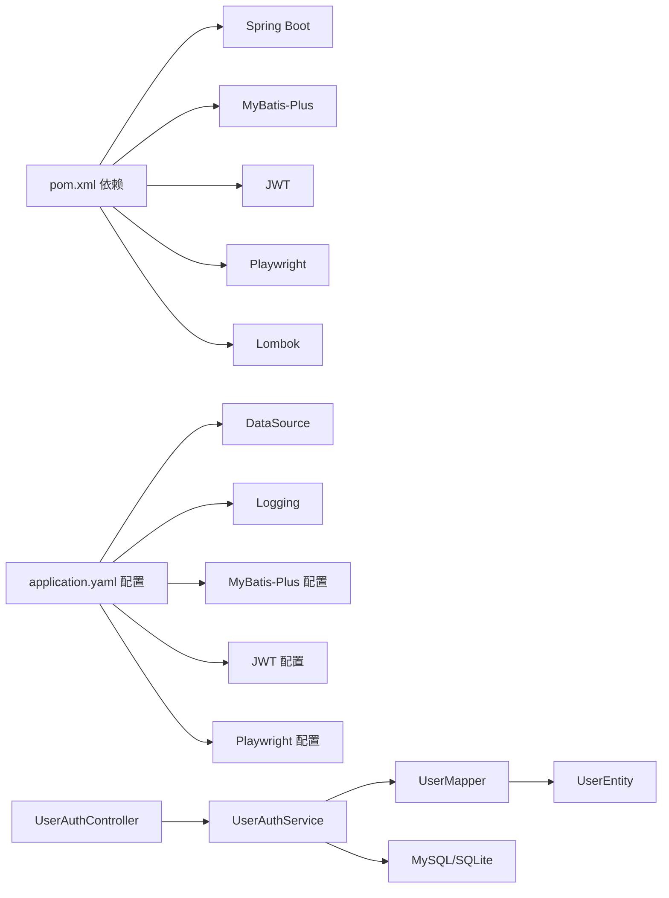

# 代码规范

<cite>
**本文引用的文件**
- [GetJobsApplication.java](file://backend/src/main/java/com/getjobs/GetJobsApplication.java)
- [pom.xml](file://backend/pom.xml)
- [application.yaml](file://backend/src/main/resources/application.yaml)
- [UserAuthController.java](file://backend/src/main/java/com/getjobs/application/controller/UserAuthController.java)
- [UserAuthService.java](file://backend/src/main/java/com/getjobs/application/service/UserAuthService.java)
- [UserMapper.java](file://backend/src/main/java/com/getjobs/application/mapper/UserMapper.java)
- [UserEntity.java](file://backend/src/main/java/com/getjobs/application/entity/UserEntity.java)
- [Constant.java](file://backend/src/main/java/com/getjobs/worker/utils/Constant.java)
- [package.json（前端）](file://front/package.json)
- [package.json（后台管理前端）](file://front-admin/package.json)
- [eslint.config.mjs（前端）](file://front/eslint.config.mjs)
- [eslint.config.mjs（后台管理前端）](file://front-admin/eslint.config.mjs)
- [tsconfig.json（前端）](file://front/tsconfig.json)
- [tsconfig.json（后台管理前端）](file://front-admin/tsconfig.json)
- [api-config.ts](file://front/lib/api-config.ts)
- [button.tsx](file://front/components/ui/button.tsx)
- [useBackendStatus.ts](file://front/hooks/useBackendStatus.ts)
</cite>

## 目录
1. [引言](#引言)
2. [项目结构](#项目结构)
3. [核心组件](#核心组件)
4. [架构总览](#架构总览)
5. [详细组件分析](#详细组件分析)
6. [依赖关系分析](#依赖关系分析)
7. [性能考虑](#性能考虑)
8. [故障排查指南](#故障排查指南)
9. [结论](#结论)
10. [附录](#附录)

## 引言
本文件为 GetJobs 项目的统一代码规范文档，面向后端 Java 与前端 TypeScript/React 贡献者，覆盖编码风格、命名约定、注释与日志、异常处理、类型与组件规范、ESLint 规则、IDE 配置与代码格式化等，帮助团队达成一致的工程实践。

## 项目结构
- 后端采用 Spring Boot 3 + MyBatis-Plus，模块按应用层（controller）、服务层（service）、数据访问层（mapper、entity）、工具与工作线程（worker）划分。
- 前端使用 Next.js 16 + TypeScript，采用 App Router 结构，UI 组件基于 Radix UI 与 TailwindCSS，统一 API 地址集中管理。
- 后台管理前端同样基于 Next.js，独立运行与构建。

图表来源
- [GetJobsApplication.java:1-22](file://backend/src/main/java/com/getjobs/GetJobsApplication.java#L1-L22)
- [application.yaml:1-91](file://backend/src/main/resources/application.yaml#L1-L91)
- [pom.xml:1-263](file://backend/pom.xml#L1-L263)
- [tsconfig.json（前端）:1-47](file://front/tsconfig.json#L1-L47)
- [eslint.config.mjs（前端）:1-19](file://front/eslint.config.mjs#L1-L19)

章节来源
- [GetJobsApplication.java:1-22](file://backend/src/main/java/com/getjobs/GetJobsApplication.java#L1-L22)
- [application.yaml:1-91](file://backend/src/main/resources/application.yaml#L1-L91)
- [pom.xml:1-263](file://backend/pom.xml#L1-L263)
- [tsconfig.json（前端）:1-47](file://front/tsconfig.json#L1-L47)
- [eslint.config.mjs（前端）:1-19](file://front/eslint.config.mjs#L1-L19)

## 核心组件
- 启动类与配置
  - 启动类启用调度与异步，扫描基础包，作为应用入口。
  - application.yaml 提供数据源、日志、MyBatis-Plus、JWT、Playwright 等全局配置。
  - pom.xml 统一管理 Java 21、MyBatis-Plus、Lombok、Playwright、JWT 等依赖与编译插件。
- 控制器与服务
  - 控制器负责请求映射、参数校验与响应封装；服务层承担业务流程与事务控制；Mapper/Entity 由 MyBatis-Plus 管理。
- 前端
  - API 地址集中配置，组件采用变体与尺寸体系，Hook 封装状态与事件订阅，TS 严格模式与 Next ESLint 规则。

章节来源
- [GetJobsApplication.java:1-22](file://backend/src/main/java/com/getjobs/GetJobsApplication.java#L1-L22)
- [application.yaml:1-91](file://backend/src/main/resources/application.yaml#L1-L91)
- [pom.xml:1-263](file://backend/pom.xml#L1-L263)
- [UserAuthController.java:1-167](file://backend/src/main/java/com/getjobs/application/controller/UserAuthController.java#L1-L167)
- [UserAuthService.java:1-311](file://backend/src/main/java/com/getjobs/application/service/UserAuthService.java#L1-L311)
- [UserMapper.java:1-35](file://backend/src/main/java/com/getjobs/application/mapper/UserMapper.java#L1-L35)
- [UserEntity.java:1-41](file://backend/src/main/java/com/getjobs/application/entity/UserEntity.java#L1-L41)
- [api-config.ts:1-99](file://front/lib/api-config.ts#L1-L99)
- [button.tsx:1-60](file://front/components/ui/button.tsx#L1-L60)
- [useBackendStatus.ts:1-101](file://front/hooks/useBackendStatus.ts#L1-L101)

## 架构总览
后端以 Spring MVC 接收请求，经控制器进入服务层，服务层通过 MyBatis-Plus 访问数据库，必要时调用工作线程模块进行浏览器自动化任务。前端通过统一 API 配置访问后端接口，并通过 Hook 订阅后端状态与日志。

图表来源
- [api-config.ts:1-99](file://front/lib/api-config.ts#L1-L99)
- [UserAuthController.java:1-167](file://backend/src/main/java/com/getjobs/application/controller/UserAuthController.java#L1-L167)
- [UserAuthService.java:1-311](file://backend/src/main/java/com/getjobs/application/service/UserAuthService.java#L1-L311)
- [UserMapper.java:1-35](file://backend/src/main/java/com/getjobs/application/mapper/UserMapper.java#L1-L35)
- [UserEntity.java:1-41](file://backend/src/main/java/com/getjobs/application/entity/UserEntity.java#L1-L41)

## 详细组件分析

### Java 后端编码规范

- 包与类命名
  - 包名采用小写与点分隔，按功能域划分（application.controller、application.service、application.mapper、application.entity、worker.*）。
  - 类名采用帕斯卡命名法，控制器以“...Controller”结尾，服务以“...Service”结尾，Mapper 接口以“...Mapper”结尾，实体以“...Entity”结尾。
- 注释与文档
  - 类级注释包含简要职责与作者/版本信息；方法注释描述入参、返回值与异常情况。
- 控制器组织
  - 使用@RestController 与@RequestMapping 统一前缀；每个接口方法明确 HTTP 方法与路径；对请求体参数进行显式校验；统一返回 Map<String,Object> 的结构化响应。
- 服务层组织
  - 使用@Service；复杂流程标注@Transactional；日志使用 SLF4J；JWT 秘钥与过期时间从配置注入；异常与非法状态统一返回带 success/message 的结构。
- Mapper/Entity 设计
  - 使用 MyBatis-Plus 注解（@TableName、@TableId、IdType）；Mapper 继承 BaseMapper；默认方法与注解查询结合；实体字段与表列一一对应。
- Lombok 使用
  - 在实体类上使用@Data；在服务类上使用@Slf4j；在控制器中避免滥用注解，保持可读性。
- 日志与异常
  - application.yaml 中配置日志级别、控制台格式、滚动策略；服务层对异常捕获并返回结构化消息；控制器对 401/400 等状态进行明确响应。
- 事务与幂等
  - 关键写操作标注@Transactional；幂等性通过唯一索引与业务校验保障；重复注册/登录等场景进行前置检查。

章节来源
- [UserAuthController.java:1-167](file://backend/src/main/java/com/getjobs/application/controller/UserAuthController.java#L1-L167)
- [UserAuthService.java:1-311](file://backend/src/main/java/com/getjobs/application/service/UserAuthService.java#L1-L311)
- [UserMapper.java:1-35](file://backend/src/main/java/com/getjobs/application/mapper/UserMapper.java#L1-L35)
- [UserEntity.java:1-41](file://backend/src/main/java/com/getjobs/application/entity/UserEntity.java#L1-L41)
- [application.yaml:32-43](file://backend/src/main/resources/application.yaml#L32-L43)
- [pom.xml:163-170](file://backend/pom.xml#L163-L170)

### TypeScript/React 前端编码规范

- ESLint 与 TypeScript
  - 使用 Next.js ESLint 配置（core-web-vitals 与 typescript），自定义忽略项覆盖默认忽略；严格模式开启，禁止隐式 any。
- 统一 API 地址
  - API 地址集中导出，支持动态参数拼接；通过环境变量覆盖基础 URL，便于多环境切换。
- 组件与样式
  - UI 组件采用变体（variant）与尺寸（size）体系，支持透传 HTML 属性；使用 class-variance-authority 与 cn 组合样式。
- Hooks
  - 状态与事件订阅通过 Hook 封装，支持监听后端状态与日志流；定时轮询与清理资源。
- 类型与上下文
  - 对外暴露的接口使用 TypeScript 接口定义；组件 props 明确类型，避免使用 any。

章节来源
- [eslint.config.mjs（前端）:1-19](file://front/eslint.config.mjs#L1-L19)
- [tsconfig.json（前端）:1-47](file://front/tsconfig.json#L1-L47)
- [api-config.ts:1-99](file://front/lib/api-config.ts#L1-L99)
- [button.tsx:1-60](file://front/components/ui/button.tsx#L1-L60)
- [useBackendStatus.ts:1-101](file://front/hooks/useBackendStatus.ts#L1-L101)

### 代码示例（正确与错误对比）

- Java 控制器参数校验（正确）
  - 在控制器内对必填字段进行判空与长度校验，返回结构化响应。
  - 参考路径：[UserAuthController.java:28-56](file://backend/src/main/java/com/getjobs/application/controller/UserAuthController.java#L28-L56)
- Java 服务层事务与日志（正确）
  - 关键写操作标注@Transactional；对成功/失败场景记录日志。
  - 参考路径：[UserAuthService.java:49-113](file://backend/src/main/java/com/getjobs/application/service/UserAuthService.java#L49-L113)
- Java 实体类注解（正确）
  - 使用@Data、@TableName、@TableId 等注解，字段与表列一一对应。
  - 参考路径：[UserEntity.java:10-41](file://backend/src/main/java/com/getjobs/application/entity/UserEntity.java#L10-L41)
- Java Mapper 默认方法（正确）
  - 使用默认方法与 QueryWrapper 简化常用查询。
  - 参考路径：[UserMapper.java:18-21](file://backend/src/main/java/com/getjobs/application/mapper/UserMapper.java#L18-L21)
- 前端 API 配置（正确）
  - 统一管理 API 路径，支持动态参数与只读导出。
  - 参考路径：[api-config.ts:7-95](file://front/lib/api-config.ts#L7-L95)
- 前端 UI 组件（正确）
  - 通过变体与尺寸组合样式，支持透传属性与子元素渲染。
  - 参考路径：[button.tsx:7-57](file://front/components/ui/button.tsx#L7-L57)
- 前端 Hook（正确）
  - 封装状态订阅、定时轮询与资源清理。
  - 参考路径：[useBackendStatus.ts:11-61](file://front/hooks/useBackendStatus.ts#L11-L61)

章节来源
- [UserAuthController.java:28-56](file://backend/src/main/java/com/getjobs/application/controller/UserAuthController.java#L28-L56)
- [UserAuthService.java:49-113](file://backend/src/main/java/com/getjobs/application/service/UserAuthService.java#L49-L113)
- [UserEntity.java:10-41](file://backend/src/main/java/com/getjobs/application/entity/UserEntity.java#L10-L41)
- [UserMapper.java:18-21](file://backend/src/main/java/com/getjobs/application/mapper/UserMapper.java#L18-L21)
- [api-config.ts:7-95](file://front/lib/api-config.ts#L7-L95)
- [button.tsx:7-57](file://front/components/ui/button.tsx#L7-L57)
- [useBackendStatus.ts:11-61](file://front/hooks/useBackendStatus.ts#L11-L61)

### 注释规范、日志记录与异常处理

- 注释规范
  - 类注释包含职责、作者、版本；方法注释说明入参、返回值与异常；复杂流程添加行内注释。
- 日志记录
  - 控制台输出格式在 application.yaml 中定义；服务层使用 SLF4J 记录关键事件；日志文件滚动策略配置清晰。
- 异常处理
  - 控制器对非法输入返回 400/401；服务层对业务异常返回结构化消息；捕获异常后记录日志并返回友好提示。

章节来源
- [application.yaml:32-43](file://backend/src/main/resources/application.yaml#L32-L43)
- [UserAuthController.java:35-56](file://backend/src/main/java/com/getjobs/application/controller/UserAuthController.java#L35-L56)
- [UserAuthService.java:140-152](file://backend/src/main/java/com/getjobs/application/service/UserAuthService.java#L140-L152)

### IDE 配置与代码格式化建议

- Java
  - 使用 Maven 插件配置 Java 21、Lombok APT、JUnit 5；推荐 IDE 安装 Lombok 插件并启用注解处理。
  - 参考路径：[pom.xml:223-243](file://backend/pom.xml#L223-L243)
- TypeScript/React
  - 使用 Next ESLint 配置；TS 严格模式；TailwindCSS 与 Prettier 配合；VS Code 推荐安装 ESLint、Prettier、Tailwind IntelliSense 插件。
  - 参考路径：[eslint.config.mjs（前端）:1-19](file://front/eslint.config.mjs#L1-L19)，[tsconfig.json（前端）:1-47](file://front/tsconfig.json#L1-L47)

章节来源
- [pom.xml:223-243](file://backend/pom.xml#L223-L243)
- [eslint.config.mjs（前端）:1-19](file://front/eslint.config.mjs#L1-L19)
- [tsconfig.json（前端）:1-47](file://front/tsconfig.json#L1-L47)

## 依赖关系分析

图表来源
- [pom.xml:43-188](file://backend/pom.xml#L43-L188)
- [application.yaml:13-91](file://backend/src/main/resources/application.yaml#L13-L91)
- [UserAuthController.java:1-167](file://backend/src/main/java/com/getjobs/application/controller/UserAuthController.java#L1-L167)
- [UserAuthService.java:1-311](file://backend/src/main/java/com/getjobs/application/service/UserAuthService.java#L1-L311)
- [UserMapper.java:1-35](file://backend/src/main/java/com/getjobs/application/mapper/UserMapper.java#L1-L35)
- [UserEntity.java:1-41](file://backend/src/main/java/com/getjobs/application/entity/UserEntity.java#L1-L41)

章节来源
- [pom.xml:43-188](file://backend/pom.xml#L43-L188)
- [application.yaml:13-91](file://backend/src/main/resources/application.yaml#L13-L91)
- [UserAuthController.java:1-167](file://backend/src/main/java/com/getjobs/application/controller/UserAuthController.java#L1-L167)
- [UserAuthService.java:1-311](file://backend/src/main/java/com/getjobs/application/service/UserAuthService.java#L1-L311)
- [UserMapper.java:1-35](file://backend/src/main/java/com/getjobs/application/mapper/UserMapper.java#L1-L35)
- [UserEntity.java:1-41](file://backend/src/main/java/com/getjobs/application/entity/UserEntity.java#L1-L41)

## 性能考虑
- 数据库连接池与超时：合理设置最大连接数、空闲超时与最大生命周期，避免连接泄漏。
- MyBatis-Plus：开启下划线转驼峰映射，减少字段映射成本；使用默认方法与条件构造器提升查询效率。
- 日志滚动：限制单文件大小与历史天数，避免磁盘占用过高。
- 前端：组件样式使用变体与尺寸复用，避免重复计算；Hook 中定时轮询注意频率与清理。

章节来源
- [application.yaml:18-43](file://backend/src/main/resources/application.yaml#L18-L43)
- [UserMapper.java:18-21](file://backend/src/main/java/com/getjobs/application/mapper/UserMapper.java#L18-L21)

## 故障排查指南
- 控制器返回 400/401
  - 检查请求体参数是否为空或格式错误；确认鉴权中间件是否正确注入 userId。
  - 参考路径：[UserAuthController.java:35-56](file://backend/src/main/java/com/getjobs/application/controller/UserAuthController.java#L35-L56)
- 服务层事务未生效
  - 确认方法可见性与跨类调用；确保异常未被捕获导致回滚失效。
  - 参考路径：[UserAuthService.java:49-113](file://backend/src/main/java/com/getjobs/application/service/UserAuthService.java#L49-L113)
- 前端无法连接后端
  - 检查 API_BASE_URL 是否正确；确认后端端口与防火墙；查看日志滚动文件定位错误。
  - 参考路径：[api-config.ts:4-4](file://front/lib/api-config.ts#L4-L4)
- ESLint 报错
  - 按 Next ESLint 规则修正；确保 tsconfig 严格模式与 bundler 解析配置正确。
  - 参考路径：[eslint.config.mjs（前端）:1-19](file://front/eslint.config.mjs#L1-L19)，[tsconfig.json（前端）:11-18](file://front/tsconfig.json#L11-L18)

章节来源
- [UserAuthController.java:35-56](file://backend/src/main/java/com/getjobs/application/controller/UserAuthController.java#L35-L56)
- [UserAuthService.java:49-113](file://backend/src/main/java/com/getjobs/application/service/UserAuthService.java#L49-L113)
- [api-config.ts:4-4](file://front/lib/api-config.ts#L4-L4)
- [eslint.config.mjs（前端）:1-19](file://front/eslint.config.mjs#L1-L19)
- [tsconfig.json（前端）:11-18](file://front/tsconfig.json#L11-L18)

## 结论
本规范统一了 Java 后端与 TypeScript/React 前端的编码风格、命名约定与最佳实践，结合现有项目配置与实现，形成可执行、可维护、可扩展的工程标准。建议所有贡献者在开发过程中严格遵循，持续改进。

## 附录

### Lombok 注解使用规范
- 实体类：使用 @Data 自动生成 getter/setter/toString。
- 服务类：使用 @Slf4j 输出日志。
- 控制器：谨慎使用 @Autowired，优先构造器注入；避免过度注解降低可读性。
- 参考路径：[UserEntity.java:6-14](file://backend/src/main/java/com/getjobs/application/entity/UserEntity.java#L6-L14)，[UserAuthService.java:26-38](file://backend/src/main/java/com/getjobs/application/service/UserAuthService.java#L26-L38)

章节来源
- [UserEntity.java:6-14](file://backend/src/main/java/com/getjobs/application/entity/UserEntity.java#L6-L14)
- [UserAuthService.java:26-38](file://backend/src/main/java/com/getjobs/application/service/UserAuthService.java#L26-L38)

### MyBatis Plus 实体类设计原则
- 表名与字段：@TableName 与字段命名遵循下划线到驼峰映射；@TableId 设置主键策略。
- 默认方法：常用查询使用默认方法与 QueryWrapper；复杂查询使用注解 SQL。
- 参考路径：[UserEntity.java:14-39](file://backend/src/main/java/com/getjobs/application/entity/UserEntity.java#L14-L39)，[UserMapper.java:18-33](file://backend/src/main/java/com/getjobs/application/mapper/UserMapper.java#L18-L33)

章节来源
- [UserEntity.java:14-39](file://backend/src/main/java/com/getjobs/application/entity/UserEntity.java#L14-L39)
- [UserMapper.java:18-33](file://backend/src/main/java/com/getjobs/application/mapper/UserMapper.java#L18-L33)

### Spring Boot 控制器与 Service 层组织方式
- 控制器：统一前缀、明确方法、参数校验、结构化响应。
- 服务层：事务边界清晰、日志完整、异常处理一致。
- 参考路径：[UserAuthController.java:15-167](file://backend/src/main/java/com/getjobs/application/controller/UserAuthController.java#L15-L167)，[UserAuthService.java:26-311](file://backend/src/main/java/com/getjobs/application/service/UserAuthService.java#L26-L311)

章节来源
- [UserAuthController.java:15-167](file://backend/src/main/java/com/getjobs/application/controller/UserAuthController.java#L15-L167)
- [UserAuthService.java:26-311](file://backend/src/main/java/com/getjobs/application/service/UserAuthService.java#L26-L311)

### ESLint 配置规则与 TypeScript 类型定义规范
- ESLint：继承 Next 核心规则，自定义忽略项；脚本中提供 lint 命令。
- TypeScript：严格模式、bundler 解析、路径别名；组件 Props 明确类型。
- 参考路径：[eslint.config.mjs（前端）:1-19](file://front/eslint.config.mjs#L1-L19)，[tsconfig.json（前端）:11-29](file://front/tsconfig.json#L11-L29)，[button.tsx:39-43](file://front/components/ui/button.tsx#L39-L43)

章节来源
- [eslint.config.mjs（前端）:1-19](file://front/eslint.config.mjs#L1-L19)
- [tsconfig.json（前端）:11-29](file://front/tsconfig.json#L11-L29)
- [button.tsx:39-43](file://front/components/ui/button.tsx#L39-L43)

### React 组件命名约定
- 组件文件：帕斯卡命名；导出默认组件与变体工具。
- Props 接口：以 Interface 结尾；支持透传与变体/尺寸。
- 参考路径：[button.tsx:39-57](file://front/components/ui/button.tsx#L39-L57)

章节来源
- [button.tsx:39-57](file://front/components/ui/button.tsx#L39-L57)

### 注释规范与日志记录标准
- 注释：类/方法/字段注释清晰；复杂逻辑补充行内注释。
- 日志：控制台格式统一；文件滚动策略；关键事件记录。
- 参考路径：[application.yaml:32-43](file://backend/src/main/resources/application.yaml#L32-L43)，[UserAuthService.java:105-109](file://backend/src/main/java/com/getjobs/application/service/UserAuthService.java#L105-L109)

章节来源
- [application.yaml:32-43](file://backend/src/main/resources/application.yaml#L32-L43)
- [UserAuthService.java:105-109](file://backend/src/main/java/com/getjobs/application/service/UserAuthService.java#L105-L109)

### 异常处理模式
- 控制器：参数校验失败返回 400；未登录返回 401；业务失败返回结构化消息。
- 服务层：捕获异常并记录日志；返回统一结构化结果。
- 参考路径：[UserAuthController.java:35-80](file://backend/src/main/java/com/getjobs/application/controller/UserAuthController.java#L35-L80)，[UserAuthService.java:210-216](file://backend/src/main/java/com/getjobs/application/service/UserAuthService.java#L210-L216)

章节来源
- [UserAuthController.java:35-80](file://backend/src/main/java/com/getjobs/application/controller/UserAuthController.java#L35-L80)
- [UserAuthService.java:210-216](file://backend/src/main/java/com/getjobs/application/service/UserAuthService.java#L210-L216)

### IDE 配置建议与代码格式化设置
- Java：Maven 插件配置 Java 21、Lombok APT、JUnit 5；IDE 启用注解处理。
- TypeScript：Next ESLint、严格 TS、TailwindCSS；VS Code 插件：ESLint、Prettier、Tailwind IntelliSense。
- 参考路径：[pom.xml:223-243](file://backend/pom.xml#L223-L243)，[eslint.config.mjs（前端）:1-19](file://front/eslint.config.mjs#L1-L19)，[tsconfig.json（前端）:11-18](file://front/tsconfig.json#L11-L18)

章节来源
- [pom.xml:223-243](file://backend/pom.xml#L223-L243)
- [eslint.config.mjs（前端）:1-19](file://front/eslint.config.mjs#L1-L19)
- [tsconfig.json（前端）:11-18](file://front/tsconfig.json#L11-L18)