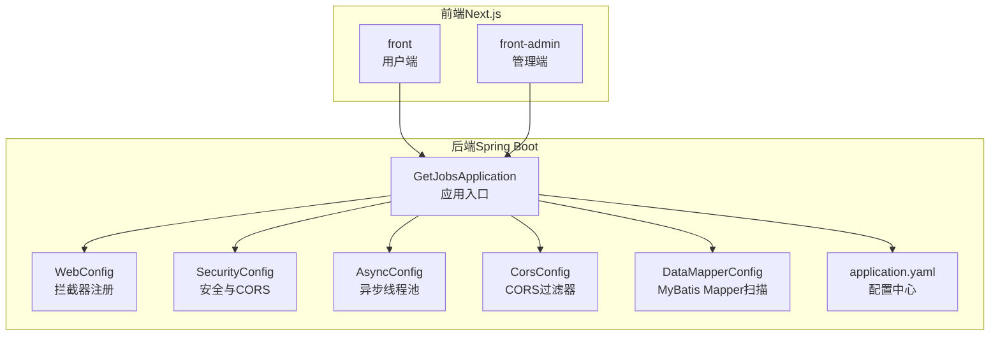
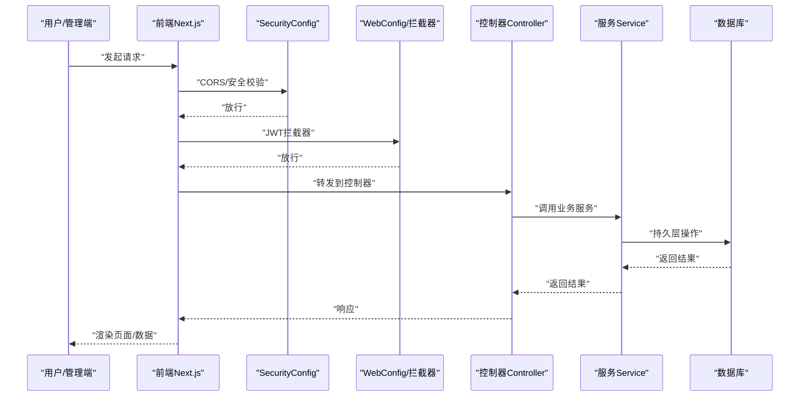
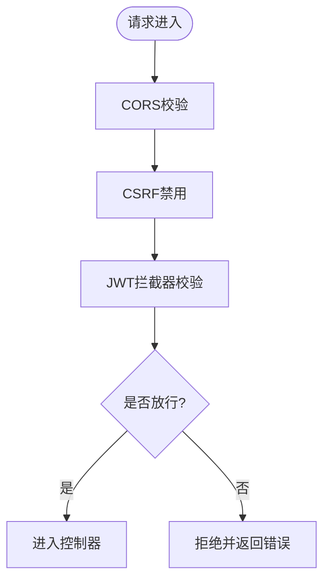
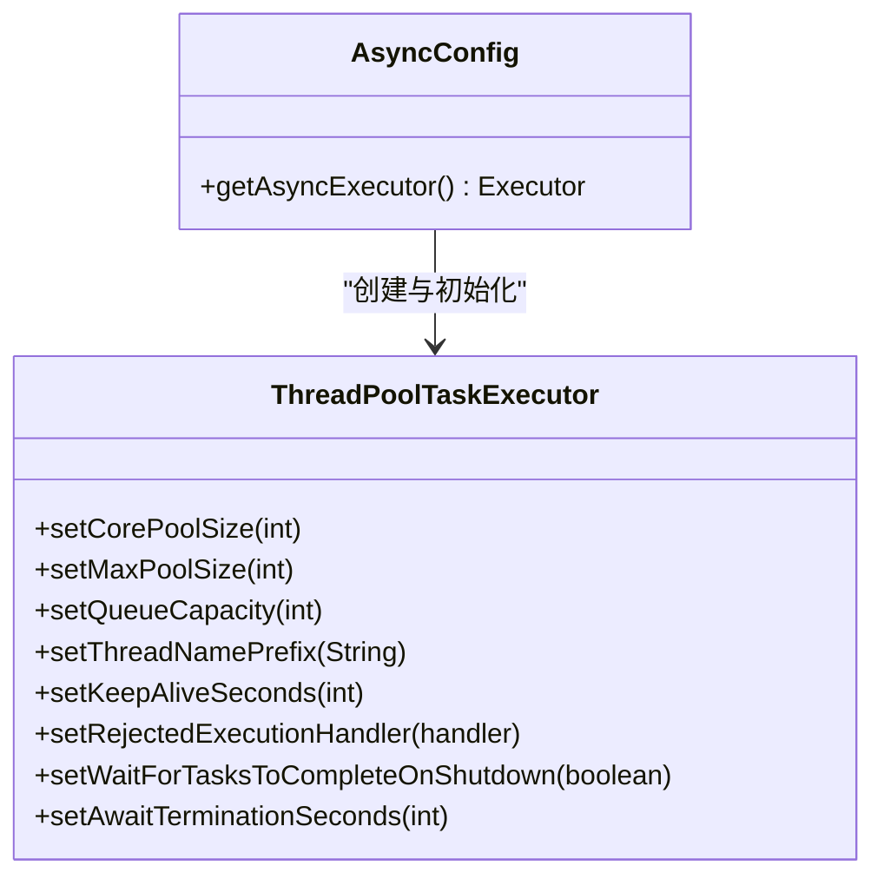
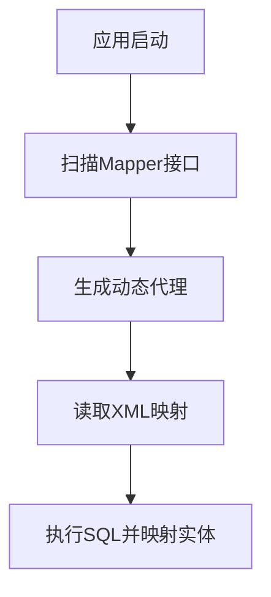
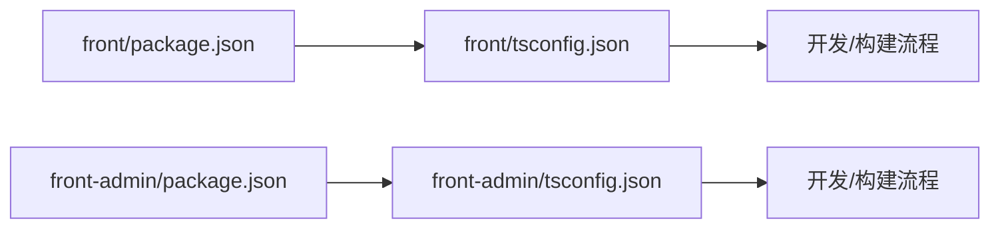
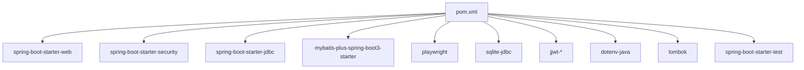

# 开发指南

<cite>
**本文引用的文件**
- [application.yaml](file://backend/src/main/resources/application.yaml)
- [pom.xml](file://backend/pom.xml)
- [GetJobsApplication.java](file://backend/src/main/java/com/getjobs/GetJobsApplication.java)
- [WebConfig.java](file://backend/src/main/java/com/getjobs/application/config/WebConfig.java)
- [SecurityConfig.java](file://backend/src/main/java/com/getjobs/application/config/SecurityConfig.java)
- [AsyncConfig.java](file://backend/src/main/java/com/getjobs/application/config/AsyncConfig.java)
- [CorsConfig.java](file://backend/src/main/java/com/getjobs/application/config/CorsConfig.java)
- [DataMapperConfig.java](file://backend/src/main/java/com/getjobs/application/config/DataMapperConfig.java)
- [package.json（前端）](file://front/package.json)
- [tsconfig.json（前端）](file://front/tsconfig.json)
- [package.json（前端管理）](file://front-admin/package.json)
- [tsconfig.json（前端管理）](file://front-admin/tsconfig.json)
- [README.md](file://README.md)
</cite>

## 目录
1. [简介](#简介)
2. [项目结构](#项目结构)
3. [核心组件](#核心组件)
4. [架构总览](#架构总览)
5. [详细组件分析](#详细组件分析)
6. [依赖分析](#依赖分析)
7. [性能考量](#性能考量)
8. [故障排查指南](#故障排查指南)
9. [结论](#结论)
10. [附录](#附录)

## 简介
本开发指南面向 GetJobs 项目的贡献者与核心开发者，系统阐述代码规范、命名约定、IDE 配置、调试技巧、测试策略、Git 工作流与分支管理、代码评审标准、新功能开发流程、性能优化与并发处理最佳实践，以及常见问题与调试技巧。文档以实际源码为依据，辅以可视化图示帮助快速理解与落地。

## 项目结构
GetJobs 采用前后端分离架构：
- 后端（Spring Boot 3 + Java 21）：负责业务逻辑、定时与异步任务、数据库访问、安全与跨域配置。
- 前端（Next.js 16 + React 19 + TypeScript）：用户界面与管理后台，分别位于 front 与 front-admin。
- 配置与构建：后端使用 Maven；前端使用 npm/pnpm 生态；脚本位于 scripts。

图表来源
- [GetJobsApplication.java:1-22](file://backend/src/main/java/com/getjobs/GetJobsApplication.java#L1-L22)
- [WebConfig.java:1-37](file://backend/src/main/java/com/getjobs/application/config/WebConfig.java#L1-L37)
- [SecurityConfig.java:1-68](file://backend/src/main/java/com/getjobs/application/config/SecurityConfig.java#L1-L68)
- [AsyncConfig.java:1-55](file://backend/src/main/java/com/getjobs/application/config/AsyncConfig.java#L1-L55)
- [CorsConfig.java:1-40](file://backend/src/main/java/com/getjobs/application/config/CorsConfig.java#L1-L40)
- [DataMapperConfig.java:1-14](file://backend/src/main/java/com/getjobs/application/config/DataMapperConfig.java#L1-L14)
- [application.yaml:1-91](file://backend/src/main/resources/application.yaml#L1-L91)

章节来源
- [GetJobsApplication.java:1-22](file://backend/src/main/java/com/getjobs/GetJobsApplication.java#L1-L22)
- [application.yaml:1-91](file://backend/src/main/resources/application.yaml#L1-L91)

## 核心组件
- 应用入口与开关
  - 启用调度与异步，便于定时任务与并发抓取。
- 安全与跨域
  - 禁用默认表单/CSRF，统一通过 JWT 过滤器与拦截器实现鉴权；CORS 在安全配置中集中管理。
- 数据访问
  - MyBatis-Plus Mapper 扫描路径固定，遵循包结构约定。
- 异步与并发
  - 自定义线程池，拒绝策略采用调用线程执行，保证任务不丢失。
- 前端工程
  - Next.js 16 + React 19 + TypeScript；管理端独立端口运行，用户端与管理端分别维护 tsconfig 与依赖。

章节来源
- [GetJobsApplication.java:15-18](file://backend/src/main/java/com/getjobs/GetJobsApplication.java#L15-L18)
- [SecurityConfig.java:25-44](file://backend/src/main/java/com/getjobs/application/config/SecurityConfig.java#L25-L44)
- [WebConfig.java:26-35](file://backend/src/main/java/com/getjobs/application/config/WebConfig.java#L26-L35)
- [DataMapperConfig.java:10-12](file://backend/src/main/java/com/getjobs/application/config/DataMapperConfig.java#L10-L12)
- [AsyncConfig.java:24-54](file://backend/src/main/java/com/getjobs/application/config/AsyncConfig.java#L24-L54)
- [package.json（前端）:1-43](file://front/package.json#L1-L43)
- [tsconfig.json（前端）:1-47](file://front/tsconfig.json#L1-L47)
- [package.json（前端管理）:1-41](file://front-admin/package.json#L1-L41)
- [tsconfig.json（前端管理）:1-42](file://front-admin/tsconfig.json#L1-L42)

## 架构总览
后端通过 Spring MVC 接收请求，经拦截器与安全链路校验后进入业务层；数据库访问通过 MyBatis-Plus；异步任务由自定义线程池执行；前端通过 Next.js 提供用户与管理界面，统一后端 API。

图表来源
- [SecurityConfig.java:25-44](file://backend/src/main/java/com/getjobs/application/config/SecurityConfig.java#L25-L44)
- [WebConfig.java:26-35](file://backend/src/main/java/com/getjobs/application/config/WebConfig.java#L26-L35)
- [application.yaml:28-43](file://backend/src/main/resources/application.yaml#L28-L43)

## 详细组件分析

### 安全与跨域配置
- 安全策略
  - 禁用表单登录、CSRF、HTTP Basic，统一使用 JWT 过滤器与拦截器。
  - CORS 在安全配置中集中管理，允许凭据与预检缓存。
- 拦截器
  - 对 /api/** 路径启用 JWT 校验，排除健康检查、登录、注册与监控端点。

图表来源
- [SecurityConfig.java:25-44](file://backend/src/main/java/com/getjobs/application/config/SecurityConfig.java#L25-L44)
- [WebConfig.java:26-35](file://backend/src/main/java/com/getjobs/application/config/WebConfig.java#L26-L35)

章节来源
- [SecurityConfig.java:1-68](file://backend/src/main/java/com/getjobs/application/config/SecurityConfig.java#L1-L68)
- [WebConfig.java:1-37](file://backend/src/main/java/com/getjobs/application/config/WebConfig.java#L1-L37)

### 异步与并发配置
- 线程池参数
  - 核心/最大线程、队列容量、空闲存活、拒绝策略、优雅停机。
- 适用场景
  - 并发抓取、定时任务、耗时计算等。

图表来源
- [AsyncConfig.java:24-54](file://backend/src/main/java/com/getjobs/application/config/AsyncConfig.java#L24-L54)

章节来源
- [AsyncConfig.java:1-55](file://backend/src/main/java/com/getjobs/application/config/AsyncConfig.java#L1-L55)

### 数据访问与映射
- Mapper 扫描
  - 固定扫描包路径，确保实体与映射文件一致。
- MyBatis-Plus 配置
  - 下划线转驼峰、ID 自动生成、Banner 开启、Mapper XML 位置。

图表来源
- [DataMapperConfig.java:10-12](file://backend/src/main/java/com/getjobs/application/config/DataMapperConfig.java#L10-L12)
- [application.yaml:44-52](file://backend/src/main/resources/application.yaml#L44-L52)

章节来源
- [DataMapperConfig.java:1-14](file://backend/src/main/java/com/getjobs/application/config/DataMapperConfig.java#L1-L14)
- [application.yaml:44-52](file://backend/src/main/resources/application.yaml#L44-L52)

### 前端工程与类型系统
- 工程脚本
  - 用户端与管理端分别提供 dev/build/start/lint 脚本。
- 类型与模块解析
  - TypeScript 严格模式、Bundler 解析、路径别名 @/*。

图表来源
- [package.json（前端）:5-11](file://front/package.json#L5-L11)
- [tsconfig.json（前端）:25-29](file://front/tsconfig.json#L25-L29)
- [package.json（前端管理）:5-9](file://front-admin/package.json#L5-L9)
- [tsconfig.json（前端管理）:25-29](file://front-admin/tsconfig.json#L25-L29)

章节来源
- [package.json（前端）:1-43](file://front/package.json#L1-L43)
- [tsconfig.json（前端）:1-47](file://front/tsconfig.json#L1-L47)
- [package.json（前端管理）:1-41](file://front-admin/package.json#L1-L41)
- [tsconfig.json（前端管理）:1-42](file://front-admin/tsconfig.json#L1-L42)

## 依赖分析
- 后端依赖
  - Spring Web/Spring Security/JDBC/MyBatis-Plus/Playwright/SQLite/JSON/Env 加载/JWT/测试框架等。
- 构建与插件
  - Spring Boot Maven 插件、编译插件、Surefire 插件，统一编码与 Lombok APT。

图表来源
- [pom.xml:43-188](file://backend/pom.xml#L43-L188)

章节来源
- [pom.xml:1-263](file://backend/pom.xml#L1-L263)

## 性能考量
- 线程池与异步
  - 合理设置核心/最大线程与队列容量，避免阻塞与资源争用；拒绝策略选择 CallerRuns 以保障关键任务不丢失。
- 数据库连接池
  - HikariCP 参数（最大池大小、空闲超时、最大生存时间）影响连接复用与资源回收。
- 日志与滚动
  - 控制台与文件输出格式、滚动策略，避免日志风暴影响性能。
- 前端构建
  - TypeScript 严格模式与 Bundler 解析提升类型安全与打包效率；按需引入与 Tree Shaking 减少体积。

章节来源
- [AsyncConfig.java:24-54](file://backend/src/main/java/com/getjobs/application/config/AsyncConfig.java#L24-L54)
- [application.yaml:18-22](file://backend/src/main/resources/application.yaml#L18-L22)
- [application.yaml:32-43](file://backend/src/main/resources/application.yaml#L32-L43)
- [tsconfig.json（前端）:11-19](file://front/tsconfig.json#L11-L19)

## 故障排查指南
- 启动与端口
  - 后端固定端口配置与健康检查端点，确认端口占用与防火墙。
- 数据库连接
  - 检查连接串、驱动、用户名密码与池参数；关注慢查询与连接泄漏。
- 跨域与鉴权
  - CORS 是否允许来源与凭据；拦截器排除列表是否覆盖登录/注册/健康端点。
- 异步任务
  - 线程池饱和与拒绝策略触发；核对任务队列长度与执行时间。
- 前端开发
  - 端口冲突（用户端/管理端）、TypeScript 类型错误、Next.js 构建异常。

章节来源
- [application.yaml:28-29](file://backend/src/main/resources/application.yaml#L28-L29)
- [application.yaml:13-17](file://backend/src/main/resources/application.yaml#L13-L17)
- [SecurityConfig.java:49-66](file://backend/src/main/java/com/getjobs/application/config/SecurityConfig.java#L49-L66)
- [WebConfig.java:26-35](file://backend/src/main/java/com/getjobs/application/config/WebConfig.java#L26-L35)
- [AsyncConfig.java:40-41](file://backend/src/main/java/com/getjobs/application/config/AsyncConfig.java#L40-L41)
- [package.json（前端）:6-9](file://front/package.json#L6-L9)
- [package.json（前端管理）:6-9](file://front-admin/package.json#L6-L9)

## 结论
本指南基于实际源码梳理了 GetJobs 的架构要点与开发规范，提供了从配置到测试、从性能到排错的系统化建议。建议在新功能开发中遵循统一的命名与目录约定，严格使用拦截器与安全配置，合理设计异步任务与线程池，并在前端工程中保持严格的类型约束与模块化组织。

## 附录

### 代码规范与命名约定
- 包与目录
  - 后端包名统一为 com.getjobs.*，按 application/controller/service/mapper/entity/filter/interceptor 等层次组织。
  - 前端按 pages/components/lib/hooks/types 等模块化组织。
- 类与接口
  - 类名使用帕斯卡命名；接口以 I 前缀或抽象类区分；常量全大写+下划线。
- 方法与变量
  - 私有字段以下划线开头；布尔方法以 is/has/can 前缀；方法语义明确、单一职责。
- 配置
  - application.yaml 中关键参数（端口、数据库、日志、MyBatis-Plus、JWT、Playwright）集中管理，避免散落硬编码。

章节来源
- [GetJobsApplication.java:1-22](file://backend/src/main/java/com/getjobs/GetJobsApplication.java#L1-L22)
- [application.yaml:1-91](file://backend/src/main/resources/application.yaml#L1-L91)

### IDE 配置与调试建议
- Java（后端）
  - 使用 Lombok 插件与编译器 APT；启用严格模式与弃用警告；断点调试控制器与服务层。
- TypeScript（前端）
  - 启用严格模式与路径别名；利用 Next.js HMR 快速迭代；控制台与网络面板定位问题。
- 调试端口
  - 用户端与管理端分别运行，避免端口冲突；后端固定端口便于统一联调。

章节来源
- [pom.xml:224-243](file://backend/pom.xml#L224-L243)
- [tsconfig.json（前端）:11-29](file://front/tsconfig.json#L11-L29)
- [tsconfig.json（前端管理）:11-29](file://front-admin/tsconfig.json#L11-L29)
- [application.yaml:28-29](file://backend/src/main/resources/application.yaml#L28-L29)

### 测试策略
- 单元测试
  - 使用 Spring Boot Test 与 JUnit 5；对 Service 层进行隔离测试，Mock DAO 或使用嵌入式数据库。
- 集成测试
  - 启动最小上下文，验证控制器与服务交互；使用 @AutoConfigureTestDatabase 与事务回滚。
- 端到端测试
  - 前端使用 Next.js Dev Server 与 Playwright（如涉及浏览器自动化）；确保环境变量与配置文件正确加载。

章节来源
- [pom.xml:174-187](file://backend/pom.xml#L174-L187)
- [application.yaml:80-91](file://backend/src/main/resources/application.yaml#L80-L91)

### Git 工作流与代码评审
- 分支策略
  - 从 main 新建个人分支，开发完成后提交 PR 至 loks666/get_jobs 的 dev 分支（非 main）。
- 提交信息
  - 使用 Emoji 前缀表达提交意图，保持清晰可追溯。
- 评审与合并
  - 评审通过后由维护者合并至 main；禁止未经沟通的 PR。

章节来源
- [README.md:187-196](file://README.md#L187-L196)

### 新功能开发流程（示例：新增控制器）
- 设计与规划
  - 在 issue/discussions 确认需求；评估对安全、拦截器、数据库的影响。
- 后端
  - 新增 Controller/Service/Entity/Mapper；在 WebConfig 中补充拦截器排除或新增过滤器；在 application.yaml 中按需新增配置。
- 前端
  - 新增页面与组件；使用 hooks 封装 API；在路由中注册页面。
- 测试
  - 补充单元/集成测试；必要时进行端到端验证。
- 提交与评审
  - 提交 PR 至 dev 分支，附带变更说明与截图。

章节来源
- [WebConfig.java:26-35](file://backend/src/main/java/com/getjobs/application/config/WebConfig.java#L26-L35)
- [application.yaml:54-91](file://backend/src/main/resources/application.yaml#L54-L91)
- [README.md:187-196](file://README.md#L187-L196)