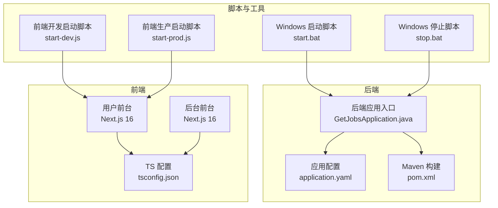
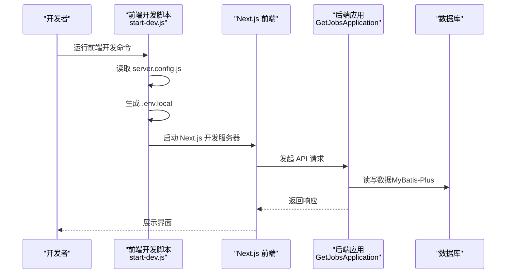
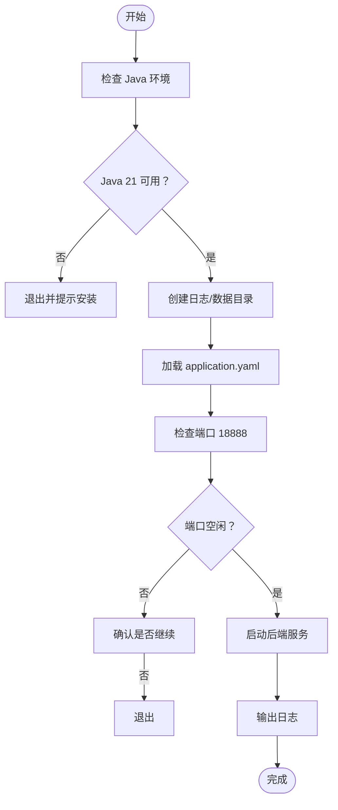
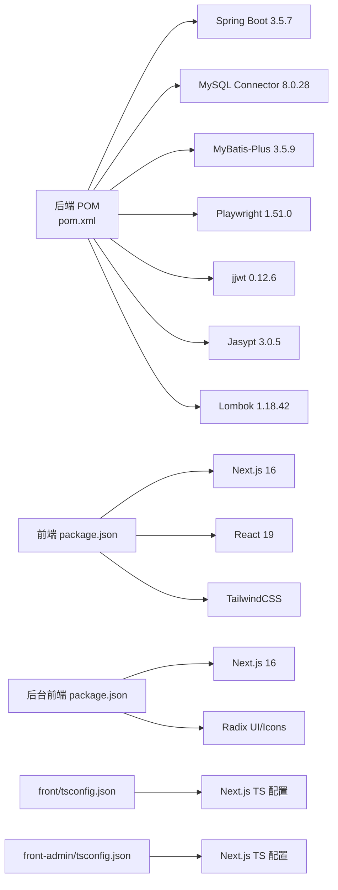

# 开发环境配置

<cite>
**本文引用的文件**
- [后端 POM 配置](file://backend/pom.xml)
- [前端包管理配置](file://front/package.json)
- [后台前端包管理配置](file://front-admin/package.json)
- [后端应用配置（生产）](file://backend/src/main/resources/application.yaml)
- [后端配置模板](file://scripts/application.yaml.template)
- [前端 TypeScript 配置](file://front/tsconfig.json)
- [后台前端 TypeScript 配置](file://front-admin/tsconfig.json)
- [Windows 启动脚本](file://scripts/windows/start.bat)
- [Windows 停止脚本](file://scripts/windows/stop.bat)
- [前端开发启动脚本](file://front/scripts/start-dev.js)
- [前端生产启动脚本](file://front/scripts/start-prod.js)
- [后台前端 Next 配置](file://front-admin/next.config.ts)
- [后端应用入口](file://backend/src/main/java/com/getjobs/GetJobsApplication.java)
</cite>

## 目录
1. [简介](#简介)
2. [项目结构](#项目结构)
3. [核心组件](#核心组件)
4. [架构总览](#架构总览)
5. [详细组件分析](#详细组件分析)
6. [依赖关系分析](#依赖关系分析)
7. [性能考虑](#性能考虑)
8. [故障排查指南](#故障排查指南)
9. [结论](#结论)
10. [附录](#附录)

## 简介
本指南面向 GetJobs 项目的开发者，提供从零搭建开发环境的完整流程，涵盖 JDK 21、Node.js、Maven 的安装与配置；IDE 推荐与项目导入；数据库本地部署与配置文件管理；Docker 环境准备与容器化部署思路；以及跨平台（Windows/macOS）开发注意事项与常见问题诊断。

## 项目结构
GetJobs 采用前后端分离架构：
- 后端基于 Spring Boot 3.5.7，使用 Java 21，通过 Maven 管理依赖与构建。
- 前端使用 Next.js 16（React 19），TypeScript 5，TailwindCSS，分别提供用户前台与后台管理前台。
- 配置文件采用 YAML，支持 Jasypt 加密与多环境 profile 切换。
- 提供 Windows 批处理脚本用于本地启动与停止后端服务。

**图表来源**
- [后端应用入口](file://backend/src/main/java/com/getjobs/GetJobsApplication.java)
- [后端应用配置（生产）](file://backend/src/main/resources/application.yaml)
- [后端 POM 配置](file://backend/pom.xml)
- [前端 TypeScript 配置](file://front/tsconfig.json)
- [后台前端 TypeScript 配置](file://front-admin/tsconfig.json)
- [Windows 启动脚本](file://scripts/windows/start.bat)
- [Windows 停止脚本](file://scripts/windows/stop.bat)
- [前端开发启动脚本](file://front/scripts/start-dev.js)
- [前端生产启动脚本](file://front/scripts/start-prod.js)

**章节来源**
- [后端 POM 配置](file://backend/pom.xml)
- [后端应用配置（生产）](file://backend/src/main/resources/application.yaml)
- [前端包管理配置](file://front/package.json)
- [后台前端包管理配置](file://front-admin/package.json)
- [前端 TypeScript 配置](file://front/tsconfig.json)
- [后台前端 TypeScript 配置](file://front-admin/tsconfig.json)
- [Windows 启动脚本](file://scripts/windows/start.bat)
- [Windows 停止脚本](file://scripts/windows/stop.bat)
- [前端开发启动脚本](file://front/scripts/start-dev.js)
- [前端生产启动脚本](file://front/scripts/start-prod.js)

## 核心组件
- JDK 21：后端 Java 版本要求，确保 Maven 编译与运行一致。
- Maven：后端依赖管理与构建工具，包含 Spring Boot 插件、编译插件、测试插件与 ProGuard 混淆插件。
- Node.js 与包管理器：前端 Next.js 16 与 pnpm/yarn/npm 的选择与版本要求。
- 数据库：MySQL 8（驱动版本见 POM），或 SQLite（用于代码生成与测试）。
- 配置体系：application.yaml（含 Jasypt 加密）、JVM 参数与环境变量、脚本注入的 .env.local。
- 跨平台脚本：Windows 批处理用于启动/停止后端服务。

**章节来源**
- [后端 POM 配置](file://backend/pom.xml)
- [后端应用配置（生产）](file://backend/src/main/resources/application.yaml)
- [前端包管理配置](file://front/package.json)
- [后台前端包管理配置](file://front-admin/package.json)
- [Windows 启动脚本](file://scripts/windows/start.bat)
- [Windows 停止脚本](file://scripts/windows/stop.bat)

## 架构总览
后端通过 Spring Boot 启动，监听固定端口；前端 Next.js 通过脚本生成 .env.local 并启动开发/生产模式；Windows 脚本负责后端服务的启动与日志输出。

**图表来源**
- [前端开发启动脚本](file://front/scripts/start-dev.js)
- [后端应用入口](file://backend/src/main/java/com/getjobs/GetJobsApplication.java)
- [后端应用配置（生产）](file://backend/src/main/resources/application.yaml)

## 详细组件分析

### JDK 21 与 Maven 安装配置
- JDK 21：后端 Java 版本要求，确保 Maven 编译目标与运行环境一致。
- Maven：Spring Boot 3.5.7 对应的父 POM，内置插件包括 spring-boot-maven-plugin、maven-compiler-plugin、maven-surefire-plugin、proguard-maven-plugin。
- Lombok 注解处理：通过 maven-compiler-plugin 的 annotationProcessorPaths 指定。
- 测试编码：Surefire 插件设置 UTF-8 输出，避免控制台乱码。

建议步骤
- 安装 JDK 21 并配置 JAVA_HOME。
- 安装 Maven，并验证 mvn -version。
- 在 IDE 中设置 Maven 项目，确保使用与 POM 一致的 JDK 21。

**章节来源**
- [后端 POM 配置](file://backend/pom.xml)

### Node.js 与前端工具链
- Node.js：前端 Next.js 16 需要 Node.js LTS 版本，建议使用与团队一致的版本。
- 包管理器：front 与 front-admin 分别维护 package.json，按需选择 pnpm/yarn/npm。
- TypeScript：前后端 TS 配置统一 target ES2017，moduleResolution 使用 bundler，严格模式开启。
- 脚本：前端提供 dev/build/start/lint 等脚本，Windows 启动脚本会检查 Java 环境并启动后端。

建议步骤
- 安装 Node.js 与包管理器。
- 在 front/front-admin 目录执行安装命令（如 pnpm install）。
- 验证 next dev 与 next start 能正常启动。

**章节来源**
- [前端包管理配置](file://front/package.json)
- [后台前端包管理配置](file://front-admin/package.json)
- [前端 TypeScript 配置](file://front/tsconfig.json)
- [后台前端 TypeScript 配置](file://front-admin/tsconfig.json)
- [Windows 启动脚本](file://scripts/windows/start.bat)

### IDE 设置与项目导入
- 后端：推荐 IntelliJ IDEA，导入 Maven 项目，确保 JDK 21 与 Maven Settings（如 settings.xml）正确。
- 前端：VS Code 或 WebStorm，启用 TypeScript 检查与 ESLint。
- 插件推荐：Lombok（IDEA）、ESLint、Prettier、TailwindCSS Intellisense、TypeScript Importer。
- 后端配置：启用注解处理（Lombok APT），确保编译器参数包含 -Xlint:deprecation。

**章节来源**
- [后端 POM 配置](file://backend/pom.xml)
- [后端应用入口](file://backend/src/main/java/com/getjobs/GetJobsApplication.java)

### 数据库本地部署与配置
- MySQL 8：POM 中声明 mysql-connector-java 8.0.28，后端 application.yaml 指向 MySQL 地址与凭据。
- Jasypt 加密：数据库密码采用 ENC(...) 格式，可通过环境变量 JASYPT_ENCRYPTOR_PASSWORD 或 JVM 参数覆盖。
- 本地开发：建议使用本地 MySQL 实例，或使用 SQLite（POM 中包含 sqlite-jdbc）进行开发测试。
- 初始化脚本：application.yaml.template 提供 sql.init.* 配置项，可按需启用 schema 初始化。

建议步骤
- 安装 MySQL 8，创建数据库与用户。
- 复制 application.yaml.template 为 application.yaml，填写本地数据库连接信息。
- 如使用加密密码，设置 JASYPT_ENCRYPTOR_PASSWORD 环境变量或 JVM 参数。

**章节来源**
- [后端 POM 配置](file://backend/pom.xml)
- [后端应用配置（生产）](file://backend/src/main/resources/application.yaml)
- [后端配置模板](file://scripts/application.yaml.template)

### 环境变量与配置文件管理
- 后端：application.yaml 支持 profiles.active=dev，Jasypt 密钥优先级：环境变量 > JVM 参数 > 配置文件默认值。
- 前端：start-dev.js 与 start-prod.js 会根据 server.config.js 生成 .env.local，包含 PORT/HOSTNAME/API_BASE_URL 等。
- Windows：start.bat 通过 --spring.config.additional-location=file:config/ 指定外部配置目录。

建议步骤
- 后端：在 config/ 目录放置 application.yaml，或通过环境变量/JVM 参数覆盖敏感配置。
- 前端：确保 server.config.js 正确，运行开发/生产脚本生成 .env.local。

**章节来源**
- [后端应用配置（生产）](file://backend/src/main/resources/application.yaml)
- [后端配置模板](file://scripts/application.yaml.template)
- [前端开发启动脚本](file://front/scripts/start-dev.js)
- [前端生产启动脚本](file://front/scripts/start-prod.js)
- [Windows 启动脚本](file://scripts/windows/start.bat)

### Docker 环境配置与容器化部署
- 容器化思路：后端可打包为可执行 JAR，结合 Dockerfile 拷贝 JAR 与配置，暴露端口 18888；前端可使用官方 Next.js 镜像或构建产物静态导出。
- 外部依赖：数据库建议使用独立容器（如 MySQL），通过环境变量或挂载卷配置。
- 健康检查：可在 Docker Compose 中添加后端健康检查，确保数据库可用后再启动后端。
- 注意：当前仓库未提供 Dockerfile/docker-compose.yml，需按上述思路自行编写。

**章节来源**
- [后端 POM 配置](file://backend/pom.xml)
- [后端应用配置（生产）](file://backend/src/main/resources/application.yaml)
- [后台前端 Next 配置](file://front-admin/next.config.ts)

### 本地服务启动方法
- 后端：Windows 使用 start.bat 自动检查 Java、创建目录、加载配置并启动；也可直接使用 java -jar 启动。
- 前端：运行 front 的 dev 脚本，或使用 start-dev.js 生成 .env.local 并启动 Next.js。
- 停止：Windows 使用 stop.bat 查找并终止占用 18888 端口的进程。

**图表来源**
- [Windows 启动脚本](file://scripts/windows/start.bat)
- [Windows 停止脚本](file://scripts/windows/stop.bat)

**章节来源**
- [Windows 启动脚本](file://scripts/windows/start.bat)
- [Windows 停止脚本](file://scripts/windows/stop.bat)

### 开发工具链配置与自动化任务
- 后端：Maven 插件链包含 spring-boot-maven-plugin、maven-compiler-plugin、maven-surefire-plugin、proguard-maven-plugin，支持构建信息生成、编译、测试与混淆。
- 前端：package.json 提供 dev/build/start/lint 等脚本，配合脚本 start-dev.js/start-prod.js 自动注入环境变量。
- 自动化：可通过 CI/CD 在流水线中复用这些脚本与插件。

**章节来源**
- [后端 POM 配置](file://backend/pom.xml)
- [前端包管理配置](file://front/package.json)
- [前端开发启动脚本](file://front/scripts/start-dev.js)
- [前端生产启动脚本](file://front/scripts/start-prod.js)

### 跨平台开发注意事项
- Windows：start.bat 已内置端口检查、日志输出与错误处理；注意控制台编码 chcp 65001。
- macOS/Linux：可参考 Windows 脚本逻辑，编写对应 Shell 脚本；确保 Java 21 与 Node.js 环境变量正确。
- 文件路径：统一使用正斜杠或 Node.js path 模块，避免 Windows 路径分隔符问题。
- 权限：脚本与日志目录需具备读写权限。

**章节来源**
- [Windows 启动脚本](file://scripts/windows/start.bat)
- [Windows 停止脚本](file://scripts/windows/stop.bat)

## 依赖关系分析

**图表来源**
- [后端 POM 配置](file://backend/pom.xml)
- [前端包管理配置](file://front/package.json)
- [后台前端包管理配置](file://front-admin/package.json)
- [前端 TypeScript 配置](file://front/tsconfig.json)
- [后台前端 TypeScript 配置](file://front-admin/tsconfig.json)

**章节来源**
- [后端 POM 配置](file://backend/pom.xml)
- [前端包管理配置](file://front/package.json)
- [后台前端包管理配置](file://front-admin/package.json)
- [前端 TypeScript 配置](file://front/tsconfig.json)
- [后台前端 TypeScript 配置](file://front-admin/tsconfig.json)

## 性能考虑
- 连接池：HikariCP 最大连接数与生命周期参数已在配置中设定，可根据并发量调整。
- 导航超时：Playwright 平台差异化超时与重试策略已配置，避免频繁失败导致资源浪费。
- 日志轮转：logback 滚动策略限制单文件大小与历史天数，降低磁盘占用。
- 构建优化：Maven 编译启用 -Xlint:deprecation，减少废弃 API 使用；ProGuard 插件用于发布包混淆。

**章节来源**
- [后端应用配置（生产）](file://backend/src/main/resources/application.yaml)
- [后端 POM 配置](file://backend/pom.xml)

## 故障排查指南
- 启动失败（端口占用）
  - 现象：Windows 启动脚本报错端口 18888 已被占用。
  - 处理：使用 stop.bat 停止进程，或修改 application.yaml 中 server.port。
- Java 版本不匹配
  - 现象：Maven 编译报错或运行时报错。
  - 处理：确保 JAVA_HOME 指向 JDK 21，IDE 与 Maven 使用相同版本。
- 数据库连接失败
  - 现象：应用启动时报数据库连接异常。
  - 处理：核对 application.yaml 中的 url/username/password，确认数据库可达；如使用加密密码，确保 JASYPT_ENCRYPTOR_PASSWORD 设置正确。
- 控制台乱码
  - 现象：测试输出或日志出现乱码。
  - 处理：确认 Maven Surefire 插件已设置 UTF-8 输出参数。
- 前端无法访问后端
  - 现象：浏览器控制台报跨域或 404。
  - 处理：确认 .env.local 中 API_BASE_URL 指向正确的后端地址与端口；后端 CORS 已在配置中启用。

**章节来源**
- [Windows 启动脚本](file://scripts/windows/start.bat)
- [Windows 停止脚本](file://scripts/windows/stop.bat)
- [后端应用配置（生产）](file://backend/src/main/resources/application.yaml)
- [后端 POM 配置](file://backend/pom.xml)
- [前端开发启动脚本](file://front/scripts/start-dev.js)
- [前端生产启动脚本](file://front/scripts/start-prod.js)

## 结论
通过本指南，您可以在本地快速搭建 GetJobs 的开发环境：安装并配置 JDK 21、Node.js 与 Maven；导入项目并设置 IDE；部署本地数据库并管理配置文件；使用 Windows 脚本启动后端服务；理解前后端工具链与自动化任务；并掌握跨平台开发与常见问题的诊断方法。建议在团队内统一工具链版本与配置规范，确保开发一致性与可重复性。

## 附录

### 快速检查清单
- JDK 21 已安装且 JAVA_HOME 正确。
- Maven 已安装，版本与 POM 兼容。
- Node.js 与包管理器已安装，依赖已安装。
- MySQL 已部署，application.yaml 配置正确。
- Jasypt 密钥已设置（环境变量或 JVM 参数）。
- Windows 启动脚本可正常运行，端口未被占用。
- 前端 .env.local 已生成，API_BASE_URL 指向正确地址。