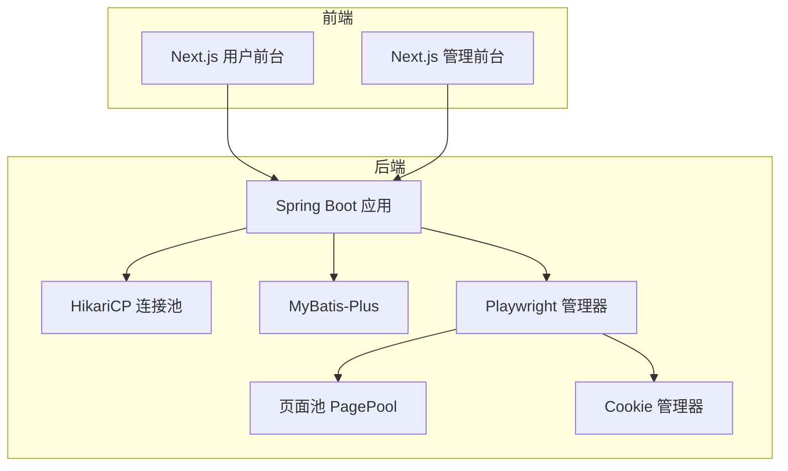
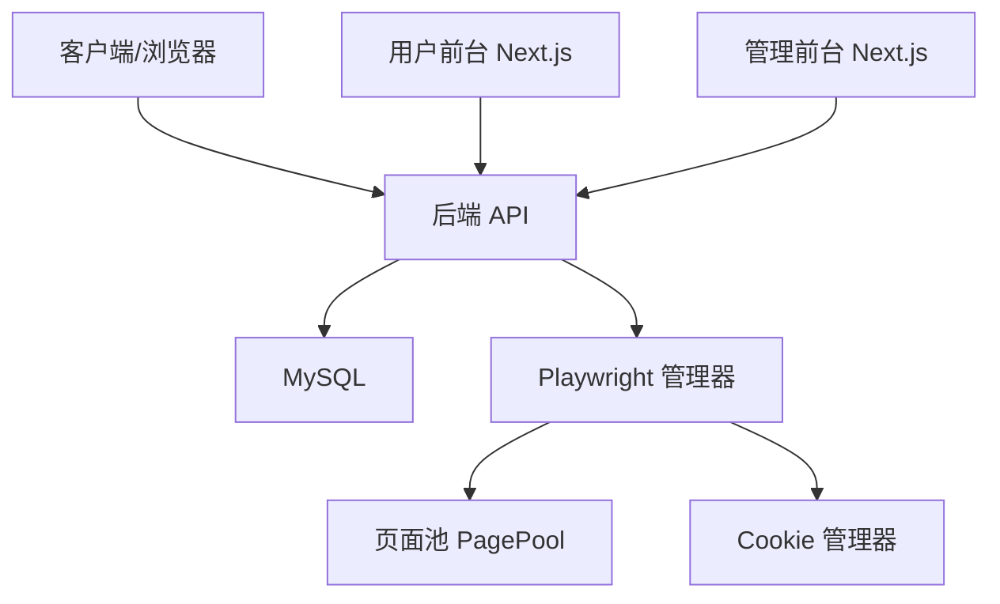
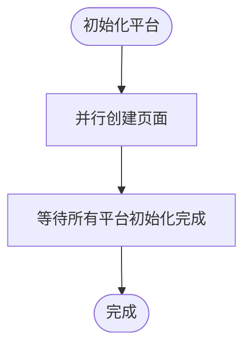
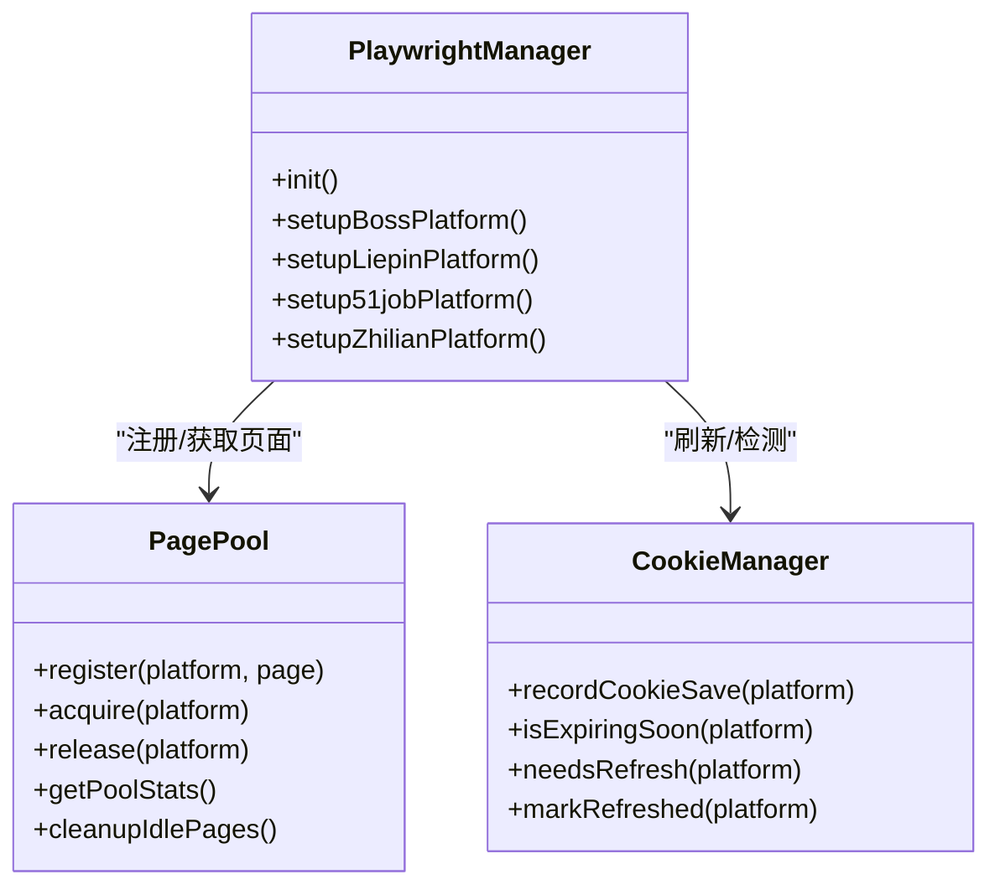
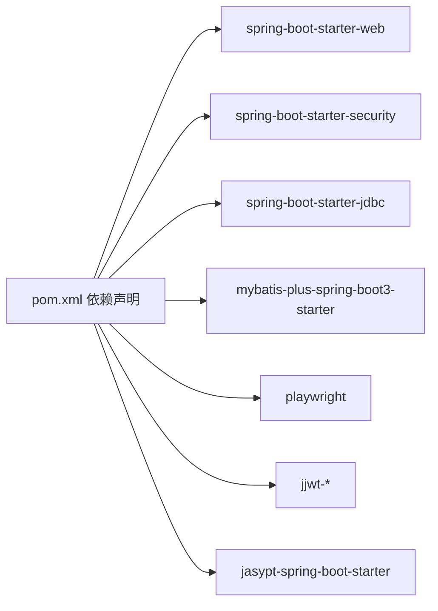

# 性能优化

<cite>
**本文引用的文件**
- [application.yaml](file://backend/src/main/resources/application.yaml)
- [AsyncConfig.java](file://backend/src/main/java/com/getjobs/application/config/AsyncConfig.java)
- [PlaywrightManager.java](file://backend/src/main/java/com/getjobs/worker/manager/PlaywrightManager.java)
- [PagePool.java](file://backend/src/main/java/com/getjobs/worker/utils/PagePool.java)
- [CookieManager.java](file://backend/src/main/java/com/getjobs/worker/utils/CookieManager.java)
- [pom.xml](file://backend/pom.xml)
- [next.config.ts（前台）](file://front/next.config.ts)
- [next.config.ts（前台管理端）](file://front-admin/next.config.ts)
- [WebConfig.java](file://backend/src/main/java/com/getjobs/application/config/WebConfig.java)
- [CorsConfig.java](file://backend/src/main/java/com/getjobs/application/config/CorsConfig.java)
- [DataMapperConfig.java](file://backend/src/main/java/com/getjobs/application/config/DataMapperConfig.java)
</cite>

## 目录
1. [简介](#简介)
2. [项目结构](#项目结构)
3. [核心组件](#核心组件)
4. [架构总览](#架构总览)
5. [详细组件分析](#详细组件分析)
6. [依赖分析](#依赖分析)
7. [性能考量](#性能考量)
8. [故障排查指南](#故障排查指南)
9. [结论](#结论)
10. [附录](#附录)

## 简介
本指南面向 GetJobs 项目的性能优化，覆盖后端 Spring Boot 的线程池与连接池配置、数据库查询与索引优化、前端构建与运行时性能、以及浏览器自动化（Playwright）实例与页面池化的资源管理策略。文档同时提供并发处理、异步任务管理、监控指标与基准测试建议，帮助在开发与生产环境中稳定提升整体吞吐与响应质量。

## 项目结构
- 后端采用 Spring Boot 3 + MyBatis-Plus，使用 HikariCP 作为数据库连接池，并通过配置文件集中管理数据库、日志、MyBatis-Plus 与 Playwright 的性能相关参数。
- 前端使用 Next.js，分别针对用户前台与管理前台进行静态导出配置，禁用图片优化以适配静态部署场景。
- 浏览器自动化模块通过 PlaywrightManager 统一管理浏览器实例、上下文与页面池，结合 CookieManager 实现 Cookie 生命周期与刷新策略。

**图表来源**
- [application.yaml:13-27](file://backend/src/main/resources/application.yaml#L13-L27)
- [PlaywrightManager.java:60-61](file://backend/src/main/java/com/getjobs/worker/manager/PlaywrightManager.java#L60-L61)
- [PagePool.java:25-50](file://backend/src/main/java/com/getjobs/worker/utils/PagePool.java#L25-L50)
- [CookieManager.java:31-55](file://backend/src/main/java/com/getjobs/worker/utils/CookieManager.java#L31-L55)
- [next.config.ts（前台）:6-20](file://front/next.config.ts#L6-L20)
- [next.config.ts（前台管理端）:3-9](file://front-admin/next.config.ts#L3-L9)

**章节来源**
- [application.yaml:13-27](file://backend/src/main/resources/application.yaml#L13-L27)
- [next.config.ts（前台）:6-20](file://front/next.config.ts#L6-L20)
- [next.config.ts（前台管理端）:3-9](file://front-admin/next.config.ts#L3-L9)

## 核心组件
- 数据库连接池与日志：HikariCP 最大池大小、空闲超时、生命周期、SQL 映射驼峰转换、日志滚动策略等。
- 异步任务线程池：核心线程、最大线程、队列容量、拒绝策略、优雅停机等待时间。
- Playwright 自动化：浏览器启动参数、慢动作模拟、导航超时、资源拦截、页面池大小与空闲回收阈值、Cookie 刷新策略。
- 前端构建：静态导出、禁用图片优化、环境变量透传。

**章节来源**
- [application.yaml:13-27](file://backend/src/main/resources/application.yaml#L13-L27)
- [AsyncConfig.java:24-54](file://backend/src/main/java/com/getjobs/application/config/AsyncConfig.java#L24-L54)
- [PlaywrightManager.java:93-106](file://backend/src/main/java/com/getjobs/worker/manager/PlaywrightManager.java#L93-L106)
- [PagePool.java:46-50](file://backend/src/main/java/com/getjobs/worker/utils/PagePool.java#L46-L50)
- [CookieManager.java:54-55](file://backend/src/main/java/com/getjobs/worker/utils/CookieManager.java#L54-L55)
- [next.config.ts（前台）:6-20](file://front/next.config.ts#L6-L20)

## 架构总览
后端服务通过 HikariCP 连接数据库，MyBatis-Plus 提供 ORM 能力；浏览器自动化由 PlaywrightManager 统一管理，页面池与 Cookie 管理器协同工作；前端通过静态导出部署，减少运行时计算开销。

**图表来源**
- [application.yaml:13-27](file://backend/src/main/resources/application.yaml#L13-L27)
- [PlaywrightManager.java:60-61](file://backend/src/main/java/com/getjobs/worker/manager/PlaywrightManager.java#L60-L61)
- [PagePool.java:25-50](file://backend/src/main/java/com/getjobs/worker/utils/PagePool.java#L25-L50)
- [CookieManager.java:31-55](file://backend/src/main/java/com/getjobs/worker/utils/CookieManager.java#L31-L55)
- [next.config.ts（前台）:6-20](file://front/next.config.ts#L6-L20)
- [next.config.ts（前台管理端）:3-9](file://front-admin/next.config.ts#L3-L9)

## 详细组件分析

### 数据库连接池与查询优化
- 连接池配置要点
  - 最大池大小：限制并发连接上限，避免数据库压力过大。
  - 空闲超时与最大生存时间：控制连接生命周期，防止长时间占用资源。
  - SQL 映射：开启下划线到驼峰命名映射，减少字段映射成本。
  - 日志：合理设置滚动策略，避免磁盘 IO 抖动。
- 查询优化与索引设计
  - 使用 MyBatis-Plus 的分页与条件构造器，避免一次性加载全表数据。
  - 对高频查询字段建立合适索引，复合索引遵循最左前缀原则。
  - 慢查询分析：开启慢查询日志，定位执行时间长的 SQL，结合 EXPLAIN 分析执行计划。
- 事务与锁
  - 合理设置事务隔离级别，避免长事务持有行锁。
  - 使用乐观锁或版本号字段，减少悲观锁竞争。

**章节来源**
- [application.yaml:13-27](file://backend/src/main/resources/application.yaml#L13-L27)
- [DataMapperConfig.java:10-13](file://backend/src/main/java/com/getjobs/application/config/DataMapperConfig.java#L10-L13)

### 异步任务与并发处理
- 线程池配置
  - 核心线程与最大线程：根据 CPU 核心数与任务类型（IO 密集型）设定。
  - 队列容量：平衡内存占用与任务积压风险。
  - 拒绝策略：CallerRunsPolicy 使调用线程执行任务，避免丢弃。
  - 优雅停机：等待任务完成后再关闭线程池。
- 并发策略
  - 使用 CompletableFuture 并行初始化平台页面，缩短冷启动时间。
  - 通过页面池与 Cookie 管理器减少重复创建与登录成本。

**图表来源**
- [PlaywrightManager.java:194-200](file://backend/src/main/java/com/getjobs/worker/manager/PlaywrightManager.java#L194-L200)

**章节来源**
- [AsyncConfig.java:24-54](file://backend/src/main/java/com/getjobs/application/config/AsyncConfig.java#L24-L54)
- [PlaywrightManager.java:194-200](file://backend/src/main/java/com/getjobs/worker/manager/PlaywrightManager.java#L194-L200)

### Playwright 浏览器实例与页面池化
- 实例与上下文
  - 非无头模式便于调试，固定远程调试端口，慢动作参数可调，启动超时与参数优化内存与稳定性。
  - 共享 BrowserContext 与多标签页，减少浏览器实例数量。
- 页面池化
  - 固定最大页面数与空闲回收阈值，记录访问次数、空闲时间与生命周期，便于观察资源使用。
  - 仅标记空闲不销毁，为后续阶段回收做准备。
- 资源拦截
  - 可选启用资源拦截，降低网络与内存占用，适合高并发场景。
- Cookie 生命周期
  - 基于预期有效期与过期前刷新阈值，动态判断是否需要刷新，避免频繁登录。

**图表来源**
- [PlaywrightManager.java:60-61](file://backend/src/main/java/com/getjobs/worker/manager/PlaywrightManager.java#L60-L61)
- [PagePool.java:58-85](file://backend/src/main/java/com/getjobs/worker/utils/PagePool.java#L58-L85)
- [CookieManager.java:62-66](file://backend/src/main/java/com/getjobs/worker/utils/CookieManager.java#L62-L66)

**章节来源**
- [PlaywrightManager.java:114-221](file://backend/src/main/java/com/getjobs/worker/manager/PlaywrightManager.java#L114-L221)
- [PagePool.java:46-134](file://backend/src/main/java/com/getjobs/worker/utils/PagePool.java#L46-L134)
- [CookieManager.java:54-55](file://backend/src/main/java/com/getjobs/worker/utils/CookieManager.java#L54-L55)

### 前端性能优化（Next.js）
- 静态导出与图片优化
  - 用户前台与管理前台均采用静态导出，禁用图片优化以适配静态部署。
  - 通过环境变量向客户端暴露 API 基础地址与应用元信息，减少运行时拼装成本。
- 构建与运行
  - 静态导出减少 SSR/ISR 的运行时开销，适合低频交互页面。
  - 如需进一步优化，可在生产环境启用压缩与缓存策略。

**章节来源**
- [next.config.ts（前台）:6-20](file://front/next.config.ts#L6-L20)
- [next.config.ts（前台管理端）:3-9](file://front-admin/next.config.ts#L3-L9)

### 安全与跨域配置
- CORS：允许任意来源、头与方法，并允许携带凭证，预检有效期为 1 小时。
- Web MVC：注册 JWT 认证拦截器，保护 /api/** 路由，排除健康检查与登录注册等公开端点。

**章节来源**
- [CorsConfig.java:15-38](file://backend/src/main/java/com/getjobs/application/config/CorsConfig.java#L15-L38)
- [WebConfig.java:26-35](file://backend/src/main/java/com/getjobs/application/config/WebConfig.java#L26-L35)

## 依赖分析
- 后端依赖
  - Spring Boot Web、Security、JDBC、MyBatis-Plus、Playwright、JJWT、Jasypt 等。
  - Maven 插件包括 Spring Boot、Compiler、Surefire、ProGuard 等，用于打包与混淆。
- 前端依赖
  - Next.js、Tailwind CSS、TypeScript 等，构建静态站点。

**图表来源**
- [pom.xml:42-177](file://backend/pom.xml#L42-L177)

**章节来源**
- [pom.xml:42-177](file://backend/pom.xml#L42-L177)

## 性能考量
- 数据库
  - 连接池参数应与数据库最大连接数匹配，避免排队与超时。
  - 查询层面使用分页、索引与 EXPLAIN 分析，避免 N+1 查询与全表扫描。
- 浏览器自动化
  - 合理设置慢动作与导航超时，避免过慢导致任务堆积。
  - 启用资源拦截与页面池化，降低内存与 CPU 占用。
  - Cookie 刷新阈值应基于平台有效期经验设置，避免频繁登录。
- 前端
  - 静态导出减少运行时渲染，结合缓存与 CDN 提升首屏与二次访问性能。
- 并发与异步
  - 线程池参数与任务类型匹配，避免队列过长或频繁拒绝。
  - 使用并行初始化与页面池复用，缩短关键路径耗时。

[本节为通用指导，不直接分析具体文件]

## 故障排查指南
- 数据库连接池
  - 观察连接池指标（活跃、空闲、等待、超时），如出现大量等待，考虑增大最大池大小或优化慢查询。
- Playwright
  - 若页面初始化失败，检查导航超时与资源拦截配置；确认 Chromium 路径与权限。
  - 页面池统计可用于定位空闲回收时机与访问频率异常。
- Cookie 刷新
  - 若频繁触发刷新，检查刷新阈值与平台有效期配置；核对保存时间戳与过期判断逻辑。
- 前端
  - 静态导出后图片未优化属预期行为；如需优化可回退到 SSR 或启用外部图片优化服务。
- 安全与跨域
  - CORS 允许任意来源在开发环境可行，生产环境建议收窄来源白名单。

**章节来源**
- [application.yaml:13-27](file://backend/src/main/resources/application.yaml#L13-L27)
- [PlaywrightManager.java:128-136](file://backend/src/main/java/com/getjobs/worker/manager/PlaywrightManager.java#L128-L136)
- [PagePool.java:116-134](file://backend/src/main/java/com/getjobs/worker/utils/PagePool.java#L116-L134)
- [CookieManager.java:175-197](file://backend/src/main/java/com/getjobs/worker/utils/CookieManager.java#L175-L197)
- [next.config.ts（前台）:6-20](file://front/next.config.ts#L6-L20)

## 结论
通过合理的数据库连接池与查询优化、浏览器自动化资源池化与 Cookie 生命周期管理、以及前端静态导出策略，GetJobs 项目可以在保证稳定性的同时显著提升性能。建议在生产环境持续监控连接池与页面池指标、慢查询与 Cookie 刷新命中率，并根据业务峰值动态调整线程池与页面池规模。

[本节为总结性内容，不直接分析具体文件]

## 附录
- 监控指标建议
  - 数据库：活跃连接数、等待时间、连接创建/销毁速率、慢查询数量。
  - 浏览器：页面池活跃数、空闲回收数、Cookie 刷新触发次数、导航超时次数。
  - 应用：线程池队列长度、拒绝次数、GC 次数与停顿时间、请求延迟分布。
- 基准测试与瓶颈识别
  - 使用 JMeter/Artillery 对关键 API 进行并发压测，结合 APM 工具定位瓶颈。
  - 对页面池与 Cookie 刷新策略进行 A/B 对比，评估不同阈值对成功率与资源消耗的影响。
- 告警配置
  - 连接池等待时间超阈值、页面池回收异常、Cookie 刷新失败率上升、慢查询占比超限、GC 停顿时间异常等。

[本节为通用指导，不直接分析具体文件]