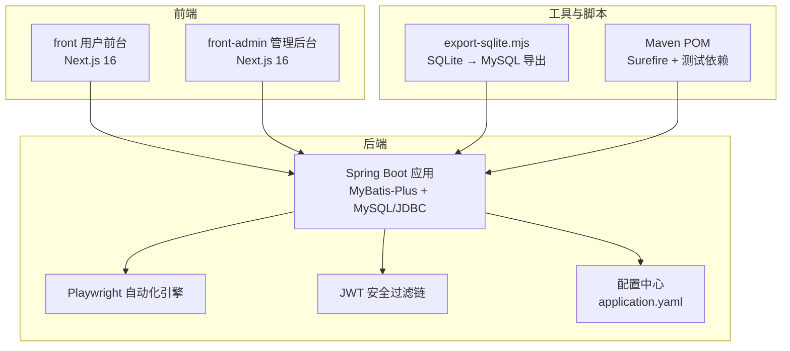
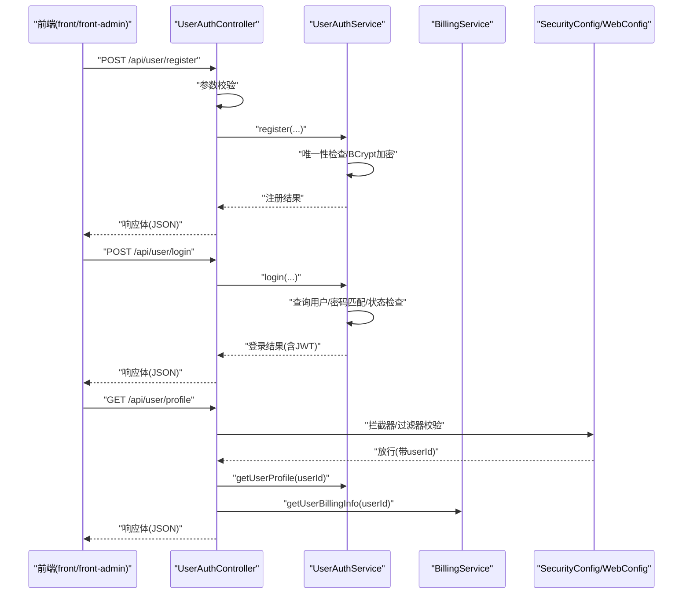
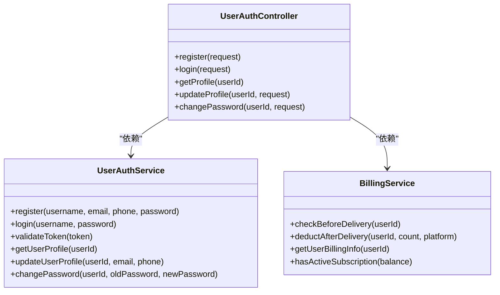
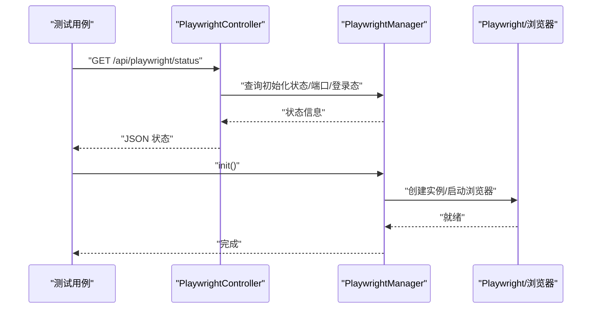
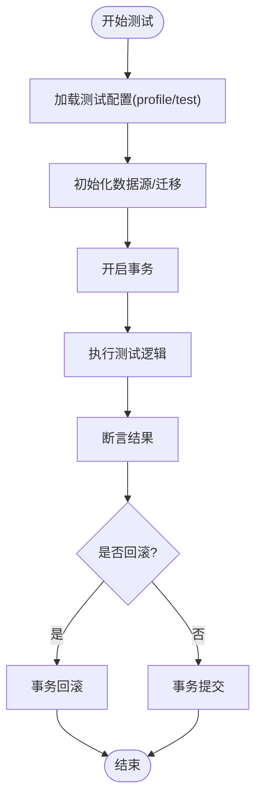
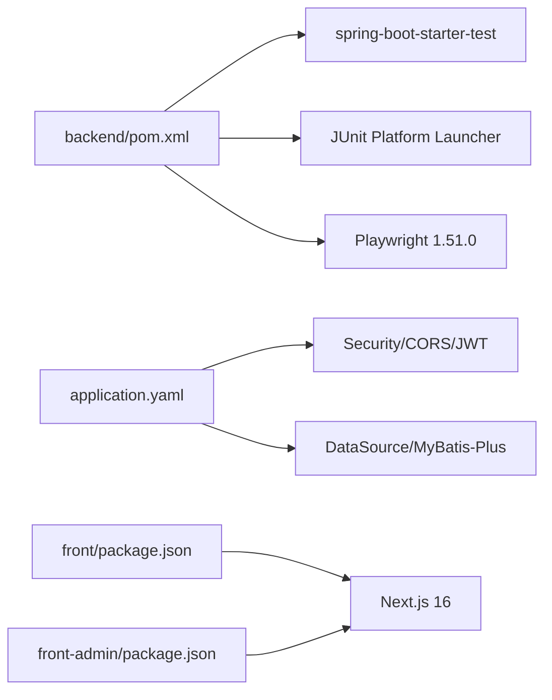

# 测试策略

<cite>
**本文引用的文件**
- [backend/pom.xml](file://backend/pom.xml)
- [backend/src/main/resources/application.yaml](file://backend/src/main/resources/application.yaml)
- [backend/src/main/java/com/getjobs/application/config/SecurityConfig.java](file://backend/src/main/java/com/getjobs/application/config/SecurityConfig.java)
- [backend/src/main/java/com/getjobs/application/config/WebConfig.java](file://backend/src/main/java/com/getjobs/application/config/WebConfig.java)
- [backend/src/main/java/com/getjobs/application/controller/UserAuthController.java](file://backend/src/main/java/com/getjobs/application/controller/UserAuthController.java)
- [backend/src/main/java/com/getjobs/application/service/UserAuthService.java](file://backend/src/main/java/com/getjobs/application/service/UserAuthService.java)
- [backend/src/main/java/com/getjobs/application/service/BillingService.java](file://backend/src/main/java/com/getjobs/application/service/BillingService.java)
- [backend/src/main/java/com/getjobs/application/controller/PlaywrightController.java](file://backend/src/main/java/com/getjobs/application/controller/PlaywrightController.java)
- [backend/src/main/java/com/getjobs/worker/manager/PlaywrightManager.java](file://backend/src/main/java/com/getjobs/worker/manager/PlaywrightManager.java)
- [backend/src/main/java/com/getjobs/application/config/StartupRunner.java](file://backend/src/main/java/com/getjobs/application/config/StartupRunner.java)
- [backend/proguard.conf](file://backend/proguard.conf)
- [front/package.json](file://front/package.json)
- [front-admin/package.json](file://front-admin/package.json)
- [front/scripts/export-sqlite.mjs](file://front/scripts/export-sqlite.mjs)
</cite>

## 目录
1. [引言](#引言)
2. [项目结构](#项目结构)
3. [核心组件](#核心组件)
4. [架构总览](#架构总览)
5. [详细组件分析](#详细组件分析)
6. [依赖分析](#依赖分析)
7. [性能考虑](#性能考虑)
8. [故障排查指南](#故障排查指南)
9. [结论](#结论)
10. [附录](#附录)

## 引言
本测试策略文档面向 GetJobs 项目的全栈测试工作，覆盖后端 Spring Boot 单元测试与集成测试、前端 Next.js 组件与接口测试、Playwright 端到端自动化测试、数据库测试与事务回滚策略、以及持续集成中的测试执行流程与覆盖率要求。文档同时提供测试用例设计模式与调试技巧，帮助团队建立稳定、可维护、可扩展的测试体系。

## 项目结构
GetJobs 采用前后端分离架构：
- 后端基于 Spring Boot 3，使用 MyBatis-Plus、MySQL/JDBC、Playwright、Jasypt 加密、JWT 安全配置等。
- 前端包含两个应用：用户前台 front 与后台管理 front-admin，均基于 Next.js 16。
- 工程通过 Maven 管理后端依赖与构建，前端通过 npm/pnpm 管理依赖与脚本。

图示来源
- [backend/src/main/resources/application.yaml:1-101](file://backend/src/main/resources/application.yaml#L1-L101)
- [backend/src/main/java/com/getjobs/application/config/SecurityConfig.java:1-68](file://backend/src/main/java/com/getjobs/application/config/SecurityConfig.java#L1-L68)
- [backend/src/main/java/com/getjobs/application/config/WebConfig.java:1-37](file://backend/src/main/java/com/getjobs/application/config/WebConfig.java#L1-L37)
- [backend/pom.xml:1-309](file://backend/pom.xml#L1-L309)
- [front/package.json:1-48](file://front/package.json#L1-L48)
- [front-admin/package.json:1-41](file://front-admin/package.json#L1-L41)
- [front/scripts/export-sqlite.mjs:1-133](file://front/scripts/export-sqlite.mjs#L1-L133)

章节来源
- [backend/pom.xml:1-309](file://backend/pom.xml#L1-L309)
- [backend/src/main/resources/application.yaml:1-101](file://backend/src/main/resources/application.yaml#L1-L101)
- [front/package.json:1-48](file://front/package.json#L1-L48)
- [front-admin/package.json:1-41](file://front-admin/package.json#L1-L41)

## 核心组件
- 控制器层：如用户认证控制器，负责接收请求、参数校验、调用服务层并返回响应。
- 服务层：如用户认证服务、计费服务，封装业务逻辑、事务控制、JWT 生成与校验、余额与订阅检查。
- 配置层：Spring Security 与 Web MVC 配置，统一 CORS、拦截器与安全策略。
- 自动化引擎：Playwright 管理器与控制器，提供浏览器实例、页面状态查询与调试能力。
- 数据层：MyBatis-Plus Mapper 与实体，配合 JDBC/MySQL 存储。

章节来源
- [backend/src/main/java/com/getjobs/application/controller/UserAuthController.java:1-167](file://backend/src/main/java/com/getjobs/application/controller/UserAuthController.java#L1-L167)
- [backend/src/main/java/com/getjobs/application/service/UserAuthService.java:1-311](file://backend/src/main/java/com/getjobs/application/service/UserAuthService.java#L1-L311)
- [backend/src/main/java/com/getjobs/application/service/BillingService.java:1-170](file://backend/src/main/java/com/getjobs/application/service/BillingService.java#L1-L170)
- [backend/src/main/java/com/getjobs/application/config/SecurityConfig.java:1-68](file://backend/src/main/java/com/getjobs/application/config/SecurityConfig.java#L1-L68)
- [backend/src/main/java/com/getjobs/application/config/WebConfig.java:1-37](file://backend/src/main/java/com/getjobs/application/config/WebConfig.java#L1-L37)
- [backend/src/main/java/com/getjobs/application/controller/PlaywrightController.java:1-39](file://backend/src/main/java/com/getjobs/application/controller/PlaywrightController.java#L1-L39)
- [backend/src/main/java/com/getjobs/worker/manager/PlaywrightManager.java:111-150](file://backend/src/main/java/com/getjobs/worker/manager/PlaywrightManager.java#L111-L150)

## 架构总览
后端通过 Spring MVC 对外提供 REST API，前端通过 Next.js 发起请求。安全层通过自定义拦截器与 JWT 过滤链实现统一鉴权。Playwright 作为自动化引擎，可在后端内部初始化并对外暴露状态查询接口，便于测试与调试。

图示来源
- [backend/src/main/java/com/getjobs/application/controller/UserAuthController.java:1-167](file://backend/src/main/java/com/getjobs/application/controller/UserAuthController.java#L1-L167)
- [backend/src/main/java/com/getjobs/application/service/UserAuthService.java:1-311](file://backend/src/main/java/com/getjobs/application/service/UserAuthService.java#L1-L311)
- [backend/src/main/java/com/getjobs/application/service/BillingService.java:1-170](file://backend/src/main/java/com/getjobs/application/service/BillingService.java#L1-L170)
- [backend/src/main/java/com/getjobs/application/config/SecurityConfig.java:1-68](file://backend/src/main/java/com/getjobs/application/config/SecurityConfig.java#L1-L68)
- [backend/src/main/java/com/getjobs/application/config/WebConfig.java:1-37](file://backend/src/main/java/com/getjobs/application/config/WebConfig.java#L1-L37)

## 详细组件分析

### 用户认证控制器与服务测试策略
- 单元测试要点
  - 使用 Spring Boot Test 与 JUnit 5，结合 @WebMvcTest 或 @Import(WebConfig.class) 加载控制器上下文。
  - 使用 MockMvc 发送请求，验证状态码、响应体字段与业务逻辑分支。
  - 使用 @MockBean 注入 UserAuthService 与 BillingService，隔离数据库依赖。
  - 针对参数非法、密码长度不足、重复用户名/邮箱/手机等边界条件设计用例。
- 集成测试要点
  - 启动完整应用上下文，使用 @SpringBootTest 与 @AutoConfigureTestDatabase，确保 DataSource、MyBatis-Plus、JWT 配置生效。
  - 使用 @Transactional 与 @Rollback(true) 在测试后回滚，保证测试隔离与数据一致性。
  - 使用 Testcontainers 或嵌入式数据库（如 H2）进行真实数据库行为验证。
- API 接口测试要点
  - 使用 REST Assured 或 Spring WebTestClient 进行契约测试，验证响应格式与状态码。
  - 结合 JWT 令牌与拦截器行为，验证受保护路由的访问控制。

图示来源
- [backend/src/main/java/com/getjobs/application/controller/UserAuthController.java:1-167](file://backend/src/main/java/com/getjobs/application/controller/UserAuthController.java#L1-L167)
- [backend/src/main/java/com/getjobs/application/service/UserAuthService.java:1-311](file://backend/src/main/java/com/getjobs/application/service/UserAuthService.java#L1-L311)
- [backend/src/main/java/com/getjobs/application/service/BillingService.java:1-170](file://backend/src/main/java/com/getjobs/application/service/BillingService.java#L1-L170)

章节来源
- [backend/src/main/java/com/getjobs/application/controller/UserAuthController.java:1-167](file://backend/src/main/java/com/getjobs/application/controller/UserAuthController.java#L1-L167)
- [backend/src/main/java/com/getjobs/application/service/UserAuthService.java:1-311](file://backend/src/main/java/com/getjobs/application/service/UserAuthService.java#L1-L311)
- [backend/src/main/java/com/getjobs/application/service/BillingService.java:1-170](file://backend/src/main/java/com/getjobs/application/service/BillingService.java#L1-L170)

### Playwright 自动化测试策略
- 初始化与状态管理
  - 后端提供 PlaywrightController 用于查询引擎状态，便于测试前置检查与调试。
  - PlaywrightManager 在首次使用时延迟初始化，支持非无头模式与慢速调试，便于测试观察。
- 测试编写规范
  - 使用 Playwright 官方测试框架（如 Playwright Test）或在后端通过 Playwright API 编写集成测试。
  - 页面元素定位优先使用稳定的 data-testid 属性，其次使用可读性强的选择器，避免脆弱选择器。
  - 异步操作处理：使用等待策略（等待网络空闲、元素出现、URL 变化），并设置合理超时与重试。
  - 并发与资源管理：限制最大页面数、空闲回收策略，避免资源泄漏。
- 端到端测试流程
  - 启动后端服务与前端静态资源或 Next dev 服务。
  - 通过 PlaywrightController 确认引擎可用后再执行页面交互测试。
  - 覆盖关键用户旅程：登录、投递、计费、订阅、报告等。

图示来源
- [backend/src/main/java/com/getjobs/application/controller/PlaywrightController.java:1-39](file://backend/src/main/java/com/getjobs/application/controller/PlaywrightController.java#L1-L39)
- [backend/src/main/java/com/getjobs/worker/manager/PlaywrightManager.java:111-150](file://backend/src/main/java/com/getjobs/worker/manager/PlaywrightManager.java#L111-L150)
- [backend/src/main/java/com/getjobs/application/config/StartupRunner.java:40-76](file://backend/src/main/java/com/getjobs/application/config/StartupRunner.java#L40-L76)

章节来源
- [backend/src/main/java/com/getjobs/application/controller/PlaywrightController.java:1-39](file://backend/src/main/java/com/getjobs/application/controller/PlaywrightController.java#L1-L39)
- [backend/src/main/java/com/getjobs/worker/manager/PlaywrightManager.java:111-150](file://backend/src/main/java/com/getjobs/worker/manager/PlaywrightManager.java#L111-L150)
- [backend/src/main/java/com/getjobs/application/config/StartupRunner.java:40-76](file://backend/src/main/java/com/getjobs/application/config/StartupRunner.java#L40-L76)

### 数据库测试与事务回滚策略
- 配置方法
  - 使用 application.yaml 中的 datasource 配置连接生产或测试数据库；在测试 profile 下可切换嵌入式数据库（如 H2）。
  - 使用 Jasypt 加密配置，测试时可通过环境变量或 JVM 参数注入密钥。
- 事务回滚策略
  - 在测试类上使用 @Transactional 与 @Rollback(true)，确保每个测试结束后回滚，避免污染其他测试。
  - 对于需要真实持久化的场景，使用 @Commit 提交并配合清理脚本。
- 测试数据准备
  - 使用 SQL 初始化脚本或 Flyway/Liquibase 迁移，在测试前执行。
  - 使用 @Sql 注解在测试方法级别导入/清理数据。
  - 对于 SQLite 数据导出，可使用 export-sqlite.mjs 将 SQLite 数据转换为 MySQL INSERT 脚本，辅助测试数据准备。

图示来源
- [backend/src/main/resources/application.yaml:1-101](file://backend/src/main/resources/application.yaml#L1-L101)
- [backend/proguard.conf:40-86](file://backend/proguard.conf#L40-L86)
- [front/scripts/export-sqlite.mjs:1-133](file://front/scripts/export-sqlite.mjs#L1-L133)

章节来源
- [backend/src/main/resources/application.yaml:1-101](file://backend/src/main/resources/application.yaml#L1-L101)
- [backend/proguard.conf:40-86](file://backend/proguard.conf#L40-L86)
- [front/scripts/export-sqlite.mjs:1-133](file://front/scripts/export-sqlite.mjs#L1-L133)

### 前端组件测试与 API 接口测试
- 组件测试
  - 使用 React Testing Library 或 Next.js 内置测试工具，针对 UI 组件进行快照与交互测试。
  - 使用 Mock 服务端接口，隔离网络依赖，关注组件渲染与事件处理。
- API 接口测试
  - 使用 Jest + MSW 或 Mock Service Worker 模拟后端 API，验证请求参数、响应格式与错误处理。
  - 对于 SSE/长连接场景，使用专用测试工具或在集成测试中验证事件流。
- 用户交互测试
  - 使用 Playwright 对关键用户旅程进行 E2E 验证，覆盖登录、搜索、投递、支付等流程。

章节来源
- [front/package.json:1-48](file://front/package.json#L1-L48)
- [front-admin/package.json:1-41](file://front-admin/package.json#L1-L41)

## 依赖分析
- 后端测试依赖
  - spring-boot-starter-test、JUnit Platform Launcher，确保 JUnit 5 与 Spring Boot 测试生态可用。
  - Maven Surefire 插件启用 JUnit Platform，保证测试执行。
- 前端测试依赖
  - Next.js 16 与 TypeScript 生态，结合 ESLint、TailwindCSS 等工具链保障质量。
- 自动化与安全
  - Playwright 1.51.0，配合浏览器启动参数与调试端口，便于测试观察。
  - Spring Security 与 CORS 配置，统一跨域与鉴权策略。

图示来源
- [backend/pom.xml:179-193](file://backend/pom.xml#L179-L193)
- [backend/pom.xml:252-264](file://backend/pom.xml#L252-L264)
- [backend/src/main/resources/application.yaml:1-101](file://backend/src/main/resources/application.yaml#L1-L101)
- [front/package.json:1-48](file://front/package.json#L1-L48)
- [front-admin/package.json:1-41](file://front-admin/package.json#L1-L41)

章节来源
- [backend/pom.xml:179-193](file://backend/pom.xml#L179-L193)
- [backend/pom.xml:252-264](file://backend/pom.xml#L252-L264)
- [backend/src/main/resources/application.yaml:1-101](file://backend/src/main/resources/application.yaml#L1-L101)
- [front/package.json:1-48](file://front/package.json#L1-L48)
- [front-admin/package.json:1-41](file://front-admin/package.json#L1-L41)

## 性能考虑
- 测试执行性能
  - 使用并行测试执行（JUnit 5 并行执行配置），缩短 CI 时间。
  - 将耗时的 E2E 测试拆分为独立任务，按模块分批执行。
- 数据库性能
  - 测试中尽量使用内存数据库或 Docker 容器，避免真实数据库压力。
  - 使用批量插入与索引优化，减少测试初始化时间。
- 前端性能
  - 使用静态资源缓存与增量构建，减少前端测试冷启动时间。
  - 对组件进行快照测试，避免过度渲染导致的性能问题。

## 故障排查指南
- Playwright 初始化失败
  - 检查 PlaywrightManager 的 Chromium 路径与安装状态，确保 npx playwright install chromium 已执行。
  - 查看 PlaywrightController 的状态接口，确认引擎初始化与端口监听正常。
- JWT 与拦截器问题
  - 确认 SecurityConfig 与 WebConfig 的 CORS 与拦截器配置正确，避免跨域与鉴权异常。
  - 在测试中注入模拟的用户上下文，验证受保护路由的行为。
- 数据库连接与加密
  - 检查 Jasypt 密钥配置，确保测试环境变量或 JVM 参数正确传入。
  - 使用 application.yaml 的 test profile 连接嵌入式数据库，避免外部依赖。

章节来源
- [backend/src/main/java/com/getjobs/worker/manager/PlaywrightManager.java:111-150](file://backend/src/main/java/com/getjobs/worker/manager/PlaywrightManager.java#L111-L150)
- [backend/src/main/java/com/getjobs/application/controller/PlaywrightController.java:1-39](file://backend/src/main/java/com/getjobs/application/controller/PlaywrightController.java#L1-L39)
- [backend/src/main/java/com/getjobs/application/config/SecurityConfig.java:1-68](file://backend/src/main/java/com/getjobs/application/config/SecurityConfig.java#L1-L68)
- [backend/src/main/java/com/getjobs/application/config/WebConfig.java:1-37](file://backend/src/main/java/com/getjobs/application/config/WebConfig.java#L1-L37)
- [backend/src/main/resources/application.yaml:28-35](file://backend/src/main/resources/application.yaml#L28-L35)

## 结论
通过明确的测试分层与规范，结合 Spring Boot 测试生态、Playwright 自动化与前端组件测试，GetJobs 项目可以构建高质量、高可靠性的测试体系。建议在 CI 中分阶段执行单元测试、集成测试与 E2E 测试，并持续优化测试覆盖率与执行效率。

## 附录
- 测试覆盖率要求
  - 单元测试：核心业务逻辑覆盖率不低于 80%，关键分支与异常路径全覆盖。
  - 集成测试：数据库与外部依赖交互覆盖率不低于 70%。
  - E2E 测试：关键用户旅程与回归场景覆盖率不低于 60%。
- 持续集成中的测试执行流程
  - 分支构建：执行单元测试与快速集成测试。
  - 主干合并：执行全量集成测试与 E2E 测试，生成覆盖率报告。
  - 失败回滚：失败时输出详细日志与截图，触发通知与回滚流程。