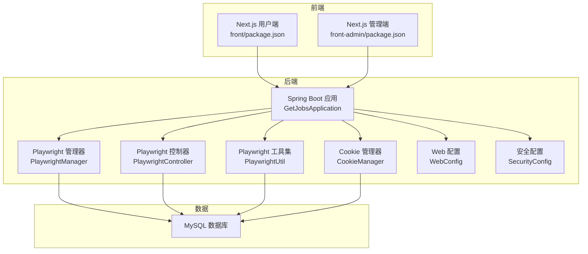
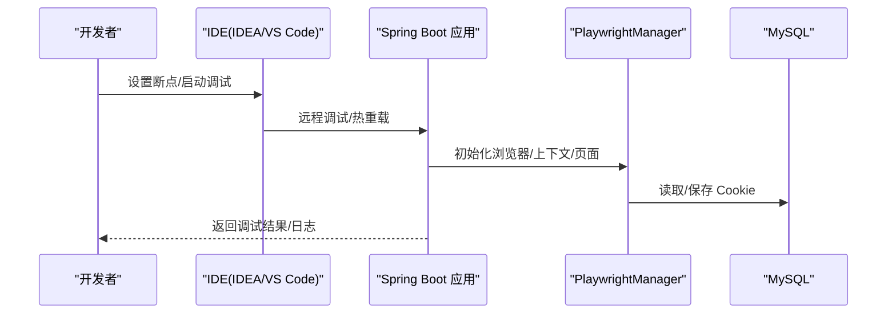
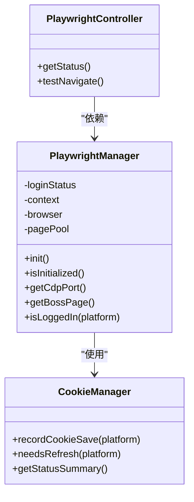
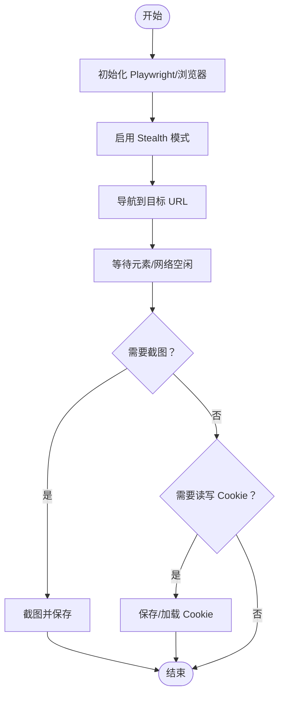
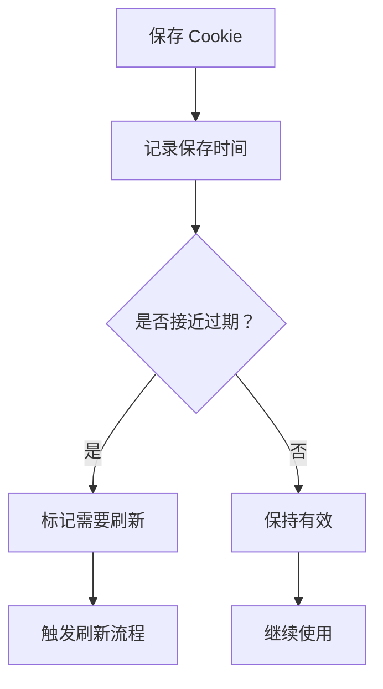
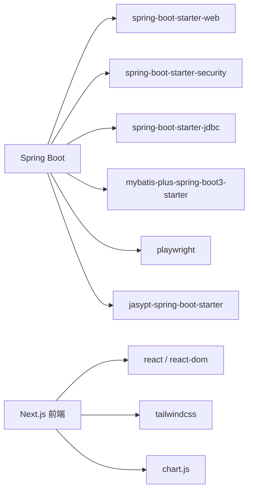

# 调试工具

<cite>
**本文引用的文件**
- [application.yaml](file://backend/src/main/resources/application.yaml)
- [pom.xml](file://backend/pom.xml)
- [GetJobsApplication.java](file://backend/src/main/java/com/getjobs/GetJobsApplication.java)
- [PlaywrightManager.java](file://backend/src/main/java/com/getjobs/worker/manager/PlaywrightManager.java)
- [PlaywrightController.java](file://backend/src/main/java/com/getjobs/application/controller/PlaywrightController.java)
- [PlaywrightUtil.java](file://backend/src/main/java/com/getjobs/worker/utils/PlaywrightUtil.java)
- [CookieManager.java](file://backend/src/main/java/com/getjobs/worker/utils/CookieManager.java)
- [WebConfig.java](file://backend/src/main/java/com/getjobs/application/config/WebConfig.java)
- [SecurityConfig.java](file://backend/src/main/java/com/getjobs/application/config/SecurityConfig.java)
- [package.json（前端）](file://front/package.json)
- [package.json（前端管理端）](file://front-admin/package.json)
</cite>

## 目录
1. [简介](#简介)
2. [项目结构](#项目结构)
3. [核心组件](#核心组件)
4. [架构总览](#架构总览)
5. [详细组件分析](#详细组件分析)
6. [依赖分析](#依赖分析)
7. [性能考虑](#性能考虑)
8. [故障排查指南](#故障排查指南)
9. [结论](#结论)
10. [附录](#附录)

## 简介
本指南面向 GetJobs 项目的开发者与运维人员，提供从后端 Spring Boot、前端 Next.js、Playwright 浏览器自动化到数据库与日志的全链路调试方案。内容涵盖：
- IntelliJ IDEA 与 VS Code 的断点、变量监控与远程调试配置
- Spring Boot 远程调试、热重载与日志级别调整
- Playwright 调试模式、页面截图、网络拦截与响应查看
- 数据库连接调试、SQL 查询跟踪与性能分析
- 前端开发服务器调试、API 请求调试与 WebSocket 监控
- 常见调试场景、性能瓶颈识别与内存泄漏检测
- 生产环境问题排查与日志分析技巧

## 项目结构
GetJobs 采用前后端分离架构：
- 后端：Spring Boot 应用，提供 REST API、定时/异步任务与 Playwright 自动化
- 前端：Next.js 应用（用户端与管理端）
- 数据库：MySQL（配置于 application.yaml）

图表来源
- [GetJobsApplication.java:15-22](file://backend/src/main/java/com/getjobs/GetJobsApplication.java#L15-L22)
- [PlaywrightManager.java:40-221](file://backend/src/main/java/com/getjobs/worker/manager/PlaywrightManager.java#L40-L221)
- [PlaywrightController.java:16-63](file://backend/src/main/java/com/getjobs/application/controller/PlaywrightController.java#L16-L63)
- [PlaywrightUtil.java:19-118](file://backend/src/main/java/com/getjobs/worker/utils/PlaywrightUtil.java#L19-L118)
- [CookieManager.java:30-197](file://backend/src/main/java/com/getjobs/worker/utils/CookieManager.java#L30-L197)
- [WebConfig.java:13-36](file://backend/src/main/java/com/getjobs/application/config/WebConfig.java#L13-L36)
- [SecurityConfig.java:20-66](file://backend/src/main/java/com/getjobs/application/config/SecurityConfig.java#L20-L66)
- [application.yaml:13-26](file://backend/src/main/resources/application.yaml#L13-L26)
- [package.json（前端）:1-48](file://front/package.json#L1-L48)
- [package.json（前端管理端）:1-41](file://front-admin/package.json#L1-L41)

章节来源
- [GetJobsApplication.java:15-22](file://backend/src/main/java/com/getjobs/GetJobsApplication.java#L15-L22)
- [application.yaml:1-101](file://backend/src/main/resources/application.yaml#L1-L101)
- [package.json（前端）:1-48](file://front/package.json#L1-L48)
- [package.json（前端管理端）:1-41](file://front-admin/package.json#L1-L41)

## 核心组件
- Spring Boot 启动类：开启调度与异步能力，作为后端服务入口
- Playwright 管理器：集中管理浏览器生命周期、上下文、页面池与登录状态监控
- Playwright 控制器：提供状态查询与导航测试接口，便于调试
- Playwright 工具集：封装截图、Cookie 读写、Stealth 模式等常用能力
- Cookie 管理器：记录 Cookie 保存时间、预测过期与刷新策略
- Web/安全配置：注册拦截器与 CORS，统一放行策略

章节来源
- [GetJobsApplication.java:15-22](file://backend/src/main/java/com/getjobs/GetJobsApplication.java#L15-L22)
- [PlaywrightManager.java:40-221](file://backend/src/main/java/com/getjobs/worker/manager/PlaywrightManager.java#L40-L221)
- [PlaywrightController.java:16-63](file://backend/src/main/java/com/getjobs/application/controller/PlaywrightController.java#L16-L63)
- [PlaywrightUtil.java:19-118](file://backend/src/main/java/com/getjobs/worker/utils/PlaywrightUtil.java#L19-L118)
- [CookieManager.java:30-197](file://backend/src/main/java/com/getjobs/worker/utils/CookieManager.java#L30-L197)
- [WebConfig.java:13-36](file://backend/src/main/java/com/getjobs/application/config/WebConfig.java#L13-L36)
- [SecurityConfig.java:20-66](file://backend/src/main/java/com/getjobs/application/config/SecurityConfig.java#L20-L66)

## 架构总览
后端通过 PlaywrightManager 统一驱动多平台浏览器，结合 Cookie 管理与登录监控，实现稳定自动化。前端通过 Next.js 开发服务器提供交互界面，后端提供 REST 接口。

图表来源
- [PlaywrightManager.java:114-221](file://backend/src/main/java/com/getjobs/worker/manager/PlaywrightManager.java#L114-L221)
- [application.yaml:13-26](file://backend/src/main/resources/application.yaml#L13-L26)

## 详细组件分析

### Playwright 管理器（PlaywrightManager）
- 调试端口：固定 CDP 端口，便于外部浏览器或工具连接
- 非无头模式：便于可视化调试
- 资源拦截：可选开启，降低内存占用
- 页面池：统一管理多平台页面，支持超时与回收
- 登录状态监控：监听导航事件，检测登录状态变化
- Cookie 注入与保存：从数据库加载、登录成功后回写

图表来源
- [PlaywrightManager.java:40-221](file://backend/src/main/java/com/getjobs/worker/manager/PlaywrightManager.java#L40-L221)
- [PlaywrightController.java:16-63](file://backend/src/main/java/com/getjobs/application/controller/PlaywrightController.java#L16-L63)
- [CookieManager.java:30-197](file://backend/src/main/java/com/getjobs/worker/utils/CookieManager.java#L30-L197)

章节来源
- [PlaywrightManager.java:40-221](file://backend/src/main/java/com/getjobs/worker/manager/PlaywrightManager.java#L40-L221)
- [PlaywrightController.java:16-63](file://backend/src/main/java/com/getjobs/application/controller/PlaywrightController.java#L16-L63)
- [CookieManager.java:30-197](file://backend/src/main/java/com/getjobs/worker/utils/CookieManager.java#L30-L197)

### Playwright 工具集（PlaywrightUtil）
- 截图：支持页面与元素截图，便于定位 UI 问题
- Cookie 读写：JSON 文件格式，便于离线调试
- Stealth 模式：增强反检测，提升稳定性
- 默认超时与等待：便于调试时观察页面行为

图表来源
- [PlaywrightUtil.java:44-118](file://backend/src/main/java/com/getjobs/worker/utils/PlaywrightUtil.java#L44-L118)
- [PlaywrightUtil.java:287-316](file://backend/src/main/java/com/getjobs/worker/utils/PlaywrightUtil.java#L287-L316)
- [PlaywrightUtil.java:318-408](file://backend/src/main/java/com/getjobs/worker/utils/PlaywrightUtil.java#L318-L408)

章节来源
- [PlaywrightUtil.java:19-610](file://backend/src/main/java/com/getjobs/worker/utils/PlaywrightUtil.java#L19-L610)

### Cookie 管理器（CookieManager）
- 记录保存时间与预期有效期
- 即将过期/已过期检测
- 刷新标记与摘要输出，便于监控

图表来源
- [CookieManager.java:62-153](file://backend/src/main/java/com/getjobs/worker/utils/CookieManager.java#L62-L153)

章节来源
- [CookieManager.java:30-259](file://backend/src/main/java/com/getjobs/worker/utils/CookieManager.java#L30-L259)

### Web 与安全配置
- Web 配置：注册 JWT 拦截器，排除健康检查与登录注册等端点
- 安全配置：禁用 CSRF/表单登录/HTTP Basic，统一 CORS 放行

章节来源
- [WebConfig.java:13-36](file://backend/src/main/java/com/getjobs/application/config/WebConfig.java#L13-L36)
- [SecurityConfig.java:20-66](file://backend/src/main/java/com/getjobs/application/config/SecurityConfig.java#L20-L66)

## 依赖分析
- 后端依赖：Spring Boot Web、Security、MyBatis-Plus、Playwright、Jasypt 等
- 前端依赖：Next.js、React、TailwindCSS、Chart.js 等
- 数据库：MySQL，Hikari 连接池配置

图表来源
- [pom.xml:43-177](file://backend/pom.xml#L43-L177)
- [package.json（前端）:15-31](file://front/package.json#L15-L31)
- [package.json（前端管理端）:11-27](file://front-admin/package.json#L11-L27)

章节来源
- [pom.xml:1-309](file://backend/pom.xml#L1-L309)
- [package.json（前端）:1-48](file://front/package.json#L1-L48)
- [package.json（前端管理端）:1-41](file://front-admin/package.json#L1-L41)

## 性能考虑
- Playwright 调试端口与非无头模式便于可视化，但会增加资源消耗；生产建议无头模式与合理超时
- 资源拦截可降低内存占用，但可能影响部分资源加载；按需开启
- 页面池与超时回收：避免长时间占用页面导致内存泄漏
- 数据库连接池：合理设置最大连接数与空闲超时
- 前端构建优化：生产构建与静态资源缓存

[本节为通用指导，无需列出章节来源]

## 故障排查指南

### IntelliJ IDEA 调试配置
- 远程调试：在应用启动参数中添加 JVM 调试参数，IDE 中新建 Remote JVM Debug 配置，连接本地调试端口
- 断点设置：在 PlaywrightManager、PlaywrightController、CookieManager 等关键方法入口设置断点
- 变量监控：关注浏览器实例、上下文、页面池、登录状态与 Cookie 记录

章节来源
- [PlaywrightManager.java:114-221](file://backend/src/main/java/com/getjobs/worker/manager/PlaywrightManager.java#L114-L221)
- [PlaywrightController.java:16-63](file://backend/src/main/java/com/getjobs/application/controller/PlaywrightController.java#L16-L63)
- [CookieManager.java:62-153](file://backend/src/main/java/com/getjobs/worker/utils/CookieManager.java#L62-L153)

### VS Code 调试配置
- 使用 Java 测试资源或启动类创建 launch.json，配置断点与变量监视
- 前端调试：在 front 或 front-admin 目录下使用 VS Code 的 JavaScript 调试功能，连接 Next.js 开发服务器

章节来源
- [package.json（前端）:5-14](file://front/package.json#L5-L14)
- [package.json（前端管理端）:5-9](file://front-admin/package.json#L5-L9)

### Spring Boot 远程调试与热重载
- 远程调试：在启动参数中启用调试端口，IDE 连接即可
- 热重载：使用 Spring Boot DevTools（如引入）或重启应用以观察变更
- 日志级别：在 application.yaml 中调整 logging.level 以获取更详细日志

章节来源
- [application.yaml:42-52](file://backend/src/main/resources/application.yaml#L42-L52)

### Playwright 调试与页面截图
- 启用调试端口：PlaywrightManager 使用固定 CDP 端口，可在外部浏览器连接
- 页面截图：使用 PlaywrightUtil 的截图方法保存页面或元素截图，辅助定位 UI 问题
- 网络拦截：根据需要开启资源拦截，减少内存占用；必要时关闭以便观察真实网络行为

章节来源
- [PlaywrightManager.java:127-149](file://backend/src/main/java/com/getjobs/worker/manager/PlaywrightManager.java#L127-L149)
- [PlaywrightUtil.java:287-316](file://backend/src/main/java/com/getjobs/worker/utils/PlaywrightUtil.java#L287-L316)
- [application.yaml:97-97](file://backend/src/main/resources/application.yaml#L97-L97)

### 数据库连接调试与 SQL 跟踪
- 连接信息：确认 application.yaml 中的数据库 URL、用户名与密码（加密配置）
- 连接池：Hikari 配置最大连接数、空闲超时与最大生存时间
- SQL 跟踪：在开发环境开启 MyBatis-Plus SQL 日志，观察执行计划与耗时

章节来源
- [application.yaml:13-26](file://backend/src/main/resources/application.yaml#L13-L26)
- [application.yaml:54-61](file://backend/src/main/resources/application.yaml#L54-L61)

### 前端开发服务器调试与 API 请求
- 开发服务器：front 与 front-admin 分别使用 Next.js 开发端口，IDE 中可直接调试前端代码
- API 请求：通过 PlaywrightController 的状态接口验证后端可用性，结合浏览器 Network 面板观察请求与响应
- WebSocket：如涉及实时通信，可在浏览器开发者工具中监控 WS 连接与消息

章节来源
- [package.json（前端）:5-14](file://front/package.json#L5-L14)
- [package.json（前端管理端）:5-9](file://front-admin/package.json#L5-L9)
- [PlaywrightController.java:26-39](file://backend/src/main/java/com/getjobs/application/controller/PlaywrightController.java#L26-L39)

### 常见调试场景与解决方案
- 登录状态异常：检查 PlaywrightManager 的登录监控与 Cookie 注入逻辑，必要时手动刷新 Cookie
- 页面加载缓慢：调整 navigation-timeout 与 slow-mo，启用资源拦截
- Cookie 失效：使用 CookieManager 的刷新标记与摘要输出，触发平台登录流程
- CORS 问题：确认 SecurityConfig 与 WebConfig 的放行规则

章节来源
- [PlaywrightManager.java:254-331](file://backend/src/main/java/com/getjobs/worker/manager/PlaywrightManager.java#L254-L331)
- [CookieManager.java:122-197](file://backend/src/main/java/com/getjobs/worker/utils/CookieManager.java#L122-L197)
- [SecurityConfig.java:49-66](file://backend/src/main/java/com/getjobs/application/config/SecurityConfig.java#L49-L66)
- [WebConfig.java:26-35](file://backend/src/main/java/com/getjobs/application/config/WebConfig.java#L26-L35)

### 生产环境问题排查与日志分析
- 日志位置：application.yaml 中配置了日志文件路径与滚动策略
- 关键指标：关注 PlaywrightManager 初始化日志、登录状态变化与 Cookie 管理摘要
- 建议：在生产环境临时提高日志级别以定位问题，问题解决后恢复默认级别

章节来源
- [application.yaml:42-52](file://backend/src/main/resources/application.yaml#L42-L52)
- [CookieManager.java:175-197](file://backend/src/main/java/com/getjobs/worker/utils/CookieManager.java#L175-L197)

## 结论
通过合理的 IDE 调试配置、Spring Boot 远程调试与热重载、Playwright 可视化调试与截图、数据库连接与 SQL 跟踪、以及前端开发服务器与 API 调试，可以高效定位与解决 GetJobs 项目中的各类问题。配合 Cookie 管理与登录监控，可进一步提升自动化稳定性与可维护性。

[本节为总结性内容，无需列出章节来源]

## 附录

### 关键配置速览
- 数据库连接与连接池：application.yaml
- 日志级别与文件：application.yaml
- Playwright 超时与拦截：application.yaml
- 前端开发脚本：front/front-admin package.json

章节来源
- [application.yaml:13-101](file://backend/src/main/resources/application.yaml#L13-L101)
- [package.json（前端）:5-14](file://front/package.json#L5-L14)
- [package.json（前端管理端）:5-9](file://front-admin/package.json#L5-L9)