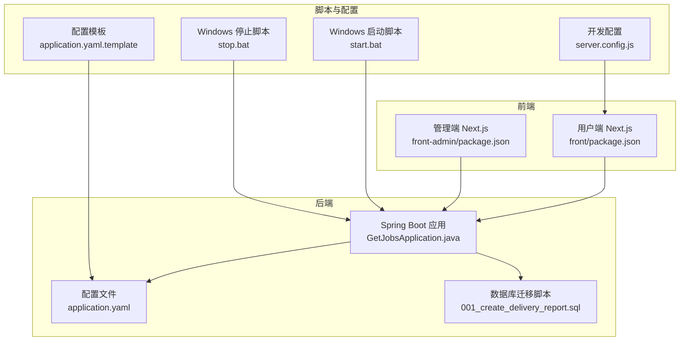
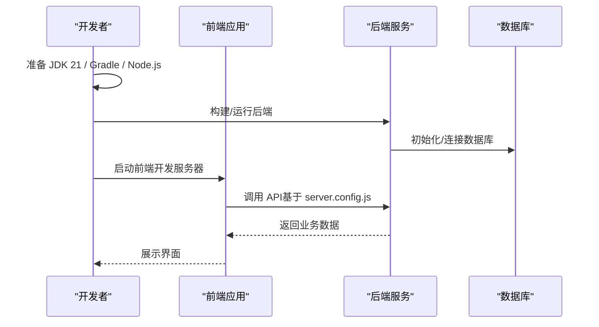
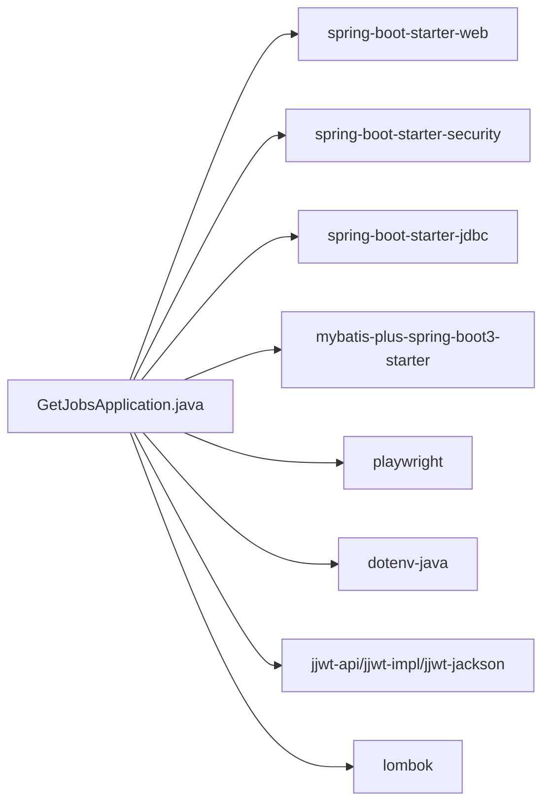

# 快速开始

<cite>
**本文引用的文件**
- [README.md](file://README.md)
- [backend/pom.xml](file://backend/pom.xml)
- [backend/src/main/resources/application.yaml](file://backend/src/main/resources/application.yaml)
- [backend/src/main/java/com/getjobs/GetJobsApplication.java](file://backend/src/main/java/com/getjobs/GetJobsApplication.java)
- [scripts/windows/start.bat](file://scripts/windows/start.bat)
- [scripts/windows/stop.bat](file://scripts/windows/stop.bat)
- [scripts/application.yaml.template](file://scripts/application.yaml.template)
- [scripts/migration/001_create_delivery_report.sql](file://scripts/migration/001_create_delivery_report.sql)
- [front/package.json](file://front/package.json)
- [front-admin/package.json](file://front-admin/package.json)
- [front/server.config.js](file://front/server.config.js)
- [front/scripts/start-dev.js](file://front/scripts/start-dev.js)
- [front-admin/next.config.ts](file://front-admin/next.config.ts)
- [RELEASE_GUIDE.md](file://RELEASE_GUIDE.md)
</cite>

## 目录
1. [简介](#简介)
2. [项目结构](#项目结构)
3. [核心组件](#核心组件)
4. [架构总览](#架构总览)
5. [详细组件分析](#详细组件分析)
6. [依赖关系分析](#依赖关系分析)
7. [性能注意事项](#性能注意事项)
8. [故障排除指南](#故障排除指南)
9. [结论](#结论)
10. [附录](#附录)

## 简介
本指南面向首次接触 GetJobs 项目的用户，帮助你在 Windows、Linux 与 macOS 平台上完成环境准备、项目克隆、依赖安装、数据库初始化与首次运行，最终成功访问前后端界面。我们将覆盖 JDK 21、Gradle、Node.js 等必需软件的安装与配置，以及平台差异化的启动与调试要点。

## 项目结构
GetJobs 采用前后端分离架构：
- 后端基于 Spring Boot 3，使用 Maven 构建，提供 REST API 与定时/异步任务调度能力。
- 前端分为两个部分：
  - 用户端：Next.js 应用，开发端口默认 6866，通过 server.config.js 配置 API 基础地址。
  - 管理端：Next.js 应用，开发端口默认 6867，独立构建与运行。
- 脚本目录提供跨平台的配置模板与数据库迁移脚本，Windows 提供批处理启动/停止脚本。

图表来源
- [backend/src/main/java/com/getjobs/GetJobsApplication.java:1-22](file://backend/src/main/java/com/getjobs/GetJobsApplication.java#L1-L22)
- [backend/src/main/resources/application.yaml:1-91](file://backend/src/main/resources/application.yaml#L1-L91)
- [scripts/migration/001_create_delivery_report.sql:1-29](file://scripts/migration/001_create_delivery_report.sql#L1-L29)
- [front/package.json:1-43](file://front/package.json#L1-L43)
- [front-admin/package.json:1-41](file://front-admin/package.json#L1-L41)
- [scripts/windows/start.bat:1-98](file://scripts/windows/start.bat#L1-L98)
- [scripts/windows/stop.bat:1-31](file://scripts/windows/stop.bat#L1-L31)
- [scripts/application.yaml.template:1-90](file://scripts/application.yaml.template#L1-L90)
- [front/server.config.js:1-39](file://front/server.config.js#L1-L39)

章节来源
- [README.md:64-136](file://README.md#L64-L136)
- [backend/pom.xml:1-263](file://backend/pom.xml#L1-L263)
- [front/package.json:1-43](file://front/package.json#L1-L43)
- [front-admin/package.json:1-41](file://front-admin/package.json#L1-L41)

## 核心组件
- 后端启动类：负责 Spring Boot 应用的引导与扫描基础包。
- 配置文件：包含数据库连接、日志、MyBatis Plus、Playwright 等运行参数。
- 前端配置：用户端与管理端分别通过 package.json 与 server.config.js 控制开发端口与 API 基础地址。
- Windows 启停脚本：提供 Java 环境检测、端口占用检查、日志输出与进程停止能力。

章节来源
- [backend/src/main/java/com/getjobs/GetJobsApplication.java:1-22](file://backend/src/main/java/com/getjobs/GetJobsApplication.java#L1-L22)
- [backend/src/main/resources/application.yaml:1-91](file://backend/src/main/resources/application.yaml#L1-L91)
- [front/server.config.js:1-39](file://front/server.config.js#L1-L39)
- [scripts/windows/start.bat:1-98](file://scripts/windows/start.bat#L1-L98)
- [scripts/windows/stop.bat:1-31](file://scripts/windows/stop.bat#L1-L31)

## 架构总览
后端以 Spring Boot 为核心，提供 REST 接口；前端 Next.js 应用通过 API 基础地址与后端交互。数据库初始化可通过迁移脚本完成，Playwright 用于模拟浏览器行为。

图表来源
- [backend/src/main/resources/application.yaml:1-91](file://backend/src/main/resources/application.yaml#L1-L91)
- [front/server.config.js:1-39](file://front/server.config.js#L1-L39)
- [scripts/migration/001_create_delivery_report.sql:1-29](file://scripts/migration/001_create_delivery_report.sql#L1-L29)

## 详细组件分析

### 后端环境与构建
- JDK 21：后端使用 Java 21，Maven 插件已配置对应编译参数。
- Gradle：项目使用 Maven 构建，若需 Gradle 环境，请参考构建工具选择与配置。
- Maven 依赖：包含 Spring Web、Security、JDBC、MyBatis-Plus、Playwright、Dotenv 等。
- 启动类：Spring Boot 启动类位于 com.getjobs 包，启用异步与定时任务。

章节来源
- [backend/pom.xml:24-40](file://backend/pom.xml#L24-L40)
- [backend/pom.xml:190-260](file://backend/pom.xml#L190-L260)
- [backend/src/main/java/com/getjobs/GetJobsApplication.java:1-22](file://backend/src/main/java/com/getjobs/GetJobsApplication.java#L1-L22)

### 数据库与初始化
- 数据库类型：MySQL（Hikari 连接池配置）。
- 初始化模式：支持 SQL 脚本初始化，脚本位置与模式可在配置中调整。
- 迁移脚本：提供投递报告表创建与相关字段补充，便于统计分析。

章节来源
- [backend/src/main/resources/application.yaml:13-31](file://backend/src/main/resources/application.yaml#L13-L31)
- [scripts/application.yaml.template:33-41](file://scripts/application.yaml.template#L33-L41)
- [scripts/migration/001_create_delivery_report.sql:1-29](file://scripts/migration/001_create_delivery_report.sql#L1-L29)

### 前端开发与运行
- 用户端：开发端口默认 6866，API 基础地址指向后端固定端口 18888。
- 管理端：开发端口默认 6867，独立构建与运行。
- 开发脚本：用户端通过 server.config.js 生成 .env.local 并启动 Next.js。

章节来源
- [front/server.config.js:1-39](file://front/server.config.js#L1-L39)
- [front/scripts/start-dev.js:1-42](file://front/scripts/start-dev.js#L1-L42)
- [front-admin/next.config.ts:1-12](file://front-admin/next.config.ts#L1-L12)
- [front/package.json:5-11](file://front/package.json#L5-L11)
- [front-admin/package.json:5-10](file://front-admin/package.json#L5-L10)

### Windows 启停脚本
- 启动脚本：检测 Java 环境、创建必要目录、检查端口占用、启动应用并输出日志。
- 停止脚本：查找并终止占用 18888 端口的进程。

章节来源
- [scripts/windows/start.bat:15-98](file://scripts/windows/start.bat#L15-L98)
- [scripts/windows/stop.bat:12-31](file://scripts/windows/stop.bat#L12-L31)

## 依赖关系分析
后端依赖关系概览（简化）：

图表来源
- [backend/pom.xml:47-187](file://backend/pom.xml#L47-L187)

章节来源
- [backend/pom.xml:43-187](file://backend/pom.xml#L43-L187)

## 性能注意事项
- Playwright 超时与重试：平台差异化超时与重试策略有助于稳定抓取，可根据网络状况适当调整。
- 日志滚动：控制台与文件日志格式、保留天数与单文件大小，便于定位问题。
- 连接池：Hikari 连接池参数影响数据库并发能力，建议结合实际负载调优。

章节来源
- [backend/src/main/resources/application.yaml:60-91](file://backend/src/main/resources/application.yaml#L60-L91)
- [backend/src/main/resources/application.yaml:32-43](file://backend/src/main/resources/application.yaml#L32-L43)

## 故障排除指南

### 环境与依赖问题
- Java 版本不符
  - 现象：启动失败或编译报错。
  - 处理：确保安装 JDK 21，Windows 启动脚本会检测 Java 环境。
- 端口占用
  - 现象：启动提示端口 18888 已被占用。
  - 处理：停止占用进程或修改后端 server.port。
- Node.js 依赖缺失
  - 现象：前端启动报错或依赖安装失败。
  - 处理：使用 pnpm 安装依赖，确保网络可访问包源。

章节来源
- [scripts/windows/start.bat:64-71](file://scripts/windows/start.bat#L64-L71)
- [scripts/windows/stop.bat:12-26](file://scripts/windows/stop.bat#L12-L26)
- [front/package.json:1-43](file://front/package.json#L1-L43)
- [front-admin/package.json:1-41](file://front-admin/package.json#L1-L41)

### 数据库初始化问题
- 初始化失败
  - 现象：数据库未按预期创建表或字段。
  - 处理：检查 application.yaml 中的 SQL 初始化配置与脚本路径，确认数据库连接正确。
- 迁移脚本执行
  - 处理：确保数据库可写，执行迁移脚本后再启动后端。

章节来源
- [scripts/application.yaml.template:33-41](file://scripts/application.yaml.template#L33-L41)
- [scripts/migration/001_create_delivery_report.sql:1-29](file://scripts/migration/001_create_delivery_report.sql#L1-L29)

### 前端无法访问后端 API
- 现象：前端请求 404 或跨域错误。
- 处理：确认 server.config.js 中的 API 基础地址与后端端口一致；后端 CORS 配置需允许前端域名。

章节来源
- [front/server.config.js:27-31](file://front/server.config.js#L27-L31)
- [backend/src/main/resources/application.yaml:1-91](file://backend/src/main/resources/application.yaml#L1-L91)

### Windows 启动/停止异常
- 现象：脚本无法找到 Java、jar 文件或无法停止进程。
- 处理：检查 JAVA_HOME 与 PATH，确认 jar 文件存在；以管理员权限运行脚本。

章节来源
- [scripts/windows/start.bat:15-48](file://scripts/windows/start.bat#L15-L48)
- [scripts/windows/stop.bat:12-26](file://scripts/windows/stop.bat#L12-L26)

## 结论
按照本指南完成环境准备、依赖安装与数据库初始化后，你可以在本地成功启动后端与前后端前端应用，并通过浏览器访问界面。遇到问题时，优先检查端口占用、数据库连接与前端 API 基础地址，必要时参考故障排除章节。

## 附录

### 首次运行完整流程（Windows/Linux/macOS）
- 克隆项目
  - 使用 git 克隆仓库并进入根目录。
- 安装与配置
  - JDK 21：确保已安装并配置环境变量。
  - Gradle：可选，项目使用 Maven 构建。
  - Node.js：安装 pnpm 并在 front 与 front-admin 目录安装依赖。
- 数据库准备
  - 准备 MySQL 实例，创建数据库与用户。
  - 复制配置模板为 application.yaml，填写数据库连接信息。
  - 执行数据库迁移脚本，创建所需表与字段。
- 启动后端
  - Windows：双击启动脚本，或在命令行执行相应命令。
  - Linux/macOS：使用脚本或直接运行 Spring Boot 可执行 JAR。
- 启动前端
  - 用户端：运行前端开发脚本，访问默认端口。
  - 管理端：单独启动管理端 Next.js 应用。
- 首次访问
  - 打开浏览器访问前端地址，登录并进行基本配置。

章节来源
- [README.md:64-136](file://README.md#L64-L136)
- [scripts/windows/start.bat:1-98](file://scripts/windows/start.bat#L1-L98)
- [scripts/application.yaml.template:1-90](file://scripts/application.yaml.template#L1-L90)
- [scripts/migration/001_create_delivery_report.sql:1-29](file://scripts/migration/001_create_delivery_report.sql#L1-L29)
- [front/package.json:5-11](file://front/package.json#L5-L11)
- [front-admin/package.json:5-10](file://front-admin/package.json#L5-L10)
- [front/server.config.js:1-39](file://front/server.config.js#L1-L39)