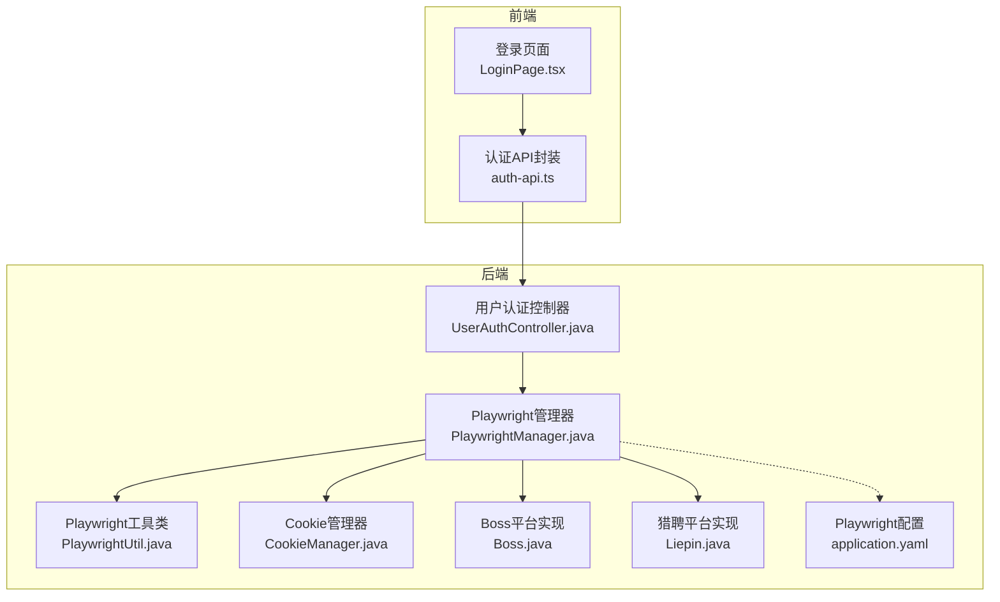
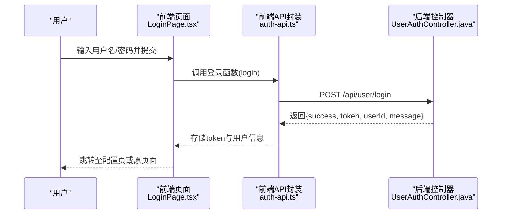
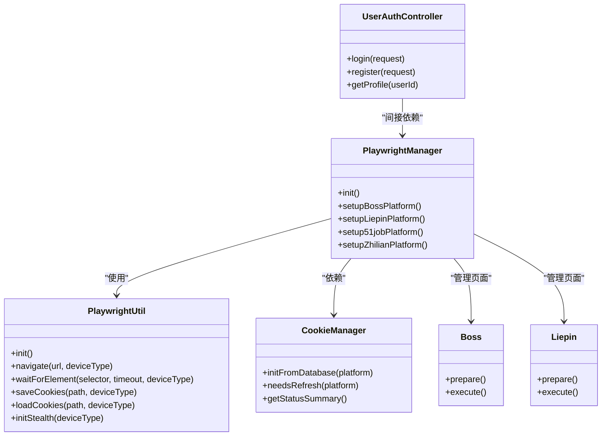

# 常见问题

<cite>
**本文引用的文件**
- [README.md](file://README.md)
- [RELEASE_GUIDE.md](file://RELEASE_GUIDE.md)
- [application.yaml](file://backend/src/main/resources/application.yaml)
- [application.yaml.template](file://scripts/application.yaml.template)
- [PlaywrightManager.java](file://backend/src/main/java/com/getjobs/worker/manager/PlaywrightManager.java)
- [PlaywrightUtil.java](file://backend/src/main/java/com/getjobs/worker/utils/PlaywrightUtil.java)
- [CookieManager.java](file://backend/src/main/java/com/getjobs/worker/utils/CookieManager.java)
- [Boss.java](file://backend/src/main/java/com/getjobs/worker/boss/Boss.java)
- [Liepin.java](file://backend/src/main/java/com/getjobs/worker/liepin/Liepin.java)
- [UserAuthController.java](file://backend/src/main/java/com/getjobs/application/controller/UserAuthController.java)
- [auth-api.ts](file://front/lib/auth-api.ts)
- [LoginPage.tsx](file://front/app/auth/login/page.tsx)
- [JobController.java](file://backend/src/main/java/com/getjobs/application/controller/JobController.java)
- [JobPlatformService.java](file://backend/src/main/java/com/getjobs/worker/service/JobPlatformService.java)
- [DeliveryReportService.java](file://backend/src/main/java/com/getjobs/application/service/DeliveryReportService.java)
</cite>

## 目录
1. [简介](#简介)
2. [项目结构](#项目结构)
3. [核心组件](#核心组件)
4. [架构总览](#架构总览)
5. [详细组件分析](#详细组件分析)
6. [依赖关系分析](#依赖关系分析)
7. [性能考量](#性能考量)
8. [故障排查指南](#故障排查指南)
9. [结论](#结论)
10. [附录](#附录)

## 简介
本FAQ面向GetJobs项目的使用者，聚焦用户在登录、投递、平台兼容性、浏览器驱动与网络连接等场景中常见的问题，提供症状描述、可能原因与可操作的解决步骤。同时给出问题自检清单、快速修复方法、用户反馈与问题报告流程，帮助新用户与日常使用者高效定位与解决问题。

## 项目结构
GetJobs采用前后端分离架构：
- 后端（Spring Boot + Playwright）负责平台登录状态管理、浏览器自动化、投递执行与数据持久化。
- 前端（Next.js）提供用户认证、配置管理与任务控制界面。
- 配置文件通过YAML集中管理数据库、日志、Playwright参数等。

图表来源
- [PlaywrightManager.java](file://backend/src/main/java/com/getjobs/worker/manager/PlaywrightManager.java)
- [PlaywrightUtil.java](file://backend/src/main/java/com/getjobs/worker/utils/PlaywrightUtil.java)
- [CookieManager.java](file://backend/src/main/java/com/getjobs/worker/utils/CookieManager.java)
- [Boss.java](file://backend/src/main/java/com/getjobs/worker/boss/Boss.java)
- [Liepin.java](file://backend/src/main/java/com/getjobs/worker/liepin/Liepin.java)
- [application.yaml](file://backend/src/main/resources/application.yaml)
- [LoginPage.tsx](file://front/app/auth/login/page.tsx)
- [auth-api.ts](file://front/lib/auth-api.ts)

章节来源
- [application.yaml:1-91](file://backend/src/main/resources/application.yaml#L1-L91)
- [application.yaml.template:1-90](file://scripts/application.yaml.template#L1-L90)

## 核心组件
- Playwright管理器：负责浏览器实例、上下文、页面池与多平台登录状态监控。
- Playwright工具类：提供元素查找、等待、输入、截图、Cookie读写等基础能力。
- Cookie管理器：维护平台Cookie生命周期、过期检测与刷新策略。
- 平台实现：Boss与猎聘分别实现岗位搜索、过滤、投递与数据持久化。
- 用户认证：后端提供登录/注册/资料修改接口，前端封装请求与本地存储。

章节来源
- [PlaywrightManager.java:114-221](file://backend/src/main/java/com/getjobs/worker/manager/PlaywrightManager.java#L114-L221)
- [PlaywrightUtil.java:44-118](file://backend/src/main/java/com/getjobs/worker/utils/PlaywrightUtil.java#L44-L118)
- [CookieManager.java:77-214](file://backend/src/main/java/com/getjobs/worker/utils/CookieManager.java#L77-L214)
- [Boss.java:94-125](file://backend/src/main/java/com/getjobs/worker/boss/Boss.java#L94-L125)
- [Liepin.java:64-130](file://backend/src/main/java/com/getjobs/worker/liepin/Liepin.java#L64-L130)
- [UserAuthController.java:25-80](file://backend/src/main/java/com/getjobs/application/controller/UserAuthController.java#L25-L80)

## 架构总览
以下序列图展示登录流程与前端到后端的关键交互：

图表来源
- [LoginPage.tsx:21-47](file://front/app/auth/login/page.tsx#L21-L47)
- [auth-api.ts:74-90](file://front/lib/auth-api.ts#L74-L90)
- [UserAuthController.java:61-80](file://backend/src/main/java/com/getjobs/application/controller/UserAuthController.java#L61-L80)

章节来源
- [auth-api.ts:40-90](file://front/lib/auth-api.ts#L40-L90)
- [UserAuthController.java:25-108](file://backend/src/main/java/com/getjobs/application/controller/UserAuthController.java#L25-L108)

## 详细组件分析

### 登录失败
- 症状
  - 前端提示“登录失败”或“请检查网络连接”
  - 后端返回错误信息（如用户名/密码为空、密码过短、登录失败）
- 可能原因
  - 前端未正确携带Authorization头（未登录或token失效）
  - 后端校验失败（必填字段缺失、密码长度不足）
  - 后端认证异常（抛出异常）
- 解决步骤
  - 确认前端已将token写入localStorage并在请求头中携带
  - 检查后端控制器的参数校验逻辑
  - 查看后端日志定位异常堆栈
- 快速自检
  - 检查浏览器localStorage中是否存在user_token
  - 确认后端application.yaml中的server.port与前端API_BASE_URL一致
  - 确认网络可达且无代理干扰

章节来源
- [auth-api.ts:8-25](file://front/lib/auth-api.ts#L8-L25)
- [auth-api.ts:74-90](file://front/lib/auth-api.ts#L74-L90)
- [UserAuthController.java:35-80](file://backend/src/main/java/com/getjobs/application/controller/UserAuthController.java#L35-L80)

### 投递异常（通用）
- 症状
  - 投递任务提示“未登录”、“任务已在运行中”或无响应
  - 投递完成后未扣费或无进度回调
- 可能原因
  - 平台未登录（Boss/Liepin/51job等）
  - 同一平台任务并发执行
  - Playwright页面不可用或超时
- 解决步骤
  - 先完成对应平台的扫码/登录流程
  - 等待当前任务结束后再启动新任务
  - 检查Playwright配置与页面超时设置
  - 查看后端日志定位具体异常
- 快速自检
  - 确认平台登录状态监控已启用
  - 检查Playwright导航超时与重试策略
  - 确认数据库中对应平台Cookie已注入

章节来源
- [JobController.java:401-421](file://backend/src/main/java/com/getjobs/application/controller/JobController.java#L401-L421)
- [PlaywrightManager.java:376-388](file://backend/src/main/java/com/getjobs/worker/manager/PlaywrightManager.java#L376-L388)
- [application.yaml:60-91](file://backend/src/main/resources/application.yaml#L60-L91)

### 平台兼容性问题（Boss/Liepin/51job/智联）
- 症状
  - Boss投递过程中频繁刷新
  - 智联招聘投递上限或页面结构变化
  - 猎聘/51job登录页引导差异导致无法自动登录
- 可能原因
  - 平台页面结构调整
  - 登录状态检测策略不匹配
  - Cookie过期或未正确注入
- 解决步骤
  - 更新平台选择器与登录检测逻辑
  - 刷新平台Cookie并重试
  - 检查平台导航超时配置
- 快速自检
  - 确认平台URL与域名常量
  - 检查平台差异化超时配置
  - 确认反检测脚本已注入

章节来源
- [README.md:24-31](file://README.md#L24-L31)
- [PlaywrightManager.java:46-54](file://backend/src/main/java/com/getjobs/worker/manager/PlaywrightManager.java#L46-L54)
- [application.yaml:67-76](file://backend/src/main/resources/application.yaml#L67-L76)

### 浏览器驱动与Playwright问题
- 症状
  - 启动浏览器失败、Chromium路径错误
  - 页面导航超时、元素查找失败
  - 页面被反爬检测或被回退
- 可能原因
  - Playwright未安装Chromium或路径不正确
  - 导航超时过短、重试次数不足
  - 未启用反检测脚本或资源拦截不当
- 解决步骤
  - 执行Playwright安装命令并确认Chromium路径
  - 调整navigation-timeout与max-retries
  - 启用反检测脚本与stealth模式
- 快速自检
  - 检查Playwright启动参数与调试端口
  - 确认slow-mo与health-check间隔合理
  - 验证资源拦截开关与页面池配置

章节来源
- [PlaywrightManager.java:127-150](file://backend/src/main/java/com/getjobs/worker/manager/PlaywrightManager.java#L127-L150)
- [PlaywrightUtil.java:420-487](file://backend/src/main/java/com/getjobs/worker/utils/PlaywrightUtil.java#L420-L487)
- [application.yaml:60-91](file://backend/src/main/resources/application.yaml#L60-L91)

### 网络连接超时
- 症状
  - 页面加载缓慢、导航超时
  - 接口请求失败或响应超时
- 可能原因
  - 代理/防火墙影响国内平台访问
  - DNS解析慢或网络抖动
  - Playwright超时配置过低
- 解决步骤
  - 关闭墙外代理，使用直连
  - 提高navigation-timeout与重试策略
  - 检查本地DNS与网络稳定性
- 快速自检
  - 确认Playwright启动参数中禁用扩展与软件光栅化
  - 检查CDP调试端口未被占用

章节来源
- [README.md:54-57](file://README.md#L54-L57)
- [PlaywrightManager.java:142-149](file://backend/src/main/java/com/getjobs/worker/manager/PlaywrightManager.java#L142-L149)
- [application.yaml:60-82](file://backend/src/main/resources/application.yaml#L60-L82)

### 验证码识别失败
- 症状
  - 登录页出现验证码，程序无法自动识别
  - 扫码登录后仍提示未登录
- 可能原因
  - 验证码识别模块未接入或不可用
  - 登录页结构变化导致自动点击失败
- 解决步骤
  - 手动完成验证码/扫码登录
  - 更新登录页选择器与引导逻辑
  - 等待后台轮询检测登录状态
- 快速自检
  - 确认登录状态监控已启用
  - 检查平台登录页URL与元素选择器

章节来源
- [PlaywrightManager.java:467-579](file://backend/src/main/java/com/getjobs/worker/manager/PlaywrightManager.java#L467-L579)
- [PlaywrightManager.java:773-800](file://backend/src/main/java/com/getjobs/worker/manager/PlaywrightManager.java#L773-L800)

### Cookie管理与过期
- 症状
  - 登录状态丢失、频繁重新扫码
  - Cookie文件损坏或格式错误
- 可能原因
  - Cookie未正确保存/加载
  - 过期时间接近或已过期
- 解决步骤
  - 从数据库加载Cookie并注入上下文
  - 检查Cookie剩余有效期与刷新阈值
  - 重新登录并保存Cookie
- 快速自检
  - 确认Cookie文件存在且可读
  - 检查过期前刷新配置

章节来源
- [CookieManager.java:77-113](file://backend/src/main/java/com/getjobs/worker/utils/CookieManager.java#L77-L113)
- [CookieManager.java:204-214](file://backend/src/main/java/com/getjobs/worker/utils/CookieManager.java#L204-L214)
- [PlaywrightManager.java:254-274](file://backend/src/main/java/com/getjobs/worker/manager/PlaywrightManager.java#L254-L274)

### 投递报告与进度上报
- 症状
  - 无法查看投递结果统计
  - 进度回调未触发
- 可能原因
  - 报告服务未正确保存
  - 进度回调未传入或未推送
- 解决步骤
  - 确认后端保存投递报告接口调用
  - 检查平台服务的进度回调实现
- 快速自检
  - 确认平台服务实现JobPlatformService接口
  - 检查DeliveryReportService的事务与字段

章节来源
- [DeliveryReportService.java:25-47](file://backend/src/main/java/com/getjobs/application/service/DeliveryReportService.java#L25-L47)
- [JobPlatformService.java:14-46](file://backend/src/main/java/com/getjobs/worker/service/JobPlatformService.java#L14-L46)

## 依赖关系分析

图表来源
- [PlaywrightManager.java:114-221](file://backend/src/main/java/com/getjobs/worker/manager/PlaywrightManager.java#L114-L221)
- [PlaywrightUtil.java:44-118](file://backend/src/main/java/com/getjobs/worker/utils/PlaywrightUtil.java#L44-L118)
- [CookieManager.java:204-214](file://backend/src/main/java/com/getjobs/worker/utils/CookieManager.java#L204-L214)
- [Boss.java:94-125](file://backend/src/main/java/com/getjobs/worker/boss/Boss.java#L94-L125)
- [Liepin.java:64-130](file://backend/src/main/java/com/getjobs/worker/liepin/Liepin.java#L64-L130)
- [UserAuthController.java:25-80](file://backend/src/main/java/com/getjobs/application/controller/UserAuthController.java#L25-L80)

章节来源
- [PlaywrightManager.java:114-221](file://backend/src/main/java/com/getjobs/worker/manager/PlaywrightManager.java#L114-L221)
- [PlaywrightUtil.java:44-118](file://backend/src/main/java/com/getjobs/worker/utils/PlaywrightUtil.java#L44-L118)
- [CookieManager.java:204-214](file://backend/src/main/java/com/getjobs/worker/utils/CookieManager.java#L204-L214)
- [Boss.java:94-125](file://backend/src/main/java/com/getjobs/worker/boss/Boss.java#L94-L125)
- [Liepin.java:64-130](file://backend/src/main/java/com/getjobs/worker/liepin/Liepin.java#L64-L130)
- [UserAuthController.java:25-80](file://backend/src/main/java/com/getjobs/application/controller/UserAuthController.java#L25-L80)

## 性能考量
- Playwright参数调优
  - slow-mo：放慢操作速度，便于调试但影响性能
  - navigation-timeout：平台差异化超时，避免个别平台超时
  - max-retries：重试策略，平衡稳定性与耗时
  - health-check-interval：浏览器健康检查频率
- 资源管理
  - max-pages与idle-page-timeout：页面池容量与回收策略
  - resource-blocking-enabled：资源拦截降低内存占用
- 建议
  - 在稳定环境下适当提高超时与重试，减少误判
  - 合理设置slow-mo，生产环境建议调高以提升稳定性

章节来源
- [application.yaml:60-91](file://backend/src/main/resources/application.yaml#L60-L91)

## 故障排查指南

### 登录失败
- 自检清单
  - 前端是否正确写入localStorage.user_token
  - 后端UserAuthController是否返回success与token
  - 网络是否可达，代理是否关闭
- 快速修复
  - 清除localStorage后重新登录
  - 检查后端日志与异常堆栈
  - 确认application.yaml中server.port与前端API_BASE_URL一致

章节来源
- [auth-api.ts:8-25](file://front/lib/auth-api.ts#L8-L25)
- [UserAuthController.java:35-80](file://backend/src/main/java/com/getjobs/application/controller/UserAuthController.java#L35-L80)
- [README.md:54-57](file://README.md#L54-L57)

### 投递异常
- 自检清单
  - 平台是否已登录（监控状态）
  - 是否存在任务并发执行
  - Playwright页面是否可用
- 快速修复
  - 完成平台扫码/登录
  - 等待当前任务结束后再启动
  - 调整navigation-timeout与max-retries

章节来源
- [JobController.java:401-421](file://backend/src/main/java/com/getjobs/application/controller/JobController.java#L401-L421)
- [PlaywrightManager.java:376-388](file://backend/src/main/java/com/getjobs/worker/manager/PlaywrightManager.java#L376-L388)
- [application.yaml:60-82](file://backend/src/main/resources/application.yaml#L60-L82)

### 平台兼容性
- 自检清单
  - 平台URL与域名常量是否正确
  - 登录状态检测策略是否匹配页面结构
  - 反检测脚本是否注入
- 快速修复
  - 更新平台选择器与登录检测逻辑
  - 刷新Cookie并重试
  - 检查平台差异化超时配置

章节来源
- [README.md:24-31](file://README.md#L24-L31)
- [PlaywrightManager.java:46-54](file://backend/src/main/java/com/getjobs/worker/manager/PlaywrightManager.java#L46-L54)
- [application.yaml:67-76](file://backend/src/main/resources/application.yaml#L67-L76)

### 浏览器驱动问题
- 自检清单
  - Playwright是否安装Chromium
  - 启动参数与调试端口是否正确
  - slow-mo与health-check是否合理
- 快速修复
  - 执行Playwright安装命令
  - 调整启动参数与超时配置
  - 启用stealth模式与资源拦截

章节来源
- [PlaywrightManager.java:127-150](file://backend/src/main/java/com/getjobs/worker/manager/PlaywrightManager.java#L127-L150)
- [PlaywrightUtil.java:420-487](file://backend/src/main/java/com/getjobs/worker/utils/PlaywrightUtil.java#L420-L487)
- [application.yaml:60-91](file://backend/src/main/resources/application.yaml#L60-L91)

### 网络连接超时
- 自检清单
  - 代理是否关闭
  - DNS与网络稳定性
  - Playwright超时配置
- 快速修复
  - 关闭墙外代理
  - 提高navigation-timeout与重试
  - 检查CDP端口与启动参数

章节来源
- [README.md:54-57](file://README.md#L54-L57)
- [PlaywrightManager.java:142-149](file://backend/src/main/java/com/getjobs/worker/manager/PlaywrightManager.java#L142-L149)
- [application.yaml:60-82](file://backend/src/main/resources/application.yaml#L60-L82)

### 验证码识别失败
- 自检清单
  - 登录页是否出现验证码
  - 登录页选择器是否匹配
  - 登录状态监控是否生效
- 快速修复
  - 手动完成验证码/扫码
  - 更新选择器与引导逻辑
  - 等待后台轮询检测登录

章节来源
- [PlaywrightManager.java:467-579](file://backend/src/main/java/com/getjobs/worker/manager/PlaywrightManager.java#L467-L579)
- [PlaywrightManager.java:773-800](file://backend/src/main/java/com/getjobs/worker/manager/PlaywrightManager.java#L773-L800)

### Cookie管理与过期
- 自检清单
  - Cookie文件是否存在
  - 剩余有效期是否充足
  - 刷新阈值是否合理
- 快速修复
  - 从数据库加载Cookie并注入
  - 重新登录并保存
  - 调整过期前刷新配置

章节来源
- [CookieManager.java:77-113](file://backend/src/main/java/com/getjobs/worker/utils/CookieManager.java#L77-L113)
- [CookieManager.java:204-214](file://backend/src/main/java/com/getjobs/worker/utils/CookieManager.java#L204-L214)
- [PlaywrightManager.java:254-274](file://backend/src/main/java/com/getjobs/worker/manager/PlaywrightManager.java#L254-L274)

### 投递报告与进度上报
- 自检清单
  - 报告服务是否保存成功
  - 进度回调是否传入
  - 平台服务是否实现接口
- 快速修复
  - 确认后端保存接口调用
  - 检查平台服务的回调实现
  - 校验DeliveryReportService字段

章节来源
- [DeliveryReportService.java:25-47](file://backend/src/main/java/com/getjobs/application/service/DeliveryReportService.java#L25-L47)
- [JobPlatformService.java:14-46](file://backend/src/main/java/com/getjobs/worker/service/JobPlatformService.java#L14-L46)

## 结论
本FAQ围绕登录、投递、平台兼容、浏览器驱动与网络连接等高频问题提供了系统性的排查思路与修复建议。建议用户结合自检清单与快速修复方法，优先处理环境与配置问题，再逐步深入到平台适配与Playwright参数优化。对于复杂问题，可通过日志与配置文件定位根因。

## 附录

### 问题自检清单
- 环境与网络
  - 代理已关闭，网络可达
  - Playwright已安装Chromium
  - application.yaml配置正确（server.port、日志、数据库）
- 登录与认证
  - localStorage中存在user_token
  - 后端UserAuthController返回success与token
  - 前端请求头携带Authorization
- Playwright与页面
  - 浏览器启动成功，调试端口可用
  - 页面导航超时与重试策略合理
  - 反检测脚本已注入
- 平台与Cookie
  - 平台URL与域名常量正确
  - Cookie文件存在且可读
  - 登录状态监控已启用
- 投递与报告
  - 平台服务实现JobPlatformService接口
  - 进度回调与投递报告保存正常

### 快速修复方法
- 登录失败：清除localStorage后重新登录，检查后端日志
- 投递异常：完成平台扫码/登录，等待当前任务结束，调整超时与重试
- 平台兼容：更新选择器与登录检测逻辑，刷新Cookie
- 浏览器驱动：执行Playwright安装，调整启动参数与stealth模式
- 网络超时：关闭代理，提高超时与重试，检查CDP端口
- 验证码：手动完成验证码/扫码，更新登录页选择器
- Cookie：从数据库加载并注入，重新登录保存
- 报告与进度：确认回调与保存接口，校验服务实现

### 用户反馈与问题报告流程
- 收集信息
  - 系统环境（操作系统、浏览器版本、Playwright版本）
  - 重现步骤与期望/实际结果
  - 日志文件（后端日志与浏览器控制台）
- 提交渠道
  - Issues：在项目仓库提交问题描述与日志
  - Discussions：参与讨论与寻求帮助
  - QQ群：获取即时支持与经验分享
- 参考文档
  - 更新日志与发布指南
  - README中的注意事项与部署说明

章节来源
- [RELEASE_GUIDE.md:153-211](file://RELEASE_GUIDE.md#L153-L211)
- [README.md:158-167](file://README.md#L158-L167)