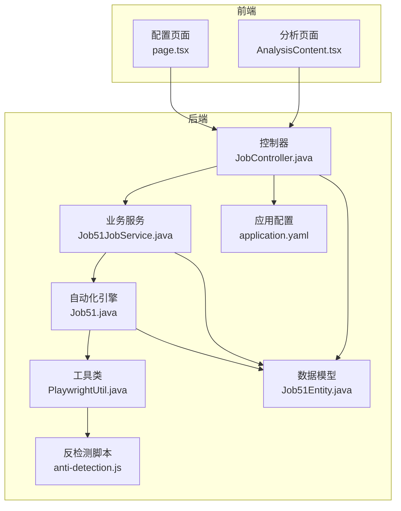
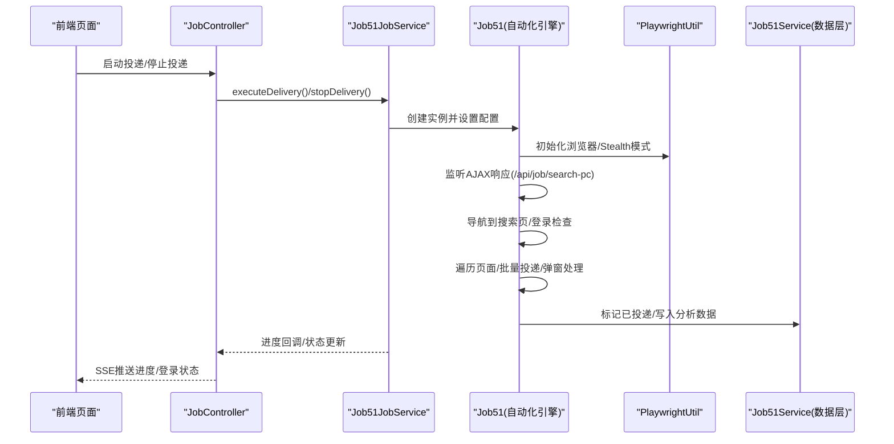
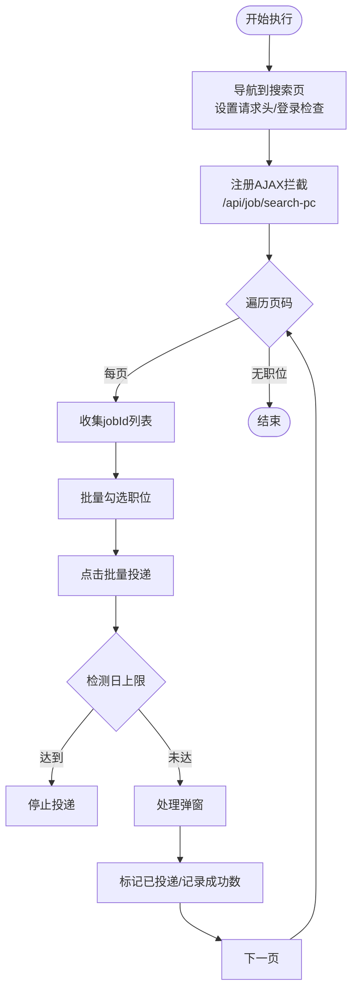
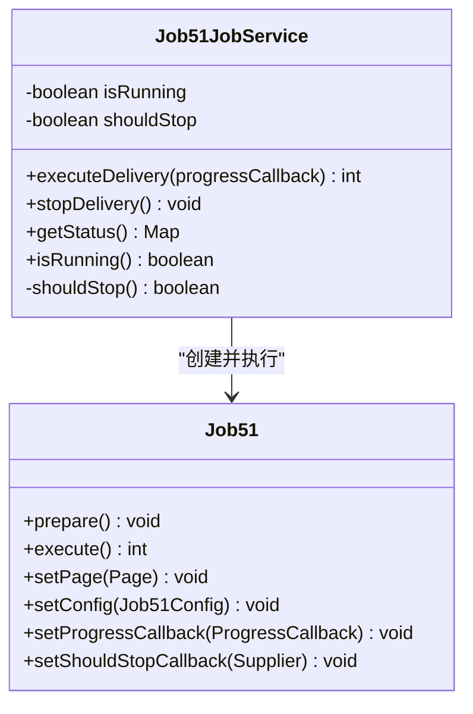
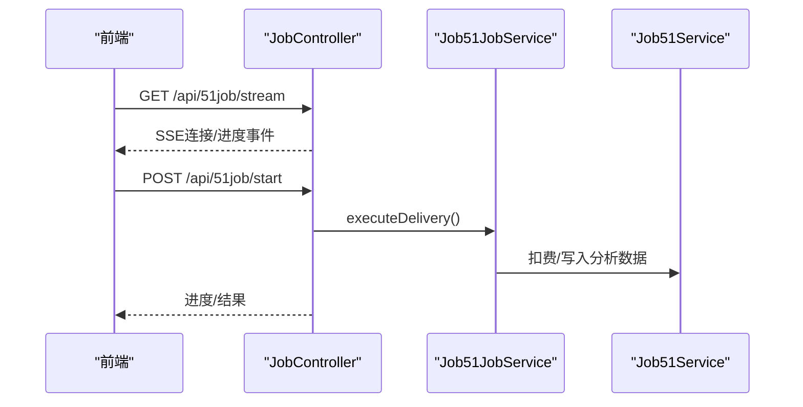
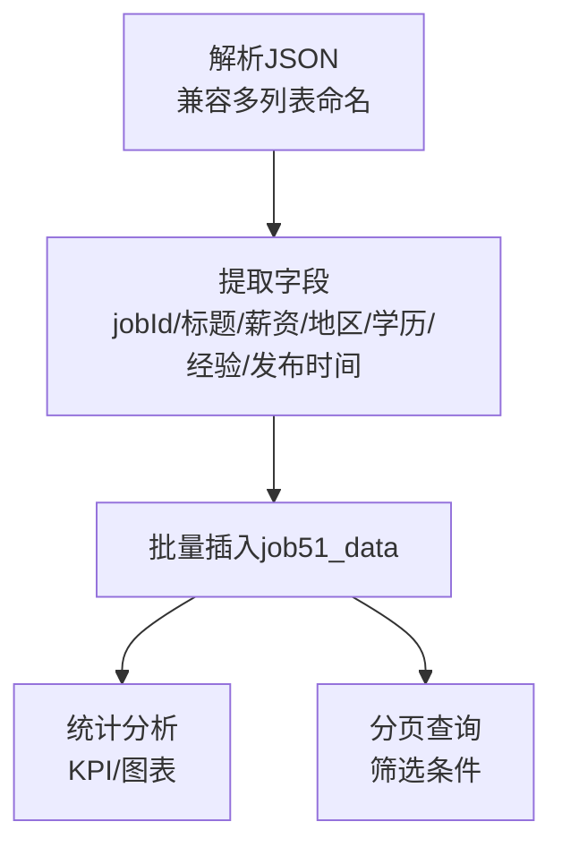
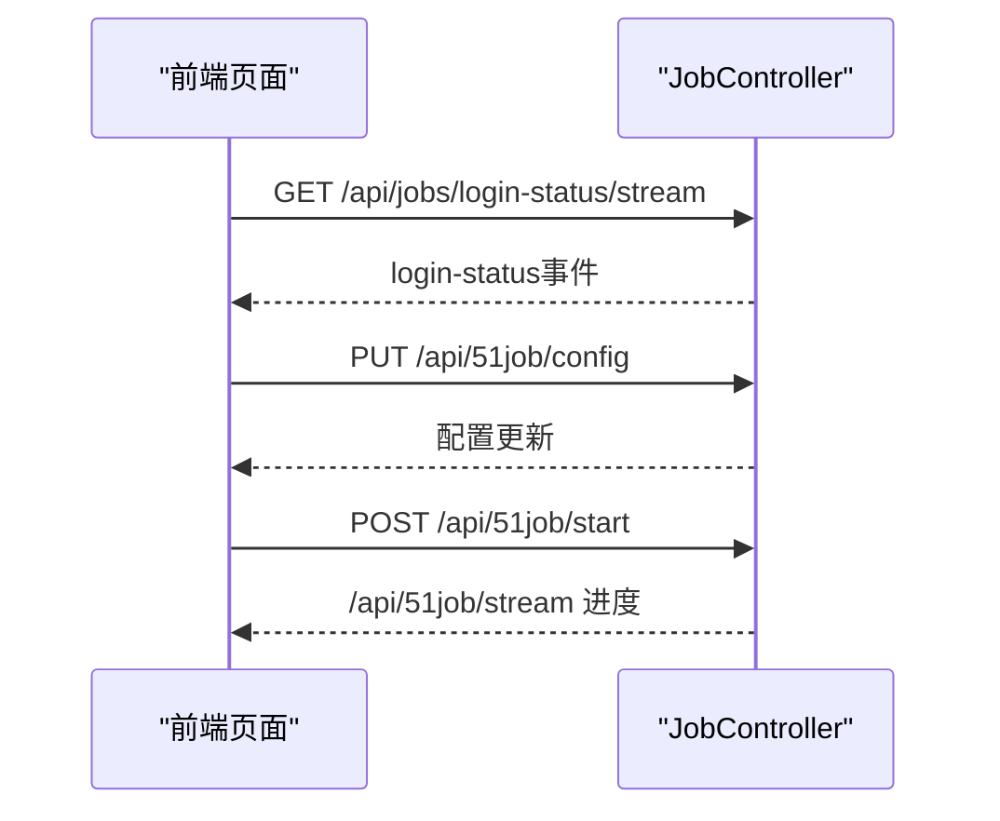
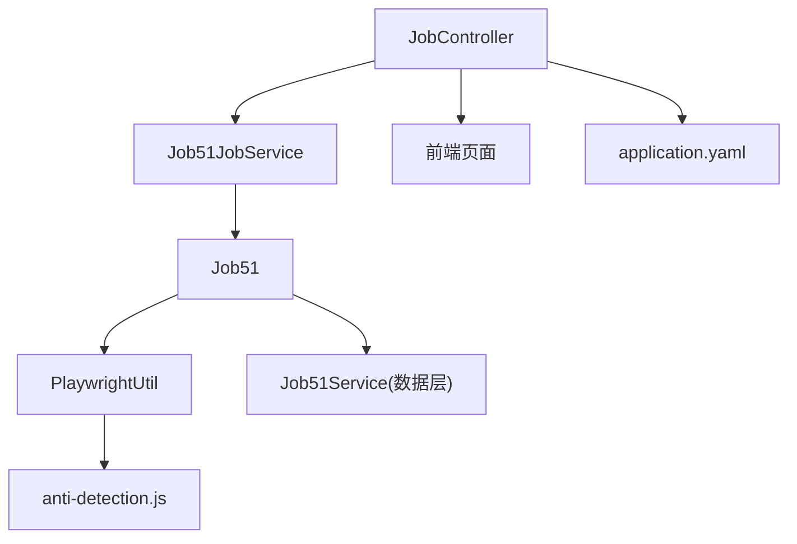

# 51job平台问题

<cite>
**本文档引用的文件**
- [Job51.java](file://backend/src/main/java/com/getjobs/worker/job51/Job51.java)
- [Job51Config.java](file://backend/src/main/java/com/getjobs/worker/job51/Job51Config.java)
- [Job51JobService.java](file://backend/src/main/java/com/getjobs/worker/service/Job51JobService.java)
- [JobController.java](file://backend/src/main/java/com/getjobs/application/controller/JobController.java)
- [Job51Service.java](file://backend/src/main/java/com/getjobs/application/service/Job51Service.java)
- [Job51Entity.java](file://backend/src/main/java/com/getjobs/application/entity/Job51Entity.java)
- [PlaywrightUtil.java](file://backend/src/main/java/com/getjobs/worker/utils/PlaywrightUtil.java)
- [application.yaml](file://backend/src/main/resources/application.yaml)
- [anti-detection.js](file://backend/src/main/resources/anti-detection.js)
- [page.tsx](file://front/app/51job/page.tsx)
- [AnalysisContent.tsx](file://front/app/51job/analysis/AnalysisContent.tsx)
</cite>

## 目录
1. [简介](#简介)
2. [项目结构](#项目结构)
3. [核心组件](#核心组件)
4. [架构概览](#架构概览)
5. [详细组件分析](#详细组件分析)
6. [依赖分析](#依赖分析)
7. [性能考虑](#性能考虑)
8. [故障排除指南](#故障排除指南)
9. [结论](#结论)
10. [附录](#附录)

## 简介
本文件针对51job平台的自动化投递系统提供专门的问题解决指南。内容涵盖页面结构特点、投递流程差异、反检测机制、搜索功能优化、岗位详情解析、AJAX请求处理、投递结果确认、页面元素变化处理、登录状态监控、以及政策变化应对策略等技术要点。文档同时提供调试技巧、合规建议和最佳实践，帮助开发者高效定位和解决51job平台特有的技术问题。

## 项目结构
整体采用前后端分离架构：
- 后端（Spring Boot + Playwright）负责自动化投递、数据持久化、配置管理、登录状态监控与SSE推送。
- 前端（Next.js）提供配置界面、实时进度展示、投递分析与图表展示。

**图表来源**
- [page.tsx:1-671](file://front/app/51job/page.tsx#L1-L671)
- [AnalysisContent.tsx:1-311](file://front/app/51job/analysis/AnalysisContent.tsx#L1-L311)
- [JobController.java:1-589](file://backend/src/main/java/com/getjobs/application/controller/JobController.java#L1-L589)
- [Job51JobService.java:1-149](file://backend/src/main/java/com/getjobs/worker/service/Job51JobService.java#L1-L149)
- [Job51.java:1-908](file://backend/src/main/java/com/getjobs/worker/job51/Job51.java#L1-L908)
- [PlaywrightUtil.java:1-610](file://backend/src/main/java/com/getjobs/worker/utils/PlaywrightUtil.java#L1-L610)
- [anti-detection.js:1-109](file://backend/src/main/resources/anti-detection.js#L1-L109)
- [Job51Entity.java:1-76](file://backend/src/main/java/com/getjobs/application/entity/Job51Entity.java#L1-L76)
- [application.yaml:1-101](file://backend/src/main/resources/application.yaml#L1-L101)

**章节来源**
- [page.tsx:1-671](file://front/app/51job/page.tsx#L1-L671)
- [AnalysisContent.tsx:1-311](file://front/app/51job/analysis/AnalysisContent.tsx#L1-L311)
- [JobController.java:1-589](file://backend/src/main/java/com/getjobs/application/controller/JobController.java#L1-L589)
- [Job51JobService.java:1-149](file://backend/src/main/java/com/getjobs/worker/service/Job51JobService.java#L1-L149)
- [Job51.java:1-908](file://backend/src/main/java/com/getjobs/worker/job51/Job51.java#L1-L908)
- [PlaywrightUtil.java:1-610](file://backend/src/main/java/com/getjobs/worker/utils/PlaywrightUtil.java#L1-L610)
- [anti-detection.js:1-109](file://backend/src/main/resources/anti-detection.js#L1-L109)
- [Job51Entity.java:1-76](file://backend/src/main/java/com/getjobs/application/entity/Job51Entity.java#L1-L76)
- [application.yaml:1-101](file://backend/src/main/resources/application.yaml#L1-L101)

## 核心组件
- 自动化引擎（Job51）：负责页面导航、AJAX拦截、元素交互、弹窗处理、日投递上限检测、黑名单过滤、投递结果确认与状态标记。
- 任务服务（Job51JobService）：协调Playwright页面生命周期、登录状态检查、配置加载、进度回调与停止信号。
- 控制器（JobController）：提供SSE进度流、登录状态流、配置读写、启动/停止任务、健康检查与分析接口。
- 业务服务（Job51Service）：解析51job搜索接口JSON、批量入库、投递状态写回、统计分析与分页查询。
- 实体模型（Job51Entity）：定义job51_data表字段，支撑投递状态与分析统计。
- 工具类（PlaywrightUtil）：封装浏览器初始化、Stealth模式、Cookie管理、截图与元素操作。
- 反检测脚本（anti-detection.js）：劫持Function.prototype.toString等特征，降低被检测概率。
- 前端页面：配置界面（page.tsx）、分析界面（AnalysisContent.tsx），支持SSE连接、登录状态监听、配置保存与投递控制。

**章节来源**
- [Job51.java:1-908](file://backend/src/main/java/com/getjobs/worker/job51/Job51.java#L1-L908)
- [Job51JobService.java:1-149](file://backend/src/main/java/com/getjobs/worker/service/Job51JobService.java#L1-L149)
- [JobController.java:1-589](file://backend/src/main/java/com/getjobs/application/controller/JobController.java#L1-L589)
- [Job51Service.java:1-725](file://backend/src/main/java/com/getjobs/application/service/Job51Service.java#L1-L725)
- [Job51Entity.java:1-76](file://backend/src/main/java/com/getjobs/application/entity/Job51Entity.java#L1-L76)
- [PlaywrightUtil.java:1-610](file://backend/src/main/java/com/getjobs/worker/utils/PlaywrightUtil.java#L1-L610)
- [anti-detection.js:1-109](file://backend/src/main/resources/anti-detection.js#L1-L109)
- [page.tsx:1-671](file://front/app/51job/page.tsx#L1-L671)
- [AnalysisContent.tsx:1-311](file://front/app/51job/analysis/AnalysisContent.tsx#L1-L311)

## 架构概览
系统通过SSE实现前后端实时通信，后端在任务执行期间持续推送进度与登录状态变更。自动化引擎通过Playwright驱动浏览器，拦截51job搜索接口的JSON响应，解析并入库，同时处理页面交互与反检测。

**图表来源**
- [JobController.java:58-232](file://backend/src/main/java/com/getjobs/application/controller/JobController.java#L58-L232)
- [Job51JobService.java:37-111](file://backend/src/main/java/com/getjobs/worker/service/Job51JobService.java#L37-L111)
- [Job51.java:68-248](file://backend/src/main/java/com/getjobs/worker/job51/Job51.java#L68-L248)
- [PlaywrightUtil.java:44-78](file://backend/src/main/java/com/getjobs/worker/utils/PlaywrightUtil.java#L44-L78)
- [Job51Service.java:290-356](file://backend/src/main/java/com/getjobs/application/service/Job51Service.java#L290-L356)

**章节来源**
- [JobController.java:58-232](file://backend/src/main/java/com/getjobs/application/controller/JobController.java#L58-L232)
- [Job51JobService.java:37-111](file://backend/src/main/java/com/getjobs/worker/service/Job51JobService.java#L37-L111)
- [Job51.java:68-248](file://backend/src/main/java/com/getjobs/worker/job51/Job51.java#L68-L248)
- [PlaywrightUtil.java:44-78](file://backend/src/main/java/com/getjobs/worker/utils/PlaywrightUtil.java#L44-L78)
- [Job51Service.java:290-356](file://backend/src/main/java/com/getjobs/application/service/Job51Service.java#L290-L356)

## 详细组件分析

### 自动化引擎（Job51）分析
- 页面导航与登录检查：设置请求头、导航到搜索页，检查用户名元素判断是否需要登录。
- AJAX拦截：监听/search-pc接口，解析JSON并保存到数据库，同时抽取jobId列表用于后续标记。
- 页面遍历：支持跳页、检测“无职位”提示、批量勾选职位、点击批量投递按钮。
- 弹窗处理：处理“下载App”提示、“投递成功/未投递”弹窗与“单独投递申请”弹窗，支持多种关闭策略与兜底方案。
- 日投递上限检测：点击投递后快速轮询检测提示，防止超限。
- 黑名单过滤：结合公共黑名单服务过滤职位。
- 结果确认与标记：解析弹窗中的成功/失败数量，标记数据库中对应jobId为已投递，并记录到Bot。

**图表来源**
- [Job51.java:116-179](file://backend/src/main/java/com/getjobs/worker/job51/Job51.java#L116-L179)
- [Job51.java:208-244](file://backend/src/main/java/com/getjobs/worker/job51/Job51.java#L208-L244)
- [Job51.java:327-365](file://backend/src/main/java/com/getjobs/worker/job51/Job51.java#L327-L365)
- [Job51.java:370-490](file://backend/src/main/java/com/getjobs/worker/job51/Job51.java#L370-L490)
- [Job51.java:637-668](file://backend/src/main/java/com/getjobs/worker/job51/Job51.java#L637-L668)
- [Job51.java:691-719](file://backend/src/main/java/com/getjobs/worker/job51/Job51.java#L691-L719)

**章节来源**
- [Job51.java:68-248](file://backend/src/main/java/com/getjobs/worker/job51/Job51.java#L68-L248)
- [Job51.java:327-365](file://backend/src/main/java/com/getjobs/worker/job51/Job51.java#L327-L365)
- [Job51.java:370-490](file://backend/src/main/java/com/getjobs/worker/job51/Job51.java#L370-L490)
- [Job51.java:637-668](file://backend/src/main/java/com/getjobs/worker/job51/Job51.java#L637-L668)
- [Job51.java:691-719](file://backend/src/main/java/com/getjobs/worker/job51/Job51.java#L691-L719)

### 任务服务（Job51JobService）分析
- 生命周期管理：暂停后台登录监控、加载配置、创建Job51实例、设置进度回调、执行任务、恢复监控。
- 停止信号：通过volatile标志位与shouldStop()方法实现优雅停止。
- 状态查询：提供运行状态、登录状态查询接口。
- 进度回调：拦截特定警告（如“当前页未采集到任何jobId”）并转换为停止信号。

**图表来源**
- [Job51JobService.java:25-149](file://backend/src/main/java/com/getjobs/worker/service/Job51JobService.java#L25-L149)
- [Job51.java:60-107](file://backend/src/main/java/com/getjobs/worker/job51/Job51.java#L60-L107)

**章节来源**
- [Job51JobService.java:37-111](file://backend/src/main/java/com/getjobs/worker/service/Job51JobService.java#L37-L111)

### 控制器（JobController）分析
- SSE进度流：/api/51job/stream推送投递进度，/api/jobs/login-status/stream推送登录状态。
- 配置管理：/api/51job/config读取/更新配置，/api/51job/config/options/*获取选项。
- 登录控制：/api/51job/login触发登录、/api/51job/login-status检查状态、/api/51job/logout退出登录。
- 任务控制：/api/51job/start启动任务、/api/51job/stop停止任务、/api/51job/status查询状态。
- 分析接口：/api/51job/stats统计、/api/51job/list分页、/api/51job/reload刷新。

**图表来源**
- [JobController.java:58-232](file://backend/src/main/java/com/getjobs/application/controller/JobController.java#L58-L232)
- [JobController.java:386-443](file://backend/src/main/java/com/getjobs/application/controller/JobController.java#L386-L443)
- [Job51JobService.java:72-98](file://backend/src/main/java/com/getjobs/worker/service/Job51JobService.java#L72-L98)
- [Job51Service.java:364-413](file://backend/src/main/java/com/getjobs/application/service/Job51Service.java#L364-L413)

**章节来源**
- [JobController.java:58-232](file://backend/src/main/java/com/getjobs/application/controller/JobController.java#L58-L232)
- [JobController.java:386-443](file://backend/src/main/java/com/getjobs/application/controller/JobController.java#L386-L443)

### 业务服务（Job51Service）分析
- JSON解析：兼容多种列表命名（data.items、data.jobList等），提取岗位字段并批量入库。
- 投递状态写回：支持单条与批量标记已投递。
- 统计分析：按状态、城市、行业、公司、经验、学历、薪资区间聚合，生成KPI与图表数据。
- 分页查询：支持关键词、状态、地区、经验、学历、薪资区间筛选。

**图表来源**
- [Job51Service.java:290-356](file://backend/src/main/java/com/getjobs/application/service/Job51Service.java#L290-L356)
- [Job51Service.java:417-546](file://backend/src/main/java/com/getjobs/application/service/Job51Service.java#L417-L546)
- [Job51Service.java:548-625](file://backend/src/main/java/com/getjobs/application/service/Job51Service.java#L548-L625)

**章节来源**
- [Job51Service.java:290-356](file://backend/src/main/java/com/getjobs/application/service/Job51Service.java#L290-L356)
- [Job51Service.java:417-546](file://backend/src/main/java/com/getjobs/application/service/Job51Service.java#L417-L546)
- [Job51Service.java:548-625](file://backend/src/main/java/com/getjobs/application/service/Job51Service.java#L548-L625)

### 前端页面（page.tsx/AnalysisContent.tsx）分析
- 配置界面：关键词、城市区域、薪资范围多选，支持SSE登录状态监听、保存配置与Cookie。
- 分析界面：筛选条件（状态、地区、经验、学历、薪资区间、关键词）、图表展示、CSV导出、分页列表。
- SSE连接：自动重连、心跳、错误处理。

**图表来源**
- [page.tsx:67-124](file://front/app/51job/page.tsx#L67-L124)
- [page.tsx:345-398](file://front/app/51job/page.tsx#L345-L398)
- [AnalysisContent.tsx:135-145](file://front/app/51job/analysis/AnalysisContent.tsx#L135-L145)

**章节来源**
- [page.tsx:67-124](file://front/app/51job/page.tsx#L67-L124)
- [page.tsx:345-398](file://front/app/51job/page.tsx#L345-L398)
- [AnalysisContent.tsx:135-145](file://front/app/51job/analysis/AnalysisContent.tsx#L135-L145)

## 依赖分析
- 组件耦合：Job51JobService依赖PlaywrightManager与Job51实例；Job51依赖Job51Service进行数据持久化；控制器依赖服务层与SSE推送。
- 外部依赖：Playwright浏览器、MySQL数据库、SSE客户端（EventSource）。
- 反检测：Stealth模式注入、请求头伪装、函数toString劫持。

**图表来源**
- [JobController.java:1-589](file://backend/src/main/java/com/getjobs/application/controller/JobController.java#L1-L589)
- [Job51JobService.java:1-149](file://backend/src/main/java/com/getjobs/worker/service/Job51JobService.java#L1-L149)
- [Job51.java:1-908](file://backend/src/main/java/com/getjobs/worker/job51/Job51.java#L1-L908)
- [PlaywrightUtil.java:1-610](file://backend/src/main/java/com/getjobs/worker/utils/PlaywrightUtil.java#L1-L610)
- [anti-detection.js:1-109](file://backend/src/main/resources/anti-detection.js#L1-L109)
- [application.yaml:70-101](file://backend/src/main/resources/application.yaml#L70-L101)

**章节来源**
- [JobController.java:1-589](file://backend/src/main/java/com/getjobs/application/controller/JobController.java#L1-L589)
- [Job51JobService.java:1-149](file://backend/src/main/java/com/getjobs/worker/service/Job51JobService.java#L1-L149)
- [Job51.java:1-908](file://backend/src/main/java/com/getjobs/worker/job51/Job51.java#L1-L908)
- [PlaywrightUtil.java:1-610](file://backend/src/main/java/com/getjobs/worker/utils/PlaywrightUtil.java#L1-L610)
- [anti-detection.js:1-109](file://backend/src/main/resources/anti-detection.js#L1-L109)
- [application.yaml:70-101](file://backend/src/main/resources/application.yaml#L70-L101)

## 性能考虑
- 超时与重试：application.yaml中为51job平台设置了更高的导航超时与重试策略，提升稳定性。
- 慢动作与等待：PlaywrightUtil默认启用慢动作模式，便于调试但可能影响性能，生产环境可调整。
- 资源管理：限制最大页面数、空闲回收时间，避免资源泄漏。
- AJAX拦截：仅拦截/search-pc接口，减少无关请求开销。
- 批量操作：批量标记投递状态、批量插入数据库，降低IO压力。

**章节来源**
- [application.yaml:70-101](file://backend/src/main/resources/application.yaml#L70-L101)
- [PlaywrightUtil.java:44-78](file://backend/src/main/java/com/getjobs/worker/utils/PlaywrightUtil.java#L44-L78)
- [Job51.java:116-179](file://backend/src/main/java/com/getjobs/worker/job51/Job51.java#L116-L179)
- [Job51Service.java:244-288](file://backend/src/main/java/com/getjobs/application/service/Job51Service.java#L244-L288)

## 故障排除指南

### 页面结构变化处理
- 症状：当前页未采集到任何jobId，疑似页面结构变化或选择器不匹配。
- 处理：Job51在检测到采集为空时，会设置日上限标记并停止任务，同时向前端推送警告。建议检查选择器与页面元素变化，必要时更新定位策略。
- 参考路径：
  - [Job51.java:735-797](file://backend/src/main/java/com/getjobs/worker/job51/Job51.java#L735-L797)
  - [Job51JobService.java:72-85](file://backend/src/main/java/com/getjobs/worker/service/Job51JobService.java#L72-L85)

**章节来源**
- [Job51.java:735-797](file://backend/src/main/java/com/getjobs/worker/job51/Job51.java#L735-L797)
- [Job51JobService.java:72-85](file://backend/src/main/java/com/getjobs/worker/service/Job51JobService.java#L72-L85)

### AJAX请求处理
- 症状：搜索结果未入库或解析失败。
- 处理：确保AJAX拦截已注册且URL包含/search-pc；检查JSON结构兼容性；确认Content-Type为JSON；查看parseAndPersistJob51SearchJson的解析分支。
- 参考路径：
  - [Job51.java:116-179](file://backend/src/main/java/com/getjobs/worker/job51/Job51.java#L116-L179)
  - [Job51Service.java:290-356](file://backend/src/main/java/com/getjobs/application/service/Job51Service.java#L290-L356)

**章节来源**
- [Job51.java:116-179](file://backend/src/main/java/com/getjobs/worker/job51/Job51.java#L116-L179)
- [Job51Service.java:290-356](file://backend/src/main/java/com/getjobs/application/service/Job51Service.java#L290-L356)

### 投递结果确认
- 症状：投递成功弹窗未识别或关闭失败。
- 处理：使用多种选择器与关闭策略（确定按钮、关闭图标、header按钮、JS兜底、ESC键）；点击后再次检测日上限提示。
- 参考路径：
  - [Job51.java:370-490](file://backend/src/main/java/com/getjobs/worker/job51/Job51.java#L370-L490)
  - [Job51.java:637-668](file://backend/src/main/java/com/getjobs/worker/job51/Job51.java#L637-L668)

**章节来源**
- [Job51.java:370-490](file://backend/src/main/java/com/getjobs/worker/job51/Job51.java#L370-L490)
- [Job51.java:637-668](file://backend/src/main/java/com/getjobs/worker/job51/Job51.java#L637-L668)

### 登录状态监控与SSE
- 症状：前端无法接收登录状态或进度流。
- 处理：检查SSE连接是否建立、EventSource是否可用、心跳与错误重连逻辑；确认后端SSE端点与心跳定时任务正常。
- 参考路径：
  - [page.tsx:67-124](file://front/app/51job/page.tsx#L67-L124)
  - [JobController.java:58-232](file://backend/src/main/java/com/getjobs/application/controller/JobController.java#L58-L232)

**章节来源**
- [page.tsx:67-124](file://front/app/51job/page.tsx#L67-L124)
- [JobController.java:58-232](file://backend/src/main/java/com/getjobs/application/controller/JobController.java#L58-L232)

### 反检测与浏览器特征
- 症状：被识别为自动化或触发访问验证。
- 处理：启用Stealth模式、设置请求头、注入anti-detection脚本；避免高频操作与异常行为。
- 参考路径：
  - [PlaywrightUtil.java:425-487](file://backend/src/main/java/com/getjobs/worker/utils/PlaywrightUtil.java#L425-L487)
  - [anti-detection.js:1-109](file://backend/src/main/resources/anti-detection.js#L1-L109)

**章节来源**
- [PlaywrightUtil.java:425-487](file://backend/src/main/java/com/getjobs/worker/utils/PlaywrightUtil.java#L425-L487)
- [anti-detection.js:1-109](file://backend/src/main/resources/anti-detection.js#L1-L109)

### 配置与Cookie管理
- 症状：配置未生效或登录状态异常。
- 处理：通过控制器读取/更新配置；保存Cookie到数据库；退出登录时清理Cookie。
- 参考路径：
  - [JobController.java:236-284](file://backend/src/main/java/com/getjobs/application/controller/JobController.java#L236-L284)
  - [JobController.java:340-383](file://backend/src/main/java/com/getjobs/application/controller/JobController.java#L340-L383)
  - [JobController.java:321-338](file://backend/src/main/java/com/getjobs/application/controller/JobController.java#L321-L338)

**章节来源**
- [JobController.java:236-284](file://backend/src/main/java/com/getjobs/application/controller/JobController.java#L236-L284)
- [JobController.java:340-383](file://backend/src/main/java/com/getjobs/application/controller/JobController.java#L340-L383)
- [JobController.java:321-338](file://backend/src/main/java/com/getjobs/application/controller/JobController.java#L321-L338)

## 结论
51job平台的自动化投递系统通过Playwright实现稳定的页面交互与反检测能力，配合SSE实现实时进度与登录状态反馈。面对页面结构变化、AJAX接口差异与反检测挑战，系统提供了完善的拦截、解析、标记与兜底机制。建议在生产环境中合理配置超时与重试策略，持续监控登录状态与SSE连接，定期更新选择器与解析逻辑，确保系统的稳定性与合规性。

## 附录

### 51job平台特性与差异
- 搜索接口：拦截/search-pc GET请求，解析多样的JSON结构。
- 页面元素：使用ElementUI组件（.el-dialog__body/.el-message等），需多策略处理弹窗。
- 投递流程：批量勾选→批量投递→弹窗确认→状态标记。
- 反检测：Stealth模式、请求头伪装、函数toString劫持。

**章节来源**
- [Job51.java:116-179](file://backend/src/main/java/com/getjobs/worker/job51/Job51.java#L116-L179)
- [Job51.java:370-490](file://backend/src/main/java/com/getjobs/worker/job51/Job51.java#L370-L490)
- [PlaywrightUtil.java:425-487](file://backend/src/main/java/com/getjobs/worker/utils/PlaywrightUtil.java#L425-L487)
- [anti-detection.js:1-109](file://backend/src/main/resources/anti-detection.js#L1-L109)

### 调试技巧清单
- 使用SSE调试：观察login-status与progress事件，确认连接与心跳。
- 截图定位：在关键步骤截图，检查元素是否存在与可见性。
- 日志级别：提高后端日志级别，关注AJAX拦截、弹窗处理与状态标记。
- 选择器验证：在浏览器控制台验证定位表达式，确保与页面结构一致。
- 反检测验证：检查Stealth模式是否生效，请求头是否正确。

**章节来源**
- [page.tsx:67-124](file://front/app/51job/page.tsx#L67-L124)
- [PlaywrightUtil.java:288-316](file://backend/src/main/java/com/getjobs/worker/utils/PlaywrightUtil.java#L288-L316)

### 合规建议
- 遵守51job平台的robots协议与服务条款，避免过度频繁的请求。
- 尊重用户隐私与数据保护法规，仅处理公开信息与授权范围内的数据。
- 定期更新反检测策略，避免使用过于激进的手段导致账户受限。
- 建立监控与告警机制，及时发现并处理异常情况。