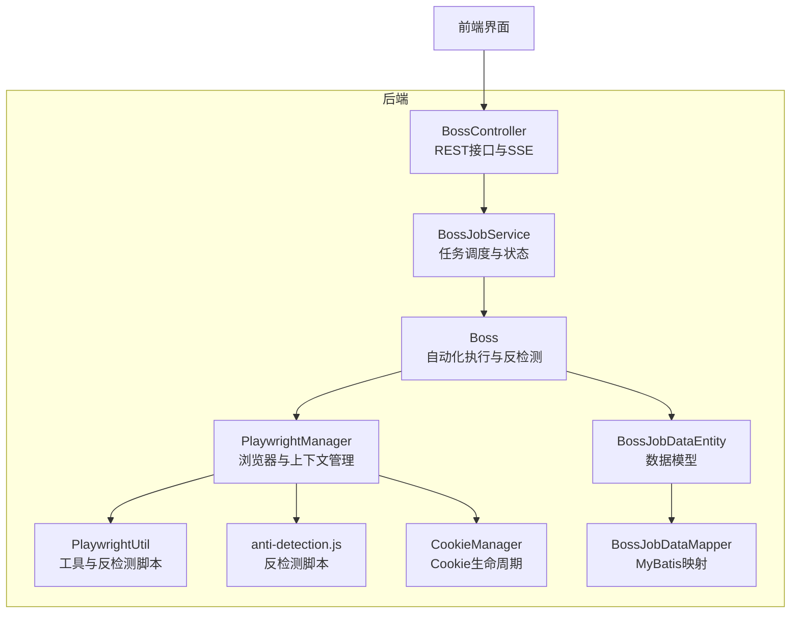
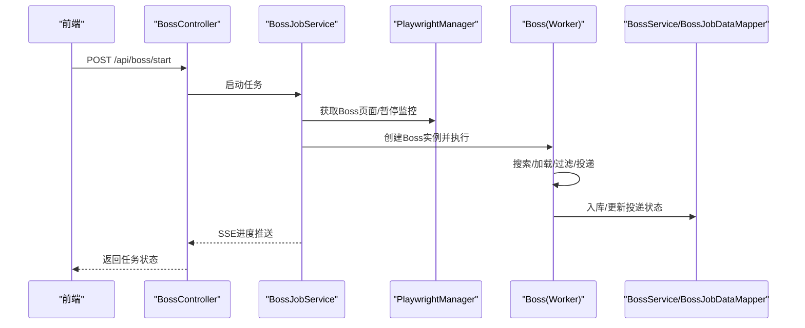
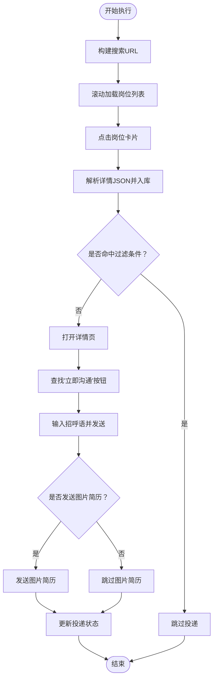
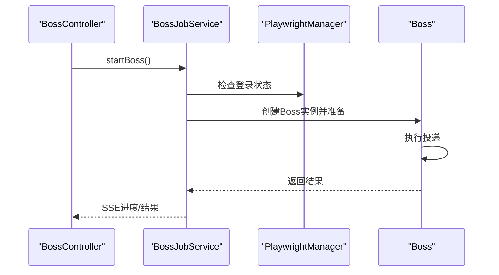
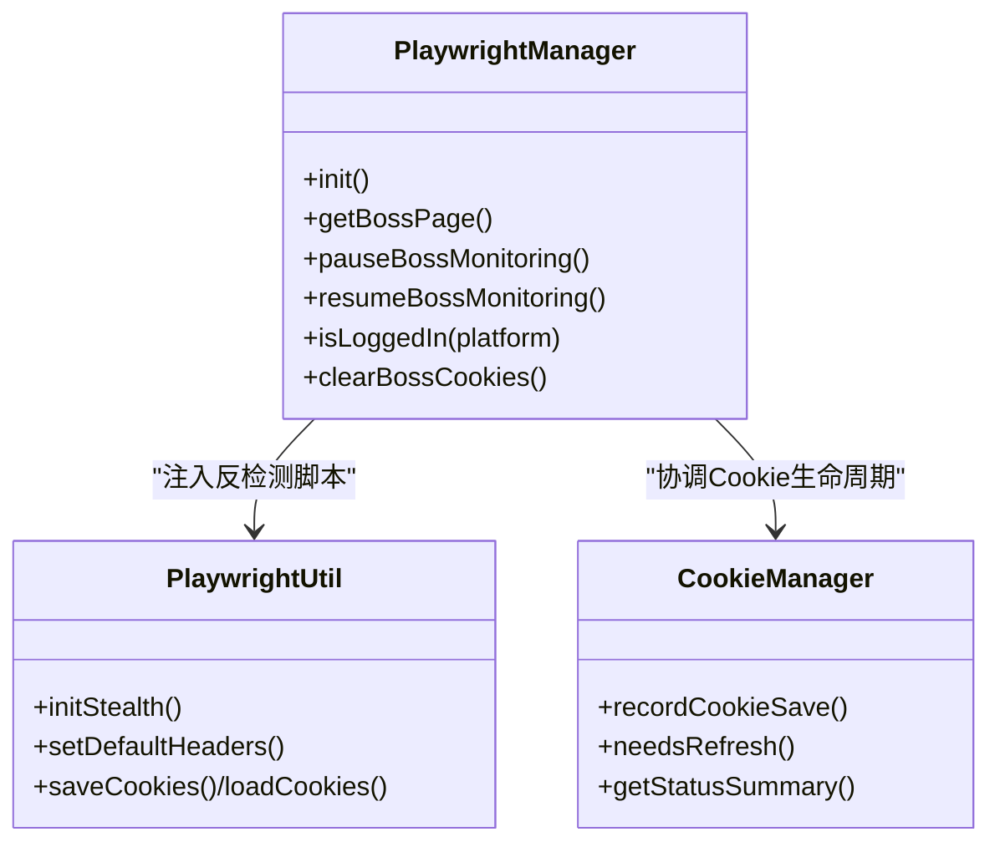
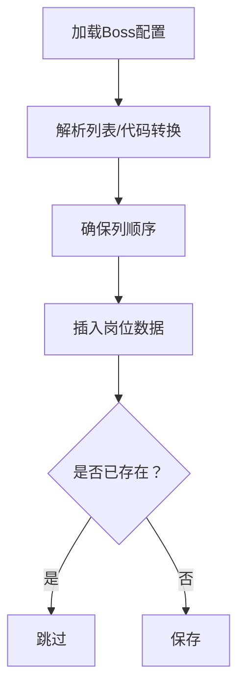
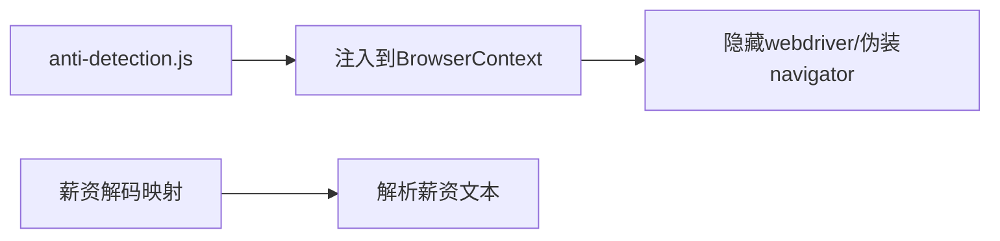
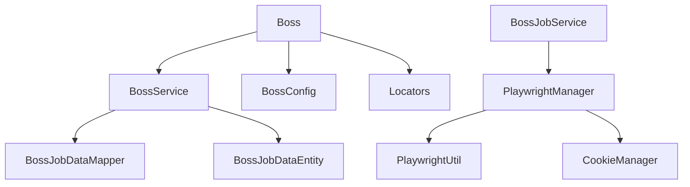

# Boss直聘平台问题

<cite>
**本文档引用的文件**
- [Boss.java](file://backend/src/main/java/com/getjobs/worker/boss/Boss.java)
- [BossConfig.java](file://backend/src/main/java/com/getjobs/worker/boss/BossConfig.java)
- [Locators.java](file://backend/src/main/java/com/getjobs/worker/boss/Locators.java)
- [BossJobService.java](file://backend/src/main/java/com/getjobs/worker/service/BossJobService.java)
- [BossController.java](file://backend/src/main/java/com/getjobs/application/controller/BossController.java)
- [PlaywrightUtil.java](file://backend/src/main/java/com/getjobs/worker/utils/PlaywrightUtil.java)
- [PlaywrightManager.java](file://backend/src/main/java/com/getjobs/worker/manager/PlaywrightManager.java)
- [BossService.java](file://backend/src/main/java/com/getjobs/application/service/BossService.java)
- [BossJobDataEntity.java](file://backend/src/main/java/com/getjobs/application/entity/BossJobDataEntity.java)
- [CookieManager.java](file://backend/src/main/java/com/getjobs/worker/utils/CookieManager.java)
- [BossJobDataMapper.java](file://backend/src/main/java/com/getjobs/application/mapper/BossJobDataMapper.java)
- [anti-detection.js](file://backend/src/main/resources/anti-detection.js)
</cite>

## 目录
1. [简介](#简介)
2. [项目结构](#项目结构)
3. [核心组件](#核心组件)
4. [架构总览](#架构总览)
5. [详细组件分析](#详细组件分析)
6. [依赖关系分析](#依赖关系分析)
7. [性能考虑](#性能考虑)
8. [故障排除指南](#故障排除指南)
9. [结论](#结论)
10. [附录](#附录)

## 简介
本文件面向需要处理 Boss 直聘平台特定问题的用户，系统性梳理项目在反检测机制、验证码处理、登录限制、投递规则、页面结构调整、API 接口变更、字体反爬虫机制等方面的应对方案，并提供调试技巧与合规建议。文档基于仓库中的真实代码实现，涵盖前端与后端协同的完整流程，帮助读者快速定位问题并制定解决方案。

## 项目结构
项目采用前后端分离架构，后端使用 Spring Boot + Playwright 实现自动化流程，前端提供可视化界面与进度推送。Boss 相关的核心模块集中在 worker 与 application 两个包下，分别负责自动化执行与业务服务。

**图示来源**
- [BossController.java:1-246](file://backend/src/main/java/com/getjobs/application/controller/BossController.java#L1-L246)
- [BossJobService.java:1-143](file://backend/src/main/java/com/getjobs/worker/service/BossJobService.java#L1-L143)
- [Boss.java:1-1173](file://backend/src/main/java/com/getjobs/worker/boss/Boss.java#L1-L1173)
- [PlaywrightManager.java:1-800](file://backend/src/main/java/com/getjobs/worker/manager/PlaywrightManager.java#L1-L800)
- [PlaywrightUtil.java:1-610](file://backend/src/main/java/com/getjobs/worker/utils/PlaywrightUtil.java#L1-L610)
- [anti-detection.js:1-109](file://backend/src/main/resources/anti-detection.js#L1-L109)
- [BossJobDataEntity.java:1-108](file://backend/src/main/java/com/getjobs/application/entity/BossJobDataEntity.java#L1-L108)
- [BossJobDataMapper.java:1-9](file://backend/src/main/java/com/getjobs/application/mapper/BossJobDataMapper.java#L1-L9)
- [CookieManager.java:1-259](file://backend/src/main/java/com/getjobs/worker/utils/CookieManager.java#L1-L259)

**章节来源**
- [BossController.java:1-246](file://backend/src/main/java/com/getjobs/application/controller/BossController.java#L1-L246)
- [BossJobService.java:1-143](file://backend/src/main/java/com/getjobs/worker/service/BossJobService.java#L1-L143)
- [Boss.java:1-1173](file://backend/src/main/java/com/getjobs/worker/boss/Boss.java#L1-L1173)
- [PlaywrightManager.java:1-800](file://backend/src/main/java/com/getjobs/worker/manager/PlaywrightManager.java#L1-L800)
- [PlaywrightUtil.java:1-610](file://backend/src/main/java/com/getjobs/worker/utils/PlaywrightUtil.java#L1-L610)
- [anti-detection.js:1-109](file://backend/src/main/resources/anti-detection.js#L1-L109)
- [BossJobDataEntity.java:1-108](file://backend/src/main/java/com/getjobs/application/entity/BossJobDataEntity.java#L1-L108)
- [BossJobDataMapper.java:1-9](file://backend/src/main/java/com/getjobs/application/mapper/BossJobDataMapper.java#L1-L9)
- [CookieManager.java:1-259](file://backend/src/main/java/com/getjobs/worker/utils/CookieManager.java#L1-L259)

## 核心组件
- Boss 自动化执行器：负责搜索、加载、过滤、投递全流程，内置反检测与字体反爬虫处理。
- BossJobService：任务调度与状态管理，提供 SSE 进度推送与停止控制。
- PlaywrightManager：浏览器与上下文管理，统一注入反检测脚本，监控登录状态。
- PlaywrightUtil：通用工具与反检测脚本注入，增强浏览器不可检测性。
- BossService：数据访问与配置加载，提供去重、统计与黑名单管理。
- CookieManager：Cookie 生命周期管理，支持预估有效期与自动刷新。

**章节来源**
- [Boss.java:1-1173](file://backend/src/main/java/com/getjobs/worker/boss/Boss.java#L1-L1173)
- [BossJobService.java:1-143](file://backend/src/main/java/com/getjobs/worker/service/BossJobService.java#L1-L143)
- [PlaywrightManager.java:1-800](file://backend/src/main/java/com/getjobs/worker/manager/PlaywrightManager.java#L1-L800)
- [PlaywrightUtil.java:1-610](file://backend/src/main/java/com/getjobs/worker/utils/PlaywrightUtil.java#L1-L610)
- [BossService.java:1-1129](file://backend/src/main/java/com/getjobs/application/service/BossService.java#L1-L1129)
- [CookieManager.java:1-259](file://backend/src/main/java/com/getjobs/worker/utils/CookieManager.java#L1-L259)

## 架构总览
Boss 直聘自动化流程从前端发起任务，后端通过 BossJobService 启动 Boss 执行器，利用 PlaywrightManager 管理浏览器上下文并注入反检测脚本，Boss 执行器在页面中完成搜索、加载、过滤与投递，并将结果持久化至数据库。

**图示来源**
- [BossController.java:70-148](file://backend/src/main/java/com/getjobs/application/controller/BossController.java#L70-L148)
- [BossJobService.java:37-104](file://backend/src/main/java/com/getjobs/worker/service/BossJobService.java#L37-L104)
- [PlaywrightManager.java:114-221](file://backend/src/main/java/com/getjobs/worker/manager/PlaywrightManager.java#L114-L221)
- [Boss.java:112-434](file://backend/src/main/java/com/getjobs/worker/boss/Boss.java#L112-L434)
- [BossService.java:624-677](file://backend/src/main/java/com/getjobs/application/service/BossService.java#L624-L677)
- [BossJobDataMapper.java:1-9](file://backend/src/main/java/com/getjobs/application/mapper/BossJobDataMapper.java#L1-L9)

## 详细组件分析

### Boss 自动化执行器
- 搜索与分页：构建搜索 URL，按城市与关键词遍历，滚动加载并稳定检测到底部。
- 详情解析：拦截岗位详情接口，解析 JSON 并入库，同时提取 encrypt_id/encrypt_user_id 用于去重与状态更新。
- 过滤策略：黑名单（公司/招聘者/职位）、HR 活跃状态过滤、公共黑名单、薪资区间过滤。
- 投递流程：打开详情页，查找“立即沟通”按钮，输入招呼语，可选发送图片简历，更新投递状态。
- 字体反爬虫：提供解码薪资文本的映射表，将加密字符映射为数字。
- 调试模式：支持仅遍历不投递，便于验证过滤与解析逻辑。

**图示来源**
- [Boss.java:228-434](file://backend/src/main/java/com/getjobs/worker/boss/Boss.java#L228-L434)
- [Boss.java:613-777](file://backend/src/main/java/com/getjobs/worker/boss/Boss.java#L613-L777)
- [Boss.java:534-551](file://backend/src/main/java/com/getjobs/worker/boss/Boss.java#L534-L551)

**章节来源**
- [Boss.java:65-125](file://backend/src/main/java/com/getjobs/worker/boss/Boss.java#L65-L125)
- [Boss.java:228-434](file://backend/src/main/java/com/getjobs/worker/boss/Boss.java#L228-L434)
- [Boss.java:534-551](file://backend/src/main/java/com/getjobs/worker/boss/Boss.java#L534-L551)
- [Boss.java:613-777](file://backend/src/main/java/com/getjobs/worker/boss/Boss.java#L613-L777)

### BossJobService 任务服务
- 任务状态：防止重复执行，提供停止控制。
- 登录检查：在执行前校验登录状态，避免并发访问同一页面。
- 进度推送：通过 SSE 向前端推送实时进度。
- 计费集成：投递完成后按实际数量扣费。

**图示来源**
- [BossJobService.java:37-104](file://backend/src/main/java/com/getjobs/worker/service/BossJobService.java#L37-L104)
- [BossController.java:90-148](file://backend/src/main/java/com/getjobs/application/controller/BossController.java#L90-L148)

**章节来源**
- [BossJobService.java:1-143](file://backend/src/main/java/com/getjobs/worker/service/BossJobService.java#L1-L143)
- [BossController.java:70-148](file://backend/src/main/java/com/getjobs/application/controller/BossController.java#L70-L148)

### PlaywrightManager 浏览器管理
- 统一上下文：所有平台共享 BrowserContext，Boss 页面注入反检测脚本。
- 登录监控：监听页面导航事件，检测登录状态变化并通知。
- 资源拦截：可选启用资源拦截降低内存占用。
- Cookie 管理：支持 Cookie 加载与保存，配合 CookieManager 进行生命周期管理。

**图示来源**
- [PlaywrightManager.java:114-221](file://backend/src/main/java/com/getjobs/worker/manager/PlaywrightManager.java#L114-L221)
- [PlaywrightUtil.java:424-487](file://backend/src/main/java/com/getjobs/worker/utils/PlaywrightUtil.java#L424-L487)
- [CookieManager.java:31-197](file://backend/src/main/java/com/getjobs/worker/utils/CookieManager.java#L31-L197)

**章节来源**
- [PlaywrightManager.java:1-800](file://backend/src/main/java/com/getjobs/worker/manager/PlaywrightManager.java#L1-L800)
- [PlaywrightUtil.java:1-610](file://backend/src/main/java/com/getjobs/worker/utils/PlaywrightUtil.java#L1-L610)
- [CookieManager.java:1-259](file://backend/src/main/java/com/getjobs/worker/utils/CookieManager.java#L1-L259)

### BossService 数据服务
- 配置加载：从数据库加载 Boss 配置，支持列表解析与代码转换。
- 去重策略：优先使用 encrypt_id + encrypt_user_id，缺失时回退至 encrypt_id。
- 统计分析：提供投递统计与图表数据，支持薪资解析与分桶。
- 黑名单管理：支持批量添加/删除黑名单，结合公共黑名单进行二次过滤。

**图示来源**
- [BossService.java:304-366](file://backend/src/main/java/com/getjobs/application/service/BossService.java#L304-L366)
- [BossService.java:542-622](file://backend/src/main/java/com/getjobs/application/service/BossService.java#L542-L622)
- [BossService.java:624-677](file://backend/src/main/java/com/getjobs/application/service/BossService.java#L624-L677)

**章节来源**
- [BossService.java:1-1129](file://backend/src/main/java/com/getjobs/application/service/BossService.java#L1-L1129)
- [BossJobDataEntity.java:1-108](file://backend/src/main/java/com/getjobs/application/entity/BossJobDataEntity.java#L1-L108)
- [BossJobDataMapper.java:1-9](file://backend/src/main/java/com/getjobs/application/mapper/BossJobDataMapper.java#L1-L9)

### 反检测与字体反爬虫
- 反检测脚本：通过注入脚本隐藏 webdriver 标识，伪装 navigator 属性，降低被检测概率。
- 反检测脚本注入：在 Boss 上下文层统一注入，仅对 zhipin.com 生效。
- 字体反爬虫：提供薪资文本解码映射，将加密字符映射为数字，便于解析与过滤。

**图示来源**
- [anti-detection.js:1-109](file://backend/src/main/resources/anti-detection.js#L1-L109)
- [PlaywrightManager.java:226-237](file://backend/src/main/java/com/getjobs/worker/manager/PlaywrightManager.java#L226-L237)
- [PlaywrightUtil.java:424-487](file://backend/src/main/java/com/getjobs/worker/utils/PlaywrightUtil.java#L424-L487)
- [Boss.java:534-551](file://backend/src/main/java/com/getjobs/worker/boss/Boss.java#L534-L551)

**章节来源**
- [anti-detection.js:1-109](file://backend/src/main/resources/anti-detection.js#L1-L109)
- [PlaywrightManager.java:226-237](file://backend/src/main/java/com/getjobs/worker/manager/PlaywrightManager.java#L226-L237)
- [PlaywrightUtil.java:424-487](file://backend/src/main/java/com/getjobs/worker/utils/PlaywrightUtil.java#L424-L487)
- [Boss.java:534-551](file://backend/src/main/java/com/getjobs/worker/boss/Boss.java#L534-L551)

## 依赖关系分析
- 组件耦合：Boss 依赖 BossService 进行数据访问与配置加载；BossJobService 依赖 PlaywrightManager 管理浏览器；PlaywrightManager 依赖 PlaywrightUtil 与 CookieManager。
- 外部依赖：Playwright 浏览器引擎、MyBatis 数据访问、SSE 进度推送。
- 可能的循环依赖：未发现直接循环依赖，模块职责清晰。

**图示来源**
- [Boss.java:1-1173](file://backend/src/main/java/com/getjobs/worker/boss/Boss.java#L1-L1173)
- [BossJobService.java:1-143](file://backend/src/main/java/com/getjobs/worker/service/BossJobService.java#L1-L143)
- [PlaywrightManager.java:1-800](file://backend/src/main/java/com/getjobs/worker/manager/PlaywrightManager.java#L1-L800)
- [PlaywrightUtil.java:1-610](file://backend/src/main/java/com/getjobs/worker/utils/PlaywrightUtil.java#L1-L610)
- [CookieManager.java:1-259](file://backend/src/main/java/com/getjobs/worker/utils/CookieManager.java#L1-L259)
- [BossService.java:1-1129](file://backend/src/main/java/com/getjobs/application/service/BossService.java#L1-L1129)
- [BossJobDataEntity.java:1-108](file://backend/src/main/java/com/getjobs/application/entity/BossJobDataEntity.java#L1-L108)
- [BossJobDataMapper.java:1-9](file://backend/src/main/java/com/getjobs/application/mapper/BossJobDataMapper.java#L1-L9)

**章节来源**
- [Boss.java:1-1173](file://backend/src/main/java/com/getjobs/worker/boss/Boss.java#L1-L1173)
- [BossJobService.java:1-143](file://backend/src/main/java/com/getjobs/worker/service/BossJobService.java#L1-L143)
- [PlaywrightManager.java:1-800](file://backend/src/main/java/com/getjobs/worker/manager/PlaywrightManager.java#L1-L800)
- [PlaywrightUtil.java:1-610](file://backend/src/main/java/com/getjobs/worker/utils/PlaywrightUtil.java#L1-L610)
- [CookieManager.java:1-259](file://backend/src/main/java/com/getjobs/worker/utils/CookieManager.java#L1-L259)
- [BossService.java:1-1129](file://backend/src/main/java/com/getjobs/application/service/BossService.java#L1-L1129)
- [BossJobDataEntity.java:1-108](file://backend/src/main/java/com/getjobs/application/entity/BossJobDataEntity.java#L1-L108)
- [BossJobDataMapper.java:1-9](file://backend/src/main/java/com/getjobs/application/mapper/BossJobDataMapper.java#L1-L9)

## 性能考虑
- 资源拦截：可选启用资源拦截以降低内存占用，适用于长时间运行的任务。
- 慢动作模式：通过配置 slow-mo 参数放慢操作速度，便于调试但会增加总耗时。
- 并发与锁：Boss 页面在任务执行期间暂停后台监控，避免并发访问导致的状态竞争。
- 稳定性：滚动加载时采用稳定计数与强制触底策略，减少无效请求与等待时间。

[本节为通用性能讨论，不直接分析具体文件]

## 故障排除指南
- 登录状态异常
  - 现象：任务提示未登录或频繁掉线。
  - 排查：确认 Cookie 是否正确加载与保存，检查 CookieManager 的到期状态，必要时手动清理并重新登录。
  - 参考
    - [BossController.java:173-194](file://backend/src/main/java/com/getjobs/application/controller/BossController.java#L173-L194)
    - [PlaywrightManager.java:254-331](file://backend/src/main/java/com/getjobs/worker/manager/PlaywrightManager.java#L254-L331)
    - [CookieManager.java:62-197](file://backend/src/main/java/com/getjobs/worker/utils/CookieManager.java#L62-L197)

- 页面元素定位失败
  - 现象：点击/输入失败或元素不可见。
  - 排查：检查 Locators 中的选择器是否与页面结构一致，确认页面已完全加载后再进行交互。
  - 参考
    - [Locators.java:1-63](file://backend/src/main/java/com/getjobs/worker/boss/Locators.java#L1-L63)
    - [PlaywrightUtil.java:180-192](file://backend/src/main/java/com/getjobs/worker/utils/PlaywrightUtil.java#L180-L192)

- 反检测失效
  - 现象：被识别为自动化或行为异常。
  - 排查：确认 anti-detection.js 已注入，检查浏览器 UA 与请求头设置，必要时调整 stealth 策略。
  - 参考
    - [PlaywrightManager.java:226-237](file://backend/src/main/java/com/getjobs/worker/manager/PlaywrightManager.java#L226-L237)
    - [PlaywrightUtil.java:424-487](file://backend/src/main/java/com/getjobs/worker/utils/PlaywrightUtil.java#L424-L487)

- 字体反爬虫导致薪资解析异常
  - 现象：薪资文本显示为加密字符。
  - 排查：确认 decodeSalary 方法的映射表是否覆盖当前页面使用的字符集。
  - 参考
    - [Boss.java:534-551](file://backend/src/main/java/com/getjobs/worker/boss/Boss.java#L534-L551)

- 投递状态更新失败
  - 现象：发送成功但数据库未更新。
  - 排查：确认 encrypt_id/encrypt_user_id 是否正确提取与映射，检查 updateDeliveryStatus 的 WHERE 条件。
  - 参考
    - [Boss.java:748-777](file://backend/src/main/java/com/getjobs/worker/boss/Boss.java#L748-L777)
    - [BossService.java:664-677](file://backend/src/main/java/com/getjobs/application/service/BossService.java#L664-L677)

**章节来源**
- [BossController.java:173-194](file://backend/src/main/java/com/getjobs/application/controller/BossController.java#L173-L194)
- [PlaywrightManager.java:254-331](file://backend/src/main/java/com/getjobs/worker/manager/PlaywrightManager.java#L254-L331)
- [CookieManager.java:62-197](file://backend/src/main/java/com/getjobs/worker/utils/CookieManager.java#L62-L197)
- [Locators.java:1-63](file://backend/src/main/java/com/getjobs/worker/boss/Locators.java#L1-L63)
- [PlaywrightUtil.java:180-192](file://backend/src/main/java/com/getjobs/worker/utils/PlaywrightUtil.java#L180-L192)
- [Boss.java:534-551](file://backend/src/main/java/com/getjobs/worker/boss/Boss.java#L534-L551)
- [Boss.java:748-777](file://backend/src/main/java/com/getjobs/worker/boss/Boss.java#L748-L777)
- [BossService.java:664-677](file://backend/src/main/java/com/getjobs/application/service/BossService.java#L664-L677)

## 结论
本项目针对 Boss 直聘平台的反检测、验证码、登录限制、投递规则、页面结构调整与字体反爬虫等挑战，提供了系统化的解决方案。通过统一的浏览器管理、反检测脚本注入、稳定的滚动加载与过滤策略、以及完善的 Cookie 生命周期管理，能够有效提升自动化任务的稳定性与成功率。建议在生产环境中结合日志与监控，持续优化反检测策略与性能参数。

[本节为总结性内容，不直接分析具体文件]

## 附录

### 调试技巧清单
- 使用调试模式仅遍历不投递，验证过滤与解析逻辑。
- 通过 SSE 实时查看进度，定位卡顿环节。
- 检查 anti-detection.js 是否成功注入，观察浏览器控制台日志。
- 核对 Locators 选择器与页面结构一致性，必要时更新选择器。
- 关注 CookieManager 的到期状态，及时刷新登录状态。

**章节来源**
- [Boss.java:620-623](file://backend/src/main/java/com/getjobs/worker/boss/Boss.java#L620-L623)
- [BossController.java:44-69](file://backend/src/main/java/com/getjobs/application/controller/BossController.java#L44-L69)
- [PlaywrightManager.java:226-237](file://backend/src/main/java/com/getjobs/worker/manager/PlaywrightManager.java#L226-L237)
- [CookieManager.java:175-197](file://backend/src/main/java/com/getjobs/worker/utils/CookieManager.java#L175-L197)

### 合规建议
- 遵守平台服务条款，避免过度频繁的请求与投递。
- 合理设置等待时间与慢动作模式，减少对服务器的压力。
- 定期更新反检测策略与选择器，适应平台页面结构调整。
- 严格管理 Cookie 与用户隐私，确保数据安全与合规。

[本节为通用合规建议，不直接分析具体文件]