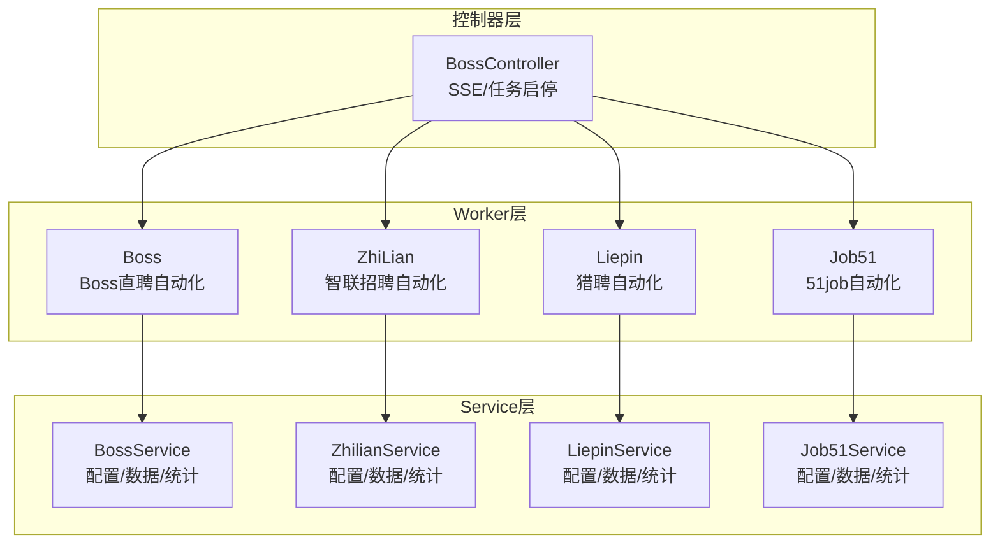
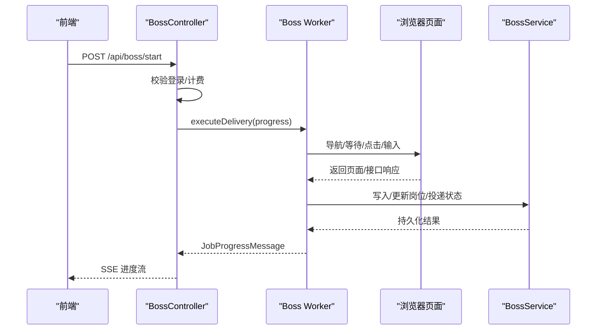
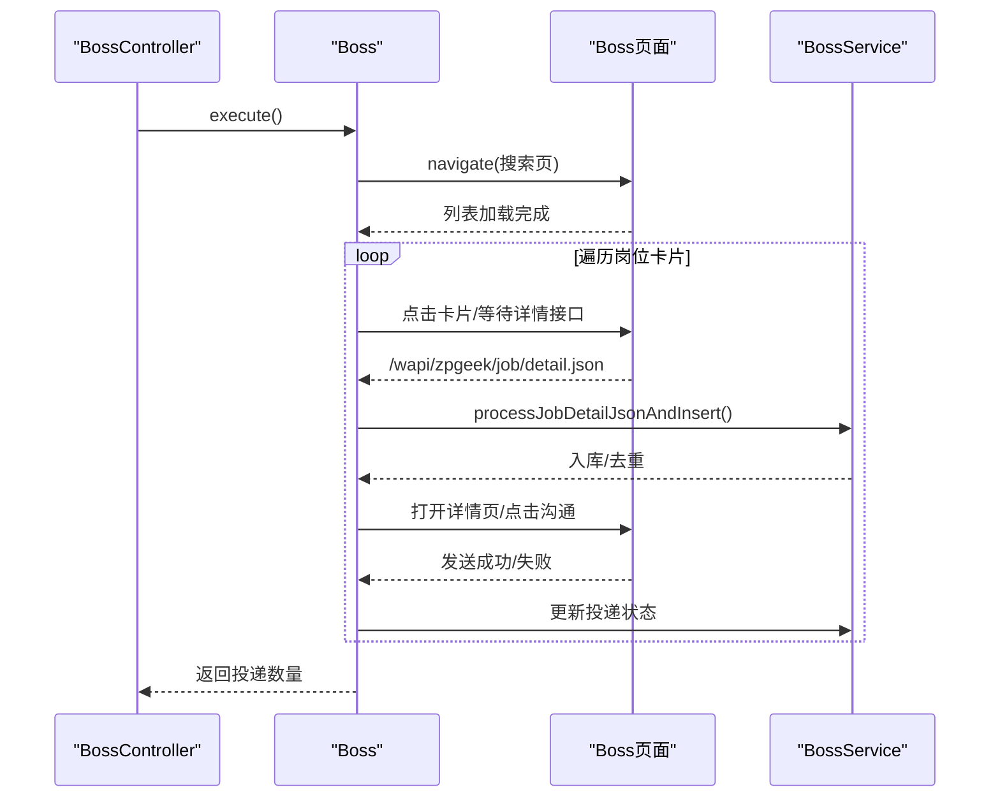
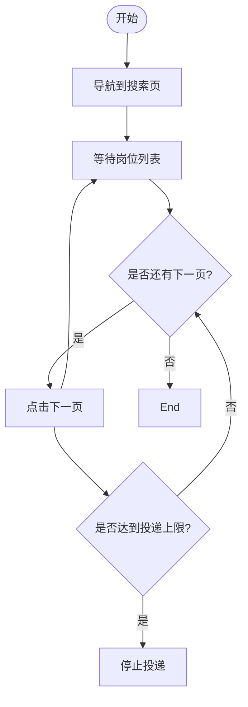
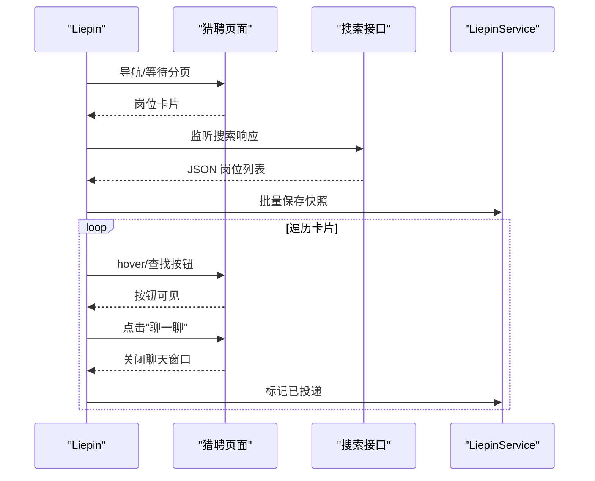
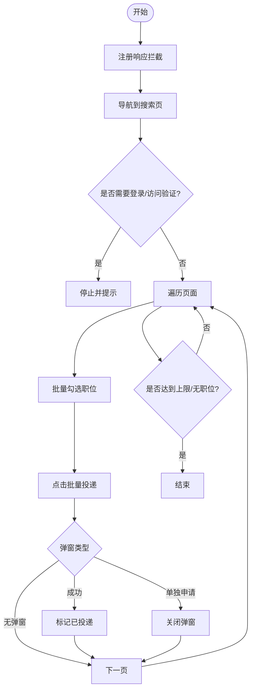
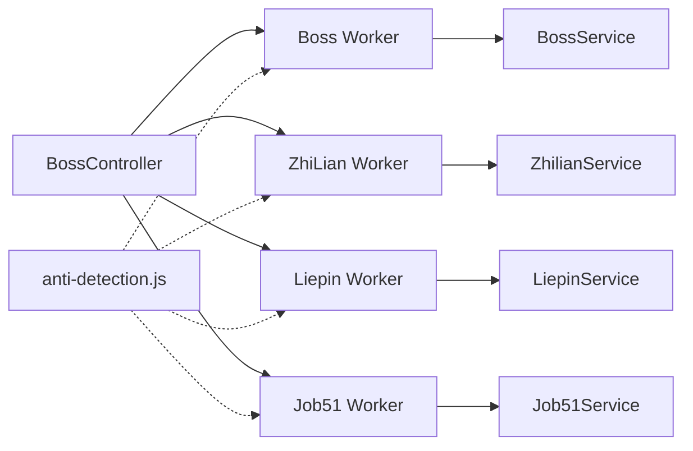

# 平台特定问题

<cite>
**本文引用的文件**
- [BossController.java](file://backend/src/main/java/com/getjobs/application/controller/BossController.java)
- [Boss.java](file://backend/src/main/java/com/getjobs/worker/boss/Boss.java)
- [BossService.java](file://backend/src/main/java/com/getjobs/application/service/BossService.java)
- [ZhiLian.java](file://backend/src/main/java/com/getjobs/worker/zhilian/ZhiLian.java)
- [ZhilianService.java](file://backend/src/main/java/com/getjobs/application/service/ZhilianService.java)
- [Liepin.java](file://backend/src/main/java/com/getjobs/worker/liepin/Liepin.java)
- [LiepinService.java](file://backend/src/main/java/com/getjobs/application/service/LiepinService.java)
- [Job51.java](file://backend/src/main/java/com/getjobs/worker/job51/Job51.java)
- [Job51Service.java](file://backend/src/main/java/com/getjobs/application/service/Job51Service.java)
- [anti-detection.js](file://backend/src/main/resources/anti-detection.js)
</cite>

## 目录
1. [简介](#简介)
2. [项目结构](#项目结构)
3. [核心组件](#核心组件)
4. [架构总览](#架构总览)
5. [详细组件分析](#详细组件分析)
6. [依赖分析](#依赖分析)
7. [性能考虑](#性能考虑)
8. [故障排除指南](#故障排除指南)
9. [结论](#结论)

## 简介
本文件面向需要处理 Boss 直聘、智联招聘、猎聘、51job 四个招聘平台特定问题的用户，系统性梳理各平台在反检测机制、验证码处理、登录限制、投递规则等方面的常见问题与应对策略。文档结合代码实现，提供平台更新导致的功能失效、API 变更适配、页面结构调整的处理方案，并附带调试技巧、绕过策略与合规建议。

## 项目结构
后端采用模块化设计，按平台划分 Worker 与 Service 层：
- 控制器层：负责接收请求、鉴权、SSE 进度推送与任务启停
- Worker 层：封装各平台自动化流程（页面导航、元素定位、交互、数据采集与落库）
- Service 层：封装业务逻辑（配置加载、数据持久化、统计分析、黑名单管理）

**图表来源**
- [BossController.java:35-246](file://backend/src/main/java/com/getjobs/application/controller/BossController.java#L35-L246)
- [Boss.java:45-125](file://backend/src/main/java/com/getjobs/worker/boss/Boss.java#L45-L125)
- [ZhiLian.java:31-97](file://backend/src/main/java/com/getjobs/worker/zhilian/ZhiLian.java#L31-L97)
- [Liepin.java:38-130](file://backend/src/main/java/com/getjobs/worker/liepin/Liepin.java#L38-L130)
- [Job51.java:31-107](file://backend/src/main/java/com/getjobs/worker/job51/Job51.java#L31-L107)

**章节来源**
- [BossController.java:35-246](file://backend/src/main/java/com/getjobs/application/controller/BossController.java#L35-L246)
- [Boss.java:45-125](file://backend/src/main/java/com/getjobs/worker/boss/Boss.java#L45-L125)
- [ZhiLian.java:31-97](file://backend/src/main/java/com/getjobs/worker/zhilian/ZhiLian.java#L31-L97)
- [Liepin.java:38-130](file://backend/src/main/java/com/getjobs/worker/liepin/Liepin.java#L38-L130)
- [Job51.java:31-107](file://backend/src/main/java/com/getjobs/worker/job51/Job51.java#L31-L107)

## 核心组件
- BossController：提供 Boss 直聘任务的 SSE 进度推送、启动/停止、登出与状态查询接口
- Worker（Boss/ZhiLian/Liepin/Job51）：封装平台自动化流程，包括页面导航、元素定位、交互、数据采集与落库
- Service（BossService/ZhilianService/LiepinService/Job51Service）：封装配置加载、数据持久化、统计分析、黑名单管理

**章节来源**
- [BossController.java:35-246](file://backend/src/main/java/com/getjobs/application/controller/BossController.java#L35-L246)
- [Boss.java:45-125](file://backend/src/main/java/com/getjobs/worker/boss/Boss.java#L45-L125)
- [BossService.java:29-80](file://backend/src/main/java/com/getjobs/application/service/BossService.java#L29-L80)
- [ZhiLian.java:31-97](file://backend/src/main/java/com/getjobs/worker/zhilian/ZhiLian.java#L31-L97)
- [ZhilianService.java:26-40](file://backend/src/main/java/com/getjobs/application/service/ZhilianService.java#L26-L40)
- [Liepin.java:38-130](file://backend/src/main/java/com/getjobs/worker/liepin/Liepin.java#L38-L130)
- [LiepinService.java:25-40](file://backend/src/main/java/com/getjobs/application/service/LiepinService.java#L25-L40)
- [Job51.java:31-107](file://backend/src/main/java/com/getjobs/worker/job51/Job51.java#L31-L107)
- [Job51Service.java:23-40](file://backend/src/main/java/com/getjobs/application/service/Job51Service.java#L23-L40)

## 架构总览
平台自动化整体流程：控制器接收请求后，委派对应 Worker 执行自动化流程；Worker 通过 Playwright 与页面交互，采集数据并落库；同时通过 SSE 将进度推送给前端。

**图表来源**
- [BossController.java:72-148](file://backend/src/main/java/com/getjobs/application/controller/BossController.java#L72-L148)
- [Boss.java:112-125](file://backend/src/main/java/com/getjobs/worker/boss/Boss.java#L112-L125)
- [BossService.java:652-658](file://backend/src/main/java/com/getjobs/application/service/BossService.java#L652-L658)

## 详细组件分析

### Boss 直聘（Zhipin）
- 反检测与绕过
  - 通过响应监听拦截岗位详情接口，解析并入库，避免直接依赖页面 DOM 变化
  - 使用 waitUntil 和超时控制，保证页面与接口的稳定加载
  - 对“立即沟通”按钮的查找采用多选择器与重试策略
- 验证码与登录限制
  - 登录状态检查与退出登录接口，清理上下文与数据库 Cookie
  - 通过 SSE 推送进度，便于前端感知登录状态变化
- 投递规则与黑名单
  - 基于 encrypt_id/encrypt_user_id 去重入库
  - 支持公司/职位/HR 黑名单过滤，以及公共黑名单匹配
- 页面结构调整适配
  - 通过 waitForSelector 与滚动策略触发懒加载，避免死循环
  - 详情页切换时监听接口响应，确保数据采集与落库的稳定性

**图表来源**
- [Boss.java:228-434](file://backend/src/main/java/com/getjobs/worker/boss/Boss.java#L228-L434)
- [Boss.java:439-532](file://backend/src/main/java/com/getjobs/worker/boss/Boss.java#L439-L532)
- [Boss.java:613-777](file://backend/src/main/java/com/getjobs/worker/boss/Boss.java#L613-L777)
- [BossService.java:627-647](file://backend/src/main/java/com/getjobs/application/service/BossService.java#L627-L647)

**章节来源**
- [BossController.java:72-148](file://backend/src/main/java/com/getjobs/application/controller/BossController.java#L72-L148)
- [Boss.java:228-434](file://backend/src/main/java/com/getjobs/worker/boss/Boss.java#L228-L434)
- [Boss.java:439-532](file://backend/src/main/java/com/getjobs/worker/boss/Boss.java#L439-L532)
- [Boss.java:613-777](file://backend/src/main/java/com/getjobs/worker/boss/Boss.java#L613-L777)
- [BossService.java:627-647](file://backend/src/main/java/com/getjobs/application/service/BossService.java#L627-L647)

### 智联招聘（Zhaopin）
- 反检测与绕过
  - 通过“下一页”按钮禁用状态与最多翻页数控制，避免无限循环
  - 对投递弹窗进行统一监听与关闭，防止干扰后续流程
- 登录限制与投递上限
  - 检测“今日投递已达上限”提示，及时停止投递
  - 通过公共黑名单过滤，减少无效投递
- 页面结构调整适配
  - 多选择器定位搜索框与投递按钮，提升健壮性
  - 保存当前页面 HTML 以便问题排查

**图表来源**
- [ZhiLian.java:102-191](file://backend/src/main/java/com/getjobs/worker/zhilian/ZhiLian.java#L102-L191)
- [ZhiLian.java:197-351](file://backend/src/main/java/com/getjobs/worker/zhilian/ZhiLian.java#L197-L351)
- [ZhiLian.java:474-490](file://backend/src/main/java/com/getjobs/worker/zhilian/ZhiLian.java#L474-L490)

**章节来源**
- [ZhiLian.java:102-191](file://backend/src/main/java/com/getjobs/worker/zhilian/ZhiLian.java#L102-L191)
- [ZhiLian.java:197-351](file://backend/src/main/java/com/getjobs/worker/zhilian/ZhiLian.java#L197-L351)
- [ZhiLian.java:474-490](file://backend/src/main/java/com/getjobs/worker/zhilian/ZhiLian.java#L474-L490)

### 猎聘（Liepin）
- 反检测与绕过
  - 注册请求/响应拦截，仅监听 PC 搜索相关接口，解析并批量保存岗位快照
  - 通过 hover 与多种按钮选择器提升点击成功率
- 登录限制与投递规则
  - 自动发送招呼语后关闭聊天窗口，成功/失败均记录并标记投递状态
  - 支持“继续聊”按钮识别，视为已投递
- 页面结构调整适配
  - 多种分页结构适配（AntD v5），通过类名与禁用状态判断
  - 从接口数据与页面数据双重来源获取字段，降低页面结构变化的影响

**图表来源**
- [Liepin.java:64-103](file://backend/src/main/java/com/getjobs/worker/liepin/Liepin.java#L64-L103)
- [Liepin.java:133-188](file://backend/src/main/java/com/getjobs/worker/liepin/Liepin.java#L133-L188)
- [Liepin.java:327-598](file://backend/src/main/java/com/getjobs/worker/liepin/Liepin.java#L327-L598)

**章节来源**
- [Liepin.java:64-103](file://backend/src/main/java/com/getjobs/worker/liepin/Liepin.java#L64-L103)
- [Liepin.java:133-188](file://backend/src/main/java/com/getjobs/worker/liepin/Liepin.java#L133-L188)
- [Liepin.java:327-598](file://backend/src/main/java/com/getjobs/worker/liepin/Liepin.java#L327-L598)

### 51job（51job）
- 反检测与绕过
  - 监听 /api/job/search-pc 接口，解析 JSON 并保存岗位数据，同时抽取 jobId 列表
  - 通过 extra HTTP headers 与请求拦截，规避访问验证与风控
- 登录限制与投递上限
  - 检测“需要重新登录”、“日投递上限”等提示，及时停止投递
  - “无职位/没有符合条件的职位”提示时提前结束关键词
- 页面结构调整适配
  - 多种选择器与数据属性解析 jobId，避免页面结构变化导致的采集失败
  - 批量投递后统一处理成功/失败弹窗，确保状态正确标记

**图表来源**
- [Job51.java:112-248](file://backend/src/main/java/com/getjobs/worker/job51/Job51.java#L112-L248)
- [Job51.java:253-322](file://backend/src/main/java/com/getjobs/worker/job51/Job51.java#L253-L322)
- [Job51.java:367-490](file://backend/src/main/java/com/getjobs/worker/job51/Job51.java#L367-L490)
- [Job51.java:619-719](file://backend/src/main/java/com/getjobs/worker/job51/Job51.java#L619-L719)

**章节来源**
- [Job51.java:112-248](file://backend/src/main/java/com/getjobs/worker/job51/Job51.java#L112-L248)
- [Job51.java:253-322](file://backend/src/main/java/com/getjobs/worker/job51/Job51.java#L253-L322)
- [Job51.java:367-490](file://backend/src/main/java/com/getjobs/worker/job51/Job51.java#L367-L490)
- [Job51.java:619-719](file://backend/src/main/java/com/getjobs/worker/job51/Job51.java#L619-L719)

## 依赖分析
- 控制器与 Worker 的解耦：控制器仅负责任务启停与进度推送，具体平台逻辑由 Worker 实现
- Worker 与 Service 的协作：Worker 负责页面交互与数据采集，Service 负责配置加载、数据持久化与统计
- 反检测脚本：通过劫持 Function.prototype.toString 与 console 方法，降低被检测风险

**图表来源**
- [BossController.java:35-246](file://backend/src/main/java/com/getjobs/application/controller/BossController.java#L35-L246)
- [Boss.java:45-125](file://backend/src/main/java/com/getjobs/worker/boss/Boss.java#L45-L125)
- [ZhiLian.java:31-97](file://backend/src/main/java/com/getjobs/worker/zhilian/ZhiLian.java#L31-L97)
- [Liepin.java:38-130](file://backend/src/main/java/com/getjobs/worker/liepin/Liepin.java#L38-L130)
- [Job51.java:31-107](file://backend/src/main/java/com/getjobs/worker/job51/Job51.java#L31-L107)
- [anti-detection.js:1-109](file://backend/src/main/resources/anti-detection.js#L1-L109)

**章节来源**
- [BossController.java:35-246](file://backend/src/main/java/com/getjobs/application/controller/BossController.java#L35-L246)
- [Boss.java:45-125](file://backend/src/main/java/com/getjobs/worker/boss/Boss.java#L45-L125)
- [ZhiLian.java:31-97](file://backend/src/main/java/com/getjobs/worker/zhilian/ZhiLian.java#L31-L97)
- [Liepin.java:38-130](file://backend/src/main/java/com/getjobs/worker/liepin/Liepin.java#L38-L130)
- [Job51.java:31-107](file://backend/src/main/java/com/getjobs/worker/job51/Job51.java#L31-L107)
- [anti-detection.js:1-109](file://backend/src/main/resources/anti-detection.js#L1-L109)

## 性能考虑
- 等待策略：合理设置 waitUntil 与超时时间，避免长时间阻塞
- 懒加载与滚动：通过滚动触发懒加载，减少不必要的等待
- 批量操作：批量保存/标记投递状态，降低数据库压力
- 弹窗处理：统一关闭弹窗，避免遮挡影响后续交互

## 故障排除指南
- Boss 直聘
  - 详情接口未返回：检查拦截逻辑与 waitUntil 配置
  - “立即沟通”按钮未出现：增加重试与多选择器策略
  - 黑名单误判：核对黑名单表与匹配逻辑
- 智联招聘
  - “今日投递已达上限”：停止投递并提示用户
  - 投递弹窗未关闭：统一监听与关闭策略
- 猎聘
  - 搜索接口未返回：确认拦截 URL 与 JSON 结构
  - 按钮文本不匹配：“聊一聊/继续聊”识别
- 51job
  - 访问验证：检测到滑块验证时停止投递
  - 日投递上限：检测提示后停止当前关键词
  - 无职位：检测空态提示后提前结束

**章节来源**
- [Boss.java:613-777](file://backend/src/main/java/com/getjobs/worker/boss/Boss.java#L613-L777)
- [ZhiLian.java:474-490](file://backend/src/main/java/com/getjobs/worker/zhilian/ZhiLian.java#L474-L490)
- [Liepin.java:518-598](file://backend/src/main/java/com/getjobs/worker/liepin/Liepin.java#L518-L598)
- [Job51.java:619-719](file://backend/src/main/java/com/getjobs/worker/job51/Job51.java#L619-L719)

## 结论
通过对四家平台的自动化流程进行模块化封装与统一的反检测策略，项目能够在页面结构调整、API 变更与风控升级的背景下保持较高的稳定性。建议在生产环境中持续监控各平台的反检测信号与页面结构变化，及时调整选择器与拦截逻辑，并配合合理的等待与重试策略，确保投递流程的可靠性与合规性。