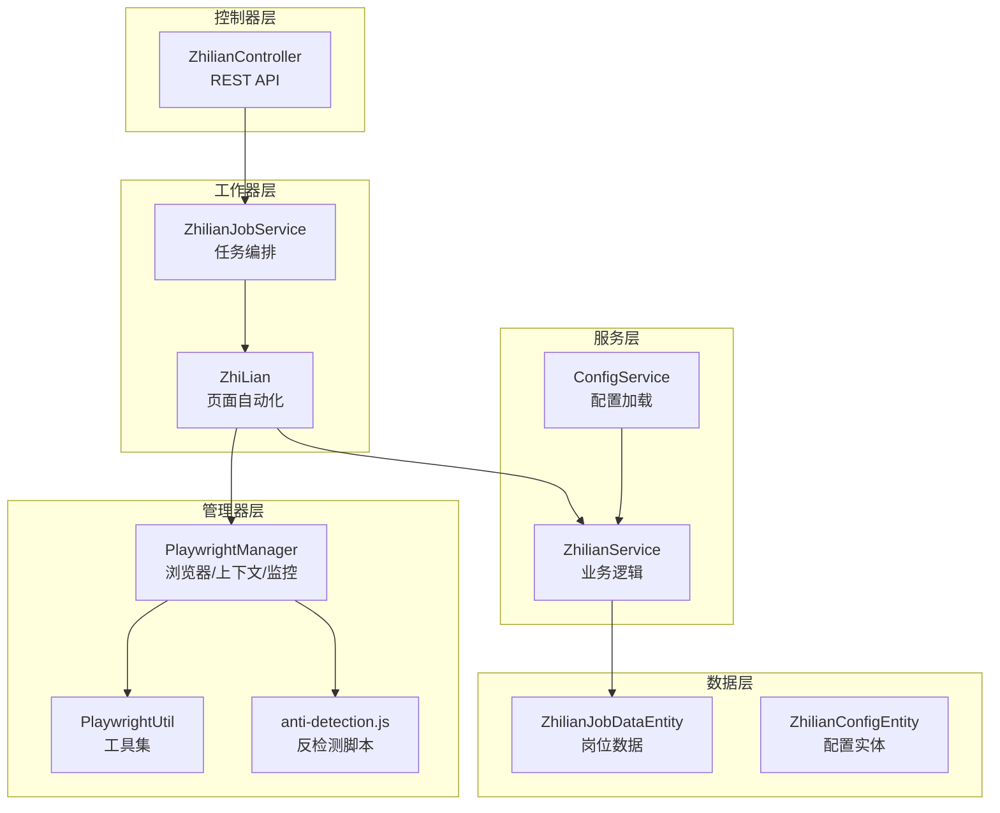
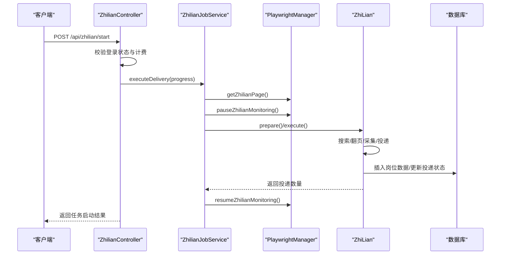
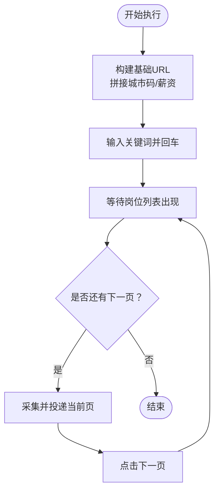
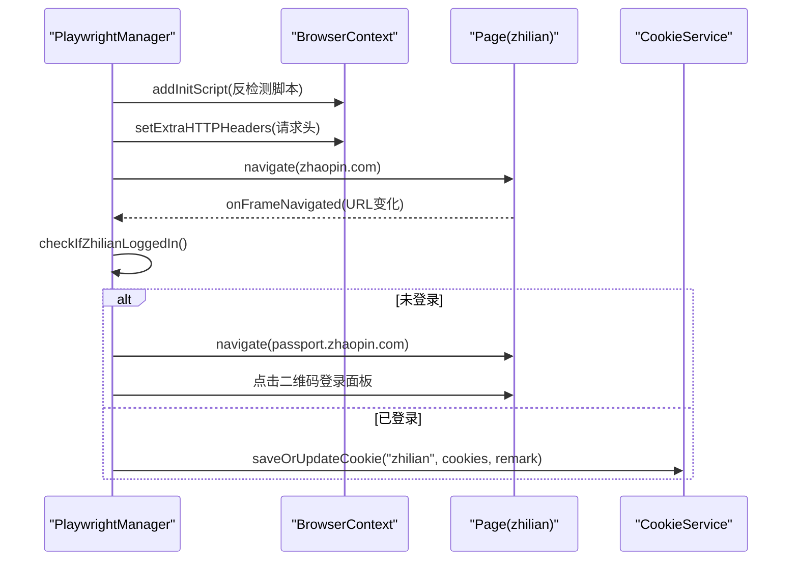
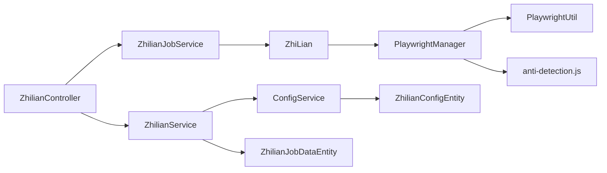

# 智联招聘平台问题

<cite>
**本文引用的文件**
- [ZhilianController.java](file://backend/src/main/java/com/getjobs/application/controller/ZhilianController.java)
- [ZhilianService.java](file://backend/src/main/java/com/getjobs/application/service/ZhilianService.java)
- [ZhiLian.java](file://backend/src/main/java/com/getjobs/worker/zhilian/ZhiLian.java)
- [ZhilianJobService.java](file://backend/src/main/java/com/getjobs/worker/service/ZhilianJobService.java)
- [PlaywrightManager.java](file://backend/src/main/java/com/getjobs/worker/manager/PlaywrightManager.java)
- [ConfigService.java](file://backend/src/main/java/com/getjobs/application/service/ConfigService.java)
- [PlaywrightUtil.java](file://backend/src/main/java/com/getjobs/worker/utils/PlaywrightUtil.java)
- [anti-detection.js](file://backend/src/main/resources/anti-detection.js)
- [ZhilianConfig.java](file://backend/src/main/java/com/getjobs/worker/zhilian/ZhilianConfig.java)
- [ZhilianJobDataEntity.java](file://backend/src/main/java/com/getjobs/application/entity/ZhilianJobDataEntity.java)
- [ZhilianConfigEntity.java](file://backend/src/main/java/com/getjobs/application/entity/ZhilianConfigEntity.java)
- [001_create_delivery_report.sql](file://scripts/migration/001_create_delivery_report.sql)
</cite>

## 目录
1. [简介](#简介)
2. [项目结构](#项目结构)
3. [核心组件](#核心组件)
4. [架构总览](#架构总览)
5. [详细组件分析](#详细组件分析)
6. [依赖关系分析](#依赖关系分析)
7. [性能考量](#性能考量)
8. [故障排查指南](#故障排查指南)
9. [结论](#结论)
10. [附录](#附录)

## 简介
本文件面向需要处理智联招聘平台特定问题的用户，聚焦于以下方面：
- 智联招聘页面结构变化与投递流程差异的应对策略
- 反检测机制与调试技巧
- 搜索算法调整、岗位详情页面加载、简历投递接口变化的技术挑战与解决方案
- 平台政策变化的应对措施与合规建议
- 面向开发与运维的排障清单与最佳实践

## 项目结构
后端采用分层架构，围绕“控制器-服务-工作器-管理器”的职责划分组织代码。与智联招聘相关的模块主要分布在以下位置：
- 控制器层：提供REST API，负责配置、登录状态、Cookie管理、任务启停与状态查询
- 服务层：封装业务逻辑，包括配置加载、数据统计与列表查询、薪资解析等
- 工作器层：基于Playwright实现页面自动化，负责搜索、翻页、采集与投递
- 管理器层：统一管理浏览器生命周期、登录状态监控、Cookie持久化与反检测注入

图示来源
- [ZhilianController.java:1-414](file://backend/src/main/java/com/getjobs/application/controller/ZhilianController.java#L1-L414)
- [ZhilianService.java:1-504](file://backend/src/main/java/com/getjobs/application/service/ZhilianService.java#L1-L504)
- [ZhiLian.java:1-647](file://backend/src/main/java/com/getjobs/worker/zhilian/ZhiLian.java#L1-L647)
- [ZhilianJobService.java:1-142](file://backend/src/main/java/com/getjobs/worker/service/ZhilianJobService.java#L1-L142)
- [PlaywrightManager.java:1-1847](file://backend/src/main/java/com/getjobs/worker/manager/PlaywrightManager.java#L1-L1847)
- [PlaywrightUtil.java:1-610](file://backend/src/main/java/com/getjobs/worker/utils/PlaywrightUtil.java#L1-L610)
- [anti-detection.js:1-109](file://backend/src/main/resources/anti-detection.js#L1-L109)
- [ZhilianJobDataEntity.java:1-64](file://backend/src/main/java/com/getjobs/application/entity/ZhilianJobDataEntity.java#L1-L64)
- [ZhilianConfigEntity.java:1-31](file://backend/src/main/java/com/getjobs/application/entity/ZhilianConfigEntity.java#L1-L31)

章节来源
- [ZhilianController.java:1-414](file://backend/src/main/java/com/getjobs/application/controller/ZhilianController.java#L1-L414)
- [ZhilianService.java:1-504](file://backend/src/main/java/com/getjobs/application/service/ZhilianService.java#L1-L504)
- [ZhiLian.java:1-647](file://backend/src/main/java/com/getjobs/worker/zhilian/ZhiLian.java#L1-L647)
- [ZhilianJobService.java:1-142](file://backend/src/main/java/com/getjobs/worker/service/ZhilianJobService.java#L1-L142)
- [PlaywrightManager.java:1-1847](file://backend/src/main/java/com/getjobs/worker/manager/PlaywrightManager.java#L1-L1847)
- [PlaywrightUtil.java:1-610](file://backend/src/main/java/com/getjobs/worker/utils/PlaywrightUtil.java#L1-L610)
- [anti-detection.js:1-109](file://backend/src/main/resources/anti-detection.js#L1-L109)
- [ZhilianJobDataEntity.java:1-64](file://backend/src/main/java/com/getjobs/application/entity/ZhilianJobDataEntity.java#L1-L64)
- [ZhilianConfigEntity.java:1-31](file://backend/src/main/java/com/getjobs/application/entity/ZhilianConfigEntity.java#L1-L31)

## 核心组件
- 智联招聘控制器：提供配置读取/更新、登录状态检查、二维码登录触发、Cookie读取/保存、投递统计与列表、任务启停与状态查询等接口
- 智联招聘服务：负责配置加载（从专表读取并构建配置）、薪资解析、岗位数据存取、统计与分页查询
- 智联招聘工作器：基于Playwright实现搜索、翻页、采集、投递、相似职位处理、上限检测、页面异常保存等
- 智联招聘任务服务：编排任务执行，与Playwright管理器协作，暂停/恢复后台监控，传递进度消息
- Playwright管理器：统一管理浏览器、上下文、页面、登录状态监控、Cookie持久化、反检测脚本注入、资源拦截等
- 工具与脚本：Playwright工具集、反检测脚本、配置服务

章节来源
- [ZhilianController.java:46-414](file://backend/src/main/java/com/getjobs/application/controller/ZhilianController.java#L46-L414)
- [ZhilianService.java:78-457](file://backend/src/main/java/com/getjobs/application/service/ZhilianService.java#L78-L457)
- [ZhiLian.java:51-351](file://backend/src/main/java/com/getjobs/worker/zhilian/ZhiLian.java#L51-L351)
- [ZhilianJobService.java:37-104](file://backend/src/main/java/com/getjobs/worker/service/ZhilianJobService.java#L37-L104)
- [PlaywrightManager.java:941-1226](file://backend/src/main/java/com/getjobs/worker/manager/PlaywrightManager.java#L941-L1226)
- [PlaywrightUtil.java:425-487](file://backend/src/main/java/com/getjobs/worker/utils/PlaywrightUtil.java#L425-L487)
- [ConfigService.java:276-279](file://backend/src/main/java/com/getjobs/application/service/ConfigService.java#L276-L279)

## 架构总览
系统通过控制器接收外部请求，服务层负责业务规则与数据访问，工作器层负责页面自动化，管理器层负责浏览器生命周期与反检测。整体流程如下：

图示来源
- [ZhilianController.java:273-336](file://backend/src/main/java/com/getjobs/application/controller/ZhilianController.java#L273-L336)
- [ZhilianJobService.java:37-104](file://backend/src/main/java/com/getjobs/worker/service/ZhilianJobService.java#L37-L104)
- [PlaywrightManager.java:1302-1314](file://backend/src/main/java/com/getjobs/worker/manager/PlaywrightManager.java#L1302-L1314)
- [ZhiLian.java:62-97](file://backend/src/main/java/com/getjobs/worker/zhilian/ZhiLian.java#L62-L97)

## 详细组件分析

### 智联招聘控制器（REST API）
- 配置管理：读取/更新智联配置，返回城市选项
- 登录与认证：检查登录状态、触发二维码登录、退出登录并清理Cookie
- Cookie管理：读取数据库中的Cookie记录、手动保存当前上下文Cookie
- 数据分析与列表：投递统计（KPI、图表）、岗位列表（分页+筛选+薪资区间）
- 任务管理：启动/停止投递任务、查询当前状态
- 健康检查：服务健康状态

章节来源
- [ZhilianController.java:46-414](file://backend/src/main/java/com/getjobs/application/controller/ZhilianController.java#L46-L414)

### 智联招聘服务（业务逻辑）
- 配置加载：从专表读取配置，解析关键词、城市编码、薪资范围
- 薪资解析：支持多种格式，计算中位数K与年包
- 数据存取：去重判断、插入岗位、标记投递状态
- 统计与列表：按状态/地点/经验/学历/关键词/薪资区间筛选，分页查询

章节来源
- [ZhilianService.java:78-457](file://backend/src/main/java/com/getjobs/application/service/ZhilianService.java#L78-L457)

### 智联招聘工作器（页面自动化）
- 准备阶段：清理结果、重置限制
- 执行阶段：遍历关键词、构建URL、输入关键词、等待列表加载、翻页、采集岗位、投递、相似职位处理、上限检测
- 弹窗处理：统一监听并关闭新窗口、读取投递结果、处理相似职位
- 异常处理：保存当前页面HTML便于排查
- 选择器策略：多候选选择器提升鲁棒性，下一页禁用状态判断

图示来源
- [ZhiLian.java:102-191](file://backend/src/main/java/com/getjobs/worker/zhilian/ZhiLian.java#L102-L191)
- [ZhiLian.java:197-351](file://backend/src/main/java/com/getjobs/worker/zhilian/ZhiLian.java#L197-L351)

章节来源
- [ZhiLian.java:51-351](file://backend/src/main/java/com/getjobs/worker/zhilian/ZhiLian.java#L51-L351)

### 智联招聘任务服务（任务编排）
- 任务状态：运行中/停止标志
- 执行流程：获取页面、检查登录、暂停监控、加载配置、回调进度、执行工作器、恢复监控
- 停止机制：设置停止标志，配合工作器循环检查

章节来源
- [ZhilianJobService.java:37-104](file://backend/src/main/java/com/getjobs/worker/service/ZhilianJobService.java#L37-L104)

### Playwright管理器（浏览器与监控）
- 初始化：启动浏览器、创建共享上下文、创建多平台页面、注入反检测脚本
- 登录状态监控：监听导航事件，按平台检查登录状态，触发回调并保存Cookie
- Cookie管理：按域过滤、序列化存储、手动保存/清理
- 反检测：注入脚本、设置请求头、资源拦截（可选）
- 智联登录引导：未登录时重定向登录页、切换二维码面板、等待扫码

图示来源
- [PlaywrightManager.java:941-1226](file://backend/src/main/java/com/getjobs/worker/manager/PlaywrightManager.java#L941-L1226)
- [PlaywrightManager.java:1231-1258](file://backend/src/main/java/com/getjobs/worker/manager/PlaywrightManager.java#L1231-L1258)
- [anti-detection.js:1-109](file://backend/src/main/resources/anti-detection.js#L1-L109)

章节来源
- [PlaywrightManager.java:941-1226](file://backend/src/main/java/com/getjobs/worker/manager/PlaywrightManager.java#L941-L1226)
- [PlaywrightManager.java:1231-1258](file://backend/src/main/java/com/getjobs/worker/manager/PlaywrightManager.java#L1231-L1258)
- [PlaywrightUtil.java:425-487](file://backend/src/main/java/com/getjobs/worker/utils/PlaywrightUtil.java#L425-L487)
- [anti-detection.js:1-109](file://backend/src/main/resources/anti-detection.js#L1-L109)

### 配置服务（统一配置入口）
- 专表读取：从智联配置表读取并构建配置对象
- 关键词解析：支持逗号/中文逗号/[a,b]/括号等多种格式
- 城市与薪资映射：中文名映射为代码，缺省回退

章节来源
- [ConfigService.java:276-279](file://backend/src/main/java/com/getjobs/application/service/ConfigService.java#L276-L279)
- [ZhilianConfig.java:13-37](file://backend/src/main/java/com/getjobs/worker/zhilian/ZhilianConfig.java#L13-L37)

### 实体模型（数据结构）
- 配置实体：keywords、cityCode、salary、时间戳
- 岗位数据实体：job_id、job_title、job_link、salary、location、experience、degree、company_name、delivery_status、时间戳

章节来源
- [ZhilianConfigEntity.java:1-31](file://backend/src/main/java/com/getjobs/application/entity/ZhilianConfigEntity.java#L1-L31)
- [ZhilianJobDataEntity.java:1-64](file://backend/src/main/java/com/getjobs/application/entity/ZhilianJobDataEntity.java#L1-L64)

## 依赖关系分析
- 控制器依赖服务与管理器，服务依赖配置与数据访问层，工作器依赖管理器与服务，管理器依赖工具与脚本
- 配置服务统一暴露平台配置读取方法，避免上层直接耦合具体表结构
- 反检测脚本在上下文层注入，避免每个页面重复注入

图示来源
- [ZhilianController.java:31-44](file://backend/src/main/java/com/getjobs/application/controller/ZhilianController.java#L31-L44)
- [ZhilianService.java:27-30](file://backend/src/main/java/com/getjobs/application/service/ZhilianService.java#L27-L30)
- [ConfigService.java:276-279](file://backend/src/main/java/com/getjobs/application/service/ConfigService.java#L276-L279)
- [PlaywrightManager.java:226-237](file://backend/src/main/java/com/getjobs/worker/manager/PlaywrightManager.java#L226-L237)

章节来源
- [ZhilianController.java:31-44](file://backend/src/main/java/com/getjobs/application/controller/ZhilianController.java#L31-L44)
- [ZhilianService.java:27-30](file://backend/src/main/java/com/getjobs/application/service/ZhilianService.java#L27-L30)
- [ConfigService.java:276-279](file://backend/src/main/java/com/getjobs/application/service/ConfigService.java#L276-L279)
- [PlaywrightManager.java:226-237](file://backend/src/main/java/com/getjobs/worker/manager/PlaywrightManager.java#L226-L237)

## 性能考量
- 超时与等待：页面等待与导航超时可配置，避免长时间阻塞
- 资源拦截：可选启用，降低内存占用与网络压力
- 人类行为模拟：输入与交互具备延迟与随机性，降低被检测概率
- 并发与资源池：页面资源池与并发初始化，提升启动效率
- 日志节流：高频操作（如Cookie保存）进行日志节流，降低噪声

章节来源
- [PlaywrightUtil.java:425-487](file://backend/src/main/java/com/getjobs/worker/utils/PlaywrightUtil.java#L425-L487)
- [PlaywrightManager.java:105-106](file://backend/src/main/java/com/getjobs/worker/manager/PlaywrightManager.java#L105-L106)
- [PlaywrightManager.java:160-165](file://backend/src/main/java/com/getjobs/worker/manager/PlaywrightManager.java#L160-L165)

## 故障排查指南
- 页面动态加载与JS渲染内容提取
  - 使用等待选择器与网络空闲状态，避免过早采集
  - 通过统一保存当前页面HTML进行离线分析
  - 多候选选择器提升稳定性

- 投递状态跟踪
  - 采集后批量入库，避免逐条写入
  - 标记投递状态时优先使用job_id，其次使用标题+公司名
  - 监控弹窗并统一关闭，防止上下文泄漏

- 登录与Cookie问题
  - 未登录时触发二维码登录引导，等待扫码
  - 登录成功后保存Cookie到数据库，按域过滤
  - 退出登录时清理数据库与上下文Cookie

- 反检测与风控规避
  - 注入反检测脚本，设置请求头与UA
  - 资源拦截与人类行为模拟
  - 暂停后台监控，避免与业务流程并发访问同一页面

- 数据库与迁移
  - 投递报告表支持按平台统计与详情记录
  - 为各平台数据表增加关联字段

章节来源
- [ZhiLian.java:132-138](file://backend/src/main/java/com/getjobs/worker/zhilian/ZhiLian.java#L132-L138)
- [ZhiLian.java:344-350](file://backend/src/main/java/com/getjobs/worker/zhilian/ZhiLian.java#L344-L350)
- [ZhiLian.java:318-332](file://backend/src/main/java/com/getjobs/worker/zhilian/ZhiLian.java#L318-L332)
- [PlaywrightManager.java:1019-1142](file://backend/src/main/java/com/getjobs/worker/manager/PlaywrightManager.java#L1019-L1142)
- [PlaywrightManager.java:1231-1258](file://backend/src/main/java/com/getjobs/worker/manager/PlaywrightManager.java#L1231-L1258)
- [PlaywrightUtil.java:425-487](file://backend/src/main/java/com/getjobs/worker/utils/PlaywrightUtil.java#L425-L487)
- [anti-detection.js:1-109](file://backend/src/main/resources/anti-detection.js#L1-L109)
- [001_create_delivery_report.sql:1-29](file://scripts/migration/001_create_delivery_report.sql#L1-L29)

## 结论
本方案通过清晰的分层设计与完善的自动化流程，能够有效应对智联招聘页面结构变化与反检测挑战。通过统一的配置入口、健壮的选择器策略、反检测脚本注入与登录状态监控，系统在保证稳定性的同时提升了可维护性与可扩展性。建议在生产环境中结合资源拦截、日志节流与合规策略，持续优化性能与风险控制。

## 附录
- 调试技巧
  - 使用保存的页面HTML进行离线分析
  - 开启慢速模式与可视化调试
  - 启用资源拦截与反检测脚本
- 绕过策略
  - 多候选选择器与等待策略
  - 人类行为模拟与请求头伪装
  - 登录状态监控与Cookie持久化
- 合规建议
  - 遵守平台服务条款与robots协议
  - 控制请求频率与并发度
  - 严格区分测试环境与生产环境
  - 定期审计Cookie与日志留存