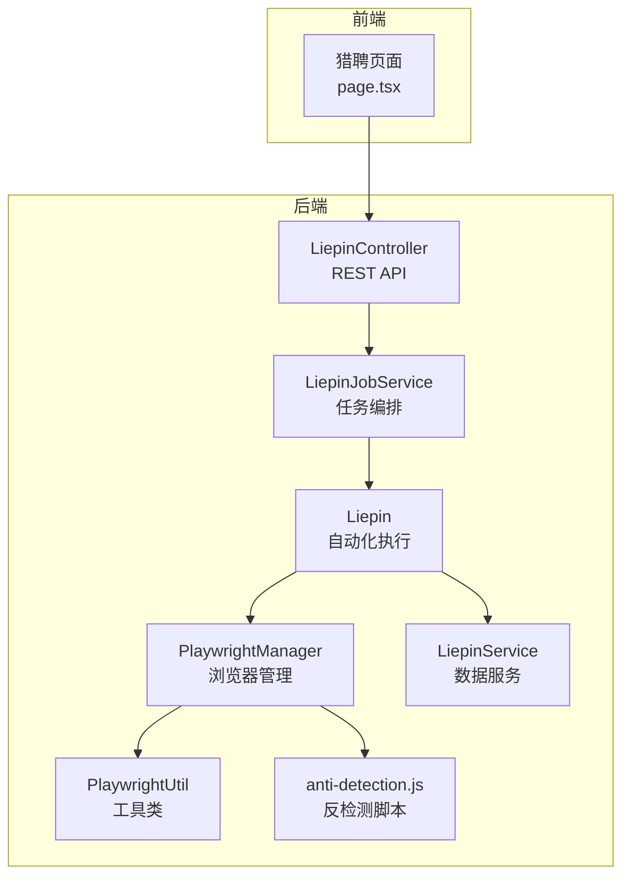
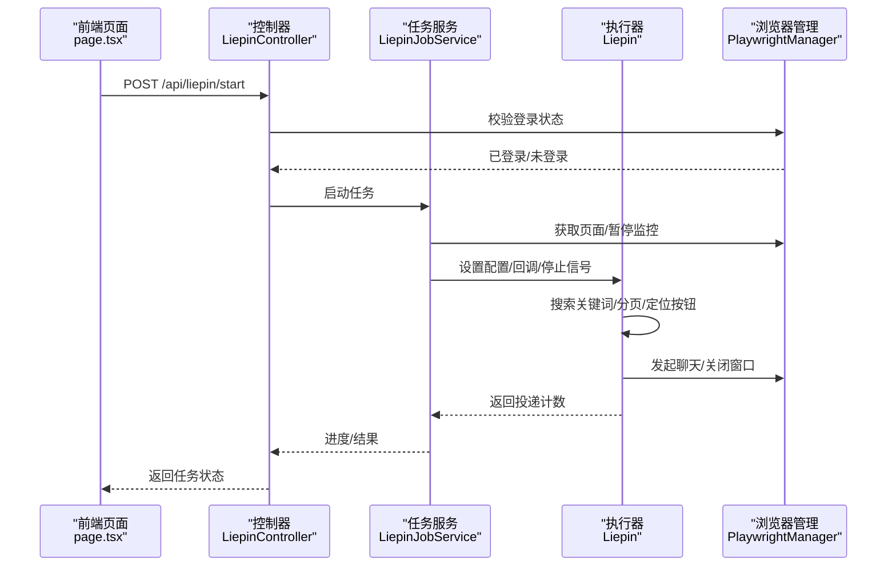
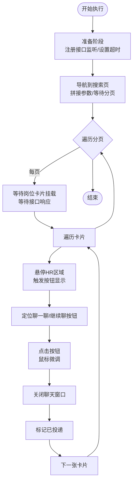
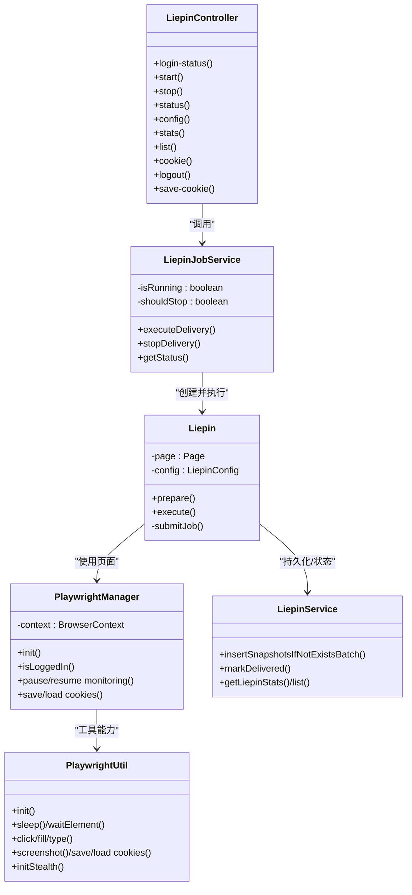

# 猎聘平台问题

<cite>
**本文引用的文件**
- [Liepin.java](file://backend/src/main/java/com/getjobs/worker/liepin/Liepin.java)
- [LiepinConfig.java](file://backend/src/main/java/com/getjobs/worker/liepin/LiepinConfig.java)
- [Locators.java](file://backend/src/main/java/com/getjobs/worker/liepin/Locators.java)
- [LiepinJobService.java](file://backend/src/main/java/com/getjobs/worker/service/LiepinJobService.java)
- [LiepinController.java](file://backend/src/main/java/com/getjobs/application/controller/LiepinController.java)
- [PlaywrightManager.java](file://backend/src/main/java/com/getjobs/worker/manager/PlaywrightManager.java)
- [PlaywrightUtil.java](file://backend/src/main/java/com/getjobs/worker/utils/PlaywrightUtil.java)
- [LiepinService.java](file://backend/src/main/java/com/getjobs/application/service/LiepinService.java)
- [anti-detection.js](file://backend/src/main/resources/anti-detection.js)
- [page.tsx](file://front/app/liepin/page.tsx)
</cite>

## 目录
1. [简介](#简介)
2. [项目结构](#项目结构)
3. [核心组件](#核心组件)
4. [架构总览](#架构总览)
5. [详细组件分析](#详细组件分析)
6. [依赖关系分析](#依赖关系分析)
7. [性能考量](#性能考量)
8. [故障排查指南](#故障排查指南)
9. [结论](#结论)
10. [附录](#附录)

## 简介
本文件面向需要处理猎聘平台特定问题的用户，聚焦以下主题：
- 猎聘平台页面布局变化与投递流程差异的应对策略
- 搜索结果排序、HR联系方式提取、简历投递成功率优化
- 反检测机制与调试技巧（页面元素定位、动态内容加载、投递状态验证）
- 平台政策变化的应对措施与合规建议

## 项目结构
后端采用Spring Boot + Playwright自动化框架，前端使用Next.js，整体分为三层：
- 控制层：REST API控制器负责登录状态检查、任务启停、配置管理与数据分析
- 业务层：任务服务封装执行流程，Playwright管理器负责浏览器生命周期与登录状态监控
- 工具层：Playwright工具类、反检测脚本、定位器集中管理

**图示来源**
- [LiepinController.java](file://backend/src/main/java/com/getjobs/application/controller/LiepinController.java)
- [LiepinJobService.java](file://backend/src/main/java/com/getjobs/worker/service/LiepinJobService.java)
- [Liepin.java](file://backend/src/main/java/com/getjobs/worker/liepin/Liepin.java)
- [PlaywrightManager.java](file://backend/src/main/java/com/getjobs/worker/manager/PlaywrightManager.java)
- [PlaywrightUtil.java](file://backend/src/main/java/com/getjobs/worker/utils/PlaywrightUtil.java)
- [anti-detection.js](file://backend/src/main/resources/anti-detection.js)
- [LiepinService.java](file://backend/src/main/java/com/getjobs/application/service/LiepinService.java)

**章节来源**
- [LiepinController.java](file://backend/src/main/java/com/getjobs/application/controller/LiepinController.java)
- [LiepinJobService.java](file://backend/src/main/java/com/getjobs/worker/service/LiepinJobService.java)
- [PlaywrightManager.java](file://backend/src/main/java/com/getjobs/worker/manager/PlaywrightManager.java)

## 核心组件
- 猎聘控制器：提供登录状态检查、启动/停止任务、状态查询、配置读取/更新、Cookie调试接口
- 猎聘任务服务：封装任务生命周期、并发控制、进度回调、登录状态校验与恢复监控
- 猎聘自动化执行器：负责搜索、分页、HR区域识别、按钮定位、点击与聊天窗口关闭、投递状态标记
- Playwright管理器：共享浏览器上下文、统一注入反检测脚本、登录状态监控、Cookie加载与保存
- Playwright工具类：通用元素操作、等待、截图、Cookie读写、反检测增强
- 数据服务：岗位快照存储、批量插入、投递状态标记、统计分析

**章节来源**
- [LiepinController.java](file://backend/src/main/java/com/getjobs/application/controller/LiepinController.java)
- [LiepinJobService.java](file://backend/src/main/java/com/getjobs/worker/service/LiepinJobService.java)
- [Liepin.java](file://backend/src/main/java/com/getjobs/worker/liepin/Liepin.java)
- [PlaywrightManager.java](file://backend/src/main/java/com/getjobs/worker/manager/PlaywrightManager.java)
- [PlaywrightUtil.java](file://backend/src/main/java/com/getjobs/worker/utils/PlaywrightUtil.java)
- [LiepinService.java](file://backend/src/main/java/com/getjobs/application/service/LiepinService.java)

## 架构总览
猎聘自动化流程的关键路径如下：
- 前端触发“开始投递”，后端检查登录状态与任务运行状态
- 任务服务获取Playwright页面与配置，注入进度回调
- 自动化执行器按关键词搜索，处理分页与弹窗，定位HR区域与“聊一聊”按钮
- 成功发起聊天后关闭窗口并标记投递状态，最终统计计数

**图示来源**
- [page.tsx](file://front/app/liepin/page.tsx)
- [LiepinController.java](file://backend/src/main/java/com/getjobs/application/controller/LiepinController.java)
- [LiepinJobService.java](file://backend/src/main/java/com/getjobs/worker/service/LiepinJobService.java)
- [Liepin.java](file://backend/src/main/java/com/getjobs/worker/liepin/Liepin.java)
- [PlaywrightManager.java](file://backend/src/main/java/com/getjobs/worker/manager/PlaywrightManager.java)

## 详细组件分析

### 猎聘自动化执行器（Liepin）
职责与特性：
- 搜索与分页：根据配置拼接URL，等待分页元素，识别下一页按钮并翻页
- 动态内容加载：等待岗位卡片挂载与接口响应，确保数据缓存刷新
- HR区域与按钮定位：多选择器回退策略，悬停触发按钮显示，鼠标微调提升点击精度
- 投递状态标记：从接口数据或卡片属性提取jobId，成功后标记已投递

**图示来源**
- [Liepin.java](file://backend/src/main/java/com/getjobs/worker/liepin/Liepin.java)
- [Locators.java](file://backend/src/main/java/com/getjobs/worker/liepin/Locators.java)

**章节来源**
- [Liepin.java](file://backend/src/main/java/com/getjobs/worker/liepin/Liepin.java)
- [Locators.java](file://backend/src/main/java/com/getjobs/worker/liepin/Locators.java)

### 猎聘任务服务（LiepinJobService）
- 任务生命周期：运行状态标志、停止信号、登录状态检查
- 并发与监控：暂停平台监控避免并发访问冲突，任务结束后恢复
- 进度回调：将执行进度与结果通过回调传递给控制器

**章节来源**
- [LiepinJobService.java](file://backend/src/main/java/com/getjobs/worker/service/LiepinJobService.java)

### Playwright管理器（PlaywrightManager）
- 共享上下文：Boss/Zhipin、猎聘、51job、智联在同窗口多标签页运行
- 登录状态监控：监听页面导航事件，检测登录/登出状态变化
- 反检测注入：在上下文层注入Boss反检测脚本，猎聘侧通过工具类增强Stealth
- Cookie管理：从数据库加载/保存Cookie，支持手动保存与退出登录清理

**章节来源**
- [PlaywrightManager.java](file://backend/src/main/java/com/getjobs/worker/manager/PlaywrightManager.java)
- [PlaywrightUtil.java](file://backend/src/main/java/com/getjobs/worker/utils/PlaywrightUtil.java)
- [anti-detection.js](file://backend/src/main/resources/anti-detection.js)

### 猎聘控制器（LiepinController）
- 登录状态：GET /api/liepin/login-status
- 任务启停：POST /api/liepin/start、POST /api/liepin/stop
- 状态查询：GET /api/liepin/status
- 配置管理：GET/PUT /api/liepin/config，按类型获取选项
- 数据分析：GET /api/liepin/stats、GET /api/liepin/list
- 调试接口：GET /api/liepin/cookie、POST /api/liepin/logout、POST /api/liepin/save-cookie

**章节来源**
- [LiepinController.java](file://backend/src/main/java/com/getjobs/application/controller/LiepinController.java)

### 前端猎聘页面（page.tsx）
- 登录状态SSE：实时监听登录状态变更
- 任务启停：开始投递/停止投递按钮
- 配置保存：保存关键词、城市、薪资范围，并同步保存Cookie
- 退出登录：清空数据库与上下文Cookie

**章节来源**
- [page.tsx](file://front/app/liepin/page.tsx)

## 依赖关系分析

**图示来源**
- [LiepinController.java](file://backend/src/main/java/com/getjobs/application/controller/LiepinController.java)
- [LiepinJobService.java](file://backend/src/main/java/com/getjobs/worker/service/LiepinJobService.java)
- [Liepin.java](file://backend/src/main/java/com/getjobs/worker/liepin/Liepin.java)
- [PlaywrightManager.java](file://backend/src/main/java/com/getjobs/worker/manager/PlaywrightManager.java)
- [PlaywrightUtil.java](file://backend/src/main/java/com/getjobs/worker/utils/PlaywrightUtil.java)
- [LiepinService.java](file://backend/src/main/java/com/getjobs/application/service/LiepinService.java)

**章节来源**
- [LiepinController.java](file://backend/src/main/java/com/getjobs/application/controller/LiepinController.java)
- [LiepinJobService.java](file://backend/src/main/java/com/getjobs/worker/service/LiepinJobService.java)
- [Liepin.java](file://backend/src/main/java/com/getjobs/worker/liepin/Liepin.java)
- [PlaywrightManager.java](file://backend/src/main/java/com/getjobs/worker/manager/PlaywrightManager.java)
- [PlaywrightUtil.java](file://backend/src/main/java/com/getjobs/worker/utils/PlaywrightUtil.java)
- [LiepinService.java](file://backend/src/main/java/com/getjobs/application/service/LiepinService.java)

## 性能考量
- 超时与等待：合理设置导航与元素等待超时，避免过短导致误判，过长影响效率
- 批量插入：接口响应后批量写入数据库，减少事务次数
- 资源拦截：可选启用资源拦截降低内存占用（按需开启）
- 并发控制：任务执行期间暂停平台监控，避免并发访问冲突
- 反检测：增强UA与HTTP头，注入反检测脚本，降低被识别概率

[本节为通用指导，无需具体文件引用]

## 故障排查指南

### 页面布局变化与动态加载
- 症状：元素定位失败、按钮不可见、分页异常
- 排查要点：
  - 确认分页容器与下一页按钮选择器是否适配最新页面结构
  - 检查岗位卡片挂载状态与接口响应时机，必要时增加等待
  - 对HR区域与按钮采用多选择器回退策略，确保覆盖不同布局
- 处理建议：
  - 使用工具类截图定位元素，结合SSE观察登录状态变化
  - 在悬停失败时尝试滚动到可视区域后再悬停

**章节来源**
- [Liepin.java](file://backend/src/main/java/com/getjobs/worker/liepin/Liepin.java)
- [PlaywrightUtil.java](file://backend/src/main/java/com/getjobs/worker/utils/PlaywrightUtil.java)

### 投递状态验证
- 症状：点击后未关闭聊天窗口或状态未更新
- 排查要点：
  - 确认聊天窗口关闭选择器是否正确
  - 校验jobId提取逻辑（接口数据优先，其次卡片属性）
  - 检查数据库标记是否成功
- 处理建议：
  - 成功发起聊天即视为投递成功，即使关闭窗口失败也进行标记
  - 通过统计接口核对投递数量与状态分布

**章节来源**
- [Liepin.java](file://backend/src/main/java/com/getjobs/worker/liepin/Liepin.java)
- [LiepinService.java](file://backend/src/main/java/com/getjobs/application/service/LiepinService.java)

### 反检测与登录状态
- 症状：频繁被拦截、登录状态检测异常
- 排查要点：
  - 检查反检测脚本是否注入成功
  - 确认Cookie加载与保存流程
  - 核对登录状态监控是否被暂停
- 处理建议：
  - 使用增强Stealth模式与反检测脚本
  - 通过调试接口主动保存/清理Cookie，确保一致性

**章节来源**
- [PlaywrightManager.java](file://backend/src/main/java/com/getjobs/worker/manager/PlaywrightManager.java)
- [PlaywrightUtil.java](file://backend/src/main/java/com/getjobs/worker/utils/PlaywrightUtil.java)
- [anti-detection.js](file://backend/src/main/resources/anti-detection.js)

### 平台政策变化应对
- 建议：
  - 定期检查页面元素选择器与接口URL，及时更新定位器
  - 严格遵循平台条款，避免高频操作触发风控
  - 通过SSE与日志监控异常行为，及时调整策略

**章节来源**
- [Locators.java](file://backend/src/main/java/com/getjobs/worker/liepin/Locators.java)
- [Liepin.java](file://backend/src/main/java/com/getjobs/worker/liepin/Liepin.java)

## 结论
通过集中化的定位器管理、健壮的元素定位策略、完善的反检测机制与登录状态监控，系统能够较好地应对猎聘平台页面变化带来的挑战。建议在实际使用中持续关注页面结构与接口变化，配合调试接口与日志分析，确保投递流程稳定高效。

[本节为总结性内容，无需具体文件引用]

## 附录

### 常用调试接口清单
- 登录状态检查：GET /api/liepin/login-status
- 启动任务：POST /api/liepin/start
- 停止任务：POST /api/liepin/stop
- 查询状态：GET /api/liepin/status
- 配置读取/更新：GET/PUT /api/liepin/config
- 选项查询：GET /api/liepin/config/options/{type}
- 统计分析：GET /api/liepin/stats
- 岗位列表：GET /api/liepin/list
- Cookie调试：GET /api/liepin/cookie、POST /api/liepin/logout、POST /api/liepin/save-cookie

**章节来源**
- [LiepinController.java](file://backend/src/main/java/com/getjobs/application/controller/LiepinController.java)