# 性能优化

<cite>
**本文引用的文件**
- [application.yaml](file://backend/src/main/resources/application.yaml)
- [AsyncConfig.java](file://backend/src/main/java/com/getjobs/application/config/AsyncConfig.java)
- [PlaywrightManager.java](file://backend/src/main/java/com/getjobs/worker/manager/PlaywrightManager.java)
- [PagePool.java](file://backend/src/main/java/com/getjobs/worker/utils/PagePool.java)
- [PageLockRegistry.java](file://backend/src/main/java/com/getjobs/worker/utils/PageLockRegistry.java)
- [CookieManager.java](file://backend/src/main/java/com/getjobs/worker/utils/CookieManager.java)
- [RetryStrategy.java](file://backend/src/main/java/com/getjobs/worker/utils/RetryStrategy.java)
- [ResourceBlocker.java](file://backend/src/main/java/com/getjobs/worker/utils/ResourceBlocker.java)
- [BossJobService.java](file://backend/src/main/java/com/getjobs/worker/service/BossJobService.java)
- [CookieEntity.java](file://backend/src/main/java/com/getjobs/application/entity/CookieEntity.java)
- [CookieMapper.java](file://backend/src/main/java/com/getjobs/application/mapper/CookieMapper.java)
- [CookieService.java](file://backend/src/main/java/com/getjobs/application/service/CookieService.java)
- [001_create_delivery_report.sql](file://scripts/migration/001_create_delivery_report.sql)
</cite>

## 目录
1. [简介](#简介)
2. [项目结构](#项目结构)
3. [核心组件](#核心组件)
4. [架构总览](#架构总览)
5. [详细组件分析](#详细组件分析)
6. [依赖分析](#依赖分析)
7. [性能考量](#性能考量)
8. [故障排查指南](#故障排查指南)
9. [结论](#结论)
10. [附录](#附录)

## 简介
本指南面向系统管理员与性能工程师，聚焦 GetJobs 项目的性能优化实践，围绕浏览器实例管理、页面池化、并发控制、内存与 CPU 优化、网络延迟降低、数据库查询与缓存、异步处理最佳实践、性能监控与基准测试以及不同硬件配置下的调优建议展开。目标是帮助读者在保证稳定性的同时，显著提升系统吞吐与响应能力。

## 项目结构
后端采用 Spring Boot + MyBatis-Plus 架构，前端使用 Next.js。自动化抓取与投递逻辑集中在 worker 模块，通过 Playwright 管理多平台浏览器实例，并以页面池与锁机制保障并发安全与资源复用。配置集中于 application.yaml，异步线程池在 AsyncConfig 中定义。

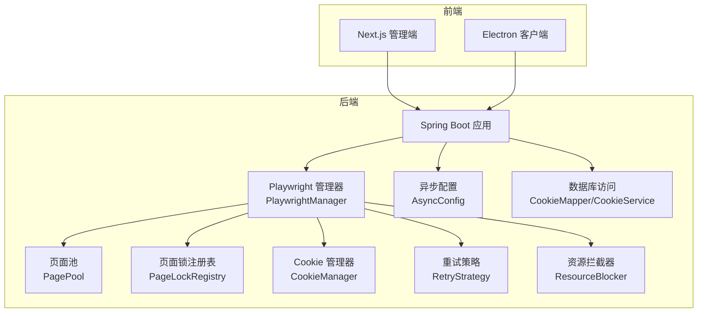

图表来源
- [PlaywrightManager.java:114-221](file://backend/src/main/java/com/getjobs/worker/manager/PlaywrightManager.java#L114-L221)
- [AsyncConfig.java:24-54](file://backend/src/main/java/com/getjobs/application/config/AsyncConfig.java#L24-L54)
- [CookieService.java:27-61](file://backend/src/main/java/com/getjobs/application/service/CookieService.java#L27-L61)

章节来源
- [application.yaml:13-101](file://backend/src/main/resources/application.yaml#L13-L101)
- [AsyncConfig.java:16-55](file://backend/src/main/java/com/getjobs/application/config/AsyncConfig.java#L16-L55)

## 核心组件
- 浏览器实例与上下文管理：PlaywrightManager 负责启动浏览器、创建共享 BrowserContext 与多页面，注入反检测脚本，按平台差异化设置超时与资源拦截。
- 页面池化：PagePool 对 Page 进行注册、使用标记与空闲统计，支持获取统计信息与空闲平台识别，为后续回收策略提供观测数据。
- 并发控制：PageLockRegistry 为各平台页面提供可重入锁，避免导航与并发操作导致的“对象不存在”异常。
- Cookie 生命周期：CookieManager 记录保存时间、预测过期、提前刷新阈值，结合数据库持久化实现跨重启恢复。
- 重试策略：RetryStrategy 提供指数退避加抖动的重试，降低瞬时失败对整体流程的影响。
- 资源拦截：ResourceBlocker 可按扩展名与域名拦截非关键资源，减少网络与内存开销。
- 异步执行：AsyncConfig 定义线程池规模与队列容量，避免主线程阻塞。
- 数据访问：CookieMapper/CookieService 提供基于 MyBatis-Plus 的读写接口，配合 application.yaml 的数据库连接池配置。

章节来源
- [PlaywrightManager.java:114-221](file://backend/src/main/java/com/getjobs/worker/manager/PlaywrightManager.java#L114-L221)
- [PagePool.java:25-134](file://backend/src/main/java/com/getjobs/worker/utils/PagePool.java#L25-L134)
- [PageLockRegistry.java:22-91](file://backend/src/main/java/com/getjobs/worker/utils/PageLockRegistry.java#L22-L91)
- [CookieManager.java:31-98](file://backend/src/main/java/com/getjobs/worker/utils/CookieManager.java#L31-L98)
- [RetryStrategy.java:22-94](file://backend/src/main/java/com/getjobs/worker/utils/RetryStrategy.java#L22-L94)
- [ResourceBlocker.java:23-102](file://backend/src/main/java/com/getjobs/worker/utils/ResourceBlocker.java#L23-L102)
- [AsyncConfig.java:18-54](file://backend/src/main/java/com/getjobs/application/config/AsyncConfig.java#L18-L54)
- [CookieEntity.java:14-53](file://backend/src/main/java/com/getjobs/application/entity/CookieEntity.java#L14-L53)
- [CookieMapper.java:9-10](file://backend/src/main/java/com/getjobs/application/mapper/CookieMapper.java#L9-L10)
- [CookieService.java:16-96](file://backend/src/main/java/com/getjobs/application/service/CookieService.java#L16-L96)

## 架构总览
下图展示了浏览器自动化与任务执行的关键交互路径，包括初始化、并发控制、Cookie 管理与资源拦截。

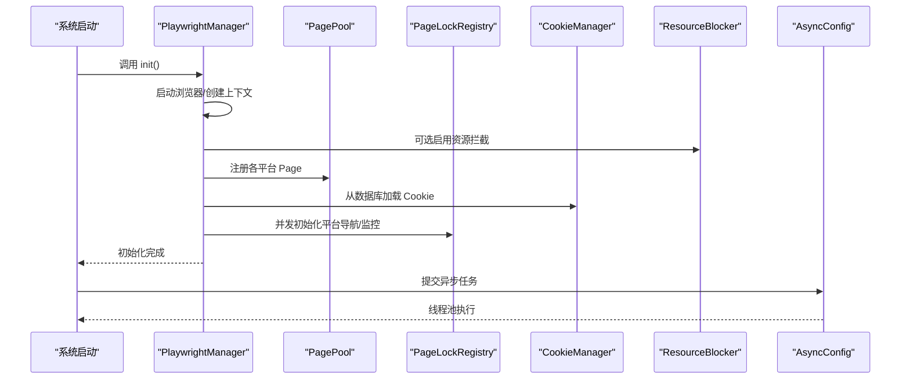

图表来源
- [PlaywrightManager.java:114-221](file://backend/src/main/java/com/getjobs/worker/manager/PlaywrightManager.java#L114-L221)
- [PagePool.java:58-66](file://backend/src/main/java/com/getjobs/worker/utils/PagePool.java#L58-L66)
- [CookieManager.java:204-214](file://backend/src/main/java/com/getjobs/worker/utils/CookieManager.java#L204-L214)
- [ResourceBlocker.java:77-102](file://backend/src/main/java/com/getjobs/worker/utils/ResourceBlocker.java#L77-L102)
- [AsyncConfig.java:24-54](file://backend/src/main/java/com/getjobs/application/config/AsyncConfig.java#L24-L54)

## 详细组件分析

### 浏览器实例与页面生命周期管理
- 初始化流程：启动 Playwright、创建浏览器与共享上下文，注入反检测脚本，按平台设置导航超时，创建并注册 Page 到 PagePool。
- 登录状态监控：为各平台页面绑定导航事件监听，检测登录状态变化并通过暂停/恢复机制避免与任务并发冲突。
- 资源拦截：可选启用，按扩展名与域名拦截非关键资源，降低网络与内存压力。

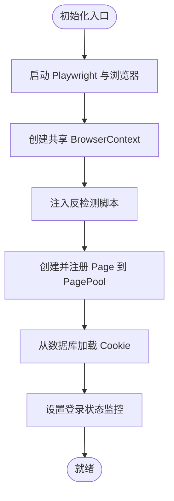

图表来源
- [PlaywrightManager.java:114-221](file://backend/src/main/java/com/getjobs/worker/manager/PlaywrightManager.java#L114-L221)
- [PlaywrightManager.java:254-331](file://backend/src/main/java/com/getjobs/worker/manager/PlaywrightManager.java#L254-L331)
- [PlaywrightManager.java:393-465](file://backend/src/main/java/com/getjobs/worker/manager/PlaywrightManager.java#L393-L465)
- [PlaywrightManager.java:584-686](file://backend/src/main/java/com/getjobs/worker/manager/PlaywrightManager.java#L584-L686)

章节来源
- [PlaywrightManager.java:114-221](file://backend/src/main/java/com/getjobs/worker/manager/PlaywrightManager.java#L114-L221)
- [PlaywrightManager.java:254-331](file://backend/src/main/java/com/getjobs/worker/manager/PlaywrightManager.java#L254-L331)
- [PlaywrightManager.java:393-465](file://backend/src/main/java/com/getjobs/worker/manager/PlaywrightManager.java#L393-L465)
- [PlaywrightManager.java:584-686](file://backend/src/main/java/com/getjobs/worker/manager/PlaywrightManager.java#L584-L686)

### 页面池化与空闲回收（观测阶段）
- 注册与使用：按平台注册 Page，每次获取时标记使用时间与访问次数。
- 统计与空闲识别：输出活跃 Page 数、空闲时长与生命周期，识别超过阈值的空闲平台。
- 回收策略：当前为观测阶段，不执行清理；后续可基于统计结果动态回收空闲 Page。

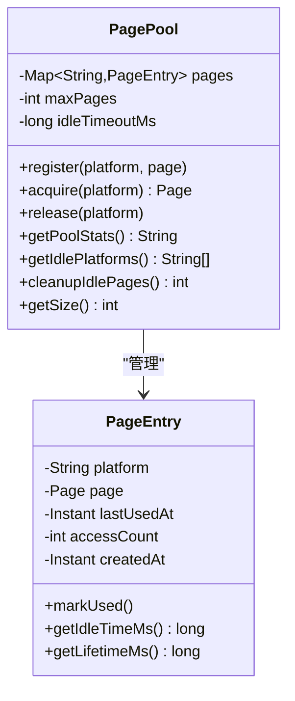

图表来源
- [PagePool.java:25-276](file://backend/src/main/java/com/getjobs/worker/utils/PagePool.java#L25-L276)

章节来源
- [PagePool.java:25-134](file://backend/src/main/java/com/getjobs/worker/utils/PagePool.java#L25-L134)
- [PagePool.java:158-168](file://backend/src/main/java/com/getjobs/worker/utils/PagePool.java#L158-L168)

### 并发控制与锁管理
- PageLockRegistry 为每个平台维护一个可重入锁，提供 tryLock、unlock 与带锁执行方法，避免导航与并发操作冲突。
- 默认超时 10 秒，防止死锁；支持自定义超时与带返回值的执行。

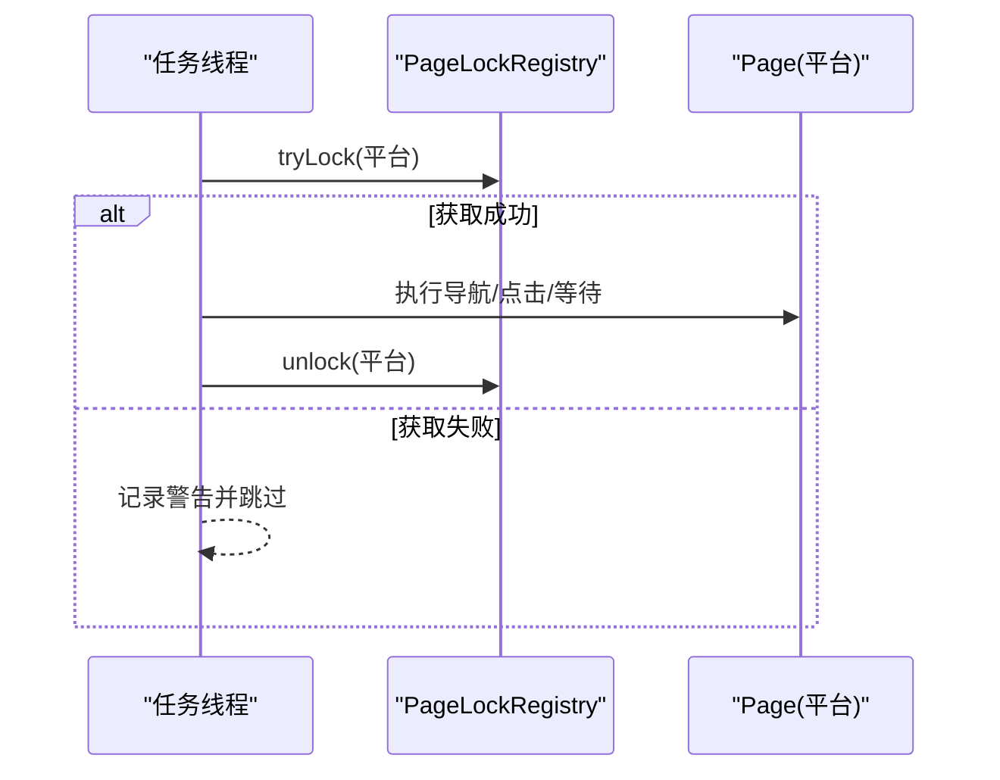

图表来源
- [PageLockRegistry.java:40-91](file://backend/src/main/java/com/getjobs/worker/utils/PageLockRegistry.java#L40-L91)

章节来源
- [PageLockRegistry.java:22-91](file://backend/src/main/java/com/getjobs/worker/utils/PageLockRegistry.java#L22-L91)

### Cookie 生命周期与刷新策略
- 记录保存时间与预期有效期，计算剩余时间与是否即将过期/已过期。
- 提供初始化、刷新标记与状态摘要，便于监控与运维。

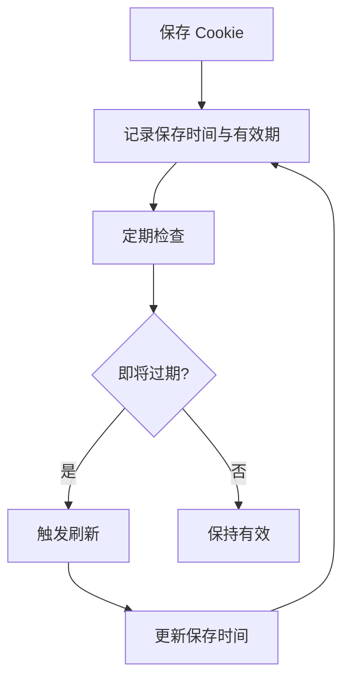

图表来源
- [CookieManager.java:62-98](file://backend/src/main/java/com/getjobs/worker/utils/CookieManager.java#L62-L98)
- [CookieManager.java:136-153](file://backend/src/main/java/com/getjobs/worker/utils/CookieManager.java#L136-L153)

章节来源
- [CookieManager.java:31-98](file://backend/src/main/java/com/getjobs/worker/utils/CookieManager.java#L31-L98)
- [CookieService.java:27-61](file://backend/src/main/java/com/getjobs/application/service/CookieService.java#L27-L61)
- [CookieEntity.java:14-53](file://backend/src/main/java/com/getjobs/application/entity/CookieEntity.java#L14-L53)

### 重试策略与稳定性
- 指数退避加抖动，避免雪崩效应；支持固定延迟与自定义参数。
- 适用于导航、元素点击、Cookie 加载等易受瞬时波动影响的操作。

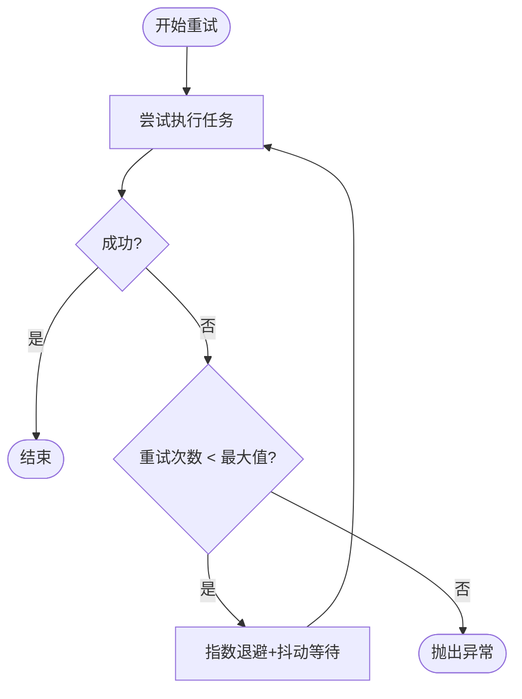

图表来源
- [RetryStrategy.java:64-94](file://backend/src/main/java/com/getjobs/worker/utils/RetryStrategy.java#L64-L94)

章节来源
- [RetryStrategy.java:22-94](file://backend/src/main/java/com/getjobs/worker/utils/RetryStrategy.java#L22-L94)

### 资源拦截与网络优化
- 按扩展名与域名拦截图片、字体、视频、音频及第三方跟踪域，保留二维码与关键验证资源白名单。
- 可在 application.yaml 中开启，显著降低带宽与内存占用。

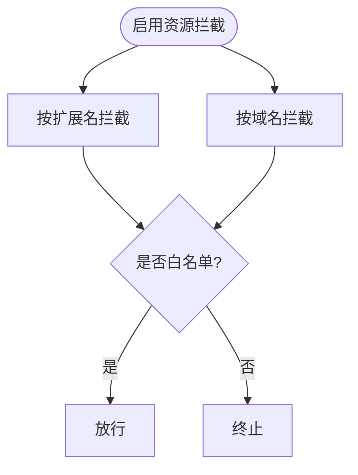

图表来源
- [ResourceBlocker.java:77-102](file://backend/src/main/java/com/getjobs/worker/utils/ResourceBlocker.java#L77-L102)
- [application.yaml:97-97](file://backend/src/main/resources/application.yaml#L97-L97)

章节来源
- [ResourceBlocker.java:23-102](file://backend/src/main/java/com/getjobs/worker/utils/ResourceBlocker.java#L23-L102)
- [application.yaml:97-97](file://backend/src/main/resources/application.yaml#L97-L97)

### 异步处理与线程池
- 线程池规模：核心 2，最大 5，队列 100，拒绝策略 CallerRuns，优雅关闭等待 60 秒。
- 适用于非 CPU 密集型、IO 密集型任务，避免阻塞主线程。

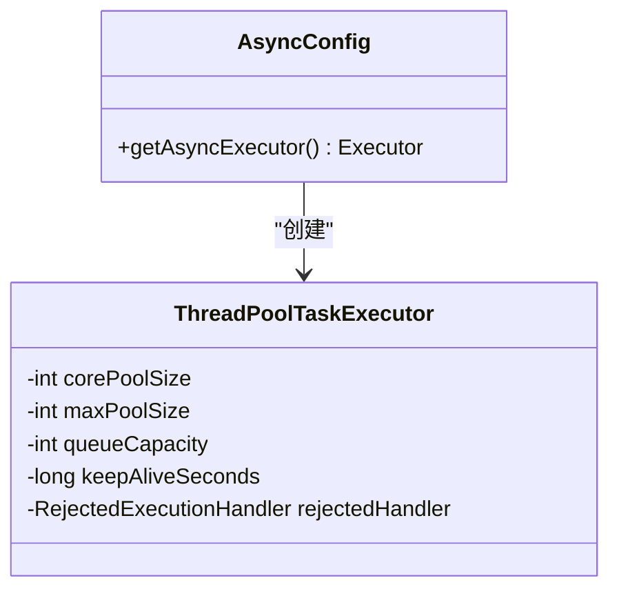

图表来源
- [AsyncConfig.java:24-54](file://backend/src/main/java/com/getjobs/application/config/AsyncConfig.java#L24-L54)

章节来源
- [AsyncConfig.java:18-55](file://backend/src/main/java/com/getjobs/application/config/AsyncConfig.java#L18-L55)

### 数据库访问与查询优化
- Cookie 读取按平台与最新更新时间排序取第一条，避免全表扫描。
- 建议为 platform、updated_at 等字段建立索引，提升高频查询性能。

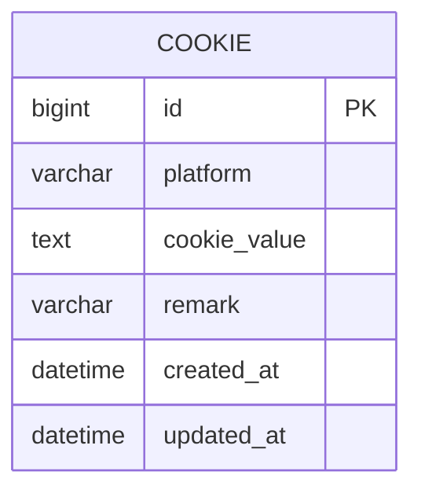

图表来源
- [CookieEntity.java:14-53](file://backend/src/main/java/com/getjobs/application/entity/CookieEntity.java#L14-L53)
- [CookieMapper.java:9-10](file://backend/src/main/java/com/getjobs/application/mapper/CookieMapper.java#L9-L10)
- [CookieService.java:27-33](file://backend/src/main/java/com/getjobs/application/service/CookieService.java#L27-L33)

章节来源
- [CookieService.java:27-33](file://backend/src/main/java/com/getjobs/application/service/CookieService.java#L27-L33)
- [CookieEntity.java:14-53](file://backend/src/main/java/com/getjobs/application/entity/CookieEntity.java#L14-L53)

## 依赖分析
- 组件耦合：PlaywrightManager 依赖 PagePool、PageLockRegistry、CookieManager、ResourceBlocker 与 CookieService；BossJobService 依赖 PlaywrightManager 与配置服务。
- 外部依赖：MySQL 连接池（Hikari）、Playwright 浏览器驱动、MyBatis-Plus ORM。
- 配置依赖：application.yaml 中的数据库连接池、Jasypt 加密、Playwright 参数、日志级别与滚动策略。

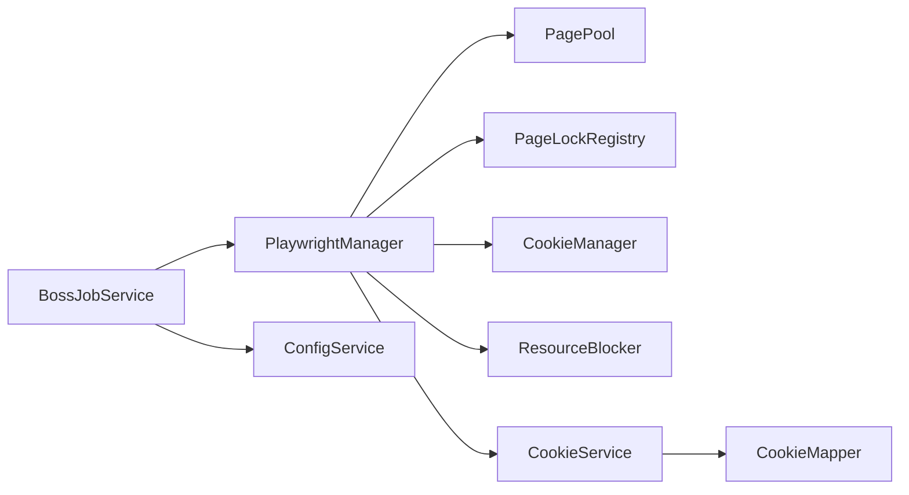

图表来源
- [PlaywrightManager.java:60-91](file://backend/src/main/java/com/getjobs/worker/manager/PlaywrightManager.java#L60-L91)
- [BossJobService.java:28-30](file://backend/src/main/java/com/getjobs/worker/service/BossJobService.java#L28-L30)
- [CookieService.java:20-21](file://backend/src/main/java/com/getjobs/application/service/CookieService.java#L20-L21)

章节来源
- [application.yaml:13-101](file://backend/src/main/resources/application.yaml#L13-L101)
- [PlaywrightManager.java:60-91](file://backend/src/main/java/com/getjobs/worker/manager/PlaywrightManager.java#L60-L91)
- [BossJobService.java:28-30](file://backend/src/main/java/com/getjobs/worker/service/BossJobService.java#L28-L30)

## 性能考量

### 内存使用优化
- 启用资源拦截：在 application.yaml 中开启 playwright.resource-blocking-enabled，拦截图片、字体、音视频与第三方跟踪域，降低 DOM 与内存压力。
- 控制页面数量：根据硬件配置调整 playwright.max-pages，避免同时打开过多页面导致内存峰值过高。
- 空闲回收：当前 PagePool 为观测阶段，建议在下一阶段实现空闲回收，定期清理超过 idle-page-timeout 的 Page。

章节来源
- [application.yaml:97-97](file://backend/src/main/resources/application.yaml#L97-L97)
- [application.yaml:95-96](file://backend/src/main/resources/application.yaml#L95-L96)
- [application.yaml:96-96](file://backend/src/main/resources/application.yaml#L96-L96)
- [PagePool.java:158-168](file://backend/src/main/java/com/getjobs/worker/utils/PagePool.java#L158-L168)

### CPU 占用降低
- 指数退避重试：使用 RetryStrategy 的指数退避+抖动，避免频繁重试造成 CPU 空转。
- 放慢操作速度：slow-mo 可调，适当增大可降低页面渲染与交互的 CPU 压力，但会增加总耗时。
- 并发控制：通过 PageLockRegistry 限制同一页面的并发操作，减少竞争与无效重试。

章节来源
- [RetryStrategy.java:120-125](file://backend/src/main/java/com/getjobs/worker/utils/RetryStrategy.java#L120-L125)
- [application.yaml:73-73](file://backend/src/main/resources/application.yaml#L73-L73)
- [PageLockRegistry.java:40-76](file://backend/src/main/java/com/getjobs/worker/utils/PageLockRegistry.java#L40-L76)

### 网络延迟减少
- 资源拦截：拦截非关键资源，减少带宽占用与首屏渲染时间。
- Cookie 预热：启动时从数据库加载 Cookie，减少登录流程等待。
- 平台差异化超时：针对不同平台设置导航超时，平衡稳定性与速度。

章节来源
- [ResourceBlocker.java:77-102](file://backend/src/main/java/com/getjobs/worker/utils/ResourceBlocker.java#L77-L102)
- [PlaywrightManager.java:254-331](file://backend/src/main/java/com/getjobs/worker/manager/PlaywrightManager.java#L254-L331)
- [application.yaml:78-86](file://backend/src/main/resources/application.yaml#L78-L86)

### 数据库查询优化
- 查询路径：按平台与最新更新时间取第一条记录，避免全表扫描。
- 建议索引：为 platform、updated_at 建立索引；delivery_report 表已具备多字段索引，有利于报告查询与聚合。

章节来源
- [CookieService.java:27-33](file://backend/src/main/java/com/getjobs/application/service/CookieService.java#L27-L33)
- [001_create_delivery_report.sql:4-24](file://scripts/migration/001_create_delivery_report.sql#L4-L24)

### 缓存策略
- Cookie 生命周期缓存：CookieManager 记录保存时间与剩余有效期，避免频繁刷新。
- 页面统计缓存：PagePool 提供 getPoolStats 与空闲平台识别，可用于运维监控与调度决策。

章节来源
- [CookieManager.java:62-98](file://backend/src/main/java/com/getjobs/worker/utils/CookieManager.java#L62-L98)
- [PagePool.java:116-134](file://backend/src/main/java/com/getjobs/worker/utils/PagePool.java#L116-L134)

### 异步处理最佳实践
- 线程池参数：核心 2、最大 5、队列 100，拒绝策略 CallerRuns，适合 IO 密集型任务。
- 任务拆分：将耗时的页面导航与数据抓取拆分为异步任务，避免阻塞主线程。
- 关闭优雅：等待任务完成再关闭线程池，确保任务完整性。

章节来源
- [AsyncConfig.java:24-54](file://backend/src/main/java/com/getjobs/application/config/AsyncConfig.java#L24-L54)

### 性能监控指标与基准测试
- 监控指标建议：
  - 页面池：活跃 Page 数、空闲时长分布、回收次数。
  - 并发：Page 锁等待时长与队列长度、锁持有状态。
  - Cookie：剩余有效期、刷新频率、过期率。
  - 资源：拦截命中数、被放行数、网络节省比例。
  - 数据库：Cookie 查询 QPS、平均响应时间、慢查询。
- 基准测试方法：
  - 页面池：在不同 max-pages 下压测投递吞吐，观察内存与成功率。
  - 并发：多线程提交相同任务，测量 P95/P99 延迟与错误率。
  - 资源拦截：对比开启/关闭拦截的内存峰值与首屏时间。
  - 数据库：对 Cookie 查询进行压力测试，评估索引效果。

章节来源
- [PagePool.java:116-134](file://backend/src/main/java/com/getjobs/worker/utils/PagePool.java#L116-L134)
- [PageLockRegistry.java:176-187](file://backend/src/main/java/com/getjobs/worker/utils/PageLockRegistry.java#L176-L187)
- [CookieManager.java:175-197](file://backend/src/main/java/com/getjobs/worker/utils/CookieManager.java#L175-L197)
- [ResourceBlocker.java:167-174](file://backend/src/main/java/com/getjobs/worker/utils/ResourceBlocker.java#L167-L174)
- [CookieService.java:27-33](file://backend/src/main/java/com/getjobs/application/service/CookieService.java#L27-L33)

### 不同硬件配置下的调优建议
- 低配机器（4C8G）：
  - 将 playwright.max-pages 降至 2-3，idle-page-timeout 设为 300s，slow-mo 适当增大。
  - 关闭资源拦截，减少额外处理开销。
  - Async 线程池核心/最大设为 2，队列 50。
- 中配机器（8C16G）：
  - max-pages 4，idle 300s，开启资源拦截。
  - slow-mo 适中，线程池核心 3，最大 5，队列 100。
- 高配机器（16C32G+SSD）：
  - max-pages 6-8，idle 600s，开启资源拦截。
  - slow-mo 较小，线程池核心 4-5，最大 8，队列 200。

章节来源
- [application.yaml:95-96](file://backend/src/main/resources/application.yaml#L95-L96)
- [application.yaml:96-96](file://backend/src/main/resources/application.yaml#L96-L96)
- [application.yaml:73-73](file://backend/src/main/resources/application.yaml#L73-L73)
- [AsyncConfig.java:30-32](file://backend/src/main/java/com/getjobs/application/config/AsyncConfig.java#L30-L32)

## 故障排查指南
- 页面导航异常（“对象不存在”）：
  - 使用 PageLockRegistry 为平台加锁，避免并发导航。
  - 启用 RetryStrategy 对关键步骤进行指数退避重试。
- 登录状态检测不准确：
  - 检查各平台登录特征选择器是否正确，必要时更新 locators。
  - 通过 PlaywrightManager 的暂停/恢复机制避免监控与任务并发冲突。
- Cookie 过期或失效：
  - 使用 CookieManager 的 isExpiringSoon/isExpired 判断，提前刷新。
  - 确认数据库中 Cookie 的保存时间与平台预期有效期一致。
- 资源拦截误伤：
  - 检查白名单模式，确保二维码与关键验证资源放行。
  - 临时关闭拦截定位问题来源。
- 数据库查询缓慢：
  - 确认 platform、updated_at 等字段索引存在。
  - 优化查询条件，避免不必要的排序与 LIMIT。

章节来源
- [PageLockRegistry.java:40-91](file://backend/src/main/java/com/getjobs/worker/utils/PageLockRegistry.java#L40-L91)
- [RetryStrategy.java:64-94](file://backend/src/main/java/com/getjobs/worker/utils/RetryStrategy.java#L64-L94)
- [PlaywrightManager.java:376-388](file://backend/src/main/java/com/getjobs/worker/manager/PlaywrightManager.java#L376-L388)
- [CookieManager.java:74-98](file://backend/src/main/java/com/getjobs/worker/utils/CookieManager.java#L74-L98)
- [ResourceBlocker.java:110-122](file://backend/src/main/java/com/getjobs/worker/utils/ResourceBlocker.java#L110-L122)
- [CookieService.java:27-33](file://backend/src/main/java/com/getjobs/application/service/CookieService.java#L27-L33)

## 结论
通过合理的浏览器实例管理、页面池化观测、并发控制与资源拦截，结合指数退避重试与异步线程池，GetJobs 能在不同硬件配置下实现稳定高效的自动化投递。建议在生产环境中逐步启用资源拦截、合理设置页面数量与线程池规模，并持续监控关键指标以指导进一步优化。

## 附录
- 配置项速览（application.yaml）
  - 数据库连接池：maximum-pool-size、idle-timeout、max-lifetime
  - Playwright：slow-mo、navigation-timeout、max-pages、idle-page-timeout、resource-blocking-enabled
  - 日志：rolling policy、文件路径
- 数据库迁移
  - delivery_report 表结构与索引设计，支持投递结果统计与分析。

章节来源
- [application.yaml:13-101](file://backend/src/main/resources/application.yaml#L13-L101)
- [001_create_delivery_report.sql:4-24](file://scripts/migration/001_create_delivery_report.sql#L4-L24)