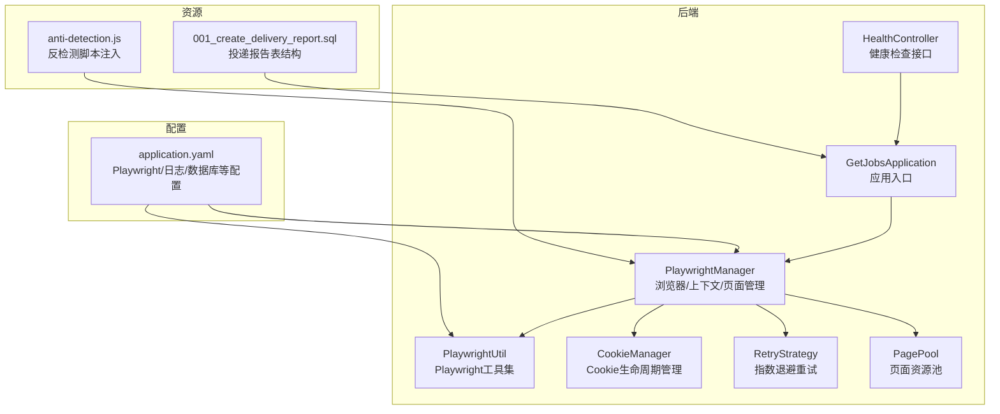
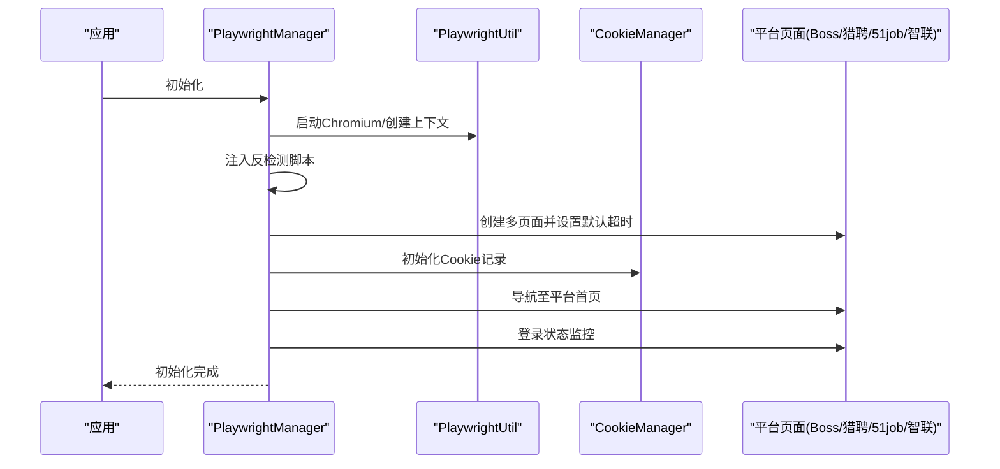
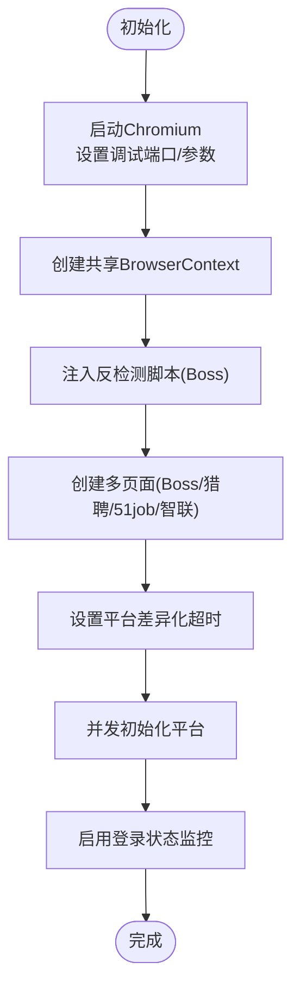
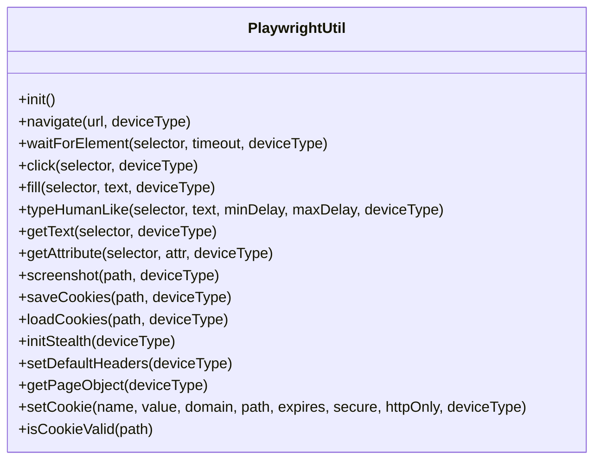
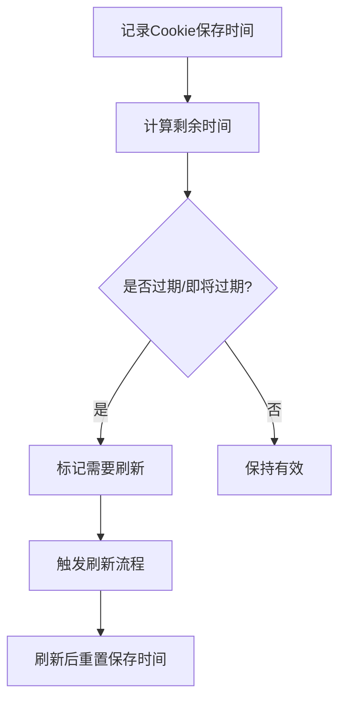
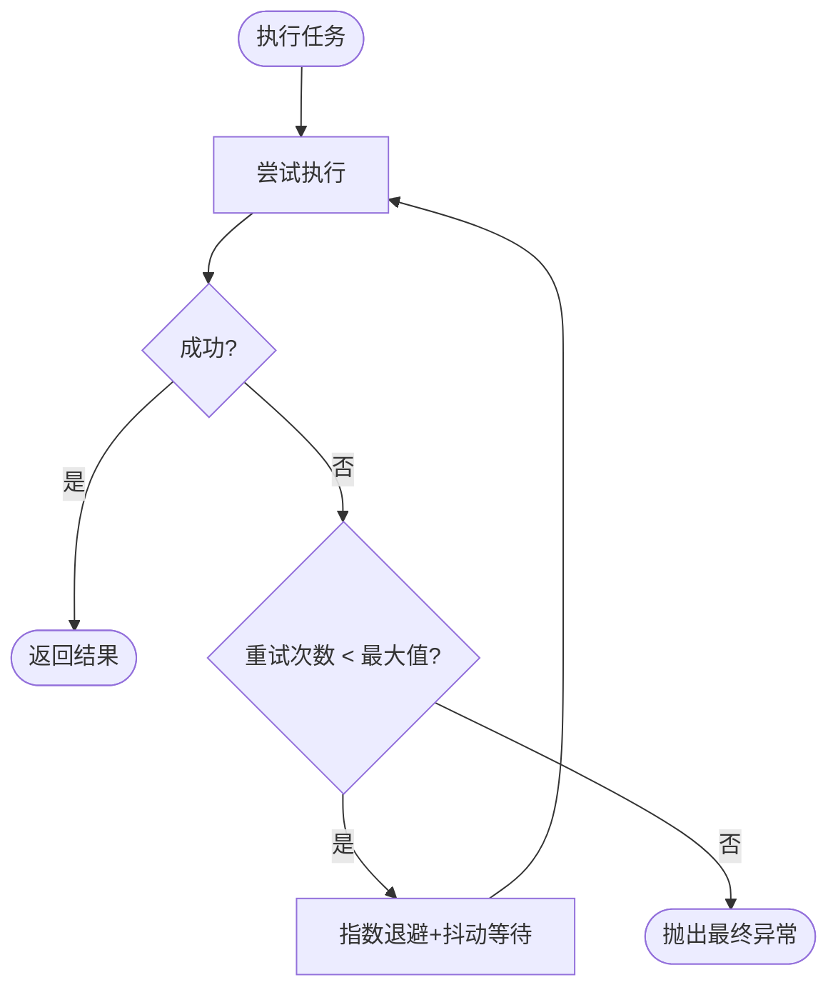
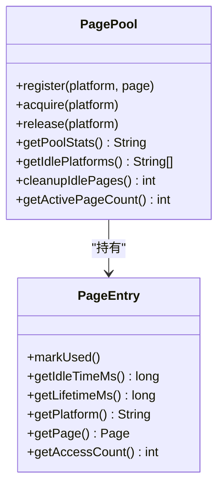
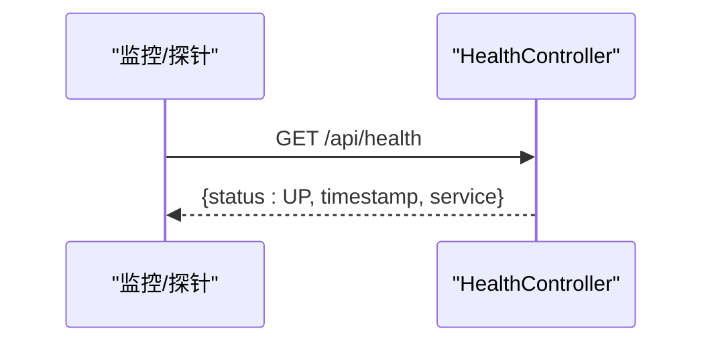
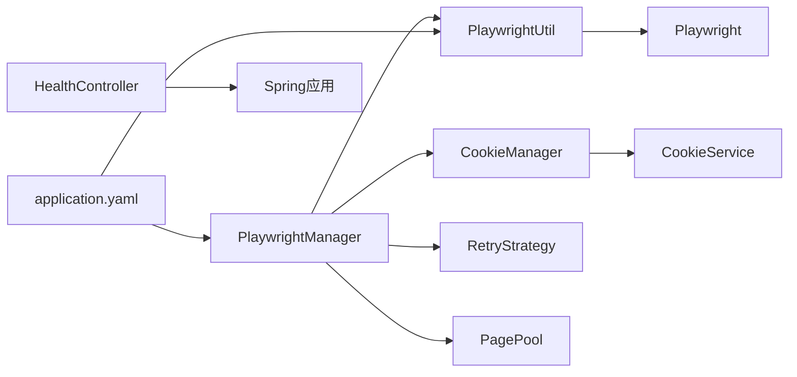

# 故障排除

<cite>
**本文引用的文件**   
- [application.yaml](file://backend/src/main/resources/application.yaml)
- [GetJobsApplication.java](file://backend/src/main/java/com/getjobs/GetJobsApplication.java)
- [anti-detection.js](file://backend/src/main/resources/anti-detection.js)
- [PlaywrightManager.java](file://backend/src/main/java/com/getjobs/worker/manager/PlaywrightManager.java)
- [PlaywrightUtil.java](file://backend/src/main/java/com/getjobs/worker/utils/PlaywrightUtil.java)
- [CookieManager.java](file://backend/src/main/java/com/getjobs/worker/utils/CookieManager.java)
- [RetryStrategy.java](file://backend/src/main/java/com/getjobs/worker/utils/RetryStrategy.java)
- [PagePool.java](file://backend/src/main/java/com/getjobs/worker/utils/PagePool.java)
- [HealthController.java](file://backend/src/main/java/com/getjobs/application/controller/HealthController.java)
- [001_create_delivery_report.sql](file://scripts/migration/001_create_delivery_report.sql)
- [README.md](file://README.md)
</cite>

## 目录
1. [简介](#简介)
2. [项目结构](#项目结构)
3. [核心组件](#核心组件)
4. [架构总览](#架构总览)
5. [详细组件分析](#详细组件分析)
6. [依赖分析](#依赖分析)
7. [性能考量](#性能考量)
8. [故障排除指南](#故障排除指南)
9. [结论](#结论)
10. [附录](#附录)

## 简介
本故障排除文档面向用户、技术支持与系统维护人员，聚焦 GetJobs 项目在浏览器驱动、网络连接、平台兼容性、日志分析、错误码、调试工具、性能优化、平台特定问题（如 Boss 直聘检测机制、智联招聘投递限制）、系统健康检查、监控告警与自动恢复等方面。文档以仓库现有实现为依据，结合配置与代码行为，提供可操作的诊断与修复步骤。

## 项目结构
后端采用 Spring Boot 应用，Playwright 管理多平台求职站点（Boss、猎聘、51job、智联），通过共享 BrowserContext 在同一窗口多标签页运行，配合 Cookie 生命周期管理、重试策略与资源池监控，实现稳定自动化。

**图表来源**
- [GetJobsApplication.java:15-22](file://backend/src/main/java/com/getjobs/GetJobsApplication.java#L15-L22)
- [PlaywrightManager.java:40-221](file://backend/src/main/java/com/getjobs/worker/manager/PlaywrightManager.java#L40-L221)
- [PlaywrightUtil.java:19-118](file://backend/src/main/java/com/getjobs/worker/utils/PlaywrightUtil.java#L19-L118)
- [CookieManager.java:29-197](file://backend/src/main/java/com/getjobs/worker/utils/CookieManager.java#L29-L197)
- [RetryStrategy.java:22-94](file://backend/src/main/java/com/getjobs/worker/utils/RetryStrategy.java#L22-L94)
- [PagePool.java:24-134](file://backend/src/main/java/com/getjobs/worker/utils/PagePool.java#L24-L134)
- [HealthController.java:15-32](file://backend/src/main/java/com/getjobs/application/controller/HealthController.java#L15-L32)
- [application.yaml:1-91](file://backend/src/main/resources/application.yaml#L1-L91)
- [anti-detection.js:1-109](file://backend/src/main/resources/anti-detection.js#L1-L109)
- [001_create_delivery_report.sql:1-29](file://scripts/migration/001_create_delivery_report.sql#L1-L29)

**章节来源**
- [GetJobsApplication.java:15-22](file://backend/src/main/java/com/getjobs/GetJobsApplication.java#L15-L22)
- [application.yaml:1-91](file://backend/src/main/resources/application.yaml#L1-L91)

## 核心组件
- PlaywrightManager：负责 Chromium 启动、共享 BrowserContext、多页面创建与初始化、平台登录状态监控、反检测脚本注入、资源拦截开关、Cookie 管理与刷新触发。
- PlaywrightUtil：封装浏览器操作（导航、等待、点击、输入、截图、Cookie 读写、Stealth 注入等），提供默认超时与调试参数。
- CookieManager：记录 Cookie 保存时间、计算剩余有效期、判断即将过期/已过期、触发刷新、输出状态摘要。
- RetryStrategy：指数退避+抖动重试策略，支持固定延迟重试。
- PagePool：页面资源池统计与空闲检测（阶段 1：仅观测）。
- HealthController：对外暴露健康检查接口。
- anti-detection.js：反检测脚本，注入到 Boss 上下文，降低被识别为自动化概率。
- application.yaml：Playwright 参数（慢动作、导航超时、重试、健康检查间隔、页面数、Cookie 刷新阈值等）、日志、数据库连接等。

**章节来源**
- [PlaywrightManager.java:40-221](file://backend/src/main/java/com/getjobs/worker/manager/PlaywrightManager.java#L40-L221)
- [PlaywrightUtil.java:19-118](file://backend/src/main/java/com/getjobs/worker/utils/PlaywrightUtil.java#L19-L118)
- [CookieManager.java:29-197](file://backend/src/main/java/com/getjobs/worker/utils/CookieManager.java#L29-L197)
- [RetryStrategy.java:22-94](file://backend/src/main/java/com/getjobs/worker/utils/RetryStrategy.java#L22-L94)
- [PagePool.java:24-134](file://backend/src/main/java/com/getjobs/worker/utils/PagePool.java#L24-L134)
- [HealthController.java:15-32](file://backend/src/main/java/com/getjobs/application/controller/HealthController.java#L15-L32)
- [anti-detection.js:1-109](file://backend/src/main/resources/anti-detection.js#L1-L109)
- [application.yaml:60-91](file://backend/src/main/resources/application.yaml#L60-L91)

## 架构总览
系统通过 PlaywrightManager 统一管理浏览器生命周期与多平台页面，利用 CookieManager 与 PlaywrightUtil 的 Cookie 读写能力维持登录态，借助 RetryStrategy 与 PagePool 的统计能力提升稳定性与可观测性。

**图表来源**
- [PlaywrightManager.java:114-221](file://backend/src/main/java/com/getjobs/worker/manager/PlaywrightManager.java#L114-L221)
- [PlaywrightUtil.java:44-78](file://backend/src/main/java/com/getjobs/worker/utils/PlaywrightUtil.java#L44-L78)
- [CookieManager.java:204-214](file://backend/src/main/java/com/getjobs/worker/utils/CookieManager.java#L204-L214)

## 详细组件分析

### PlaywrightManager（浏览器/上下文/页面管理）
- 启动参数：非无头模式、固定调试端口、最大化窗口、禁用沙箱与扩展，便于可视化调试与降低冲突。
- 共享上下文：同一 BrowserContext 下的多页面共享登录态，减少重复扫码与登录成本。
- 反检测：Boss 上下文注入 anti-detection.js，降低被识别为自动化。
- 资源拦截：可选开启，降低内存占用与网络开销。
- 平台超时：按平台差异化配置导航超时，适配不同站点加载特性。
- 登录监控：监听页面导航事件，检测登录状态变化并触发回调（如保存 Cookie）。

**图表来源**
- [PlaywrightManager.java:114-221](file://backend/src/main/java/com/getjobs/worker/manager/PlaywrightManager.java#L114-L221)
- [anti-detection.js:1-109](file://backend/src/main/resources/anti-detection.js#L1-L109)

**章节来源**
- [PlaywrightManager.java:114-221](file://backend/src/main/java/com/getjobs/worker/manager/PlaywrightManager.java#L114-L221)
- [application.yaml:60-91](file://backend/src/main/resources/application.yaml#L60-L91)

### PlaywrightUtil（浏览器工具集）
- 导航、等待、点击、输入、截图、元素定位与属性读取。
- Stealth 注入：设置额外 HTTP 头、注入反检测脚本，必要时加载外部 stealth 文件。
- Cookie 读写：支持 JSON 格式保存/加载，校验有效性。
- 调试参数：默认非无头模式、慢动作参数，便于本地排障。

**图表来源**
- [PlaywrightUtil.java:19-610](file://backend/src/main/java/com/getjobs/worker/utils/PlaywrightUtil.java#L19-L610)

**章节来源**
- [PlaywrightUtil.java:44-118](file://backend/src/main/java/com/getjobs/worker/utils/PlaywrightUtil.java#L44-L118)

### CookieManager（Cookie 生命周期管理）
- 记录 Cookie 保存时间与预期有效期（天），计算剩余时间。
- 判断即将过期/已过期，触发刷新标记。
- 输出状态摘要，便于监控与调试。
- 从数据库初始化 Cookie 记录。

**图表来源**
- [CookieManager.java:62-153](file://backend/src/main/java/com/getjobs/worker/utils/CookieManager.java#L62-L153)

**章节来源**
- [CookieManager.java:29-197](file://backend/src/main/java/com/getjobs/worker/utils/CookieManager.java#L29-L197)
- [application.yaml:89-91](file://backend/src/main/resources/application.yaml#L89-L91)

### RetryStrategy（重试策略）
- 指数退避+抖动，避免雪崩与同步重试。
- 支持固定延迟重试，适用于简单场景。
- 提供任务名称与重试日志，便于定位失败点。

**图表来源**
- [RetryStrategy.java:49-94](file://backend/src/main/java/com/getjobs/worker/utils/RetryStrategy.java#L49-L94)

**章节来源**
- [RetryStrategy.java:22-94](file://backend/src/main/java/com/getjobs/worker/utils/RetryStrategy.java#L22-L94)
- [application.yaml:78-82](file://backend/src/main/resources/application.yaml#L78-L82)

### PagePool（页面资源池）
- 统计页面访问次数、空闲时间、存在时间，输出资源池状态。
- 空闲检测（阶段 1：仅统计，不回收）。

**图表来源**
- [PagePool.java:24-278](file://backend/src/main/java/com/getjobs/worker/utils/PagePool.java#L24-L278)

**章节来源**
- [PagePool.java:24-134](file://backend/src/main/java/com/getjobs/worker/utils/PagePool.java#L24-L134)

### HealthController（健康检查）
- 提供 /api/health 接口，返回服务状态与时间戳，便于外部监控。

**图表来源**
- [HealthController.java:24-31](file://backend/src/main/java/com/getjobs/application/controller/HealthController.java#L24-L31)

**章节来源**
- [HealthController.java:15-32](file://backend/src/main/java/com/getjobs/application/controller/HealthController.java#L15-L32)

## 依赖分析
- 组件耦合：PlaywrightManager 作为协调者，依赖 PlaywrightUtil、CookieManager、RetryStrategy、PagePool；PlaywrightUtil 依赖 Playwright；CookieManager 依赖 CookieService；HealthController 依赖应用上下文。
- 外部依赖：Chromium、MySQL、Playwright 运行时。
- 配置依赖：application.yaml 中的 Playwright 参数、日志级别、数据库连接、JWT 等。

**图表来源**
- [PlaywrightManager.java:90-110](file://backend/src/main/java/com/getjobs/worker/manager/PlaywrightManager.java#L90-L110)
- [PlaywrightUtil.java:3-14](file://backend/src/main/java/com/getjobs/worker/utils/PlaywrightUtil.java#L3-L14)
- [CookieManager.java:49-50](file://backend/src/main/java/com/getjobs/worker/utils/CookieManager.java#L49-L50)
- [application.yaml:1-91](file://backend/src/main/resources/application.yaml#L1-L91)

**章节来源**
- [PlaywrightManager.java:90-110](file://backend/src/main/java/com/getjobs/worker/manager/PlaywrightManager.java#L90-L110)
- [application.yaml:1-91](file://backend/src/main/resources/application.yaml#L1-L91)

## 性能考量
- 导航超时与慢动作：通过 application.yaml 的 slow-mo、navigation-timeout、平台差异化超时平衡稳定性与性能。
- 资源拦截：可选开启，降低网络与内存压力。
- 页面池：限制最大页面数与空闲回收阈值，避免资源泄露。
- 重试策略：指数退避+抖动，减少瞬时失败对吞吐的影响。
- 日志级别：INFO 级别输出，兼顾可观测性与性能。

**章节来源**
- [application.yaml:60-91](file://backend/src/main/resources/application.yaml#L60-L91)
- [PlaywrightManager.java:160-166](file://backend/src/main/java/com/getjobs/worker/manager/PlaywrightManager.java#L160-L166)
- [PagePool.java:46-49](file://backend/src/main/java/com/getjobs/worker/utils/PagePool.java#L46-L49)
- [RetryStrategy.java:120-125](file://backend/src/main/java/com/getjobs/worker/utils/RetryStrategy.java#L120-L125)

## 故障排除指南

### 一、浏览器驱动与环境问题
- 症状
  - 启动失败或找不到 Chromium。
  - 页面无法导航或频繁刷新。
  - 控制台报“对象不存在”异常。
- 原因分析
  - Chromium 路径错误或未安装。
  - 并发导航导致 Playwright 抛出“对象不存在”异常。
  - 无头模式与可视化调试参数冲突。
- 解决步骤
  - 按提示执行 Playwright 安装命令，确认 Chromium 路径存在。
  - 使用 PlaywrightManager 的导航重试逻辑与等待 NETWORKIDLE。
  - 非无头模式便于本地调试，必要时调整 slow-mo。
  - 检查调试端口与浏览器参数，避免冲突。

**章节来源**
- [PlaywrightManager.java:127-150](file://backend/src/main/java/com/getjobs/worker/manager/PlaywrightManager.java#L127-L150)
- [PlaywrightManager.java:276-308](file://backend/src/main/java/com/getjobs/worker/manager/PlaywrightManager.java#L276-L308)
- [PlaywrightUtil.java:44-78](file://backend/src/main/java/com/getjobs/worker/utils/PlaywrightUtil.java#L44-L78)

### 二、网络连接与代理问题
- 症状
  - 页面加载缓慢或超时。
  - 平台返回空白或异常页面。
- 原因分析
  - 外网代理导致页面加载异常。
  - DNS 或防火墙限制。
- 解决步骤
  - 关闭墙外代理，确保国内平台访问顺畅。
  - 检查网络连通性与 DNS 解析。
  - 调整 navigation-timeout 与 resource-blocking-enabled。

**章节来源**
- [application.yaml:60-91](file://backend/src/main/resources/application.yaml#L60-L91)
- [README.md:54-57](file://README.md#L54-L57)

### 三、平台兼容性与检测机制
- Boss 直聘
  - 症状：投递过程中不断刷新。
  - 原因分析：平台新增检测机制。
  - 解决步骤
    - 确保反检测脚本已注入（Boss 上下文）。
    - 适当提高 navigation-timeout 与 slow-mo。
    - 使用 Stealth 注入额外 HTTP 头与属性屏蔽。
    - 关注项目讨论区，收集社区经验。
- 猎聘
  - 症状：登录页引导与二维码切换。
  - 原因分析：登录入口检测与二维码切换逻辑。
  - 解决步骤
    - 确认已加载 Cookie 并导航至登录页。
    - 观察二维码切换按钮并等待扫码。
- 51job/智联招聘
  - 症状：投递上限、页面限制。
  - 原因分析：平台风控策略。
  - 解决步骤
    - 严格遵循平台限制，避免过度投递。
    - 使用 Cookie 生命周期管理，及时刷新登录态。

**章节来源**
- [README.md:24-29](file://README.md#L24-L29)
- [PlaywrightManager.java:226-237](file://backend/src/main/java/com/getjobs/worker/manager/PlaywrightManager.java#L226-L237)
- [PlaywrightManager.java:393-561](file://backend/src/main/java/com/getjobs/worker/manager/PlaywrightManager.java#L393-L561)
- [PlaywrightManager.java:584-717](file://backend/src/main/java/com/getjobs/worker/manager/PlaywrightManager.java#L584-L717)
- [application.yaml:67-76](file://backend/src/main/resources/application.yaml#L67-L76)

### 四、日志分析与调试工具
- 日志位置与级别
  - 控制台格式化输出，文件日志路径与滚动策略。
  - 建议在问题复现阶段临时提升日志级别以获取更多上下文。
- 调试工具
  - Playwright 调试端口固定，便于远程调试。
  - 非无头模式与慢动作参数便于观察页面行为。
  - 截图与元素截图辅助定位 UI 选择器问题。

**章节来源**
- [application.yaml:32-43](file://backend/src/main/resources/application.yaml#L32-L43)
- [PlaywrightManager.java:138-149](file://backend/src/main/java/com/getjobs/worker/manager/PlaywrightManager.java#L138-L149)
- [PlaywrightUtil.java:136-157](file://backend/src/main/java/com/getjobs/worker/utils/PlaywrightUtil.java#L136-L157)
- [PlaywrightUtil.java:293-316](file://backend/src/main/java/com/getjobs/worker/utils/PlaywrightUtil.java#L293-L316)

### 五、错误码与常见异常
- HTTP 访问回退错误码（前端 Next.js）
  - NEXT_HTTP_ERROR_FALLBACK：用于错误回退场景的统一错误码标识。
  - 常见状态：401 未授权、403 禁止访问、404 未找到。
- Playwright 导航异常
  - “对象不存在”：并发导航导致，系统已内置重试与兜底判断。
- 建议
  - 结合日志与截图定位具体失败步骤。
  - 使用重试策略与固定延迟重试处理瞬时失败。

**章节来源**
- [PlaywrightManager.java:286-307](file://backend/src/main/java/com/getjobs/worker/manager/PlaywrightManager.java#L286-L307)

### 六、性能问题排查与优化
- 导航超时与慢动作
  - 适当提高 navigation-timeout，降低 slow-mo。
- 资源拦截
  - 开启 resource-blocking-enabled 降低内存与网络压力。
- 页面池
  - 控制 max-pages 与 idle-timeout，避免资源泄露。
- 重试策略
  - 使用指数退避+抖动，减少失败重试对系统压力。

**章节来源**
- [application.yaml:60-91](file://backend/src/main/resources/application.yaml#L60-L91)
- [PlaywrightManager.java:160-166](file://backend/src/main/java/com/getjobs/worker/manager/PlaywrightManager.java#L160-L166)
- [PagePool.java:46-49](file://backend/src/main/java/com/getjobs/worker/utils/PagePool.java#L46-L49)
- [RetryStrategy.java:120-125](file://backend/src/main/java/com/getjobs/worker/utils/RetryStrategy.java#L120-L125)

### 七、平台特定问题与解决方案
- Boss 直聘检测机制
  - 注入 anti-detection.js 与 Stealth 头部。
  - 提高导航超时与慢动作，避免被识别。
- 智联招聘投递限制
  - 指定默认投递简历类型，否则投递失败。
  - 遵守平台投递上限，避免触发风控。
- 51job 投递限制
  - 遵循平台限制，避免投递上限。
  - 使用 Cookie 生命周期管理，及时刷新登录态。

**章节来源**
- [README.md:128-132](file://README.md#L128-L132)
- [PlaywrightManager.java:226-237](file://backend/src/main/java/com/getjobs/worker/manager/PlaywrightManager.java#L226-L237)
- [application.yaml:67-76](file://backend/src/main/resources/application.yaml#L67-L76)

### 八、系统健康检查、监控告警与自动恢复
- 健康检查
  - 调用 /api/health 返回服务状态与时间戳。
- 监控告警
  - 建议结合日志滚动策略与外部监控系统，对异常进行告警。
- 自动恢复
  - 导航失败与 Cookie 失效时触发重试与刷新流程。
  - 登录状态监控在状态变化时自动保存 Cookie。

**章节来源**
- [HealthController.java:24-31](file://backend/src/main/java/com/getjobs/application/controller/HealthController.java#L24-L31)
- [PlaywrightManager.java:376-388](file://backend/src/main/java/com/getjobs/worker/manager/PlaywrightManager.java#L376-L388)
- [CookieManager.java:136-153](file://backend/src/main/java/com/getjobs/worker/utils/CookieManager.java#L136-L153)

### 九、数据库与投递报告
- 投递报告表结构
  - 包含成功/失败/过滤数量与详情，便于统计与审计。
- 建议
  - 确保数据库连接正确，定期清理历史数据。

**章节来源**
- [001_create_delivery_report.sql:4-24](file://scripts/migration/001_create_delivery_report.sql#L4-L24)

### 十、社区支持与问题反馈
- 社区渠道
  - QQ 群：获取免费答疑与经验分享。
- 问题反馈
  - 在群内沟通，保持礼貌提问，提供日志与截图以便定位问题。

**章节来源**
- [README.md:158-173](file://README.md#L158-L173)

## 结论
通过 PlaywrightManager 的统一管理、PlaywrightUtil 的工具能力、CookieManager 的生命周期控制、RetryStrategy 的重试策略与 PagePool 的资源观测，系统在浏览器驱动、网络连接、平台兼容性与性能方面具备较好的稳定性与可观测性。结合健康检查与日志分析，可快速定位并解决问题。对于平台特定限制与检测机制，建议遵循平台规则并持续关注社区经验。

## 附录
- 关键配置项速览
  - Playwright：slow-mo、navigation-timeout、平台差异化超时、max-retries、retry-base-delay、retry-max-delay、health-check-interval、max-pages、idle-page-timeout、resource-blocking-enabled、cookie-refresh-before-expiry。
  - 日志：控制台格式、文件路径、滚动策略。
  - 数据库：连接参数、MyBatis Plus 配置。

**章节来源**
- [application.yaml:60-91](file://backend/src/main/resources/application.yaml#L60-L91)