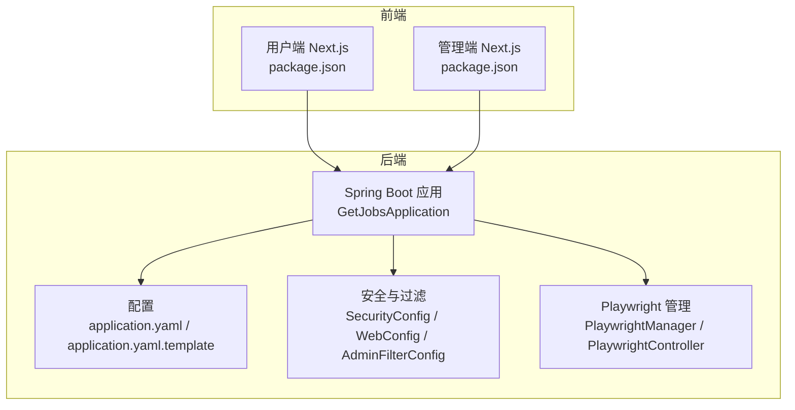
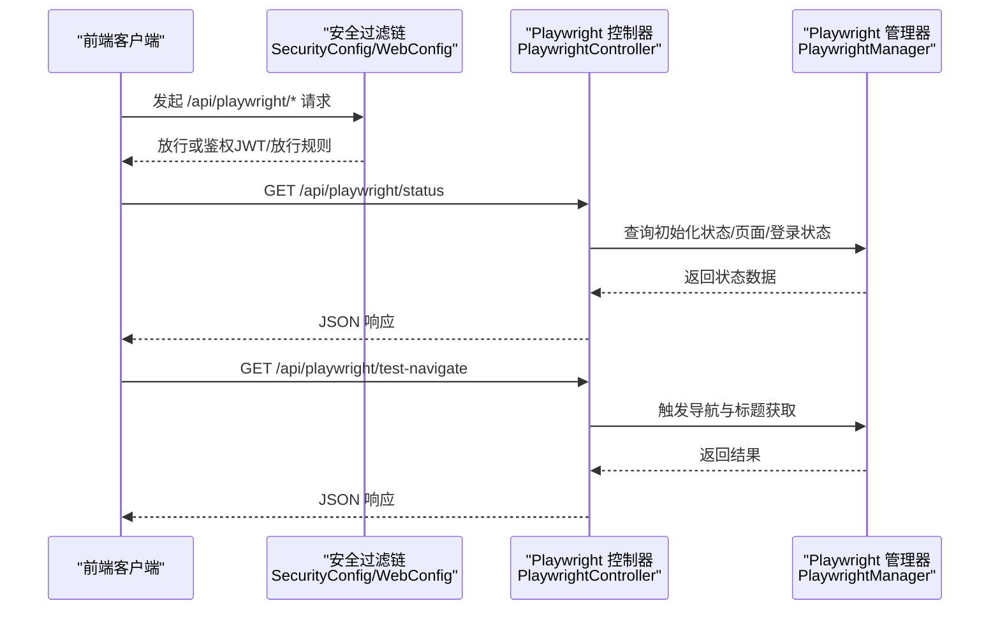
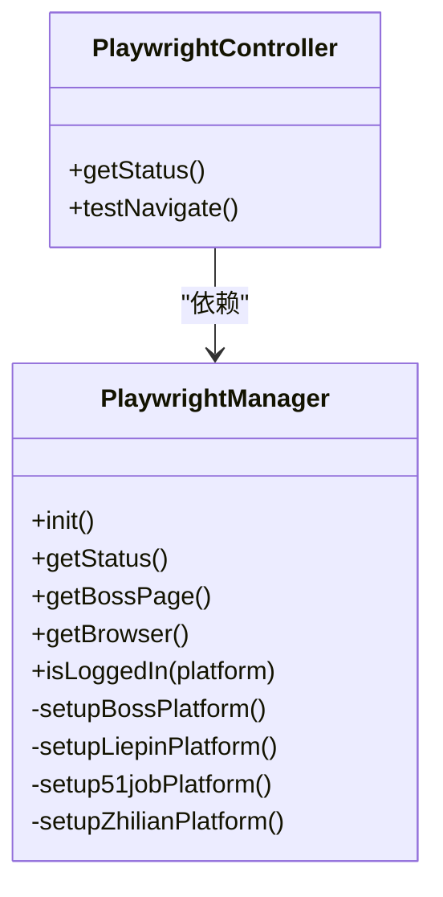
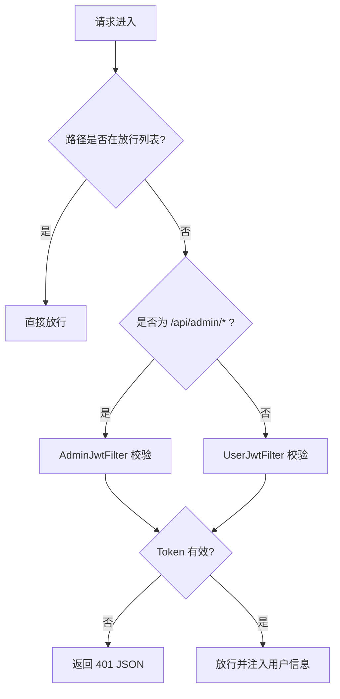
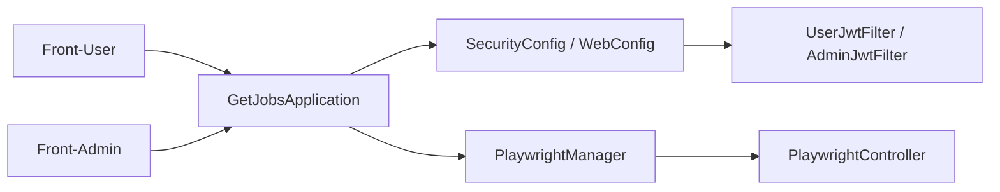

# 调试指南

<cite>
**本文引用的文件**   
- [GetJobsApplication.java](file://backend/src/main/java/com/getjobs/GetJobsApplication.java)
- [application.yaml](file://backend/src/main/resources/application.yaml)
- [application.yaml.template](file://scripts/application.yaml.template)
- [WebConfig.java](file://backend/src/main/java/com/getjobs/application/config/WebConfig.java)
- [SecurityConfig.java](file://backend/src/main/java/com/getjobs/application/config/SecurityConfig.java)
- [AdminFilterConfig.java](file://backend/src/main/java/com/getjobs/application/config/AdminFilterConfig.java)
- [AdminJwtFilter.java](file://backend/src/main/java/com/getjobs/application/filter/AdminJwtFilter.java)
- [UserJwtFilter.java](file://backend/src/main/java/com/getjobs/application/filter/UserJwtFilter.java)
- [PlaywrightController.java](file://backend/src/main/java/com/getjobs/application/controller/PlaywrightController.java)
- [PlaywrightManager.java](file://backend/src/main/java/com/getjobs/worker/manager/PlaywrightManager.java)
- [PlaywrightUtil.java](file://backend/src/main/java/com/getjobs/worker/utils/PlaywrightUtil.java)
- [package.json（前端）](file://front/package.json)
- [package.json（前端管理端）](file://front-admin/package.json)
</cite>

## 目录
1. [简介](#简介)
2. [项目结构](#项目结构)
3. [核心组件](#核心组件)
4. [架构总览](#架构总览)
5. [详细组件分析](#详细组件分析)
6. [依赖分析](#依赖分析)
7. [性能考虑](#性能考虑)
8. [故障排查指南](#故障排查指南)
9. [结论](#结论)
10. [附录](#附录)

## 简介
本指南面向开发者与高级用户，围绕 GetJobs 项目的调试实践提供系统化方法，覆盖浏览器开发者工具、Playwright 调试模式、日志分析、断点与变量监控、调用链追踪、网络请求与页面元素调试、自动化流程调试、性能分析与内存泄漏检测、以及远程调试与生产环境调试技巧。文档以代码为依据，结合配置文件与控制器示例，帮助快速定位问题并提升稳定性。

## 项目结构
GetJobs 采用前后端分离架构：
- 后端：Spring Boot 应用，提供 API、安全过滤、Playwright 管理与自动化能力。
- 前端：Next.js 应用（用户端与管理端），分别监听不同端口，支持开发与生产构建脚本。
- 配置：后端通过 application.yaml 与 application.yaml.template 提供数据库、日志、Playwright、MyBatis Plus 等配置。

**图表来源**
- [GetJobsApplication.java:15-22](file://backend/src/main/java/com/getjobs/GetJobsApplication.java#L15-L22)
- [application.yaml:1-101](file://backend/src/main/resources/application.yaml#L1-L101)
- [application.yaml.template:1-102](file://scripts/application.yaml.template#L1-L102)
- [WebConfig.java:14-36](file://backend/src/main/java/com/getjobs/application/config/WebConfig.java#L14-L36)
- [SecurityConfig.java:25-44](file://backend/src/main/java/com/getjobs/application/config/SecurityConfig.java#L25-L44)
- [AdminFilterConfig.java:18-26](file://backend/src/main/java/com/getjobs/application/config/AdminFilterConfig.java#L18-L26)
- [PlaywrightManager.java:114-221](file://backend/src/main/java/com/getjobs/worker/manager/PlaywrightManager.java#L114-L221)
- [PlaywrightController.java:16-39](file://backend/src/main/java/com/getjobs/application/controller/PlaywrightController.java#L16-L39)
- [package.json（前端）:5-14](file://front/package.json#L5-L14)
- [package.json（前端管理端）:5-10](file://front-admin/package.json#L5-L10)

**章节来源**
- [GetJobsApplication.java:15-22](file://backend/src/main/java/com/getjobs/GetJobsApplication.java#L15-L22)
- [application.yaml:1-101](file://backend/src/main/resources/application.yaml#L1-L101)
- [application.yaml.template:1-102](file://scripts/application.yaml.template#L1-L102)
- [package.json（前端）:5-14](file://front/package.json#L5-L14)
- [package.json（前端管理端）:5-10](file://front-admin/package.json#L5-L10)

## 核心组件
- 启动入口：Spring Boot 启动类负责扫描包与启用异步/定时任务。
- 安全与过滤：JWT 过滤器与 Web 配置统一拦截与放行规则，管理端与用户端分别校验。
- Playwright 管理：集中管理浏览器实例、上下文与多平台页面，提供状态查询与导航测试接口。
- 日志与配置：后端日志落盘与滚动策略、Playwright 超时与资源拦截配置、数据库连接池参数等。

**章节来源**
- [GetJobsApplication.java:15-22](file://backend/src/main/java/com/getjobs/GetJobsApplication.java#L15-L22)
- [WebConfig.java:14-36](file://backend/src/main/java/com/getjobs/application/config/WebConfig.java#L14-L36)
- [SecurityConfig.java:25-44](file://backend/src/main/java/com/getjobs/application/config/SecurityConfig.java#L25-L44)
- [AdminFilterConfig.java:18-26](file://backend/src/main/java/com/getjobs/application/config/AdminFilterConfig.java#L18-L26)
- [PlaywrightController.java:16-39](file://backend/src/main/java/com/getjobs/application/controller/PlaywrightController.java#L16-L39)
- [PlaywrightManager.java:114-221](file://backend/src/main/java/com/getjobs/worker/manager/PlaywrightManager.java#L114-L221)
- [application.yaml:42-53](file://backend/src/main/resources/application.yaml#L42-L53)
- [application.yaml:70-101](file://backend/src/main/resources/application.yaml#L70-L101)

## 架构总览
后端通过安全过滤链与拦截器对请求进行认证与放行，Playwright 管理器负责浏览器生命周期与多平台页面初始化，前端通过 Next.js 与后端交互。

**图表来源**
- [SecurityConfig.java:25-44](file://backend/src/main/java/com/getjobs/application/config/SecurityConfig.java#L25-L44)
- [WebConfig.java:26-35](file://backend/src/main/java/com/getjobs/application/config/WebConfig.java#L26-L35)
- [PlaywrightController.java:29-62](file://backend/src/main/java/com/getjobs/application/controller/PlaywrightController.java#L29-L62)
- [PlaywrightManager.java:114-221](file://backend/src/main/java/com/getjobs/worker/manager/PlaywrightManager.java#L114-L221)

## 详细组件分析

### Playwright 调试与自动化
- 启动与可视化：非无头模式启动，支持慢动作与远程调试端口，便于观察页面行为。
- 资源拦截：可选开启，降低内存占用与网络压力。
- 页面池与超时：统一超时配置与页面池复用，保障并发稳定性。
- 登录状态监控：对各平台页面导航事件进行监听，动态检测登录状态变化。
- 控制器接口：提供状态查询与导航测试，便于快速验证自动化链路。

**图表来源**
- [PlaywrightManager.java:114-221](file://backend/src/main/java/com/getjobs/worker/manager/PlaywrightManager.java#L114-L221)
- [PlaywrightController.java:16-39](file://backend/src/main/java/com/getjobs/application/controller/PlaywrightController.java#L16-L39)

**章节来源**
- [PlaywrightManager.java:114-221](file://backend/src/main/java/com/getjobs/worker/manager/PlaywrightManager.java#L114-L221)
- [PlaywrightController.java:29-62](file://backend/src/main/java/com/getjobs/application/controller/PlaywrightController.java#L29-L62)
- [application.yaml:70-101](file://backend/src/main/resources/application.yaml#L70-L101)

### 安全过滤与认证链
- 用户端 JWT 过滤：对大多数 /api/** 路径进行鉴权，放行注册、登录、健康检查与部分公开接口。
- 管理端 JWT 过滤：专门针对 /api/admin/* 路径进行鉴权，并在头部缺失或无效时返回标准 JSON 错误。
- Web 拦截器：统一注册 JWT 拦截器，排除健康检查与登录注册等路径。

**图表来源**
- [UserJwtFilter.java:26-81](file://backend/src/main/java/com/getjobs/application/filter/UserJwtFilter.java#L26-L81)
- [AdminJwtFilter.java:24-70](file://backend/src/main/java/com/getjobs/application/filter/AdminJwtFilter.java#L24-L70)
- [WebConfig.java:26-35](file://backend/src/main/java/com/getjobs/application/config/WebConfig.java#L26-L35)
- [AdminFilterConfig.java:18-26](file://backend/src/main/java/com/getjobs/application/config/AdminFilterConfig.java#L18-L26)

**章节来源**
- [UserJwtFilter.java:26-81](file://backend/src/main/java/com/getjobs/application/filter/UserJwtFilter.java#L26-L81)
- [AdminJwtFilter.java:24-70](file://backend/src/main/java/com/getjobs/application/filter/AdminJwtFilter.java#L24-L70)
- [WebConfig.java:26-35](file://backend/src/main/java/com/getjobs/application/config/WebConfig.java#L26-L35)
- [AdminFilterConfig.java:18-26](file://backend/src/main/java/com/getjobs/application/config/AdminFilterConfig.java#L18-L26)

### 日志与配置要点
- 日志级别与文件：根日志级别、控制台格式、文件路径与滚动策略。
- Playwright 调试参数：慢动作、导航超时、平台差异化超时、重试策略、资源拦截开关、页面池与空闲回收。
- 数据库连接池：最大连接数、空闲超时、最大生命周期、测试查询。

**章节来源**
- [application.yaml:42-53](file://backend/src/main/resources/application.yaml#L42-L53)
- [application.yaml:70-101](file://backend/src/main/resources/application.yaml#L70-L101)
- [application.yaml.template:70-102](file://scripts/application.yaml.template#L70-L102)

## 依赖分析
后端组件之间的耦合与职责划分清晰：启动类负责应用装配；安全与过滤模块统一处理认证；Playwright 管理器作为自动化核心，对外暴露控制器接口；前端通过 Next.js 与后端交互。

**图表来源**
- [GetJobsApplication.java:15-22](file://backend/src/main/java/com/getjobs/GetJobsApplication.java#L15-L22)
- [SecurityConfig.java:25-44](file://backend/src/main/java/com/getjobs/application/config/SecurityConfig.java#L25-L44)
- [WebConfig.java:14-36](file://backend/src/main/java/com/getjobs/application/config/WebConfig.java#L14-L36)
- [UserJwtFilter.java:26-81](file://backend/src/main/java/com/getjobs/application/filter/UserJwtFilter.java#L26-L81)
- [AdminJwtFilter.java:24-70](file://backend/src/main/java/com/getjobs/application/filter/AdminJwtFilter.java#L24-L70)
- [PlaywrightManager.java:114-221](file://backend/src/main/java/com/getjobs/worker/manager/PlaywrightManager.java#L114-L221)
- [PlaywrightController.java:16-39](file://backend/src/main/java/com/getjobs/application/controller/PlaywrightController.java#L16-L39)

**章节来源**
- [GetJobsApplication.java:15-22](file://backend/src/main/java/com/getjobs/GetJobsApplication.java#L15-L22)
- [SecurityConfig.java:25-44](file://backend/src/main/java/com/getjobs/application/config/SecurityConfig.java#L25-L44)
- [WebConfig.java:14-36](file://backend/src/main/java/com/getjobs/application/config/WebConfig.java#L14-L36)
- [UserJwtFilter.java:26-81](file://backend/src/main/java/com/getjobs/application/filter/UserJwtFilter.java#L26-L81)
- [AdminJwtFilter.java:24-70](file://backend/src/main/java/com/getjobs/application/filter/AdminJwtFilter.java#L24-L70)
- [PlaywrightManager.java:114-221](file://backend/src/main/java/com/getjobs/worker/manager/PlaywrightManager.java#L114-L221)
- [PlaywrightController.java:16-39](file://backend/src/main/java/com/getjobs/application/controller/PlaywrightController.java#L16-L39)

## 性能考虑
- Playwright 超时与慢动作：合理设置导航超时与 slow-mo，平衡稳定性与调试效率。
- 资源拦截：在高并发场景可启用资源拦截，降低内存与网络消耗。
- 页面池与空闲回收：通过页面池与空闲超时回收，避免资源泄露。
- 日志滚动：限制单文件大小与保留天数，避免磁盘膨胀。

**章节来源**
- [application.yaml:70-101](file://backend/src/main/resources/application.yaml#L70-L101)
- [application.yaml:42-53](file://backend/src/main/resources/application.yaml#L42-L53)

## 故障排查指南

### 浏览器开发者工具调试
- 打开浏览器开发者工具，切换到“Elements”查看页面 DOM 结构与属性；在“Network”面板观察请求与响应；在“Console”查看错误与警告。
- 对于 Playwright 自动化页面，可在启动参数中启用可视化模式与慢动作，便于观察元素交互与导航过程。

**章节来源**
- [PlaywrightManager.java:138-150](file://backend/src/main/java/com/getjobs/worker/manager/PlaywrightManager.java#L138-L150)

### Playwright 调试模式与断点
- 断点设置：在 Playwright 管理器初始化与导航逻辑的关键节点设置断点，观察页面状态与登录检测结果。
- 变量监控：监控页面对象、登录状态映射、超时配置与资源拦截开关。
- 调用链追踪：从控制器入口到管理器初始化再到各平台页面导航，逐步确认异常环节。

**章节来源**
- [PlaywrightController.java:29-62](file://backend/src/main/java/com/getjobs/application/controller/PlaywrightController.java#L29-L62)
- [PlaywrightManager.java:114-221](file://backend/src/main/java/com/getjobs/worker/manager/PlaywrightManager.java#L114-L221)

### 网络请求调试
- 在前端 Next.js 中使用 fetch 或封装的 API 客户端发起请求，观察 Network 面板的请求头、响应体与状态码。
- 后端安全过滤链对请求路径进行放行与鉴权，若出现 401，请检查 Authorization 头与 Token 有效性。

**章节来源**
- [UserJwtFilter.java:57-81](file://backend/src/main/java/com/getjobs/application/filter/UserJwtFilter.java#L57-L81)
- [AdminJwtFilter.java:45-70](file://backend/src/main/java/com/getjobs/application/filter/AdminJwtFilter.java#L45-L70)

### 页面元素调试
- 使用 PlaywrightUtil 的元素查找与等待方法，结合截图保存定位问题；必要时启用 Stealth 模式与反检测脚本。
- 对于登录状态检测，关注各平台的登录入口与用户信息容器，确保选择器稳定可靠。

**章节来源**
- [PlaywrightUtil.java:166-192](file://backend/src/main/java/com/getjobs/worker/utils/PlaywrightUtil.java#L166-L192)
- [PlaywrightUtil.java:425-487](file://backend/src/main/java/com/getjobs/worker/utils/PlaywrightUtil.java#L425-L487)
- [PlaywrightManager.java:336-369](file://backend/src/main/java/com/getjobs/worker/manager/PlaywrightManager.java#L336-L369)

### 自动化流程调试
- 通过控制器接口快速验证：先调用状态接口确认初始化与登录状态，再调用导航测试接口验证页面可达性。
- 若导航失败，检查平台差异化超时配置与重试策略，确认页面加载状态与网络空闲事件。

**章节来源**
- [PlaywrightController.java:29-62](file://backend/src/main/java/com/getjobs/application/controller/PlaywrightController.java#L29-L62)
- [PlaywrightManager.java:276-331](file://backend/src/main/java/com/getjobs/worker/manager/PlaywrightManager.java#L276-L331)

### 性能分析与内存泄漏检测
- 性能分析：结合浏览器性能面板与后端日志，定位耗时环节；调整 Playwright 超时与慢动作参数，评估对性能的影响。
- 内存泄漏：启用资源拦截降低内存占用；定期检查页面池统计与空闲回收；观察日志中的异常与重试次数。

**章节来源**
- [application.yaml:70-101](file://backend/src/main/resources/application.yaml#L70-L101)
- [PlaywrightManager.java:160-166](file://backend/src/main/java/com/getjobs/worker/manager/PlaywrightManager.java#L160-L166)

### 远程调试与生产环境调试
- 远程调试：使用固定 CDP 端口进行远程调试，确保浏览器非无头模式启动；在生产环境谨慎开启可视化调试。
- 生产环境调试：降低慢动作与资源拦截强度；严格控制日志级别与滚动策略；对敏感配置通过环境变量注入。

**章节来源**
- [PlaywrightManager.java:127-150](file://backend/src/main/java/com/getjobs/worker/manager/PlaywrightManager.java#L127-L150)
- [application.yaml:70-101](file://backend/src/main/resources/application.yaml#L70-L101)

## 结论
通过本调试指南，开发者可以系统地利用浏览器工具、Playwright 调试模式、日志分析与安全过滤链，快速定位并解决 GetJobs 项目中的问题。建议在开发与测试环境中充分验证自动化流程与登录状态检测，在生产环境中谨慎启用可视化调试与资源拦截，确保稳定性与性能的平衡。

## 附录

### 常用调试命令与端口
- 后端 API 端口：固定 18888（application.yaml）
- 前端用户端：dev 脚本（start-dev.mjs）
- 前端管理端：dev 脚本（next dev -p 6867）

**章节来源**
- [application.yaml:38-39](file://backend/src/main/resources/application.yaml#L38-L39)
- [package.json（前端）:5-14](file://front/package.json#L5-L14)
- [package.json（前端管理端）:5-10](file://front-admin/package.json#L5-L10)